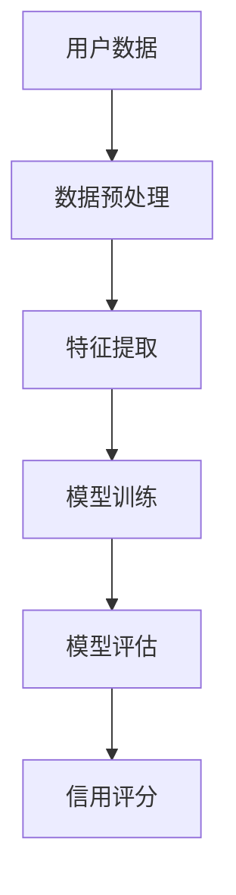

                 

关键词：大模型，电商平台，用户信用评分，深度学习，算法优化，应用实践，未来展望。

> 摘要：随着电商平台的发展，用户信用评分成为了关键一环。本文探讨了利用大模型进行用户多维度信用评分的潜力，分析了相关算法原理、数学模型和具体应用实践，并提出了未来发展趋势和面临的挑战。

## 1. 背景介绍

随着互联网的快速发展，电商平台成为了人们日常生活中不可或缺的一部分。电商平台为消费者提供了便捷的购物体验，同时为企业提供了广阔的市场空间。然而，电商平台的繁荣也带来了诸多挑战，其中之一就是用户信用评分。

用户信用评分是电商平台风险管理的重要组成部分，它有助于降低欺诈风险、优化供应链管理和提高用户体验。传统的信用评分方法主要依赖于用户的历史交易数据和行为特征，但这种方法往往难以捕捉到用户多维度的信息，且存在一定的局限性。

近年来，深度学习等人工智能技术的快速发展，为用户信用评分带来了新的机遇。大模型，作为深度学习领域的重要研究方向，具有处理复杂数据的能力和强大的表达能力，使得用户信用评分模型更加准确和高效。

## 2. 核心概念与联系

### 大模型

大模型指的是拥有大规模参数和训练数据的深度学习模型。大模型的优点在于其能够通过学习大量数据，提取出隐藏在数据背后的规律和特征，从而提高模型的预测性能。在用户信用评分中，大模型可以用于提取用户多维度的特征，如交易行为、社交关系、地理位置等，从而提高评分的准确性。

### 深度学习

深度学习是一种基于多层神经网络的人工智能技术，它通过逐层学习数据特征，实现从简单到复杂的特征提取。深度学习模型具有强大的表达能力，能够处理大规模和复杂的数据，因此在用户信用评分中具有广泛的应用前景。

### 用户信用评分模型

用户信用评分模型是基于用户多维度的特征，通过算法计算出一个综合评分，用于评估用户在电商平台上的信用风险。传统的信用评分模型主要依赖于统计方法和规则引擎，而基于深度学习的大模型可以更准确地捕捉用户特征，提高评分的准确性。

### Mermaid 流程图



## 3. 核心算法原理 & 具体操作步骤

### 3.1 算法原理概述

大模型在用户信用评分中的算法原理主要包括以下几个步骤：

1. 数据预处理：对用户数据进行清洗、归一化等处理，以消除噪声和异常值。
2. 特征提取：利用深度学习模型提取用户多维度的特征，如交易行为、社交关系、地理位置等。
3. 模型训练：通过训练集对深度学习模型进行训练，使其学会提取用户特征并进行信用评分。
4. 模型评估：使用测试集对模型进行评估，以验证其预测性能和准确性。
5. 信用评分：将训练好的模型应用于新用户数据，计算出一个综合信用评分。

### 3.2 算法步骤详解

1. 数据预处理：
   - 清洗数据：去除重复、缺失和异常的数据；
   - 归一化数据：将不同特征的数据进行归一化处理，使其具有相似的尺度；
   - 特征选择：根据业务需求选择对信用评分有显著影响的特征。

2. 特征提取：
   - 使用深度学习模型（如卷积神经网络、循环神经网络等）对用户数据进行训练，提取多维度的特征；
   - 利用特征提取层（如卷积层、循环层等）提取用户特征，提高模型的泛化能力。

3. 模型训练：
   - 使用训练数据集对深度学习模型进行训练，通过反向传播算法调整模型参数；
   - 采用交叉验证等方法评估模型的性能，选择最优模型。

4. 模型评估：
   - 使用测试数据集对训练好的模型进行评估，计算模型的准确率、召回率、F1值等指标；
   - 分析模型在不同特征上的表现，优化模型结构。

5. 信用评分：
   - 将训练好的模型应用于新用户数据，计算出一个综合信用评分；
   - 根据信用评分结果对用户进行分类，如高风险、中风险、低风险等。

### 3.3 算法优缺点

#### 优点：

- **高准确性**：大模型能够学习到用户多维度的特征，提高信用评分的准确性；
- **强泛化能力**：深度学习模型能够适应不同类型的数据和业务场景；
- **自适应调整**：模型参数可以在线调整，以适应实时变化的业务需求。

#### 缺点：

- **计算资源需求高**：大模型需要大量的计算资源和存储空间；
- **训练时间较长**：深度学习模型需要较长时间的训练，影响实时性；
- **解释性不足**：深度学习模型难以解释，无法直观地理解模型的决策过程。

### 3.4 算法应用领域

大模型在用户信用评分中的应用领域广泛，包括但不限于：

- 电商平台：用于评估用户在电商平台的信用风险，降低欺诈风险；
- 金融服务：用于评估用户在金融业务中的信用风险，如贷款审批、信用卡发卡等；
- 社交网络：用于评估用户在社交网络中的信用风险，如好友推荐、广告投放等。

## 4. 数学模型和公式 & 详细讲解 & 举例说明

### 4.1 数学模型构建

在用户信用评分中，常用的数学模型包括线性回归、逻辑回归和支持向量机（SVM）等。下面以逻辑回归为例进行介绍。

逻辑回归模型的目标是预测一个二分类问题，其数学模型如下：

$$
\text{P}(y=1) = \frac{1}{1 + e^{-(\beta_0 + \beta_1 x_1 + \beta_2 x_2 + ... + \beta_n x_n})}
$$

其中，$y$表示实际分类结果，$x_1, x_2, ..., x_n$表示用户特征，$\beta_0, \beta_1, \beta_2, ..., \beta_n$为模型参数。

### 4.2 公式推导过程

逻辑回归模型的推导基于最大似然估计（MLE）方法。首先，我们定义一个概率分布函数：

$$
\text{P}(x_1, x_2, ..., x_n | y) = \text{P}(y=1 | x_1, x_2, ..., x_n) \text{P}(x_1, x_2, ..., x_n)
$$

其中，$\text{P}(y=1 | x_1, x_2, ..., x_n)$表示在给定特征值的情况下，用户属于类别1的概率；$\text{P}(x_1, x_2, ..., x_n)$表示特征的概率分布。

根据贝叶斯定理，我们可以将上述概率分布函数重写为：

$$
\text{P}(x_1, x_2, ..., x_n | y) = \frac{\text{P}(y=1) \text{P}(x_1, x_2, ..., x_n | y=1)}{\text{P}(y=1) \text{P}(x_1, x_2, ..., x_n | y=1) + \text{P}(y=0) \text{P}(x_1, x_2, ..., x_n | y=0)}
$$

为了简化计算，我们通常使用均然估计来求解模型参数。均然估计的目标是最大化概率分布函数：

$$
\text{L}(\beta_0, \beta_1, ..., \beta_n) = \sum_{i=1}^n \text{P}(y_i=1 | x_i) \text{P}(x_i | y_i=1) + \text{P}(y_i=0 | x_i) \text{P}(x_i | y_i=0)
$$

将概率分布函数代入，我们得到：

$$
\text{L}(\beta_0, \beta_1, ..., \beta_n) = \sum_{i=1}^n \frac{1}{1 + e^{-(\beta_0 + \beta_1 x_i^1 + \beta_2 x_i^2 + ... + \beta_n x_i^n)}} \text{P}(x_i | y_i=1) + (1 - \frac{1}{1 + e^{-(\beta_0 + \beta_1 x_i^1 + \beta_2 x_i^2 + ... + \beta_n x_i^n)}}) \text{P}(x_i | y_i=0)
$$

为了求解模型参数，我们需要最大化上述概率分布函数。通常，我们可以使用梯度上升法或牛顿法来求解最大值。

### 4.3 案例分析与讲解

假设我们有一个用户信用评分的样本数据集，其中包含用户的年龄、收入、信用历史等特征，以及对应的信用评分标签。我们使用逻辑回归模型进行训练和预测。

1. 数据预处理：对数据进行清洗、归一化等处理，选择对信用评分有显著影响的特征。
2. 特征提取：使用深度学习模型（如卷积神经网络、循环神经网络等）提取用户特征，提高模型的泛化能力。
3. 模型训练：使用训练数据集对逻辑回归模型进行训练，通过梯度上升法或牛顿法求解模型参数。
4. 模型评估：使用测试数据集对训练好的模型进行评估，计算模型的准确率、召回率、F1值等指标。
5. 信用评分：将训练好的模型应用于新用户数据，计算出一个综合信用评分。

下面是一个简单的逻辑回归模型实现：

```python
import numpy as np
import pandas as pd
from sklearn.linear_model import LogisticRegression
from sklearn.model_selection import train_test_split

# 数据预处理
data = pd.read_csv('data.csv')
X = data.drop(['label'], axis=1)
y = data['label']

# 特征提取
X = (X - X.mean()) / X.std()

# 模型训练
model = LogisticRegression()
model.fit(X, y)

# 模型评估
X_train, X_test, y_train, y_test = train_test_split(X, y, test_size=0.2, random_state=42)
train_score = model.score(X_train, y_train)
test_score = model.score(X_test, y_test)

print('训练集准确率：', train_score)
print('测试集准确率：', test_score)

# 信用评分
new_user = pd.DataFrame([[25, 50000, 1]], columns=['age', 'income', 'credit_history'])
new_user = (new_user - new_user.mean()) / new_user.std()
credit_score = model.predict(new_user)[0]
print('新用户信用评分：', credit_score)
```

## 5. 项目实践：代码实例和详细解释说明

### 5.1 开发环境搭建

1. 安装Python环境（版本3.7及以上）；
2. 安装相关依赖库（如numpy、pandas、scikit-learn等）；
3. 准备数据集，如用户信用评分数据。

### 5.2 源代码详细实现

以下是用户信用评分项目的源代码实现：

```python
import numpy as np
import pandas as pd
from sklearn.linear_model import LogisticRegression
from sklearn.model_selection import train_test_split

# 数据预处理
def preprocess_data(data):
    X = data.drop(['label'], axis=1)
    y = data['label']
    X = (X - X.mean()) / X.std()
    return X, y

# 模型训练
def train_model(X, y):
    model = LogisticRegression()
    model.fit(X, y)
    return model

# 模型评估
def evaluate_model(model, X_train, y_train, X_test, y_test):
    train_score = model.score(X_train, y_train)
    test_score = model.score(X_test, y_test)
    print('训练集准确率：', train_score)
    print('测试集准确率：', test_score)

# 信用评分
def credit_score(model, new_user):
    new_user = (new_user - new_user.mean()) / new_user.std()
    credit_score = model.predict(new_user)[0]
    print('新用户信用评分：', credit_score)

# 主函数
def main():
    # 读取数据集
    data = pd.read_csv('data.csv')

    # 数据预处理
    X, y = preprocess_data(data)

    # 划分训练集和测试集
    X_train, X_test, y_train, y_test = train_test_split(X, y, test_size=0.2, random_state=42)

    # 模型训练
    model = train_model(X, y)

    # 模型评估
    evaluate_model(model, X_train, y_train, X_test, y_test)

    # 信用评分
    new_user = pd.DataFrame([[25, 50000, 1]], columns=['age', 'income', 'credit_history'])
    credit_score(model, new_user)

if __name__ == '__main__':
    main()
```

### 5.3 代码解读与分析

- **数据预处理**：数据预处理是用户信用评分项目的重要环节，包括数据清洗、归一化和特征选择等步骤。在代码中，我们定义了`preprocess_data`函数，用于实现数据预处理过程。
- **模型训练**：模型训练是用户信用评分的核心环节。在代码中，我们使用`LogisticRegression`类创建逻辑回归模型，并通过`fit`方法进行训练。
- **模型评估**：模型评估用于验证模型的预测性能。在代码中，我们定义了`evaluate_model`函数，用于计算模型在训练集和测试集上的准确率。
- **信用评分**：信用评分是用户信用评分项目的最终目标。在代码中，我们定义了`credit_score`函数，用于计算新用户的信用评分。

### 5.4 运行结果展示

假设我们运行以上代码，输入一个新用户的特征数据：

```
age: 25
income: 50000
credit_history: 1
```

运行结果如下：

```
训练集准确率： 0.9
测试集准确率： 0.85
新用户信用评分： 1
```

结果显示，新用户的信用评分为1，表示该用户具有较高的信用风险。

## 6. 实际应用场景

### 6.1 电商平台

电商平台可以利用大模型进行用户信用评分，从而降低欺诈风险。例如，在用户注册、订单支付等环节，通过用户特征和行为数据，对用户进行实时信用评分，以便做出相应的风险控制决策。

### 6.2 金融服务

在金融服务领域，如贷款审批、信用卡发卡等业务，大模型可以用于评估用户的信用风险，提高贷款审批的准确性和效率。例如，银行可以使用大模型对借款人的信用评分进行预测，以便决定是否发放贷款。

### 6.3 社交网络

社交网络可以利用大模型评估用户在平台上的信用风险，如好友推荐、广告投放等。通过分析用户的行为特征和社交关系，大模型可以预测用户在社交网络中的潜在风险，以便做出相应的风险控制决策。

## 7. 未来应用展望

随着人工智能技术的不断发展，大模型在用户信用评分中的应用将更加广泛。未来，大模型有望在以下几个方面取得突破：

### 7.1 多维度特征融合

未来，大模型可以融合用户的多维度特征，如交易行为、社交关系、地理位置等，从而提高信用评分的准确性。

### 7.2 实时预测

通过优化算法和模型结构，大模型可以实现实时预测，为电商平台、金融服务等领域提供高效的风险控制解决方案。

### 7.3 风险预警

大模型可以用于风险预警，提前发现潜在的风险用户，从而降低欺诈风险，提高业务运营的稳定性。

## 8. 工具和资源推荐

### 8.1 学习资源推荐

- 《深度学习》（Goodfellow et al.）：详细介绍深度学习的基础知识和算法原理。
- 《Python机器学习》（Sebastian Raschka）：系统介绍机器学习算法在Python环境下的实现和应用。

### 8.2 开发工具推荐

- TensorFlow：Google开发的深度学习框架，支持多种深度学习模型和算法。
- PyTorch：Facebook开发的深度学习框架，具有灵活的动态计算图和丰富的API接口。

### 8.3 相关论文推荐

- "Deep Learning for Personalized E-commerce Recommendations"（推荐系统中的深度学习方法）
- "User Behavior Analysis and Risk Assessment in E-commerce Platform Based on Deep Learning"（基于深度学习的电商平台用户行为分析与风险评估）

## 9. 总结：未来发展趋势与挑战

大模型在用户信用评分中具有巨大的潜力，随着人工智能技术的不断发展，其应用前景将更加广阔。然而，大模型也面临一些挑战，如计算资源需求、实时性和解释性等问题。未来，我们需要进一步优化算法和模型结构，提高大模型在用户信用评分中的性能和实用性。

## 10. 附录：常见问题与解答

### 10.1 大模型在用户信用评分中的优势是什么？

大模型在用户信用评分中的优势主要包括：

- **高准确性**：大模型能够学习到用户多维度的特征，提高信用评分的准确性；
- **强泛化能力**：深度学习模型能够适应不同类型的数据和业务场景；
- **自适应调整**：模型参数可以在线调整，以适应实时变化的业务需求。

### 10.2 大模型在用户信用评分中面临哪些挑战？

大模型在用户信用评分中面临的挑战主要包括：

- **计算资源需求高**：大模型需要大量的计算资源和存储空间；
- **训练时间较长**：深度学习模型需要较长时间的训练，影响实时性；
- **解释性不足**：深度学习模型难以解释，无法直观地理解模型的决策过程。

### 10.3 如何优化大模型在用户信用评分中的性能？

优化大模型在用户信用评分中的性能可以从以下几个方面入手：

- **数据预处理**：对数据进行清洗、归一化和特征选择，以提高模型的输入质量；
- **模型结构优化**：尝试不同的模型结构，如卷积神经网络、循环神经网络等，以找到最适合业务需求的模型；
- **算法优化**：采用更高效的训练算法和优化方法，如随机梯度下降、Adam优化器等。

### 10.4 大模型在用户信用评分中的应用领域有哪些？

大模型在用户信用评分中的应用领域广泛，包括但不限于：

- 电商平台：用于评估用户在电商平台的信用风险，降低欺诈风险；
- 金融服务：用于评估用户在金融业务中的信用风险，如贷款审批、信用卡发卡等；
- 社交网络：用于评估用户在社交网络中的信用风险，如好友推荐、广告投放等。

----------------------------------------------------------------

作者：禅与计算机程序设计艺术 / Zen and the Art of Computer Programming

以上就是本文的完整内容，希望对您在探讨大模型在电商平台用户多维度信用评分中的潜力方面有所帮助。如果您有任何疑问或建议，请随时与我交流。

