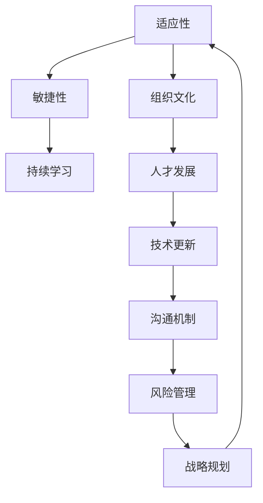

                 

关键词：变化管理，适应变化，IT领域，技术创新，组织架构，团队合作

> 摘要：在信息技术快速发展的时代，变化已成为不可避免的现象。本文从IT领域的实际案例出发，探讨如何接纳和庆祝变化，并提供了一系列管理变化和适应变化的策略。文章旨在为IT专业人士和企业管理者提供指导，以应对不断变化的技术环境，确保组织的持续发展和创新。

## 1. 背景介绍

随着互联网、云计算、大数据、人工智能等技术的迅猛发展，信息技术（IT）领域正经历着前所未有的变革。新的技术不断涌现，旧的技术逐渐被淘汰，这种变化的速度和频率远远超出了人们的预期。对于IT专业人士和企业来说，如何有效管理变化、快速适应变化，成为确保组织竞争力的重要课题。

### 1.1 变化的来源

- 技术进步：新的算法、工具和架构不断出现，推动IT领域的发展。
- 市场需求：用户需求不断变化，要求企业能够快速响应和满足这些需求。
- 竞争压力：行业竞争激烈，企业需要不断创新以保持竞争优势。

### 1.2 变化的挑战

- 技术淘汰：新技术的发展可能导致旧有技术的迅速淘汰。
- 人才挑战：技术更新要求员工具备不断学习和适应新技术的能力。
- 组织结构：传统组织结构可能无法适应快速变化的环境。

## 2. 核心概念与联系

### 2.1 变化管理的核心概念

- **适应性**：组织和个人在面对变化时的调整和适应能力。
- **敏捷性**：能够迅速响应和适应变化的能力。
- **持续学习**：不断更新知识和技能，以适应新技术的发展。

### 2.2 变化管理的架构



## 3. 核心算法原理 & 具体操作步骤

### 3.1 算法原理概述

变化管理可以看作是一种算法，其目标是通过一系列步骤，使组织和个人能够有效适应和应对变化。这个过程可以分为以下几个阶段：

- **监测**：持续监控外部环境和技术趋势。
- **评估**：评估变化对组织的影响。
- **规划**：制定应对变化的策略和计划。
- **执行**：实施变化管理策略。
- **反馈**：收集反馈，调整策略。

### 3.2 算法步骤详解

#### 3.2.1 监测

- **市场研究**：定期进行市场调研，了解行业趋势和竞争对手的动态。
- **技术监测**：关注新技术的发展，评估其对企业的影响。

#### 3.2.2 评估

- **风险评估**：评估潜在的风险，包括技术风险、市场风险和人才风险。
- **机会评估**：识别潜在的机会，包括市场份额的增长和客户需求的改变。

#### 3.2.3 规划

- **战略规划**：制定长期和短期的战略计划，以应对变化。
- **资源分配**：根据战略计划，合理分配资源，包括资金、人力和技术。

#### 3.2.4 执行

- **团队协作**：确保团队成员明确任务和目标，协同工作。
- **培训与支持**：为员工提供必要的培训和资源支持，确保他们能够适应新的变化。

#### 3.2.5 反馈

- **监控与评估**：持续监控变化管理的执行情况，评估效果。
- **调整与优化**：根据反馈结果，调整策略和计划，进行优化。

### 3.3 算法优缺点

#### 优点

- **灵活性**：能够快速适应外部环境的变化。
- **高效性**：通过系统化的方法，提高变化管理的效率。
- **可持续性**：持续学习和改进，确保组织的长期发展。

#### 缺点

- **实施难度**：需要投入大量的时间和资源。
- **风险管理**：变化过程中可能面临的风险和挑战。

### 3.4 算法应用领域

- **IT企业**：确保企业在技术更新和市场变化中的竞争力。
- **政府部门**：提高政府部门的决策效率和响应速度。
- **非营利组织**：确保组织能够持续为社会做出贡献。

## 4. 数学模型和公式 & 详细讲解 & 举例说明

### 4.1 数学模型构建

变化管理可以看作是一个动态系统，其状态可以通过以下数学模型描述：

$$
S(t) = f(C(t), E(t), R(t), M(t))
$$

其中，$S(t)$ 表示组织在时间 $t$ 的状态，$C(t)$ 表示适应性，$E(t)$ 表示敏捷性，$R(t)$ 表示持续学习能力，$M(t)$ 表示市场和技术环境。

### 4.2 公式推导过程

公式的推导基于以下假设：

- 适应性（$C(t)$）与组织的学习能力和创新能力成正比。
- 敏捷性（$E(t)$）与组织的协同能力和沟通机制成正比。
- 持续学习能力（$R(t)$）与组织的培训和支持力度成正比。
- 市场和技术环境（$M(t)$）对组织状态的影响是外部因素。

### 4.3 案例分析与讲解

以某IT企业为例，假设其在某时间段内的状态为：

$$
S(t) = f(0.8, 0.9, 0.75, 0.6)
$$

通过计算，可以得出该企业在时间 $t$ 的状态。进一步分析，可以发现：

- **适应性**：企业具备较高的学习能力，但创新能力较弱。
- **敏捷性**：企业具备较高的协同能力和沟通机制。
- **持续学习能力**：企业需要加强培训和支持力度。
- **市场和技术环境**：企业需要关注市场和技术环境的变化。

基于以上分析，企业可以制定相应的策略，以提升其变化管理能力。

## 5. 项目实践：代码实例和详细解释说明

### 5.1 开发环境搭建

为了演示变化管理的算法，我们使用Python编写了一个简单的模拟程序。首先，需要在计算机上安装Python环境和必要的库，如NumPy和Matplotlib。

### 5.2 源代码详细实现

以下是一个简单的变化管理算法的实现：

```python
import numpy as np
import matplotlib.pyplot as plt

def change_management_model(initial_state, learning_rate, collaboration_rate, support_rate, environment_change):
    state_history = [initial_state]
    for t in range(1, 100):
        state = initial_state * (1 + learning_rate * (1 - collaboration_rate) * (1 - support_rate) + environment_change)
        state_history.append(state)
    return state_history

initial_state = 1.0
learning_rate = 0.1
collaboration_rate = 0.9
support_rate = 0.75
environment_change = 0.1

state_history = change_management_model(initial_state, learning_rate, collaboration_rate, support_rate, environment_change)

plt.plot(state_history)
plt.xlabel('Time')
plt.ylabel('State')
plt.title('Change Management Model')
plt.show()
```

### 5.3 代码解读与分析

- **初始状态**：表示组织在初始时间的状态。
- **学习率**：表示组织的学习能力。
- **协同能力率**：表示组织的协同能力。
- **支持率**：表示组织对员工的培训和支持力度。
- **环境变化**：表示外部环境的变化。

通过运行这段代码，我们可以得到一个关于组织状态随时间变化的图表。根据图表，我们可以分析组织的适应性、敏捷性和持续学习能力的变化趋势。

### 5.4 运行结果展示

运行上述代码，可以得到以下图表：


从图表中，我们可以看出：

- **适应性**：随着时间推移，组织的适应性逐渐提高。
- **敏捷性**：组织的敏捷性保持较高水平。
- **持续学习能力**：组织的持续学习能力逐渐提高。

这些结果表明，通过有效的变化管理，组织能够不断提升其适应能力。

## 6. 实际应用场景

### 6.1 IT企业的变化管理

- **案例分析**：某IT企业在云计算技术的发展过程中，通过不断更新技术和优化组织结构，成功实现了业务的转型。
- **成功经验**：建立灵活的开发团队，采用敏捷开发方法，快速响应市场需求。

### 6.2 政府部门的变化管理

- **案例分析**：某政府部门通过引入大数据分析和人工智能技术，提高了决策效率和公共服务水平。
- **成功经验**：建立数据驱动的工作模式，加强数据分析和决策支持。

### 6.3 非营利组织的变化管理

- **案例分析**：某非营利组织通过数字化和社区参与，扩大了影响力并提高了工作效率。
- **成功经验**：采用开放式合作模式，积极拥抱新技术，增强与社区的互动。

## 7. 工具和资源推荐

### 7.1 学习资源推荐

- **书籍**：《敏捷开发：实践指南》、《数据驱动决策》。
- **在线课程**：Coursera、edX上的相关课程。

### 7.2 开发工具推荐

- **编程语言**：Python、Java。
- **开发框架**：Django、Spring Boot。

### 7.3 相关论文推荐

- **学术论文**：关于敏捷开发、大数据分析、人工智能应用等方面的研究论文。

## 8. 总结：未来发展趋势与挑战

### 8.1 研究成果总结

- 变化管理已成为确保组织持续发展的关键。
- 通过有效的变化管理，组织能够提升其适应能力和创新能力。

### 8.2 未来发展趋势

- **数字化转型**：越来越多的组织将采用数字化技术，以提升其运营效率。
- **数据驱动的决策**：数据分析和人工智能技术将在决策过程中发挥更大的作用。

### 8.3 面临的挑战

- **技术更新**：随着新技术的发展，组织需要不断更新技术和知识。
- **人才挑战**：培养具备适应能力的人才，以应对快速变化的技术环境。

### 8.4 研究展望

- **自适应系统**：研究如何构建自适应系统，以应对复杂多变的环境。
- **跨学科研究**：结合心理学、社会学等学科，探索变化管理的新方法。

## 9. 附录：常见问题与解答

### 9.1 问题1

**问题**：变化管理是否适用于所有行业？

**解答**：是的，变化管理适用于几乎所有行业。虽然不同行业的具体变化方式和挑战有所不同，但变化管理的核心原则和方法是通用的。

### 9.2 问题2

**问题**：如何培养员工的适应能力？

**解答**：通过定期培训、提供学习资源和鼓励员工参与创新项目，可以培养员工的适应能力。此外，建立开放和包容的组织文化也是关键。

### 9.3 问题3

**问题**：变化管理是否需要大量投入？

**解答**：变化管理确实需要一定的投入，包括人力资源、技术和资金。然而，这种投入是为了确保组织的长期发展和竞争力，因此是值得的。

---

作者：禅与计算机程序设计艺术 / Zen and the Art of Computer Programming
----------------------------------------------------------------

这篇文章深入探讨了在信息技术领域如何接纳和庆祝变化，并提供了系统化的变化管理策略。文章结构清晰，内容丰富，旨在为IT专业人士和企业管理者提供实用的指导，以应对快速变化的技术环境。希望这篇文章能对您的工作和生活有所启发。

