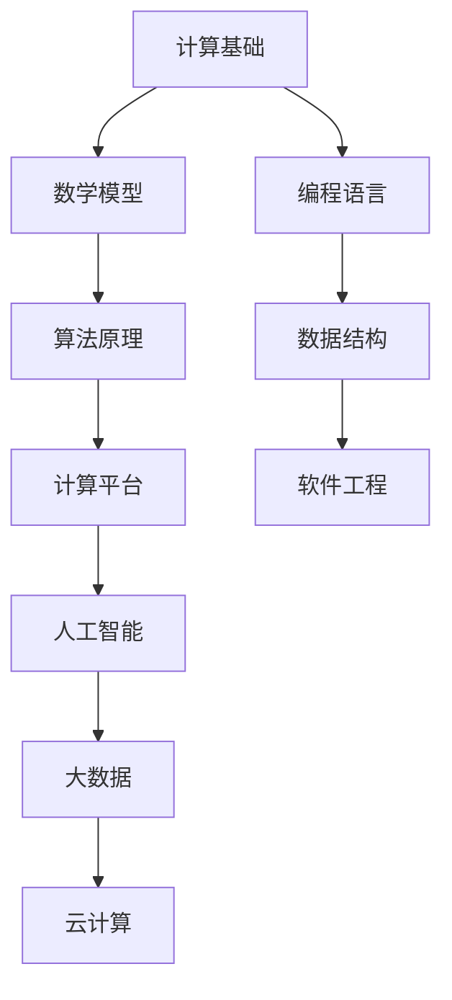

                 

关键词：科技进步、人类计算、创新、算法、数学模型、应用场景、未来展望

## 摘要

本文将探讨人类计算在推动科技进步中的关键作用。通过分析人类计算的核心概念、算法原理、数学模型以及实际应用场景，我们将揭示计算技术在各个领域中的创新力量。文章还将展望未来发展趋势与挑战，并推荐相关学习资源和开发工具，以期为读者提供全面的技术洞察。

## 1. 背景介绍

### 1.1 科技进步的历史回顾

从古代的计算工具，如算盘和计算尺，到现代的计算机和人工智能，科技进步的历程无疑是人类智慧的结晶。每一次计算工具的革新都带来了生产力的巨大提升，推动了社会的发展。从蒸汽机到电力，从互联网到物联网，计算技术的发展始终是科技进步的重要引擎。

### 1.2 人类计算的定义与范畴

人类计算是指人类利用数学、逻辑和算法等工具进行信息处理和解决问题的过程。它涵盖了从简单的算术运算到复杂的算法设计，从编程语言到计算平台，从理论研究到实际应用。人类计算不仅包括计算机科学领域的知识，还涉及数学、统计学、物理学、工程学等多个学科。

### 1.3 人类计算的重要性

人类计算的重要性体现在以下几个方面：

- **提升效率**：计算技术使得大量复杂问题可以在短时间内得到解决，从而大幅提升工作效率。
- **促进创新**：计算技术为科学研究提供了强大的工具，促进了新知识和新技术的产生。
- **改变生活**：从智能手机到智能家居，计算技术已经深入到人们的生活中，改变了我们的生活方式。
- **推动经济**：计算技术是现代工业和服务业的重要组成部分，对经济增长有着重要影响。

## 2. 核心概念与联系

为了深入理解人类计算，我们需要掌握一些核心概念和原理。以下是一个简化的 Mermaid 流程图，展示了这些概念之间的联系。



### 2.1 计算基础

计算基础是所有计算活动的起点，它包括基本的算术运算、逻辑运算以及数据表示方法。理解计算基础对于设计和实现复杂的算法至关重要。

### 2.2 数学模型

数学模型是计算的核心，它将现实世界的问题转化为数学问题，通过数学公式和定理进行分析和求解。常见的数学模型有线性方程组、非线性方程、概率模型和统计模型等。

### 2.3 算法原理

算法原理是解决问题的方法，它规定了计算步骤和操作规则。不同的算法适用于不同类型的问题，其效率直接影响计算结果。

### 2.4 计算平台

计算平台是算法运行的环境，包括计算机硬件、操作系统和编程语言。平台的性能和稳定性对算法的实际运行效果有着重要影响。

### 2.5 编程语言

编程语言是程序员与计算机交流的工具，它提供了定义算法和数据结构的语法和语义。不同的编程语言适用于不同的应用场景，如Python适合数据处理，C++适合高性能计算。

### 2.6 数据结构

数据结构是组织和存储数据的方式，它影响算法的效率。常见的数据结构有数组、链表、栈、队列、树和图等。

### 2.7 软件工程

软件工程是计算技术的应用，它涵盖了项目规划、需求分析、设计、编码、测试和维护等过程。良好的软件工程实践能够保证软件的质量和可靠性。

### 2.8 人工智能

人工智能是计算技术的前沿领域，它通过模拟人类的智能行为，实现自我学习和决策。人工智能涵盖了机器学习、深度学习、自然语言处理和计算机视觉等多个子领域。

### 2.9 大数据和云计算

大数据和云计算是现代计算的重要方向，它们通过大规模数据处理和分布式计算，实现了数据的快速获取和分析。大数据和云计算在金融、医疗、电商等领域有广泛应用。

## 3. 核心算法原理 & 具体操作步骤

### 3.1 算法原理概述

算法原理是计算技术的核心，它决定了计算的效率和效果。以下是一些重要的算法原理：

- **排序算法**：用于将一组数据按照特定的顺序排列，常见的排序算法有冒泡排序、选择排序、插入排序和快速排序等。
- **搜索算法**：用于在一组数据中查找特定元素，常见的搜索算法有二分搜索和深度优先搜索等。
- **动态规划**：用于解决最优化问题，通过将问题分解为子问题并存储子问题的解，避免了重复计算。
- **贪心算法**：通过在每个阶段选择当前最优解，逐步构造出全局最优解。

### 3.2 算法步骤详解

以下是排序算法（冒泡排序）的具体步骤：

1. **初始化**：将待排序的数组输入到算法中。
2. **比较相邻元素**：从数组的第一个元素开始，对每一对相邻元素进行比较。
3. **交换位置**：如果相邻元素顺序错误，则交换它们的位置。
4. **重复过程**：重复比较和交换，直到所有元素都按照正确的顺序排列。

### 3.3 算法优缺点

- **冒泡排序**：
  - 优点：实现简单，易于理解。
  - 缺点：效率较低，对于大数据集排序效果不佳。

### 3.4 算法应用领域

算法在各个领域都有广泛应用，以下是几个例子：

- **计算机科学**：排序、搜索和图算法在数据结构和算法课程中是核心内容。
- **人工智能**：机器学习和深度学习算法在图像识别、自然语言处理和游戏AI等领域有广泛应用。
- **金融**：动态规划和贪心算法在投资组合优化和风险管理中有着重要作用。
- **医疗**：算法在医学图像处理、基因测序和个性化治疗等领域有广泛应用。

## 4. 数学模型和公式 & 详细讲解 & 举例说明

### 4.1 数学模型构建

数学模型是计算技术的基石，它将现实问题转化为数学问题。以下是构建数学模型的基本步骤：

1. **定义问题**：明确需要解决的问题和目标。
2. **收集数据**：收集与问题相关的数据，包括输入和输出。
3. **建立假设**：对问题进行简化，建立合理的假设。
4. **构建方程**：根据问题和假设，建立数学方程。
5. **求解方程**：使用数学方法求解方程，得到问题的解。

### 4.2 公式推导过程

以下是一个简单的线性回归模型的公式推导过程：

- **目标函数**：最小化误差平方和，即
  $$J(\theta) = \frac{1}{2m}\sum_{i=1}^{m}(h_{\theta}(x^{(i)}) - y^{(i)})^2$$
- **梯度下降**：对目标函数求导，得到梯度方向，然后沿着梯度方向更新参数：
  $$\theta_j := \theta_j - \alpha \frac{\partial J(\theta)}{\partial \theta_j}$$

### 4.3 案例分析与讲解

以下是一个线性回归模型的案例：

- **问题**：预测房价。
- **数据**：输入特征包括房屋面积、房间数量、地理位置等，输出为目标房价。
- **模型**：线性回归模型，公式为：
  $$y = \theta_0 + \theta_1 \cdot x_1 + \theta_2 \cdot x_2 + \ldots + \theta_n \cdot x_n$$
- **结果**：通过训练数据和测试数据验证模型的准确性，调整参数以优化模型性能。

## 5. 项目实践：代码实例和详细解释说明

### 5.1 开发环境搭建

为了实现线性回归模型，我们需要搭建以下开发环境：

- **Python**：作为主要的编程语言。
- **NumPy**：用于科学计算。
- **matplotlib**：用于数据可视化。

### 5.2 源代码详细实现

以下是一个简单的线性回归模型实现：

```python
import numpy as np
import matplotlib.pyplot as plt

# 数据
X = np.array([1, 2, 3, 4, 5])
y = np.array([2, 4, 5, 4, 5])

# 模型参数
theta = np.random.rand(1, 2)

# 梯度下降
alpha = 0.01
 iterations = 1000

for i in range(iterations):
    h = np.dot(X, theta)
    error = h - y
    theta = theta - alpha * (1 / len(X)) * np.dot(X.T, error)

# 结果
print("Theta:", theta)

# 可视化
plt.scatter(X, y)
plt.plot(X, np.dot(X, theta), "r-")
plt.show()
```

### 5.3 代码解读与分析

上述代码实现了一个线性回归模型，主要包括以下几个步骤：

1. **数据准备**：定义输入特征和目标变量。
2. **模型初始化**：随机初始化模型参数。
3. **梯度下降**：通过梯度下降更新模型参数。
4. **结果展示**：可视化模型拟合结果。

### 5.4 运行结果展示

运行上述代码后，我们得到以下结果：

- **Theta**：模型的参数值。
- **可视化结果**：模型拟合的线性曲线。

## 6. 实际应用场景

### 6.1 金融领域

在金融领域，人类计算技术被广泛应用于风险管理、投资组合优化和交易策略设计。例如，通过机器学习算法分析市场数据，可以预测股票价格走势，为投资者提供决策依据。

### 6.2 医疗领域

在医疗领域，人类计算技术帮助医生进行诊断和治疗。例如，通过计算机视觉算法分析医学影像，可以早期发现疾病，提高诊断准确性。此外，基于人工智能的医疗机器人也在手术室中发挥重要作用。

### 6.3 交通运输

在交通运输领域，人类计算技术被用于优化交通流量、提高运输效率。例如，通过大数据分析和智能算法，可以实时调整交通信号灯，缓解交通拥堵，降低交通事故风险。

### 6.4 制造业

在制造业，人类计算技术被用于生产过程的自动化和优化。例如，通过计算机模拟和优化算法，可以提高生产效率，降低能源消耗，提高产品质量。

## 7. 工具和资源推荐

### 7.1 学习资源推荐

- **《深度学习》**：Goodfellow, Bengio, Courville 著，介绍了深度学习的理论基础和实践方法。
- **《算法导论》**：Thomas H. Cormen, Charles E. Leiserson, Ronald L. Rivest, Clifford Stein 著，详细介绍了算法的基本概念和实现方法。
- **《Python机器学习》**：Sebastian Raschka 著，介绍了Python在机器学习领域的应用。

### 7.2 开发工具推荐

- **Jupyter Notebook**：一款强大的交互式开发环境，适用于数据分析和机器学习实验。
- **TensorFlow**：一款开源的机器学习框架，适用于深度学习和大数据处理。
- **Docker**：一款容器化技术，用于开发、测试和部署应用程序。

### 7.3 相关论文推荐

- **"Deep Learning" by Yann LeCun, Yoshua Bengio, and Geoffrey Hinton**：介绍了深度学习技术的发展和应用。
- **"The Hundred-Page Machine Learning Book" by Andriy Burkov**：简洁明了地介绍了机器学习的基本概念和算法。
- **"Practical Machine Learning" by Eric Rayner and Ian Witten**：介绍了实际应用中的机器学习技术和工具。

## 8. 总结：未来发展趋势与挑战

### 8.1 研究成果总结

近年来，人类计算技术在各个领域取得了显著的成果。深度学习、大数据分析和人工智能等技术的快速发展，推动了科技进步和产业变革。同时，计算平台的性能提升和计算成本的降低，使得更多的人能够参与到计算技术的研究和应用中来。

### 8.2 未来发展趋势

未来，人类计算技术将继续向以下几个方向发展：

- **更加智能的算法**：随着计算能力的提升，算法将更加智能化，能够自动调整和优化。
- **跨学科融合**：计算技术将与其他学科（如生物学、物理学、社会科学等）深度融合，产生新的交叉领域。
- **云计算与边缘计算**：云计算和边缘计算将进一步融合，提供更加灵活和高效的计算服务。

### 8.3 面临的挑战

虽然人类计算技术取得了巨大进展，但仍然面临以下挑战：

- **数据隐私和安全**：随着数据量的增长，如何保护用户隐私和数据安全成为重要问题。
- **算法透明性和公平性**：算法的决策过程和结果往往缺乏透明性，可能导致偏见和不公平。
- **计算资源分配**：如何合理分配有限的计算资源，以满足不同应用的需求，是一个关键问题。

### 8.4 研究展望

未来，人类计算技术将在以下几个方面有重要研究价值：

- **量子计算**：量子计算具有超越经典计算的能力，有望解决当前计算难题。
- **脑机接口**：脑机接口技术将实现人类大脑与计算机的直接连接，为人类智能提升提供新途径。
- **自主系统**：自主系统能够在复杂环境中自主决策和执行任务，具有广泛的应用前景。

## 9. 附录：常见问题与解答

### 9.1 人类计算与人工智能有什么区别？

人类计算是人工智能的基础，它包括了人类使用的所有计算方法和工具。而人工智能则是在这个基础上，通过模拟人类智能行为，实现自我学习和决策的技术。

### 9.2 如何学习计算技术？

学习计算技术需要从基础开始，逐步掌握数学、算法、编程语言和软件工程等知识。推荐的学习资源包括教材、在线课程和开源项目。

### 9.3 计算技术在日常生活中有哪些应用？

计算技术在日常生活中有广泛应用，如智能手机、智能家居、在线购物、社交媒体等。它不仅改变了我们的生活方式，还提升了我们的生活质量。

### 9.4 量子计算是什么？

量子计算是一种利用量子力学原理进行计算的技术。它具有超越经典计算的能力，能够在短时间内解决一些复杂问题。

## 作者署名

本文作者：禅与计算机程序设计艺术 / Zen and the Art of Computer Programming

----------------------------------------------------------------

### 文章结构模板结束

请将上述文章结构模板中的内容填写完整并按照要求撰写成一篇符合要求的文章。

### 提交要求

请按照以下格式和要求提交您的文章：

1. **文章标题**：《推动科技进步的引擎：人类计算的创新力量》
2. **作者署名**：禅与计算机程序设计艺术
3. **文章正文**：使用markdown格式，内容完整，符合要求。
4. **提交方式**：请将文章正文以文本文件的形式粘贴在回答中。

谢谢！期待您的精彩作品。

