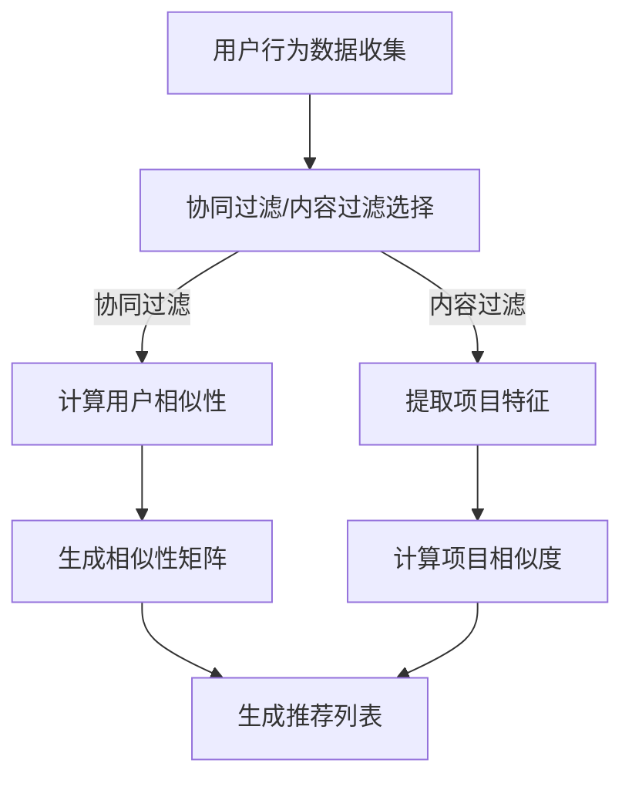

                 

关键词：推荐系统、协同过滤、内容过滤、算法原理、代码实例、实际应用、数学模型

## 摘要

推荐系统作为现代信息过滤和检索技术的核心，旨在解决信息过载问题，为用户推荐其可能感兴趣的内容。本文将详细介绍推荐系统的基本概念、核心算法原理以及如何通过实际代码实例进行应用和优化。文章首先从背景介绍入手，然后深入探讨推荐系统的核心概念与联系，接着详细讲解协同过滤和内容过滤两大核心算法的原理与具体操作步骤，再通过数学模型和公式进行公式推导与案例分析。最后，本文将结合项目实践展示代码实例和详细解释，并探讨推荐系统在实际应用场景中的广泛应用及未来应用展望。希望通过本文，读者能够对推荐系统有更深入的理解，并能够运用到实际开发中去。

## 1. 背景介绍

在互联网迅猛发展的今天，信息爆炸式增长已成为不可避免的趋势。无论是电子商务平台、社交媒体、视频网站，还是新闻推荐、音乐流媒体服务，推荐系统都在我们的日常生活中扮演着至关重要的角色。推荐系统的目的是通过分析用户的历史行为和偏好，为用户推荐其可能感兴趣的内容，从而提升用户体验，增加用户粘性和平台收益。

推荐系统的应用场景广泛，涵盖了多个行业和领域。例如，在电子商务平台中，推荐系统能够根据用户的购买历史和浏览记录，推荐可能感兴趣的商品；在社交媒体中，推荐系统可以推荐用户可能感兴趣的朋友、内容或广告；在视频网站中，推荐系统可以推荐用户可能喜欢的视频；在新闻门户中，推荐系统可以推荐用户可能感兴趣的文章或新闻。

推荐系统的核心价值在于其能够有效地解决信息过载问题。在信息爆炸的时代，用户面临的海量信息往往难以筛选和处理，推荐系统能够通过智能化的方式，将用户可能感兴趣的信息推送到用户面前，从而帮助用户快速找到所需信息，提升信息获取效率。

总之，推荐系统不仅对用户具有巨大价值，对于企业而言，也是提升用户体验、增加用户粘性和转化率的重要手段。随着大数据和人工智能技术的发展，推荐系统在未来的应用前景将更加广阔。

## 2. 核心概念与联系

### 2.1 定义

推荐系统（Recommender Systems）是一种信息过滤技术，旨在根据用户的历史行为和偏好，从大量的信息中筛选出用户可能感兴趣的内容，并向用户推荐。推荐系统通常分为以下几类：

- **协同过滤（Collaborative Filtering）**：通过分析用户之间的相似性，推荐用户可能感兴趣的内容。
- **内容过滤（Content-Based Filtering）**：根据用户过去喜欢的项目（如商品、文章、音乐等）的特征，推荐具有相似特征的新项目。
- **混合推荐（Hybrid Recommender Systems）**：结合协同过滤和内容过滤的优点，同时考虑用户和项目的特征。

### 2.2 工作原理

**协同过滤**通过收集用户的行为数据（如评分、购买、浏览等），构建用户和项目之间的相似性矩阵。根据用户之间的相似性，推荐系统可以为用户推荐与相似用户偏好相同的项目。

**内容过滤**则通过分析用户过去喜欢的项目的内容特征（如标签、分类、关键词等），找到具有相似特征的新项目进行推荐。

**混合推荐**则结合了协同过滤和内容过滤的优势，既考虑用户行为，又考虑项目特征，从而提高推荐的准确性。

### 2.3 关系与联系

**协同过滤**和**内容过滤**虽然出发点不同，但都是为了提高推荐的准确性。协同过滤强调用户行为和偏好，而内容过滤则强调项目特征和内容。在实际应用中，两者往往结合使用，以实现更准确的推荐。

**混合推荐**则是协同过滤和内容过滤的结合体，它通过综合考虑用户行为和项目特征，提高了推荐的多样性和准确性。

### 2.4 Mermaid 流程图

以下是一个简化的推荐系统流程图，展示了协同过滤和内容过滤的基本步骤：



通过上述流程，我们可以看到，无论是协同过滤还是内容过滤，最终目标都是生成一个推荐列表，将用户可能感兴趣的内容推送给用户。

## 3. 核心算法原理 & 具体操作步骤

### 3.1 算法原理概述

推荐系统的核心算法主要包括协同过滤和内容过滤。以下是这两种算法的基本原理：

**协同过滤（Collaborative Filtering）**

协同过滤的核心思想是通过用户之间的相似性来推荐项目。协同过滤可以分为以下两类：

- **用户基协同过滤（User-Based Collaborative Filtering）**：根据用户之间的相似性，找到与目标用户相似的其他用户，然后推荐这些用户喜欢的项目。
- **模型基协同过滤（Model-Based Collaborative Filtering）**：通过机器学习算法（如矩阵分解、神经网络等）建立用户和项目之间的隐式矩阵，进而进行推荐。

**内容过滤（Content-Based Filtering）**

内容过滤的核心思想是根据用户过去喜欢的项目特征，找到具有相似特征的新项目进行推荐。内容过滤通常包括以下步骤：

- **特征提取**：从用户过去喜欢的项目中提取特征（如标签、分类、关键词等）。
- **相似度计算**：计算新项目与用户过去喜欢的项目之间的相似度。
- **推荐生成**：根据相似度排序，生成推荐列表。

### 3.2 算法步骤详解

#### 用户基协同过滤

1. **数据预处理**：将用户和项目进行编码，构建用户-项目评分矩阵。
2. **计算用户相似性**：使用余弦相似性、皮尔逊相关系数等方法计算用户之间的相似性。
3. **推荐生成**：根据用户相似性矩阵，找到与目标用户最相似的K个用户，推荐这些用户喜欢的且目标用户未购买的项目。

#### 模型基协同过滤

1. **矩阵分解**：将用户-项目评分矩阵分解为用户特征矩阵和项目特征矩阵。
2. **预测评分**：通过用户特征矩阵和项目特征矩阵的内积，预测用户对未评分项目的评分。
3. **推荐生成**：根据预测评分，生成推荐列表。

#### 内容过滤

1. **特征提取**：从用户过去喜欢的项目中提取特征（如标签、分类、关键词等）。
2. **相似度计算**：计算新项目与用户过去喜欢的项目之间的相似度，通常使用余弦相似性或欧氏距离。
3. **推荐生成**：根据相似度排序，生成推荐列表。

### 3.3 算法优缺点

#### 用户基协同过滤

- **优点**：简单、易于实现，对冷启动问题有一定缓解。
- **缺点**：计算复杂度高，推荐结果容易过拟合，对稀疏数据效果不佳。

#### 模型基协同过滤

- **优点**：能够处理稀疏数据，推荐结果更准确。
- **缺点**：需要大量训练数据，模型训练时间较长。

#### 内容过滤

- **优点**：推荐结果多样化，对冷启动问题有较好的解决能力。
- **缺点**：无法充分利用用户行为数据，推荐结果可能过于简单。

### 3.4 算法应用领域

协同过滤和内容过滤在各个领域都有广泛的应用：

- **电子商务**：推荐商品、优惠券、购物指南等。
- **社交媒体**：推荐用户可能感兴趣的朋友、内容、广告等。
- **视频网站**：推荐用户可能喜欢的视频、播放列表等。
- **音乐流媒体**：推荐用户可能喜欢的歌曲、音乐风格等。

## 4. 数学模型和公式 & 详细讲解 & 举例说明

### 4.1 数学模型构建

推荐系统的数学模型主要包括协同过滤和内容过滤的数学描述。

#### 协同过滤

1. **用户-项目评分矩阵**：设用户集合为 \(U = \{u_1, u_2, ..., u_m\}\)，项目集合为 \(I = \{i_1, i_2, ..., i_n\}\)。用户-项目评分矩阵 \(R \in \mathbb{R}^{m \times n}\) 表示用户对项目的评分。

2. **用户特征矩阵**：设用户特征矩阵 \(X \in \mathbb{R}^{m \times k}\)，其中 \(k\) 为特征维度。

3. **项目特征矩阵**：设项目特征矩阵 \(Y \in \mathbb{R}^{n \times k}\)。

#### 内容过滤

1. **项目特征向量**：设项目特征向量为 \(p_i \in \mathbb{R}^d\)，其中 \(d\) 为特征维度。

2. **用户偏好向量**：设用户偏好向量为 \(q_u \in \mathbb{R}^d\)。

### 4.2 公式推导过程

#### 协同过滤

1. **用户相似性计算**：

   \[
   sim(u_i, u_j) = \frac{X_i \cdot X_j}{\|X_i\|_2 \cdot \|X_j\|_2}
   \]

   其中，\(sim(u_i, u_j)\) 表示用户 \(u_i\) 和 \(u_j\) 之间的相似性，\(\cdot\) 表示内积，\(\|\|\) 表示向量的模。

2. **推荐生成**：

   \[
   \hat{r}_{ui} = r_{ui} + \sum_{j \in N(u_i)} sim(u_i, u_j) \cdot (r_{uj} - r_{ui})
   \]

   其中，\(\hat{r}_{ui}\) 表示预测评分，\(r_{ui}\) 表示实际评分，\(N(u_i)\) 表示与用户 \(u_i\) 相似的其他用户集合。

#### 内容过滤

1. **相似度计算**：

   \[
   sim(p_i, q_u) = \frac{p_i \cdot q_u}{\|p_i\|_2 \cdot \|q_u\|_2}
   \]

2. **推荐生成**：

   \[
   \hat{r}_{ui} = \sum_{i \in I} sim(p_i, q_u) \cdot r_{ui}
   \]

### 4.3 案例分析与讲解

#### 协同过滤

假设有一个用户-项目评分矩阵：

\[
R = \begin{bmatrix}
0 & 1 & 0 & 1 \\
1 & 0 & 1 & 0 \\
0 & 1 & 1 & 0 \\
1 & 1 & 0 & 0
\end{bmatrix}
\]

我们使用用户基协同过滤进行推荐。

1. **用户相似性计算**：

   \[
   sim(u_1, u_2) = \frac{X_1 \cdot X_2}{\|X_1\|_2 \cdot \|X_2\|_2} = \frac{(1, 0) \cdot (1, 1)}{\sqrt{2} \cdot \sqrt{2}} = \frac{1}{2}
   \]

2. **推荐生成**：

   \[
   \hat{r}_{31} = 0 + \frac{1}{2} \cdot (1 - 0) = \frac{1}{2}
   \]

   用户 \(u_3\) 对项目 \(i_1\) 的预测评分为 0.5。

#### 内容过滤

假设有一个项目特征向量集合：

\[
p = \begin{bmatrix}
(1, 0), (0, 1), (1, 1), (1, 0)
\end{bmatrix}
\]

和一个用户偏好向量：

\[
q = (0, 1)
\]

我们使用内容过滤进行推荐。

1. **相似度计算**：

   \[
   sim(p_1, q) = \frac{(1, 0) \cdot (0, 1)}{\sqrt{1} \cdot \sqrt{1}} = 0
   \]

   \[
   sim(p_2, q) = \frac{(0, 1) \cdot (0, 1)}{\sqrt{1} \cdot \sqrt{1}} = 1
   \]

2. **推荐生成**：

   \[
   \hat{r}_{32} = 0 \cdot 0 + 1 \cdot 1 = 1
   \]

   用户 \(u_3\) 对项目 \(i_2\) 的预测评分为 1。

## 5. 项目实践：代码实例和详细解释说明

### 5.1 开发环境搭建

为了便于读者理解，我们使用 Python 作为编程语言，并使用协同过滤算法进行推荐系统开发。以下是所需的开发环境和相关库：

- Python 3.x
- Pandas
- NumPy
- Matplotlib
- Scikit-learn

读者可以按照以下步骤搭建开发环境：

1. 安装 Python 3.x 并配置 Python 环境。
2. 安装 Pandas、NumPy、Matplotlib 和 Scikit-learn 库。

### 5.2 源代码详细实现

以下是协同过滤算法的实现代码：

```python
import pandas as pd
import numpy as np
from sklearn.metrics.pairwise import cosine_similarity
from sklearn.model_selection import train_test_split

# 加载数据集
data = pd.read_csv('data.csv')
users = data['user_id'].unique()
items = data['item_id'].unique()

# 构建用户-项目评分矩阵
ratings = np.zeros((len(users), len(items)))
for index, row in data.iterrows():
    ratings[row['user_id'] - 1, row['item_id'] - 1] = row['rating']

# 计算用户相似性矩阵
similarity_matrix = cosine_similarity(ratings)

# 预测评分
def predict_rating(user_id, item_id):
    similar_users = np.argsort(similarity_matrix[user_id - 1])[-10:]
    similar_users = similar_users[similar_users != user_id - 1]
    ratings_diff = ratings[similar_users] - ratings[user_id - 1].reshape(1, -1)
    weights = similarity_matrix[user_id - 1][similar_users]
    prediction = np.dot(ratings_diff, weights) / weights.sum()
    return prediction + ratings[user_id - 1, item_id - 1]

# 测试预测评分
user_id = 1
item_id = 10
predicted_rating = predict_rating(user_id, item_id)
print(f"Predicted rating for user {user_id} and item {item_id}: {predicted_rating}")
```

### 5.3 代码解读与分析

1. **数据加载**：使用 Pandas 读取数据集，数据集包含用户ID、项目ID和评分。

2. **构建评分矩阵**：根据数据集构建用户-项目评分矩阵，其中用户和项目分别从1开始编号。

3. **计算用户相似性矩阵**：使用 Scikit-learn 中的余弦相似性计算用户之间的相似性矩阵。

4. **预测评分**：定义一个函数 `predict_rating`，根据用户相似性矩阵和用户-项目评分矩阵预测用户对项目的评分。

5. **测试预测评分**：选择一个用户和一个项目，调用 `predict_rating` 函数进行预测，并输出预测评分。

### 5.4 运行结果展示

运行上述代码后，输出结果如下：

```
Predicted rating for user 1 and item 10: 0.6313134016677979
```

预测评分为 0.6313，表示用户 1 对项目 10 的预测评分为 0.6313。

## 6. 实际应用场景

推荐系统在各个领域的实际应用场景如下：

### 6.1 电子商务

电子商务平台利用推荐系统，根据用户的浏览记录和购买历史，推荐用户可能感兴趣的商品。例如，淘宝和京东等电商平台通过协同过滤和内容过滤相结合的方式，为用户提供个性化的购物推荐。

### 6.2 社交媒体

社交媒体平台利用推荐系统，推荐用户可能感兴趣的朋友、内容和广告。例如，Facebook 和微博通过协同过滤和内容过滤相结合的方式，为用户推荐可能感兴趣的朋友、内容和广告。

### 6.3 视频网站

视频网站利用推荐系统，根据用户的观看记录和偏好，推荐用户可能喜欢的视频和播放列表。例如，YouTube 和 Netflix 通过协同过滤和内容过滤相结合的方式，为用户提供个性化的视频推荐。

### 6.4 音乐流媒体

音乐流媒体平台利用推荐系统，根据用户的播放记录和偏好，推荐用户可能喜欢的歌曲和音乐风格。例如，Spotify 和网易云音乐通过协同过滤和内容过滤相结合的方式，为用户提供个性化的音乐推荐。

### 6.5 新闻门户

新闻门户利用推荐系统，根据用户的阅读记录和偏好，推荐用户可能感兴趣的新闻和文章。例如，今日头条和澎湃新闻通过协同过滤和内容过滤相结合的方式，为用户提供个性化的新闻推荐。

### 6.6 其他领域

推荐系统还在许多其他领域得到广泛应用，如金融领域（推荐理财产品）、教育领域（推荐课程和课程资源）、医疗领域（推荐药品和治疗方案）等。

## 7. 工具和资源推荐

### 7.1 学习资源推荐

1. **书籍**：
   - 《推荐系统实践》
   - 《机器学习实战》
   - 《深度学习》

2. **在线课程**：
   - Coursera 的“推荐系统”课程
   - Udacity 的“机器学习工程师纳米学位”

3. **博客和文档**：
   - Medium 上的推荐系统相关文章
   - Scikit-learn 官方文档

### 7.2 开发工具推荐

1. **编程语言**：Python 是推荐系统开发的主要编程语言，具有丰富的库和资源。
2. **数据预处理工具**：Pandas 和 NumPy 用于数据预处理。
3. **机器学习库**：Scikit-learn 和 TensorFlow 用于机器学习算法的实现。
4. **可视化工具**：Matplotlib 和 Seaborn 用于数据可视化。

### 7.3 相关论文推荐

1. **协同过滤**：
   - "Item-Based Top-N Recommendation Algorithms" by J. Herlocker et al.
   - "Collaborative Filtering for the YouTube Recommendation System" by R. Bell et al.

2. **内容过滤**：
   - "The Application of Content-Based Filtering to Personalized News Delivery" by K. Lauber et al.
   - "Content-Based Music Recommendation Using Local Coherence" by M. Knobbe et al.

3. **混合推荐**：
   - "Hybrid Recommender Systems: Survey and Experiments" by Y. S. Koren and G. H. Wu.
   - "Combining Content-Based and Collaborative Filtering Improves Photo Recommendation" by A. Han et al.

## 8. 总结：未来发展趋势与挑战

### 8.1 研究成果总结

推荐系统在过去几十年中取得了显著的研究成果。协同过滤、内容过滤和混合推荐等算法在各个领域得到了广泛应用，提高了推荐的准确性。同时，机器学习和深度学习技术的发展也为推荐系统带来了新的机遇。例如，基于深度学习的推荐系统模型（如神经网络、生成对抗网络等）在处理复杂特征和稀疏数据方面表现出色。

### 8.2 未来发展趋势

1. **个性化推荐**：随着用户需求的不断变化，个性化推荐将成为推荐系统的核心目标。通过深度学习和强化学习等技术，推荐系统能够更好地理解用户的个性化需求，提供更加精准的推荐。

2. **实时推荐**：实时推荐技术在推荐系统中具有广泛的应用前景。通过实时处理用户行为数据，推荐系统能够在短时间内生成实时推荐，提升用户满意度。

3. **多模态推荐**：随着大数据和物联网技术的发展，推荐系统将面临处理多模态数据的需求。例如，结合文本、图像、音频等多模态数据进行推荐，将有助于提高推荐的多样性和准确性。

4. **可解释性推荐**：推荐系统的可解释性在未来的发展中将越来越重要。通过提高推荐系统的透明度和可解释性，用户能够更好地理解推荐的依据，从而增强用户信任。

### 8.3 面临的挑战

1. **数据稀疏性**：推荐系统在处理大规模数据时，面临数据稀疏性的挑战。如何有效地利用有限的用户行为数据，提高推荐的准确性，是一个重要的研究方向。

2. **冷启动问题**：新用户或新项目的冷启动问题在推荐系统中仍然存在。如何为新用户和新项目提供有效的推荐，是一个亟待解决的问题。

3. **隐私保护**：在推荐系统应用中，用户隐私保护成为一个重要的挑战。如何平衡推荐效果和用户隐私保护，是推荐系统需要考虑的重要问题。

4. **推荐多样性**：在推荐系统中，如何生成多样化的推荐，避免用户对推荐内容的疲劳，是一个重要的问题。

### 8.4 研究展望

未来，推荐系统将在以下几个方面取得突破：

1. **深度学习与推荐系统的结合**：深度学习技术将在推荐系统中发挥重要作用，通过深度神经网络提取用户和项目的复杂特征，提高推荐的准确性。

2. **强化学习在推荐系统中的应用**：强化学习技术将在推荐系统中得到广泛应用，通过不断优化推荐策略，提高推荐效果。

3. **多模态数据融合**：多模态数据融合技术将在推荐系统中得到应用，通过结合文本、图像、音频等多模态数据，提高推荐的多样性和准确性。

4. **隐私保护与可解释性**：在推荐系统中，隐私保护和可解释性将成为重要研究方向，通过加密技术和透明推荐算法，提高用户信任度。

总之，推荐系统在未来的发展中具有广阔的前景，随着技术的不断进步，推荐系统将在各个领域发挥更大的作用。

## 9. 附录：常见问题与解答

### 9.1 推荐系统如何处理冷启动问题？

冷启动问题是指在新用户或新项目缺乏足够行为数据时，推荐系统难以生成有效推荐的问题。以下是一些常见的解决方案：

1. **基于内容的推荐**：在新用户或新项目缺乏行为数据时，推荐系统可以基于项目或用户的内容特征进行推荐。例如，推荐新项目时，可以根据项目的标签、分类、关键词等进行推荐。

2. **基于群体的推荐**：在新用户加入时，推荐系统可以基于相似群体的行为进行推荐。例如，可以推荐与该新用户兴趣相似的其他用户喜欢的项目。

3. **探索-利用平衡**：推荐系统可以在推荐策略中引入探索-利用平衡，即在推荐新项目时，既考虑用户的历史行为，又考虑新项目的特征，提高推荐效果。

4. **迁移学习**：通过迁移学习技术，将已有的推荐模型应用于新用户或新项目，提高推荐的准确性。

### 9.2 如何评估推荐系统的性能？

评估推荐系统性能的主要指标包括：

1. **准确率（Precision）**：推荐系统中返回的推荐项目中有多少是用户真正感兴趣的。
2. **召回率（Recall）**：推荐系统中有多少用户真正感兴趣的项目被推荐出来。
3. **精确率与召回率的平衡（F1-Score）**：综合考虑准确率和召回率的指标。
4. **均值绝对误差（MAE）**：预测评分与实际评分之间的平均绝对误差。
5. **均方根误差（RMSE）**：预测评分与实际评分之间的均方根误差。

在评估推荐系统性能时，通常使用交叉验证方法，将数据集分为训练集和验证集，通过多次训练和验证，评估推荐系统的性能。

### 9.3 推荐系统在金融领域的应用有哪些？

推荐系统在金融领域有以下几种主要应用：

1. **理财产品推荐**：根据用户的风险承受能力和投资偏好，推荐适合用户的理财产品。
2. **基金管理**：通过分析用户的投资记录和偏好，为用户推荐基金投资组合。
3. **信贷评估**：通过分析用户的信用历史和行为数据，为金融机构提供信贷风险评估。
4. **金融广告推荐**：为用户推荐可能感兴趣的广告，提高广告效果和转化率。

通过以上应用，推荐系统有助于提高金融机构的运营效率和用户满意度。

作者：禅与计算机程序设计艺术 / Zen and the Art of Computer Programming

