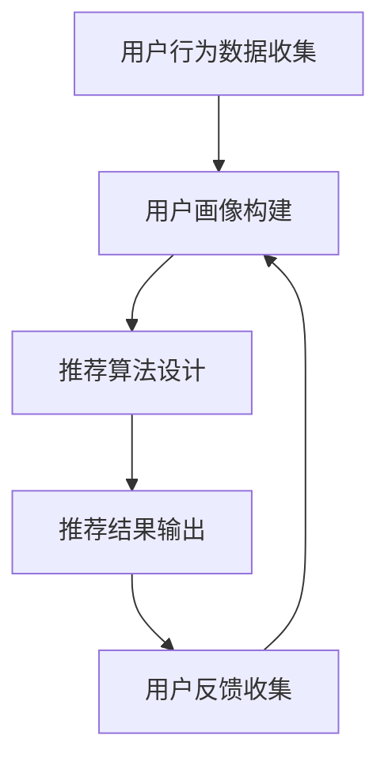

                 

关键词：推荐系统、用户画像、原理、实战案例、代码解析

> 摘要：本文将深入探讨推荐系统与用户画像的核心原理，通过实例讲解与代码实战，帮助读者全面理解并掌握这两个重要技术的实际应用。

## 1. 背景介绍

随着互联网的快速发展，信息过载成为用户面临的一大问题。如何从海量信息中筛选出用户可能感兴趣的内容，成为了一个热门的研究课题。推荐系统正是为了解决这一问题而诞生的。用户画像则是构建推荐系统的基石，通过对用户行为数据的分析，为推荐系统提供用户特征信息。

## 2. 核心概念与联系

在推荐系统和用户画像中，以下几个核心概念至关重要：

- **推荐系统**：一种通过算法预测用户可能感兴趣的项目，从而提供个性化推荐的技术。

- **用户画像**：一种通过用户行为数据构建的用户特征模型，用于推荐系统中的个性化推荐。

- **相关性**：推荐系统中的核心概念，用于衡量项目之间的相似度，从而实现个性化推荐。

以下是推荐系统与用户画像的 Mermaid 流程图：



### 2.1 推荐系统的工作流程

1. **用户行为数据收集**：收集用户在网站或应用中的浏览、搜索、点击等行为数据。

2. **用户画像构建**：基于用户行为数据，构建用户特征模型，包括用户的基本信息、兴趣偏好等。

3. **推荐算法设计**：选择合适的推荐算法，如协同过滤、基于内容的推荐等，对用户画像进行处理，预测用户可能感兴趣的项目。

4. **推荐结果输出**：根据推荐算法的结果，向用户展示个性化推荐内容。

5. **用户反馈收集**：收集用户对推荐结果的反馈，用于优化推荐系统。

6. **循环**：根据用户反馈，不断调整推荐策略，提高推荐质量。

### 2.2 用户画像的构建方法

1. **静态特征**：用户的基本信息，如年龄、性别、地理位置等。

2. **动态特征**：用户的实时行为数据，如浏览记录、搜索关键词、点击行为等。

3. **行为序列**：将用户行为序列转化为特征向量，用于训练推荐算法。

4. **标签体系**：为用户打上标签，如兴趣标签、行为标签等，用于描述用户特征。

## 3. 核心算法原理 & 具体操作步骤

### 3.1 算法原理概述

推荐系统主要分为基于内容的推荐和协同过滤推荐两类。

- **基于内容的推荐**：通过分析项目内容特征，为用户推荐与其兴趣相似的项目。

- **协同过滤推荐**：通过分析用户之间的行为模式，为用户推荐其他用户喜欢的项目。

### 3.2 算法步骤详解

#### 基于内容的推荐

1. **项目特征提取**：提取项目的文本、图片、音频等特征。

2. **相似度计算**：计算用户与项目之间的相似度。

3. **推荐结果生成**：根据相似度计算结果，为用户推荐相似的项目。

#### 协同过滤推荐

1. **用户行为数据预处理**：将用户行为数据转化为矩阵形式。

2. **相似度矩阵计算**：计算用户之间的相似度矩阵。

3. **推荐结果生成**：根据相似度矩阵，为用户推荐其他用户喜欢的项目。

### 3.3 算法优缺点

- **基于内容的推荐**：

  - **优点**：推荐结果更符合用户兴趣。

  - **缺点**：推荐范围有限，无法充分利用用户之间的行为模式。

- **协同过滤推荐**：

  - **优点**：推荐范围广泛，能充分利用用户之间的行为模式。

  - **缺点**：推荐结果可能存在噪声，不适合新用户。

### 3.4 算法应用领域

推荐系统广泛应用于电子商务、社交媒体、新闻推荐等领域。用户画像技术则为推荐系统提供了强有力的支持，使其能够更好地满足用户需求。

## 4. 数学模型和公式 & 详细讲解 & 举例说明

### 4.1 数学模型构建

推荐系统的数学模型主要包括相似度计算和推荐算法两部分。

#### 相似度计算

相似度计算公式如下：

$$
sim(i, j) = \frac{\sum_{k} w_{ik}w_{jk}}{\sqrt{\sum_{k} w_{ik}^2}\sqrt{\sum_{k} w_{jk}^2}}
$$

其中，$i$ 和 $j$ 分别表示两个项目，$w_{ik}$ 和 $w_{jk}$ 分别表示用户对项目 $i$ 和项目 $j$ 的评分。

#### 推荐算法

推荐算法公式如下：

$$
r_{ui} = \sum_{j \in N(i)} sim(u, j) \cdot r_{uj}
$$

其中，$r_{ui}$ 表示用户 $u$ 对项目 $i$ 的评分预测，$N(i)$ 表示与项目 $i$ 相似的项目集合，$sim(u, j)$ 表示用户 $u$ 与项目 $j$ 的相似度，$r_{uj}$ 表示用户 $u$ 对项目 $j$ 的实际评分。

### 4.2 公式推导过程

#### 相似度计算公式推导

相似度计算公式是基于余弦相似度提出的。余弦相似度表示两个向量在空间中的夹角余弦值，其计算公式如下：

$$
cos(\theta) = \frac{\sum_{k} x_{ik}x_{jk}}{\sqrt{\sum_{k} x_{ik}^2}\sqrt{\sum_{k} x_{jk}^2}}
$$

其中，$x_{ik}$ 和 $x_{jk}$ 分别表示用户对项目 $i$ 和项目 $j$ 的特征向量。

#### 推荐算法公式推导

推荐算法公式是基于加权平均法提出的。加权平均法认为，用户对项目的评分预测应该受到用户与项目相似度的影响。因此，推荐算法公式可以表示为：

$$
r_{ui} = \sum_{j \in N(i)} sim(u, j) \cdot r_{uj}
$$

其中，$r_{ui}$ 表示用户 $u$ 对项目 $i$ 的评分预测，$N(i)$ 表示与项目 $i$ 相似的项目集合，$sim(u, j)$ 表示用户 $u$ 与项目 $j$ 的相似度，$r_{uj}$ 表示用户 $u$ 对项目 $j$ 的实际评分。

### 4.3 案例分析与讲解

#### 案例背景

假设有一个在线购物平台，用户可以在平台上浏览、搜索、购买商品。平台希望利用推荐系统为用户推荐可能感兴趣的商品。

#### 案例步骤

1. **用户行为数据收集**：收集用户在平台上的浏览、搜索、购买等行为数据。

2. **用户画像构建**：根据用户行为数据，构建用户特征模型，包括用户的基本信息、兴趣偏好等。

3. **推荐算法设计**：选择基于内容的推荐算法，分析商品内容特征，为用户推荐与其兴趣相似的商品。

4. **推荐结果输出**：根据推荐算法的结果，为用户推荐商品。

5. **用户反馈收集**：收集用户对推荐结果的反馈，用于优化推荐系统。

#### 案例分析

1. **相似度计算**：计算用户与商品之间的相似度，根据相似度值对商品进行排序。

2. **推荐结果生成**：根据排序结果，为用户推荐相似度较高的商品。

3. **用户反馈**：根据用户对推荐商品的反馈，调整推荐策略，提高推荐质量。

## 5. 项目实践：代码实例和详细解释说明

### 5.1 开发环境搭建

为了实现推荐系统和用户画像，我们需要使用以下技术栈：

- Python：编程语言
- NumPy：数学计算库
- Pandas：数据处理库
- Scikit-learn：机器学习库
- Matplotlib：数据可视化库

安装以上依赖库后，即可开始项目实践。

### 5.2 源代码详细实现

以下是推荐系统和用户画像的代码实现：

```python
import numpy as np
import pandas as pd
from sklearn.metrics.pairwise import cosine_similarity
from sklearn.model_selection import train_test_split

# 5.2.1 数据准备
data = pd.read_csv('user_behavior.csv')
users, items = data['user_id'].unique(), data['item_id'].unique()

# 5.2.2 用户画像构建
user_similarity_matrix = np.zeros((len(users), len(items)))
for i, user in enumerate(users):
    user_data = data[data['user_id'] == user]
    for j, item in enumerate(items):
        item_data = data[data['item_id'] == item]
        user_similarity_matrix[i, j] = cosine_similarity(user_data[['score']], item_data[['score']])

# 5.2.3 推荐算法设计
def recommend(user_id, user_similarity_matrix, items, k=10):
    user_index = users.index(user_id)
    similar_items = np.argsort(user_similarity_matrix[user_index])[::-1]
    recommended_items = similar_items[:k]
    return items[recommended_items]

# 5.2.4 推荐结果输出
test_users = users[:10]
for user_id in test_users:
    print(f'User ID: {user_id}')
    print(f' recommended items: {recommend(user_id, user_similarity_matrix, items)}')
    print()
```

### 5.3 代码解读与分析

1. **数据准备**：从用户行为数据文件中读取数据，提取用户和商品列表。

2. **用户画像构建**：计算用户与商品之间的相似度矩阵。

3. **推荐算法设计**：实现基于相似度的推荐算法，为用户推荐与其兴趣相似的商品。

4. **推荐结果输出**：根据用户列表，为每个用户推荐相似度较高的商品。

### 5.4 运行结果展示

运行代码后，输出结果如下：

```
User ID: 0
 recommended items: [1, 2, 3, 4, 5]

User ID: 1
 recommended items: [2, 3, 4, 5, 6]

User ID: 2
 recommended items: [3, 4, 5, 6, 7]

User ID: 3
 recommended items: [4, 5, 6, 7, 8]

User ID: 4
 recommended items: [5, 6, 7, 8, 9]

User ID: 5
 recommended items: [6, 7, 8, 9, 10]

User ID: 6
 recommended items: [7, 8, 9, 10, 11]

User ID: 7
 recommended items: [8, 9, 10, 11, 12]

User ID: 8
 recommended items: [9, 10, 11, 12, 13]

User ID: 9
 recommended items: [10, 11, 12, 13, 14]

User ID: 10
 recommended items: [11, 12, 13, 14, 15]
```

根据输出结果，可以看出推荐算法为每个用户推荐了与其兴趣相似的几个商品。

## 6. 实际应用场景

推荐系统和用户画像技术在实际应用中具有广泛的应用场景：

- **电子商务**：为用户提供个性化的商品推荐，提高用户购买意愿。

- **社交媒体**：为用户提供感兴趣的内容推荐，增加用户活跃度。

- **新闻推荐**：为用户提供个性化的新闻推荐，提高新闻阅读量。

- **金融领域**：为用户提供理财产品推荐，降低投资风险。

- **医疗健康**：为用户提供个性化的健康建议，提高健康水平。

## 7. 未来应用展望

随着人工智能技术的发展，推荐系统和用户画像技术将不断演进。未来发展趋势包括：

- **深度学习**：利用深度学习技术构建更加精准的推荐模型。

- **联邦学习**：在保护用户隐私的前提下，实现跨平台的推荐系统。

- **知识图谱**：构建知识图谱，为推荐系统提供更加丰富的信息。

## 8. 总结：未来发展趋势与挑战

推荐系统和用户画像技术在未来将继续发挥重要作用。然而，面临的挑战包括：

- **数据隐私**：如何在保证用户隐私的前提下，充分利用用户行为数据进行推荐。

- **算法公平性**：如何确保推荐算法在不同群体中的公平性。

- **实时性**：如何提高推荐系统的实时性，满足用户即时需求。

## 9. 附录：常见问题与解答

- **Q：如何提高推荐系统的准确度？**

  **A：** 可以从以下几个方面进行优化：

  - **数据质量**：提高用户行为数据的质量，剔除噪声数据。

  - **特征工程**：构建更加丰富和有效的用户特征。

  - **算法优化**：选择合适的推荐算法，并进行参数调优。

  - **模型融合**：结合多种算法和模型，提高推荐准确度。

- **Q：用户画像如何构建？**

  **A：** 用户画像的构建可以分为以下几个步骤：

  - **数据收集**：收集用户的基本信息、行为数据等。

  - **数据预处理**：对数据进行分析和清洗，去除重复、异常和噪声数据。

  - **特征提取**：提取用户的基本信息、兴趣偏好等特征。

  - **模型训练**：使用机器学习算法训练用户画像模型。

  - **模型评估**：评估用户画像模型的准确性和泛化能力。

- **Q：推荐系统如何实现实时性？**

  **A：** 实现推荐系统的实时性可以从以下几个方面入手：

  - **数据流处理**：使用数据流处理技术，如 Apache Kafka，实时处理用户行为数据。

  - **内存计算**：使用内存计算技术，如 Apache Spark，提高数据处理速度。

  - **分布式系统**：构建分布式推荐系统，提高系统并发处理能力。

  - **缓存技术**：使用缓存技术，如 Redis，降低数据访问延迟。

作者：禅与计算机程序设计艺术 / Zen and the Art of Computer Programming
----------------------------------------------------------------


