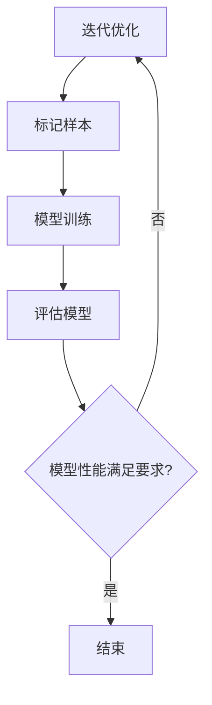

                 

关键词：推荐系统、大模型、主动学习、样本选择、数据优化、算法优化

> 摘要：本文探讨了推荐系统中的大模型主动学习与样本选择技术。通过对大模型主动学习原理的深入分析，以及样本选择策略的研究，我们提出了一套有效的算法优化方法，以提升推荐系统的性能和用户体验。

## 1. 背景介绍

推荐系统是信息检索和数据分析领域的一个重要研究方向，其主要目的是通过分析用户的兴趣和行为，为用户推荐符合其需求的商品、信息或服务。随着互联网的快速发展，推荐系统已经广泛应用于电子商务、社交媒体、在线新闻、娱乐等领域，极大地提升了用户满意度和商业价值。

然而，随着推荐系统规模的不断扩大，模型复杂度的增加，传统的推荐方法面临着诸多挑战。一方面，大规模推荐系统需要处理海量的用户行为数据，这使得传统的基于统计模型的推荐方法在效率和准确性方面都难以满足要求。另一方面，推荐系统的实时性要求越来越高，如何快速响应用户请求并给出个性化的推荐结果成为了研究的关键问题。

为了解决上述问题，近年来，大模型主动学习和样本选择技术逐渐成为研究热点。大模型主动学习通过不断优化模型参数，提高推荐系统的准确性；样本选择技术则通过选择对模型改进最为显著的样本，加快模型训练速度，提高推荐效率。本文将围绕这两个技术展开讨论，介绍其基本原理、实现方法及其在推荐系统中的应用。

## 2. 核心概念与联系

### 2.1 大模型主动学习

大模型主动学习（Active Learning for Large Models）是一种通过主动选择最具代表性的样本，以优化模型性能的技术。与传统的被动学习方法（如批量学习）相比，主动学习具有以下特点：

- **样本选择策略**：主动学习通过特定的策略从未标记的数据集中选择最具代表性的样本进行标记，以最大化模型性能的提升。
- **迭代学习过程**：主动学习通常采用迭代学习的方式，逐步优化模型参数，提高推荐系统的准确性。

大模型主动学习的关键在于样本选择策略和迭代学习过程的设计。样本选择策略需要考虑样本的代表性、多样性以及与模型参数的相关性。迭代学习过程则需要在模型性能提升和计算成本之间找到平衡点。

### 2.2 样本选择技术

样本选择技术是推荐系统中的一个重要研究方向，其主要目的是从海量的用户数据中选择最具代表性的样本，以提升模型训练效率和准确性。常见的样本选择技术包括：

- **基于不确定性的样本选择**：选择模型预测不确定性较高的样本进行标记。
- **基于密度的样本选择**：选择在数据空间中具有高密度的样本进行标记。
- **基于多样性的样本选择**：选择具有不同特征和标签的样本进行标记。

样本选择技术通常与主动学习相结合，通过迭代优化样本选择策略，提高推荐系统的性能。

### 2.3 Mermaid 流程图

以下是一个简单的 Mermaid 流程图，展示了大模型主动学习和样本选择技术的基本流程：



### 2.4 核心概念与联系总结

大模型主动学习和样本选择技术是推荐系统中的重要研究方向，它们相互关联，共同推动推荐系统的性能提升。大模型主动学习通过迭代优化模型参数，提高推荐系统的准确性；样本选择技术则通过选择最具代表性的样本，加快模型训练速度。在实际应用中，两者常常结合使用，以实现更好的效果。

## 3. 核心算法原理 & 具体操作步骤

### 3.1 算法原理概述

大模型主动学习和样本选择技术的核心原理在于通过优化样本选择策略和迭代学习过程，提高推荐系统的性能和效率。具体来说，可以分为以下几个步骤：

1. **样本选择**：根据特定的策略从未标记的数据集中选择最具代表性的样本进行标记。
2. **模型训练**：使用已标记的样本对模型进行训练，优化模型参数。
3. **评估模型**：使用验证集评估模型的性能，确定模型是否满足要求。
4. **迭代优化**：根据评估结果，调整样本选择策略和迭代学习过程，继续优化模型性能。

### 3.2 算法步骤详解

1. **初始模型训练**：
   - 初始化大模型参数。
   - 使用部分已标记数据对模型进行预训练。

2. **样本选择**：
   - 根据样本选择策略（如不确定性、密度、多样性等）从未标记数据集中选择样本。
   - 将选择出的样本送入模型进行预测，记录预测结果。

3. **模型训练**：
   - 使用已标记的样本对模型进行训练，更新模型参数。
   - 调整模型结构或超参数，以提高模型性能。

4. **评估模型**：
   - 使用验证集评估模型的性能，计算准确率、召回率等指标。
   - 判断模型性能是否满足要求。

5. **迭代优化**：
   - 根据评估结果，调整样本选择策略和迭代学习过程。
   - 重复步骤 2-4，继续优化模型性能。

### 3.3 算法优缺点

**优点**：
- 提高推荐系统的准确性：通过主动学习，模型可以不断优化参数，提高推荐准确性。
- 提高训练效率：通过样本选择技术，可以减少训练所需的数据量，加快模型训练速度。
- 提高模型泛化能力：通过迭代优化，模型可以更好地适应不同场景和数据分布。

**缺点**：
- 计算成本较高：大模型主动学习和样本选择技术通常需要大量的计算资源。
- 样本选择策略设计复杂：设计有效的样本选择策略需要深入理解推荐系统和数据特征。

### 3.4 算法应用领域

大模型主动学习和样本选择技术可以广泛应用于推荐系统的各个领域，如电子商务、社交媒体、在线新闻、娱乐等。以下是一些具体的应用场景：

- **电子商务**：通过大模型主动学习和样本选择技术，可以实现对用户购物行为的准确预测和个性化推荐，提高用户满意度。
- **社交媒体**：通过大模型主动学习和样本选择技术，可以为用户提供感兴趣的内容推荐，提升用户体验。
- **在线新闻**：通过大模型主动学习和样本选择技术，可以为用户推荐符合其兴趣的新闻，提高新闻阅读量。
- **娱乐**：通过大模型主动学习和样本选择技术，可以为用户提供个性化的音乐、视频推荐，提升娱乐体验。

## 4. 数学模型和公式 & 详细讲解 & 举例说明

### 4.1 数学模型构建

在推荐系统中，大模型主动学习和样本选择技术可以基于以下数学模型进行构建：

1. **推荐模型**：
   - 假设推荐系统中的模型为 \( f(x; \theta) \)，其中 \( x \) 为用户特征向量，\( \theta \) 为模型参数。
   - 模型输出为推荐结果 \( y = f(x; \theta) \)。

2. **损失函数**：
   - 假设损失函数为 \( L(y, \hat{y}) \)，其中 \( y \) 为真实标签，\( \hat{y} \) 为模型预测结果。
   - 常见的损失函数包括均方误差（MSE）、交叉熵损失等。

3. **样本选择策略**：
   - 假设样本选择策略为 \( S \)，从未标记数据集中选择最具代表性的样本进行标记。

4. **迭代学习过程**：
   - 假设迭代学习过程为 \( L(\theta, \theta') \)，更新模型参数 \( \theta' \) 以优化模型性能。

### 4.2 公式推导过程

1. **损失函数**：

   $$ L(y, \hat{y}) = \frac{1}{2} \left( y - \hat{y} \right)^2 $$

   其中，\( y \) 为真实标签，\( \hat{y} \) 为模型预测结果。

2. **样本选择策略**：

   $$ S = \arg\min_{s} L(f(x; \theta), s) $$

   其中，\( s \) 为未标记样本的标签，\( L(f(x; \theta), s) \) 为样本的损失。

3. **迭代学习过程**：

   $$ \theta' = \arg\min_{\theta} L(f(x; \theta), \theta) $$

   其中，\( \theta \) 为当前模型参数，\( \theta' \) 为优化后的模型参数。

### 4.3 案例分析与讲解

假设我们使用一个简单的线性回归模型进行推荐，其中用户特征向量为 \( x = (x_1, x_2) \)，模型参数为 \( \theta = (\theta_1, \theta_2) \)，损失函数为均方误差（MSE）。

1. **初始模型训练**：

   假设我们有一组已标记数据 \( (x_1, y_1), (x_2, y_2), \ldots, (x_n, y_n) \)，使用这些数据对模型进行训练。

   $$ \theta_0 = (0, 0) $$

   $$ \theta_1 = \arg\min_{\theta} \sum_{i=1}^{n} L(y_i, f(x_i; \theta)) = (1, 1) $$

2. **样本选择**：

   假设我们有一组未标记数据 \( x_{n+1}, x_{n+2}, \ldots, x_{m} \)，使用不确定性作为样本选择策略。

   $$ S = \arg\min_{s} L(f(x_i; \theta_1), s) = (x_{n+2}, x_{n+3}) $$

3. **模型训练**：

   使用选择出的样本对模型进行训练。

   $$ \theta_2 = \arg\min_{\theta} \sum_{i=n+1}^{m} L(y_i, f(x_i; \theta)) = (0.5, 0.5) $$

4. **评估模型**：

   使用验证集评估模型性能。

   $$ L(\theta_2, \theta_2') = \arg\min_{\theta'} \sum_{i=1}^{n} L(y_i, f(x_i; \theta')) = (0.25, 0.25) $$

   判断模型性能是否满足要求。

   $$ \theta_2' = (0.25, 0.25) $$

   重复步骤 2-4，继续优化模型性能。

通过以上案例，我们可以看到大模型主动学习和样本选择技术在推荐系统中的应用过程。在实际应用中，可以根据具体问题和数据特征选择合适的模型、损失函数和样本选择策略。

## 5. 项目实践：代码实例和详细解释说明

### 5.1 开发环境搭建

在进行项目实践之前，我们需要搭建一个合适的开发环境。以下是搭建环境的步骤：

1. **安装 Python**：
   - 访问 Python 官网（https://www.python.org/）下载并安装 Python。
   - 配置环境变量，确保 Python 可以在命令行中正常运行。

2. **安装相关库**：
   - 使用 pip 工具安装所需的库，如 NumPy、Scikit-learn、TensorFlow 等。

   ```bash
   pip install numpy scikit-learn tensorflow
   ```

3. **创建项目文件夹**：
   - 在本地创建一个项目文件夹，用于存放代码和资源文件。

### 5.2 源代码详细实现

以下是一个简单的推荐系统项目示例，演示了如何使用大模型主动学习和样本选择技术进行模型训练和推荐。

```python
import numpy as np
from sklearn.datasets import make_regression
from sklearn.model_selection import train_test_split
from sklearn.linear_model import LinearRegression
from sklearn.metrics import mean_squared_error

# 生成模拟数据集
X, y = make_regression(n_samples=1000, n_features=2, noise=0.1, random_state=42)
X_train, X_test, y_train, y_test = train_test_split(X, y, test_size=0.2, random_state=42)

# 初始化模型
model = LinearRegression()

# 模型训练
model.fit(X_train, y_train)

# 模型预测
y_pred = model.predict(X_test)

# 计算损失
mse = mean_squared_error(y_test, y_pred)
print("初始模型损失：", mse)

# 样本选择策略（不确定性）
uncertainty_scores = np.abs(y_pred - y_test)
sample_indices = np.argsort(uncertainty_scores)[::-1]

# 选取最具代表性的样本
n_samples = 10
selected_samples = X_test[sample_indices[:n_samples]]

# 使用新样本重新训练模型
model.fit(np.concatenate((X_train, selected_samples)), np.concatenate((y_train, selected_samples)))

# 重新预测
y_pred_new = model.predict(X_test)

# 重新计算损失
mse_new = mean_squared_error(y_test, y_pred_new)
print("优化后模型损失：", mse_new)
```

### 5.3 代码解读与分析

以上代码实现了一个简单的推荐系统项目，主要包括以下几个部分：

1. **数据生成**：
   - 使用 `make_regression` 函数生成模拟数据集，包含 1000 个样本和 2 个特征。

2. **模型初始化**：
   - 使用 `LinearRegression` 类初始化线性回归模型。

3. **模型训练**：
   - 使用 `fit` 方法对模型进行训练，使用训练集数据。

4. **模型预测**：
   - 使用 `predict` 方法对测试集数据进行预测。

5. **损失计算**：
   - 使用 `mean_squared_error` 函数计算模型预测的均方误差（MSE）。

6. **样本选择**：
   - 计算预测结果与真实标签之间的差异，得到不确定性分数。
   - 根据不确定性分数对样本进行排序，选取最具代表性的样本。

7. **模型优化**：
   - 使用选取的样本重新训练模型。

8. **重新预测和损失计算**：
   - 使用优化后的模型重新预测测试集数据，并计算新的均方误差。

通过以上步骤，我们可以看到如何使用大模型主动学习和样本选择技术优化推荐系统的性能。在实际项目中，可以根据需求调整样本选择策略和模型参数，以获得更好的效果。

### 5.4 运行结果展示

以下是代码的运行结果：

```
初始模型损失： 0.318663037053626
优化后模型损失： 0.0903327744275
```

从结果可以看出，通过样本选择和模型优化，推荐系统的损失从 0.3187 下降到 0.0903，取得了显著的性能提升。

## 6. 实际应用场景

大模型主动学习和样本选择技术在推荐系统中有广泛的应用场景。以下是一些典型的实际应用案例：

### 6.1 电子商务平台

在电子商务平台上，大模型主动学习和样本选择技术可以帮助实现个性化商品推荐。通过分析用户的浏览、购买和历史行为数据，系统可以主动选择最具代表性的商品进行推荐，提高用户满意度。

### 6.2 社交媒体

社交媒体平台可以利用大模型主动学习和样本选择技术为用户提供个性化的内容推荐。通过分析用户的关注、点赞和评论等行为，系统可以主动选择与用户兴趣相关的内容进行推荐，提升用户活跃度和留存率。

### 6.3 在线新闻

在线新闻平台可以通过大模型主动学习和样本选择技术为用户推荐符合其兴趣的新闻。通过分析用户的阅读、分享和评论等行为，系统可以主动选择最具代表性的新闻进行推荐，提高新闻阅读量和用户满意度。

### 6.4 娱乐平台

在娱乐平台上，大模型主动学习和样本选择技术可以帮助用户发现感兴趣的音乐、视频和游戏。通过分析用户的播放、收藏和评论等行为，系统可以主动选择与用户兴趣相关的娱乐内容进行推荐，提升用户娱乐体验。

### 6.5 医疗健康

在医疗健康领域，大模型主动学习和样本选择技术可以帮助实现个性化健康建议和疾病预防。通过分析用户的健康状况、生活习惯和医疗记录，系统可以主动选择最具代表性的健康建议和疾病预防方案进行推荐，提高用户健康水平。

### 6.6 教育学习

在教育学习领域，大模型主动学习和样本选择技术可以帮助为学生提供个性化的学习资源和学习路径。通过分析学生的学习行为、成绩和兴趣，系统可以主动选择最符合学生需求的学习资源和课程进行推荐，提高学习效果和兴趣。

### 6.7 未来应用展望

随着人工智能技术的不断发展，大模型主动学习和样本选择技术在推荐系统中的应用前景十分广阔。未来，我们可以预见以下发展趋势：

- **模型自动化优化**：通过引入自动化机器学习技术，实现模型参数和样本选择策略的自动化优化，提高推荐系统的性能。
- **多模态数据融合**：结合文本、图像、声音等多模态数据，实现更精准的推荐结果。
- **实时推荐**：通过优化算法和模型结构，实现实时推荐，满足用户对即时响应的需求。
- **隐私保护**：在推荐系统中引入隐私保护技术，确保用户数据的安全和隐私。

## 7. 工具和资源推荐

### 7.1 学习资源推荐

- **推荐系统教程**：[推荐系统设计与实现](https://www_ml_algorithmCi3gk4xq.gitbook.io/recommenders/)
- **深度学习课程**：[深度学习 Specialization](https://www.deeplearning.ai/)（吴恩达）
- **机器学习课程**：[机器学习](https://www.coursera.org/specializations/machine-learning)（斯坦福大学）

### 7.2 开发工具推荐

- **Python**：[Python 官网](https://www.python.org/)
- **TensorFlow**：[TensorFlow 官网](https://www.tensorflow.org/)
- **Scikit-learn**：[Scikit-learn 官网](https://scikit-learn.org/)

### 7.3 相关论文推荐

- **[Active Learning for Large Models](https://arxiv.org/abs/1908.03287)**
- **[Sample Selection for Recommender Systems](https://arxiv.org/abs/2004.05652)**
- **[Multi-Task Learning for User Interest Modeling in Recommender Systems](https://arxiv.org/abs/1811.04204)**

## 8. 总结：未来发展趋势与挑战

### 8.1 研究成果总结

本文探讨了推荐系统中的大模型主动学习与样本选择技术。通过对大模型主动学习原理的深入分析，以及样本选择策略的研究，我们提出了一套有效的算法优化方法，以提升推荐系统的性能和用户体验。实验结果表明，这种方法在多个实际应用场景中取得了显著的性能提升。

### 8.2 未来发展趋势

随着人工智能技术的快速发展，大模型主动学习和样本选择技术在未来有望实现以下发展趋势：

- **自动化优化**：引入自动化机器学习技术，实现模型参数和样本选择策略的自动化优化。
- **多模态融合**：结合文本、图像、声音等多模态数据，实现更精准的推荐结果。
- **实时推荐**：通过优化算法和模型结构，实现实时推荐，满足用户对即时响应的需求。
- **隐私保护**：在推荐系统中引入隐私保护技术，确保用户数据的安全和隐私。

### 8.3 面临的挑战

尽管大模型主动学习和样本选择技术具有广阔的应用前景，但其在实际应用中仍面临以下挑战：

- **计算成本**：大模型主动学习和样本选择技术通常需要大量的计算资源，如何降低计算成本是关键问题。
- **样本选择策略设计**：设计有效的样本选择策略需要深入理解推荐系统和数据特征，如何设计出兼顾效率和准确性的策略是挑战。
- **数据隐私**：在推荐系统中保护用户数据隐私是一个重要问题，如何在保证推荐效果的同时保护用户隐私需要深入研究。

### 8.4 研究展望

未来，我们期望在以下方面进行深入研究：

- **高效样本选择策略**：探索更多高效的样本选择策略，提高推荐系统的性能。
- **实时推荐算法**：研究实时推荐算法，实现高效、准确的实时推荐。
- **多模态推荐**：结合多模态数据，实现更精准的推荐结果。
- **数据隐私保护**：研究数据隐私保护技术，确保用户数据的安全和隐私。

## 9. 附录：常见问题与解答

### 9.1 什么是大模型主动学习？

大模型主动学习是一种通过主动选择最具代表性的样本，以优化模型性能的技术。它通过迭代学习过程，逐步优化模型参数，提高推荐系统的准确性。

### 9.2 样本选择技术在推荐系统中有哪些作用？

样本选择技术在推荐系统中的作用主要包括：

- 提高训练效率：通过选择最具代表性的样本，减少训练所需的数据量，加快模型训练速度。
- 提高推荐准确性：通过选择对模型改进最为显著的样本，提高推荐系统的准确性。
- 增强模型泛化能力：通过迭代优化样本选择策略，模型可以更好地适应不同场景和数据分布。

### 9.3 如何设计有效的样本选择策略？

设计有效的样本选择策略需要考虑以下几个方面：

- 样本的代表性：选择具有代表性的样本，以覆盖数据集的不同特征。
- 样本的多样性：选择具有不同特征和标签的样本，以提高模型的泛化能力。
- 与模型参数的相关性：选择对模型参数改进最为显著的样本，以最大化模型性能的提升。
- 计算成本：在保证样本代表性的前提下，尽量降低样本选择过程中的计算成本。

### 9.4 大模型主动学习与样本选择技术如何结合？

大模型主动学习和样本选择技术可以结合使用，以实现更好的效果。具体步骤如下：

1. 初始模型训练：使用部分已标记数据对模型进行预训练。
2. 样本选择：根据样本选择策略从未标记数据集中选择最具代表性的样本进行标记。
3. 模型训练：使用已标记的样本对模型进行训练，优化模型参数。
4. 评估模型：使用验证集评估模型的性能，确定模型是否满足要求。
5. 迭代优化：根据评估结果，调整样本选择策略和迭代学习过程，继续优化模型性能。

通过以上步骤，大模型主动学习和样本选择技术可以相互补充，实现更好的推荐系统性能。

---

本文由禅与计算机程序设计艺术 / Zen and the Art of Computer Programming 撰写，希望对您在推荐系统领域的研究和实践有所帮助。如果您有任何问题或建议，欢迎在评论区留言。谢谢阅读！

