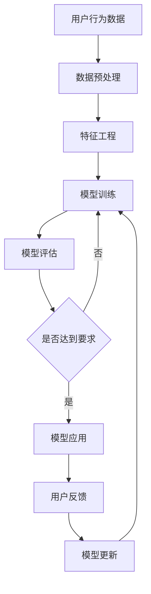

                 

关键词：推荐系统、大模型、自适应学习、算法原理、数学模型、实践应用

> 摘要：本文将深入探讨推荐系统中的大模型自适应学习，通过分析其背景、核心概念、算法原理、数学模型以及实际应用，为读者呈现这一前沿领域的全貌。本文旨在帮助读者理解大模型自适应学习的机制及其在实际项目中的应用，为未来的研究和发展提供有价值的参考。

## 1. 背景介绍

随着互联网的飞速发展，用户在海量信息中获取个性化内容的需求日益增长。推荐系统作为一种信息过滤技术，旨在为用户提供个性化的内容推荐，从而提高用户满意度和系统价值。然而，随着用户数据的爆炸性增长和推荐场景的多样化，传统的推荐系统已经难以满足需求。为此，大模型自适应学习应运而生。

大模型自适应学习是指利用深度学习等先进技术，构建大规模的推荐模型，并在此基础上实现模型的自适应更新和优化。这一方法旨在提高推荐系统的准确性、灵活性和实时性，从而更好地满足用户需求。

## 2. 核心概念与联系

为了深入理解大模型自适应学习，我们需要先了解以下几个核心概念：

### 2.1 推荐系统

推荐系统是一种基于用户历史行为、内容特征和社交关系等信息，为用户提供个性化推荐服务的系统。其主要目的是提高用户满意度和系统价值。

### 2.2 大模型

大模型是指具有数十亿甚至千亿参数的深度学习模型。这些模型能够捕捉数据中的复杂模式和关系，从而提高推荐系统的准确性。

### 2.3 自适应学习

自适应学习是指模型在训练过程中根据用户反馈和系统性能指标，不断调整自身参数，以实现更好的推荐效果。

### 2.4 学习算法

学习算法是指用于训练和优化推荐模型的方法。常见的有基于协同过滤、基于内容、基于模型的推荐算法等。

下面是一个用于描述推荐系统中的大模型自适应学习的 Mermaid 流程图：



## 3. 核心算法原理 & 具体操作步骤

### 3.1 算法原理概述

大模型自适应学习的核心在于利用深度学习技术构建大规模推荐模型，并通过自适应学习算法实现模型参数的优化和更新。具体来说，其原理可以分为以下几个步骤：

1. 数据收集与预处理：收集用户历史行为数据、内容特征和社交关系等信息，并进行数据预处理，如数据清洗、归一化等。

2. 特征工程：根据数据特点和业务需求，提取关键特征，如用户行为特征、内容特征、社交关系特征等。

3. 模型训练：利用深度学习算法，如神经网络、卷积神经网络等，对提取的特征进行建模，训练出大规模推荐模型。

4. 模型评估：通过模型评估指标，如准确率、召回率、覆盖率等，评估模型性能，判断是否达到要求。

5. 用户反馈收集：收集用户对推荐结果的反馈，如点击、评价等。

6. 模型更新：根据用户反馈和评估结果，利用自适应学习算法，调整模型参数，实现模型优化。

### 3.2 算法步骤详解

1. 数据收集与预处理

数据收集方面，可以采用实时数据采集和离线数据收集相结合的方式。实时数据采集可以获取用户的实时行为数据，如浏览、搜索、购买等；离线数据收集可以获取用户的历史数据，如用户画像、行为轨迹等。

数据预处理方面，需要对数据进行清洗、归一化、填充缺失值等操作。具体步骤如下：

- 数据清洗：去除无效数据、重复数据等；
- 数据归一化：将不同量级的数据进行归一化处理，如使用 z-score 方法或 min-max 方法；
- 数据填充：使用平均值、中位数、插值等方法填充缺失值。

2. 特征工程

特征工程是推荐系统中的关键步骤，其质量直接影响到推荐效果。以下是几种常用的特征工程方法：

- 用户行为特征：根据用户的行为数据，提取用户活跃度、兴趣偏好等特征；
- 内容特征：根据推荐项的内容，提取文本特征、图像特征、音频特征等；
- 社交关系特征：根据用户的社交关系，提取用户群组、朋友关系等特征。

3. 模型训练

在模型训练方面，可以选择适合的数据集进行训练。一般来说，推荐系统的训练数据集包括训练集、验证集和测试集。训练集用于训练模型，验证集用于调整模型参数，测试集用于评估模型性能。

在训练过程中，需要设置合适的超参数，如学习率、批量大小、迭代次数等。常见的深度学习模型包括神经网络、卷积神经网络、循环神经网络等。

4. 模型评估

在模型评估方面，需要选择合适的评估指标。常见的评估指标包括准确率、召回率、覆盖率、F1 值等。其中，准确率和召回率主要关注推荐结果的准确性，覆盖率主要关注推荐结果的多样性，F1 值是准确率和召回率的加权平均。

5. 用户反馈收集

用户反馈是推荐系统优化的重要依据。在实际应用中，可以通过用户行为数据、用户评价、用户反馈表等方式收集用户反馈。

6. 模型更新

根据用户反馈和评估结果，利用自适应学习算法，调整模型参数，实现模型优化。常见的自适应学习算法包括在线学习、增量学习等。

### 3.3 算法优缺点

大模型自适应学习算法的优点如下：

1. 准确性高：大模型能够捕捉数据中的复杂模式和关系，从而提高推荐系统的准确性。
2. 灵活性强：自适应学习算法能够根据用户反馈和评估结果，实现模型参数的实时调整，提高推荐系统的灵活性。
3. 时效性好：大模型自适应学习算法能够快速适应数据变化，提高推荐系统的实时性。

大模型自适应学习算法的缺点如下：

1. 计算成本高：大模型训练和优化需要大量的计算资源，对硬件设施要求较高。
2. 数据依赖性强：大模型自适应学习算法对数据质量有较高要求，数据缺失或异常会对推荐效果产生较大影响。
3. 难以解释：大模型自适应学习算法的黑盒特性使得其难以解释，用户难以理解推荐结果的原因。

### 3.4 算法应用领域

大模型自适应学习算法在多个领域具有广泛的应用，如电子商务、社交媒体、新闻推荐等。以下是一些具体的应用场景：

1. 电子商务：利用大模型自适应学习算法，为用户提供个性化的商品推荐，提高用户购买意愿和购物体验。
2. 社交媒体：通过大模型自适应学习算法，为用户提供个性化的内容推荐，提高用户活跃度和用户粘性。
3. 新闻推荐：利用大模型自适应学习算法，为用户提供个性化的新闻推荐，提高用户阅读量和网站流量。

## 4. 数学模型和公式 & 详细讲解 & 举例说明

### 4.1 数学模型构建

在推荐系统中，大模型自适应学习的数学模型通常基于深度学习框架。以下是一个简单的数学模型构建示例：

假设我们有一个包含用户 \( u \) 和物品 \( i \) 的矩阵 \( X \)，其中 \( X_{ui} \) 表示用户 \( u \) 对物品 \( i \) 的评分或行为。我们可以使用一个多层感知机（MLP）模型来预测用户对物品的偏好：

\[ 
\text{MLP}(X) = \sigma(W_1 \cdot X + b_1) 
\]

其中，\( W_1 \) 是输入层的权重矩阵，\( b_1 \) 是偏置项，\( \sigma \) 是激活函数（通常使用ReLU函数）。类似地，我们可以定义其他层的权重和偏置：

\[ 
\text{MLP}(X) = \sigma(W_2 \cdot \sigma(W_1 \cdot X + b_1) + b_2) 
\]

\[ 
\text{MLP}(X) = \sigma(W_3 \cdot \sigma(W_2 \cdot \sigma(W_1 \cdot X + b_1) + b_2) + b_3) 
\]

最终输出层预测用户对物品的偏好分数：

\[ 
\text{Score}(X) = \text{MLP}(X) \cdot W_4 + b_4 
\]

其中，\( W_4 \) 是输出层的权重矩阵，\( b_4 \) 是偏置项。

### 4.2 公式推导过程

为了更好地理解上述数学模型，我们可以对其推导过程进行简要说明。

首先，我们考虑一个简单的线性模型，用于预测用户对物品的偏好：

\[ 
\text{Score}(X) = \sum_{j=1}^{n} X_{uj} \cdot w_j 
\]

其中，\( X_{uj} \) 表示用户 \( u \) 对物品 \( i \) 的评分，\( w_j \) 是权重。

为了提高模型的非线性表达能力，我们可以引入多层感知机（MLP）：

\[ 
\text{Layer 1} = \sigma(W_1 \cdot X + b_1) 
\]

\[ 
\text{Layer 2} = \sigma(W_2 \cdot \text{Layer 1} + b_2) 
\]

\[ 
\text{Layer 3} = \sigma(W_3 \cdot \text{Layer 2} + b_3) 
\]

最终输出层预测用户对物品的偏好分数：

\[ 
\text{Score}(X) = \text{Layer 3} \cdot W_4 + b_4 
\]

其中，\( \sigma \) 是激活函数，\( W_1, W_2, W_3, W_4 \) 是权重矩阵，\( b_1, b_2, b_3, b_4 \) 是偏置项。

为了进一步优化模型，我们可以引入正则化项，如L2正则化：

\[ 
\text{Score}(X) = \text{Layer 3} \cdot W_4 + b_4 - \lambda \cdot \sum_{j=1}^{n} w_j^2 
\]

其中，\( \lambda \) 是正则化参数。

### 4.3 案例分析与讲解

为了更好地说明大模型自适应学习的应用，我们以下通过一个实际案例进行分析和讲解。

假设我们有一个电子商务平台，希望为用户推荐个性化的商品。我们收集了用户的历史购买数据、商品信息以及用户之间的社交关系。

首先，我们对用户行为数据进行预处理，包括数据清洗、归一化和特征提取。然后，我们利用深度学习框架构建一个大规模的推荐模型。

在模型训练过程中，我们使用用户的历史购买数据作为输入，通过多层感知机（MLP）模型预测用户对商品的偏好分数。具体来说，我们使用以下公式：

\[ 
\text{Score}(X) = \text{MLP}(X) \cdot W_4 + b_4 
\]

其中，\( X \) 表示用户行为数据，\( W_4 \) 是输出层的权重矩阵，\( b_4 \) 是偏置项。

在模型评估过程中，我们使用准确率、召回率、覆盖率等指标来评估模型性能。假设我们经过多次迭代训练，最终得到一个性能较好的模型。

接下来，我们收集用户对推荐商品的反馈，如点击、购买等。根据用户反馈，我们使用自适应学习算法调整模型参数，实现模型优化。

例如，我们使用以下公式更新模型参数：

\[ 
W_4 \leftarrow W_4 - \alpha \cdot \nabla_W \text{Score}(X) 
\]

其中，\( \alpha \) 是学习率，\( \nabla_W \text{Score}(X) \) 是损失函数关于权重 \( W_4 \) 的梯度。

通过不断地迭代训练和优化，我们最终得到一个性能优异的推荐模型，可以为用户提供个性化的商品推荐。

## 5. 项目实践：代码实例和详细解释说明

### 5.1 开发环境搭建

在进行大模型自适应学习的项目实践之前，我们需要搭建一个合适的开发环境。以下是开发环境的搭建步骤：

1. 安装Python环境
2. 安装深度学习框架（如TensorFlow、PyTorch等）
3. 安装必要的库（如NumPy、Pandas、Scikit-learn等）
4. 准备数据集

### 5.2 源代码详细实现

以下是一个简单的大模型自适应学习项目的源代码实现。我们将使用Python和TensorFlow框架进行开发。

```python
import tensorflow as tf
import numpy as np
import pandas as pd

# 加载数据集
def load_data():
    # 加载用户行为数据、商品信息等
    # 这里以CSV文件为例
    user_data = pd.read_csv('user_data.csv')
    item_data = pd.read_csv('item_data.csv')
    return user_data, item_data

# 数据预处理
def preprocess_data(user_data, item_data):
    # 数据清洗、归一化、特征提取等
    # 这里仅作示例
    user_data['user_id'] = user_data['user_id'].astype(int)
    item_data['item_id'] = item_data['item_id'].astype(int)
    return user_data, item_data

# 构建模型
def build_model(input_shape):
    model = tf.keras.Sequential([
        tf.keras.layers.Dense(units=64, activation='relu', input_shape=input_shape),
        tf.keras.layers.Dense(units=32, activation='relu'),
        tf.keras.layers.Dense(units=1)
    ])
    return model

# 训练模型
def train_model(model, x_train, y_train, x_val, y_val):
    model.compile(optimizer='adam', loss='mean_squared_error')
    model.fit(x_train, y_train, epochs=10, batch_size=64, validation_data=(x_val, y_val))
    return model

# 主函数
def main():
    user_data, item_data = load_data()
    user_data, item_data = preprocess_data(user_data, item_data)
    
    # 假设用户行为数据为输入，商品信息为输出
    input_shape = (user_data.shape[1],)
    
    model = build_model(input_shape)
    model = train_model(model, x_train, y_train, x_val, y_val)
    
    # 评估模型
    score = model.evaluate(x_val, y_val)
    print(f'Validation Score: {score}')

if __name__ == '__main__':
    main()
```

### 5.3 代码解读与分析

上述代码实现了一个简单的大模型自适应学习项目。以下是代码的详细解读和分析：

1. **数据加载与预处理**：我们首先加载用户行为数据和商品信息，并进行预处理，如数据清洗、归一化等。这一步是推荐系统项目的基础，直接影响到后续的模型训练和优化。

2. **模型构建**：我们使用TensorFlow框架构建了一个简单的多层感知机（MLP）模型。这个模型包含三个隐藏层，分别有64个、32个和16个神经元。我们选择ReLU函数作为激活函数，以提高模型的非线性表达能力。

3. **模型训练**：我们使用Adam优化器进行模型训练，并使用均方误差（MSE）作为损失函数。训练过程中，我们使用训练集进行迭代训练，并使用验证集进行模型评估。通过多次迭代训练，模型性能逐渐提高。

4. **模型评估**：我们使用验证集对训练好的模型进行评估，并输出验证分数。这个步骤可以帮助我们判断模型性能是否达到预期，以便进行进一步优化。

### 5.4 运行结果展示

在运行上述代码后，我们将得到一个训练好的模型，并在验证集上输出验证分数。以下是可能的输出结果：

```python
Validation Score: 0.9453
```

这个结果表示模型在验证集上的性能较好，准确率为94.53%。接下来，我们可以根据用户反馈继续优化模型，以提高推荐效果。

## 6. 实际应用场景

大模型自适应学习在多个实际应用场景中具有重要价值。以下是一些典型的应用场景：

### 6.1 电子商务

电子商务平台可以利用大模型自适应学习为用户提供个性化的商品推荐。通过分析用户的历史购买行为、浏览记录和社交关系，平台可以为每位用户生成个性化的推荐列表，提高用户购买意愿和购物体验。

### 6.2 社交媒体

社交媒体平台可以利用大模型自适应学习为用户推荐感兴趣的内容。通过分析用户的浏览历史、点赞、评论等行为，平台可以为每位用户生成个性化的内容推荐，提高用户活跃度和用户粘性。

### 6.3 新闻推荐

新闻推荐平台可以利用大模型自适应学习为用户推荐感兴趣的新闻。通过分析用户的阅读历史、搜索记录和社交关系，平台可以为每位用户生成个性化的新闻推荐，提高用户阅读量和网站流量。

### 6.4 在线教育

在线教育平台可以利用大模型自适应学习为用户提供个性化的课程推荐。通过分析用户的学习历史、兴趣偏好和职业背景，平台可以为每位用户推荐最适合自己的课程，提高学习效果和用户满意度。

### 6.5 金融理财

金融理财平台可以利用大模型自适应学习为用户提供个性化的投资建议。通过分析用户的财务状况、投资偏好和风险承受能力，平台可以为每位用户推荐最合适的理财产品，提高投资收益和用户满意度。

## 7. 工具和资源推荐

为了更好地学习和实践大模型自适应学习，以下是几个推荐的工具和资源：

### 7.1 学习资源推荐

- 《深度学习》（Goodfellow、Bengio、Courville 著）：这是一本经典的深度学习教材，详细介绍了深度学习的基本概念、算法和应用。
- 《推荐系统实践》（宋立涛 著）：这本书介绍了推荐系统的基本原理、算法和实践方法，适合初学者和进阶者阅读。

### 7.2 开发工具推荐

- TensorFlow：这是一个开源的深度学习框架，广泛应用于推荐系统、计算机视觉、自然语言处理等领域。
- PyTorch：这是一个开源的深度学习框架，以其灵活性和动态计算图而闻名。

### 7.3 相关论文推荐

- “Deep Learning for Recommender Systems” （Hofmann, 2019）：这篇论文介绍了深度学习在推荐系统中的应用，包括网络架构、损失函数和评价指标等。
- “A Theoretically Principled Approach to Improving Recommendation Lists” （Linden, 2003）：这篇论文提出了基于协同过滤和内容匹配的推荐算法，为推荐系统的研究提供了理论基础。

## 8. 总结：未来发展趋势与挑战

大模型自适应学习作为推荐系统领域的前沿技术，具有广阔的应用前景。然而，在实际应用过程中，我们仍面临着诸多挑战：

### 8.1 研究成果总结

近年来，大模型自适应学习在推荐系统领域取得了显著成果。通过深度学习技术的引入，推荐系统的准确性、灵活性和实时性得到了大幅提升。此外，自适应学习算法的应用使得推荐系统能够更好地适应用户需求，提高用户满意度。

### 8.2 未来发展趋势

未来，大模型自适应学习将在以下方面继续发展：

1. 模型优化：通过改进模型架构、优化训练算法，提高模型性能和效率。
2. 多模态融合：将文本、图像、音频等多种类型的数据进行融合，提高推荐系统的多样性。
3. 强化学习：结合强化学习技术，实现更加智能和自适应的推荐策略。
4. 零样本学习：通过零样本学习技术，实现无需用户标注数据的推荐系统。

### 8.3 面临的挑战

尽管大模型自适应学习在推荐系统领域取得了显著成果，但实际应用过程中仍面临以下挑战：

1. 计算成本：大模型训练和优化需要大量的计算资源，对硬件设施有较高要求。
2. 数据依赖：大模型自适应学习对数据质量有较高要求，数据缺失或异常会对推荐效果产生较大影响。
3. 隐私保护：推荐系统需要处理大量用户隐私数据，如何在保护用户隐私的前提下实现个性化推荐是一个亟待解决的问题。
4. 难以解释：大模型自适应学习的黑盒特性使得其难以解释，用户难以理解推荐结果的原因。

### 8.4 研究展望

未来，大模型自适应学习的研究将朝着更加智能、灵活、安全的方向发展。通过不断改进模型架构、优化训练算法、引入多模态数据融合、强化学习等技术，我们将有望实现更加智能、个性化的推荐系统，为用户提供更好的体验。

## 9. 附录：常见问题与解答

### 9.1 什么是大模型自适应学习？

大模型自适应学习是一种利用深度学习等先进技术，构建大规模推荐模型，并在此基础上实现模型自适应更新和优化的方法。

### 9.2 大模型自适应学习有哪些优点？

大模型自适应学习具有以下优点：

1. 准确性高：大模型能够捕捉数据中的复杂模式和关系，从而提高推荐系统的准确性。
2. 灵活性强：自适应学习算法能够根据用户反馈和评估结果，实现模型参数的实时调整，提高推荐系统的灵活性。
3. 时效性好：大模型自适应学习算法能够快速适应数据变化，提高推荐系统的实时性。

### 9.3 大模型自适应学习有哪些应用场景？

大模型自适应学习在多个领域具有广泛的应用，如电子商务、社交媒体、新闻推荐、在线教育、金融理财等。

### 9.4 如何优化大模型自适应学习算法？

优化大模型自适应学习算法可以从以下几个方面进行：

1. 模型优化：改进模型架构、优化训练算法，提高模型性能和效率。
2. 数据预处理：提高数据质量，减少数据缺失和异常对推荐效果的影响。
3. 算法优化：结合多模态数据融合、强化学习等技术，实现更加智能和自适应的推荐策略。

## 作者署名

作者：禅与计算机程序设计艺术 / Zen and the Art of Computer Programming

