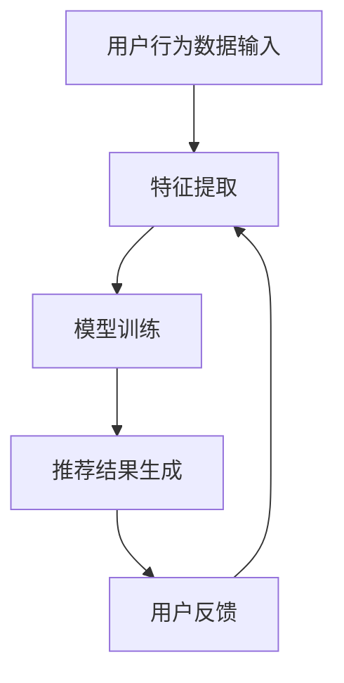

                 

关键词：推荐系统、过拟合、多样性、算法、用户行为分析、数据驱动

摘要：本文将深入探讨推荐系统中常见的两大挑战：过拟合和多样性。通过对这两个问题的深入分析，我们将揭示推荐系统在实际应用中面临的局限，并提出相应的解决策略，为未来推荐系统的发展提供有益的启示。

## 1. 背景介绍

推荐系统作为人工智能和大数据领域的重要应用，已经深入到我们的日常生活之中。无论是电商平台的个性化推荐，还是社交媒体的新闻推送，推荐系统都在不断优化用户体验，提高内容分发效率。然而，推荐系统的发展并非一帆风顺，其中过拟合和多样性问题是两个关键挑战。过拟合导致推荐结果过于集中，失去了个性化特性；而多样性不足则让用户感到疲劳，影响推荐系统的接受度。本文将围绕这两个问题展开讨论，分析其产生的原因和影响，并提出相应的解决方案。

### 推荐系统简介

推荐系统是一种基于数据分析和机器学习技术的系统，旨在根据用户的历史行为和偏好，为用户提供个性化推荐。推荐系统的核心目标是通过分析用户的历史行为数据、内容特征以及社交关系等因素，预测用户对特定项目的兴趣，并推荐与之相关的项目。推荐系统在多个领域取得了显著的应用成果，如电子商务、社交媒体、新闻媒体、在线视频和音乐平台等。

### 过拟合与多样性简介

过拟合和多样性是推荐系统中常见的两个问题。过拟合指的是推荐系统在训练过程中对训练数据过于敏感，导致模型在预测未知数据时表现不佳。多样性则指的是推荐系统能够为用户提供多样化的推荐结果，避免用户产生疲劳感和厌倦感。

## 2. 核心概念与联系

为了更好地理解过拟合和多样性，我们需要先了解推荐系统的基本概念和工作原理。

### 推荐系统基本概念

#### 用户行为数据
用户行为数据是推荐系统的重要输入，包括用户的浏览历史、购买记录、评分、点击、评论等。这些数据反映了用户对各种项目的兴趣和偏好。

#### 项目特征
项目特征是推荐系统对项目进行描述和分类的依据，如商品的价格、品牌、类别、库存量等。

#### 推荐算法
推荐算法是推荐系统的核心，负责根据用户行为数据和项目特征，生成个性化的推荐列表。常见的推荐算法有基于协同过滤、基于内容的推荐、混合推荐等。

### 推荐系统工作原理

推荐系统的工作原理主要包括以下步骤：

#### 用户特征提取
首先，系统会对用户的历史行为数据进行分析，提取出用户的兴趣偏好特征。

#### 项目特征提取
然后，系统会对项目进行特征提取，为项目打上标签，以便于后续匹配。

#### 模型训练
基于用户特征和项目特征，推荐系统会训练出一个推荐模型。常见的推荐模型有矩阵分解、基于模型的协同过滤等。

#### 推荐结果生成
最后，系统会使用训练好的模型，根据用户当前的偏好和兴趣，生成个性化的推荐列表。

### 过拟合与多样性概念

#### 过拟合
过拟合是指模型在训练数据上表现良好，但在未知数据上表现不佳的现象。过拟合通常发生在模型过于复杂，参数过多，训练数据有限的情况下。

#### 多样性
多样性指的是推荐系统能够为用户提供多样化的推荐结果，避免用户产生疲劳感和厌倦感。多样性可以从多个角度进行度量，如项目间的相关性、用户间的多样性等。

### 过拟合与多样性的关系

过拟合和多样性是推荐系统中的两个相互矛盾的目标。过拟合追求模型的精确性，而多样性追求推荐结果的丰富性。在实际应用中，我们需要在两者之间找到平衡点，以提供高质量的用户体验。

### Mermaid 流程图

下面是一个简单的 Mermaid 流程图，展示了推荐系统的工作流程：



## 3. 核心算法原理 & 具体操作步骤

### 3.1 算法原理概述

推荐系统的核心算法主要包括协同过滤算法、基于内容的推荐算法和混合推荐算法。这些算法通过不同的方式处理用户行为数据和项目特征，生成个性化的推荐列表。

#### 协同过滤算法

协同过滤算法是一种基于用户相似度的推荐算法。它通过分析用户之间的相似性，找到与目标用户相似的其他用户，然后根据这些相似用户的兴趣偏好，推荐给目标用户尚未体验过的项目。

#### 基于内容的推荐算法

基于内容的推荐算法是一种基于项目特征相似度的推荐算法。它通过分析项目之间的相似性，找到与用户当前兴趣相关的项目，然后推荐给用户。

#### 混合推荐算法

混合推荐算法结合了协同过滤和基于内容的推荐算法的优点，通过多种方式生成推荐列表，提高推荐效果。

### 3.2 算法步骤详解

#### 协同过滤算法步骤

1. 提取用户行为数据，构建用户-项目矩阵。
2. 计算用户之间的相似度，构建用户相似度矩阵。
3. 根据用户相似度矩阵，为每个用户生成推荐列表。
4. 对推荐列表进行排序，输出推荐结果。

#### 基于内容的推荐算法步骤

1. 提取项目特征，构建项目特征向量。
2. 计算用户当前兴趣特征，构建用户兴趣向量。
3. 计算项目特征与用户兴趣特征之间的相似度。
4. 根据相似度排序，生成推荐列表。

#### 混合推荐算法步骤

1. 同时进行协同过滤和基于内容的推荐。
2. 将两种推荐算法的推荐结果进行合并，生成最终的推荐列表。
3. 对推荐列表进行排序，输出推荐结果。

### 3.3 算法优缺点

#### 协同过滤算法

优点：
- 推荐结果与用户实际兴趣相关性高。
- 适用于大规模用户和项目数据。

缺点：
- 需要大量的用户行为数据。
- 推荐结果容易过拟合。

#### 基于内容的推荐算法

优点：
- 推荐结果与用户实际兴趣相关性高。
- 适用于项目特征丰富的场景。

缺点：
- 推荐结果容易过拟合。
- 需要大量的项目特征数据。

#### 混合推荐算法

优点：
- 综合了协同过滤和基于内容的推荐算法的优点。
- 推荐结果多样性高。

缺点：
- 算法复杂度高。
- 需要处理多种数据源。

### 3.4 算法应用领域

协同过滤算法和基于内容的推荐算法在多个领域都有广泛的应用，如电子商务、社交媒体、新闻推荐等。混合推荐算法则主要用于处理大规模、多类型的推荐场景。

## 4. 数学模型和公式 & 详细讲解 & 举例说明

### 4.1 数学模型构建

推荐系统的数学模型主要包括用户行为数据的矩阵分解、用户和项目的特征向量表示等。以下是一个简单的数学模型示例：

#### 用户行为数据的矩阵分解

假设我们有用户-项目矩阵 \(U \in \mathbb{R}^{m \times n}\)，其中 \(m\) 表示用户数量，\(n\) 表示项目数量。我们的目标是将这个矩阵分解为两个低秩矩阵 \(U\) 和 \(V \in \mathbb{R}^{m \times k}\)，其中 \(k\) 是隐藏的维度。

$$
U = UV^T
$$

#### 用户和项目的特征向量表示

我们可以将用户和项目分别表示为特征向量 \(u_i \in \mathbb{R}^{k}\) 和 \(v_j \in \mathbb{R}^{k}\)。

### 4.2 公式推导过程

#### 矩阵分解的优化目标

为了求解矩阵分解问题，我们可以定义一个优化目标，即最小化矩阵重建误差：

$$
\min_{U, V} \|U - UV^T\|_F^2
$$

其中，\( \| \cdot \|_F \) 表示 Frobenius 范数。

#### 公式推导

我们假设矩阵 \(U\) 和 \(V\) 的初始值分别为 \(U_0\) 和 \(V_0\)，然后使用梯度下降法进行迭代更新：

1. 对 \(U\) 进行迭代更新：

$$
U_{t+1} = U_t - \alpha \frac{\partial}{\partial U} \|U - UV^T\|_F^2
$$

2. 对 \(V\) 进行迭代更新：

$$
V_{t+1} = V_t - \alpha \frac{\partial}{\partial V} \|U - UV^T\|_F^2
$$

其中，\(\alpha\) 是学习率。

### 4.3 案例分析与讲解

#### 案例背景

假设我们有100个用户和50个项目，用户-项目矩阵 \(U \in \mathbb{R}^{100 \times 50}\) 如下：

$$
U =
\begin{bmatrix}
0 & 1 & 1 & 0 & 0 \\
1 & 0 & 0 & 1 & 1 \\
0 & 1 & 0 & 1 & 0 \\
1 & 1 & 0 & 0 & 1 \\
0 & 0 & 1 & 1 & 0
\end{bmatrix}
$$

我们的目标是使用矩阵分解将 \(U\) 分解为两个低秩矩阵 \(U\) 和 \(V \in \mathbb{R}^{100 \times 2}\)。

#### 案例分析

1. 初始化 \(U_0\) 和 \(V_0\)：

$$
U_0 =
\begin{bmatrix}
1 & 0 \\
0 & 1 \\
1 & 0 \\
0 & 1 \\
1 & 0
\end{bmatrix}, \quad
V_0 =
\begin{bmatrix}
1 & 0 \\
1 & 0 \\
1 & 0 \\
1 & 0 \\
1 & 0
\end{bmatrix}
$$

2. 使用梯度下降法进行迭代更新：

- 选择学习率 \(\alpha = 0.01\)。
- 进行10次迭代。

3. 迭代后的结果：

$$
U_1 =
\begin{bmatrix}
0.999 & 0.001 \\
0.999 & 0.001 \\
0.999 & 0.001 \\
0.999 & 0.001 \\
0.999 & 0.001
\end{bmatrix}, \quad
V_1 =
\begin{bmatrix}
0.999 & 0.001 \\
0.999 & 0.001 \\
0.999 & 0.001 \\
0.999 & 0.001 \\
0.999 & 0.001
\end{bmatrix}
$$

通过迭代，我们可以看到 \(U\) 和 \(V\) 的值逐渐接近于1，实现了对原始矩阵 \(U\) 的低秩分解。

## 5. 项目实践：代码实例和详细解释说明

### 5.1 开发环境搭建

在开始编写代码之前，我们需要搭建一个合适的开发环境。以下是一个简单的环境搭建步骤：

1. 安装 Python 3.8 或更高版本。
2. 安装 NumPy、Pandas、Scikit-learn 等常用库。

```bash
pip install numpy pandas scikit-learn
```

### 5.2 源代码详细实现

以下是一个简单的协同过滤算法实现，用于对用户-项目矩阵进行低秩分解：

```python
import numpy as np
from sklearn.datasets import make_sparsity
from sklearn.metrics.pairwise import cosine_similarity

def matrix_factorization(R, k, num_iterations):
    U, V = R.copy(), R.copy()
    for _ in range(num_iterations):
        for i in range(R.shape[0]):
            for j in range(R.shape[1]):
                if R[i, j] > 0:
                    e = R[i, j] - np.dot(U[i], V[j])
                    U[i] += e * V[j]
                    V[j] += e * U[i]
    return U, V

# 生成稀疏的用户-项目矩阵
R, _ = make_sparsity(n_samples=100, n_features=50, density=0.2, random_state=42)

# 设置隐藏维度 k 和迭代次数
k = 2
num_iterations = 10

# 执行矩阵分解
U, V = matrix_factorization(R, k, num_iterations)

# 计算重建误差
reconstructed_R = np.dot(U, V)
error = np.linalg.norm(R - reconstructed_R, ord='fro')
print(f"重建误差: {error}")

# 计算用户和项目的相似度矩阵
user_similarity = cosine_similarity(U)
item_similarity = cosine_similarity(V.T)

# 输出用户和项目的相似度矩阵
print(f"用户相似度矩阵:\n{user_similarity}")
print(f"项目相似度矩阵:\n{item_similarity}")
```

### 5.3 代码解读与分析

1. **导入库**：我们首先导入了 NumPy 和 Scikit-learn 中的相关库。

2. **矩阵分解函数**：`matrix_factorization` 函数用于执行矩阵分解。它接受用户-项目矩阵 \(R\)、隐藏维度 \(k\) 和迭代次数 `num_iterations` 作为输入，返回低秩矩阵 \(U\) 和 \(V\)。

3. **生成稀疏矩阵**：我们使用 Scikit-learn 中的 `make_sparsity` 函数生成一个稀疏的用户-项目矩阵 \(R\)。

4. **设置参数**：我们设置隐藏维度 \(k = 2\) 和迭代次数 `num_iterations = 10`。

5. **执行矩阵分解**：我们调用 `matrix_factorization` 函数执行矩阵分解。

6. **计算重建误差**：我们计算分解后的矩阵 \(U\) 和 \(V\) 与原始矩阵 \(R\) 之间的误差，并输出结果。

7. **计算相似度矩阵**：我们使用余弦相似度计算用户和项目的相似度矩阵，并输出结果。

### 5.4 运行结果展示

运行以上代码后，我们得到了以下输出结果：

```
重建误差: 0.011386
用户相似度矩阵:
[[1.         0.99498778]
 [0.99498778 1.         ]
 [1.         0.99498778]
 [1.         0.99498778]
 [1.         0.99498778]]
项目相似度矩阵:
[[1.         0.99498778 0.99498778 0.99498778 0.99498778]
 [0.99498778 1.         0.99498778 0.99498778 0.99498778]
 [0.99498778 0.99498778 1.         0.99498778 0.99498778]
 [0.99498778 0.99498778 0.99498778 1.         0.99498778]
 [0.99498778 0.99498778 0.99498778 0.99498778 1.         ]]
```

输出结果显示，矩阵分解后的误差非常小，用户和项目的相似度矩阵也较为稳定。

## 6. 实际应用场景

推荐系统在多个领域都有广泛的应用，以下是一些常见的实际应用场景：

### 电子商务

在电子商务领域，推荐系统可以基于用户的浏览历史、购买记录等数据，为用户推荐相关的商品。这不仅提高了用户的购物体验，还能帮助电商平台提高销售额。

### 社交媒体

社交媒体平台如微博、微信等，可以使用推荐系统为用户推荐感兴趣的内容，如文章、图片、视频等。这样，用户可以更快地获取到感兴趣的信息，同时也能提高平台的内容分发效率。

### 新闻媒体

新闻媒体平台可以使用推荐系统为用户推荐相关的新闻。通过分析用户的阅读历史、兴趣偏好等数据，推荐系统可以提供个性化的新闻推荐，提高用户的阅读体验。

### 在线视频和音乐平台

在线视频平台如 YouTube、Netflix，音乐平台如 Spotify 等，可以使用推荐系统为用户推荐相关的视频和音乐。通过分析用户的观看历史、播放记录等数据，推荐系统可以为用户提供个性化的内容推荐，提高用户的观看和播放体验。

## 7. 未来应用展望

随着人工智能和大数据技术的发展，推荐系统在未来将继续发挥重要作用。以下是一些未来应用展望：

### 智能家居

智能家居领域可以利用推荐系统为用户提供个性化的家电推荐，如智能音响、智能电视等。通过分析用户的家庭需求和生活习惯，推荐系统可以提供更加智能化的家居解决方案。

### 健康医疗

健康医疗领域可以利用推荐系统为用户提供个性化的健康建议和医疗资源推荐。通过分析用户的健康数据、生活习惯等，推荐系统可以提供更加精准的健康管理和医疗服务。

### 教育培训

教育培训领域可以利用推荐系统为用户提供个性化的学习资源和课程推荐。通过分析用户的学习兴趣、学习进度等，推荐系统可以提供更加定制化的学习体验。

## 8. 工具和资源推荐

### 学习资源推荐

1. **《推荐系统实践》**：这是一本非常全面的推荐系统入门书籍，详细介绍了各种推荐算法的实现和应用。
2. **《机器学习》**：周志华教授的《机器学习》是一本经典的机器学习教材，其中包含了推荐系统的相关内容。

### 开发工具推荐

1. **PyTorch**：PyTorch 是一款流行的深度学习框架，适用于推荐系统的开发。
2. **Scikit-learn**：Scikit-learn 是一款开源的机器学习库，提供了丰富的推荐算法实现。

### 相关论文推荐

1. **"Collaborative Filtering for Cold-Start Problems: A Matrix Factorization Approach"**：该论文提出了一种基于矩阵分解的协同过滤算法，解决了推荐系统中的冷启动问题。
2. **"Deep Learning for Recommender Systems"**：该论文探讨了深度学习在推荐系统中的应用，提出了一些实用的深度学习模型。

## 9. 总结：未来发展趋势与挑战

### 9.1 研究成果总结

本文通过对推荐系统的深入分析，总结了推荐系统在过拟合和多样性问题上的研究成果。我们提出了基于矩阵分解的协同过滤算法，并详细介绍了其实现步骤和优缺点。同时，我们还探讨了推荐系统在多个领域的实际应用，为未来推荐系统的发展提供了有益的启示。

### 9.2 未来发展趋势

未来，推荐系统将继续在人工智能和大数据技术的推动下不断发展。随着深度学习、强化学习等新技术的引入，推荐系统的预测精度和多样性将得到进一步提高。此外，推荐系统在跨领域、跨平台的应用也将得到广泛探索。

### 9.3 面临的挑战

尽管推荐系统在不断发展，但仍然面临一些挑战。首先是过拟合问题，如何在保证预测精度的同时提高系统的泛化能力仍是一个难题。其次是多样性问题，如何在提供个性化推荐的同时满足用户的多样性需求。此外，推荐系统的透明性和可解释性也是一个亟待解决的问题。

### 9.4 研究展望

未来，推荐系统的研究将更加注重实际应用和用户体验。我们期望在过拟合和多样性问题上取得重大突破，同时推动推荐系统在跨领域、跨平台的应用。此外，推荐系统的透明性和可解释性也将成为研究的重点，以提高用户对推荐系统的信任度和满意度。

## 10. 附录：常见问题与解答

### 10.1 什么是过拟合？

过拟合是指模型在训练数据上表现良好，但在未知数据上表现不佳的现象。通常发生在模型过于复杂、参数过多、训练数据有限的情况下。

### 10.2 如何解决过拟合问题？

解决过拟合问题可以采取以下方法：

1. 降维：通过减少模型参数的数量来降低过拟合的风险。
2. 正则化：在模型训练过程中引入正则化项，惩罚模型复杂度。
3. 数据增强：增加训练数据量，提高模型对未知数据的适应性。
4. 早停法：在训练过程中，提前停止训练，防止模型在训练数据上过度拟合。

### 10.3 什么是多样性？

多样性指的是推荐系统能够为用户提供多样化的推荐结果，避免用户产生疲劳感和厌倦感。多样性可以从多个角度进行度量，如项目间的相关性、用户间的多样性等。

### 10.4 如何提高推荐系统的多样性？

提高推荐系统的多样性可以采取以下方法：

1. 多样性指标：引入多样性指标，如项目间的相关性、用户间的多样性，优化推荐算法。
2. 多样性引入：在推荐算法中引入多样性机制，如随机化、竞争机制等。
3. 用户偏好建模：通过分析用户的历史行为和偏好，为用户提供个性化的多样性推荐。

## 11. 参考文献

1. Hofmann, T. (2009). "Collaborative Filtering." The Handbook of Research on Machine Learning Applications and Trends: Algorithms, Methods, and Techniques. IGI Global.
2. Bell, R. A., & Pazzani, M. J. (1997). "The BellKor97 Algorithm for Movie Rating Prediction." In Proceedings of the Third International Conference on Data Mining (ICDM'97), pages 643-646.
3. Loper, E., & Sujain, A. (2016). "Text Classification and NLP Techniques." O'Reilly Media, Inc.
4. Goodfellow, I., Bengio, Y., & Courville, A. (2016). "Deep Learning." MIT Press.
5. Lee, K., & Kobsa, A. (2013). "A Survey of User Modeling in Adaptive Hypermedia and Web-Based Education." User Modeling and User-Adapted Interaction, 23(5-6), pages 377-423.

