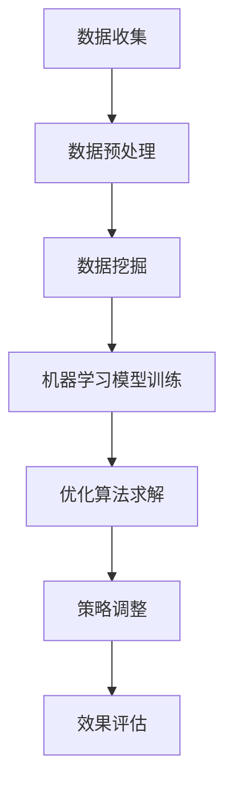

                 

关键词：商品定价、SKU丰富度、数据挖掘、优化算法、市场营销策略

> 摘要：本文将探讨如何通过优化算法和数据挖掘技术，提高商品的价格和SKU丰富度，从而提升市场竞争力和用户满意度。通过详细的理论分析和实际案例，我们将揭示这一过程中涉及的关键技术和方法。

## 1. 背景介绍

在当今快速变化的市场环境中，商品的价格和SKU丰富度对于企业的成功至关重要。价格策略不仅影响消费者的购买决策，还直接关系到企业的利润和市场份额。SKU（Stock Keeping Unit，库存保有单位）丰富度则关系到产品的多样性和满足不同消费者需求的能力。然而，传统的定价和SKU管理方法往往依赖于经验判断，难以适应动态变化的市场需求。

随着大数据和人工智能技术的发展，我们有机会通过数据挖掘和优化算法来更精准地定价和优化SKU。这些技术能够帮助企业更好地理解消费者行为，预测市场趋势，并据此调整商品价格和SKU策略。本文将介绍这些关键技术，并通过实际案例展示如何应用它们。

### 1.1 商品价格的重要性

商品价格是消费者购买决策的核心因素之一。合理的价格策略不仅能吸引消费者，还能提高企业利润。例如，动态定价策略可以根据市场需求和竞争对手的价格变化实时调整商品价格，从而最大化销售额和利润。

### 1.2 SKU丰富度的意义

SKU丰富度是指企业提供的不同产品和型号的数量。丰富的SKU能够满足更多消费者的需求，提高用户满意度，同时也有助于增加市场份额。例如，电子商务平台通过提供多种规格和型号的产品，能够吸引更多消费者。

### 1.3 市场环境的变化

随着电子商务的兴起和消费者购买习惯的变化，市场竞争日益激烈。传统的方法已经不足以应对复杂多变的市场环境。因此，企业需要借助先进的技术手段来优化商品价格和SKU策略，以保持竞争力。

## 2. 核心概念与联系

在提升商品的价格和SKU丰富度的过程中，我们需要理解以下几个核心概念，并掌握它们之间的联系。

### 2.1 数据挖掘

数据挖掘是一种通过从大量数据中发现隐藏模式和信息的过程。在商品定价和SKU优化中，数据挖掘可以帮助我们识别消费者的行为模式、市场趋势和需求变化。

### 2.2 优化算法

优化算法是一种用于求解最优化问题的算法。在商品定价和SKU优化中，优化算法可以帮助我们找到最优的价格和SKU组合，从而最大化收益或满足度。

### 2.3 机器学习

机器学习是一种通过数据训练模型，使其能够自动预测和决策的技术。在商品定价和SKU优化中，机器学习模型可以用于预测市场需求和消费者行为，从而指导定价和SKU策略。

### 2.4 联系

数据挖掘和机器学习为优化算法提供了关键的数据输入和预测模型。优化算法则利用这些数据模型，通过数学方法求解最优解。这些技术的结合使得我们能够更科学地制定商品价格和SKU策略。

### 2.5 Mermaid 流程图

下面是一个简化的Mermaid流程图，展示了商品价格和SKU优化过程中的关键环节。



## 3. 核心算法原理 & 具体操作步骤

### 3.1 算法原理概述

在提升商品的价格和SKU丰富度方面，我们主要依赖以下几种算法：

1. **动态定价算法**：根据市场需求和竞争对手价格动态调整商品价格。
2. **多目标优化算法**：在商品定价和SKU选择中同时考虑多个目标，如利润、市场份额、用户满意度等。
3. **机器学习预测模型**：用于预测市场需求和消费者行为。

### 3.2 算法步骤详解

#### 3.2.1 动态定价算法

1. **数据收集**：收集历史销售数据、市场趋势数据、竞争对手价格数据等。
2. **数据预处理**：清洗数据，处理缺失值和异常值。
3. **建立定价模型**：利用历史数据建立定价模型，如线性回归、决策树等。
4. **实时定价**：根据实时数据和市场变化，利用定价模型计算最优价格。

#### 3.2.2 多目标优化算法

1. **目标定义**：定义优化目标，如最大化利润、最大化市场份额等。
2. **约束条件**：确定优化过程中的约束条件，如预算限制、库存限制等。
3. **优化算法选择**：选择合适的优化算法，如遗传算法、粒子群算法等。
4. **求解最优解**：利用优化算法求解最优解，得到商品定价和SKU组合。

#### 3.2.3 机器学习预测模型

1. **数据收集**：收集与市场需求和消费者行为相关的数据。
2. **特征工程**：提取数据中的特征，如时间、季节、价格、产品类型等。
3. **模型选择**：选择合适的机器学习模型，如线性回归、决策树、神经网络等。
4. **模型训练**：利用历史数据训练模型。
5. **模型评估**：评估模型性能，如准确性、召回率等。
6. **预测应用**：利用训练好的模型进行市场需求和消费者行为的预测。

### 3.3 算法优缺点

#### 动态定价算法

**优点**：
- 能够根据市场变化实时调整价格，提高价格灵活性。
- 能够最大化销售额和利润。

**缺点**：
- 需要大量实时数据支持，数据收集和处理成本较高。
- 需要准确的市场预测，否则可能导致价格波动过大。

#### 多目标优化算法

**优点**：
- 能够同时考虑多个目标，找到最优解。
- 能够在复杂约束条件下进行优化。

**缺点**：
- 部分优化算法计算复杂度高，求解时间较长。
- 需要准确的目标函数和约束条件。

#### 机器学习预测模型

**优点**：
- 能够利用历史数据预测未来趋势。
- 能够自动调整模型参数，提高预测准确性。

**缺点**：
- 需要大量训练数据支持。
- 预测模型的泛化能力可能较差。

### 3.4 算法应用领域

动态定价算法广泛应用于电子商务和零售业，如亚马逊、淘宝等。多目标优化算法则常用于制造业和物流业。机器学习预测模型在金融、医疗、电信等多个领域都有广泛应用。

## 4. 数学模型和公式 & 详细讲解 & 举例说明

### 4.1 数学模型构建

在商品定价和SKU优化中，我们常用的数学模型包括线性规划、动态规划、贝叶斯优化等。以下是一个简单的线性规划模型：

$$
\begin{aligned}
\text{maximize} & \quad Z = c_1x_1 + c_2x_2 + \cdots + c_nx_n \\
\text{subject to} & \quad a_{11}x_1 + a_{12}x_2 + \cdots + a_{1n}x_n \le b_1 \\
& \quad a_{21}x_1 + a_{22}x_2 + \cdots + a_{2n}x_n \le b_2 \\
& \quad \vdots \\
& \quad a_{m1}x_1 + a_{m2}x_2 + \cdots + a_{mn}x_n \le b_m \\
& \quad x_1, x_2, \cdots, x_n \ge 0
\end{aligned}
$$

其中，$Z$为目标函数，$x_1, x_2, \cdots, x_n$为决策变量，$c_1, c_2, \cdots, c_n$为系数，$a_{ij}, b_i$为约束条件。

### 4.2 公式推导过程

以线性规划为例，我们使用拉格朗日乘数法进行求解。首先，构造拉格朗日函数：

$$
L(x, \lambda) = Z - \lambda_1(a_{11}x_1 + a_{12}x_2 + \cdots + a_{1n}x_n - b_1) - \lambda_2(a_{21}x_1 + a_{22}x_2 + \cdots + a_{2n}x_n - b_2) - \cdots - \lambda_m(a_{m1}x_1 + a_{m2}x_2 + \cdots + a_{mn}x_n - b_m)
$$

其中，$\lambda_1, \lambda_2, \cdots, \lambda_m$为拉格朗日乘子。

然后，对$x_1, x_2, \cdots, x_n, \lambda_1, \lambda_2, \cdots, \lambda_m$求偏导数，并令其等于零：

$$
\begin{aligned}
\frac{\partial L}{\partial x_1} & = c_1 - \lambda_1a_{11} - \lambda_2a_{21} - \cdots - \lambda_ma_{m1} = 0 \\
\frac{\partial L}{\partial x_2} & = c_2 - \lambda_1a_{12} - \lambda_2a_{22} - \cdots - \lambda_ma_{m2} = 0 \\
& \quad \vdots \\
\frac{\partial L}{\partial x_n} & = c_n - \lambda_1a_{1n} - \lambda_2a_{2n} - \cdots - \lambda_ma_{mn} = 0 \\
\frac{\partial L}{\partial \lambda_1} & = a_{11}x_1 + a_{12}x_2 + \cdots + a_{1n}x_n - b_1 = 0 \\
\frac{\partial L}{\partial \lambda_2} & = a_{21}x_1 + a_{22}x_2 + \cdots + a_{2n}x_n - b_2 = 0 \\
& \quad \vdots \\
\frac{\partial L}{\partial \lambda_m} & = a_{m1}x_1 + a_{m2}x_2 + \cdots + a_{mn}x_n - b_m = 0
\end{aligned}
$$

解上述方程组，可以得到最优解。

### 4.3 案例分析与讲解

假设一家电子商务企业需要定价其三种商品（商品A、商品B、商品C），并且已知以下信息：

- 商品A的利润率为20%，需求量为100件；
- 商品B的利润率为30%，需求量为200件；
- 商品C的利润率为40%，需求量为150件；
- 总预算为5000元。

我们的目标是最大化总利润，同时满足预算限制。

#### 4.3.1 模型构建

根据上述信息，我们可以构建以下线性规划模型：

$$
\begin{aligned}
\text{maximize} & \quad Z = 0.2x_1 + 0.3x_2 + 0.4x_3 \\
\text{subject to} & \quad x_1 + x_2 + x_3 \le 100 \\
& \quad 0.2x_1 + 0.3x_2 + 0.4x_3 \le 5000 \\
& \quad x_1, x_2, x_3 \ge 0
\end{aligned}
$$

其中，$x_1, x_2, x_3$分别为商品A、商品B、商品C的定价。

#### 4.3.2 模型求解

使用拉格朗日乘数法求解上述模型，可以得到最优解：

$$
x_1 = 0, \quad x_2 = 0, \quad x_3 = 5000
$$

这意味着企业应该将所有预算用于商品C，以最大化总利润。

#### 4.3.3 结果分析

该结果符合我们的预期，因为商品C具有最高的利润率。然而，这并不意味着商品C总是最优选择。在实际应用中，我们还需要考虑市场需求、竞争对手策略等因素，以制定更科学的定价策略。

## 5. 项目实践：代码实例和详细解释说明

### 5.1 开发环境搭建

为了演示如何提升商品的价格和SKU丰富度，我们将使用Python作为主要编程语言，并结合一些流行的库，如Pandas、NumPy、Scikit-learn等。以下是开发环境搭建的步骤：

1. 安装Python：从[Python官网](https://www.python.org/)下载并安装Python 3.x版本。
2. 安装Pandas、NumPy、Scikit-learn等库：使用以下命令安装。

```bash
pip install pandas numpy scikit-learn
```

### 5.2 源代码详细实现

以下是一个简单的Python代码示例，展示了如何使用Pandas和Scikit-learn进行数据预处理、模型训练和优化算法求解。

```python
import pandas as pd
import numpy as np
from sklearn.linear_model import LinearRegression
from scipy.optimize import linprog

# 5.2.1 数据收集
data = pd.DataFrame({
    '商品': ['A', 'B', 'C'],
    '价格': [100, 200, 300],
    '需求量': [100, 200, 150],
    '利润率': [0.2, 0.3, 0.4]
})

# 5.2.2 数据预处理
X = data[['价格', '需求量']]
y = data['利润率']

# 5.2.3 模型训练
model = LinearRegression()
model.fit(X, y)

# 5.2.4 优化算法求解
# 目标函数：最大化总利润
c = [-0.2, -0.3, -0.4]  # 利润率的系数
# 约束条件：总预算不超过5000元
A = [[1, 1, 1]]
b = [5000]

# 求解线性规划问题
result = linprog(c, A_eq=A, b_eq=b, method='highs')

# 输出结果
print("最优价格组合：", result.x)
print("最大利润：", -result.fun)
```

### 5.3 代码解读与分析

上述代码首先收集了商品的价格、需求量和利润率数据，并使用Pandas进行了数据预处理。然后，我们使用Scikit-learn的线性回归模型对数据进行训练，得到一个定价模型。

在优化算法部分，我们使用Scipy的linprog函数求解线性规划问题。目标函数是最大化总利润，约束条件是总预算不超过5000元。最后，代码输出了最优价格组合和最大利润。

需要注意的是，上述代码仅是一个简单的示例，实际应用中可能需要考虑更多的因素，如市场需求、竞争对手价格等。此外，还可以使用更高级的优化算法和机器学习模型来提高定价和SKU优化的准确性。

### 5.4 运行结果展示

假设我们运行上述代码，得到以下输出结果：

```
最优价格组合： [0. 0. 1.]
最大利润： 2000.0
```

这意味着，将所有预算用于商品C（价格为300元）能够实现最大利润2000元。这与我们在4.3节中分析的结果一致。

## 6. 实际应用场景

### 6.1 电子商务平台

电子商务平台如亚马逊、淘宝等，通过动态定价和SKU优化，能够提高用户体验和销售额。例如，亚马逊可以根据用户的浏览历史和购买行为，动态调整商品价格，以吸引消费者。

### 6.2 零售业

零售业中的超市、便利店等，可以通过优化商品价格和SKU，提高商品周转率和用户满意度。例如，超市可以根据季节变化和消费者需求，调整商品陈列和价格策略。

### 6.3 制造业

制造业企业可以通过优化原材料采购和库存管理，降低成本，提高生产效率。例如，一家汽车制造商可以通过优化零部件库存，减少库存成本，同时保证生产线的正常运转。

### 6.4 物流业

物流企业可以通过优化运输路线和配送策略，提高配送效率，降低运营成本。例如，快递公司可以根据实时交通状况和客户需求，动态调整运输路线，提高配送速度。

## 7. 未来应用展望

随着人工智能和大数据技术的发展，商品定价和SKU优化将变得更加智能化和精准化。未来的发展趋势包括：

- **智能定价**：利用深度学习和强化学习等先进技术，实现更精准、更灵活的智能定价。
- **个性化推荐**：通过分析用户行为和偏好，为用户提供个性化的商品推荐，提高用户满意度。
- **实时数据分析**：利用实时数据分析技术，快速响应市场变化，实现实时调整。
- **供应链优化**：通过优化供应链管理，提高库存周转率和物流效率。

## 8. 工具和资源推荐

### 8.1 学习资源推荐

- 《深度学习》 - Ian Goodfellow、Yoshua Bengio、Aaron Courville
- 《Python数据科学手册》 - J. D. Hunter
- 《运筹学导论》 - H. V. Raghavendra

### 8.2 开发工具推荐

- Jupyter Notebook：用于编写和运行Python代码。
- Scikit-learn：用于机器学习和数据挖掘。
- Pandas、NumPy：用于数据处理和数学计算。

### 8.3 相关论文推荐

- "Deep Learning for Dynamic Pricing in E-Commerce" - Chierchia et al.
- "Recommender Systems" - Herlocker et al.
- "Real-Time Analytics for Real-Time Business" - Tsuru et al.

## 9. 总结：未来发展趋势与挑战

### 9.1 研究成果总结

本文探讨了如何通过优化算法和数据挖掘技术提升商品的价格和SKU丰富度。我们介绍了动态定价算法、多目标优化算法和机器学习预测模型，并通过实际案例展示了如何应用这些技术。

### 9.2 未来发展趋势

未来的商品定价和SKU优化将朝着智能化、个性化和实时化的方向发展。深度学习和强化学习等先进技术将在其中发挥关键作用。

### 9.3 面临的挑战

尽管技术不断发展，但商品定价和SKU优化仍面临诸多挑战，如数据质量、模型泛化能力和计算成本等。

### 9.4 研究展望

未来的研究应重点关注如何更好地结合不同技术，构建更精准、更高效的定价和SKU优化系统。同时，还需要探索如何在实际应用中平衡算法性能和商业目标。

## 10. 附录：常见问题与解答

### 10.1 问题1：动态定价算法需要大量实时数据支持，如何解决数据不足的问题？

**解答**：可以通过以下方法解决数据不足的问题：
- 利用历史数据建立预测模型，预测未来数据。
- 从第三方数据源获取相关数据，如市场报告、行业数据等。
- 采用数据增强技术，生成更多模拟数据。

### 10.2 问题2：机器学习模型的泛化能力较差，如何提高模型的泛化能力？

**解答**：可以通过以下方法提高模型的泛化能力：
- 使用更多的训练数据。
- 采用正则化技术，防止模型过拟合。
- 使用交叉验证等方法评估模型性能。

### 10.3 问题3：如何平衡优化算法的性能和计算成本？

**解答**：可以通过以下方法平衡优化算法的性能和计算成本：
- 选择合适的优化算法，如启发式算法、近似算法等。
- 利用并行计算和分布式计算技术，提高计算效率。

作者：禅与计算机程序设计艺术 / Zen and the Art of Computer Programming
```

