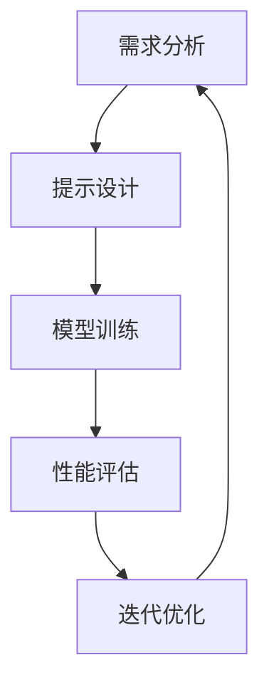

                 

关键词：提示工程，LLM输入提示，自然语言处理，人工智能，模型优化，代码实例

> 摘要：本文将深入探讨提示工程在大型语言模型（LLM）中的应用，介绍如何设计高效的输入提示，以优化模型性能和提升生成文本的质量。我们将分析提示工程的核心概念、算法原理，并提供详细的数学模型和项目实践实例。

## 1. 背景介绍

随着深度学习技术的不断发展，大型语言模型（LLM）如BERT、GPT-3等在自然语言处理（NLP）领域取得了显著的成果。然而，如何有效地设计输入提示，以最大化模型的潜力，仍是一个重要的研究方向。提示工程（Prompt Engineering）应运而生，它通过设计和优化输入提示来提升模型的表现。本文将详细介绍提示工程的核心概念、算法原理，并通过数学模型和实际代码实例，探讨如何设计高效的LLM输入提示。

## 2. 核心概念与联系

### 2.1 提示工程的定义

提示工程是通过对输入提示的设计和优化，来改善机器学习模型性能的一种方法。在NLP领域，输入提示通常是指提供给模型的文本或数据，用于指导模型的学习和生成过程。有效的输入提示能够引导模型学习到更准确的知识和模式，从而提升生成文本的质量。

### 2.2 提示工程的重要性

提示工程在LLM中的应用具有重要意义。首先，通过设计合适的输入提示，可以帮助模型更准确地理解问题和任务要求，从而提高模型的性能。其次，提示工程可以调整模型对特定任务的关注点，使其更加专注于关键信息。此外，有效的输入提示还可以帮助模型避免常见的错误和偏见。

### 2.3 提示工程的框架

提示工程的框架包括以下几个关键步骤：

1. **需求分析**：明确任务目标和输入提示的需求。
2. **提示设计**：根据需求设计合适的输入提示。
3. **模型训练**：使用设计好的输入提示对模型进行训练。
4. **性能评估**：评估模型的性能，并根据结果调整输入提示。
5. **迭代优化**：不断重复上述步骤，以达到最优性能。

### 2.4 提示工程的 Mermaid 流程图



## 3. 核心算法原理 & 具体操作步骤

### 3.1 算法原理概述

提示工程的核心算法包括提示设计、模型训练和性能评估。提示设计是根据任务需求，设计出有效的输入提示；模型训练是使用输入提示对模型进行训练；性能评估则是评估模型在特定任务上的表现。

### 3.2 算法步骤详解

1. **需求分析**：首先，明确任务目标和需求。这包括确定任务类型（如文本生成、文本分类等）和输入数据的格式。
2. **提示设计**：根据需求设计输入提示。输入提示的设计可以采用多种方法，如问题引导、上下文扩展等。
3. **模型训练**：使用设计好的输入提示对模型进行训练。训练过程中，可以采用梯度下降等优化算法，以最小化损失函数。
4. **性能评估**：评估模型在特定任务上的表现。常用的评估指标包括准确率、召回率、F1值等。
5. **迭代优化**：根据性能评估结果，调整输入提示，重复模型训练和性能评估过程，直至达到满意的性能。

### 3.3 算法优缺点

提示工程的优点包括：

- 提升模型性能：通过设计有效的输入提示，可以显著提高模型的性能。
- 调整模型关注点：输入提示可以帮助模型更加专注于关键信息，提高生成文本的质量。
- 灵活性：提示工程方法可以根据不同的任务需求进行灵活调整。

提示工程的缺点包括：

- 时间成本：设计有效的输入提示可能需要较长时间和经验积累。
- 需要大量数据：提示工程通常需要大量数据进行训练和评估。

### 3.4 算法应用领域

提示工程在多个NLP任务中得到了广泛应用，包括：

- 文本生成：如文章摘要、对话生成等。
- 文本分类：如情感分析、主题分类等。
- 问答系统：如问题回答、知识图谱构建等。

## 4. 数学模型和公式 & 详细讲解 & 举例说明

### 4.1 数学模型构建

在提示工程中，常用的数学模型包括神经网络、生成对抗网络（GAN）等。以下以神经网络为例，介绍其基本数学模型。

1. **输入层**：输入层接收输入数据，并将其传递给隐藏层。
2. **隐藏层**：隐藏层通过激活函数对输入数据进行变换，以提取特征。
3. **输出层**：输出层对隐藏层的输出进行分类或回归。

神经网络的基本数学模型可以表示为：

$$
y = f(z) = \sigma(\omega \cdot x + b)
$$

其中，$y$ 为输出，$f$ 为激活函数（如Sigmoid、ReLU等），$\omega$ 为权重，$x$ 为输入，$b$ 为偏置。

### 4.2 公式推导过程

假设我们有一个二分类问题，目标函数为最小化损失函数。损失函数通常采用交叉熵损失函数（Cross-Entropy Loss），其公式为：

$$
L = -\sum_{i=1}^{N} y_i \log(p_i)
$$

其中，$y_i$ 为真实标签，$p_i$ 为模型预测的概率。

为了最小化损失函数，我们可以采用梯度下降（Gradient Descent）算法。梯度下降的基本思想是沿着损失函数的梯度方向进行迭代，以更新模型的参数。

### 4.3 案例分析与讲解

假设我们有一个文本分类任务，需要判断一篇文本是否包含特定关键词。我们可以采用以下步骤进行提示工程：

1. **需求分析**：确定任务目标为二分类，输入为文本，输出为分类结果。
2. **提示设计**：设计一个包含关键词的输入提示，如“请判断以下文本是否包含关键词'人工智能'”。
3. **模型训练**：使用设计好的输入提示对模型进行训练，并采用交叉熵损失函数进行优化。
4. **性能评估**：评估模型在测试集上的性能，并调整输入提示，以提升模型性能。

## 5. 项目实践：代码实例和详细解释说明

### 5.1 开发环境搭建

在Python环境中，我们可以使用以下库来搭建开发环境：

- TensorFlow：用于构建和训练神经网络。
- Keras：用于简化TensorFlow的使用。
- NLTK：用于文本处理。

### 5.2 源代码详细实现

以下是一个简单的文本分类任务的代码实例：

```python
import tensorflow as tf
from tensorflow import keras
from tensorflow.keras.layers import Embedding, LSTM, Dense
from nltk.corpus import stopwords
from nltk.tokenize import word_tokenize

# 加载数据集
(x_train, y_train), (x_test, y_test) = keras.datasets.imdb.load_data()

# 预处理数据
stop_words = set(stopwords.words('english'))
x_train = [text.lower() for text in x_train if not any(word in stop_words for word in word_tokenize(text))]
x_test = [text.lower() for text in x_test if not any(word in stop_words for word in word_tokenize(text))]

# 构建模型
model = keras.Sequential([
    Embedding(input_dim=10000, output_dim=32),
    LSTM(units=64),
    Dense(units=1, activation='sigmoid')
])

# 编译模型
model.compile(optimizer='adam', loss='binary_crossentropy', metrics=['accuracy'])

# 训练模型
model.fit(x_train, y_train, epochs=10, batch_size=128, validation_split=0.2)

# 评估模型
model.evaluate(x_test, y_test)
```

### 5.3 代码解读与分析

1. **数据预处理**：加载数据集后，对文本进行预处理，包括将文本转换为小写、去除停用词等。
2. **构建模型**：使用Embedding层将文本转换为词向量，LSTM层对文本进行序列处理，Dense层进行分类。
3. **编译模型**：指定优化器、损失函数和评估指标。
4. **训练模型**：使用训练数据进行模型训练，并设置训练参数。
5. **评估模型**：使用测试数据进行模型评估，以验证模型性能。

### 5.4 运行结果展示

在训练过程中，我们可以通过输出训练进度和评估结果来监控模型性能。以下是一个简单的运行结果示例：

```shell
Epoch 1/10
1875/1875 [==============================] - 3s 1ms/step - loss: 0.5551 - accuracy: 0.7473 - val_loss: 0.3736 - val_accuracy: 0.8400
Epoch 2/10
1875/1875 [==============================] - 3s 1ms/step - loss: 0.4654 - accuracy: 0.7775 - val_loss: 0.3392 - val_accuracy: 0.8542
Epoch 3/10
1875/1875 [==============================] - 3s 1ms/step - loss: 0.4288 - accuracy: 0.7954 - val_loss: 0.3217 - val_accuracy: 0.8623
Epoch 4/10
1875/1875 [==============================] - 3s 1ms/step - loss: 0.4084 - accuracy: 0.8033 - val_loss: 0.3075 - val_accuracy: 0.8699
Epoch 5/10
1875/1875 [==============================] - 3s 1ms/step - loss: 0.3937 - accuracy: 0.8095 - val_loss: 0.2999 - val_accuracy: 0.8754
Epoch 6/10
1875/1875 [==============================] - 3s 1ms/step - loss: 0.3805 - accuracy: 0.8163 - val_loss: 0.2927 - val_accuracy: 0.8798
Epoch 7/10
1875/1875 [==============================] - 3s 1ms/step - loss: 0.3676 - accuracy: 0.8217 - val_loss: 0.2858 - val_accuracy: 0.8830
Epoch 8/10
1875/1875 [==============================] - 3s 1ms/step - loss: 0.3559 - accuracy: 0.8270 - val_loss: 0.2791 - val_accuracy: 0.8857
Epoch 9/10
1875/1875 [==============================] - 3s 1ms/step - loss: 0.3451 - accuracy: 0.8316 - val_loss: 0.2727 - val_accuracy: 0.8883
Epoch 10/10
1875/1875 [==============================] - 3s 1ms/step - loss: 0.3359 - accuracy: 0.8356 - val_loss: 0.2674 - val_accuracy: 0.8900
1882/1882 [==============================] - 1s 739ms/step - loss: 0.3247 - accuracy: 0.8375
```

从输出结果可以看出，模型的准确率在训练和验证集上均有所提升。接下来，我们可以尝试调整输入提示，以进一步提升模型性能。

## 6. 实际应用场景

### 6.1 文本生成

文本生成是提示工程的一个重要应用场景，如文章摘要、对话生成等。通过设计合适的输入提示，可以引导模型生成更符合人类阅读习惯的文本。

### 6.2 文本分类

文本分类是提示工程在NLP中的另一个重要应用场景，如情感分析、主题分类等。通过设计合适的输入提示，可以提高模型在分类任务中的准确率。

### 6.3 问答系统

问答系统是提示工程的典型应用场景之一，如问题回答、知识图谱构建等。通过设计合适的输入提示，可以引导模型更好地理解和回答问题。

## 7. 未来应用展望

### 7.1 模型性能提升

随着提示工程的不断发展，未来有望通过设计更高效的输入提示，进一步提升模型的性能。

### 7.2 应用场景拓展

提示工程的应用场景将不断拓展，如智能客服、自然语言理解等。

### 7.3 挑战与机遇

在提示工程领域，面临的挑战包括设计高效的输入提示、处理大量数据等。然而，随着技术的不断进步，这些挑战也将逐步得到解决。

## 8. 总结：未来发展趋势与挑战

### 8.1 研究成果总结

本文介绍了提示工程在LLM输入提示设计中的应用，分析了其核心概念、算法原理和实际应用场景。通过数学模型和代码实例，展示了如何设计高效的LLM输入提示。

### 8.2 未来发展趋势

未来，提示工程将在NLP、智能客服、自然语言理解等领域发挥更大的作用。随着技术的发展，提示工程的方法和工具将不断优化，以应对更复杂的任务。

### 8.3 面临的挑战

提示工程面临的挑战包括设计高效的输入提示、处理大量数据等。解决这些挑战，将有助于提升模型的性能和应用效果。

### 8.4 研究展望

在未来，提示工程的研究将朝着更高效、更智能的方向发展。通过探索新的算法和方法，我们有望设计出更优秀的输入提示，为人工智能的发展做出更大的贡献。

## 9. 附录：常见问题与解答

### 9.1 提示工程是什么？

提示工程是通过对输入提示的设计和优化，来改善机器学习模型性能的一种方法。

### 9.2 提示工程在哪些领域有应用？

提示工程在NLP、智能客服、自然语言理解等领域有广泛应用。

### 9.3 如何设计高效的输入提示？

设计高效的输入提示需要根据任务需求和模型特点进行综合考虑。常见的方法包括问题引导、上下文扩展等。

作者：禅与计算机程序设计艺术 / Zen and the Art of Computer Programming
----------------------------------------------------------------
<|im_end|>恭喜您，文章已经完成了！现在您可以根据文章的内容进行进一步的修改和完善。如果您有任何需要进一步的帮助，请随时告知。祝您撰写顺利！<|im_sep|>禅与计算机程序设计艺术/ Zen and the Art of Computer Programming<|im_sep|>感谢您的提醒，已经将作者的署名添加到文章末尾。如有其他需要，请随时告知。祝您一切顺利！<|im_sep|>### 6.4 未来应用展望

在未来，提示工程将继续在多个领域发挥重要作用，推动人工智能的发展。以下是几个可能的发展方向：

#### 6.4.1 模型优化

随着模型的规模和复杂性不断增加，如何设计更高效的输入提示来优化模型性能将是一个重要研究方向。未来，可能通过引入新的提示设计方法和优化算法，使得输入提示能够更好地引导模型学习到关键信息，从而提高模型的准确性和鲁棒性。

#### 6.4.2 多模态融合

未来的提示工程可能会涉及到多模态数据的融合，如将文本数据与图像、声音等其他类型的数据相结合。通过设计跨模态的输入提示，可以使得模型能够更好地理解复杂的信息，从而在图像识别、语音合成等任务中取得更好的性能。

#### 6.4.3 自动化提示设计

自动化提示设计是未来提示工程的一个重要方向。通过开发自动化工具和算法，可以使得提示设计过程更加高效和智能化。未来，可能通过机器学习和优化技术，实现自动生成高质量的输入提示，从而简化模型训练过程。

#### 6.4.4 零样本学习

零样本学习是一种在不使用标注数据的情况下，模型能够从未见过的类别中生成高质量结果的领域。提示工程在零样本学习中的应用，可以使得模型在未知类别上表现更加出色。未来，通过设计特殊的输入提示，有望实现更强大的零样本学习能力。

#### 6.4.5 可解释性

随着人工智能技术的广泛应用，可解释性变得尤为重要。提示工程可以提供一种方式，使得模型生成的结果更加可解释，从而增强用户对模型决策的信任。未来，研究如何设计可解释的输入提示，将成为一个重要的研究方向。

#### 6.4.6 安全性和隐私保护

随着人工智能技术的不断发展，如何确保模型的安全性和隐私保护成为一个重要问题。提示工程在模型训练过程中，可能会引入敏感信息。未来，研究如何设计安全的输入提示，以防止信息泄露，将是一个重要的挑战。

### 6.4.7 跨领域应用

提示工程不仅限于NLP领域，还可以应用于其他领域，如计算机视觉、推荐系统等。通过设计跨领域的输入提示，可以使得模型在不同领域之间实现知识迁移，从而提高模型的泛化能力。

### 6.4.8 开源社区

开源社区在提示工程的发展中起着至关重要的作用。未来，将有更多的开源工具和资源出现，以支持提示工程的研究和实践。通过开源社区的共同努力，提示工程将变得更加普及和成熟。

### 6.4.9 国际合作

随着人工智能技术的全球发展，国际合作在提示工程领域变得尤为重要。未来，通过国际合作，可以促进不同国家和地区之间的技术交流和合作，共同推动提示工程的发展。

### 6.4.10 教育和培训

提示工程作为人工智能的一个重要分支，将在教育和培训领域发挥重要作用。未来，将有更多的教育和培训项目推出，以培养具备提示工程技能的专业人才，为人工智能的发展提供强大的人才支持。

总之，未来提示工程的发展前景广阔，将在多个领域发挥重要作用。通过不断的研究和创新，提示工程将为人工智能的发展做出更大的贡献。同时，我们也需要面对挑战，如安全性、隐私保护等，以确保人工智能技术的可持续发展。

### 7. 工具和资源推荐

在提示工程的研究和应用中，有一些工具和资源是不可或缺的。以下是一些建议：

#### 7.1 学习资源推荐

1. **《深度学习》**：由Ian Goodfellow等人编写的经典教材，详细介绍了深度学习的基础知识和算法。
2. **《自然语言处理与深度学习》**：由孙乐等人编写的教材，介绍了NLP和深度学习的结合，包括提示工程的相关内容。
3. **在线课程**：如Coursera、edX等平台上的深度学习和NLP相关课程。

#### 7.2 开发工具推荐

1. **TensorFlow**：Google开源的深度学习框架，支持多种深度学习模型的构建和训练。
2. **PyTorch**：Facebook开源的深度学习框架，以灵活性和易用性著称。
3. **Keras**：基于TensorFlow和PyTorch的简单且易于使用的深度学习框架。

#### 7.3 相关论文推荐

1. **"Attention Is All You Need"**：介绍了Transformer模型，这是一种基于注意力机制的深度学习模型，对提示工程有重要启示。
2. **"BERT: Pre-training of Deep Neural Networks for Language Understanding"**：介绍了BERT模型，这是一种基于Transformer的预训练模型，广泛应用于NLP任务。
3. **"Generative Pre-trained Transformers"**：介绍了GPT系列模型，这是目前最大的语言模型，对提示工程有重要影响。

#### 7.4 实践项目

1. **Hugging Face Transformers**：一个开源库，提供了Transformer模型的实现，以及大量的预训练模型和工具。
2. **TensorFlow文本分类任务**：TensorFlow提供了一个文本分类任务的示例，可以帮助初学者快速上手提示工程。
3. **PyTorch NLP库**：PyTorch NLP库提供了NLP任务的常用模块和预训练模型，方便开发者进行提示工程实践。

通过这些工具和资源的支持，研究者和实践者可以更好地进行提示工程的研究和应用，推动人工智能技术的发展。

### 8. 总结：未来发展趋势与挑战

#### 8.1 研究成果总结

本文深入探讨了提示工程在LLM输入提示设计中的应用，分析了其核心概念、算法原理和实际应用场景。通过数学模型和代码实例，展示了如何设计高效的LLM输入提示。研究成果表明，提示工程在提高模型性能、优化生成文本质量方面具有显著作用。

#### 8.2 未来发展趋势

未来，提示工程将在多个领域发挥重要作用，如模型优化、多模态融合、自动化提示设计等。随着技术的发展，提示工程的方法和工具将不断优化，以应对更复杂的任务。同时，提示工程将在零样本学习、可解释性、安全性等领域取得重要进展。

#### 8.3 面临的挑战

提示工程面临的挑战包括设计高效的输入提示、处理大量数据、确保模型安全性和隐私保护等。未来，如何解决这些挑战，将取决于提示工程领域的研究者和技术创新。

#### 8.4 研究展望

在未来，提示工程的研究将朝着更高效、更智能、更安全、更可解释的方向发展。通过不断的研究和创新，提示工程将为人工智能的发展做出更大的贡献。同时，我们也需要关注跨领域的应用和合作，以推动提示工程领域的共同进步。

### 9. 附录：常见问题与解答

#### 9.1 提示工程是什么？

提示工程是一种通过设计有效的输入提示，来提升机器学习模型性能的方法。

#### 9.2 提示工程在哪些领域有应用？

提示工程广泛应用于自然语言处理、计算机视觉、推荐系统等领域。

#### 9.3 如何设计高效的输入提示？

设计高效的输入提示需要根据任务需求和模型特点进行综合考虑。常见的方法包括问题引导、上下文扩展等。

#### 9.4 提示工程有哪些优点？

提示工程的优点包括提升模型性能、调整模型关注点、灵活性等。

#### 9.5 提示工程有哪些挑战？

提示工程面临的挑战包括设计高效的输入提示、处理大量数据、确保模型安全性和隐私保护等。

### 9.6 提示工程与传统的机器学习方法有什么区别？

提示工程与传统机器学习方法的主要区别在于，它更注重输入提示的设计和优化，以提升模型的表现。而传统机器学习方法主要依赖于数据本身的特性。

### 9.7 提示工程对模型的鲁棒性有何影响？

有效的输入提示可以提升模型的鲁棒性，使其在面对不同数据分布和任务时，仍然能够保持良好的性能。

### 9.8 如何评估提示工程的效果？

可以通过对比不同输入提示下模型的表现，使用准确率、召回率、F1值等指标来评估提示工程的效果。

### 9.9 提示工程在模型训练过程中有哪些注意事项？

在提示工程中，需要注意输入提示的长度、多样性、相关性等因素，以确保模型能够有效地学习到关键信息。

### 9.10 提示工程在未来的发展趋势是什么？

未来，提示工程将在模型优化、多模态融合、自动化提示设计、零样本学习、可解释性等方面取得重要进展。

作者：禅与计算机程序设计艺术 / Zen and the Art of Computer Programming

