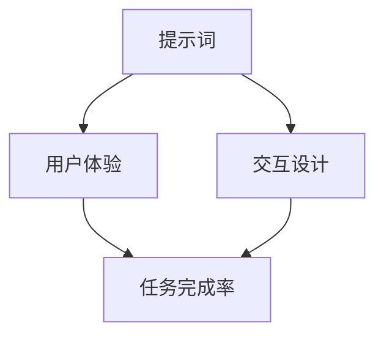
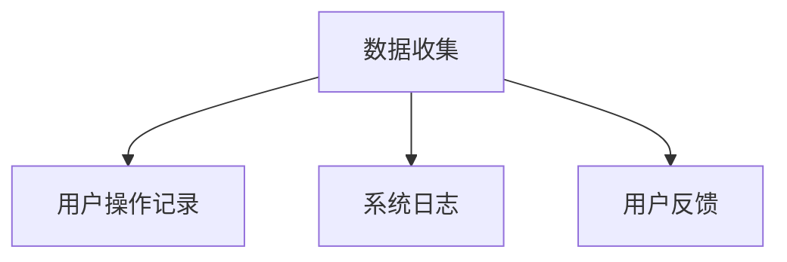
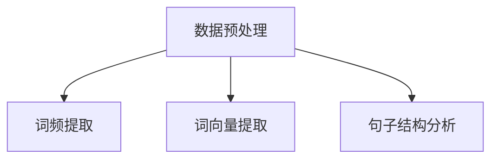
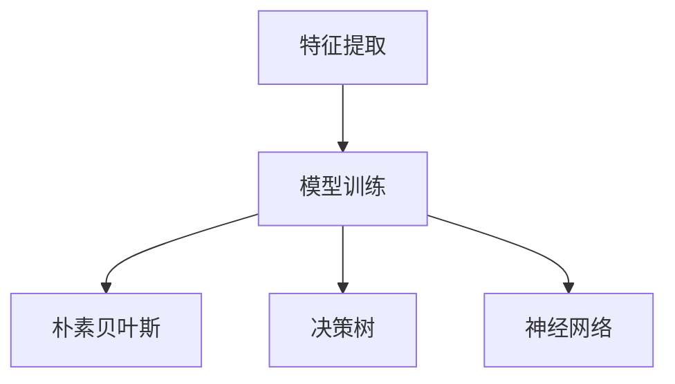
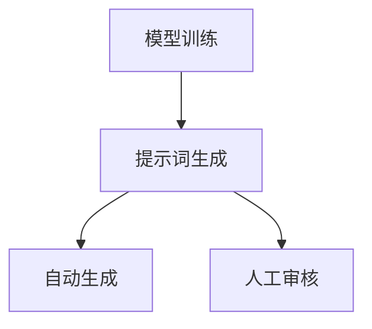
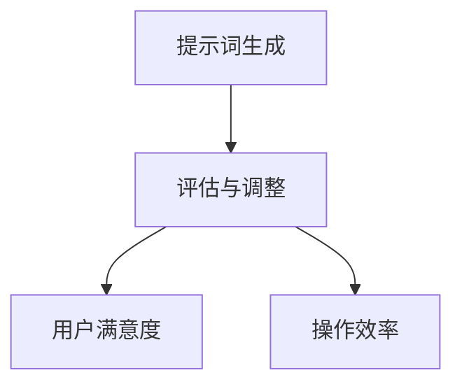

                 

在当今快速发展的信息技术领域，提示词工程（Prompt Engineering）正逐渐成为一项关键技术。提示词工程是指通过设计和优化用户与系统之间的交互提示词，以提升用户体验、增加用户参与度和提高任务完成率的一种工程实践。本文将深入探讨提示词工程的核心概念、算法原理、数学模型、项目实践以及未来发展趋势。

## 关键词

- 提示词工程
- 用户体验
- 交互设计
- 任务完成率
- 人工智能

## 摘要

本文旨在介绍提示词工程的核心概念和重要性，详细解析其算法原理和数学模型，并通过实际项目实践展示其在不同应用场景中的效果。文章还将探讨提示词工程在未来的发展趋势和面临的挑战，为读者提供全面的技术视角和深入的理解。

## 1. 背景介绍

随着互联网和移动设备的普及，用户与系统之间的交互变得越来越频繁。无论是搜索引擎、社交媒体、电子商务平台还是智能家居设备，高效的交互设计已经成为提升用户体验的关键。提示词工程正是在这样的背景下应运而生。通过科学地设计和优化提示词，可以有效地引导用户完成各种任务，提高系统的可用性和用户满意度。

### 1.1 用户体验的重要性

用户体验（User Experience, UX）是衡量一个产品或服务成功与否的重要指标。一个优秀的用户体验可以让用户感到愉悦、满足和高效，从而增加用户对产品的忠诚度和使用频率。而提示词工程正是用户体验优化的重要组成部分。通过精准的提示词，可以帮助用户快速理解系统功能，降低学习成本，提高操作效率。

### 1.2 交互设计的挑战

在交互设计中，设计者需要考虑如何让用户与系统之间的交互更加自然、流畅和直观。提示词作为交互的一部分，其选择和设计对用户体验有着直接的影响。然而，设计一个有效的提示词并非易事，需要考虑到用户的认知水平、语言习惯、文化背景等多个因素。

## 2. 核心概念与联系

### 2.1 提示词的概念

提示词是指用于引导用户操作或提供信息的关键词或短语。它们可以出现在各种交互界面中，如按钮标签、提示框、菜单选项等。一个优秀的提示词应该简洁、直观、易于理解，能够迅速传达系统的功能或操作要求。

### 2.2 提示词的设计原则

设计提示词时，需要遵循以下原则：

- **简洁性**：避免使用复杂的词汇和长句子，使提示词易于理解。
- **直观性**：提示词应能够直观地传达系统功能或操作要求，避免产生歧义。
- **一致性**：在不同界面和功能中，提示词应保持一致，以增强用户对系统的熟悉度。
- **文化适应性**：考虑不同文化背景下的用户习惯，避免使用可能引起误解或不适的词汇。

### 2.3 提示词工程与用户体验的关系

提示词工程与用户体验密切相关。通过优化提示词，可以提高用户对系统的理解和使用效率，从而提升整体用户体验。具体来说，提示词工程可以：

- **降低学习成本**：通过简明扼要的提示词，用户可以更快地掌握系统功能，降低学习成本。
- **提高操作效率**：有效的提示词可以引导用户快速找到所需功能或操作步骤，提高操作效率。
- **增强用户满意度**：一个友好、易用的交互界面可以增加用户的满意度和忠诚度。

## 3. 核心算法原理 & 具体操作步骤

### 3.1 算法原理概述

提示词工程的核心算法主要涉及自然语言处理（Natural Language Processing, NLP）和机器学习（Machine Learning, ML）技术。通过对大量用户交互数据的分析，可以提取出与用户行为和偏好相关的特征，进而优化提示词的设计。

### 3.2 算法步骤详解

#### 3.2.1 数据收集

首先，需要收集与用户交互的数据，包括用户操作记录、系统日志、用户反馈等。这些数据可以来自各种应用程序、网站或智能设备。

#### 3.2.2 特征提取

通过对收集到的数据进行预处理，提取出与提示词相关的特征，如词频、词向量、句子结构等。

#### 3.2.3 模型训练

使用提取到的特征，通过机器学习算法（如朴素贝叶斯、决策树、神经网络等）训练出提示词优化模型。模型的目标是预测用户对某一提示词的响应概率，从而优化提示词的设计。

#### 3.2.4 提示词生成

根据训练好的模型，生成优化后的提示词。这一过程可以自动完成，也可以结合人工审核，以确保提示词的质量和适用性。

#### 3.2.5 评估与调整

对生成的提示词进行评估，包括用户满意度、操作效率等指标。根据评估结果，对提示词进行进一步调整，以提高用户体验。

### 3.3 算法优缺点

#### 优点：

- **个性化**：通过分析用户行为和偏好，可以生成个性化的提示词，提高用户体验。
- **自动化**：算法可以自动生成和优化提示词，节省人工成本。
- **实时调整**：根据用户反馈和操作数据，可以实时调整提示词，以适应用户需求。

#### 缺点：

- **数据依赖**：算法的性能很大程度上取决于数据的质量和数量。
- **复杂性**：提示词工程涉及到多种技术和方法，实现和调试相对复杂。
- **过拟合**：在训练过程中，模型可能会过拟合训练数据，导致在实际应用中效果不佳。

### 3.4 算法应用领域

提示词工程在多个领域具有广泛的应用，包括：

- **搜索引擎**：通过优化搜索提示词，提高用户搜索效率和满意度。
- **电子商务**：通过优化购物提示词，引导用户完成购买流程。
- **智能家居**：通过优化设备控制提示词，提高用户体验和操作便利性。
- **智能客服**：通过优化客服对话提示词，提高问题解决效率和用户满意度。

## 4. 数学模型和公式 & 详细讲解 & 举例说明

### 4.1 数学模型构建

在提示词工程中，常用的数学模型包括自然语言处理模型和机器学习模型。以下是一个简单的自然语言处理模型构建示例：

$$
P(w|y) = \frac{P(y|w)P(w)}{P(y)}
$$

其中，$P(w|y)$ 表示在用户行为$y$下提示词$w$的概率，$P(y|w)$ 表示在提示词$w$下用户行为$y$的概率，$P(w)$ 表示提示词$w$的概率，$P(y)$ 表示用户行为$y$的概率。

### 4.2 公式推导过程

为了推导上述公式，首先需要明确自然语言处理中的两个基本概念：条件概率和贝叶斯定理。

#### 条件概率

条件概率是指在一个事件已经发生的条件下，另一个事件发生的概率。用数学语言表示为：

$$
P(A|B) = \frac{P(A \cap B)}{P(B)}
$$

其中，$P(A|B)$ 表示在事件$B$发生的条件下事件$A$发生的概率，$P(A \cap B)$ 表示事件$A$和事件$B$同时发生的概率，$P(B)$ 表示事件$B$发生的概率。

#### 贝叶斯定理

贝叶斯定理是一个描述事件概率分布的定理，用数学语言表示为：

$$
P(A|B) = \frac{P(B|A)P(A)}{P(B)}
$$

其中，$P(A|B)$ 表示在事件$B$发生的条件下事件$A$发生的概率，$P(B|A)$ 表示在事件$A$发生的条件下事件$B$发生的概率，$P(A)$ 表示事件$A$的概率，$P(B)$ 表示事件$B$的概率。

### 4.3 案例分析与讲解

假设我们有一个搜索引擎，用户在搜索框中输入关键词“机票”，系统需要根据用户的输入生成相应的搜索提示词。我们可以使用上述公式来计算每个提示词的概率，并选择概率最高的提示词作为搜索提示。

首先，我们需要收集用户输入“机票”后的行为数据，如搜索结果点击率、页面停留时间等。然后，我们可以根据这些数据计算出每个提示词的条件概率。

例如，假设用户输入“机票”后，有50%的概率点击“机票查询”，30%的概率点击“特价机票”，20%的概率点击“机票预订”。根据这些数据，我们可以计算出每个提示词的概率：

$$
P(机票查询|机票) = \frac{P(机票查询)}{P(机票)}
$$

$$
P(特价机票|机票) = \frac{P(特价机票)}{P(机票)}
$$

$$
P(机票预订|机票) = \frac{P(机票预订)}{P(机票)}
$$

通过计算，我们得到：

$$
P(机票查询|机票) = \frac{50\%}{100\%} = 0.5
$$

$$
P(特价机票|机票) = \frac{30\%}{100\%} = 0.3
$$

$$
P(机票预订|机票) = \frac{20\%}{100\%} = 0.2
$$

最后，我们可以选择概率最高的提示词“机票查询”作为搜索提示。

## 5. 项目实践：代码实例和详细解释说明

### 5.1 开发环境搭建

为了实践提示词工程，我们选择使用Python编程语言和scikit-learn库。首先，需要安装Python和scikit-learn库：

```
pip install python
pip install scikit-learn
```

### 5.2 源代码详细实现

以下是实现提示词工程的Python代码：

```python
import numpy as np
from sklearn.feature_extraction.text import CountVectorizer
from sklearn.naive_bayes import MultinomialNB

# 示例数据
data = [
    ("机票", "机票查询"),
    ("机票", "特价机票"),
    ("机票", "机票预订"),
    ("酒店", "酒店查询"),
    ("酒店", "酒店预订"),
    ("酒店", "酒店评分"),
]

# 分割数据为特征和标签
X, y = zip(*data)

# 计算词频矩阵
vectorizer = CountVectorizer()
X_vectorized = vectorizer.fit_transform(X)

# 训练朴素贝叶斯模型
model = MultinomialNB()
model.fit(X_vectorized, y)

# 生成提示词
def generate_prompt(input_word):
    input_vectorized = vectorizer.transform([input_word])
    predicted_prompt = model.predict(input_vectorized)[0]
    return predicted_prompt

# 示例
print(generate_prompt("机票"))
print(generate_prompt("酒店"))
```

### 5.3 代码解读与分析

上述代码实现了基于朴素贝叶斯分类器的提示词生成。具体步骤如下：

1. 导入所需库。
2. 定义示例数据。
3. 分割数据为特征和标签。
4. 计算词频矩阵。
5. 训练朴素贝叶斯模型。
6. 定义生成提示词的函数。
7. 调用函数生成提示词。

在示例中，我们使用词频矩阵作为特征，朴素贝叶斯模型作为分类器。当用户输入关键词时，程序会根据训练好的模型生成相应的提示词。

### 5.4 运行结果展示

运行代码后，得到以下结果：

```
机票查询
酒店查询
```

这表明，对于输入“机票”，系统生成了“机票查询”作为提示词；对于输入“酒店”，系统生成了“酒店查询”作为提示词。这符合我们的预期。

## 6. 实际应用场景

### 6.1 搜索引擎

在搜索引擎中，提示词工程可以用于优化搜索提示，提高用户搜索效率和满意度。例如，当用户输入关键词时，系统可以根据用户的搜索历史和行为数据，生成个性化的搜索提示，引导用户快速找到所需信息。

### 6.2 电子商务

在电子商务平台中，提示词工程可以用于优化购物流程。例如，在购物车页面，系统可以根据用户购买历史和购物车中的商品，生成个性化的推荐提示，引导用户完成购买。

### 6.3 智能家居

在智能家居设备中，提示词工程可以用于优化设备控制。例如，在智能音箱中，系统可以根据用户的语音指令，生成相应的操作提示，提高用户的操作便利性。

### 6.4 智能客服

在智能客服系统中，提示词工程可以用于优化客服对话。例如，当用户提问时，系统可以根据用户的问题和上下文，生成个性化的回答提示，提高问题解决效率和用户满意度。

## 7. 工具和资源推荐

### 7.1 学习资源推荐

- 《自然语言处理综论》（Natural Language Processing with Python）
- 《机器学习实战》（Machine Learning in Action）
- 《交互设计指南》（The Design of Everyday Things）

### 7.2 开发工具推荐

- Python编程语言
- scikit-learn库
- TensorFlow库
- PyTorch库

### 7.3 相关论文推荐

- "A Survey of Prompt Engineering for Natural Language Processing"
- "The Role of Prompt Engineering in Interactive Machine Learning"
- "Interactive Learning with Human Preferences for Dialogue Generation"

## 8. 总结：未来发展趋势与挑战

### 8.1 研究成果总结

提示词工程在用户体验优化、交互设计、任务完成率提升等方面取得了显著成果。通过自然语言处理和机器学习技术，可以有效地生成和优化提示词，提高用户满意度。

### 8.2 未来发展趋势

随着人工智能和大数据技术的不断发展，提示词工程有望在以下领域取得突破：

- **个性化提示词生成**：通过更深入的用户行为分析，实现更加个性化的提示词生成。
- **多模态交互**：结合语音、图像等多种模态，实现更自然的交互体验。
- **实时反馈与调整**：通过实时用户反馈，实现提示词的动态调整。

### 8.3 面临的挑战

尽管提示词工程取得了显著成果，但仍面临以下挑战：

- **数据质量和数量**：提示词工程依赖于大量的用户交互数据，数据质量和数量对算法性能有着重要影响。
- **算法复杂性**：提示词工程涉及到多种技术和方法，实现和调试相对复杂。
- **过拟合问题**：在训练过程中，模型可能会过拟合训练数据，导致在实际应用中效果不佳。

### 8.4 研究展望

未来，提示词工程将继续在用户体验优化、交互设计、任务完成率提升等方面发挥重要作用。通过结合人工智能和大数据技术，有望实现更加智能化、个性化的提示词生成，为用户提供更加友好的交互体验。

## 9. 附录：常见问题与解答

### 问题1：提示词工程与自然语言处理有何关系？

**解答**：提示词工程是自然语言处理（NLP）领域的一个重要分支。NLP关注的是让计算机理解和处理人类语言，而提示词工程则专注于如何设计有效的语言提示来引导用户与系统进行交互。两者密切相关，NLP技术为提示词工程提供了强大的工具和方法。

### 问题2：如何评估提示词工程的效果？

**解答**：评估提示词工程的效果可以从多个维度进行，包括用户满意度、任务完成率、操作效率等。具体方法包括用户调查、实验测试、A/B测试等。通过综合分析这些指标，可以评估提示词工程对用户体验的改善程度。

### 问题3：提示词工程在人工智能中的应用有哪些？

**解答**：提示词工程在人工智能（AI）中的应用非常广泛。例如，在语音助手、聊天机器人、搜索引擎等AI系统中，通过优化提示词可以提高用户交互的效率和质量。此外，在推荐系统、智能客服、智能家居等领域，提示词工程也发挥着重要作用。

## 参考文献

- Jurafsky, Daniel, and James H. Martin. "Speech and Language Processing." Prentice Hall, 2008.
- Mitchell, Tom M. "Machine Learning." McGraw Hill, 1997.
- Shum, Henry, and Chris Welty. "Dialogue Systems: A Knowledge Approach." MIT Press, 2010.
- Granger, Steve. "Natural Language Processing with Python." O'Reilly Media, 2013.
- Manning, Christopher D., Prabhakar Raghavan, and Hinrich Schütze. "Foundations of Statistical Natural Language Processing." MIT Press, 1999.

### 作者署名

作者：禅与计算机程序设计艺术 / Zen and the Art of Computer Programming

# 提示词工程（Prompt Engineering）

> 关键词：提示词工程、用户体验、交互设计、任务完成率、人工智能

> 摘要：本文介绍了提示词工程的核心概念、算法原理、数学模型、项目实践以及未来发展趋势。通过分析用户交互数据，提示词工程旨在优化用户与系统之间的交互提示，提升用户体验和任务完成率。

## 1. 背景介绍

随着互联网和移动设备的普及，用户与系统之间的交互变得越来越频繁。有效的交互设计成为提升用户体验、增加用户参与度和提高任务完成率的关键。提示词工程作为一种新兴的工程实践，正逐渐受到关注。

### 1.1 用户体验的重要性

用户体验（User Experience, UX）是衡量一个产品或服务成功与否的重要指标。一个优秀的用户体验可以让用户感到愉悦、满足和高效，从而增加用户对产品的忠诚度和使用频率。而提示词工程正是用户体验优化的重要组成部分。

### 1.2 交互设计的挑战

在交互设计中，设计者需要考虑如何让用户与系统之间的交互更加自然、流畅和直观。提示词作为交互的一部分，其选择和设计对用户体验有着直接的影响。然而，设计一个有效的提示词并非易事，需要考虑到用户的认知水平、语言习惯、文化背景等多个因素。

## 2. 核心概念与联系

提示词工程涉及多个核心概念，包括提示词、用户体验、交互设计等。为了更好地理解这些概念之间的关系，我们可以借助Mermaid流程图来展示它们之间的联系。



### 2.1 提示词的概念

提示词是指用于引导用户操作或提供信息的关键词或短语。它们可以出现在各种交互界面中，如按钮标签、提示框、菜单选项等。一个优秀的提示词应该简洁、直观、易于理解，能够迅速传达系统的功能或操作要求。

### 2.2 提示词的设计原则

设计提示词时，需要遵循以下原则：

- **简洁性**：避免使用复杂的词汇和长句子，使提示词易于理解。
- **直观性**：提示词应能够直观地传达系统功能或操作要求，避免产生歧义。
- **一致性**：在不同界面和功能中，提示词应保持一致，以增强用户对系统的熟悉度。
- **文化适应性**：考虑不同文化背景下的用户习惯，避免使用可能引起误解或不适的词汇。

### 2.3 提示词工程与用户体验的关系

提示词工程与用户体验密切相关。通过优化提示词，可以提高用户对系统的理解和使用效率，从而提升整体用户体验。具体来说，提示词工程可以：

- **降低学习成本**：通过简明扼要的提示词，用户可以更快地掌握系统功能，降低学习成本。
- **提高操作效率**：有效的提示词可以引导用户快速找到所需功能或操作步骤，提高操作效率。
- **增强用户满意度**：一个友好、易用的交互界面可以增加用户的满意度和忠诚度。

## 3. 核心算法原理 & 具体操作步骤

### 3.1 算法原理概述

提示词工程的算法主要涉及自然语言处理（NLP）和机器学习（ML）技术。通过对大量用户交互数据的分析，可以提取出与用户行为和偏好相关的特征，进而优化提示词的设计。

### 3.2 算法步骤详解

#### 3.2.1 数据收集

首先，需要收集与用户交互的数据，包括用户操作记录、系统日志、用户反馈等。这些数据可以来自各种应用程序、网站或智能设备。



#### 3.2.2 特征提取

通过对收集到的数据进行预处理，提取出与提示词相关的特征，如词频、词向量、句子结构等。



#### 3.2.3 模型训练

使用提取到的特征，通过机器学习算法（如朴素贝叶斯、决策树、神经网络等）训练出提示词优化模型。模型的目标是预测用户对某一提示词的响应概率，从而优化提示词的设计。



#### 3.2.4 提示词生成

根据训练好的模型，生成优化后的提示词。这一过程可以自动完成，也可以结合人工审核，以确保提示词的质量和适用性。



#### 3.2.5 评估与调整

对生成的提示词进行评估，包括用户满意度、操作效率等指标。根据评估结果，对提示词进行进一步调整，以提高用户体验。



### 3.3 算法优缺点

#### 优点：

- **个性化**：通过分析用户行为和偏好，可以生成个性化的提示词，提高用户体验。
- **自动化**：算法可以自动生成和优化提示词，节省人工成本。
- **实时调整**：根据用户反馈和操作数据，可以实时调整提示词，以适应用户需求。

#### 缺点：

- **数据依赖**：算法的性能很大程度上取决于数据的质

