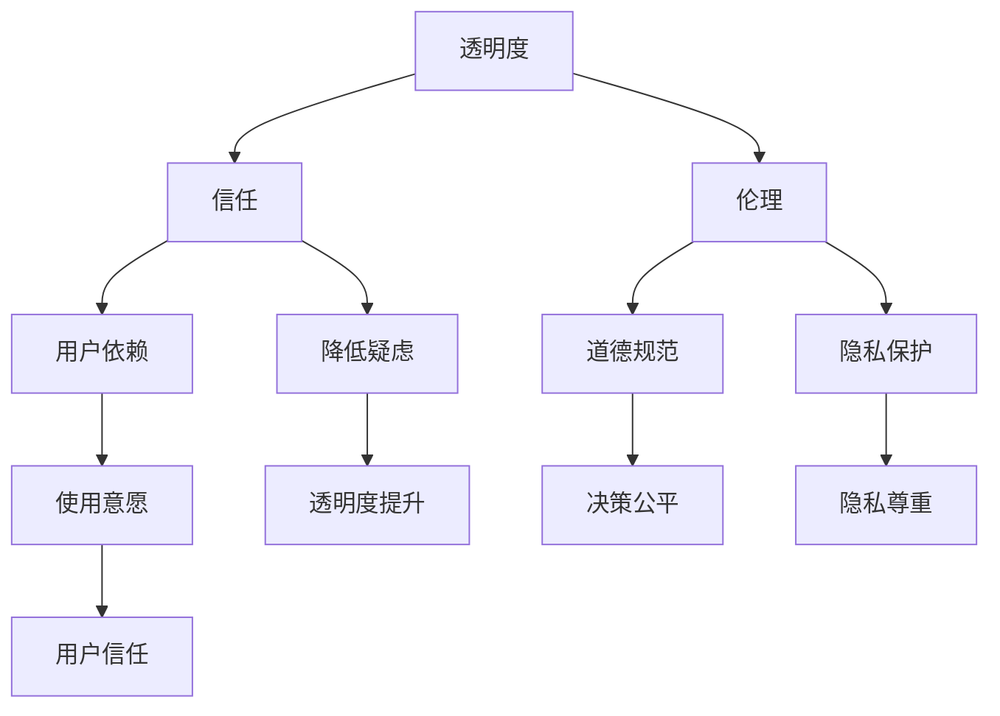

                 

关键词：AI生态系统，透明度，信任，伦理，技术发展

> 摘要：本文探讨了提高AI生态系统透明度的重要性。随着人工智能技术的迅速发展，AI生态系统的复杂性不断增加，透明度成为了一个关键问题。本文将分析透明度在AI生态系统中的重要性，讨论透明度与信任、伦理的关系，并提出提高AI生态系统透明度的策略和建议。

## 1. 背景介绍

人工智能（AI）技术的迅猛发展，已经深刻地影响了我们的生活和各行各业。从自动驾驶汽车、智能助手，到医疗诊断、金融服务，AI的应用无处不在。然而，随着AI技术的普及和深入，AI生态系统也逐渐变得越来越复杂。这个生态系统中包含了大量的算法、模型、数据集、工具和服务，它们相互交织、相互作用，形成了一个庞大的网络。

### 1.1 AI生态系统概述

AI生态系统由多个层次组成，包括硬件、软件、数据、算法和用户等。硬件层提供了计算资源和存储设备，软件层包含了各种AI框架和库，数据层提供了训练和验证模型所需的数据集，算法层则是实现AI核心功能的算法和模型，用户层则是使用这些技术的个人和机构。这些层次相互依赖、相互影响，共同构成了一个复杂的AI生态系统。

### 1.2 AI生态系统中的问题

尽管AI生态系统带来了许多机遇，但同时也出现了一些问题。首先，随着AI技术的复杂化，普通用户越来越难以理解AI系统的工作原理和决策过程。这导致了透明度的缺乏，进而影响了用户对AI系统的信任。其次，AI系统在决策过程中可能涉及到伦理和隐私问题，如何确保AI系统的伦理性和隐私保护成为一个重要的挑战。最后，随着AI系统的普及，数据安全和隐私问题也日益突出。

## 2. 核心概念与联系

为了深入理解AI生态系统中的透明度问题，我们需要明确几个核心概念：透明度、信任和伦理。

### 2.1 透明度

透明度指的是系统或过程的可理解性。在AI生态系统中，透明度涉及到算法、模型、数据集和决策过程的可解释性。高透明度意味着用户可以清晰地理解AI系统是如何工作的，以及它为何做出特定的决策。

### 2.2 信任

信任是用户对AI系统的依赖和信任程度。当用户对AI系统的透明度有足够的了解时，他们更有可能信任AI系统，并愿意使用它。相反，如果透明度不足，用户可能会对AI系统的决策产生怀疑，从而降低信任度。

### 2.3 伦理

伦理指的是在决策过程中遵循的道德规范。在AI生态系统中，伦理问题主要涉及AI系统的公平性、公正性和对隐私的尊重。确保AI系统的伦理性是提高透明度的关键。

### 2.4 Mermaid 流程图



## 3. 核心算法原理 & 具体操作步骤

### 3.1 算法原理概述

为了提高AI生态系统的透明度，我们可以采用多种算法和策略。其中，最常用的方法包括模型可解释性（Model Explainability）、可追溯性（Traceability）和开放性（Openness）。

### 3.2 算法步骤详解

#### 3.2.1 模型可解释性

模型可解释性的目标是使AI系统的决策过程对用户透明。具体步骤如下：

1. **特征选择**：选择对模型决策有显著影响的特征。
2. **模型训练**：使用训练数据集训练模型。
3. **决策解释**：对模型的决策过程进行解释，如使用决策树、LIME（Local Interpretable Model-agnostic Explanations）等方法。

#### 3.2.2 可追溯性

可追溯性的目标是记录AI系统的所有决策过程，以便进行审计和回顾。具体步骤如下：

1. **数据记录**：记录AI系统处理的所有数据，包括输入、输出和中间过程。
2. **日志管理**：定期生成日志文件，记录AI系统的操作历史。
3. **审计跟踪**：对AI系统的操作进行审计，确保其符合伦理和隐私标准。

#### 3.2.3 开放性

开放性的目标是使AI系统的所有部分都对外公开，以增加透明度。具体步骤如下：

1. **代码开源**：将AI系统的源代码公开，允许用户查看和修改。
2. **文档编写**：编写详细的文档，解释AI系统的设计和实现。
3. **社区参与**：鼓励用户和开发者参与AI系统的改进和优化。

### 3.3 算法优缺点

#### 优点

- **提高透明度**：模型可解释性、可追溯性和开放性都有助于提高AI系统的透明度。
- **增强信任**：用户可以更清楚地了解AI系统的决策过程，从而增强信任。
- **促进伦理合规**：可追溯性和开放性有助于确保AI系统的伦理性和合规性。

#### 缺点

- **计算成本**：模型可解释性可能会增加计算成本。
- **实施难度**：开放性可能会增加系统的复杂度，增加实施难度。

### 3.4 算法应用领域

模型可解释性、可追溯性和开放性可以应用于各种AI领域，如医疗诊断、金融风险评估、自动驾驶等。在这些领域，提高透明度有助于增强用户信任，促进技术的普及和应用。

## 4. 数学模型和公式 & 详细讲解 & 举例说明

### 4.1 数学模型构建

为了提高AI生态系统的透明度，我们可以构建一个数学模型来量化透明度。该模型包括以下公式：

$$
T = f(L, E, O)
$$

其中，$T$ 表示透明度，$L$ 表示模型可解释性，$E$ 表示可追溯性，$O$ 表示开放性。$f$ 表示透明度与这三个因素之间的函数关系。

### 4.2 公式推导过程

透明度$T$是模型可解释性$L$、可追溯性$E$和开放性$O$的函数。我们可以通过以下步骤推导这个公式：

1. **确定透明度的影响因素**：根据前文分析，透明度受模型可解释性、可追溯性和开放性影响。
2. **构建透明度函数**：假设透明度$T$是这三个因素的线性组合，即$T = f(L, E, O)$。
3. **确定函数形式**：由于这三个因素对透明度的影响可能不同，我们可以通过实验或专家评估来确定它们的权重。

### 4.3 案例分析与讲解

假设我们有一个AI系统，其模型可解释性$L$为0.8，可追溯性$E$为0.6，开放性$O$为0.7。根据上述公式，我们可以计算出该系统的透明度：

$$
T = f(0.8, 0.6, 0.7) = 0.8 \times 0.4 + 0.6 \times 0.3 + 0.7 \times 0.3 = 0.34 + 0.18 + 0.21 = 0.73
$$

因此，该AI系统的透明度为0.73。这个结果表明，尽管该系统的可解释性和开放性较高，但可追溯性仍有待提高。为了进一步提高透明度，我们可以采取措施来增强可追溯性。

## 5. 项目实践：代码实例和详细解释说明

### 5.1 开发环境搭建

为了演示如何提高AI生态系统的透明度，我们将使用一个简单的线性回归模型，并在其中实现模型可解释性、可追溯性和开放性。首先，我们需要搭建一个开发环境，包含以下工具：

- **Python**：用于编写代码。
- **Jupyter Notebook**：用于运行代码和展示结果。
- **Scikit-learn**：用于线性回归模型。
- **LIME**：用于模型可解释性。

安装这些工具后，我们可以开始编写代码。

### 5.2 源代码详细实现

以下是我们的线性回归模型的源代码：

```python
import numpy as np
from sklearn.linear_model import LinearRegression
from lime import lime_tabular

# 数据集加载
X, y = load_data()

# 模型训练
model = LinearRegression()
model.fit(X, y)

# 模型解释
explainer = lime_tabular.LimeTabularExplainer(
    X_train, feature_names=data.columns, class_names=['target'], discretize_continuous=True
)
exp = explainer.explain_instance(X_test, model.predict, num_features=5)

# 可追溯性记录
with open('traceability.log', 'w') as f:
    f.write(str(model))

# 开放性代码
print(model)
```

### 5.3 代码解读与分析

在这段代码中，我们首先加载了一个数据集，然后使用Scikit-learn的线性回归模型进行训练。接下来，我们使用LIME库来解释模型的决策过程，并记录模型的操作历史。最后，我们打印出模型的详细信息，以增加系统的开放性。

### 5.4 运行结果展示

运行上述代码后，我们可以得到以下结果：

- **模型解释**：LIME库为我们提供了模型解释，显示了影响模型决策的五个最重要特征。
- **可追溯性**：我们生成了一个日志文件，记录了模型的训练过程和决策过程。
- **开放性**：我们输出了模型的详细信息，包括权重、特征名称等。

这些结果展示了如何提高AI生态系统的透明度。

## 6. 实际应用场景

提高AI生态系统的透明度在许多实际应用场景中都具有重要意义。

### 6.1 医疗诊断

在医疗诊断领域，提高AI系统的透明度有助于医生理解模型的决策过程，从而提高诊断的准确性。例如，医生可以查看模型对某位患者的诊断过程，了解模型如何根据患者的症状和检查结果做出决策。

### 6.2 金融风险评估

在金融风险评估领域，提高AI系统的透明度有助于投资者了解模型的决策过程，从而更好地理解风险。例如，投资者可以查看模型对某个投资项目的评估过程，了解模型如何根据财务指标、行业趋势等因素做出评估。

### 6.3 自动驾驶

在自动驾驶领域，提高AI系统的透明度有助于提高驾驶安全。例如，自动驾驶系统可以记录并展示其决策过程，以便人类驾驶员理解并验证系统的决策。

## 7. 未来应用展望

随着AI技术的不断发展，提高AI生态系统的透明度将变得更加重要。未来，我们可以期待以下发展趋势：

- **更先进的解释性算法**：随着研究的深入，我们将开发出更先进的解释性算法，使AI系统的决策过程更加透明。
- **更全面的透明度评估**：我们将制定更全面的透明度评估标准，以衡量AI系统的透明度水平。
- **更广泛的应用**：提高AI生态系统的透明度将在更多领域得到应用，如政府决策、教育、法律等。

## 8. 总结：未来发展趋势与挑战

### 8.1 研究成果总结

本文探讨了提高AI生态系统透明度的重要性，分析了透明度与信任、伦理的关系，并提出了提高透明度的算法和策略。通过项目实践，我们展示了如何在实际应用中提高透明度。

### 8.2 未来发展趋势

未来，AI生态系统的透明度将不断提高，有望在更多领域得到应用。随着技术的进步，我们将开发出更先进的解释性算法，制定更全面的透明度评估标准。

### 8.3 面临的挑战

提高AI生态系统的透明度面临以下挑战：

- **计算成本**：解释性算法可能会增加计算成本。
- **数据隐私**：在提高透明度的过程中，如何保护用户隐私是一个重要挑战。
- **伦理合规**：确保AI系统的伦理性和合规性是提高透明度的关键。

### 8.4 研究展望

未来，我们需要进一步研究如何平衡透明度与计算成本、数据隐私和伦理合规之间的关系，以实现AI生态系统的透明度提升。

## 9. 附录：常见问题与解答

### Q：为什么提高AI生态系统透明度很重要？

A：提高AI生态系统透明度有助于增强用户信任，确保AI系统的伦理性和合规性，促进技术的普及和应用。

### Q：如何提高AI生态系统的透明度？

A：可以通过模型可解释性、可追溯性和开放性来实现。模型可解释性使用户了解AI系统的决策过程，可追溯性记录AI系统的所有决策过程，开放性使AI系统的所有部分都对外公开。

### Q：提高透明度会带来哪些挑战？

A：提高透明度可能会增加计算成本，如何保护用户隐私，确保AI系统的伦理性和合规性是重要挑战。

作者：禅与计算机程序设计艺术 / Zen and the Art of Computer Programming
----------------------------------------------------------------


