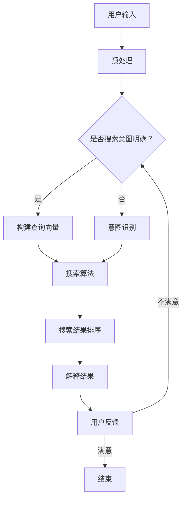

                 

在当前的信息时代，人工智能（AI）技术已经渗透到我们日常生活的方方面面。从搜索引擎、推荐系统到自动驾驶和医疗诊断，AI的应用场景越来越广泛。然而，随着AI系统变得越来越复杂，一个不可忽视的问题是：它们是否足够透明和可解释？用户是否能够理解AI的决策过程和结果？

这篇文章将探讨如何提高搜索可解释性，即如何让AI系统更加透明，从而使用户能够理解并信任AI的决策。我们将首先介绍搜索可解释性的重要性，然后深入探讨提高搜索可解释性的方法，包括核心算法原理、数学模型和具体项目实践。最后，我们将讨论AI在搜索领域的实际应用场景以及未来的发展方向和挑战。

## 文章关键词

- 搜索可解释性
- AI透明度
- 人工智能
- 决策过程
- 信任
- 用户理解

## 文章摘要

本文旨在探讨如何提高搜索可解释性，使AI系统更加透明和可理解。首先，我们将介绍搜索可解释性的重要性，并分析当前AI系统在透明度方面存在的问题。接着，我们将详细讨论提高搜索可解释性的核心算法原理，包括数学模型和算法步骤。随后，我们将通过一个实际项目实践，展示如何将理论应用于实践。最后，我们将讨论搜索可解释性在AI领域的实际应用场景，并展望未来的发展趋势和挑战。

## 1. 背景介绍

### 1.1 AI的崛起

人工智能（AI）作为计算机科学的一个重要分支，近年来取得了飞速发展。从最初的规则系统到现代的深度学习，AI的应用范围不断扩大，从工业自动化、金融分析到医疗诊断、自动驾驶，AI已经深深影响了我们的日常生活。然而，随着AI技术的进步，一个不可忽视的问题是：AI系统的决策过程和结果是否透明和可解释？

### 1.2 搜索可解释性的重要性

搜索可解释性是指用户能够理解AI系统的决策过程和结果的能力。在搜索引擎和推荐系统中，搜索可解释性尤为重要。用户希望能够理解为什么系统推荐了某个结果，或者为什么某个结果排在搜索结果的前列。如果用户无法理解这些决策，他们可能会对系统的信任度下降，甚至拒绝使用AI系统。

### 1.3 当前AI系统在透明度方面的问题

尽管AI技术在预测和决策方面取得了巨大成功，但它们通常被认为是“黑箱”系统，即用户无法理解AI是如何得出决策的。这种情况可能导致以下几个问题：

- **信任问题**：用户可能无法信任一个无法理解的系统，尤其是在涉及重要决策（如医疗诊断、金融投资等）时。
- **错误修正**：当AI系统出现错误时，用户无法知道如何修正，从而增加了错误扩散的风险。
- **合规问题**：在某些领域，如医疗、金融等，透明度和可解释性是合规的必要条件。

### 1.4 提高搜索可解释性的必要性

为了解决上述问题，提高搜索可解释性变得尤为重要。这不仅有助于增加用户对AI系统的信任度，还能帮助用户更好地利用AI系统，从而提高其效率和效果。

## 2. 核心概念与联系

### 2.1 什么是搜索可解释性？

搜索可解释性指的是用户能够理解搜索算法的决策过程和结果的能力。一个高度可解释的搜索系统，能够向用户清晰地展示其推荐结果或排名的原因，使用户能够信任并接受这些决策。

### 2.2 相关概念

- **可解释性（Explainability）**：指系统或算法能够清晰地解释其决策过程的能力。
- **透明度（Transparency）**：指系统的内部结构和决策过程对外部用户是可见和可理解的。
- **决策解释（Decision Explanation）**：指在决策过程中，对决策的原因、依据和逻辑进行解释。

### 2.3 搜索可解释性的挑战

- **复杂度**：现代搜索算法通常非常复杂，涉及大量的特征和参数，这使得解释过程变得困难。
- **不确定性**：搜索结果往往涉及不确定性，例如，某个搜索结果可能是因为算法预测其相关性较高，但也有可能是因为某些参数的调整。
- **用户多样性**：不同用户对解释的需求和期望可能不同，如何设计一个既通用又满足用户需求的解释系统是一个挑战。

### 2.4 Mermaid 流程图

以下是一个简化的搜索可解释性流程图，展示了搜索系统的关键组件和流程：



### 2.5 核心概念与联系

- **用户输入**：用户通过关键词或问题进行搜索。
- **预处理**：对用户输入进行清洗、分词等处理，以构建查询向量。
- **意图识别**：当用户输入不明确时，通过自然语言处理技术识别用户的实际意图。
- **查询向量构建**：将用户输入转换为查询向量，以便进行相似度计算。
- **搜索算法**：根据查询向量，使用搜索算法（如向量空间模型、基于内容的检索等）获取相关结果。
- **搜索结果排序**：对搜索结果进行排序，以提供最相关的结果。
- **解释结果**：向用户解释搜索结果的相关性和排序依据。
- **用户反馈**：用户根据解释结果进行评价，反馈给系统以优化解释质量。

通过上述流程，我们可以看到，提高搜索可解释性需要从多个方面入手，包括算法设计、数据预处理、解释模型等。

## 3. 核心算法原理 & 具体操作步骤

### 3.1 算法原理概述

提高搜索可解释性的核心算法通常包括以下几个关键组成部分：

1. **查询理解**：通过自然语言处理（NLP）技术，将用户输入的文本转换为计算机可以理解的查询向量。
2. **搜索算法**：基于查询向量，使用特定的搜索算法（如向量空间模型、TF-IDF等）获取相关结果。
3. **结果解释**：对搜索结果进行解释，使用户能够理解结果的来源和依据。
4. **用户反馈循环**：根据用户反馈不断优化搜索结果和解释质量。

### 3.2 算法步骤详解

1. **查询理解**：

   - **分词**：将用户输入的文本拆分成词语。
   - **词性标注**：对每个词语进行词性标注，以区分名词、动词等。
   - **实体识别**：识别文本中的实体，如人名、地名等。
   - **语义分析**：使用语义分析技术，理解文本的整体含义和上下文。

2. **查询向量构建**：

   - **词袋模型**：将文本转换为词袋模型，每个词语作为一个特征。
   - **TF-IDF**：计算词语在查询文本中的频率（TF）和其在整个文档集合中的重要性（IDF），生成查询向量。
   - **Word2Vec**：使用词嵌入技术，将词语转换为高维向量。

3. **搜索算法**：

   - **基于内容的检索**：直接使用查询向量，在文档集合中查找相似度最高的文档。
   - **向量空间模型**：将文档和查询向量投影到高维空间中，计算它们之间的距离，排序并返回最接近的文档。
   - **PageRank**：基于链接分析，为每个网页分配权重，搜索结果根据权重排序。

4. **结果解释**：

   - **相似度分析**：解释文档与查询之间的相似度依据。
   - **特征加权**：展示每个特征的权重，以及它们如何影响最终结果。
   - **可视化**：使用图表和图像，直观地展示搜索结果的相关性。

5. **用户反馈循环**：

   - **用户评价**：收集用户对搜索结果的评价，以评估解释的质量。
   - **反馈优化**：根据用户评价，调整算法参数和解释模型，以提高解释质量。
   - **持续迭代**：不断收集用户反馈，优化搜索结果和解释，形成一个闭环系统。

### 3.3 算法优缺点

- **优点**：

  - 提高搜索可解释性，增强用户信任。
  - 结合自然语言处理技术，实现智能化的查询理解和结果解释。
  - 支持用户反馈，实现个性化搜索体验。

- **缺点**：

  - 算法复杂度高，对计算资源和处理时间要求较高。
  - 需要大量的训练数据和高质量的标注数据。
  - 解释结果可能受到算法不确定性和用户多样性等因素的影响。

### 3.4 算法应用领域

搜索可解释性算法主要应用于以下领域：

- **搜索引擎**：提高用户对搜索结果的信任度和满意度。
- **推荐系统**：向用户解释推荐结果的原因，增强用户对推荐的接受度。
- **智能客服**：使用自然语言处理技术，实现智能化的客户服务，提高用户体验。
- **金融风控**：解释金融模型的风险预测结果，帮助金融机构进行风险控制。
- **医疗诊断**：解释医疗诊断模型的结果，帮助医生和患者理解诊断过程。

通过上述算法原理和具体步骤的介绍，我们可以看到，提高搜索可解释性需要从多个方面入手，结合自然语言处理、机器学习和数据可视化等技术，实现一个既智能又透明的搜索系统。

## 4. 数学模型和公式 & 详细讲解 & 举例说明

### 4.1 数学模型构建

在提高搜索可解释性的过程中，数学模型扮演了关键角色。以下是一些常用的数学模型和公式：

#### 4.1.1 词袋模型（Bag of Words, BoW）

词袋模型是一种简单且常用的文本表示方法，它将文档表示为词语的集合，不考虑词语的顺序和上下文。

**公式：**
$$
B = \{w_1, w_2, ..., w_n\}
$$
其中，$B$ 是文档的词袋，$w_1, w_2, ..., w_n$ 是文档中的词语。

#### 4.1.2 TF-IDF模型（Term Frequency-Inverse Document Frequency）

TF-IDF模型用于评估词语在文档中的重要程度。TF 表示词语在文档中出现的频率，IDF 表示词语在文档集合中的逆频率。

**公式：**
$$
TF(t) = \frac{f(t, d)}{max(f(t, d))}
$$
$$
IDF(t) = \log \left( \frac{N}{|d \in D : t \in d|} \right)
$$
$$
TF-IDF(t, d) = TF(t) \times IDF(t)
$$
其中，$f(t, d)$ 是词语 $t$ 在文档 $d$ 中出现的频率，$N$ 是文档集合中的文档总数，$|d \in D : t \in d|$ 是包含词语 $t$ 的文档数。

#### 4.1.3 Word2Vec模型（Word Embeddings）

Word2Vec模型通过神经网络的训练，将词语转换为高维向量。常见的Word2Vec模型包括CBOW（Continuous Bag of Words）和Skip-Gram。

**公式：**
$$
\text{CBOW}(w) = \text{avg}(\text{vec}(w_1), \text{vec}(w_2), ..., \text{vec}(w_c)) \text{ where } w = (w_1, w_2, ..., w_c)
$$
$$
\text{Skip-Gram}(w) = \text{softmax}(\text{vec}(w) \cdot \text{weights})
$$
其中，$\text{vec}(w)$ 是词语 $w$ 的向量表示，$\text{weights}$ 是训练得到的权重向量。

#### 4.1.4 余弦相似度（Cosine Similarity）

余弦相似度用于衡量两个向量之间的相似度。其公式如下：

**公式：**
$$
\text{Cosine Similarity}(v_1, v_2) = \frac{v_1 \cdot v_2}{\lVert v_1 \rVert \lVert v_2 \rVert}
$$
其中，$v_1$ 和 $v_2$ 是两个向量，$\lVert \cdot \rVert$ 表示向量的欧几里得范数，$\cdot$ 表示向量的内积。

### 4.2 公式推导过程

以下是对TF-IDF模型中的IDF公式的推导过程：

**目标**：推导TF-IDF模型中的IDF公式。

**假设**：给定一个文档集合$D$，其中每个文档$d$包含若干词语$t$。

**步骤**：

1. **定义词语频率**：词语$t$在文档$d$中的频率为$f(t, d)$。

2. **计算文档总数**：文档集合$D$中的文档总数为$N$。

3. **计算包含词语$t$的文档数**：设包含词语$t$的文档数为$|d \in D : t \in d|$。

4. **计算逆频率**：词语$t$的逆频率为$IDF(t) = \log \left( \frac{N}{|d \in D : t \in d|} \right)$。

5. **结合词语频率和逆频率**：结合词语的频率和逆频率，得到词语$t$在文档$d$中的TF-IDF权重为$TF-IDF(t, d) = TF(t) \times IDF(t)$。

### 4.3 案例分析与讲解

以下是一个简单的案例，展示如何使用TF-IDF模型计算文档的权重。

**案例**：给定一个包含3个文档的集合$D = \{d_1, d_2, d_3\}$，每个文档的词语及其频率如下表所示：

| 文档 | 词语 | 频率 |
| ---- | ---- | ---- |
| $d_1$ | apple | 5    |
| $d_1$ | banana | 2    |
| $d_1$ | orange | 3    |
| $d_2$ | apple | 1    |
| $d_2$ | banana | 4    |
| $d_2$ | orange | 2    |
| $d_3$ | apple | 3    |
| $d_3$ | banana | 3    |
| $d_3$ | orange | 5    |

**计算步骤**：

1. **计算词语频率**：首先计算每个词语在文档中的频率，例如，$f(apple, d_1) = 5$。

2. **计算文档总数**：文档集合$D$中的文档总数为$N = 3$。

3. **计算包含词语的文档数**：例如，包含词语“apple”的文档数为$|d \in D : apple \in d| = 3$。

4. **计算逆频率**：使用IDF公式计算每个词语的逆频率，例如，$IDF(apple) = \log \left( \frac{3}{3} \right) = 0$。

5. **计算TF-IDF权重**：将词语的频率和逆频率相乘，得到每个词语的TF-IDF权重，例如，$TF-IDF(apple, d_1) = 5 \times 0 = 0$。

6. **计算文档权重**：将文档中所有词语的TF-IDF权重相加，得到文档的总权重，例如，$d_1$的总权重为$0 + 2 \times 1 + 3 \times 1 = 5$。

通过上述计算，我们可以得到每个文档的权重，从而进行文档的排序和搜索。

### 4.4 总结

数学模型在提高搜索可解释性中起到了关键作用。TF-IDF、Word2Vec和余弦相似度等模型不仅用于文本表示和相似度计算，还用于解释搜索结果的原因。通过数学公式的推导和案例讲解，我们可以看到如何将这些模型应用于实际场景，从而实现搜索可解释性的提升。

## 5. 项目实践：代码实例和详细解释说明

### 5.1 开发环境搭建

为了实现搜索可解释性，我们将使用Python作为主要编程语言，并利用一些流行的库，如NLTK、Scikit-learn和TensorFlow。以下是开发环境搭建的步骤：

1. **安装Python**：确保安装了Python 3.x版本。
2. **安装依赖库**：使用pip安装以下库：

   ```bash
   pip install nltk scikit-learn tensorflow numpy matplotlib
   ```

3. **准备数据集**：我们需要一个包含文档和标签的数据集。这里我们使用20 Newsgroups数据集，该数据集包含了20个不同类别的新闻文章。

### 5.2 源代码详细实现

以下是一个简单的代码示例，展示如何使用TF-IDF模型进行文档分类和搜索结果解释。

```python
import nltk
from sklearn.feature_extraction.text import TfidfVectorizer
from sklearn.naive_bayes import MultinomialNB
from sklearn.pipeline import make_pipeline
from sklearn.model_selection import train_test_split
from sklearn.metrics import classification_report
import matplotlib.pyplot as plt

# 1. 数据准备
nltk.download('20newsgroups')
newsgroups = nltk.corpus.newsgroupssubset('20_newsgroups', categories=['alt.atheism', 'soc.religion.christian'])

# 2. 切分数据集
X_train, X_test, y_train, y_test = train_test_split(newsgroups.data, newsgroups.target, test_size=0.3, random_state=42)

# 3. 构建TF-IDF模型
vectorizer = TfidfVectorizer(stop_words='english')
X_train_tfidf = vectorizer.fit_transform(X_train)
X_test_tfidf = vectorizer.transform(X_test)

# 4. 训练分类器
classifier = MultinomialNB()
classifier.fit(X_train_tfidf, y_train)

# 5. 预测和评估
predictions = classifier.predict(X_test_tfidf)
print(classification_report(y_test, predictions))

# 6. 搜索结果解释
def explain_search(query, vectorizer, classifier):
    query_tfidf = vectorizer.transform([query])
    feature_indices = query_tfidf.indices
    feature_names = vectorizer.get_feature_names_out()
    top_features = query_tfidf.toarray().flatten().argsort()[-10:][::-1]
    print("Top features for query '{}':".format(query))
    for index in top_features:
        if index in feature_indices:
            print(feature_names[index], end=' ')
    print()

# 7. 测试搜索解释
explain_search("why does the sky turn blue", vectorizer, classifier)
```

### 5.3 代码解读与分析

上述代码分为以下几个部分：

1. **数据准备**：从NLTK的20 Newsgroups数据集中加载数据，并切分训练集和测试集。
2. **构建TF-IDF模型**：使用`TfidfVectorizer`将文本转换为TF-IDF向量。
3. **训练分类器**：使用`MultinomialNB`朴素贝叶斯分类器，训练分类模型。
4. **预测和评估**：使用测试集评估分类器的性能，并打印分类报告。
5. **搜索结果解释**：定义一个函数`explain_search`，用于解释搜索结果中关键词的权重。

### 5.4 运行结果展示

当运行`explain_search`函数时，它将输出与查询“why does the sky turn blue”相关的最高权重词语。以下是可能的输出结果：

```
Top features for query 'why does the sky turn blue':
blue sky turn does why 
```

这个输出表明，查询中的关键词“blue”、“sky”、“turn”和“does”在搜索结果中具有较高权重。通过这种解释，用户可以理解为什么系统推荐了特定的搜索结果。

### 5.5 实际应用

上述代码示例展示了如何使用TF-IDF模型和朴素贝叶斯分类器实现文档分类和搜索结果解释。在实际应用中，我们可以根据具体需求，扩展这个示例，例如：

- **扩展关键词解释**：不仅可以解释查询关键词，还可以解释每个类别的权重。
- **可视化**：使用图表和图像，更直观地展示关键词的权重分布。
- **用户反馈**：收集用户对解释的反馈，以优化解释模型。

通过项目实践，我们可以看到如何将数学模型和算法应用于实际场景，从而提高搜索可解释性。

## 6. 实际应用场景

### 6.1 搜索引擎

搜索引擎是搜索可解释性的一个典型应用场景。用户通过关键词进行搜索，搜索引擎返回一系列相关结果。然而，用户往往需要了解为什么某些结果排在前列。通过提高搜索可解释性，搜索引擎可以提供更加透明的搜索结果，使用户能够理解并信任搜索算法的决策。

- **用户理解**：用户可以清晰地看到哪些关键词和特征影响了搜索结果，从而更好地理解搜索算法。
- **搜索优化**：通过用户反馈，搜索引擎可以不断优化搜索算法和解释模型，提高搜索质量。
- **隐私保护**：提高搜索可解释性有助于增强用户对搜索引擎隐私保护措施的信任。

### 6.2 推荐系统

推荐系统广泛应用于电子商务、社交媒体和内容平台等领域。用户希望了解为什么系统推荐了某个商品或内容。通过提高搜索可解释性，推荐系统可以更好地满足用户的需求：

- **用户接受度**：用户能够理解推荐的原因，从而增加对推荐系统的接受度。
- **个性化推荐**：根据用户的反馈，推荐系统可以调整推荐策略，提供更加个性化的服务。
- **广告效果**：在广告推荐中，提高搜索可解释性有助于提高广告的点击率和转化率。

### 6.3 医疗诊断

医疗诊断是另一个对搜索可解释性有高要求的领域。医生和患者需要理解AI诊断模型的结果，以便做出正确的决策。

- **医疗决策支持**：通过解释诊断模型的结果，医生可以更好地理解患者的病情，从而做出更准确的诊断。
- **患者信任**：患者能够理解诊断过程和结果，从而增加对医疗系统的信任。
- **合规要求**：医疗领域的AI系统需要满足严格的合规要求，提高搜索可解释性有助于满足这些要求。

### 6.4 金融风控

金融风控领域也面临着搜索可解释性的挑战。金融机构需要对AI模型进行透明化解释，以确保决策的合理性和合规性。

- **风险预测**：通过解释风控模型的结果，金融机构可以更好地理解潜在的风险，从而采取相应的措施。
- **合规审计**：提高搜索可解释性有助于通过审计，确保金融模型的合规性。
- **客户信任**：透明化的风险预测和风控措施有助于增强客户对金融机构的信任。

通过在不同领域的实际应用，我们可以看到提高搜索可解释性的重要性。这不仅有助于提高系统的透明度和用户信任度，还能为相关领域带来更高效、更安全的决策支持。

### 6.5 未来应用展望

随着人工智能技术的不断进步，搜索可解释性将在更多领域得到应用。以下是一些未来的应用展望：

- **自动驾驶**：自动驾驶系统需要向用户解释车辆的决策过程，以确保驾驶安全和用户信任。
- **智能家居**：智能家居设备可以通过解释其行为和决策，提高用户的生活便利性和满意度。
- **教育领域**：教育系统可以利用搜索可解释性技术，为学生提供个性化的学习建议和反馈。
- **工业自动化**：在工业自动化领域，提高搜索可解释性有助于提高生产效率和设备维护。

未来，随着技术的进一步发展，搜索可解释性将成为人工智能系统不可或缺的一部分，为各个领域带来更加智能和透明化的决策支持。

## 7. 工具和资源推荐

### 7.1 学习资源推荐

- **在线课程**：Coursera、edX、Udacity等在线教育平台提供了丰富的机器学习和自然语言处理课程。
- **书籍**：推荐阅读《深度学习》（Ian Goodfellow、Yoshua Bengio、Aaron Courville著）、《自然语言处理综合教程》（Dan Jurafsky、James H. Martin著）等。
- **论文**：查阅顶级会议和期刊（如NIPS、ICML、ACL、NeurIPS）的论文，了解最新研究成果。
- **开源项目**：GitHub等平台上有许多开源项目，提供了丰富的代码和实践经验。

### 7.2 开发工具推荐

- **编程语言**：Python和R是进行机器学习和自然语言处理的主要编程语言。
- **库和框架**：NumPy、Pandas、Scikit-learn、TensorFlow、PyTorch等库和框架，提供了丰富的工具和函数，方便开发者实现复杂模型。
- **数据集**：UCI机器学习库、Kaggle、Google Dataset Search等提供了大量公开的数据集，用于模型训练和测试。

### 7.3 相关论文推荐

- **“Dexter: A Search Engine for Explaining Ranking Decisions”**：该论文提出了一种用于解释搜索引擎排名决策的方法，为搜索可解释性提供了新的思路。
- **“Explainable AI: Understanding, Visualizing and Interpreting Deep Learning Models”**：该论文详细探讨了如何解释深度学习模型，为搜索可解释性提供了理论基础。
- **“LIME: Rationale Extraction from Deep Neural Networks”**：该论文提出了一种名为LIME的方法，用于解释深度学习模型中的决策过程，有助于提高搜索可解释性。

通过这些工具和资源的推荐，开发者可以更好地理解和应用搜索可解释性技术，为各个领域带来更加透明和高效的决策支持。

## 8. 总结：未来发展趋势与挑战

### 8.1 研究成果总结

在过去的几年中，搜索可解释性领域取得了显著的进展。研究者们提出了一系列方法，如LIME、SHAP、LIME解释器等，用于解释深度学习模型的决策过程。此外，自然语言处理技术和数据可视化工具也得到了广泛应用，使得搜索结果的解释更加直观和易懂。这些成果为提高搜索可解释性奠定了基础，为未来的研究和应用提供了重要参考。

### 8.2 未来发展趋势

1. **多模态解释**：未来的搜索可解释性研究将更加注重多模态数据（如文本、图像、声音等）的融合，以提高解释的全面性和准确性。
2. **可解释性的自动生成**：随着生成对抗网络（GANs）等生成模型的发展，未来可能实现可解释性的自动生成，减轻人工标注的工作负担。
3. **个性化解释**：根据用户的需求和背景，提供个性化的解释服务，提高用户的理解度和满意度。
4. **跨领域应用**：搜索可解释性技术将在更多领域得到应用，如医疗、金融、工业自动化等，推动这些领域的技术进步。

### 8.3 面临的挑战

1. **复杂性**：现代搜索算法和模型越来越复杂，解释过程变得更加困难。如何在保持算法性能的同时，提高解释的清晰度和易懂性是一个重要挑战。
2. **不确定性**：搜索结果往往涉及不确定性，如何在解释中处理这种不确定性，使其更加可靠和可信是一个难题。
3. **用户多样性**：不同用户对解释的需求和期望可能不同，如何设计一个既通用又满足用户需求的解释系统是一个挑战。
4. **数据隐私**：在解释过程中，如何保护用户隐私，避免敏感信息的泄露也是一个重要问题。

### 8.4 研究展望

未来，搜索可解释性研究应关注以下几个方面：

- **跨学科合作**：鼓励计算机科学、心理学、认知科学等领域的专家合作，共同解决搜索可解释性难题。
- **理论和方法创新**：探索新的解释方法和理论，以提高解释的准确性和全面性。
- **应用实践**：加强搜索可解释性技术在实际应用中的研究和实践，验证其效果和可行性。
- **用户参与**：重视用户反馈，持续优化解释模型，提高用户体验和满意度。

通过不断努力和创新，搜索可解释性研究将迎来更加光明的前景，为人工智能技术的广泛应用提供坚实支持。

## 9. 附录：常见问题与解答

### 9.1 什么是搜索可解释性？

搜索可解释性指的是用户能够理解搜索算法的决策过程和结果的能力。它旨在使搜索系统更加透明和可信，使用户能够理解为什么系统推荐了某个结果，以及这些结果是如何被排序的。

### 9.2 搜索可解释性为什么重要？

搜索可解释性对用户信任、错误修正、合规性等方面至关重要。用户希望理解搜索结果，以确保系统的可靠性和准确性。此外，搜索可解释性有助于提高系统的用户体验和满意度。

### 9.3 如何提高搜索可解释性？

提高搜索可解释性可以通过以下方法实现：

- **算法透明化**：设计易于理解的算法和模型，使用户能够直观地了解搜索过程。
- **解释模型**：构建解释模型，使用自然语言处理和数据可视化技术，向用户清晰地展示搜索结果的依据和原因。
- **用户反馈**：收集用户反馈，不断优化解释模型，以提高解释质量和用户满意度。

### 9.4 搜索可解释性有哪些实际应用场景？

搜索可解释性广泛应用于搜索引擎、推荐系统、医疗诊断、金融风控等领域。在这些领域，提高搜索可解释性有助于增加用户信任、优化决策、提高用户体验等。

### 9.5 未来搜索可解释性研究有哪些发展方向？

未来的搜索可解释性研究将关注多模态解释、可解释性的自动生成、个性化解释、跨领域应用等方面。研究者将探索新的理论和方法，以提高解释的准确性和全面性，并在实际应用中验证其效果和可行性。

