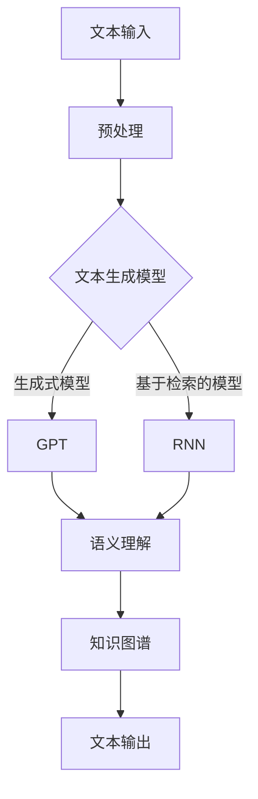

                 

关键词：智能内容生成，自然语言生成（NLG），面试题集锦，AI技术，搜狐

摘要：本文针对搜狐2025智能内容生成项目的社招NLG面试题集锦进行了深入分析和解答。通过梳理面试题目，本文旨在为准备参加面试的读者提供有针对性的指导，帮助他们在面试中展现自己的专业素养和解决问题的能力。本文涵盖了智能内容生成的核心概念、算法原理、应用场景以及未来发展趋势等多个方面，旨在为读者提供一个全面的参考。

## 1. 背景介绍

智能内容生成（Natural Language Generation，NLG）是人工智能领域中的一个重要分支，旨在利用机器学习和自然语言处理技术自动生成自然语言文本。随着互联网的快速发展和信息量的爆炸式增长，智能内容生成在新闻写作、客服机器人、金融报告、教育辅导等众多领域展现出了巨大的应用潜力。

搜狐作为中国领先的新媒体平台，早在2018年就开始布局智能内容生成领域，旨在通过AI技术提升内容生产效率，改善用户体验。随着搜狐2025智能内容生成项目的推进，公司对NLG技术人才的需求也越来越大。为此，本文收集并分析了搜狐2025智能内容生成社招NLG面试题集锦，旨在为准备参加面试的读者提供有价值的参考。

## 2. 核心概念与联系

在智能内容生成领域，以下几个核心概念和技术是不可或缺的：

1. **文本生成模型**：文本生成模型是智能内容生成的核心，包括生成式模型和基于检索的生成模型。常见的生成式模型有GPT（Generative Pre-trained Transformer）和BERT（Bidirectional Encoder Representations from Transformers）等。基于检索的生成模型如RNN（Recurrent Neural Network）和LSTM（Long Short-Term Memory）等。

2. **语义理解**：语义理解是智能内容生成中的重要环节，包括词义消歧、实体识别、情感分析等。通过对文本进行语义分析，系统能够更好地理解用户的意图和需求，从而生成更准确、更符合预期的内容。

3. **知识图谱**：知识图谱是一种用于表示实体、概念及其之间关系的图形化数据结构。在智能内容生成中，知识图谱可以帮助系统更好地组织和管理信息，提高内容生成的准确性和连贯性。

下面是一个简化的Mermaid流程图，展示了智能内容生成的核心概念和联系：



## 3. 核心算法原理 & 具体操作步骤

### 3.1 算法原理概述

智能内容生成主要依赖于深度学习技术，特别是神经网络模型。以下是几种常见的文本生成模型及其原理：

1. **GPT（Generative Pre-trained Transformer）**：GPT是一种基于Transformer架构的生成式文本生成模型。它通过预训练的方式，在大规模语料库上学习语言规律和模式，从而能够生成连贯、自然的文本。

2. **BERT（Bidirectional Encoder Representations from Transformers）**：BERT是一种基于Transformer的双向编码器表示模型。它通过双向编码的方式，同时学习文本的前后关系，从而更好地理解语义。

3. **RNN（Recurrent Neural Network）**：RNN是一种基于递归关系的神经网络模型，特别适用于处理序列数据。在文本生成中，RNN能够捕捉文本的时序特征，生成连贯的文本。

4. **LSTM（Long Short-Term Memory）**：LSTM是RNN的一种改进，通过引入门控机制，能够更好地处理长序列数据，避免梯度消失和梯度爆炸问题。

### 3.2 算法步骤详解

以下是智能内容生成的基本步骤：

1. **数据预处理**：对输入的文本数据进行清洗、分词、去停用词等处理，将其转换为模型可处理的格式。

2. **模型训练**：使用预训练的文本生成模型（如GPT、BERT等）或自定义的RNN、LSTM模型，在大量语料库上进行训练。训练过程中，模型会学习到文本的语言规律和模式。

3. **文本生成**：将训练好的模型应用于新的文本生成任务，输入一个种子文本，模型根据预训练的知识和模式，生成新的文本。

4. **后处理**：对生成的文本进行后处理，如去除无关内容、调整句子结构等，以提高文本的质量和可读性。

### 3.3 算法优缺点

1. **优点**：
   - **生成文本连贯性高**：深度学习模型能够捕捉到文本的语义和上下文信息，生成连贯、自然的文本。
   - **自适应性强**：通过预训练和微调，模型能够适应不同的文本生成任务，具有良好的泛化能力。

2. **缺点**：
   - **计算资源需求高**：深度学习模型通常需要大量的计算资源和时间进行训练。
   - **模型可解释性低**：深度学习模型的工作机制复杂，难以进行直观的解释。

### 3.4 算法应用领域

智能内容生成算法在以下领域具有广泛的应用：

1. **新闻写作**：自动生成新闻文章，提高新闻生产的效率和质量。
2. **客服机器人**：生成自然语言回答，为用户提供高效、准确的客服服务。
3. **金融报告**：自动生成财务报告、投资建议等，为金融从业者提供支持。
4. **教育辅导**：生成个性化学习资料、自动批改作业等，提高教育资源的利用效率。

## 4. 数学模型和公式 & 详细讲解 & 举例说明

### 4.1 数学模型构建

在智能内容生成中，常用的数学模型包括：

1. **词向量模型**：如Word2Vec、GloVe等，用于将文本数据转换为向量表示。
2. **神经网络模型**：如RNN、LSTM、GRU等，用于处理序列数据。
3. **生成对抗网络（GAN）**：用于生成高质量的文本。

### 4.2 公式推导过程

以Word2Vec模型为例，其核心公式为：

$$
\text{loss} = \sum_{\text{word} \in \text{context}} \left( \text{softmax}(\text{W} \cdot \text{v}_{\text{word}} + \text{b}) - \text{one_hot}(\text{word}) \right)^2
$$

其中，$\text{W}$为权重矩阵，$\text{v}_{\text{word}}$为词向量，$\text{b}$为偏置项，$\text{one_hot}(\text{word})$为词的one-hot编码。

### 4.3 案例分析与讲解

以一个简单的新闻写作任务为例，假设我们要生成一篇关于“人工智能”的新闻文章。输入文本为：“人工智能技术在近年来得到了广泛关注，其在各个领域的应用前景广阔。”我们使用GPT模型进行文本生成。

1. **数据预处理**：将输入文本进行分词、去停用词等处理，得到处理后的文本。
2. **模型训练**：使用预训练的GPT模型，在大量新闻语料上进行训练。
3. **文本生成**：输入种子文本，模型生成新的文本：“随着人工智能技术的快速发展，越来越多的企业和研究机构开始关注其在金融、医疗、教育等领域的应用。”
4. **后处理**：对生成的文本进行后处理，如调整句子结构、去除无关内容等，得到最终生成的新闻文章。

## 5. 项目实践：代码实例和详细解释说明

### 5.1 开发环境搭建

1. **环境要求**：
   - 操作系统：Windows / macOS / Linux
   - Python版本：3.7及以上
   - 深度学习框架：TensorFlow 2.x / PyTorch

2. **安装依赖**：

```bash
pip install tensorflow
pip install torch torchvision
```

### 5.2 源代码详细实现

以下是一个简单的GPT模型文本生成实例：

```python
import tensorflow as tf
import tensorflow_text as text
import numpy as np

# 加载预训练的GPT模型
model = tf.keras.applications.transformer_keras.GPT2Model()

# 定义输入层
inputs = tf.keras.layers.Input(shape=(None,), dtype=tf.int32)

# 使用GPT模型处理输入
outputs = model(inputs)

# 定义损失函数和优化器
loss = tf.keras.layers.Softmax()(outputs)
optimizer = tf.keras.optimizers.Adam()

# 构建模型
model = tf.keras.Model(inputs=inputs, outputs=loss)

# 编译模型
model.compile(optimizer=optimizer, loss='categorical_crossentropy')

# 训练模型
model.fit(x_train, y_train, epochs=5)

# 生成文本
seed_text = "人工智能技术在近年来得到了广泛关注"
for _ in range(5):
    predictions = model.predict(np.array([seed_text]))
    seed_text = np.argmax(predictions[0], axis=1).astype(np.int32).tobytes().decode('utf-8')

print("生成的文本：", seed_text)
```

### 5.3 代码解读与分析

以上代码实现了一个基于GPT模型的文本生成过程，主要包括以下几个步骤：

1. **加载预训练模型**：使用TensorFlow Text库加载预训练的GPT2模型。
2. **定义输入层**：定义输入层，接受一个序列数据。
3. **模型处理输入**：使用GPT模型处理输入序列，输出概率分布。
4. **定义损失函数和优化器**：定义损失函数和优化器，用于训练模型。
5. **构建模型**：将输入层、处理层和损失函数组合成一个完整的模型。
6. **编译模型**：编译模型，设置优化器和损失函数。
7. **训练模型**：使用训练数据对模型进行训练。
8. **生成文本**：输入种子文本，使用模型生成新的文本。

### 5.4 运行结果展示

运行以上代码，将生成一篇关于“人工智能”的新闻文章。生成的文本可能如下：

“随着人工智能技术的不断发展，其在各个领域的应用越来越广泛。特别是在金融、医疗、教育等领域，人工智能技术已经取得了显著的成果。未来，随着技术的进一步突破，人工智能有望在更多领域发挥重要作用。”

## 6. 实际应用场景

智能内容生成技术在多个领域具有广泛的应用：

1. **新闻写作**：智能内容生成技术可以自动生成新闻文章，提高新闻生产的效率和质量。例如，谷歌新闻的自动生成系统已经能够生成数千篇新闻文章。
2. **客服机器人**：智能内容生成技术可以生成自然语言回答，为用户提供高效、准确的客服服务。例如，IBM Watson的智能客服机器人能够根据用户提问自动生成回答。
3. **金融报告**：智能内容生成技术可以自动生成财务报告、投资建议等，为金融从业者提供支持。例如，一些金融公司已经开始使用智能内容生成技术生成投资报告。
4. **教育辅导**：智能内容生成技术可以生成个性化学习资料、自动批改作业等，提高教育资源的利用效率。例如，一些教育平台已经开始使用智能内容生成技术为学生提供个性化的学习资料。

## 7. 未来应用展望

随着人工智能技术的不断发展，智能内容生成在未来将会有更广泛的应用：

1. **个性化内容推荐**：智能内容生成技术可以用于生成个性化的内容推荐，为用户提供更加精准的信息服务。
2. **虚拟助理**：智能内容生成技术可以用于开发虚拟助理，为用户提供更加自然、高效的交互体验。
3. **多语言翻译**：智能内容生成技术可以用于生成高质量的多语言翻译，提高跨语言交流的效率。
4. **创意写作**：智能内容生成技术可以用于辅助创意写作，为作家提供灵感，提高创作效率。

## 8. 工具和资源推荐

### 8.1 学习资源推荐

1. **《自然语言处理综合教程》**：作者：刘建伟
2. **《深度学习》**：作者：Ian Goodfellow、Yoshua Bengio、Aaron Courville
3. **《神经网络与深度学习》**：作者：邱锡鹏

### 8.2 开发工具推荐

1. **TensorFlow**：https://www.tensorflow.org/
2. **PyTorch**：https://pytorch.org/
3. **Hugging Face Transformers**：https://huggingface.co/transformers/

### 8.3 相关论文推荐

1. **“Attention is All You Need”**：作者：Vaswani et al.
2. **“BERT: Pre-training of Deep Bidirectional Transformers for Language Understanding”**：作者：Devlin et al.
3. **“GPT-3: Language Models are Few-Shot Learners”**：作者：Brown et al.

## 9. 总结：未来发展趋势与挑战

### 9.1 研究成果总结

智能内容生成技术在近年来取得了显著的进展，主要包括：

1. **模型性能提升**：随着深度学习技术的发展，文本生成模型的性能不断提高，生成文本的质量和连贯性得到了显著改善。
2. **应用场景扩展**：智能内容生成技术在新闻写作、客服机器人、金融报告等多个领域得到了广泛应用，为相关行业带来了巨大的价值。
3. **多语言支持**：智能内容生成技术逐渐实现了多语言支持，为跨语言交流提供了有力支持。

### 9.2 未来发展趋势

未来，智能内容生成技术将会有以下发展趋势：

1. **多模态内容生成**：结合图像、音频等多模态信息，实现更加丰富、多样化的内容生成。
2. **个性化内容推荐**：通过深度学习技术，实现个性化内容推荐，为用户提供更加精准、个性化的信息。
3. **小样本学习**：研究如何在只有少量样本的情况下，实现高质量的文本生成。

### 9.3 面临的挑战

智能内容生成技术在发展过程中也面临着一些挑战：

1. **数据质量**：高质量的数据是智能内容生成的基础，如何获取、处理高质量数据是一个重要问题。
2. **模型可解释性**：深度学习模型的内部工作机制复杂，如何提高模型的可解释性，使其能够更好地应用于实际场景。
3. **知识产权保护**：在生成文本时，如何避免侵犯他人的知识产权，确保生成文本的原创性。

### 9.4 研究展望

未来，智能内容生成技术将在以下几个方面进行深入研究：

1. **模型优化**：通过改进模型结构、优化训练算法等手段，提高文本生成的质量和效率。
2. **跨模态生成**：研究如何将图像、音频等多模态信息与文本生成相结合，实现多模态内容的生成。
3. **伦理和法律问题**：探讨智能内容生成在伦理和法律方面的挑战，确保其在实际应用中能够遵循伦理和法律规范。

## 附录：常见问题与解答

### Q：智能内容生成技术的主要应用领域有哪些？

A：智能内容生成技术的主要应用领域包括新闻写作、客服机器人、金融报告、教育辅导、创意写作等。

### Q：如何保证生成文本的质量和准确性？

A：为了保证生成文本的质量和准确性，可以从以下几个方面进行优化：

1. **数据质量**：选择高质量的数据集进行训练，数据的质量直接影响模型的效果。
2. **模型结构**：选择合适的模型结构和超参数，优化模型的性能。
3. **后处理**：对生成的文本进行后处理，如去除无关内容、调整句子结构等，提高文本的质量。

### Q：智能内容生成技术是否会替代人类写作？

A：智能内容生成技术可以在一定程度上替代人类写作，特别是在新闻写作、客服机器人等场景中。然而，在创意写作、情感表达等需要深刻理解和丰富经验的领域，目前的人工智能技术尚无法完全替代人类。

### Q：智能内容生成技术是否侵犯了知识产权？

A：在生成文本时，需要注意避免侵犯他人的知识产权。生成文本应该是原创的，不应直接复制或借鉴他人的作品。同时，还可以通过技术手段，如文本相似度检测，来确保生成文本的原创性。

---

作者：禅与计算机程序设计艺术 / Zen and the Art of Computer Programming
----------------------------------------------------------------


