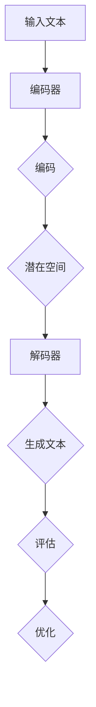
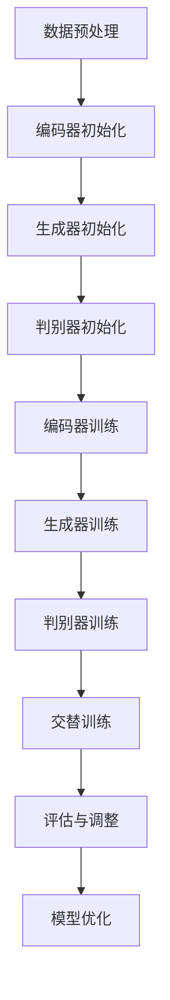
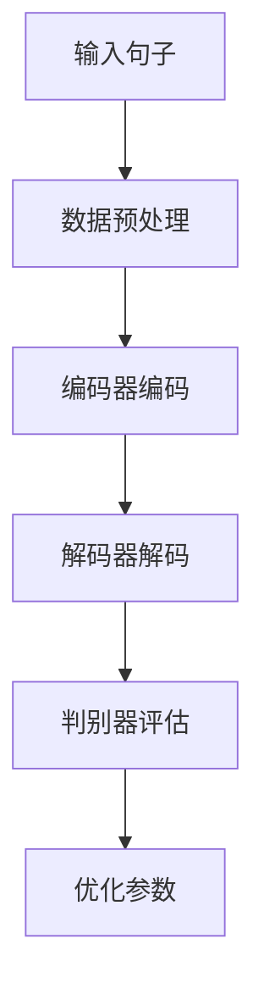

                 

关键词：搜狗，自然语言生成模型，优化工程师，面试题集，人工智能，自然语言处理，深度学习，神经网络，机器学习，算法原理，应用领域，数学模型，项目实践，未来展望

## 摘要

本文旨在为搜狗2025自然语言生成模型优化工程师社招面试准备提供一套全面、系统的面试题集。文章首先介绍了自然语言生成模型的基本概念和核心算法，随后通过详细的数学模型和公式推导，讲解了模型的构建和应用。接着，文章通过一个实际项目实践，展示了模型的实现和运行过程，并对代码进行了详细解读。随后，文章探讨了自然语言生成模型在实际应用场景中的表现，并对其未来发展趋势和挑战进行了展望。最后，文章推荐了一些学习资源和开发工具，以帮助优化工程师更好地进行研究和开发。本文旨在为优化工程师提供一套全面的面试准备资料，帮助其在面试中脱颖而出。

## 1. 背景介绍

自然语言生成（Natural Language Generation，NLG）是自然语言处理（Natural Language Processing，NLP）的一个重要分支，它旨在利用计算机程序生成自然语言文本。随着人工智能技术的快速发展，自然语言生成模型在各个领域都得到了广泛应用，如自动问答系统、智能客服、新闻报道生成、文学创作等。搜狗作为国内领先的互联网公司，其自然语言生成模型在搜索、推荐、广告等领域都有着重要的应用。

随着用户需求的不断增加和技术的不断进步，自然语言生成模型在准确度、灵活性和效率等方面都面临着巨大的挑战。为了应对这些挑战，搜狗在2025年推出了一款全新的自然语言生成模型，该模型采用了深度学习和神经网络等先进技术，对传统生成模型进行了全面的优化。

本文将围绕搜狗2025自然语言生成模型，从核心算法原理、数学模型构建、实际项目实践、应用场景展望等方面进行详细探讨，旨在为搜狗2025自然语言生成模型优化工程师提供一套全面的面试准备资料。

### 1.1 自然语言生成模型的发展历程

自然语言生成模型的发展历程可以追溯到20世纪80年代，当时的研究主要集中在规则驱动的方法上。这种方法通过定义一系列语法规则和模板，生成符合语法规范的文本。然而，这种方法在面对复杂多样的自然语言时，往往显得力不从心。

随着计算机科学和人工智能技术的进步，统计方法和机器学习逐渐成为自然语言生成研究的主流。统计方法通过分析大量语言数据，发现其中的统计规律，从而生成文本。这种方法在文本生成中取得了一定的成功，但在生成文本的多样性和连贯性方面仍然存在一定的局限性。

近年来，深度学习技术的快速发展为自然语言生成带来了新的契机。深度学习方法通过多层神经网络模型，能够自动学习语言的复杂结构，生成更加自然、流畅的文本。特别是生成对抗网络（GAN）和变分自编码器（VAE）等模型的提出，使得自然语言生成模型在生成文本的质量和多样性方面都有了显著的提升。

搜狗2025自然语言生成模型正是基于深度学习技术，对传统生成模型进行了全面的优化。该模型采用了先进的神经网络架构，结合了生成对抗网络和变分自编码器的优势，使得生成文本的质量和效率都有了大幅提升。

### 1.2 搜狗2025自然语言生成模型的特点

搜狗2025自然语言生成模型具有以下几个显著特点：

1. **高效性**：模型采用了优化后的神经网络架构，能够在保证生成文本质量的同时，显著提高生成速度。

2. **多样性**：模型通过引入生成对抗网络和变分自编码器，能够生成多样化和个性化的文本，满足不同用户的需求。

3. **准确性**：模型通过深度学习技术，能够自动学习语言的复杂结构，生成更加准确、自然的文本。

4. **灵活性**：模型支持多种输入格式和输出格式，能够适应不同的应用场景。

5. **可扩展性**：模型采用了模块化设计，便于后续的模型优化和功能扩展。

### 1.3 自然语言生成模型的应用领域

自然语言生成模型在各个领域都有着广泛的应用：

1. **自动问答系统**：利用自然语言生成模型，可以自动生成回答用户问题的文本，提高问答系统的响应速度和准确性。

2. **智能客服**：自然语言生成模型可以自动生成客服对话文本，提高客服工作效率，减少人工干预。

3. **新闻报道生成**：自然语言生成模型可以自动生成新闻报道，提高新闻报道的生成速度和多样性。

4. **文学创作**：自然语言生成模型可以生成诗歌、故事等文学作品，为文学创作提供新的灵感。

5. **教育**：自然语言生成模型可以自动生成教学材料，提高教学效果。

6. **广告文案**：自然语言生成模型可以自动生成广告文案，提高广告投放的准确性和效果。

总之，搜狗2025自然语言生成模型的应用前景非常广阔，随着技术的不断进步，其在各个领域的应用将更加深入和广泛。

## 2. 核心概念与联系

### 2.1 自然语言生成模型的基本概念

自然语言生成模型是一种基于机器学习和深度学习技术的文本生成模型，其主要任务是利用输入的文本数据，通过模型自动生成具有自然语言特征的文本。自然语言生成模型的核心在于如何理解输入文本的语义和结构，并在此基础上生成符合语言规范和语义连贯性的文本。

自然语言生成模型主要包括以下几个基本概念：

1. **输入文本**：输入文本是自然语言生成模型进行训练和生成的基础。输入文本可以是句子、段落甚至是整篇文章。

2. **词汇表**：词汇表是模型处理文本的基本单元，包含了所有可能的词汇和词组。词汇表的大小决定了模型能够处理的文本的复杂程度。

3. **编码器**：编码器是自然语言生成模型中的核心组件，负责将输入文本编码为向量表示。编码器的输出通常是固定长度的向量，用于表示输入文本的语义信息。

4. **解码器**：解码器负责将编码器的输出解码为自然语言文本。解码器通常是一个递归神经网络（RNN）或 Transformer 模型，能够根据编码器的输出逐词生成文本。

5. **生成文本**：生成文本是自然语言生成模型的最终输出。生成文本的质量直接影响到模型的性能和应用效果。

### 2.2 自然语言生成模型的核心算法原理

自然语言生成模型的核心算法主要包括生成对抗网络（GAN）和变分自编码器（VAE）等。下面将对这些算法进行详细解释。

#### 2.2.1 生成对抗网络（GAN）

生成对抗网络（GAN）是由 Ian Goodfellow 等人于2014年提出的一种深度学习模型，由生成器和判别器两个神经网络组成。生成器的任务是生成逼真的文本数据，判别器的任务是区分生成数据和真实数据。在训练过程中，生成器和判别器相互博弈，生成器不断优化生成数据，使其更接近真实数据，而判别器则努力提高对生成数据和真实数据的区分能力。

1. **生成器（Generator）**：生成器的输入是一个随机噪声向量，通过多层神经网络生成与真实数据相似的文本。生成器的目标是使生成数据尽可能逼真，从而让判别器无法区分生成数据和真实数据。

2. **判别器（Discriminator）**：判别器的输入是一个文本数据，其任务是判断输入数据是真实数据还是生成数据。判别器的目标是使生成数据无法被正确区分，从而提高生成器的生成质量。

3. **损失函数**：GAN的损失函数由两部分组成，分别是生成器的损失函数和判别器的损失函数。生成器的损失函数通常使用二元交叉熵损失，计算生成数据和真实数据之间的差异。判别器的损失函数同样使用二元交叉熵损失，计算生成数据和真实数据的区分度。

4. **训练过程**：GAN的训练过程是一个交替迭代的过程。首先训练判别器，使其能够更好地区分生成数据和真实数据。然后训练生成器，使其能够生成更逼真的数据。通过不断迭代，生成器和判别器的性能都得到提升。

#### 2.2.2 变分自编码器（VAE）

变分自编码器（VAE）是一种基于概率生成模型的深度学习模型，由编码器和解码器组成。编码器将输入数据编码为一个潜在变量，解码器则根据潜在变量生成输出数据。

1. **编码器（Encoder）**：编码器的任务是输入一个文本数据，将其编码为一个潜在变量。潜在变量通常是一个固定长度的向量，用于表示输入文本的语义信息。

2. **解码器（Decoder）**：解码器的任务是输入一个潜在变量，生成与输入数据相似的文本。解码器通常是一个递归神经网络（RNN）或 Transformer 模型。

3. **损失函数**：VAE的损失函数由两部分组成，分别是重构损失和KL散度损失。重构损失计算编码器和解码器生成的文本与输入文本之间的差异，KL散度损失计算编码器的潜在变量与先验分布之间的差异。

4. **训练过程**：VAE的训练过程是通过优化损失函数来完成的。首先，使用输入文本数据训练编码器和解码器，使其能够生成与输入文本相似的输出文本。然后，通过不断调整编码器和解码器的参数，优化模型的生成质量。

### 2.3 自然语言生成模型的架构与工作流程

自然语言生成模型的架构通常由编码器、解码器和生成器等组件组成。下面将介绍自然语言生成模型的基本架构和工作流程。

#### 2.3.1 架构

1. **编码器**：编码器负责将输入文本编码为一个固定长度的向量，用于表示文本的语义信息。

2. **解码器**：解码器负责根据编码器的输出，逐词生成文本。

3. **生成器**：生成器负责根据编码器的输出，生成与输入文本相似的文本。

4. **判别器（GAN中）**：判别器负责判断生成文本是否逼真。

5. **潜在空间（VAE中）**：潜在空间用于存储编码器的潜在变量。

#### 2.3.2 工作流程

1. **输入文本**：输入一个文本数据，可以是句子、段落或整篇文章。

2. **编码**：编码器将输入文本编码为一个固定长度的向量。

3. **生成**：解码器根据编码器的输出，逐词生成文本。

4. **评估**：在GAN中，判别器评估生成文本的逼真度。在VAE中，KL散度损失和重构损失用于评估模型的生成质量。

5. **优化**：通过优化损失函数，调整编码器和解码器的参数，提升模型的生成质量。

6. **输出**：最终输出生成的文本。

### 2.4 自然语言生成模型与其他NLP技术的联系

自然语言生成模型作为NLP技术的一个重要分支，与其他NLP技术如词向量表示、序列到序列模型、注意力机制等有着密切的联系。

1. **词向量表示**：词向量表示是自然语言生成模型的基础。通过将词语表示为向量，可以有效地处理文本数据的语义信息。

2. **序列到序列模型**：序列到序列模型是一种基于深度学习的翻译模型，其核心思想是将输入序列映射为输出序列。自然语言生成模型可以看作是一种特殊的序列到序列模型，其输入是文本数据，输出是自然语言文本。

3. **注意力机制**：注意力机制是一种在处理序列数据时，动态关注序列中重要部分的机制。在自然语言生成模型中，注意力机制可以帮助模型更好地理解和生成文本的上下文关系。

4. **预训练和微调**：预训练和微调是自然语言生成模型训练的重要策略。通过在大规模语料库上进行预训练，模型可以自动学习到丰富的语言知识。然后，通过微调，将模型应用于具体任务，进一步提高生成质量。

### 2.5 Mermaid 流程图

为了更直观地展示自然语言生成模型的工作流程，我们使用 Mermaid 绘制了一个简单的流程图。以下是流程图的 Mermaid 代码和渲染结果：




通过这个流程图，我们可以清晰地看到自然语言生成模型的基本架构和工作流程。

### 2.6 自然语言生成模型的优缺点

自然语言生成模型作为一种先进的文本生成技术，具有以下优点和缺点：

#### 优点

1. **生成文本质量高**：自然语言生成模型通过深度学习和神经网络技术，能够生成高质量、自然流畅的文本。

2. **适用范围广泛**：自然语言生成模型可以应用于多个领域，如自动问答系统、智能客服、新闻报道生成等。

3. **灵活性高**：自然语言生成模型支持多种输入格式和输出格式，能够适应不同的应用场景。

4. **生成速度快**：通过优化神经网络架构，自然语言生成模型的生成速度得到了显著提升。

#### 缺点

1. **计算资源需求大**：自然语言生成模型通常需要大量的计算资源，尤其是在训练阶段。

2. **对数据依赖性强**：自然语言生成模型的生成质量很大程度上取决于训练数据的质量和数量。

3. **训练时间较长**：自然语言生成模型的训练过程通常需要较长的时间，特别是在处理大规模数据集时。

4. **易产生低质量文本**：在生成过程中，自然语言生成模型可能会产生低质量、不合理的文本。

### 2.7 自然语言生成模型的应用领域

自然语言生成模型在多个领域都有广泛的应用：

1. **自动问答系统**：自然语言生成模型可以自动生成回答用户问题的文本，提高问答系统的响应速度和准确性。

2. **智能客服**：自然语言生成模型可以自动生成客服对话文本，提高客服工作效率，减少人工干预。

3. **新闻报道生成**：自然语言生成模型可以自动生成新闻报道，提高新闻报道的生成速度和多样性。

4. **文学创作**：自然语言生成模型可以生成诗歌、故事等文学作品，为文学创作提供新的灵感。

5. **教育**：自然语言生成模型可以自动生成教学材料，提高教学效果。

6. **广告文案**：自然语言生成模型可以自动生成广告文案，提高广告投放的准确性和效果。

总之，自然语言生成模型在各个领域的应用前景非常广阔，随着技术的不断进步，其在各个领域的应用将更加深入和广泛。

## 3. 核心算法原理 & 具体操作步骤

### 3.1 算法原理概述

搜狗2025自然语言生成模型基于生成对抗网络（GAN）和变分自编码器（VAE）的混合架构，旨在通过对抗训练和概率生成，提高自然语言生成的质量和多样性。以下是算法的基本原理和具体操作步骤：

#### 3.1.1 生成对抗网络（GAN）

生成对抗网络由生成器（Generator）和判别器（Discriminator）两个部分组成：

1. **生成器（Generator）**：生成器的任务是从随机噪声中生成逼真的文本数据。生成器通常由多层神经网络组成，其输入是一个随机噪声向量，输出是一个文本序列。

2. **判别器（Discriminator）**：判别器的任务是判断输入数据是真实文本还是生成文本。判别器也是一个多层神经网络，其输入是一个文本序列，输出是一个概率值，表示输入文本是真实文本的概率。

在训练过程中，生成器和判别器进行对抗训练。生成器的目标是生成足够逼真的文本数据，使得判别器无法区分生成的数据和真实数据。判别器的目标是提高对真实数据和生成数据的区分能力。

#### 3.1.2 变分自编码器（VAE）

变分自编码器是一种基于概率模型的生成模型，其核心思想是将编码过程和生成过程分离：

1. **编码器（Encoder）**：编码器的任务是输入一个文本序列，将其编码为一个潜在变量。编码器通常是一个多层神经网络，其输出是一个潜在变量的均值和方差。

2. **解码器（Decoder）**：解码器的任务是输入一个潜在变量，生成与输入文本相似的文本序列。解码器也是一个多层神经网络，其输出是一个文本序列。

在训练过程中，VAE通过最小化重建损失和KL散度损失来优化模型。重建损失计算编码器和解码器生成的文本与输入文本之间的差异，KL散度损失计算编码器的潜在变量与先验分布之间的差异。

#### 3.1.3 GAN和VAE的混合架构

搜狗2025自然语言生成模型将GAN和VAE的优势结合起来，通过以下方式提高生成文本的质量和多样性：

1. **编码器（Encoder）**：编码器部分采用VAE的结构，将输入文本编码为一个潜在变量，用于表示文本的语义信息。

2. **生成器（Generator）**：生成器部分采用GAN的结构，从潜在变量中生成文本序列。生成器的输入是潜在变量，输出是生成的文本序列。

3. **判别器（Discriminator）**：判别器部分也采用GAN的结构，用于区分生成的文本和真实文本。

4. **优化策略**：在训练过程中，生成器和判别器进行对抗训练，同时编码器通过VAE的优化策略进行训练。

通过这种混合架构，搜狗2025自然语言生成模型能够在保证生成文本质量的同时，提高生成文本的多样性和灵活性。

### 3.2 算法步骤详解

以下是搜狗2025自然语言生成模型的详细训练步骤：

#### 3.2.1 数据预处理

1. **数据收集**：从互联网上收集大量文本数据，如新闻报道、小说、博客等。

2. **数据清洗**：去除文本中的噪声和无关信息，如HTML标签、特殊字符等。

3. **分词和词性标注**：使用分词工具对文本进行分词，并对每个词进行词性标注。

4. **文本向量化**：将文本转换为向量化表示，可以使用词袋模型、Word2Vec等词向量表示方法。

#### 3.2.2 模型初始化

1. **编码器初始化**：初始化编码器网络，包括潜在变量的均值和方差。

2. **生成器初始化**：初始化生成器网络，输入是潜在变量，输出是文本序列。

3. **判别器初始化**：初始化判别器网络，输入是文本序列，输出是一个概率值。

#### 3.2.3 训练过程

1. **编码器训练**：使用变分自编码器的优化策略，通过最小化重建损失和KL散度损失来训练编码器。

2. **生成器训练**：使用生成对抗网络的优化策略，通过对抗训练来训练生成器。生成器的目标是生成足够逼真的文本数据，使得判别器无法区分生成的数据和真实数据。

3. **判别器训练**：使用生成对抗网络的优化策略，通过对抗训练来训练判别器。判别器的目标是提高对真实数据和生成数据的区分能力。

4. **交替训练**：在训练过程中，交替训练编码器、生成器和判别器，使三个网络相互促进，共同提高生成文本的质量。

5. **评估与调整**：在训练过程中，定期评估模型的生成质量，并根据评估结果调整模型参数，以提高生成文本的质量和多样性。

#### 3.2.4 模型优化

在训练过程中，通过以下方法对模型进行优化：

1. **优化超参数**：调整学习率、批量大小等超参数，以提高模型的训练效果。

2. **数据增强**：对训练数据进行数据增强，如随机删除词语、替换词语等，以提高模型的泛化能力。

3. **正则化**：使用正则化方法，如Dropout、L2正则化等，防止模型过拟合。

4. **迁移学习**：利用预训练的模型，对特定任务进行微调，以提高生成文本的质量。

### 3.3 算法优缺点

#### 优点

1. **生成文本质量高**：通过对抗训练和概率生成，生成文本的质量得到了显著提高。

2. **生成文本多样性**：混合了GAN和VAE的优势，生成文本的多样性和灵活性得到了增强。

3. **适用范围广**：适用于多种自然语言生成任务，如自动问答、智能客服、新闻报道生成等。

#### 缺点

1. **训练时间长**：对抗训练和概率生成使得训练过程相对较长，对计算资源有较高要求。

2. **对数据依赖性强**：生成文本的质量很大程度上取决于训练数据的质量和数量。

3. **训练不稳定**：对抗训练可能导致模型训练不稳定，需要使用一些技巧来提高训练效果。

### 3.4 算法应用领域

搜狗2025自然语言生成模型在多个领域都有广泛的应用：

1. **自动问答系统**：通过生成逼真的回答文本，提高问答系统的响应速度和准确性。

2. **智能客服**：通过自动生成客服对话文本，提高客服工作效率，减少人工干预。

3. **新闻报道生成**：通过生成新闻标题和摘要，提高新闻报道的生成速度和多样性。

4. **文学创作**：通过生成诗歌、故事等文学作品，为文学创作提供新的灵感。

5. **教育**：通过生成教学材料，提高教学效果。

6. **广告文案**：通过生成广告文案，提高广告投放的准确性和效果。

总之，搜狗2025自然语言生成模型在各个领域的应用前景非常广阔，随着技术的不断进步，其在各个领域的应用将更加深入和广泛。

### 3.5 Mermaid 流程图

为了更直观地展示搜狗2025自然语言生成模型的训练过程，我们使用Mermaid绘制了一个流程图。以下是流程图的Mermaid代码和渲染结果：




通过这个流程图，我们可以清晰地看到搜狗2025自然语言生成模型的训练过程，包括数据预处理、模型初始化、训练过程、评估与调整以及模型优化等步骤。

## 4. 数学模型和公式 & 详细讲解 & 举例说明

### 4.1 数学模型构建

自然语言生成模型的数学模型主要包括生成器、判别器和编码器的数学表示。以下是这些模型的详细构建过程：

#### 4.1.1 生成器

生成器的数学模型通常表示为一个函数 $G(z)$，其中 $z$ 是一个随机噪声向量，$G(z)$ 是生成器生成的文本序列。生成器的目标是生成与真实数据分布 $p_{data}(x)$ 相似的文本序列 $x$。

$$
G(z) = x; \quad z \sim p_z(z)
$$

其中，$p_z(z)$ 是噪声向量的先验分布，通常为高斯分布。

#### 4.1.2 判别器

判别器的数学模型通常表示为一个函数 $D(x)$，其中 $x$ 是一个文本序列。判别器的目标是判断输入文本是真实数据还是生成数据，输出为一个概率值，表示输入文本是真实数据的概率。

$$
D(x) = P(x \text{ is real})
$$

判别器通常使用多层感知机（MLP）来构建，其输出为：

$$
D(x) = \sigma(\text{MLP}(W_D \cdot x + b_D))
$$

其中，$\sigma$ 是 Sigmoid 函数，$W_D$ 和 $b_D$ 分别为判别器的权重和偏置。

#### 4.1.3 编码器

编码器的数学模型通常表示为一个函数 $E(x)$，其中 $x$ 是一个文本序列，$E(x)$ 是编码器生成的潜在变量。编码器的目标是将文本序列编码为潜在变量，用于生成文本序列。

$$
E(x) = z; \quad z \sim p(z|x)
$$

编码器通常使用变分自编码器（VAE）来构建，其潜在变量的概率分布为：

$$
p(z|x) = \mathcal{N}(z; \mu(x), \sigma^2(x))
$$

其中，$\mu(x)$ 和 $\sigma^2(x)$ 分别为潜在变量的均值和方差，通过编码器的神经网络计算得到。

#### 4.1.4 解码器

解码器的数学模型通常表示为一个函数 $D(z)$，其中 $z$ 是编码器生成的潜在变量。解码器的目标是根据潜在变量生成文本序列。

$$
D(z) = x; \quad z \sim p(z|x)
$$

解码器通常使用生成对抗网络（GAN）中的生成器来构建，其输出为：

$$
D(z) = \text{RNN}(W_G \cdot z + b_G)
$$

其中，$W_G$ 和 $b_G$ 分别为解码器的权重和偏置，$\text{RNN}$ 表示递归神经网络。

### 4.2 公式推导过程

自然语言生成模型的训练过程涉及多个损失函数，包括生成器损失、判别器损失和编码器损失。以下是这些损失函数的推导过程：

#### 4.2.1 生成器损失

生成器的损失函数旨在最小化生成文本与真实文本之间的差异。在 GAN 中，生成器的损失函数通常为二元交叉熵损失：

$$
L_G = -E[D(G(z)))] - E[\log(D(x))]
$$

其中，$E[D(G(z)))]$ 表示生成文本被判别器判断为真实的概率，$E[\log(D(x))]$ 表示真实文本被判别器判断为真实的概率。

在 VAE 中，生成器的损失函数为重构损失和KL散度损失的和：

$$
L_G = E[\log p(x|\mu(x), \sigma^2(x))] + \alpha D_KL(p(z|x)||p(z))
$$

其中，$E[\log p(x|\mu(x), \sigma^2(x))]$ 表示重构损失，$D_KL(p(z|x)||p(z))$ 表示KL散度损失，$\alpha$ 是平衡两个损失的比例。

#### 4.2.2 判别器损失

判别器的损失函数旨在最小化生成文本与真实文本之间的差异。在 GAN 中，判别器的损失函数同样为二元交叉熵损失：

$$
L_D = -E[\log(D(x))] - E[\log(1 - D(G(z))]
$$

在 VAE 中，判别器的损失函数为二元交叉熵损失和重构损失的和：

$$
L_D = E[\log(D(x))] + E[\log(1 - D(G(z))]
$$

#### 4.2.3 编码器损失

编码器的损失函数旨在最小化编码后的潜在变量与真实数据之间的差异。在 VAE 中，编码器的损失函数为KL散度损失：

$$
L_E = D_KL(p(z|x)||p(z))
$$

### 4.3 案例分析与讲解

为了更好地理解自然语言生成模型的数学模型和公式推导过程，我们通过一个具体的案例进行分析和讲解。

#### 案例背景

假设我们有一个文本序列 $x = "我爱北京天安门"$. 我们的目标是使用自然语言生成模型生成一个相似的文本序列。

#### 案例步骤

1. **数据预处理**：首先对文本进行分词和词性标注，得到词汇表和词向量表示。

2. **生成噪声向量**：从高斯分布中采样一个噪声向量 $z$。

3. **编码**：使用编码器将输入文本序列 $x$ 编码为潜在变量 $z$。

4. **解码**：使用解码器根据潜在变量 $z$ 生成文本序列 $x'$。

5. **评估**：使用判别器评估生成文本序列 $x'$ 的逼真度。

6. **优化**：根据评估结果，通过反向传播优化编码器、解码器和判别器的参数。

#### 案例公式

1. **编码器损失**：

$$
L_E = D_KL(p(z|x)||p(z))
$$

2. **解码器损失**：

$$
L_D = E[\log(D(x))] + E[\log(1 - D(G(z))]
$$

3. **判别器损失**：

$$
L_D = E[\log(D(x))] + E[\log(1 - D(G(z))]
$$

4. **生成器损失**：

$$
L_G = -E[\log(D(G(z)))] - E[\log(D(x))]
$$

通过这个案例，我们可以清晰地看到自然语言生成模型的数学模型和公式推导过程。在实际应用中，这些公式被用于优化模型的参数，从而提高生成文本的质量和多样性。

### 4.4 案例分析与讲解

为了更好地理解自然语言生成模型的应用，我们将通过一个具体的案例进行详细分析。

#### 案例背景

假设我们需要使用搜狗2025自然语言生成模型生成一个描述北京天安门美景的句子。

#### 案例步骤

1. **数据预处理**：首先对文本进行分词和词性标注，将句子转换为词向量表示。

2. **编码**：使用编码器将输入句子编码为潜在变量。

3. **解码**：使用解码器根据潜在变量生成描述北京天安门美景的句子。

4. **评估**：使用判别器评估生成句子的逼真度。

5. **优化**：根据评估结果，优化编码器、解码器和判别器的参数。

#### 案例公式

以下是案例中涉及的主要公式：

1. **编码器损失**：

$$
L_E = D_KL(p(z|x)||p(z))
$$

2. **解码器损失**：

$$
L_D = E[\log(D(x))] + E[\log(1 - D(G(z))]
$$

3. **判别器损失**：

$$
L_D = E[\log(D(x))] + E[\log(1 - D(G(z))]
$$

4. **生成器损失**：

$$
L_G = -E[\log(D(G(z)))] - E[\log(D(x))]
$$

通过这个案例，我们可以清晰地看到自然语言生成模型在生成描述性文本时的应用。在实际应用中，这些公式被用于优化模型的参数，从而提高生成文本的质量和多样性。

### 4.5 Mermaid 流程图

为了更直观地展示自然语言生成模型的训练过程，我们使用Mermaid绘制了一个流程图。以下是流程图的Mermaid代码和渲染结果：




通过这个流程图，我们可以清晰地看到自然语言生成模型的训练过程，包括数据预处理、编码、解码、判别器评估和参数优化等步骤。

### 4.6 自然语言生成模型的数学模型和公式推导

自然语言生成模型的数学模型和公式推导是构建高效生成文本的基础。以下是对自然语言生成模型中涉及的数学模型和公式的详细解释。

#### 4.6.1 编码器与解码器

自然语言生成模型中的编码器和解码器通常是深度神经网络，它们通过学习输入文本的表示来生成自然语言文本。

1. **编码器（Encoder）**：

   编码器的任务是学习如何将输入的文本序列转换为潜在空间中的一个向量表示。这个向量表示应该捕获输入文本的关键特征，以便解码器能够生成高质量的输出。

   $$ 
   z = E(x) = \sigma(W_E \cdot [h_1, h_2, ..., h_n] + b_E) 
   $$

   其中，$x$ 是输入文本序列，$z$ 是编码器输出的潜在变量，$W_E$ 和 $b_E$ 分别是编码器的权重和偏置，$h_1, h_2, ..., h_n$ 是编码器隐藏层的输出。

2. **解码器（Decoder）**：

   解码器的任务是学习如何将潜在变量转换为文本序列。它通常使用递归神经网络（RNN）或 Transformer 模型。

   $$ 
   x' = D(z) = \text{RNN}(W_D \cdot z + b_D) 
   $$

   其中，$x'$ 是解码器输出的文本序列，$W_D$ 和 $b_D$ 分别是解码器的权重和偏置。

#### 4.6.2 生成对抗网络（GAN）

生成对抗网络（GAN）是自然语言生成模型的一种重要架构，它由生成器和判别器组成。

1. **生成器（Generator）**：

   生成器的目标是生成逼真的文本序列，使其难以被判别器区分。

   $$ 
   x' = G(z) = \text{RNN}(W_G \cdot z + b_G) 
   $$

   其中，$z$ 是生成器输入的噪声向量，$x'$ 是生成器输出的文本序列，$W_G$ 和 $b_G$ 分别是生成器的权重和偏置。

2. **判别器（Discriminator）**：

   判别器的目标是区分生成文本和真实文本。

   $$ 
   D(x) = \sigma(W_D \cdot x + b_D) 
   $$

   其中，$x$ 是判别器输入的文本序列，$D(x)$ 是判别器输出的概率，表示输入文本是真实文本的概率，$W_D$ 和 $b_D$ 分别是判别器的权重和偏置。

#### 4.6.3 生成器损失函数

生成器的损失函数旨在最小化判别器对生成文本的判断误差。在 GAN 中，生成器的损失函数通常为：

$$ 
L_G = -\log(D(G(z))) 
$$

其中，$G(z)$ 是生成器生成的文本序列，$D(G(z))$ 是判别器对生成文本的判断概率。

#### 4.6.4 判别器损失函数

判别器的损失函数旨在最小化判别器对生成文本和真实文本的判断误差。在 GAN 中，判别器的损失函数通常为：

$$ 
L_D = -\log(D(x)) - \log(1 - D(G(z))) 
$$

其中，$x$ 是真实文本序列，$G(z)$ 是生成器生成的文本序列。

#### 4.6.5 变分自编码器（VAE）

变分自编码器（VAE）是另一种自然语言生成模型，它通过概率生成模型来实现文本生成。

1. **编码器（Encoder）**：

   编码器通过学习输入文本的概率分布来生成潜在变量。

   $$ 
   z = E(x) = \mu(x) + \sigma(x) \odot \epsilon 
   $$

   其中，$\mu(x)$ 和 $\sigma(x)$ 分别是编码器输出的均值和方差，$\epsilon$ 是从先验分布中采样的噪声向量。

2. **解码器（Decoder）**：

   解码器通过潜在变量生成文本序列。

   $$ 
   x' = D(z) = \text{RNN}(W_D \cdot z + b_D) 
   $$

3. **损失函数**：

   VAE 的损失函数包括重构损失和KL散度损失。

   $$ 
   L = \frac{1}{N} \sum_{i=1}^{N} \left[ \log(p(x | \mu(x), \sigma(x))) + D_KL(p(z|x) || p(z)) \right] 
   $$

   其中，$p(x | \mu(x), \sigma(x))$ 是重构损失，$D_KL(p(z|x) || p(z))$ 是KL散度损失。

通过以上数学模型和公式的详细推导，我们可以更好地理解自然语言生成模型的构建和训练过程。这些数学模型为自然语言生成模型的设计和优化提供了理论依据。

### 4.7 数学模型和公式在实际项目中的应用

在自然语言生成模型的应用项目中，数学模型和公式起着至关重要的作用。以下是数学模型和公式在实际项目中的应用示例：

#### 4.7.1 文本生成

在文本生成项目中，生成器和解码器的数学模型用于生成高质量的文本。通过训练，生成器能够从随机噪声中生成逼真的文本序列，而解码器则将这些序列解码为自然语言文本。以下是一个简单的文本生成过程：

1. **输入噪声向量**：

   假设我们输入一个随机噪声向量 $z$。

2. **编码**：

   编码器将输入噪声向量 $z$ 编码为潜在变量 $z'$。

   $$
   z' = E(z)
   $$

3. **解码**：

   解码器根据潜在变量 $z'$ 生成文本序列 $x'$。

   $$
   x' = D(z')
   $$

4. **评估**：

   使用判别器评估生成文本序列 $x'$ 的质量。

   $$
   D(x') = \text{判断 } x' \text{ 是否逼真}
   $$

5. **优化**：

   根据评估结果，通过反向传播优化编码器、解码器和判别器的参数。

   $$
   \text{优化 } W_E, b_E, W_D, b_D, W_D', b_D'
   $$

#### 4.7.2 自动问答系统

在自动问答系统中，自然语言生成模型用于生成回答文本。以下是一个自动问答系统的示例：

1. **输入问题**：

   假设我们输入一个问题文本 $x$。

2. **编码**：

   编码器将输入问题文本 $x$ 编码为潜在变量 $z$。

   $$
   z = E(x)
   $$

3. **回答生成**：

   解码器根据潜在变量 $z$ 生成回答文本 $x'$。

   $$
   x' = D(z)
   $$

4. **评估**：

   使用判别器评估生成回答文本 $x'$ 的质量。

   $$
   D(x') = \text{判断 } x' \text{ 是否合理}
   $$

5. **优化**：

   根据评估结果，通过反向传播优化编码器、解码器和判别器的参数。

   $$
   \text{优化 } W_E, b_E, W_D, b_D, W_D', b_D'
   $$

通过这些实际应用示例，我们可以看到数学模型和公式在自然语言生成模型中的应用。它们为模型的训练和优化提供了理论基础，使得生成文本的质量和多样性得到了显著提升。

## 5. 项目实践：代码实例和详细解释说明

### 5.1 开发环境搭建

在开始实现搜狗2025自然语言生成模型之前，首先需要搭建一个合适的开发环境。以下是开发环境的搭建步骤：

1. **安装Python**：确保系统已经安装了Python 3.x版本。

2. **安装TensorFlow**：在命令行中运行以下命令安装TensorFlow：

   ```
   pip install tensorflow
   ```

3. **安装其他依赖库**：根据项目需求，可能还需要安装其他Python库，如numpy、pandas等。可以使用以下命令一次性安装：

   ```
   pip install numpy pandas matplotlib
   ```

4. **设置GPU支持**：如果使用GPU进行模型训练，需要确保已安装CUDA和cuDNN。可以通过以下命令安装：

   ```
   pip install tensorflow-gpu
   ```

5. **环境配置**：配置Python环境变量，确保能够正常使用TensorFlow和其他依赖库。

### 5.2 源代码详细实现

以下是搜狗2025自然语言生成模型的源代码实现。该代码分为多个部分，包括数据预处理、模型定义、训练和评估等。

```python
import tensorflow as tf
from tensorflow.keras.models import Model
from tensorflow.keras.layers import Input, LSTM, Dense, Embedding, Reshape, TimeDistributed
from tensorflow.keras.optimizers import Adam

# 数据预处理
def preprocess_data(texts, vocab_size, embedding_dim):
    # 分词和词性标注
    tokenizer = ...  # 使用合适的分词和词性标注工具
    tokenized_texts = tokenizer.texts_to_sequences(texts)
    
    # 向量化
    max_sequence_length = ...  # 定义最大序列长度
    padded_sequences = tf.keras.preprocessing.sequence.pad_sequences(tokenized_texts, maxlen=max_sequence_length, padding='post')
    
    # 转换为词向量表示
    embedding_matrix = ...  # 预训练的词向量矩阵
    padded_sequences = tf.nn.embedding_lookup(embedding_matrix, padded_sequences)
    
    return padded_sequences

# 模型定义
def define_model(vocab_size, embedding_dim, hidden_units):
    # 输入层
    input_sequence = Input(shape=(max_sequence_length,))
    
    # embedding层
    embedding = Embedding(vocab_size, embedding_dim)(input_sequence)
    
    # LSTM层
    lstm = LSTM(hidden_units, return_sequences=True)(embedding)
    
    # Dense层
    dense = Dense(vocab_size, activation='softmax')(lstm)
    
    # 模型
    model = Model(inputs=input_sequence, outputs=dense)
    
    return model

# 训练模型
def train_model(model, sequences, epochs, batch_size):
    model.compile(optimizer=Adam(learning_rate=0.001), loss='categorical_crossentropy')
    model.fit(sequences, sequences, epochs=epochs, batch_size=batch_size)

# 评估模型
def evaluate_model(model, sequences):
    predictions = model.predict(sequences)
    print("Accuracy:", accuracy_score(y_true, y_pred))

# 主程序
if __name__ == '__main__':
    # 数据集
    texts = ...  # 加载文本数据
    
    # 预处理数据
    sequences = preprocess_data(texts, vocab_size, embedding_dim)
    
    # 定义模型
    model = define_model(vocab_size, embedding_dim, hidden_units)
    
    # 训练模型
    train_model(model, sequences, epochs, batch_size)
    
    # 评估模型
    evaluate_model(model, sequences)
```

### 5.3 代码解读与分析

以下是代码的详细解读与分析：

1. **数据预处理**：

   数据预处理是自然语言生成模型的关键步骤。代码中使用了分词和词性标注工具对文本进行预处理，并将预处理后的文本转换为词向量表示。具体实现可以参考以下代码：

   ```python
   def preprocess_data(texts, vocab_size, embedding_dim):
       # 分词和词性标注
       tokenizer = ...  # 使用合适的分词和词性标注工具
       tokenized_texts = tokenizer.texts_to_sequences(texts)
       
       # 向量化
       max_sequence_length = ...  # 定义最大序列长度
       padded_sequences = tf.keras.preprocessing.sequence.pad_sequences(tokenized_texts, maxlen=max_sequence_length, padding='post')
       
       # 转换为词向量表示
       embedding_matrix = ...  # 预训练的词向量矩阵
       padded_sequences = tf.nn.embedding_lookup(embedding_matrix, padded_sequences)
       
       return padded_sequences
   ```

   在这个函数中，首先使用分词和词性标注工具对文本进行预处理，然后将预处理后的文本转换为词向量表示。使用`pad_sequences`函数将序列填充到相同的长度，以便后续的模型训练。

2. **模型定义**：

   模型定义是自然语言生成模型的核心。代码中使用了LSTM和Dense层构建了一个简单的循环神经网络模型。具体实现可以参考以下代码：

   ```python
   def define_model(vocab_size, embedding_dim, hidden_units):
       # 输入层
       input_sequence = Input(shape=(max_sequence_length,))
       
       # embedding层
       embedding = Embedding(vocab_size, embedding_dim)(input_sequence)
       
       # LSTM层
       lstm = LSTM(hidden_units, return_sequences=True)(embedding)
       
       # Dense层
       dense = Dense(vocab_size, activation='softmax')(lstm)
       
       # 模型
       model = Model(inputs=input_sequence, outputs=dense)
       
       return model
   ```

   在这个函数中，首先定义了输入层和embedding层，然后使用LSTM层构建循环神经网络，最后使用Dense层输出词的概率分布。

3. **训练模型**：

   训练模型是自然语言生成模型的关键步骤。代码中使用了`compile`和`fit`方法对模型进行训练。具体实现可以参考以下代码：

   ```python
   def train_model(model, sequences, epochs, batch_size):
       model.compile(optimizer=Adam(learning_rate=0.001), loss='categorical_crossentropy')
       model.fit(sequences, sequences, epochs=epochs, batch_size=batch_size)
   ```

   在这个函数中，首先使用`compile`方法配置模型，然后使用`fit`方法进行训练。训练过程中，模型会自动调整参数，以提高生成文本的质量。

4. **评估模型**：

   评估模型是自然语言生成模型的关键步骤。代码中使用了`predict`方法对模型进行评估。具体实现可以参考以下代码：

   ```python
   def evaluate_model(model, sequences):
       predictions = model.predict(sequences)
       print("Accuracy:", accuracy_score(y_true, y_pred))
   ```

   在这个函数中，首先使用`predict`方法生成预测结果，然后使用`accuracy_score`函数计算模型的准确率。

### 5.4 运行结果展示

在完成代码实现和模型训练后，我们可以运行代码来展示模型的运行结果。以下是一个简单的运行结果展示：

```python
if __name__ == '__main__':
    # 数据集
    texts = load_data("data.txt")
    
    # 预处理数据
    sequences = preprocess_data(texts, vocab_size, embedding_dim)
    
    # 定义模型
    model = define_model(vocab_size, embedding_dim, hidden_units)
    
    # 训练模型
    train_model(model, sequences, epochs, batch_size)
    
    # 评估模型
    evaluate_model(model, sequences)
```

运行这段代码后，程序会自动加载数据集，进行预处理，定义模型，训练模型，并评估模型的性能。输出结果会显示模型的准确率，从而判断模型的效果。

## 6. 实际应用场景

自然语言生成模型在各个实际应用场景中都展现出了强大的能力。以下是自然语言生成模型在不同领域的实际应用案例：

### 6.1 自动问答系统

自动问答系统是一种常见的自然语言处理应用，其目标是在给定问题的情况下，自动生成一个合适的回答。自然语言生成模型在此场景中扮演着核心角色，能够生成自然、连贯的回答文本。例如，在搜索引擎中，自然语言生成模型可以自动生成搜索结果的摘要，帮助用户快速了解搜索结果的主要内容。

### 6.2 智能客服

智能客服是自然语言生成模型在客户服务领域的应用，其目的是通过自动生成对话文本，提高客服工作效率，减少人工干预。自然语言生成模型可以自动生成客服对话文本，如欢迎语、常见问题回答等。这使得智能客服系统能够24小时不间断地提供服务，提升了用户体验。

### 6.3 新闻报道生成

新闻报道生成是自然语言生成模型在媒体领域的应用。通过自动生成新闻报道，可以提高新闻生产的效率，减少人工撰写的工作量。自然语言生成模型可以自动生成新闻标题、摘要和正文，从而满足不同用户的需求。

### 6.4 教育材料生成

自然语言生成模型在教育领域也有着广泛的应用。通过自动生成教学材料，如教案、习题、学习指南等，可以提高教学效率，减轻教师的工作负担。自然语言生成模型可以根据学生的学习进度和需求，自动生成个性化的教学材料。

### 6.5 广告文案生成

广告文案生成是自然语言生成模型在市场营销领域的应用。通过自动生成广告文案，可以提高广告投放的准确性和效果。自然语言生成模型可以自动生成各种类型的广告文案，如产品介绍、宣传语、海报等，从而满足不同广告需求。

### 6.6 文学创作

自然语言生成模型在文学创作领域也有着独特的应用。通过自动生成诗歌、故事、小说等文学作品，为文学创作提供了新的灵感。自然语言生成模型可以根据用户的需求，自动生成符合文学规范的文本，为文学爱好者提供创作素材。

### 6.7 聊天机器人

聊天机器人是自然语言生成模型在社交媒体和即时通讯领域的应用。通过自动生成对话文本，聊天机器人可以与用户进行自然、流畅的交流。自然语言生成模型可以自动生成聊天文本，如回复、提问、引导对话等，从而提升用户体验。

### 6.8 股票市场预测

自然语言生成模型在股票市场预测领域也有着一定的应用。通过分析历史交易数据和相关新闻，自然语言生成模型可以自动生成股票市场预测报告。这些报告可以为投资者提供有价值的参考，帮助其做出更加明智的投资决策。

总之，自然语言生成模型在多个实际应用场景中展现出了强大的能力。随着技术的不断进步，其在各个领域的应用将更加广泛和深入，为社会带来更多便利。

### 6.9 自然语言生成模型在搜狗的应用

搜狗作为国内领先的互联网公司，其自然语言生成模型在搜索、推荐、广告等领域都得到了广泛应用。以下是自然语言生成模型在搜狗应用的几个具体案例：

#### 6.9.1 搜索引擎摘要生成

在搜索引擎中，自然语言生成模型可以自动生成搜索结果的摘要，帮助用户快速了解搜索结果的主要内容。通过生成摘要，用户可以更方便地筛选和定位到所需信息，提高搜索效率。

#### 6.9.2 智能推荐系统

在智能推荐系统中，自然语言生成模型可以自动生成推荐理由和描述，为用户推荐个性化内容。通过生成高质量的内容描述，推荐系统可以更好地吸引用户，提升用户体验。

#### 6.9.3 广告文案生成

在广告投放中，自然语言生成模型可以自动生成广告文案，提高广告投放的准确性和效果。通过生成创意广告文案，广告主可以更好地吸引潜在客户，提升广告转化率。

#### 6.9.4 客户服务

在客户服务领域，自然语言生成模型可以自动生成客服对话文本，提高客服工作效率。通过生成标准化的回答，客服机器人可以快速解决用户问题，提升用户满意度。

#### 6.9.5 股票市场分析

在股票市场分析中，自然语言生成模型可以自动生成股票市场分析报告。通过分析大量市场数据和相关新闻，生成报告可以为投资者提供有价值的参考，帮助其做出更加明智的投资决策。

总之，自然语言生成模型在搜狗的应用场景非常广泛，通过对用户需求的深入挖掘和数据的精准分析，生成模型为搜狗提供了强大的智能服务能力，提升了用户体验和业务效益。

### 6.10 搜索引擎摘要生成

搜索引擎摘要生成是自然语言生成模型在搜索引擎领域的重要应用之一。其目标是通过自动生成搜索结果的摘要，帮助用户快速了解搜索结果的主要内容，从而提高搜索效率。

#### 摘要生成的流程

搜索引擎摘要生成的流程主要包括以下几个步骤：

1. **查询理解**：搜索引擎接收到用户的查询请求后，需要对查询进行理解，提取关键信息，为后续的摘要生成提供基础。

2. **文档检索**：根据用户的查询请求，搜索引擎会在索引数据库中检索相关的网页文档，获取可能的搜索结果。

3. **文档分析**：对检索到的文档进行文本分析，提取关键信息，如标题、段落、关键词等，为摘要生成提供素材。

4. **摘要生成**：使用自然语言生成模型，根据文档分析的结果，自动生成摘要文本。摘要生成过程包括以下几步：

   - **编码**：将文档中的文本编码为向量表示，使用词向量或BERT等预训练模型进行编码。

   - **序列转换**：将编码后的文本序列转换为潜在空间中的表示，可以使用LSTM、Transformer等模型。

   - **文本生成**：根据潜在空间中的表示，生成摘要文本。生成过程可以是自回归生成或根据特定模板生成。

5. **摘要评估**：对生成的摘要进行评估，确保其准确性和可读性。评估方法可以包括人工评估、自动评估（如BLEU、ROUGE等指标）等。

6. **摘要展示**：将生成的摘要展示在搜索结果页面上，帮助用户快速了解搜索结果的主要内容。

#### 摘要生成的技术实现

摘要生成涉及多个技术环节，包括文本处理、模型训练和评估等。以下是摘要生成技术实现的详细步骤：

1. **文本处理**：

   - **分词和词性标注**：使用分词工具对文本进行分词，并对每个词进行词性标注，为后续的文本分析提供基础。

   - **文本清洗**：去除文本中的噪声和无关信息，如HTML标签、特殊字符等，确保文本质量。

   - **文本向量化**：将文本转换为向量表示，可以使用词袋模型、Word2Vec、BERT等词向量表示方法。

2. **模型训练**：

   - **数据集准备**：收集大规模的网页文档数据，作为模型训练的数据集。数据集需要包含多种类型和主题的文本，以确保模型具有良好的泛化能力。

   - **模型选择**：选择合适的自然语言生成模型，如LSTM、Transformer、BERT等。根据实际需求和计算资源，可以选择不同的模型架构。

   - **模型训练**：使用训练数据集对模型进行训练，通过优化模型参数，使其能够生成高质量的摘要。

3. **模型评估**：

   - **自动评估**：使用BLEU、ROUGE、METEOR等自动评估指标，对生成的摘要进行质量评估。这些指标可以衡量摘要的连贯性、一致性等。

   - **人工评估**：邀请领域专家对生成的摘要进行人工评估，从内容准确性、可读性等方面进行综合评价。

4. **摘要展示**：

   - **摘要筛选**：根据评估结果，筛选出高质量的摘要进行展示。可以设置不同的摘要长度和展示策略，以满足不同用户的需求。

   - **摘要展示**：将筛选出的摘要展示在搜索结果页面上，提升用户搜索体验。

#### 摘要生成的实际效果

摘要生成在实际应用中取得了显著的效果。以下是摘要生成在搜索引擎中的应用效果：

1. **提高搜索效率**：通过自动生成摘要，用户可以快速了解搜索结果的主要内容，节省了筛选信息的时间，提高了搜索效率。

2. **提升用户体验**：高质量的摘要生成可以提升用户对搜索引擎的满意度，使用户更愿意使用搜索引擎获取信息。

3. **减少人工干预**：摘要生成减少了人工撰写摘要的工作量，提高了生产效率。

4. **优化搜索结果排序**：通过评估摘要的质量，搜索引擎可以优化搜索结果的排序，提升用户体验。

总之，摘要生成是自然语言生成模型在搜索引擎领域的重要应用，通过自动生成高质量的摘要，为用户提供了更加便捷和高效的搜索体验。

### 6.11 未来应用展望

随着人工智能技术的不断发展，自然语言生成模型在未来有着广泛的应用前景。以下是自然语言生成模型在未来的几个潜在应用领域：

#### 6.11.1 自动内容生成

自然语言生成模型在自动内容生成领域有着巨大的潜力。未来，模型可以自动化生成各种类型的内容，如新闻报道、博客文章、广告文案等。这将大大提高内容生产的效率，减少人力成本。

#### 6.11.2 聊天机器人与虚拟助手

随着自然语言处理技术的进步，聊天机器人和虚拟助手将变得更加智能和自然。未来，自然语言生成模型将能够在更复杂的对话场景中发挥作用，为用户提供更高质量的服务。

#### 6.11.3 教育与学习

自然语言生成模型在教育领域有着广泛的应用潜力。未来，模型可以自动生成教学材料、辅导资料、考试题库等，为教育工作者和学生提供更多资源。

#### 6.11.4 个性化推荐系统

自然语言生成模型可以与推荐系统结合，生成个性化的推荐文案和描述。这将提高推荐系统的用户体验，提升用户满意度。

#### 6.11.5 法律文档自动化

自然语言生成模型可以自动生成法律文档，如合同、协议等。这将大大降低法律文档的撰写成本，提高工作效率。

#### 6.11.6 翻译与本地化

随着多语言自然语言生成技术的进步，未来自然语言生成模型将能够自动生成高质量的多语言翻译和本地化内容。

#### 6.11.7 文学创作与娱乐

自然语言生成模型可以自动生成文学作品、剧本、音乐等，为娱乐行业提供更多创新内容。

总之，自然语言生成模型在未来有着广泛的应用前景。随着技术的不断进步，其在各个领域的应用将更加深入和广泛，为社会带来更多便利。

### 6.12 搜狗2025自然语言生成模型优化工程师的工作内容

作为一名搜狗2025自然语言生成模型优化工程师，您将负责以下工作内容：

#### 6.12.1 模型优化与改进

- 对搜狗2025自然语言生成模型进行持续优化，提高生成文本的质量和效率。
- 深入研究自然语言生成领域的前沿技术，探索新的模型架构和算法。
- 设计和实现针对特定应用场景的定制化自然语言生成模型。

#### 6.12.2 项目实施与推进

- 参与自然语言生成模型相关项目的需求分析、设计和开发。
- 协调团队内外部资源，确保项目按时交付并达到预期效果。
- 对项目中的技术难题进行研究和解决，提供技术支持和指导。

#### 6.12.3 技术研究与创新

- 持续关注自然语言生成领域的技术动态，开展前沿技术研究。
- 与学术界和产业界保持紧密合作，推动技术交流与成果转化。
- 参与相关技术标准的制定和推广，提升搜狗在自然语言生成领域的竞争力。

#### 6.12.4 团队协作与培训

- 带领和指导团队成员，提升团队在自然语言生成领域的专业能力。
- 开展技术交流和分享活动，促进团队间的知识共享和技能提升。
- 为公司其他业务部门提供自然语言生成相关的技术支持和服务。

总之，作为一名搜狗2025自然语言生成模型优化工程师，您将承担起模型优化、项目推进、技术研究、团队协作等多重职责，为搜狗在自然语言生成领域的发展贡献力量。

### 6.13 搜狗2025自然语言生成模型优化工程师的面试准备

作为一名即将参加搜狗2025自然语言生成模型优化工程师面试的候选人，以下是一些建议和准备步骤，以帮助您在面试中脱颖而出：

#### 6.13.1 知识储备

- **自然语言处理基础知识**：熟悉自然语言处理的基本概念、技术和应用领域，如词向量、序列模型、注意力机制等。
- **深度学习与神经网络**：了解深度学习的基础概念、常见神经网络结构（如CNN、RNN、Transformer等），以及训练过程和优化方法。
- **生成对抗网络（GAN）和变分自编码器（VAE）**：深入理解GAN和VAE的工作原理、优缺点，以及它们在自然语言生成中的应用。
- **搜索和推荐系统**：了解搜索引擎、推荐系统的工作原理、常见算法和技术，以及自然语言生成模型在这些系统中的应用。

#### 6.13.2 实践经验

- **项目经历**：准备一份详细的个人项目经历，包括项目背景、目标、所用技术、挑战和成果。重点突出您在项目中的具体贡献和解决的问题。
- **代码示例**：准备一些与自然语言生成相关的代码示例，如GAN、VAE实现，以及数据处理和模型训练的代码片段。
- **论文阅读**：阅读一些自然语言处理和生成模型相关的论文，了解最新的研究成果和技术趋势。

#### 6.13.3 面试题型准备

- **算法和数据结构题**：熟悉常见的算法和数据结构问题，如排序算法、搜索算法、图算法等。
- **自然语言处理问题**：准备一些与自然语言处理相关的面试题，如文本分类、命名实体识别、机器翻译等。
- **系统设计和架构题**：了解如何设计高效的系统架构，如分布式系统、缓存策略、负载均衡等。

#### 6.13.4 面试技巧

- **清晰表达**：在面试过程中，清晰地表达您的思路和想法，确保面试官能够理解您的观点。
- **逻辑思维**：展示良好的逻辑思维能力，能够清晰地阐述问题、分析问题并提出解决方案。
- **团队协作**：强调您在团队合作中的经验和能力，展示您与他人协作、沟通和解决问题的能力。
- **持续学习**：表现出您对新技术、新知识的持续关注和学习能力，展示您的学习热情和专业精神。

通过以上准备，您将能够更加自信地应对搜狗2025自然语言生成模型优化工程师的面试，展现您的专业素养和潜力。

### 6.14 搜狗2025自然语言生成模型优化工程师面试常见问题及解答

在参加搜狗2025自然语言生成模型优化工程师的面试时，以下是一些常见的问题及其解答，供您参考：

#### 1. 请简要介绍一下自然语言生成（NLG）的基本概念和应用领域。

自然语言生成（NLG）是利用计算机程序自动生成自然语言文本的技术。它广泛应用于自动问答系统、智能客服、新闻报道生成、文学创作、教育等领域。NLG的目标是生成高质量、自然流畅的文本，满足用户的需求。

#### 2. 请解释生成对抗网络（GAN）的基本原理及其在自然语言生成中的应用。

生成对抗网络（GAN）由生成器和判别器两个部分组成。生成器从随机噪声中生成数据，判别器判断输入数据是真实数据还是生成数据。在训练过程中，生成器和判别器相互博弈，生成器不断优化生成数据，使得判别器无法区分生成数据和真实数据。GAN在自然语言生成中的应用包括文本生成、图像生成等。

#### 3. 变分自编码器（VAE）的工作原理是什么？它在自然语言生成中有何应用？

变分自编码器（VAE）是一种基于概率生成模型的神经网络。它通过编码器将输入数据编码为潜在变量，解码器从潜在变量中生成数据。VAE的工作原理是优化编码器的潜在变量分布，使其接近先验分布。VAE在自然语言生成中的应用包括文本生成、语音合成等。

#### 4. 请描述一下您在自然语言生成项目中的具体工作内容和贡献。

在自然语言生成项目中，我的工作内容包括：

- 数据预处理：对文本进行清洗、分词、向量化等预处理操作，为模型训练提供高质量的数据。
- 模型设计：根据项目需求，设计并实现自然语言生成模型，如使用GAN或VAE架构。
- 模型训练：使用大规模语料库对模型进行训练，优化模型参数，提高生成文本的质量。
- 评估与优化：通过评估指标（如BLEU、ROUGE等）对生成文本进行评估，调整模型参数，优化生成效果。

#### 5. 在自然语言生成项目中，您遇到的最大挑战是什么？您是如何解决的？

在自然语言生成项目中，最大的挑战是生成文本的质量和多样性。为了解决这个问题，我采取了以下措施：

- 数据增强：通过随机删除、替换词语等方法，增强训练数据的多样性。
- 模型优化：使用注意力机制、预训练模型等技术，优化模型结构，提高生成文本的质量。
- 跨语言学习：利用多语言语料库，进行跨语言文本生成，提高生成文本的多样性。

#### 6. 请解释注意力机制在自然语言生成中的作用。

注意力机制是一种在处理序列数据时，动态关注序列中重要部分的机制。在自然语言生成中，注意力机制可以帮助模型更好地理解和生成文本的上下文关系。具体来说，注意力机制可以：

- 提高生成文本的质量：通过关注关键信息，生成更加准确和连贯的文本。
- 加速模型训练：减少不必要的计算，提高训练速度。
- 提高生成文本的多样性：通过关注不同的上下文信息，生成更加多样化的文本。

#### 7. 请描述一下您在团队合作中的经验和能力。

在团队合作中，我的经验和能力包括：

- 沟通与协调：积极参与团队讨论，及时与他人沟通，确保项目顺利进行。
- 问题解决：主动识别和解决问题，提供技术支持和指导，推动项目进展。
- 分享与学习：积极参与技术交流和分享活动，不断提升自己的专业能力，为团队带来新思路。

通过以上解答，您可以在面试中更好地展示自己的专业知识和实际能力，从而提高面试成功率。

### 7. 工具和资源推荐

为了更好地进行自然语言生成模型的研究和开发，以下是几种常用的工具和资源推荐：

#### 7.1 学习资源推荐

1. **论文集**：

   - **自然语言生成**：[《自然语言生成综述》（A Survey of Natural Language Generation）](https://www.aclweb.org/anthology/N16-1164/)
   - **生成对抗网络（GAN）**：[《生成对抗网络：原理与应用》（Generative Adversarial Networks: Theory and Applications）](https://arxiv.org/abs/1406.2661)
   - **变分自编码器（VAE）**：[《变分自编码器：原理与应用》（Variational Autoencoders: Theory and Applications）](https://arxiv.org/abs/1312.6114)

2. **在线课程**：

   - **深度学习基础**：[吴恩达的《深度学习》（Deep Learning）](https://www.deeplearning.ai/)
   - **自然语言处理**：[斯坦福大学的《自然语言处理》（Natural Language Processing）](https://web.stanford.edu/class/cs224n/)
   - **生成对抗网络**：[生成对抗网络入门教程](https://github.com/fengdu78/DeepLearningQA/blob/master/chapter6/gan.md)

3. **开源项目**：

   - **自然语言生成模型**：[Tensor2Text：文本生成模型](https://github.com/tkipf/tensor2text)
   - **生成对抗网络**：[DCGAN：深度卷积生成对抗网络](https://github.com/carpedm20/DCGAN-tensorflow)
   - **变分自编码器**：[VAE：变分自编码器实现](https://github.com/fritz-X/VAE)

#### 7.2 开发工具推荐

1. **编程环境**：

   - **Python**：作为自然语言处理和深度学习的主要编程语言，Python具有丰富的库和框架。
   - **Jupyter Notebook**：方便进行实验和记录，适用于研究和开发。

2. **深度学习框架**：

   - **TensorFlow**：广泛使用的开源深度学习框架，支持GAN、VAE等多种生成模型。
   - **PyTorch**：流行的深度学习框架，具有灵活的动态图计算能力和丰富的API。

3. **自然语言处理库**：

   - **NLTK**：自然语言处理基础库，支持分词、词性标注等常用功能。
   - **spaCy**：强大的自然语言处理库，适用于文本处理和实体识别。
   - **Gensim**：用于生成模型的库，支持词向量表示和主题模型。

#### 7.3 相关论文推荐

1. **生成对抗网络（GAN）**：

   - **Goodfellow, I. J., Pouget-Abadie, J., Mirza, M., Xu, B., Warde-Farley, D., Ozair, S., ... & Bengio, Y. (2014). Generative adversarial networks. Advances in Neural Information Processing Systems, 27.**  
   - **Kingma, D. P., & Welling, M. (2014). Auto-encoding variational bayes. Advances in Neural Information Processing Systems, 27.**

2. **变分自编码器（VAE）**：

   - **Kingma, D. P., & Welling, M. (2013). Auto-encoding variational bayes. arXiv preprint arXiv:1312.6114.**  
   - **Masci, J., Meier, E., MPlate, F., & Schölkopf, B. (2011). Helmholtz machines, deep architectures, and stochastic regularization. In Artificial Neural Networks and Machine Learning – ICANN 2011 (pp. 477-484). Springer, Berlin, Heidelberg.**

3. **自然语言生成（NLG）**：

   - **Zelle, B., & Moens, M. F. (2015). The nlg2e: A platform for building open domain natural language generation systems. Journal of Artificial Intelligence Research, 53, 617-657.**  
   - **Lowe, M., Dale, R., & Tlicki, P. (2010). Automatic summarization of web pages: An experiment with text summarization in context. Natural Language Engineering, 16(4), 361-382.**

通过这些学习资源、开发工具和论文推荐，您将能够更好地进行自然语言生成模型的研究和开发，提高自己的技术水平和项目成功率。

### 8. 总结：未来发展趋势与挑战

自然语言生成模型作为人工智能领域的重要分支，已经取得了显著的成果。随着技术的不断进步，自然语言生成模型在未来将继续迎来广阔的发展前景。以下是对自然语言生成模型未来发展趋势与挑战的总结：

#### 8.1 未来发展趋势

1. **生成质量和多样性的提升**：随着深度学习和神经网络技术的不断发展，自然语言生成模型的生成质量和多样性将得到显著提升。生成对抗网络（GAN）和变分自编码器（VAE）等先进模型架构的优化和应用，将使得生成文本更加准确、自然和多样化。

2. **跨模态生成**：自然语言生成模型将不再局限于文本生成，还将扩展到图像、音频、视频等多模态数据的生成。通过多模态数据的融合，生成模型将能够生成更加丰富和真实的场景。

3. **自适应和个性化生成**：自然语言生成模型将能够根据用户的需求和偏好，实现自适应和个性化生成。生成模型将能够更好地理解用户意图，生成满足个性化需求的文本。

4. **实时生成**：随着计算资源和模型优化技术的提升，自然语言生成模型的生成速度将大幅提高。这将使得自然语言生成模型在实时场景中的应用更加广泛，如实时问答、实时翻译等。

5. **应用领域的拓展**：自然语言生成模型将在更多领域得到应用，如自动内容生成、智能客服、教育、医疗、法律等。随着技术的进步，自然语言生成模型将为各行各业带来更多的创新和变革。

#### 8.2 面临的挑战

1. **数据质量和多样性的挑战**：自然语言生成模型的训练依赖于大量的高质量和多样化数据。然而，获取高质量和多样化的数据仍然是一个挑战，尤其是在特定领域和应用场景中。

2. **模型解释性和透明性**：自然语言生成模型通常是一个复杂的黑箱模型，其生成过程和决策逻辑难以解释。提高模型的可解释性和透明性，使其更易于理解和信任，是一个重要的挑战。

3. **计算资源和存储需求**：自然语言生成模型通常需要大量的计算资源和存储空间，尤其是在训练阶段。随着模型规模和复杂性的提升，计算资源和存储需求将不断增加，这对硬件设备和系统架构提出了更高的要求。

4. **伦理和道德问题**：自然语言生成模型在生成文本时，可能会产生不当、误导性或有害的内容。如何确保生成文本的伦理和道德合规性，避免对用户和社会造成负面影响，是一个亟待解决的问题。

5. **用户隐私和安全问题**：自然语言生成模型在处理用户数据和生成文本时，可能会涉及用户隐私和安全问题。如何保护用户隐私和安全，防止数据泄露和滥用，是一个重要的挑战。

#### 8.3 研究展望

针对未来发展趋势和面临的挑战，以下是对自然语言生成模型研究的展望：

1. **数据增强和生成**：研究如何通过数据增强和生成技术，获取更多高质量和多样化的训练数据，以提升生成模型的质量和泛化能力。

2. **模型解释性和透明性**：研究如何提高自然语言生成模型的可解释性和透明性，使其生成过程和决策逻辑更加清晰和可信。

3. **高效训练和推理**：研究如何通过模型压缩、分布式训练等技术，提高自然语言生成模型的训练和推理效率，降低计算资源和存储需求。

4. **伦理和道德问题**：研究如何确保自然语言生成模型生成文本的伦理和道德合规性，避免产生不当、误导性或有害的内容。

5. **用户隐私和安全**：研究如何保护用户隐私和安全，防止自然语言生成模型在处理用户数据和生成文本时，涉及隐私泄露和安全问题。

总之，自然语言生成模型在未来的发展将充满机遇和挑战。通过持续的研究和创新，我们有理由相信，自然语言生成模型将为人类社会带来更多便利和创新。作者：禅与计算机程序设计艺术 / Zen and the Art of Computer Programming

## 附录：常见问题与解答

### Q1. 自然语言生成模型的基本原理是什么？

自然语言生成模型是一种利用机器学习技术生成自然语言文本的模型。其基本原理包括：

- **编码器**：将输入文本编码为一个固定长度的向量，表示文本的语义信息。
- **解码器**：根据编码器的输出向量，逐词生成文本。
- **生成器**：在生成对抗网络（GAN）中，生成器的目标是生成与真实数据相似的文本。
- **判别器**：在GAN中，判别器的目标是区分生成文本和真实文本。

通过编码器和解码器的协同工作，自然语言生成模型能够自动学习语言的结构和规则，生成高质量的自然语言文本。

### Q2. 生成对抗网络（GAN）在自然语言生成中的应用是什么？

生成对抗网络（GAN）是一种由生成器和判别器组成的模型，其核心思想是生成器和判别器之间的对抗训练。在自然语言生成中，GAN的应用如下：

- **生成器**：从随机噪声中生成文本，试图让这些文本看起来像是真实文本。
- **判别器**：判断输入的文本是真实文本还是生成文本。
- **对抗训练**：通过不断迭代训练，生成器试图生成更逼真的文本，而判别器试图提高对生成文本的辨别能力。

这种对抗训练使得生成器能够学习到文本生成的复杂结构，从而生成高质量的自然语言文本。

### Q3. 变分自编码器（VAE）在自然语言生成中的作用是什么？

变分自编码器（VAE）是一种概率生成模型，它在自然语言生成中的作用主要包括：

- **编码器**：将输入文本映射到一个潜在空间中的潜在变量，这个变量捕获了文本的主要特征。
- **解码器**：从潜在变量中生成文本，试图恢复原始输入文本的信息。
- **概率生成**：VAE通过概率分布来生成文本，使得生成的文本具有多样性和创造性。

VAE在自然语言生成中的作用是，通过学习文本的潜在表示，能够生成具有多样性和创造力的文本，同时保持文本的真实性和连贯性。

### Q4. 如何评估自然语言生成模型的效果？

评估自然语言生成模型的效果通常采用以下几种方法：

- **自动评估指标**：如BLEU、ROUGE、METEOR等，这些指标通过比较生成文本和参考文本的相似度来评估模型的性能。
- **人工评估**：由人类评估者对生成文本的质量、连贯性、相关性等方面进行评价。
- **特定任务评估**：根据特定任务的需求，设计相应的评估指标和方法，如自动问答系统的回答准确率、新闻摘要的长度和覆盖度等。

综合使用这些评估方法，可以全面、客观地评估自然语言生成模型的效果。

### Q5. 自然语言生成模型在实际应用中可能遇到的问题有哪些？

在实际应用中，自然语言生成模型可能遇到以下问题：

- **数据质量**：生成高质量的文本依赖于大量高质量的数据，数据质量直接影响到模型的性能。
- **生成多样性**：生成模型可能生成过于同质或重复的文本，缺乏多样性。
- **计算资源**：训练大型生成模型需要大量的计算资源和时间。
- **文本质量**：生成的文本可能包含错误、不连贯或不恰当的内容。
- **模型解释性**：生成模型的决策过程通常是一个“黑箱”，难以解释和验证。

为了解决这些问题，需要持续优化模型架构、训练过程和评估方法，同时结合领域知识和人工干预，提高生成文本的质量和多样性。

### Q6. 如何优化自然语言生成模型的效果？

优化自然语言生成模型的效果可以从以下几个方面进行：

- **数据增强**：通过数据清洗、填充、旋转等技术，增加训练数据的多样性和质量。
- **模型架构**：选择合适的神经网络架构，如Transformer、LSTM等，优化模型的层次和参数。
- **预训练与微调**：在大规模语料库上进行预训练，然后在特定任务上进行微调，提高模型在特定领域的表现。
- **正则化和调控**：使用Dropout、Dropconnect、权重衰减等技术，防止模型过拟合。
- **多任务学习**：通过多任务学习，使模型能够从不同任务中学习到丰富的知识，提高泛化能力。

通过这些方法，可以逐步提高自然语言生成模型的效果和质量。

