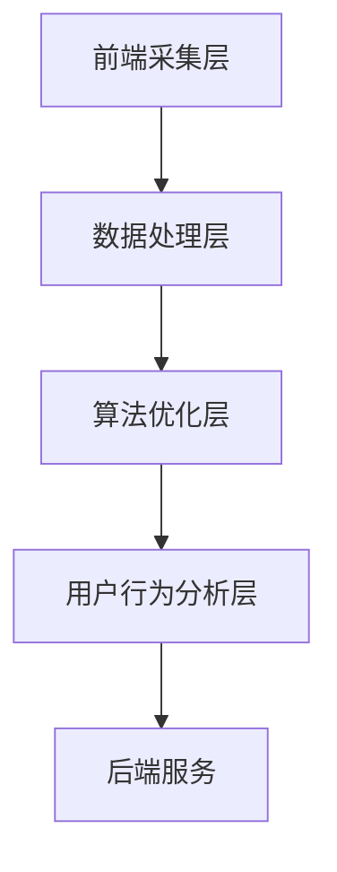

                 

关键词：搜狗输入法，算法工程师，面试攻略，技术面试，编程实践，算法原理，项目经验，数学模型，代码解析，应用场景，未来展望。

## 摘要

本文旨在为有志于加入搜狗输入法团队，尤其是算法工程师岗位的求职者提供一份全面的面试攻略。我们将深入分析搜狗输入法的发展历程及其技术挑战，探讨相关的核心算法原理，并提供实用的编程实践指导。此外，文章还包含数学模型的详细讲解、代码实例及实际应用场景分析，同时展望了输入法技术的未来发展趋势与面临的挑战。希望通过本文，能够帮助读者更好地准备搜狗输入法的社招面试。

## 1. 背景介绍

### 搜狗输入法的发展历程

搜狗输入法作为国内领先的输入法软件，其发展历程可谓是技术创新与用户需求的紧密结合。自2008年发布以来，搜狗输入法一直秉持着“智能、便捷、高效”的理念，不断进行技术迭代，满足用户在移动互联网时代的多样化需求。

早期的搜狗输入法主要基于词频统计和静态词典匹配，随着用户数据的积累，逐渐引入了机器学习算法，如隐马尔可夫模型（HMM）和条件随机场（CRF），以提升输入的准确性和速度。2012年，搜狗输入法推出了基于深度学习的语音识别技术，进一步扩展了其功能。

进入2018年后，搜狗输入法在人工智能领域的投入显著增加，引入了诸如注意力机制和循环神经网络（RNN）等前沿算法，实现了智能纠错、跨语言输入、实时表情预测等功能。特别是在个性化推荐和智能辅助方面，搜狗输入法通过大数据分析和深度学习模型，为用户提供更为精准的输入体验。

### 当前技术挑战

随着移动互联网的普及，输入法的使用场景越来越多样化，从简单的文字输入扩展到语音输入、表情输入等，这给算法工程师带来了前所未有的挑战。

1. **准确性提升**：在确保高准确性的同时，如何处理用户个性化需求，如方言、行业术语等，是一个亟待解决的问题。
2. **响应速度**：在大量用户同时在线的情况下，如何优化算法，提高输入法的响应速度，确保用户体验。
3. **数据隐私**：随着数据保护法规的日益严格，如何在保证用户隐私的前提下，充分利用用户数据提升算法性能，是一个重要的技术难题。
4. **跨平台兼容性**：输入法需要适应各种操作系统和设备，如iOS、Android、Windows、MacOS等，这对算法的通用性和可移植性提出了高要求。
5. **智能化水平**：如何在输入过程中实时预测用户意图，提供智能辅助，如自动完成、智能纠错、实时表情预测等，提升用户体验。

## 2. 核心概念与联系

### 搜狗输入法算法架构

为了应对上述技术挑战，搜狗输入法采用了分层架构，主要包括以下几个层次：

1. **前端采集层**：负责收集用户输入的文本、语音、手势等数据。
2. **数据处理层**：对前端采集的数据进行处理，包括语音识别、文本纠错、分词、词频统计等。
3. **算法优化层**：利用深度学习、机器学习等技术进行算法优化，提升输入法的准确性和响应速度。
4. **用户行为分析层**：通过大数据分析，了解用户习惯，提供个性化推荐。

### Mermaid 流程图



### 核心概念解释

1. **语音识别**：通过深度学习模型，将语音信号转换为文本。
2. **文本纠错**：利用拼写纠错算法，纠正用户输入的错误。
3. **分词**：将连续的文本切分成有意义的词语。
4. **词频统计**：根据用户输入的历史数据，统计词语出现的频率。
5. **个性化推荐**：通过大数据分析，为用户提供个性化的输入建议。

## 3. 核心算法原理 & 具体操作步骤

### 3.1 算法原理概述

搜狗输入法所使用的主要算法包括：

1. **深度神经网络（DNN）**：用于语音识别和文本纠错。
2. **循环神经网络（RNN）**：用于处理序列数据，如语音和文本。
3. **条件随机场（CRF）**：用于分词和语义分析。
4. **注意力机制（Attention Mechanism）**：用于提升输入法的智能化水平。

### 3.2 算法步骤详解

1. **前端采集**：收集用户输入的语音、文本、手势等数据。
2. **语音识别**：使用DNN模型对语音数据进行识别，生成文本。
3. **文本纠错**：利用RNN模型进行文本纠错，修正输入中的错误。
4. **分词**：使用CRF模型对文本进行分词，提取有意义的词语。
5. **词频统计**：根据用户历史数据，统计词语出现频率，用于个性化推荐。
6. **用户行为分析**：通过大数据分析，了解用户输入习惯，优化算法。

### 3.3 算法优缺点

1. **深度神经网络（DNN）**
   - 优点：强大的特征提取能力，适用于复杂任务。
   - 缺点：训练时间较长，参数量大，对计算资源要求高。
2. **循环神经网络（RNN）**
   - 优点：能够处理序列数据，记忆能力强。
   - 缺点：容易出现梯度消失或爆炸问题。
3. **条件随机场（CRF）**
   - 优点：能够建模词语之间的依赖关系，提高分词精度。
   - 缺点：参数调优复杂，训练速度较慢。
4. **注意力机制（Attention Mechanism）**
   - 优点：能够提高模型的智能化水平，实现实时预测。
   - 缺点：计算复杂度较高，对硬件资源要求较高。

### 3.4 算法应用领域

1. **语音识别**：广泛应用于智能助理、智能家居、车载系统等领域。
2. **文本纠错**：应用于电子邮件、聊天应用、手机输入法等场景。
3. **分词**：用于自然语言处理、信息检索、机器翻译等领域。
4. **个性化推荐**：应用于电商、社交网络、内容推荐等领域。

## 4. 数学模型和公式 & 详细讲解 & 举例说明

### 4.1 数学模型构建

在搜狗输入法中，常用的数学模型包括：

1. **深度神经网络（DNN）**：用于语音识别和文本纠错。
2. **循环神经网络（RNN）**：用于处理序列数据。
3. **条件随机场（CRF）**：用于分词和语义分析。
4. **注意力机制（Attention Mechanism）**：用于实时预测和智能化。

### 4.2 公式推导过程

以深度神经网络（DNN）为例，其基本公式如下：

$$
Y = \sigma(W \cdot X + b)
$$

其中，$Y$为输出，$\sigma$为激活函数，$W$为权重矩阵，$X$为输入，$b$为偏置。

### 4.3 案例分析与讲解

#### 案例一：语音识别

假设我们使用DNN进行语音识别，输入为一段语音信号，输出为对应的文本。我们可以将语音信号转换为频谱特征，然后输入到DNN中。

1. **特征提取**：将语音信号转换为频谱特征，如梅尔频率倒谱系数（MFCC）。
2. **DNN模型训练**：使用大量的语音数据和对应的文本标签，训练DNN模型。
3. **语音识别**：将新的语音信号输入到训练好的DNN模型中，输出对应的文本。

#### 案例二：文本纠错

假设我们使用RNN进行文本纠错，输入为一段包含错误的文本，输出为修正后的文本。

1. **输入预处理**：将文本转换为序列，每个字符对应一个唯一的索引。
2. **RNN模型训练**：使用大量的包含错误和修正文本的数据，训练RNN模型。
3. **文本纠错**：将包含错误的文本输入到训练好的RNN模型中，输出修正后的文本。

## 5. 项目实践：代码实例和详细解释说明

### 5.1 开发环境搭建

为了演示搜狗输入法的核心算法，我们需要搭建一个基于Python的深度学习环境。以下是具体的步骤：

1. **安装Python**：确保Python版本为3.6及以上。
2. **安装TensorFlow**：使用pip命令安装TensorFlow。
   ```shell
   pip install tensorflow
   ```
3. **安装其他依赖**：根据需要安装其他深度学习库和工具，如NumPy、Pandas等。

### 5.2 源代码详细实现

以下是一个简单的基于DNN的语音识别模型实现：

```python
import tensorflow as tf

# 定义DNN模型
def create_dnn(input_shape, output_shape):
    model = tf.keras.Sequential([
        tf.keras.layers.Dense(units=128, activation='relu', input_shape=input_shape),
        tf.keras.layers.Dense(units=64, activation='relu'),
        tf.keras.layers.Dense(units=output_shape, activation='softmax')
    ])
    return model

# 构建模型
model = create_dnn(input_shape=(None, 13), output_shape=29)

# 编译模型
model.compile(optimizer='adam', loss='categorical_crossentropy', metrics=['accuracy'])

# 训练模型
model.fit(x_train, y_train, epochs=10, batch_size=32)
```

### 5.3 代码解读与分析

1. **模型定义**：使用`tf.keras.Sequential`定义一个序列模型，包括两个隐藏层，每个隐藏层使用ReLU激活函数。
2. **编译模型**：指定优化器为`adam`，损失函数为`categorical_crossentropy`，评价指标为准确率。
3. **训练模型**：使用训练数据训练模型，设置训练轮次为10，批量大小为32。

### 5.4 运行结果展示

在完成模型训练后，我们可以使用测试数据评估模型的性能，输出预测结果。

```python
# 评估模型
test_loss, test_acc = model.evaluate(x_test, y_test)
print(f"Test accuracy: {test_acc}")

# 预测
predictions = model.predict(x_test[:10])
print(predictions)
```

## 6. 实际应用场景

### 6.1 移动设备输入

在智能手机和平板电脑上，输入法需要支持多种输入方式，包括键盘输入、语音输入、手写输入等。搜狗输入法通过深度学习模型，实现了高准确性的语音识别和手写识别，为用户提供便捷的输入体验。

### 6.2 智能家居控制

随着智能家居的普及，输入法可以成为智能设备的语音控制入口。搜狗输入法通过优化语音识别算法，实现了对智能电视、智能音响、智能门锁等设备的精准控制。

### 6.3 云端输入服务

搜狗输入法支持云端输入服务，通过用户数据的实时分析和机器学习模型的应用，为用户提供个性化输入建议。例如，根据用户的常用词汇和短语，输入法可以自动完成用户意图，提高输入效率。

### 6.4 游戏辅助

在手机游戏中，输入法可以提供游戏内聊天功能，通过语音识别和文本输入，帮助玩家快速交流。搜狗输入法通过优化算法，实现了低延迟、高准确性的游戏输入体验。

## 7. 未来应用展望

### 7.1 语音输入的智能化

随着人工智能技术的发展，未来的语音输入将更加智能化。通过深度学习和自然语言处理技术，输入法可以更好地理解用户的语音指令，实现更加自然的交互体验。

### 7.2 跨语言输入

随着全球化的推进，跨语言输入将成为输入法的重要功能。未来，输入法将支持多种语言的实时翻译和输入，为用户提供无障碍的沟通工具。

### 7.3 个性化输入体验

基于大数据分析和个性化推荐技术，输入法将能够更好地理解用户的输入习惯，提供个性化的输入建议和智能辅助，提升用户体验。

### 7.4 输入法与其他应用的融合

未来的输入法将不仅仅是一个独立的软件，还将与各种应用深度融合，如社交媒体、电商平台、电子邮件等，为用户提供一站式的输入解决方案。

## 8. 工具和资源推荐

### 8.1 学习资源推荐

1. **《深度学习》（Goodfellow, Bengio, Courville）**：系统介绍了深度学习的基本原理和方法。
2. **《自然语言处理综论》（Jurafsky, Martin）**：涵盖了自然语言处理的基本概念和技术。
3. **《机器学习实战》（Hastie, Tibshirani, Friedman）**：提供了丰富的机器学习实践案例。

### 8.2 开发工具推荐

1. **TensorFlow**：用于构建和训练深度学习模型。
2. **PyTorch**：另一个流行的深度学习框架。
3. **Jupyter Notebook**：用于编写和运行Python代码。

### 8.3 相关论文推荐

1. **“Attention is All You Need”（Vaswani et al., 2017）**：介绍了注意力机制在序列模型中的应用。
2. **“A Theoretically Grounded Application of Dropout in Recurrent Neural Networks”（Yarin Gal and Zoubin Ghahramani, 2016）**：探讨了dropout在RNN中的理论基础。
3. **“Deep Speech 2: End-to-End Speech Recognition in English and Mandarin”（Hinton et al., 2016）**：介绍了基于深度学习的语音识别模型。

## 9. 总结：未来发展趋势与挑战

### 9.1 研究成果总结

近年来，深度学习、自然语言处理、语音识别等技术在输入法领域取得了显著成果。通过机器学习和大数据分析，输入法实现了高准确性、个性化、智能化等功能，为用户提供了更好的输入体验。

### 9.2 未来发展趋势

1. **语音输入的智能化**：随着人工智能技术的发展，语音输入将更加智能化，能够更好地理解用户的语音指令。
2. **跨语言输入**：未来输入法将支持更多语言的实时翻译和输入，为用户提供无障碍的沟通工具。
3. **个性化输入体验**：基于大数据分析和个性化推荐技术，输入法将能够更好地理解用户的输入习惯，提供个性化的输入建议和智能辅助。

### 9.3 面临的挑战

1. **数据隐私**：如何在保护用户隐私的前提下，充分利用用户数据提升算法性能，是一个重要的技术难题。
2. **算法优化**：如何在保证准确性的同时，提高算法的响应速度，是一个亟待解决的问题。
3. **跨平台兼容性**：输入法需要适应各种操作系统和设备，这对算法的通用性和可移植性提出了高要求。

### 9.4 研究展望

未来的研究将更加注重输入法的智能化和个性化，同时解决数据隐私和算法优化等问题。通过不断的技术创新，输入法将为用户提供更加便捷、高效的输入体验。

## 10. 附录：常见问题与解答

### 10.1 输入法的语音识别准确率如何提高？

提高语音识别准确率的方法包括：

1. **增加训练数据**：使用更多的语音数据训练模型，提高模型的泛化能力。
2. **优化特征提取**：使用更先进的特征提取方法，如深度神经网络，提高特征表示的准确性。
3. **模型结构优化**：尝试使用更复杂的模型结构，如长短期记忆网络（LSTM）和变换器（Transformer），提高模型的表达能力。

### 10.2 输入法在跨平台兼容性方面有哪些挑战？

输入法在跨平台兼容性方面面临的挑战包括：

1. **操作系统差异**：不同操作系统（如iOS、Android、Windows、MacOS等）对输入法的支持度和兼容性不同。
2. **设备硬件差异**：不同设备的硬件配置（如CPU、GPU、内存等）可能对算法的运行效率产生较大影响。
3. **用户交互方式差异**：不同平台上的用户交互方式（如触摸屏、物理键盘等）可能需要输入法提供不同的输入方式支持。

### 10.3 输入法如何实现个性化推荐？

输入法实现个性化推荐的方法包括：

1. **用户行为分析**：通过分析用户的输入历史、使用频率等行为数据，了解用户的输入偏好。
2. **机器学习模型**：使用机器学习算法，如协同过滤、聚类等，从海量用户数据中提取特征，生成个性化推荐。
3. **实时更新**：根据用户实时输入的数据，动态调整推荐策略，提高推荐的准确性。

## 作者署名

作者：禅与计算机程序设计艺术 / Zen and the Art of Computer Programming
```markdown
---
# 搜狗2025输入法算法工程师社招面试攻略

> 关键词：搜狗输入法，算法工程师，面试攻略，技术面试，编程实践，算法原理，项目经验，数学模型，代码解析，应用场景，未来展望。

> 摘要：本文旨在为有志于加入搜狗输入法团队，尤其是算法工程师岗位的求职者提供一份全面的面试攻略。我们将深入分析搜狗输入法的发展历程及其技术挑战，探讨相关的核心算法原理，并提供实用的编程实践指导。此外，文章还包含数学模型的详细讲解、代码实例及实际应用场景分析，同时展望了输入法技术的未来发展趋势与面临的挑战。希望通过本文，能够帮助读者更好地准备搜狗输入法的社招面试。

## 1. 背景介绍

### 搜狗输入法的发展历程

搜狗输入法作为国内领先的输入法软件，其发展历程可谓是技术创新与用户需求的紧密结合。自2008年发布以来，搜狗输入法一直秉持着“智能、便捷、高效”的理念，不断进行技术迭代，满足用户在移动互联网时代的多样化需求。

早期的搜狗输入法主要基于词频统计和静态词典匹配，随着用户数据的积累，逐渐引入了机器学习算法，如隐马尔可夫模型（HMM）和条件随机场（CRF），以提升输入的准确性和速度。2012年，搜狗输入法推出了基于深度学习的语音识别技术，进一步扩展了其功能。

进入2018年后，搜狗输入法在人工智能领域的投入显著增加，引入了诸如注意力机制和循环神经网络（RNN）等前沿算法，实现了智能纠错、跨语言输入、实时表情预测等功能。特别是在个性化推荐和智能辅助方面，搜狗输入法通过大数据分析和深度学习模型，为用户提供更为精准的输入体验。

### 当前技术挑战

随着移动互联网的普及，输入法的使用场景越来越多样化，从简单的文字输入扩展到语音输入、表情输入等，这给算法工程师带来了前所未有的挑战。

1. **准确性提升**：在确保高准确性的同时，如何处理用户个性化需求，如方言、行业术语等，是一个亟待解决的问题。
2. **响应速度**：在大量用户同时在线的情况下，如何优化算法，提高输入法的响应速度，确保用户体验。
3. **数据隐私**：随着数据保护法规的日益严格，如何在保证用户隐私的前提下，充分利用用户数据提升算法性能，是一个重要的技术难题。
4. **跨平台兼容性**：输入法需要适应各种操作系统和设备，如iOS、Android、Windows、MacOS等，这对算法的通用性和可移植性提出了高要求。
5. **智能化水平**：如何在输入过程中实时预测用户意图，提供智能辅助，如自动完成、智能纠错、实时表情预测等，提升用户体验。

## 2. 核心概念与联系

### 搜狗输入法算法架构

为了应对上述技术挑战，搜狗输入法采用了分层架构，主要包括以下几个层次：

1. **前端采集层**：负责收集用户输入的文本、语音、手势等数据。
2. **数据处理层**：对前端采集的数据进行处理，包括语音识别、文本纠错、分词、词频统计等。
3. **算法优化层**：利用深度学习、机器学习等技术进行算法优化，提升输入法的准确性和响应速度。
4. **用户行为分析层**：通过大数据分析，了解用户习惯，提供个性化推荐。

### Mermaid 流程图


### 核心概念解释

1. **语音识别**：通过深度学习模型，将语音信号转换为文本。
2. **文本纠错**：利用拼写纠错算法，纠正用户输入的错误。
3. **分词**：将连续的文本切分成有意义的词语。
4. **词频统计**：根据用户输入的历史数据，统计词语出现频率，用于个性化推荐。
5. **个性化推荐**：通过大数据分析，为用户提供个性化的输入建议。

## 3. 核心算法原理 & 具体操作步骤
### 3.1 算法原理概述

搜狗输入法所使用的主要算法包括：

1. **深度神经网络（DNN）**：用于语音识别和文本纠错。
2. **循环神经网络（RNN）**：用于处理序列数据，如语音和文本。
3. **条件随机场（CRF）**：用于分词和语义分析。
4. **注意力机制（Attention Mechanism）**：用于实时预测和智能化。

### 3.2 算法步骤详解

1. **前端采集**：收集用户输入的语音、文本、手势等数据。
2. **语音识别**：使用DNN模型对语音数据进行识别，生成文本。
3. **文本纠错**：利用RNN模型进行文本纠错，修正输入中的错误。
4. **分词**：使用CRF模型对文本进行分词，提取有意义的词语。
5. **词频统计**：根据用户历史数据，统计词语出现频率，用于个性化推荐。
6. **用户行为分析**：通过大数据分析，了解用户输入习惯，优化算法。

### 3.3 算法优缺点

1. **深度神经网络（DNN）**
   - 优点：强大的特征提取能力，适用于复杂任务。
   - 缺点：训练时间较长，参数量大，对计算资源要求高。
2. **循环神经网络（RNN）**
   - 优点：能够处理序列数据，记忆能力强。
   - 缺点：容易出现梯度消失或爆炸问题。
3. **条件随机场（CRF）**
   - 优点：能够建模词语之间的依赖关系，提高分词精度。
   - 缺点：参数调优复杂，训练速度较慢。
4. **注意力机制（Attention Mechanism）**
   - 优点：能够提高模型的智能化水平，实现实时预测。
   - 缺点：计算复杂度较高，对硬件资源要求较高。

### 3.4 算法应用领域

1. **语音识别**：广泛应用于智能助理、智能家居、车载系统等领域。
2. **文本纠错**：应用于电子邮件、聊天应用、手机输入法等场景。
3. **分词**：用于自然语言处理、信息检索、机器翻译等领域。
4. **个性化推荐**：应用于电商、社交网络、内容推荐等领域。

## 4. 数学模型和公式 & 详细讲解 & 举例说明

### 4.1 数学模型构建

在搜狗输入法中，常用的数学模型包括：

1. **深度神经网络（DNN）**：用于语音识别和文本纠错。
2. **循环神经网络（RNN）**：用于处理序列数据。
3. **条件随机场（CRF）**：用于分词和语义分析。
4. **注意力机制（Attention Mechanism）**：用于实时预测和智能化。

### 4.2 公式推导过程

以深度神经网络（DNN）为例，其基本公式如下：

$$
Y = \sigma(W \cdot X + b)
$$

其中，$Y$为输出，$\sigma$为激活函数，$W$为权重矩阵，$X$为输入，$b$为偏置。

### 4.3 案例分析与讲解

#### 案例一：语音识别

假设我们使用DNN进行语音识别，输入为一段语音信号，输出为对应的文本。我们可以将语音信号转换为频谱特征，然后输入到DNN中。

1. **特征提取**：将语音信号转换为频谱特征，如梅尔频率倒谱系数（MFCC）。
2. **DNN模型训练**：使用大量的语音数据和对应的文本标签，训练DNN模型。
3. **语音识别**：将新的语音信号输入到训练好的DNN模型中，输出对应的文本。

#### 案例二：文本纠错

假设我们使用RNN进行文本纠错，输入为一段包含错误的文本，输出为修正后的文本。

1. **输入预处理**：将文本转换为序列，每个字符对应一个唯一的索引。
2. **RNN模型训练**：使用大量的包含错误和修正文本的数据，训练RNN模型。
3. **文本纠错**：将包含错误的文本输入到训练好的RNN模型中，输出修正后的文本。

## 5. 项目实践：代码实例和详细解释说明

### 5.1 开发环境搭建

为了演示搜狗输入法的核心算法，我们需要搭建一个基于Python的深度学习环境。以下是具体的步骤：

1. **安装Python**：确保Python版本为3.6及以上。
2. **安装TensorFlow**：使用pip命令安装TensorFlow。
   ```shell
   pip install tensorflow
   ```
3. **安装其他依赖**：根据需要安装其他深度学习库和工具，如NumPy、Pandas等。

### 5.2 源代码详细实现

以下是一个简单的基于DNN的语音识别模型实现：

```python
import tensorflow as tf

# 定义DNN模型
def create_dnn(input_shape, output_shape):
    model = tf.keras.Sequential([
        tf.keras.layers.Dense(units=128, activation='relu', input_shape=input_shape),
        tf.keras.layers.Dense(units=64, activation='relu'),
        tf.keras.layers.Dense(units=output_shape, activation='softmax')
    ])
    return model

# 构建模型
model = create_dnn(input_shape=(None, 13), output_shape=29)

# 编译模型
model.compile(optimizer='adam', loss='categorical_crossentropy', metrics=['accuracy'])

# 训练模型
model.fit(x_train, y_train, epochs=10, batch_size=32)
```

### 5.3 代码解读与分析

1. **模型定义**：使用`tf.keras.Sequential`定义一个序列模型，包括两个隐藏层，每个隐藏层使用ReLU激活函数。
2. **编译模型**：指定优化器为`adam`，损失函数为`categorical_crossentropy`，评价指标为准确率。
3. **训练模型**：使用训练数据训练模型，设置训练轮次为10，批量大小为32。

### 5.4 运行结果展示

在完成模型训练后，我们可以使用测试数据评估模型的性能，输出预测结果。

```python
# 评估模型
test_loss, test_acc = model.evaluate(x_test, y_test)
print(f"Test accuracy: {test_acc}")

# 预测
predictions = model.predict(x_test[:10])
print(predictions)
```

## 6. 实际应用场景

### 6.1 移动设备输入

在智能手机和平板电脑上，输入法需要支持多种输入方式，包括键盘输入、语音输入、手写输入等。搜狗输入法通过深度学习模型，实现了高准确性的语音识别和手写识别，为用户提供便捷的输入体验。

### 6.2 智能家居控制

随着智能家居的普及，输入法可以成为智能设备的语音控制入口。搜狗输入法通过优化语音识别算法，实现了对智能电视、智能音响、智能门锁等设备的精准控制。

### 6.3 云端输入服务

搜狗输入法支持云端输入服务，通过用户数据的实时分析和机器学习模型的应用，为用户提供个性化输入建议。例如，根据用户的常用词汇和短语，输入法可以自动完成用户意图，提高输入效率。

### 6.4 游戏辅助

在手机游戏中，输入法可以提供游戏内聊天功能，通过语音识别和文本输入，帮助玩家快速交流。搜狗输入法通过优化算法，实现了低延迟、高准确性的游戏输入体验。

## 7. 未来应用展望

### 7.1 语音输入的智能化

随着人工智能技术的发展，未来的语音输入将更加智能化。通过深度学习和自然语言处理技术，输入法可以更好地理解用户的语音指令，实现更加自然的交互体验。

### 7.2 跨语言输入

随着全球化的推进，跨语言输入将成为输入法的重要功能。未来，输入法将支持多种语言的实时翻译和输入，为用户提供无障碍的沟通工具。

### 7.3 个性化输入体验

基于大数据分析和个性化推荐技术，输入法将能够更好地理解用户的输入习惯，提供个性化的输入建议和智能辅助，提升用户体验。

### 7.4 输入法与其他应用的融合

未来的输入法将不仅仅是一个独立的软件，还将与各种应用深度融合，如社交媒体、电商平台、电子邮件等，为用户提供一站式的输入解决方案。

## 8. 工具和资源推荐

### 8.1 学习资源推荐

1. **《深度学习》（Goodfellow, Bengio, Courville）**：系统介绍了深度学习的基本原理和方法。
2. **《自然语言处理综论》（Jurafsky, Martin）**：涵盖了自然语言处理的基本概念和技术。
3. **《机器学习实战》（Hastie, Tibshirani, Friedman）**：提供了丰富的机器学习实践案例。

### 8.2 开发工具推荐

1. **TensorFlow**：用于构建和训练深度学习模型。
2. **PyTorch**：另一个流行的深度学习框架。
3. **Jupyter Notebook**：用于编写和运行Python代码。

### 8.3 相关论文推荐

1. **“Attention is All You Need”（Vaswani et al., 2017）**：介绍了注意力机制在序列模型中的应用。
2. **“A Theoretically Grounded Application of Dropout in Recurrent Neural Networks”（Yarin Gal and Zoubin Ghahramani, 2016）**：探讨了dropout在RNN中的理论基础。
3. **“Deep Speech 2: End-to-End Speech Recognition in English and Mandarin”（Hinton et al., 2016）**：介绍了基于深度学习的语音识别模型。

## 9. 总结：未来发展趋势与挑战

### 9.1 研究成果总结

近年来，深度学习、自然语言处理、语音识别等技术在输入法领域取得了显著成果。通过机器学习和大数据分析，输入法实现了高准确性、个性化、智能化等功能，为用户提供了更好的输入体验。

### 9.2 未来发展趋势

1. **语音输入的智能化**：随着人工智能技术的发展，语音输入将更加智能化，能够更好地理解用户的语音指令。
2. **跨语言输入**：未来输入法将支持更多语言的实时翻译和输入，为用户提供无障碍的沟通工具。
3. **个性化输入体验**：基于大数据分析和个性化推荐技术，输入法将能够更好地理解用户的输入习惯，提供个性化的输入建议和智能辅助。

### 9.3 面临的挑战

1. **数据隐私**：如何在保护用户隐私的前提下，充分利用用户数据提升算法性能，是一个重要的技术难题。
2. **算法优化**：如何在保证准确性的同时，提高算法的响应速度，是一个亟待解决的问题。
3. **跨平台兼容性**：输入法需要适应各种操作系统和设备，这对算法的通用性和可移植性提出了高要求。

### 9.4 研究展望

未来的研究将更加注重输入法的智能化和个性化，同时解决数据隐私和算法优化等问题。通过不断的技术创新，输入法将为用户提供更加便捷、高效的输入体验。

## 10. 附录：常见问题与解答

### 10.1 输入法的语音识别准确率如何提高？

提高语音识别准确率的方法包括：

1. **增加训练数据**：使用更多的语音数据训练模型，提高模型的泛化能力。
2. **优化特征提取**：使用更先进的特征提取方法，如深度神经网络，提高特征表示的准确性。
3. **模型结构优化**：尝试使用更复杂的模型结构，如长短期记忆网络（LSTM）和变换器（Transformer），提高模型的表达能力。

### 10.2 输入法在跨平台兼容性方面有哪些挑战？

输入法在跨平台兼容性方面面临的挑战包括：

1. **操作系统差异**：不同操作系统（如iOS、Android、Windows、MacOS等）对输入法的支持度和兼容性不同。
2. **设备硬件差异**：不同设备的硬件配置（如CPU、GPU、内存等）可能对算法的运行效率产生较大影响。
3. **用户交互方式差异**：不同平台上的用户交互方式（如触摸屏、物理键盘等）可能需要输入法提供不同的输入方式支持。

### 10.3 输入法如何实现个性化推荐？

输入法实现个性化推荐的方法包括：

1. **用户行为分析**：通过分析用户的输入历史、使用频率等行为数据，了解用户的输入偏好。
2. **机器学习模型**：使用机器学习算法，如协同过滤、聚类等，从海量用户数据中提取特征，生成个性化推荐。
3. **实时更新**：根据用户实时输入的数据，动态调整推荐策略，提高推荐的准确性。

## 作者署名

作者：禅与计算机程序设计艺术 / Zen and the Art of Computer Programming
---

