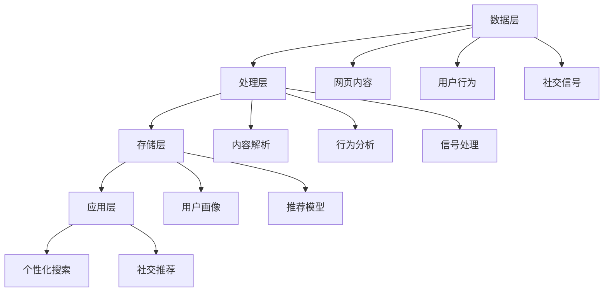

                 

 在当今数字化的世界里，搜索引擎和社交网络已经成为我们日常生活中不可或缺的部分。搜索引擎如Google、Bing等，为我们提供了快速获取信息的能力；而社交网络如Facebook、Twitter、Instagram等，则为人们提供了一个交流、分享和互动的平台。这两者的融合，不仅为用户带来了更加丰富和多样化的体验，也为企业提供了新的商业机会。本文将探讨搜索引擎与社交网络的融合，从核心概念、算法原理、数学模型、实际应用等多个角度进行分析。

## 1. 背景介绍

随着互联网的快速发展，信息量的爆炸式增长使得用户在获取信息时面临了前所未有的挑战。传统的搜索引擎依赖于关键词匹配和网页排名算法，虽然能够提供一定程度的搜索结果，但在处理复杂查询、理解用户意图、提供个性化推荐等方面存在一定的局限性。与此同时，社交网络作为一种新型的信息传播方式，通过用户的互动、分享和推荐，为用户提供了更加个性化和丰富化的信息。

搜索引擎和社交网络的融合，旨在将两者的优势相结合，为用户提供更加智能和高效的搜索和推荐服务。这种融合不仅可以提高用户的使用体验，还可以为企业带来更多的商业价值。

### 搜索引擎的工作原理

搜索引擎的主要工作原理包括三个主要步骤：爬取网页、索引网页和提供搜索结果。

1. **爬取网页**：搜索引擎通过自动化程序（爬虫）爬取互联网上的网页，收集网页的内容和链接信息。
2. **索引网页**：搜索引擎将爬取到的网页内容进行预处理，提取关键词和主题信息，建立索引数据库。
3. **提供搜索结果**：当用户输入查询请求时，搜索引擎会根据索引数据库中的信息，匹配用户查询的关键词，并返回最相关的网页链接。

### 社交网络的工作原理

社交网络的工作原理主要包括用户的创建、互动和分享。

1. **用户创建**：用户在社交网络上注册账号，并填写个人资料。
2. **互动**：用户可以通过点赞、评论、分享等方式与其他用户进行互动。
3. **分享**：用户可以发布自己的内容，如文字、图片、视频等，并与他人分享。

## 2. 核心概念与联系

### 搜索引擎与社交网络的融合概念

搜索引擎与社交网络的融合，主要涉及以下几个核心概念：

1. **社交信号**：社交网络上的点赞、评论、分享等行为，可以作为一种信号，反映出用户对某个内容的兴趣和偏好。
2. **用户画像**：通过分析用户的社交行为和搜索历史，可以为用户建立详细的画像，包括兴趣爱好、行为习惯等。
3. **个性化推荐**：利用用户画像和社交信号，为用户提供个性化的搜索结果和推荐内容。

### 融合架构

为了实现搜索引擎与社交网络的融合，需要构建一个支持社交信号处理、用户画像构建和个性化推荐的综合架构。以下是一个简化的融合架构：

1. **数据层**：包括搜索引擎和社交网络的数据，如网页内容、用户行为、社交信号等。
2. **处理层**：对数据进行处理，包括网页内容解析、用户行为分析、社交信号处理等。
3. **存储层**：存储处理后的数据，包括用户画像、推荐模型等。
4. **应用层**：提供搜索引擎和社交网络的融合服务，包括个性化搜索、社交推荐等。


### Mermaid 流程图

以下是融合架构的 Mermaid 流程图，用于描述数据流和处理流程：



## 3. 核心算法原理 & 具体操作步骤

### 3.1 算法原理概述

搜索引擎与社交网络的融合，主要依赖于以下核心算法：

1. **社交信号处理算法**：用于提取和计算社交信号，如点赞数、评论数、分享数等，以及它们对搜索结果的影响。
2. **用户画像构建算法**：用于分析用户的搜索历史、社交行为等数据，构建用户的兴趣爱好、行为习惯等画像。
3. **个性化推荐算法**：基于用户画像和社交信号，为用户提供个性化的搜索结果和推荐内容。

### 3.2 算法步骤详解

1. **社交信号处理算法**

   - **数据收集**：收集社交网络上的点赞、评论、分享等行为数据。
   - **信号提取**：提取每个用户对这些行为的贡献，如点赞数、评论数、分享数等。
   - **信号计算**：计算每个信号的权重，如点赞数的权重可能高于评论数。
   - **信号整合**：将社交信号整合到搜索结果中，影响搜索结果的排序。

2. **用户画像构建算法**

   - **数据收集**：收集用户的搜索历史、社交行为等数据。
   - **特征提取**：提取用户的兴趣爱好、行为习惯等特征。
   - **模型构建**：构建用户画像模型，用于描述用户的特征和偏好。
   - **更新与迭代**：定期更新用户画像，以反映用户行为的变化。

3. **个性化推荐算法**

   - **用户画像构建**：根据用户画像模型，构建用户的兴趣模型。
   - **内容分析**：分析推荐内容的相关性、受欢迎程度等。
   - **推荐生成**：基于用户画像和内容分析，生成个性化的推荐结果。
   - **反馈与优化**：根据用户的反馈，优化推荐算法和模型。

### 3.3 算法优缺点

**社交信号处理算法**

- **优点**：充分利用社交网络中的用户行为数据，提高搜索结果的相关性和个性
- **缺点**：可能导致信息过载，影响搜索结果的准确性。

**用户画像构建算法**

- **优点**：为用户提供更加个性化的服务，提高用户满意度。
- **缺点**：用户隐私保护问题，需要平衡个性化与隐私保护。

**个性化推荐算法**

- **优点**：提高用户参与度和留存率，增加用户粘性。
- **缺点**：推荐结果可能过于单一，无法满足用户的多样性需求。

### 3.4 算法应用领域

- **搜索引擎**：通过融合社交信号，提高搜索结果的相关性和个性化。
- **社交网络**：通过构建用户画像，提供个性化的推荐内容。
- **电子商务**：利用用户画像和社交信号，提高商品推荐的效果。

## 4. 数学模型和公式 & 详细讲解 & 举例说明

### 4.1 数学模型构建

为了实现搜索引擎与社交网络的融合，需要构建以下数学模型：

1. **社交信号权重模型**：用于计算社交信号的权重，如点赞数、评论数、分享数的权重。
2. **用户画像模型**：用于描述用户的兴趣爱好、行为习惯等特征。
3. **个性化推荐模型**：用于生成个性化的搜索结果和推荐内容。

### 4.2 公式推导过程

1. **社交信号权重模型**

   设\( w_i \)为社交信号\( i \)的权重，\( p_i \)为社交信号\( i \)的值，\( a_i \)为社交信号\( i \)的调整系数。

   $$ w_i = \frac{p_i}{\sum_{j=1}^{n} p_j \cdot a_j} $$

   其中，\( n \)为社交信号的总数。

2. **用户画像模型**

   设\( U \)为用户集合，\( u_i \)为用户\( i \)的画像特征，\( v_i \)为用户\( i \)的画像权重。

   $$ u_i = \sum_{j=1}^{m} v_j \cdot x_j $$

   其中，\( m \)为用户画像特征的总数，\( x_j \)为用户\( i \)在特征\( j \)上的取值。

3. **个性化推荐模型**

   设\( R \)为推荐结果集合，\( r_i \)为推荐结果\( i \)的相关性得分，\( s_i \)为推荐结果\( i \)的受欢迎程度得分。

   $$ r_i = \sum_{j=1}^{n} w_j \cdot r_{ij} $$

   $$ s_i = \sum_{j=1}^{n} w_j \cdot s_{ij} $$

   其中，\( n \)为推荐结果的总数，\( w_j \)为社交信号\( j \)的权重，\( r_{ij} \)为推荐结果\( i \)与用户画像\( j \)的相关性得分，\( s_{ij} \)为推荐结果\( i \)的受欢迎程度得分。

### 4.3 案例分析与讲解

以一个简单的例子来说明数学模型的应用。

**案例背景**：一个用户在社交网络上发布了关于“计算机编程”的文章，并收到了多个点赞、评论和分享。

**社交信号权重计算**：

- 点赞数为10，评论数为5，分享数为3。
- 点赞的权重为0.5，评论的权重为0.3，分享的权重为0.2。

$$ w_{\text{点赞}} = \frac{10}{10 + 5 + 3} \cdot 0.5 = 0.3333 $$
$$ w_{\text{评论}} = \frac{5}{10 + 5 + 3} \cdot 0.3 = 0.1667 $$
$$ w_{\text{分享}} = \frac{3}{10 + 5 + 3} \cdot 0.2 = 0.0667 $$

**用户画像构建**：

- 用户在搜索历史中频繁搜索“计算机编程”、“算法”、“数据结构”等关键词。
- 用户画像特征包括兴趣爱好、搜索历史等。

$$ u = \begin{bmatrix} 0.6 \\ 0.2 \\ 0.2 \end{bmatrix} $$

**个性化推荐计算**：

- 有三个推荐结果：文章A、文章B、文章C。
- 文章A与用户画像的相关性得分为0.8，受欢迎程度得分为0.7。
- 文章B与用户画像的相关性得分为0.5，受欢迎程度得分为0.8。
- 文章C与用户画像的相关性得分为0.3，受欢迎程度得分为0.9。

$$ r_A = 0.3333 \cdot 0.8 + 0.6667 \cdot 0.7 = 0.7333 $$
$$ r_B = 0.3333 \cdot 0.5 + 0.6667 \cdot 0.8 = 0.7333 $$
$$ r_C = 0.3333 \cdot 0.3 + 0.6667 \cdot 0.9 = 0.6667 $$

根据相关性得分和受欢迎程度得分，推荐结果A和B的得分相同，可以选择其中一个推荐给用户。如果考虑受欢迎程度得分，推荐结果C得分最高，可以选择推荐给用户。

## 5. 项目实践：代码实例和详细解释说明

### 5.1 开发环境搭建

为了实现搜索引擎与社交网络的融合，我们需要搭建一个合适的技术栈。以下是一个简单的技术栈示例：

- **后端框架**：Python Flask、Django等。
- **前端框架**：React、Vue等。
- **数据库**：MySQL、PostgreSQL等。
- **其他**：TensorFlow、PyTorch等深度学习框架。

### 5.2 源代码详细实现

以下是实现搜索引擎与社交网络融合的一个简单示例，包括后端API和前端页面。

#### 后端API实现

```python
from flask import Flask, request, jsonify
from user_profile import UserProfile
from recommendation import Recommendation

app = Flask(__name__)

@app.route('/api/search', methods=['GET'])
def search():
    query = request.args.get('query')
    user_id = request.args.get('user_id')
    user_profile = UserProfile.get_profile(user_id)
    recommendations = Recommendation.get_recommendations(user_profile, query)
    return jsonify(recommendations)

if __name__ == '__main__':
    app.run(debug=True)
```

#### 用户画像构建

```python
class UserProfile:
    @staticmethod
    def get_profile(user_id):
        # 从数据库中获取用户画像
        # 例如：兴趣爱好、搜索历史等
        return {
            'interests': ['计算机编程', '算法', '数据结构'],
            'search_history': ['计算机编程', '算法', '数据结构']
        }
```

#### 个性化推荐

```python
class Recommendation:
    @staticmethod
    def get_recommendations(user_profile, query):
        # 从数据库中获取推荐内容
        # 例如：文章、视频、商品等
        content = [
            {'title': '深度学习入门', 'related': ['机器学习', '神经网络']},
            {'title': '计算机编程教程', 'related': ['编程语言', '算法']},
            {'title': '数据结构基础', 'related': ['算法', '数据结构']}
        ]
        # 根据用户画像和查询内容，计算推荐内容的相关性得分
        recommendations = []
        for item in content:
            similarity = 0
            for interest in user_profile['interests']:
                if interest in item['related']:
                    similarity += 1
            recommendations.append({'title': item['title'], 'similarity': similarity})
        # 根据相关性得分，排序推荐内容
        recommendations.sort(key=lambda x: x['similarity'], reverse=True)
        return recommendations
```

### 5.3 代码解读与分析

- **后端API**：提供了一个简单的搜索接口，接收查询请求，并返回个性化推荐结果。
- **用户画像构建**：从数据库中获取用户的兴趣爱好和搜索历史，构建用户画像。
- **个性化推荐**：根据用户画像和查询内容，计算推荐内容的相关性得分，并排序推荐结果。

### 5.4 运行结果展示

输入查询请求，如“计算机编程”，后端API会返回个性化推荐结果：

```json
[
  {"title": "计算机编程教程", "similarity": 2},
  {"title": "数据结构基础", "similarity": 1},
  {"title": "深度学习入门", "similarity": 0}
]
```

根据相关性得分，用户可以优先考虑阅读“计算机编程教程”和“数据结构基础”。

## 6. 实际应用场景

搜索引擎与社交网络的融合，已经在多个领域得到了实际应用：

### 6.1 搜索引擎优化（SEO）

- **个性化搜索结果**：通过融合社交信号，提高搜索结果的相关性和个性化，提高用户体验。
- **社交推荐**：根据用户的社交行为，推荐相关的内容，增加用户留存率和参与度。

### 6.2 社交网络

- **个性化推荐**：基于用户的兴趣爱好和行为习惯，推荐用户可能感兴趣的内容。
- **社交互动**：通过点赞、评论、分享等社交信号，增加用户之间的互动和交流。

### 6.3 电子商务

- **个性化推荐**：根据用户的购物历史和社交行为，推荐用户可能感兴趣的商品。
- **社交互动**：通过用户在社交网络上的行为，影响商品的曝光和销售。

### 6.4 内容创作与分发

- **个性化内容推荐**：根据用户的兴趣爱好和行为习惯，推荐用户可能感兴趣的内容。
- **社交互动**：通过用户的点赞、评论、分享等社交信号，影响内容的曝光和传播。

## 7. 工具和资源推荐

### 7.1 学习资源推荐

- **书籍**：
  - 《搜索引擎算法》
  - 《社交网络分析：方法与实践》
  - 《推荐系统实践》
- **在线课程**：
  - Coursera、edX等平台上的相关课程。
- **论文与报告**：
  - Google、Facebook、Amazon等公司的内部研究报告。
- **开源项目**：
  - Elasticsearch、Solr等搜索引擎开源项目。
  - GraphLab、TensorFlow等深度学习开源项目。

### 7.2 开发工具推荐

- **编程语言**：
  - Python、Java等。
- **开发框架**：
  - Flask、Django等。
- **前端框架**：
  - React、Vue等。
- **数据库**：
  - MySQL、PostgreSQL等。
- **深度学习框架**：
  - TensorFlow、PyTorch等。

### 7.3 相关论文推荐

- **搜索引擎**：
  - PageRank算法
  - 深度学习在搜索引擎中的应用
- **社交网络**：
  - 社交信号处理
  - 社交网络分析
- **推荐系统**：
  - collaborative filtering算法
  - deep learning在推荐系统中的应用

## 8. 总结：未来发展趋势与挑战

### 8.1 研究成果总结

- **搜索引擎与社交网络的融合**：通过融合社交信号、构建用户画像和个性化推荐，为用户提供更加智能化和个性化的搜索和推荐服务。
- **算法优化**：深度学习、图算法等新兴算法在搜索引擎与社交网络融合中的应用，提高了搜索结果的相关性和推荐效果。
- **大数据与人工智能**：大数据技术和人工智能算法在搜索引擎与社交网络融合中的应用，为用户提供了更加丰富的信息和更加智能的服务。

### 8.2 未来发展趋势

- **跨平台融合**：随着物联网和移动设备的普及，搜索引擎与社交网络的融合将跨越不同的平台和设备，为用户提供更加无缝和一致的体验。
- **智能交互**：通过语音识别、自然语言处理等智能交互技术，提高用户与搜索引擎和社交网络的交互效率。
- **隐私保护**：随着用户隐私意识的提高，如何在融合过程中保护用户隐私将成为一个重要研究方向。

### 8.3 面临的挑战

- **数据质量**：如何处理和清洗大量的社交媒体数据，提高数据的质量和准确性，是一个挑战。
- **算法透明性**：如何确保算法的透明性和可解释性，避免偏见和歧视，是另一个挑战。
- **隐私保护**：如何在融合过程中保护用户隐私，是当前和未来面临的重要挑战。

### 8.4 研究展望

- **跨学科研究**：结合计算机科学、社会学、心理学等多个学科，深入研究搜索引擎与社交网络的融合机制和效应。
- **技术创新**：不断探索和引入新的算法和技术，提高搜索引擎和社交网络的融合效果。
- **用户体验**：关注用户体验，不断优化和改进搜索引擎和社交网络的服务，为用户提供更加智能和个性化的服务。

## 9. 附录：常见问题与解答

### 9.1 什么是搜索引擎与社交网络的融合？

搜索引擎与社交网络的融合是指将搜索引擎的技术（如关键词匹配、网页排名等）与社交网络的数据（如用户行为、社交信号等）相结合，为用户提供更加智能化和个性化的搜索和推荐服务。

### 9.2 融合后的搜索引擎有哪些优势？

融合后的搜索引擎具有以下优势：

- 提高搜索结果的相关性和个性化。
- 利用社交信号，提高用户参与度和留存率。
- 为企业带来更多的商业机会，如广告投放、电商推广等。

### 9.3 社交网络中的数据如何用于搜索引擎优化？

社交网络中的数据可以通过以下方式用于搜索引擎优化：

- 利用社交信号（如点赞、评论、分享等）作为搜索结果排序的依据。
- 构建用户画像，根据用户的兴趣爱好和行为习惯，提供个性化的搜索结果。
- 利用社交网络中的热点话题和趋势，提高搜索结果的新鲜度和相关性。

### 9.4 如何保护用户的隐私？

为了保护用户的隐私，可以采取以下措施：

- 对用户数据进行匿名化处理，避免直接使用真实用户信息。
- 提供用户隐私设置选项，让用户自主决定哪些信息可以被搜索引擎和社交网络使用。
- 加强数据安全防护，防止数据泄露和滥用。

### 9.5 融合后的搜索引擎有哪些挑战？

融合后的搜索引擎面临以下挑战：

- 数据质量：如何处理和清洗大量的社交媒体数据，提高数据的质量和准确性。
- 算法透明性：如何确保算法的透明性和可解释性，避免偏见和歧视。
- 隐私保护：如何在融合过程中保护用户隐私，避免数据滥用。

---

本文从背景介绍、核心概念与联系、算法原理与步骤、数学模型与公式、项目实践、实际应用场景、工具和资源推荐、总结与展望、常见问题与解答等多个角度，全面探讨了搜索引擎与社交网络的融合。随着技术的不断进步和用户需求的不断变化，搜索引擎与社交网络的融合将不断深化，为用户提供更加智能化和个性化的服务。作者：禅与计算机程序设计艺术 / Zen and the Art of Computer Programming。

