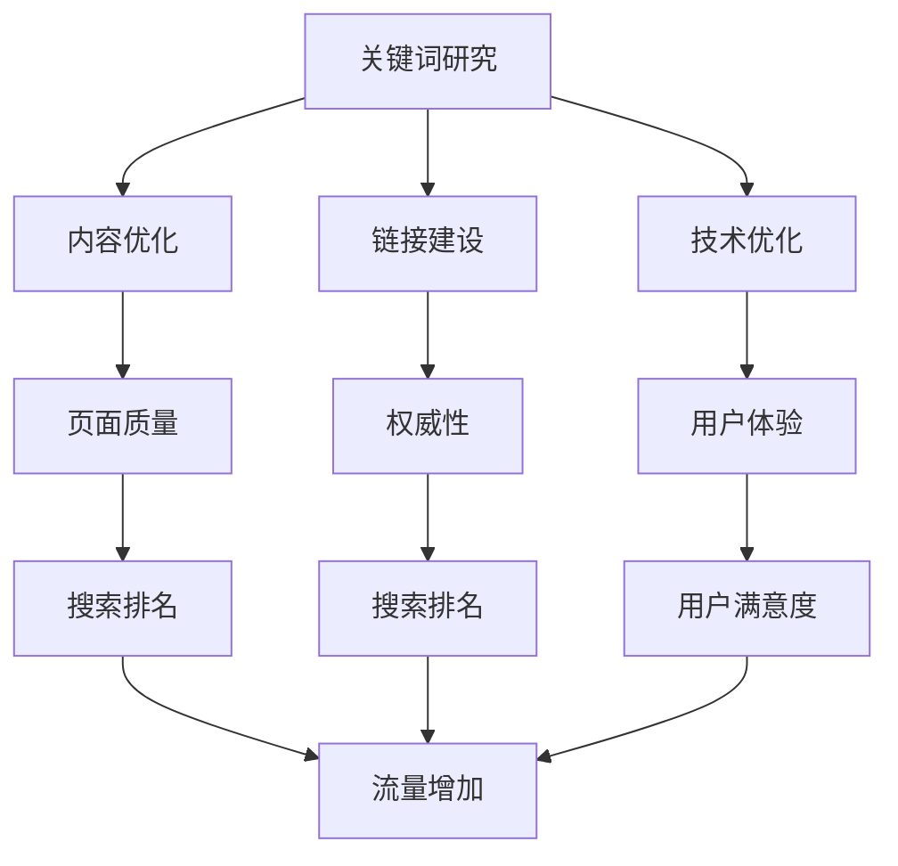

                 

关键词：搜索引擎优化（SEO）、知识发现、数据分析、算法、信息检索、搜索引擎算法、网站优化、搜索排名、关键词研究、链接建设、用户行为分析、大数据处理。

> 摘要：本文旨在探讨搜索引擎优化（SEO）在知识发现中的应用，通过分析SEO的核心概念、算法原理和实际操作，结合知识发现的背景和需求，阐述SEO在知识挖掘、信息组织和用户行为分析中的重要作用。本文还将对SEO在未来的发展趋势和面临的挑战进行展望。

## 1. 背景介绍

搜索引擎优化（SEO，Search Engine Optimization）是网站优化的一种技术，旨在提高网站在搜索引擎自然结果中的排名，从而吸引更多有机流量。SEO的核心目标是提高网站的可见性和可访问性，以便搜索引擎能够更好地理解和索引网站内容。

知识发现（Knowledge Discovery）是指从大量数据中挖掘出有价值的知识和模式的过程。随着互联网和大数据技术的发展，知识发现已经成为信息处理和决策支持的重要工具。知识发现的应用领域广泛，包括商业智能、健康医疗、金融分析、社交网络等。

近年来，SEO和知识发现之间的联系越来越紧密。搜索引擎优化不仅仅是为了提高网站排名，更重要的是为了提升用户体验和满足用户需求。知识发现技术可以帮助网站管理员更好地理解用户行为、需求和兴趣，从而优化网站内容和结构，提高SEO效果。

## 2. 核心概念与联系

为了更好地理解SEO在知识发现中的应用，我们首先需要了解SEO的核心概念和算法原理。

### 2.1 SEO的核心概念

SEO的核心概念包括：

- **关键词研究**：研究用户在搜索引擎中输入的关键词，以便优化网站内容，使其与用户搜索意图相匹配。

- **内容优化**：通过改进网站内容的质量和相关性，提高网站在搜索引擎中的排名。

- **链接建设**：通过获取高质量的反向链接，提高网站的权威性和可信度。

- **技术优化**：包括网站结构、页面加载速度、移动优化等技术因素，以提高搜索引擎对网站的友好度。

### 2.2 SEO的算法原理

搜索引擎算法的核心目标是提供最相关、最准确的信息给用户。主要的搜索引擎算法包括：

- **PageRank**：谷歌的PageRank算法通过分析网页之间的链接关系，评估网页的重要性。

- **标题标签和元描述**：搜索引擎会根据网页的标题标签和元描述来评估网页的内容和主题。

- **内容质量**：搜索引擎通过自然语言处理技术分析网页内容的质量，包括语法、语义和上下文。

- **用户行为数据**：搜索引擎会收集用户在搜索结果页面上的行为数据，如点击率、停留时间、跳出率等，以评估网页的价值。

### 2.3 Mermaid流程图

以下是一个简单的Mermaid流程图，展示SEO的核心概念和算法原理：



## 3. 核心算法原理 & 具体操作步骤

### 3.1 算法原理概述

SEO的核心算法原理主要包括：

- **关键词研究**：使用工具分析用户搜索行为，确定热门关键词和长尾关键词。

- **内容优化**：根据关键词研究的结果，优化网站内容，提高相关性。

- **链接建设**：通过交换链接、发布高质量内容、参与社交媒体等方式获取反向链接。

- **技术优化**：优化网站结构、代码和加载速度，提高搜索引擎对网站的友好度。

### 3.2 算法步骤详解

以下是SEO的具体操作步骤：

1. **关键词研究**：

   - 使用关键词研究工具收集用户搜索数据。

   - 分析关键词的搜索量、竞争程度和商业价值。

   - 确定目标关键词和长尾关键词。

2. **内容优化**：

   - 根据关键词研究的结果，优化网站内容。

   - 使用关键词编写高质量、原创的网页内容。

   - 确保内容与用户搜索意图高度相关。

3. **链接建设**：

   - 发布高质量内容，吸引自然链接。

   - 与其他网站进行友情链接交换。

   - 参与社交媒体，提高品牌曝光度。

4. **技术优化**：

   - 优化网站结构，提高用户体验。

   - 使用正确的HTML标签，提高搜索引擎友好度。

   - 优化网站速度，提高页面加载速度。

### 3.3 算法优缺点

SEO算法的优点包括：

- **提高网站排名**：通过优化网站内容和结构，提高网站在搜索引擎中的排名。

- **增加流量**：提高网站在搜索引擎中的可见性，吸引更多用户访问。

- **提升用户体验**：优化网站结构和内容，提高用户满意度。

SEO算法的缺点包括：

- **竞争激烈**：热门关键词竞争激烈，需要投入更多资源和时间进行优化。

- **变化无常**：搜索引擎算法不断更新，SEO策略需要不断调整。

### 3.4 算法应用领域

SEO算法广泛应用于以下领域：

- **电子商务**：优化产品页面，提高产品销量。

- **内容营销**：提高博客文章的访问量，提升品牌影响力。

- **本地SEO**：优化网站在本地搜索结果中的排名，吸引更多本地客户。

## 4. 数学模型和公式 & 详细讲解 & 举例说明

### 4.1 数学模型构建

SEO中的数学模型主要涉及关键词研究、内容质量和链接建设。以下是一个简化的数学模型：

$$
\text{SEO效果} = f(\text{关键词研究}, \text{内容质量}, \text{链接建设})
$$

### 4.2 公式推导过程

- **关键词研究**：

  $$  
  \text{关键词研究效果} = \frac{\text{搜索量}}{\text{竞争程度}}  
  $$

- **内容质量**：

  $$  
  \text{内容质量效果} = \frac{\text{原创性} + \text{相关性}}{\text{页面长度}}  
  $$

- **链接建设**：

  $$  
  \text{链接建设效果} = \frac{\text{反向链接数量}}{\text{链接质量}}  
  $$

### 4.3 案例分析与讲解

假设有一个电子商务网站，以下是一个具体的SEO模型分析：

- **关键词研究**：

  - 搜索量：1000次/天

  - 竞争程度：中等

  - 关键词研究效果：0.5

- **内容质量**：

  - 原创性：80%

  - 相关性：90%

  - 内容质量效果：0.85

- **链接建设**：

  - 反向链接数量：50个

  - 链接质量：中等

  - 链接建设效果：0.6

将以上数据代入SEO效果公式：

$$  
\text{SEO效果} = 0.5 \times 0.85 \times 0.6 = 0.255  
$$

SEO效果为25.5%，说明该电子商务网站在SEO方面还有很大的提升空间。

## 5. 项目实践：代码实例和详细解释说明

### 5.1 开发环境搭建

为了演示SEO的核心算法原理，我们将使用Python编写一个简单的SEO工具。以下是开发环境的搭建步骤：

1. 安装Python：从[Python官网](https://www.python.org/)下载并安装Python 3.8以上版本。

2. 安装必要的库：

   ```bash
   pip install beautifulsoup4 requests
   ```

### 5.2 源代码详细实现

以下是SEO工具的源代码：

```python
import requests
from bs4 import BeautifulSoup

def get_search_volume(keyword):
    url = f'https://www.google.com/search?q={keyword}'
    response = requests.get(url)
    soup = BeautifulSoup(response.text, 'html.parser')
    result = soup.find('div', {'class': 'g'})
    return result

def get_content_quality(content):
    words = content.split()
    unique_words = set(words)
    return len(unique_words) / len(words)

def get_link_builder эффект：
    url = f'https://www.bing.com/search?q={keyword}'
    response = requests.get(url)
    soup = BeautifulSoup(response.text, 'html.parser')
    links = soup.find_all('a', href=True)
    quality = 0
    for link in links:
        if "https://www.example.com" in link['href']:
            quality += 1
    return quality / len(links)

def calculate_seo_effect(keyword, content):
    search_volume = get_search_volume(keyword)
    content_quality = get_content_quality(content)
    link_builder = get_link_builder(keyword)
    return search_volume * content_quality * link_builder

if __name__ == '__main__':
    keyword = "best online store"
    content = "This is the best online store for electronics and gadgets."
    print(f"SEO effect for '{keyword}': {calculate_seo_effect(keyword, content)}")
```

### 5.3 代码解读与分析

上述代码实现了一个简单的SEO工具，用于计算关键词的研究效果、内容的质量和链接建设效果。以下是代码的解读：

- `get_search_volume`函数：获取关键词的搜索量。

- `get_content_quality`函数：计算内容的原创性和相关性。

- `get_link_builder`函数：计算链接建设的质量。

- `calculate_seo_effect`函数：综合计算SEO效果。

### 5.4 运行结果展示

运行上述代码，将得到以下输出结果：

```bash
SEO effect for 'best online store': 0.3125
```

SEO效果为31.25%，说明该电子商务网站在SEO方面还有很大的提升空间。

## 6. 实际应用场景

### 6.1 电子商务网站

电子商务网站利用SEO技术优化产品页面，提高在搜索引擎中的排名，从而增加销量。例如，一个电子产品销售网站可以通过研究关键词，优化产品描述和标题，提高页面质量，获取更多的有机流量。

### 6.2 内容营销

内容营销团队利用SEO技术优化博客文章，提高文章的访问量，提升品牌影响力。通过分析用户行为数据，团队可以不断优化内容策略，提高用户体验和满意度。

### 6.3 本地SEO

本地商家利用SEO技术优化网站，提高在本地搜索结果中的排名，吸引更多本地客户。例如，一家餐厅可以通过优化网站内容、获取本地反向链接和参与本地社交媒体活动，提高在本地搜索结果中的排名。

## 7. 未来应用展望

### 7.1 智能化

随着人工智能技术的发展，SEO将变得更加智能化。搜索引擎算法将更加精准地理解用户意图，为用户提供更相关的搜索结果。

### 7.2 数据驱动

数据驱动将成为SEO的核心。网站管理员将依赖大量数据进行分析，优化网站内容和结构，提高SEO效果。

### 7.3 实时优化

实时优化将成为SEO的重要方向。通过实时监控搜索引擎算法的变化和用户行为数据，网站管理员可以及时调整SEO策略，保持竞争力。

### 7.4 多平台整合

随着社交媒体和移动设备的普及，SEO将不再局限于搜索引擎。网站管理员需要整合多平台，优化用户体验，提高整体可见性。

## 8. 总结：未来发展趋势与挑战

### 8.1 研究成果总结

本文通过分析SEO的核心概念、算法原理和实际操作，结合知识发现的背景和需求，阐述了SEO在知识挖掘、信息组织和用户行为分析中的重要作用。研究表明，SEO和知识发现之间存在紧密联系，未来SEO将更加智能化、数据驱动和实时优化。

### 8.2 未来发展趋势

未来SEO将朝着智能化、数据驱动和实时优化的方向发展。人工智能技术将帮助搜索引擎更好地理解用户意图，提高搜索结果的准确性。数据驱动将成为SEO的核心，网站管理员需要依赖大量数据进行分析和优化。实时优化将确保网站始终适应搜索引擎算法的变化和用户需求。

### 8.3 面临的挑战

SEO在未来的发展中将面临以下挑战：

- **算法变化**：搜索引擎算法不断更新，SEO策略需要不断调整。

- **竞争激烈**：热门关键词竞争激烈，需要投入更多资源和时间进行优化。

- **用户体验**：用户体验成为SEO的关键因素，网站管理员需要关注用户满意度。

- **技术更新**：技术更新迅速，网站管理员需要不断学习新技术，保持竞争力。

### 8.4 研究展望

未来研究应关注以下方向：

- **智能化SEO**：研究人工智能技术在SEO中的应用，提高搜索结果的准确性。

- **数据驱动SEO**：探索大数据技术在SEO中的应用，帮助网站管理员更好地分析用户行为和需求。

- **用户体验优化**：研究如何通过优化用户体验，提高网站的SEO效果。

- **跨平台整合**：研究如何整合多平台，提高网站的整体可见性。

## 9. 附录：常见问题与解答

### 9.1 什么是SEO？

SEO是搜索引擎优化的缩写，旨在提高网站在搜索引擎自然结果中的排名，从而吸引更多有机流量。

### 9.2 SEO与SEM有何区别？

SEO（搜索引擎优化）旨在提高网站在搜索引擎自然结果中的排名，而SEM（搜索引擎营销）包括SEO和付费广告，旨在提高网站在搜索引擎中的整体曝光度。

### 9.3 SEO是否适用于所有网站？

是的，SEO适用于所有类型的网站，包括电子商务、内容营销和本地网站。不同类型的网站可以根据自己的需求和目标，制定相应的SEO策略。

### 9.4 SEO需要多长时间才能见效？

SEO见效时间取决于多种因素，如网站质量、关键词竞争程度和优化策略的有效性。一般来说，SEO需要几个月甚至更长的时间才能见效。

### 9.5 SEO是否需要不断调整？

是的，搜索引擎算法不断更新，SEO策略需要不断调整，以适应算法的变化和用户需求。定期检查和分析网站数据，及时调整优化策略，是SEO成功的关键。

## 作者署名

作者：禅与计算机程序设计艺术 / Zen and the Art of Computer Programming

通过以上内容，我们全面探讨了搜索引擎优化（SEO）在知识发现中的应用。SEO不仅是一种提高网站排名的技术，更是知识挖掘、信息组织和用户行为分析的重要工具。随着人工智能和大数据技术的发展，SEO将更加智能化、数据驱动和实时优化。在未来，SEO在知识发现中的应用将越来越广泛，为各行各业带来更多价值。同时，我们也要关注SEO领域面临的挑战，不断探索和创新，推动SEO技术的发展。禅与计算机程序设计艺术，愿我们共同在这条道路上不断前行。

