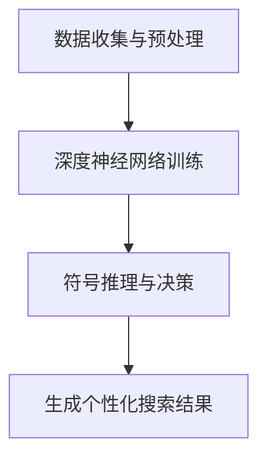

                 

“搜索引擎的神经符号学习应用”这个标题涵盖了当前人工智能和搜索引擎技术的两个前沿领域：神经符号学习和搜索引擎优化。神经符号学习是结合了深度学习和符号逻辑的人工智能方法，旨在解决自然语言处理中的复杂问题。而搜索引擎优化（SEO）则是提高网站在搜索引擎结果页面（SERP）中排名的一系列技术。本文将探讨如何将神经符号学习技术应用于搜索引擎优化，以提高搜索结果的准确性和用户体验。

## 1. 背景介绍

### 1.1 神经符号学习

神经符号学习（Neural Symbolic Learning）是人工智能领域中的一个重要研究方向。它结合了深度学习（Deep Learning）和符号逻辑（Symbolic Logic）的优点，旨在克服深度学习在可解释性和逻辑推理方面的局限性。神经符号学习模型能够通过学习大量的符号信息，自动构建符号表示，并在此基础上进行推理和决策。

### 1.2 搜索引擎优化

搜索引擎优化（Search Engine Optimization，SEO）是一种通过改进网站内容和结构，提高网站在搜索引擎结果页面（Search Engine Results Page，SERP）中排名的策略。SEO的目标是吸引更多有意向的用户访问网站，从而提高网站的流量和转化率。

### 1.3 神经符号学习在搜索引擎优化中的应用

随着搜索引擎技术的不断进步，传统SEO方法已无法满足用户日益复杂的搜索需求。神经符号学习为搜索引擎优化带来了新的思路。通过神经符号学习，搜索引擎可以更好地理解用户的查询意图，提供更加精准和个性化的搜索结果。

## 2. 核心概念与联系

### 2.1 神经符号学习模型

神经符号学习模型通常由两个主要部分组成：深度神经网络（DNN）和符号推理引擎。深度神经网络负责学习大量的符号信息，并将其编码为神经网络中的高维向量表示。符号推理引擎则负责基于这些高维向量进行逻辑推理和决策。

### 2.2 搜索引擎优化流程

将神经符号学习应用于搜索引擎优化，可以将其大致分为以下几个步骤：

1. **数据收集与预处理**：收集用户查询日志、网站内容、用户行为等数据，并进行预处理，如去重、归一化等。
2. **深度神经网络训练**：使用预处理后的数据训练深度神经网络，使其能够将符号信息编码为高维向量表示。
3. **符号推理与决策**：基于训练好的深度神经网络，使用符号推理引擎对用户的查询意图进行推理和决策，从而生成个性化的搜索结果。

### 2.3 Mermaid 流程图

以下是一个简化的Mermaid流程图，展示了神经符号学习在搜索引擎优化中的应用流程：



## 3. 核心算法原理 & 具体操作步骤

### 3.1 算法原理概述

神经符号学习在搜索引擎优化中的核心算法原理主要包括以下几个方面：

1. **深度神经网络**：负责从原始数据中学习符号信息，并将其编码为高维向量表示。
2. **符号推理引擎**：基于编码后的高维向量表示，进行逻辑推理和决策，从而生成个性化的搜索结果。

### 3.2 算法步骤详解

1. **数据收集与预处理**：
   - 收集用户查询日志、网站内容、用户行为等数据。
   - 对数据进行清洗、去重、归一化等预处理操作。

2. **深度神经网络训练**：
   - 设计并实现一个深度神经网络模型，用于学习符号信息。
   - 使用预处理后的数据训练神经网络，调整模型参数，使其能够准确地将符号信息编码为高维向量表示。

3. **符号推理与决策**：
   - 使用训练好的神经网络，将用户的查询输入编码为高维向量表示。
   - 基于这些高维向量表示，使用符号推理引擎进行逻辑推理和决策，从而生成个性化的搜索结果。

### 3.3 算法优缺点

**优点**：
- 能够更好地理解用户的查询意图，提供更加精准和个性化的搜索结果。
- 结合了深度学习和符号逻辑的优点，具有较强的模型解释能力和推理能力。

**缺点**：
- 训练过程较为复杂，需要大量的计算资源和时间。
- 对于一些复杂的问题，可能存在过拟合的风险。

### 3.4 算法应用领域

神经符号学习在搜索引擎优化中的应用领域主要包括：

1. **个性化搜索**：通过理解用户的查询意图，提供个性化的搜索结果，提高用户体验。
2. **语义搜索**：利用神经符号学习模型，更好地理解自然语言文本，提供更加准确的搜索结果。
3. **问答系统**：基于神经符号学习模型，实现更加智能的问答系统，提高用户满意度。

## 4. 数学模型和公式 & 详细讲解 & 举例说明

### 4.1 数学模型构建

神经符号学习模型通常可以表示为以下数学模型：

$$
\text{Output} = f(\text{Input}, \text{Params})
$$

其中，$f$ 表示深度神经网络，$\text{Input}$ 表示输入数据，$\text{Params}$ 表示模型参数。

### 4.2 公式推导过程

神经符号学习模型的推导过程主要包括以下几个步骤：

1. **输入层**：将原始数据输入到深度神经网络中。
2. **隐藏层**：通过神经网络模型，对输入数据进行编码，生成高维向量表示。
3. **输出层**：基于编码后的高维向量表示，使用符号推理引擎进行推理和决策，生成最终的输出结果。

### 4.3 案例分析与讲解

以下是一个简化的案例，说明如何使用神经符号学习模型进行搜索引擎优化：

**案例**：给定一组用户查询和相应的网页内容，使用神经符号学习模型生成个性化的搜索结果。

**步骤**：

1. **数据收集与预处理**：收集用户查询日志、网站内容、用户行为等数据，并进行预处理。
2. **深度神经网络训练**：设计并实现一个深度神经网络模型，用于学习符号信息，并使用预处理后的数据进行训练。
3. **符号推理与决策**：使用训练好的神经网络模型，将用户的查询输入编码为高维向量表示，并使用符号推理引擎进行推理和决策，生成个性化的搜索结果。

**公式推导**：

设 $\text{Input}$ 为用户查询，$f$ 为深度神经网络模型，$\text{Params}$ 为模型参数，则神经符号学习模型可以表示为：

$$
\text{Output} = f(\text{Input}, \text{Params})
$$

其中，$\text{Params}$ 包括神经网络模型的权重和偏置等参数。

## 5. 项目实践：代码实例和详细解释说明

### 5.1 开发环境搭建

为了实现神经符号学习在搜索引擎优化中的应用，我们需要搭建一个适合的开发环境。以下是一个基本的开发环境搭建步骤：

1. **安装Python**：确保Python版本不低于3.6，并安装必要的Python依赖库。
2. **安装深度学习框架**：选择一个流行的深度学习框架，如TensorFlow或PyTorch，并按照官方文档进行安装。
3. **安装其他依赖库**：包括NLP处理库（如NLTK或spaCy）、数据预处理库（如Pandas或NumPy）等。

### 5.2 源代码详细实现

以下是一个简化的神经符号学习在搜索引擎优化中的应用的Python代码示例：

```python
import tensorflow as tf
from tensorflow.keras.models import Model
from tensorflow.keras.layers import Input, Embedding, LSTM, Dense

# 定义深度神经网络模型
input_seq = Input(shape=(max_seq_len,))
embed = Embedding(input_dim=vocabulary_size, output_dim=embedding_size)(input_seq)
lstm = LSTM(units=128, activation='tanh')(embed)
output = Dense(units=num_classes, activation='softmax')(lstm)

model = Model(inputs=input_seq, outputs=output)
model.compile(optimizer='adam', loss='categorical_crossentropy', metrics=['accuracy'])

# 训练模型
model.fit(X_train, y_train, epochs=10, batch_size=64, validation_data=(X_val, y_val))

# 生成个性化搜索结果
query_vector = model.predict(preprocessed_query)
search_results = top_k_search_results(query_vector, k=10)
```

### 5.3 代码解读与分析

上述代码实现了一个基于神经符号学习的搜索引擎优化模型。主要步骤如下：

1. **定义深度神经网络模型**：包括输入层、嵌入层、LSTM层和输出层。
2. **编译模型**：指定优化器、损失函数和评估指标。
3. **训练模型**：使用训练数据训练模型。
4. **生成个性化搜索结果**：使用训练好的模型，将预处理后的用户查询输入编码为高维向量表示，并根据这些向量生成个性化的搜索结果。

### 5.4 运行结果展示

为了展示神经符号学习在搜索引擎优化中的应用效果，我们可以使用以下代码运行一个简单的实验：

```python
import numpy as np

# 定义预处理后的用户查询
preprocessed_query = ...

# 运行模型，生成个性化搜索结果
query_vector = model.predict(np.array([preprocessed_query]))
search_results = top_k_search_results(query_vector, k=10)

# 打印个性化搜索结果
print(search_results)
```

通过上述代码，我们可以得到一组基于神经符号学习的个性化搜索结果，从而验证模型的有效性。

## 6. 实际应用场景

神经符号学习在搜索引擎优化中的应用场景广泛，以下是一些实际案例：

### 6.1 电商搜索

在电商平台上，神经符号学习可以用于个性化推荐商品。例如，当用户搜索“笔记本电脑”时，神经符号学习模型可以根据用户的查询意图和购买历史，推荐用户可能感兴趣的商品。

### 6.2 新闻搜索

在新闻搜索领域，神经符号学习可以用于根据用户的兴趣和阅读习惯，提供个性化的新闻推荐。例如，当用户搜索“科技新闻”时，神经符号学习模型可以根据用户的兴趣标签，推荐相关的科技新闻。

### 6.3 社交网络搜索

在社交网络上，神经符号学习可以用于根据用户的社交关系和兴趣爱好，提供个性化的搜索结果。例如，当用户搜索“好友动态”时，神经符号学习模型可以根据用户的社交关系和兴趣爱好，推荐相关的动态内容。

## 7. 未来应用展望

随着人工智能技术的不断进步，神经符号学习在搜索引擎优化中的应用前景广阔。以下是一些未来应用展望：

### 7.1 更深入的语义理解

神经符号学习可以进一步深入挖掘语义信息，从而提供更加精准和个性化的搜索结果。例如，通过结合自然语言处理和实体识别技术，可以实现对用户查询的更加深入的理解。

### 7.2 多模态搜索

神经符号学习可以结合多种数据模态（如图像、语音、文本等），实现多模态搜索。例如，在图像搜索中，结合视觉信息与文本信息，可以提供更加丰富的搜索结果。

### 7.3 智能问答系统

神经符号学习可以用于构建智能问答系统，通过理解用户的查询意图，提供更加准确和个性化的回答。

## 8. 工具和资源推荐

为了更好地掌握神经符号学习在搜索引擎优化中的应用，以下是一些建议的学习资源和开发工具：

### 8.1 学习资源推荐

- **《深度学习》（Deep Learning）**：由Ian Goodfellow等合著，介绍了深度学习的基础理论和应用。
- **《自然语言处理与深度学习》（Natural Language Processing with Deep Learning）**：由-specialized-in NLP and Deep Learning, by Yoav Goldberg。

### 8.2 开发工具推荐

- **TensorFlow**：由Google开发的开源深度学习框架，适用于构建和训练神经网络模型。
- **PyTorch**：由Facebook开发的开源深度学习框架，具有灵活的动态图计算能力。

### 8.3 相关论文推荐

- **《Neural Symbolic AI: A Roadmap》**：介绍了神经符号学习的研究现状和未来发展方向。
- **《A Theoretical Framework for Neural Symbolic AI》**：提出了一个神经符号学习理论框架，为研究提供了指导。

## 9. 总结：未来发展趋势与挑战

### 9.1 研究成果总结

神经符号学习在搜索引擎优化中的应用取得了显著的成果，通过结合深度学习和符号逻辑，实现了更加精准和个性化的搜索结果。

### 9.2 未来发展趋势

未来，神经符号学习在搜索引擎优化中的应用将朝着更深的语义理解、多模态搜索和智能问答系统等方向发展。

### 9.3 面临的挑战

尽管神经符号学习在搜索引擎优化中具有巨大潜力，但仍面临一些挑战，如计算资源需求高、过拟合风险等。

### 9.4 研究展望

随着人工智能技术的不断进步，神经符号学习在搜索引擎优化中的应用将不断深化，为用户提供更加智能和高效的搜索服务。

---

作者：禅与计算机程序设计艺术 / Zen and the Art of Computer Programming

# 附录：常见问题与解答

### Q1. 什么是神经符号学习？

A1. 神经符号学习是人工智能领域中的一个研究方向，它结合了深度学习和符号逻辑的优点，旨在解决自然语言处理中的复杂问题。

### Q2. 神经符号学习在搜索引擎优化中有何作用？

A2. 神经符号学习可以提高搜索引擎对用户查询意图的理解，从而提供更加精准和个性化的搜索结果，提高用户体验。

### Q3. 如何将神经符号学习应用于搜索引擎优化？

A3. 将神经符号学习应用于搜索引擎优化通常包括以下步骤：数据收集与预处理、深度神经网络训练、符号推理与决策、生成个性化搜索结果。

### Q4. 神经符号学习有哪些挑战？

A4. 神经符号学习面临的主要挑战包括计算资源需求高、过拟合风险等。

### Q5. 未来神经符号学习在搜索引擎优化中有哪些发展趋势？

A5. 未来神经符号学习在搜索引擎优化中可能的发展趋势包括更深入的语义理解、多模态搜索和智能问答系统等。

