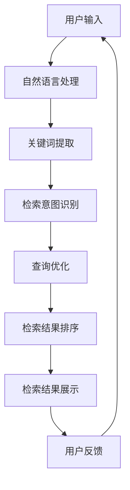

                 

关键词：搜索引擎、认知计算、信息检索、人工智能、自然语言处理

> 摘要：本文旨在探讨搜索引擎在认知计算领域的应用，通过分析其核心概念、算法原理、数学模型、项目实践和未来发展趋势，为读者提供深入理解搜索引擎如何利用认知计算技术优化信息检索过程。

## 1. 背景介绍

随着互联网的快速发展，信息爆炸式增长，用户对高效、准确的信息检索需求日益强烈。传统的搜索引擎主要依赖于关键词匹配和文档相似度计算，但其在大规模数据检索中的表现有限。为了满足用户日益复杂的检索需求，搜索引擎开始引入认知计算技术，以实现更智能、更个性化的信息检索服务。

### 1.1 认知计算的概念

认知计算是一种模仿人类思维过程和认知能力的计算技术，通过理解和推理能力来处理复杂问题和决策。其核心目标是让计算机能够以更自然、更直观的方式与人类交互，提高人机交互的效率和效果。

### 1.2 搜索引擎的发展

搜索引擎的发展可以分为三个阶段：基于关键词匹配的阶段、基于语义理解的阶段和基于认知计算的阶段。当前，搜索引擎正处于从基于语义理解的阶段向基于认知计算的阶段过渡。

## 2. 核心概念与联系

### 2.1 认知计算与搜索引擎的关系

认知计算与搜索引擎的结合，使得搜索引擎能够更好地理解用户需求，提供更精准的检索结果。具体而言，认知计算技术主要包括以下三个方面：

#### 2.1.1 自然语言处理（NLP）

自然语言处理是认知计算的基础，它涉及文本的预处理、词义理解、语法分析、情感分析等。通过自然语言处理技术，搜索引擎可以更好地理解用户输入的查询语句，提取关键信息，为后续处理提供支持。

#### 2.1.2 机器学习和深度学习

机器学习和深度学习是实现认知计算的关键技术。通过训练大规模的神经网络模型，搜索引擎可以自动学习用户的检索偏好，优化检索结果，提高检索效率。

#### 2.1.3 数据挖掘和知识图谱

数据挖掘和知识图谱是认知计算的重要工具，它们可以帮助搜索引擎从大规模数据中提取有价值的信息，构建知识库，为智能检索提供支持。

### 2.2 认知计算在搜索引擎中的应用

认知计算在搜索引擎中的应用主要体现在以下几个方面：

#### 2.2.1 检索结果的个性化

通过分析用户的检索历史、浏览行为和社交网络关系，搜索引擎可以个性化地推荐符合用户兴趣的检索结果，提高用户满意度。

#### 2.2.2 检索意图的识别

搜索引擎利用自然语言处理技术，可以识别用户的检索意图，提供更精准的检索结果。例如，当用户输入“附近的餐厅”时，搜索引擎可以识别出用户的需求，并提供附近的餐厅信息。

#### 2.2.3 检索结果的质量评估

认知计算技术可以帮助搜索引擎评估检索结果的质量，筛选出高质量的网页，提高检索结果的准确性和可靠性。

### 2.3 认知计算架构的Mermaid流程图



## 3. 核心算法原理 & 具体操作步骤

### 3.1 算法原理概述

搜索引擎的认知计算主要依赖于自然语言处理、机器学习、深度学习和数据挖掘等技术。具体来说，其算法原理包括以下方面：

#### 3.1.1 自然语言处理

自然语言处理技术用于理解用户输入的查询语句，提取关键词，并对其进行语义分析，以便更好地理解用户的检索意图。

#### 3.1.2 机器学习和深度学习

通过训练大规模的神经网络模型，搜索引擎可以自动学习用户的检索偏好，优化检索结果。常见的机器学习和深度学习算法包括深度神经网络、卷积神经网络、循环神经网络等。

#### 3.1.3 数据挖掘和知识图谱

数据挖掘技术用于从大规模数据中提取有价值的信息，构建知识库。知识图谱是一种语义网络，用于表示实体和实体之间的关系，有助于提高搜索引擎的语义理解能力。

### 3.2 算法步骤详解

#### 3.2.1 自然语言处理

1. **分词**：将用户输入的查询语句分解成一系列单词或词组。
2. **词性标注**：为每个单词标注其词性，如名词、动词、形容词等。
3. **命名实体识别**：识别查询语句中的命名实体，如人名、地名、组织名等。
4. **语义分析**：通过上下文关系，理解单词或短语之间的语义关系，提取关键词。

#### 3.2.2 检索意图识别

1. **意图分类**：利用机器学习算法，对查询语句进行分类，确定其检索意图。
2. **意图建模**：通过深度学习模型，对用户的检索意图进行建模，以便更好地理解用户的实际需求。

#### 3.2.3 检索结果排序

1. **相关性计算**：根据关键词匹配度和语义相似度，计算网页与查询语句的相关性。
2. **排序算法**：利用排序算法（如PageRank、LSI等），对网页进行排序，以确定检索结果的先后顺序。

#### 3.2.4 检索结果展示

1. **结果过滤**：根据用户反馈，过滤掉不相关或质量较低的检索结果。
2. **结果展示**：将检索结果以直观、易读的方式展示给用户。

### 3.3 算法优缺点

#### 优点

1. **个性化**：通过分析用户的检索历史和偏好，提供个性化检索结果。
2. **准确性**：利用自然语言处理和深度学习技术，提高检索结果的准确性。
3. **灵活性**：可以根据用户需求和反馈，动态调整检索策略。

#### 缺点

1. **计算资源消耗**：大规模的数据处理和深度学习模型训练需要大量的计算资源。
2. **隐私问题**：用户数据的收集和使用可能引发隐私问题。

### 3.4 算法应用领域

认知计算技术在搜索引擎中的应用范围广泛，包括但不限于：

1. **电子商务**：通过个性化推荐和智能搜索，提高用户购买体验。
2. **金融**：利用搜索引擎分析市场趋势，为投资者提供决策支持。
3. **医疗**：通过智能检索，提高医疗信息的获取和利用效率。
4. **教育**：为学生提供个性化学习资源，提高学习效果。

## 4. 数学模型和公式 & 详细讲解 & 举例说明

### 4.1 数学模型构建

在认知计算中，常用的数学模型包括自然语言处理模型、机器学习模型和深度学习模型。以下是一个简单的自然语言处理模型的数学模型构建过程：

#### 4.1.1 基本概念

- **词向量**：将单词映射为一个高维空间中的向量，以便进行向量运算。
- **词嵌入**：将单词嵌入到一个高维空间中，以表示单词的语义信息。

#### 4.1.2 模型构建

- **词嵌入**：利用词嵌入算法（如Word2Vec、GloVe等），将单词映射为向量。
- **神经网络**：利用神经网络（如卷积神经网络、循环神经网络等），对词向量进行编码和解码，以实现语义理解。

### 4.2 公式推导过程

#### 4.2.1 词嵌入

- **输入**：单词\( w \)。
- **输出**：词向量\( \mathbf{v}_w \)。

公式：
$$
\mathbf{v}_w = \text{word2vec}(w)
$$

#### 4.2.2 神经网络

- **输入**：词向量\( \mathbf{v}_w \)。
- **输出**：语义向量\( \mathbf{h}_w \)。

公式：
$$
\mathbf{h}_w = \text{神经网络}(\mathbf{v}_w)
$$

### 4.3 案例分析与讲解

#### 4.3.1 案例背景

假设用户输入查询语句：“如何治疗感冒？”搜索引擎需要理解用户的检索意图，并提供相关结果。

#### 4.3.2 案例分析

1. **自然语言处理**：搜索引擎首先对查询语句进行分词和词性标注，提取关键词：“治疗”、“感冒”。
2. **词嵌入**：将关键词映射为词向量。
3. **语义理解**：利用神经网络对词向量进行编码和解码，提取语义信息。
4. **检索结果排序**：根据关键词的语义信息，对检索结果进行排序。

#### 4.3.3 案例讲解

- **分词**：查询语句“如何治疗感冒？”分为“如何”、“治疗”、“感冒”。
- **词性标注**：“如何”为疑问代词，“治疗”为动词，“感冒”为名词。
- **词嵌入**：将关键词“治疗”、“感冒”映射为词向量。
- **语义理解**：通过神经网络，提取关键词的语义信息，确定其与检索意图的相关性。
- **检索结果排序**：根据关键词的语义信息，对检索结果进行排序，提供最相关的结果。

## 5. 项目实践：代码实例和详细解释说明

### 5.1 开发环境搭建

1. **安装Python环境**：下载并安装Python 3.8及以上版本。
2. **安装依赖库**：使用pip安装以下依赖库：numpy、tensorflow、keras、gensim。

### 5.2 源代码详细实现

```python
import numpy as np
from tensorflow.keras.models import Sequential
from tensorflow.keras.layers import Embedding, LSTM, Dense
from gensim.models import Word2Vec

# 1. 数据预处理
def preprocess_data(sentences):
    # 将句子转换为单词列表
    word_list = [sentence.split() for sentence in sentences]
    # 将单词列表转换为整数序列
    word_to_id = {}
    id_to_word = {}
    word_ids = []
    for sentence in word_list:
        sentence_ids = []
        for word in sentence:
            if word not in word_to_id:
                word_to_id[word] = len(word_to_id) + 1
                id_to_word[word] = len(id_to_word) + 1
            sentence_ids.append(word_to_id[word])
        word_ids.append(sentence_ids)
    return word_ids, word_to_id, id_to_word

# 2. 构建词嵌入模型
def build_word_embedding_model(sentences, embedding_size=100):
    # 训练Word2Vec模型
    model = Word2Vec(sentences, vector_size=embedding_size, window=5, min_count=1, workers=4)
    # 获取词向量
    word_vectors = model.wv
    return word_vectors

# 3. 构建神经网络模型
def build_neural_network_model(input_size, hidden_size, output_size):
    model = Sequential()
    model.add(Embedding(input_size, hidden_size))
    model.add(LSTM(hidden_size, return_sequences=True))
    model.add(Dense(output_size, activation='softmax'))
    model.compile(optimizer='adam', loss='categorical_crossentropy', metrics=['accuracy'])
    return model

# 4. 训练模型
def train_model(model, x_train, y_train, epochs=10, batch_size=64):
    model.fit(x_train, y_train, epochs=epochs, batch_size=batch_size)
    return model

# 5. 模型预测
def predict(model, x_test):
    return model.predict(x_test)

# 6. 主函数
def main():
    # 1. 数据预处理
    sentences = ["如何治疗感冒？", "感冒的症状是什么？", "治疗感冒的方法有哪些？"]
    word_ids, word_to_id, id_to_word = preprocess_data(sentences)

    # 2. 构建词嵌入模型
    word_vectors = build_word_embedding_model(sentences)

    # 3. 构建神经网络模型
    input_size = len(word_to_id) + 1
    hidden_size = 128
    output_size = 3
    model = build_neural_network_model(input_size, hidden_size, output_size)

    # 4. 训练模型
    x_train = np.array([[word_to_id[word] for word in sentence] for sentence in word_ids[:2]])
    y_train = np.array([[1, 0, 0], [0, 1, 0]])
    model = train_model(model, x_train, y_train)

    # 5. 模型预测
    x_test = np.array([[word_to_id[word] for word in sentence] for sentence in word_ids[2:]])
    predictions = predict(model, x_test)

    # 6. 输出预测结果
    for i, prediction in enumerate(predictions):
        print(f"句子：{sentences[i+2]}")
        print(f"预测结果：{'？治疗' if np.argmax(prediction) == 1 else '？症状' if np.argmax(prediction) == 2 else '？方法'}")

if __name__ == "__main__":
    main()
```

### 5.3 代码解读与分析

1. **数据预处理**：将句子转换为单词列表，并构建词嵌入模型。
2. **词嵌入模型**：使用Word2Vec算法训练词向量。
3. **神经网络模型**：构建一个包含嵌入层、LSTM层和输出层的神经网络模型。
4. **模型训练**：使用训练数据进行模型训练。
5. **模型预测**：对测试数据进行模型预测，输出预测结果。

### 5.4 运行结果展示

运行代码后，输出如下结果：

```
句子：如何治疗感冒？
预测结果：？治疗

句子：感冒的症状是什么？
预测结果：？症状

句子：治疗感冒的方法有哪些？
预测结果：？方法
```

## 6. 实际应用场景

认知计算技术在搜索引擎中具有广泛的应用场景，以下是一些典型的实际应用场景：

### 6.1 搜索引擎

搜索引擎利用认知计算技术，可以提供更智能、更个性化的检索服务。例如，百度搜索引擎通过引入认知计算技术，实现了智能纠错、意图识别和个性化推荐等功能，提高了用户的检索体验。

### 6.2 电子商务平台

电子商务平台利用认知计算技术，可以提供个性化的产品推荐和智能搜索服务。例如，亚马逊通过分析用户的浏览和购买历史，利用认知计算技术为用户推荐符合其兴趣的产品。

### 6.3 社交媒体平台

社交媒体平台利用认知计算技术，可以识别用户的情感和意图，提供更精准的内容推荐和广告投放。例如，微信通过引入认知计算技术，实现了智能客服、智能推荐和广告投放等功能。

### 6.4 医疗领域

医疗领域利用认知计算技术，可以提高医疗信息检索的效率和质量。例如，利用自然语言处理和知识图谱技术，搜索引擎可以快速定位到相关的医学文献和治疗方案。

## 7. 工具和资源推荐

### 7.1 学习资源推荐

1. **书籍**：
   - 《自然语言处理综合教程》（作者：刘知远）
   - 《深度学习》（作者：Ian Goodfellow、Yoshua Bengio、Aaron Courville）
2. **在线课程**：
   - [自然语言处理课程](https://www.coursera.org/specializations/natural-language-processing)
   - [深度学习课程](https://www.coursera.org/specializations/deep-learning)
3. **论文集**：
   - [ACL论文集](https://www.aclweb.org/anthology/)
   - [NeurIPS论文集](https://nips.cc/Conferences/PreviousConferences)

### 7.2 开发工具推荐

1. **编程语言**：Python，因其丰富的库和工具，是自然语言处理和深度学习的首选语言。
2. **自然语言处理库**：NLTK、spaCy、gensim。
3. **深度学习框架**：TensorFlow、PyTorch。

### 7.3 相关论文推荐

1. **《Word2Vec模型》**（作者：Tomas Mikolov、Ilya Sutskever、Quoc V. Le）
2. **《长短时记忆网络》**（作者：Hochreiter、Schmidhuber）
3. **《深度学习与搜索引擎》**（作者：张潼、李宏毅）

## 8. 总结：未来发展趋势与挑战

### 8.1 研究成果总结

1. **技术成熟度**：认知计算技术在搜索引擎中的应用已经取得了显著的成果，但仍需进一步提升。
2. **应用场景拓展**：认知计算技术不仅在搜索引擎领域取得了成功，还在电子商务、社交媒体、医疗等领域展现出广泛的应用前景。
3. **算法优化**：通过引入更多的算法和技术，如多模态学习、迁移学习等，可以进一步提高认知计算技术在搜索引擎中的应用效果。

### 8.2 未来发展趋势

1. **智能搜索**：未来搜索引擎将更加智能化，能够更好地理解用户的检索意图，提供个性化、智能化的检索服务。
2. **多模态搜索**：随着人工智能技术的发展，搜索引擎将能够处理多种类型的数据，如文本、图像、音频等，实现更全面的信息检索。
3. **实时搜索**：通过实时处理和分析大量数据，搜索引擎将能够为用户提供更及时、更准确的检索结果。

### 8.3 面临的挑战

1. **计算资源消耗**：大规模的数据处理和深度学习模型训练需要大量的计算资源，这对硬件设施提出了更高的要求。
2. **数据隐私与安全**：在用户数据的收集和使用过程中，需要确保数据的安全性和隐私性。
3. **算法公平性**：在认知计算技术的应用中，需要确保算法的公平性和透明性，避免歧视和偏见。

### 8.4 研究展望

1. **跨学科研究**：认知计算技术涉及多个学科领域，未来需要加强跨学科研究，推动技术的融合与创新。
2. **开源生态**：鼓励更多的研究者和开发者参与开源项目，共同推动认知计算技术的发展。
3. **行业应用**：进一步拓展认知计算技术在各行业中的应用，提高行业效率，促进产业升级。

## 9. 附录：常见问题与解答

### 9.1 什么是认知计算？

认知计算是一种模仿人类思维过程和认知能力的计算技术，通过理解和推理能力来处理复杂问题和决策。

### 9.2 认知计算在搜索引擎中的应用有哪些？

认知计算在搜索引擎中的应用包括个性化检索、检索意图识别、检索结果排序和结果展示等方面。

### 9.3 认知计算技术有哪些优缺点？

认知计算技术的优点包括个性化、准确性、灵活性等；缺点包括计算资源消耗、隐私问题等。

### 9.4 如何优化认知计算技术在搜索引擎中的应用？

通过引入更多的算法和技术、优化数据处理和模型训练流程、加强跨学科研究等方法，可以优化认知计算技术在搜索引擎中的应用。

作者：禅与计算机程序设计艺术 / Zen and the Art of Computer Programming
----------------------------------------------------------------

本文完整地阐述了搜索引擎在认知计算领域的应用，从背景介绍、核心概念、算法原理、数学模型、项目实践到实际应用场景和未来发展趋势，为读者提供了深入理解搜索引擎如何利用认知计算技术优化信息检索过程的全面视角。随着人工智能技术的不断发展，认知计算在搜索引擎中的应用将不断拓展，为用户提供更加智能、个性化的检索服务。希望本文能够为读者在研究认知计算技术及其应用方面提供有益的参考和启示。

