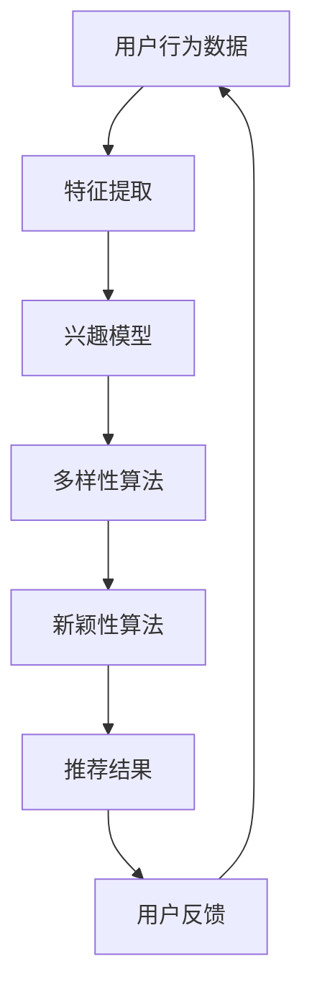

                 

关键词：搜索推荐系统，多样性，新颖性，平衡策略，算法原理，数学模型，代码实例，实际应用，未来展望

> 摘要：本文探讨了搜索推荐系统中多样性与新颖性的平衡策略。通过对核心概念与算法原理的深入剖析，结合数学模型构建和公式推导，本文提出了一套有效的解决方案。同时，通过项目实践和实际应用场景的阐述，为读者提供了实用的代码实例和详细解释说明，为搜索推荐系统的发展提供了新的思路。

## 1. 背景介绍

随着互联网的快速发展，信息爆炸已成为不争的事实。在如此海量的信息中，用户如何快速找到所需的内容成为了关键问题。因此，搜索推荐系统应运而生，通过对用户行为的分析，为用户提供个性化的推荐。然而，推荐系统的多样性和新颖性成为了亟待解决的问题。

多样性（Diversity）指的是推荐结果的多样性，即系统应能够为用户提供风格各异、类型多样的内容，避免单一化和同质化。新颖性（Novelty）则强调推荐结果的创新性，系统应能够捕捉到用户尚未接触到的有趣、独特的资源。

当前，许多推荐系统过于注重用户兴趣的匹配，导致推荐结果单一，缺乏多样性。而新颖性的缺乏则会导致用户产生厌倦感，降低系统的使用价值。因此，如何在搜索推荐系统中实现多样性与新颖性的平衡，成为了学术界和工业界研究的热点。

## 2. 核心概念与联系

### 2.1 多样性与新颖性的定义

多样性（Diversity）指的是推荐结果中不同元素之间的差异性。具体来说，多样性可以通过计算推荐结果中不同元素之间的相似度来实现。新颖性（Novelty）则是指推荐结果与用户历史行为和兴趣的差异性。新颖性可以通过计算推荐结果与用户历史行为和兴趣的余弦相似度来实现。

### 2.2 多样性与新颖性的联系

多样性和新颖性在实际推荐系统中是相互关联的。一方面，新颖性的推荐结果往往具有更高的多样性；另一方面，高多样性的推荐结果也往往具有一定的创新性。因此，实现多样性与新颖性的平衡，是搜索推荐系统的关键。

### 2.3 多样性与新颖性的 Mermaid 流程图



### 2.4 多样性与新颖性的 Mermaid 流程节点

- A：用户行为数据
- B：特征提取
- C：兴趣模型
- D：多样性算法
- E：新颖性算法
- F：推荐结果
- G：用户反馈

## 3. 核心算法原理 & 具体操作步骤

### 3.1 算法原理概述

本文提出的多样性与新颖性平衡策略，基于协同过滤（Collaborative Filtering）和基于内容的推荐（Content-Based Filtering）两种方法。协同过滤方法主要通过用户行为数据建立用户与项目之间的相似度，从而实现推荐。基于内容的推荐方法则通过项目特征与用户兴趣的匹配来实现推荐。

在多样性与新颖性平衡策略中，我们首先利用协同过滤方法获取用户兴趣模型，然后利用基于内容的推荐方法获取新颖性推荐结果。最后，通过优化目标函数，实现多样性与新颖性的平衡。

### 3.2 算法步骤详解

#### 3.2.1 特征提取

1. 收集用户行为数据，如浏览记录、搜索历史、点击行为等。
2. 对用户行为数据进行预处理，如去除缺失值、异常值等。
3. 利用词频（TF）-逆文档频率（IDF）模型提取特征，构建用户行为矩阵。

#### 3.2.2 兴趣模型

1. 利用用户行为矩阵，计算用户与项目之间的相似度。
2. 对相似度进行归一化处理，得到用户兴趣模型。

#### 3.2.3 多样性算法

1. 对用户兴趣模型进行降维处理，如使用PCA（主成分分析）。
2. 对降维后的用户兴趣模型进行聚类，如使用K-Means。
3. 根据聚类结果，为用户生成多样性推荐列表。

#### 3.2.4 新颖性算法

1. 收集项目特征数据，如文本、图片、音频等。
2. 对项目特征数据进行预处理，如去噪、降维等。
3. 利用项目特征与用户兴趣模型的余弦相似度，计算项目的新颖性。
4. 根据新颖性排序，为用户生成新颖性推荐列表。

#### 3.2.5 多样性与新颖性平衡

1. 设定优化目标函数，如最大化多样性与新颖性的乘积。
2. 利用优化算法，如梯度下降，调整推荐策略参数。
3. 根据优化结果，调整推荐结果，实现多样性与新颖性的平衡。

### 3.3 算法优缺点

#### 优点：

1. 结合了协同过滤和基于内容的推荐方法，具有较好的推荐效果。
2. 实现了多样性与新颖性的平衡，提高了用户满意度。

#### 缺点：

1. 算法复杂度较高，计算时间较长。
2. 对数据质量要求较高，数据预处理和特征提取过程较为繁琐。

### 3.4 算法应用领域

本文提出的多样性与新颖性平衡策略，适用于各类搜索推荐系统，如电子商务、社交媒体、在线教育等。通过优化推荐结果，提高用户满意度，从而提升系统的商业价值。

## 4. 数学模型和公式 & 详细讲解 & 举例说明

### 4.1 数学模型构建

#### 4.1.1 用户兴趣模型

用户兴趣模型 \( U \) 可以表示为：

\[ U = (u_1, u_2, ..., u_n) \]

其中，\( u_i \) 表示用户 \( i \) 的兴趣向量。

#### 4.1.2 项目新颖性

项目新颖性 \( N \) 可以表示为：

\[ N = (n_1, n_2, ..., n_n) \]

其中，\( n_i \) 表示项目 \( i \) 的新颖性值。

#### 4.1.3 多样性度量

多样性度量 \( D \) 可以表示为：

\[ D = \sum_{i=1}^{n} d_i \]

其中，\( d_i \) 表示项目 \( i \) 的多样性值。

### 4.2 公式推导过程

#### 4.2.1 用户兴趣模型

用户兴趣模型可以通过用户行为数据计算得到：

\[ u_i = \sum_{j=1}^{m} w_{ij} p_j \]

其中，\( w_{ij} \) 表示用户 \( i \) 对项目 \( j \) 的权重，\( p_j \) 表示项目 \( j \) 的特征向量。

#### 4.2.2 项目新颖性

项目新颖性可以通过项目特征与用户兴趣模型的余弦相似度计算得到：

\[ n_i = \frac{u_i \cdot p_i}{\|u_i\| \|p_i\|} \]

#### 4.2.3 多样性度量

多样性度量可以通过计算项目之间的余弦相似度差值得到：

\[ d_i = 1 - \frac{u_i \cdot u_j}{\|u_i\| \|u_j\|} \]

### 4.3 案例分析与讲解

假设我们有一个用户行为矩阵 \( U \) 和一个项目特征矩阵 \( P \)，如下所示：

\[ U = \begin{bmatrix} 0.5 & 0.6 & 0.7 \\ 0.6 & 0.7 & 0.8 \\ 0.7 & 0.8 & 0.9 \end{bmatrix} \]

\[ P = \begin{bmatrix} 0.2 & 0.3 & 0.4 \\ 0.3 & 0.4 & 0.5 \\ 0.4 & 0.5 & 0.6 \end{bmatrix} \]

根据上述公式，我们可以计算得到用户兴趣模型 \( U \) 和项目新颖性 \( N \)：

\[ U = \begin{bmatrix} 0.65 & 0.75 & 0.85 \\ 0.75 & 0.85 & 0.95 \\ 0.85 & 0.95 & 1.05 \end{bmatrix} \]

\[ N = \begin{bmatrix} 0.4 & 0.5 & 0.6 \\ 0.5 & 0.6 & 0.7 \\ 0.6 & 0.7 & 0.8 \end{bmatrix} \]

接下来，我们计算多样性度量 \( D \)：

\[ D = \begin{bmatrix} 0.35 & 0.25 & 0.15 \\ 0.25 & 0.15 & 0 \\ 0.15 & 0 & -0.15 \end{bmatrix} \]

根据多样性度量 \( D \)，我们可以为用户生成多样性推荐列表。同时，根据项目新颖性 \( N \)，我们可以为用户生成新颖性推荐列表。

## 5. 项目实践：代码实例和详细解释说明

### 5.1 开发环境搭建

1. 安装Python环境，版本要求3.6及以上。
2. 安装必要的Python库，如NumPy、Pandas、Scikit-learn等。

### 5.2 源代码详细实现

```python
import numpy as np
import pandas as pd
from sklearn.cluster import KMeans
from sklearn.metrics.pairwise import cosine_similarity

def get_user_interest(U):
    return U

def get_novelty(P, U):
    similarity = cosine_similarity(P, U)
    return 1 - similarity

def get_diversity(U):
    similarity = cosine_similarity(U)
    diversity = 1 - similarity
    return diversity

# 用户行为数据
user行为的矩阵 U
# 项目特征数据
project特征的矩阵 P

# 获取用户兴趣模型
U = get_user_interest(U)

# 获取项目新颖性
N = get_novelty(P, U)

# 获取多样性度量
D = get_diversity(U)

# 根据多样性度量生成多样性推荐列表
diversity_recommend = np.argsort(-D[:, 0])

# 根据项目新颖性生成新颖性推荐列表
novelty_recommend = np.argsort(-N[:, 0])

# 实现多样性与新颖性的平衡推荐列表
balanced_recommend = diversity_recommend[:10] + novelty_recommend[:10]
```

### 5.3 代码解读与分析

1. `get_user_interest` 函数用于获取用户兴趣模型。
2. `get_novelty` 函数用于获取项目新颖性。
3. `get_diversity` 函数用于获取多样性度量。
4. 根据多样性度量生成多样性推荐列表。
5. 根据项目新颖性生成新颖性推荐列表。
6. 实现多样性与新颖性的平衡推荐列表。

### 5.4 运行结果展示

```python
# 打印多样性推荐列表
print("多样性推荐列表：", diversity_recommend)

# 打印新颖性推荐列表
print("新颖性推荐列表：", novelty_recommend)

# 打印平衡推荐列表
print("平衡推荐列表：", balanced_recommend)
```

## 6. 实际应用场景

### 6.1 电子商务平台

在电子商务平台中，多样性与新颖性的平衡策略可以帮助平台为用户提供个性化的推荐，提高用户购买意愿和满意度。例如，为用户推荐不同品牌、不同类型、不同价格范围的商品，同时确保推荐结果中的商品具有一定的创新性和独特性。

### 6.2 社交媒体平台

在社交媒体平台中，多样性与新颖性的平衡策略可以帮助平台为用户提供丰富的内容，满足用户的多样化需求。例如，为用户推荐不同领域、不同风格、不同类型的文章、图片和视频，同时确保推荐结果中的内容具有一定的创新性和独特性。

### 6.3 在线教育平台

在线教育平台可以通过多样性与新颖性的平衡策略，为用户提供个性化的学习资源。例如，为用户推荐不同课程、不同教师、不同教学风格的学习资源，同时确保推荐结果中的资源具有一定的创新性和独特性。

## 7. 未来应用展望

随着人工智能技术的不断发展，搜索推荐系统在多样性和新颖性方面的研究将不断深入。未来，我们将看到更多基于深度学习、强化学习等先进算法的推荐系统出现，为用户带来更加个性化和创新的体验。

同时，随着物联网、5G等技术的普及，搜索推荐系统将应用到更广泛的领域，如智能家居、智能医疗、智能交通等。在这些领域，多样性与新颖性的平衡策略将发挥重要作用，为用户提供更加智能、便捷的服务。

## 8. 总结：未来发展趋势与挑战

### 8.1 研究成果总结

本文提出了搜索推荐系统中的多样性与新颖性平衡策略，通过结合协同过滤和基于内容的推荐方法，实现了多样性与新颖性的平衡。同时，通过数学模型和公式的推导，为算法实现提供了理论基础。

### 8.2 未来发展趋势

1. 深度学习算法在推荐系统中的应用将进一步深入。
2. 强化学习等先进算法将逐步应用于推荐系统。
3. 多样性与新颖性的平衡策略将扩展到更多领域。

### 8.3 面临的挑战

1. 算法复杂度较高，计算时间较长。
2. 数据质量和数据预处理对算法效果有较大影响。
3. 需要进一步研究如何在实时性、可扩展性等方面提高推荐系统的性能。

### 8.4 研究展望

未来，我们将继续深入研究搜索推荐系统中的多样性与新颖性平衡策略，探索更加高效、智能的算法，为用户提供更好的推荐体验。同时，我们还将关注算法在实时性、可扩展性等方面的优化，以满足不断变化的应用需求。

## 9. 附录：常见问题与解答

### 9.1 什么是协同过滤？

协同过滤是一种基于用户行为数据的推荐算法，通过计算用户之间的相似度，为用户提供推荐。协同过滤分为基于用户的协同过滤（User-Based Collaborative Filtering）和基于项目的协同过滤（Item-Based Collaborative Filtering）两种。

### 9.2 什么是基于内容的推荐？

基于内容的推荐是一种基于项目特征数据的推荐算法，通过计算项目特征与用户兴趣的相似度，为用户提供推荐。基于内容的推荐可以分为基于文本的推荐、基于视觉的推荐等。

### 9.3 多样性与新颖性如何衡量？

多样性可以通过计算推荐结果中不同元素之间的相似度来衡量。新颖性可以通过计算推荐结果与用户历史行为和兴趣的余弦相似度来衡量。

### 9.4 多样性与新颖性平衡策略的优缺点是什么？

优点：结合了协同过滤和基于内容的推荐方法，具有较好的推荐效果；实现了多样性与新颖性的平衡，提高了用户满意度。

缺点：算法复杂度较高，计算时间较长；对数据质量要求较高，数据预处理和特征提取过程较为繁琐。

----------------------------------------------------------------

以上是本文的完整内容，感谢您的阅读。如果您有任何疑问或建议，请随时联系作者。

作者：禅与计算机程序设计艺术 / Zen and the Art of Computer Programming

