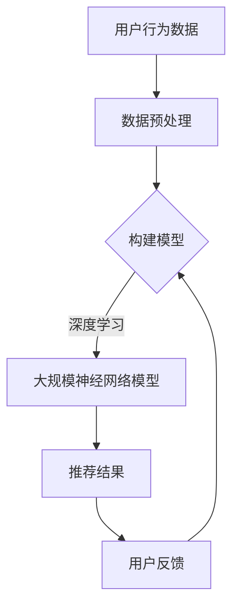

                 

关键词：搜索推荐系统、人工智能、大模型、电商平台、转化率、用户体验、盈利

摘要：本文深入探讨了搜索推荐系统在电商平台中的应用，重点介绍了利用人工智能和大模型技术如何提高电商平台的转化率、用户体验和盈利。通过详细的分析和实际案例，本文揭示了搜索推荐系统的核心原理、关键算法、数学模型，以及其在电商领域的广泛应用前景。

## 1. 背景介绍

随着互联网的快速发展，电子商务已经成为现代商业活动的重要组成部分。电商平台通过提供丰富的商品信息和便捷的购物体验，吸引了越来越多的消费者。然而，在庞大的商品数据库中，如何让消费者快速找到自己需要的商品，提高购物效率和满意度，成为电商平台亟需解决的问题。

搜索推荐系统作为电商平台的重要组成部分，其目标是为用户提供个性化的商品推荐服务，提高用户的购物体验和满意度。传统的搜索推荐系统主要依赖于关键词匹配和商品相似性算法，但这种方法在面对海量数据和复杂用户行为时存在明显的局限性。

随着人工智能技术的飞速发展，特别是深度学习和大数据分析技术的应用，大模型技术逐渐成为搜索推荐系统的重要支撑。通过构建大规模的神经网络模型，搜索推荐系统能够更准确地捕捉用户的兴趣和行为，为用户提供更加精准的推荐结果。

本文旨在探讨搜索推荐系统中大模型的应用，分析其在提高电商平台转化率、用户体验和盈利方面的作用，并介绍相关的核心概念、算法原理、数学模型以及实际应用案例。

## 2. 核心概念与联系

### 2.1 搜索推荐系统的定义

搜索推荐系统是一种通过分析用户的搜索历史、购买行为、浏览记录等数据，为用户提供个性化商品推荐的服务系统。其核心目标是为用户找到他们可能感兴趣的商品，从而提高购物体验和满意度。

### 2.2 大模型技术

大模型技术是指通过构建大规模的神经网络模型，对海量数据进行深度学习，以实现高度个性化的推荐效果。大模型通常包含数百万甚至数亿个参数，能够捕捉到用户行为的复杂模式。

### 2.3 人工智能与搜索推荐系统的关系

人工智能，特别是深度学习技术，为搜索推荐系统的发展提供了强大的技术支撑。通过引入人工智能技术，搜索推荐系统能够更准确地理解用户的意图和需求，从而提高推荐效果。

### 2.4 Mermaid 流程图



### 2.5 核心概念与联系总结

搜索推荐系统通过收集和分析用户行为数据，利用大模型技术和人工智能算法，构建大规模神经网络模型，生成个性化的推荐结果，并根据用户反馈不断优化模型。这一过程形成一个闭环系统，持续提高推荐效果和用户体验。

## 3. 核心算法原理 & 具体操作步骤

### 3.1 算法原理概述

搜索推荐系统的核心算法是基于用户行为数据和商品属性数据构建的推荐模型。通过深度学习技术，特别是卷积神经网络（CNN）和循环神经网络（RNN），能够实现对用户行为的复杂模式进行有效捕捉和预测。

### 3.2 算法步骤详解

1. **数据收集与预处理**：收集用户的搜索历史、购买记录、浏览记录等数据，并对数据进行清洗、去重和归一化处理。

2. **特征工程**：对原始数据进行特征提取，包括用户特征（如用户年龄、性别、地理位置等）和商品特征（如商品类别、价格、销量等）。

3. **模型构建**：利用卷积神经网络（CNN）或循环神经网络（RNN）构建推荐模型，通过训练使模型能够捕捉用户行为的复杂模式。

4. **模型训练与优化**：使用大量用户行为数据进行模型训练，并通过交叉验证和网格搜索等技术优化模型参数。

5. **生成推荐结果**：将用户行为数据和商品属性数据输入训练好的模型，生成个性化的推荐结果。

6. **用户反馈与模型优化**：收集用户对推荐结果的反馈，对模型进行持续优化，提高推荐效果。

### 3.3 算法优缺点

**优点**：
- 高效性：通过大规模数据处理和深度学习技术，能够快速生成个性化推荐结果。
- 精准性：能够捕捉用户行为的复杂模式，提高推荐效果。
- 可扩展性：适用于不同规模和类型的电商平台。

**缺点**：
- 计算资源消耗大：构建和训练大规模神经网络模型需要大量计算资源。
- 数据依赖性：推荐效果高度依赖于用户行为数据和商品属性数据的质量。

### 3.4 算法应用领域

搜索推荐系统在电商平台的各个领域都有广泛应用，包括：
- 商品搜索与推荐：为用户提供个性化商品搜索和推荐服务。
- 购物车推荐：根据用户购物车中的商品，为用户推荐相关的商品。
- 店铺推荐：根据用户浏览记录，为用户推荐相关店铺。
- 活动推荐：根据用户兴趣和行为，为用户推荐相关促销活动。

## 4. 数学模型和公式 & 详细讲解 & 举例说明

### 4.1 数学模型构建

搜索推荐系统中的数学模型主要包括用户行为模型和商品推荐模型。

**用户行为模型**：
$$
\text{UserBehaviorModel} = f(\text{UserFeatures}, \text{ItemFeatures}, \text{ModelParameters})
$$
其中，$f$ 表示神经网络模型，$\text{UserFeatures}$ 表示用户特征向量，$\text{ItemFeatures}$ 表示商品特征向量，$\text{ModelParameters}$ 表示模型参数。

**商品推荐模型**：
$$
\text{RecommendationModel} = g(\text{UserFeatures}, \text{ItemFeatures}, \text{ModelParameters})
$$
其中，$g$ 表示推荐模型，$\text{UserFeatures}$ 和 $\text{ItemFeatures}$ 的含义与上相同。

### 4.2 公式推导过程

**用户行为模型推导**：

1. **输入特征表示**：
$$
\text{UserFeatures} = [u_1, u_2, ..., u_n], \quad \text{ItemFeatures} = [i_1, i_2, ..., i_n]
$$
其中，$u_i$ 和 $i_j$ 分别表示用户特征和商品特征。

2. **神经网络结构**：
$$
\text{InputLayer} \rightarrow \text{HiddenLayer} \rightarrow \text{OutputLayer
```

