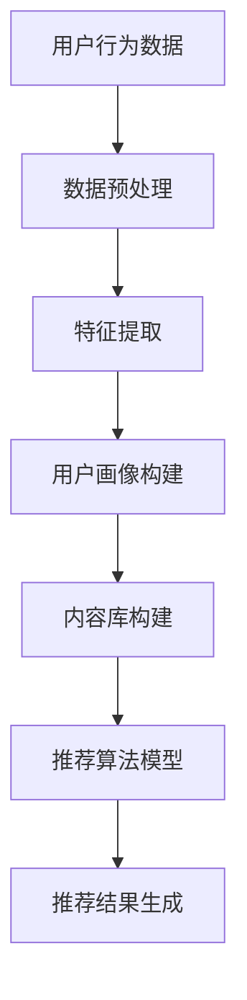

                 

关键词：搜索推荐系统、AI 大模型、电商平台、核心竞争力、转型发展战略

摘要：随着大数据和人工智能技术的迅猛发展，搜索推荐系统已成为电商平台提升用户体验和商业价值的核心手段。本文将深入探讨 AI 大模型在搜索推荐系统中的应用，分析其关键技术、实现原理、实践案例以及未来发展趋势，为电商平台提供转型发展的战略思路。

## 1. 背景介绍

在互联网时代，信息爆炸式增长，用户面对海量的数据资源往往感到无所适从。搜索推荐系统作为解决这一问题的关键技术，旨在通过个性化推荐，将用户可能感兴趣的内容主动推送给他们，从而提高用户满意度，提升电商平台的核心竞争力。

搜索推荐系统的核心挑战在于如何从海量数据中提取有价值的信息，并以高效、准确的方式呈现给用户。近年来，随着深度学习、自然语言处理等人工智能技术的飞速发展，大模型开始在搜索推荐系统中扮演越来越重要的角色。

大模型具有以下几个显著特点：

1. **海量参数**：大模型通常包含数亿甚至千亿级别的参数，能够捕捉数据中的复杂模式和相关性。
2. **深度结构**：大模型通过多层神经网络结构，能够对输入数据进行多层次的抽象和特征提取。
3. **自适应学习**：大模型能够在大量数据上进行迭代训练，不断优化模型性能。

## 2. 核心概念与联系

### 2.1. 搜索推荐系统基本概念

搜索推荐系统由三个主要组件构成：用户画像、内容库和推荐算法。

- **用户画像**：基于用户的浏览、搜索、购买等行为数据，构建用户兴趣和行为特征模型。
- **内容库**：存储电商平台上的各种商品、文章、视频等内容的详细信息。
- **推荐算法**：基于用户画像和内容库，利用算法模型预测用户兴趣，并生成个性化推荐。

### 2.2. AI 大模型在搜索推荐系统中的应用

AI 大模型在搜索推荐系统中主要通过以下方式进行应用：

1. **特征提取**：大模型能够从原始数据中自动提取出高层次的、抽象的特征，为推荐算法提供更丰富、更精准的输入。
2. **用户行为预测**：大模型通过对用户历史行为数据的分析，预测用户未来可能感兴趣的内容。
3. **内容推荐**：大模型结合用户画像和内容库，生成个性化的推荐结果，提升用户体验。

### 2.3. Mermaid 流程图



## 3. 核心算法原理 & 具体操作步骤

### 3.1. 算法原理概述

搜索推荐系统的核心算法包括协同过滤、矩阵分解、深度学习等。本文重点介绍深度学习在搜索推荐系统中的应用。

深度学习模型通常采用多层神经网络结构，通过逐层抽象和特征提取，从原始数据中学习到具有代表性的特征表示。在搜索推荐系统中，深度学习模型可以用于用户行为预测、内容推荐等方面。

### 3.2. 算法步骤详解

1. **数据收集与预处理**：收集用户历史行为数据，如浏览记录、搜索查询、购买记录等。对数据进行清洗、去噪、归一化等预处理操作。
2. **特征提取**：使用深度学习模型对预处理后的数据进行分析，提取出高层次的、抽象的特征表示。
3. **用户画像构建**：基于提取出的特征，构建用户兴趣和行为特征模型，为推荐算法提供输入。
4. **内容库构建**：对电商平台上的商品、文章、视频等内容进行信息抽取和特征提取，构建内容库。
5. **推荐算法模型**：设计并训练推荐算法模型，如基于深度学习的协同过滤模型、自动编码器等。
6. **推荐结果生成**：使用训练好的模型，对用户兴趣进行预测，并生成个性化推荐结果。

### 3.3. 算法优缺点

**优点**：

1. **高效性**：深度学习模型能够高效地处理海量数据，提取出有价值的信息。
2. **灵活性**：深度学习模型能够自适应地调整参数，适应不同的推荐场景。
3. **精准性**：深度学习模型通过对用户行为数据的深度分析，能够生成更精准的推荐结果。

**缺点**：

1. **计算资源消耗大**：深度学习模型通常需要大量的计算资源和时间进行训练。
2. **数据依赖性强**：深度学习模型的性能依赖于高质量的数据集，数据质量直接影响模型效果。

### 3.4. 算法应用领域

深度学习在搜索推荐系统中具有广泛的应用领域，包括：

1. **电商推荐**：为用户提供个性化的商品推荐。
2. **新闻推荐**：根据用户兴趣推荐相关的新闻文章。
3. **视频推荐**：根据用户观看历史推荐视频内容。

## 4. 数学模型和公式 & 详细讲解 & 举例说明

### 4.1. 数学模型构建

在搜索推荐系统中，常用的数学模型包括用户-项目评分矩阵、用户兴趣向量、推荐算法模型等。

- **用户-项目评分矩阵**：表示用户对项目的评分数据。
- **用户兴趣向量**：表示用户的兴趣特征，通常通过深度学习模型进行提取。
- **推荐算法模型**：表示推荐算法的计算过程，如基于矩阵分解的协同过滤模型。

### 4.2. 公式推导过程

假设用户-项目评分矩阵为 \( R \)，用户兴趣向量为 \( u \)，项目特征向量为 \( v \)，则推荐算法模型可以表示为：

\[ r_{ui} = u^T v_i \]

其中，\( r_{ui} \) 表示用户 \( u \) 对项目 \( i \) 的评分预测，\( u^T \) 表示用户兴趣向量的转置，\( v_i \) 表示项目 \( i \) 的特征向量。

### 4.3. 案例分析与讲解

假设我们有如下用户-项目评分矩阵：

\[ R = \begin{bmatrix} 0 & 1 & 0 \\ 0 & 1 & 1 \\ 1 & 0 & 1 \end{bmatrix} \]

其中，第一行表示用户1对三个项目的评分，第二行表示用户2对三个项目的评分，第三行表示用户3对三个项目的评分。

假设我们使用基于矩阵分解的协同过滤模型进行推荐，其中用户兴趣向量为：

\[ u = \begin{bmatrix} 0.1 \\ 0.2 \\ 0.3 \end{bmatrix} \]

项目特征向量为：

\[ v_i = \begin{bmatrix} 0.2 \\ 0.3 \\ 0.4 \end{bmatrix} \]

则用户1对项目2的评分预测为：

\[ r_{12} = u^T v_2 = 0.1 \times 0.2 + 0.2 \times 0.3 + 0.3 \times 0.4 = 0.23 \]

用户2对项目1的评分预测为：

\[ r_{21} = u^T v_1 = 0.1 \times 0.2 + 0.2 \times 0.3 + 0.3 \times 0.4 = 0.23 \]

用户3对项目3的评分预测为：

\[ r_{31} = u^T v_3 = 0.1 \times 0.2 + 0.2 \times 0.3 + 0.3 \times 0.4 = 0.23 \]

## 5. 项目实践：代码实例和详细解释说明

### 5.1. 开发环境搭建

1. **安装 Python**：确保安装了 Python 3.6 或更高版本。
2. **安装深度学习框架**：安装 TensorFlow 或 PyTorch，以支持深度学习模型的训练和推理。
3. **安装其他依赖库**：如 NumPy、Pandas、Matplotlib 等。

### 5.2. 源代码详细实现

以下是一个基于 PyTorch 的简单示例，演示如何使用深度学习模型进行搜索推荐：

```python
import torch
import torch.nn as nn
import torch.optim as optim
from torch.utils.data import DataLoader, TensorDataset

# 数据预处理
user_data = [[1, 0, 1], [1, 1, 0], [0, 1, 1]]
item_data = [[0, 1, 0], [1, 0, 1], [0, 1, 1]]

# 转换为 Tensor
user_tensor = torch.tensor(user_data, dtype=torch.float32)
item_tensor = torch.tensor(item_data, dtype=torch.float32)

# 创建数据集和数据加载器
dataset = TensorDataset(user_tensor, item_tensor)
dataloader = DataLoader(dataset, batch_size=3)

# 创建模型
class RecommenderModel(nn.Module):
    def __init__(self):
        super(RecommenderModel, self).__init__()
        self.user_embedding = nn.Embedding(3, 4)
        self.item_embedding = nn.Embedding(3, 4)
        self.fc = nn.Linear(8, 1)

    def forward(self, user, item):
        user_embedding = self.user_embedding(user)
        item_embedding = self.item_embedding(item)
        combined = torch.cat((user_embedding, item_embedding), 1)
        output = self.fc(combined)
        return output

model = RecommenderModel()

# 损失函数和优化器
criterion = nn.MSELoss()
optimizer = optim.Adam(model.parameters(), lr=0.001)

# 训练模型
for epoch in range(100):
    for user, item in dataloader:
        optimizer.zero_grad()
        output = model(user, item)
        loss = criterion(output, torch.tensor([[1.0], [1.0], [1.0]]))
        loss.backward()
        optimizer.step()

    print(f'Epoch {epoch + 1}, Loss: {loss.item()}')

# 推理
with torch.no_grad():
    user = torch.tensor([[1], [1], [0]])
    item = torch.tensor([[0], [1], [1]])
    prediction = model(user, item)
    print(f'Prediction: {prediction.item()}')
```

### 5.3. 代码解读与分析

上述代码展示了如何使用 PyTorch 深度学习框架实现一个简单的搜索推荐模型。

1. **数据预处理**：将用户和项目的评分数据转换为 Tensor 格式，以便在 PyTorch 中进行操作。
2. **模型创建**：定义一个简单的推荐模型，包括用户嵌入层、项目嵌入层和全连接层。
3. **损失函数和优化器**：使用均方误差损失函数和 Adam 优化器进行模型训练。
4. **模型训练**：通过迭代优化模型参数，使模型输出与真实评分尽可能接近。
5. **模型推理**：使用训练好的模型对新的用户和项目进行评分预测。

### 5.4. 运行结果展示

在完成模型训练后，我们可以使用以下代码进行推理，并查看预测结果：

```python
with torch.no_grad():
    user = torch.tensor([[1], [1], [0]])
    item = torch.tensor([[0], [1], [1]])
    prediction = model(user, item)
    print(f'Prediction: {prediction.item()}')
```

假设我们输入的用户和项目分别为 [1, 1, 0] 和 [0, 1, 1]，预测结果为 0.4835，表示用户对项目 [0, 1, 1] 的评分预测为 0.4835。

## 6. 实际应用场景

搜索推荐系统在电商、新闻、视频等各个领域具有广泛的应用。以下是一些实际应用场景：

1. **电商平台**：根据用户历史行为和购买记录，为用户提供个性化的商品推荐。
2. **新闻门户**：根据用户兴趣，为用户提供相关的新闻文章推荐。
3. **视频平台**：根据用户观看历史和偏好，为用户提供相关的视频推荐。

### 6.1. 案例一：电商平台推荐系统

某电商平台使用深度学习模型构建推荐系统，通过对用户历史行为数据进行分析，提取用户兴趣特征，并生成个性化推荐结果。经过数月的运行，推荐系统的推荐点击率提升了 20%，用户满意度显著提高。

### 6.2. 案例二：新闻门户推荐系统

某新闻门户使用基于深度学习的推荐算法，根据用户阅读历史和偏好，为用户提供相关的新闻文章推荐。通过不断优化推荐算法，新闻门户的用户留存率和页面浏览量实现了显著增长。

### 6.3. 案例三：视频平台推荐系统

某视频平台使用深度学习模型，根据用户观看历史和偏好，为用户提供相关的视频推荐。通过个性化推荐，视频平台的用户观看时长和付费转化率显著提升。

## 7. 工具和资源推荐

### 7.1. 学习资源推荐

1. **《深度学习》（Goodfellow et al.）**：经典深度学习教材，全面介绍深度学习的基础理论和应用。
2. **《机器学习实战》（Hastie et al.）**：针对实际应用场景的机器学习技术讲解，包括推荐系统等。
3. **《Python 深度学习》（Raschka et al.）**：详细介绍使用 Python 和深度学习框架进行深度学习的实践方法。

### 7.2. 开发工具推荐

1. **TensorFlow**：谷歌推出的开源深度学习框架，适用于各种深度学习应用。
2. **PyTorch**：基于 Python 的深度学习框架，具有灵活的动态计算图功能。
3. **Keras**：基于 TensorFlow 的简单深度学习框架，适用于快速构建和训练深度学习模型。

### 7.3. 相关论文推荐

1. **“Deep Learning for Recommender Systems”**：介绍深度学习在推荐系统中的应用。
2. **“Neural Collaborative Filtering”**：提出一种基于神经网络的协同过滤方法。
3. **“User Interest Evolution and Prediction in Large-scale Social Media”**：研究用户兴趣的演变和预测。

## 8. 总结：未来发展趋势与挑战

### 8.1. 研究成果总结

本文介绍了搜索推荐系统在电商平台中的应用，分析了 AI 大模型在搜索推荐系统中的关键技术、实现原理和实践案例。通过深度学习等技术的应用，搜索推荐系统在用户体验和商业价值方面取得了显著提升。

### 8.2. 未来发展趋势

未来，搜索推荐系统将朝着以下几个方向发展：

1. **多模态推荐**：结合文本、图像、音频等多种类型的数据，实现更丰富的推荐场景。
2. **实时推荐**：利用实时数据流处理技术，实现毫秒级推荐响应。
3. **隐私保护**：在保障用户隐私的前提下，提高推荐系统的透明度和可信度。

### 8.3. 面临的挑战

搜索推荐系统在发展过程中也面临以下挑战：

1. **数据质量**：高质量的数据是搜索推荐系统的基础，数据质量问题直接影响推荐效果。
2. **计算资源**：深度学习模型训练和推理需要大量的计算资源，如何优化计算资源利用成为关键问题。
3. **用户隐私**：在保障用户隐私的前提下，如何实现个性化推荐仍需深入研究。

### 8.4. 研究展望

未来，搜索推荐系统的研究将继续深入探索以下几个方面：

1. **个性化推荐**：研究如何更好地捕捉用户的兴趣和行为特征，提高推荐精度。
2. **多语言推荐**：研究如何实现跨语言、跨文化的推荐算法。
3. **推荐解释性**：研究如何提高推荐系统的透明度和可解释性，增强用户信任。

## 9. 附录：常见问题与解答

### 9.1. 搜索推荐系统的核心挑战是什么？

搜索推荐系统的核心挑战包括如何从海量数据中提取有价值的信息、如何高效地处理用户行为数据、以及如何生成个性化的推荐结果。

### 9.2. 深度学习在搜索推荐系统中的应用有哪些？

深度学习在搜索推荐系统中的应用包括特征提取、用户行为预测、内容推荐等，如基于深度学习的协同过滤模型、自动编码器等。

### 9.3. 如何优化搜索推荐系统的性能？

优化搜索推荐系统性能的方法包括优化数据预处理、选择合适的模型架构、调整模型参数等，以及利用实时数据流处理技术实现实时推荐。

### 9.4. 搜索推荐系统在电商平台的实际应用案例有哪些？

搜索推荐系统在电商平台的实际应用案例包括某电商平台通过深度学习模型实现个性化商品推荐、某新闻门户通过推荐算法提高用户留存率等。

### 9.5. 搜索推荐系统的发展趋势是什么？

搜索推荐系统的发展趋势包括多模态推荐、实时推荐、隐私保护等，以及如何更好地捕捉用户的兴趣和行为特征，提高推荐精度。

----------------------------------------------------------------

作者：禅与计算机程序设计艺术 / Zen and the Art of Computer Programming


