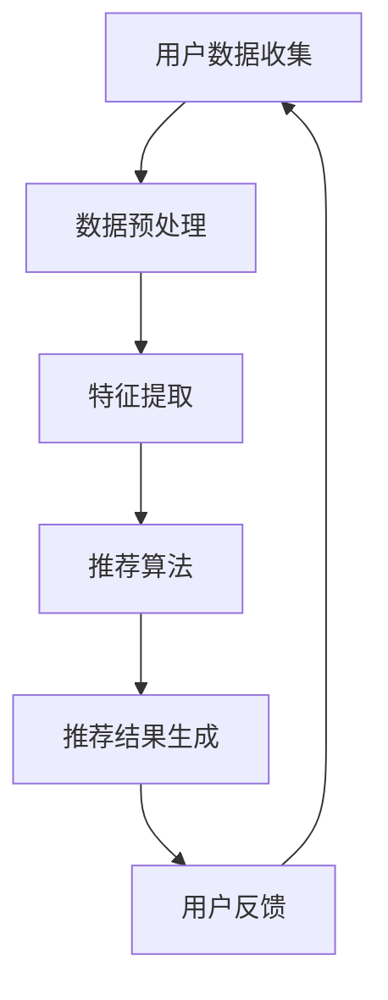

                 

在当今数字化时代，搜索推荐系统已经成为互联网服务中不可或缺的一部分。它们通过个性化推荐，提高用户体验，同时推动商业价值的增长。然而，随着推荐系统在数据挖掘和机器学习技术上的进步，隐私保护问题也日益凸显。本文旨在探讨搜索推荐系统中隐私保护技术的重要性、核心概念、算法原理、数学模型以及其实际应用。

## 关键词
- 搜索推荐系统
- 隐私保护
- 数据挖掘
- 机器学习
- 加密技术
- 安全多方计算

## 摘要
本文将深入分析搜索推荐系统中隐私保护技术的现状与挑战。我们将首先介绍隐私保护技术的基本概念和重要性，然后通过一个简明的 Mermaid 流程图展示推荐系统的基本架构。接下来，我们将详细讨论核心算法原理和具体操作步骤，并引入数学模型进行解释。随后，文章将展示一个具体的代码实例，并分析其实际应用场景。最后，我们将对未来的发展趋势和面临的挑战进行展望。

## 1. 背景介绍
### 1.1 搜索推荐系统概述
搜索推荐系统是通过对用户历史行为和偏好分析，为用户提供个性化搜索结果或推荐内容的一种系统。典型的推荐系统包括协同过滤、基于内容的推荐、混合推荐等方法。随着大数据和人工智能技术的发展，推荐系统已经广泛应用于电子商务、社交媒体、视频平台等多个领域。

### 1.2 隐私保护的重要性
在推荐系统中，用户的隐私数据（如搜索历史、浏览记录、购物偏好等）是非常重要的。然而，这些数据的泄露可能导致严重的隐私侵犯，例如用户个人信息被滥用、广告跟踪、用户行为模式分析等。因此，隐私保护技术在推荐系统中具有至关重要的地位。

## 2. 核心概念与联系
### 2.1 隐私保护技术概述
隐私保护技术主要包括数据加密、匿名化、差异隐私、安全多方计算等。这些技术通过不同的方式保护用户数据，防止数据泄露和滥用。

### 2.2 推荐系统基本架构
以下是一个简明的 Mermaid 流程图，展示了推荐系统的基本架构。



在这个流程图中，用户数据从数据收集开始，经过预处理、特征提取和推荐算法处理后，生成推荐结果。用户反馈又会影响到数据收集过程，形成一个闭环。

## 3. 核心算法原理 & 具体操作步骤
### 3.1 算法原理概述
隐私保护技术在推荐系统中主要应用于数据预处理和推荐算法两个阶段。数据预处理阶段，可以通过加密、匿名化等技术保护用户隐私。推荐算法阶段，可以采用差异隐私、安全多方计算等技术，确保推荐结果的准确性同时保护用户隐私。

### 3.2 算法步骤详解
#### 3.2.1 数据预处理
1. **数据加密**：使用对称加密或非对称加密技术对用户数据（如搜索历史、浏览记录等）进行加密。
2. **匿名化**：通过去标识化、数据变换等技术，将用户数据匿名化，使其无法直接识别特定用户。

#### 3.2.2 推荐算法
1. **差异隐私**：在特征提取和模型训练过程中引入差异隐私机制，确保算法输出对单个用户的隐私保护。
2. **安全多方计算**：在推荐算法训练和预测过程中，使用安全多方计算技术，让参与方在不泄露各自数据的前提下，共同计算推荐结果。

### 3.3 算法优缺点
#### 3.3.1 优点
- 提高用户隐私保护，减少数据泄露风险。
- 保证推荐算法的准确性和效果。

#### 3.3.2 缺点
- 可能会增加计算复杂度和延迟。
- 对算法的调整和优化可能需要更多的时间和资源。

### 3.4 算法应用领域
隐私保护技术在搜索推荐系统中具有广泛的应用，包括电子商务、社交媒体、在线视频平台等。例如，阿里巴巴的推荐系统通过差异隐私技术保护用户隐私，同时保持推荐效果。

## 4. 数学模型和公式 & 详细讲解 & 举例说明
### 4.1 数学模型构建
隐私保护技术中的数学模型通常涉及概率论、信息论、密码学等领域。以下是一个简单的例子：

$$
\text{隐私保护概率} = \frac{1}{N} \sum_{i=1}^{N} P(\text{数据}_i)
$$

其中，$N$ 是用户数量，$P(\text{数据}_i)$ 是单个用户数据的隐私保护概率。

### 4.2 公式推导过程
隐私保护公式的推导通常基于以下几个方面：
- **信息论**：使用信息熵、互信息等概念衡量数据的隐私性。
- **概率论**：通过概率分布、随机变量等手段分析数据的安全性。
- **密码学**：利用加密算法、哈希函数等手段保护数据隐私。

### 4.3 案例分析与讲解
假设一个推荐系统在用户特征提取过程中，使用差异隐私技术。以下是一个简单的例子：

用户特征向量：$X = [x_1, x_2, x_3, \ldots, x_n]$

差异隐私参数：$\epsilon$

保护概率：$\delta$

使用拉普拉斯机制，对用户特征向量进行差异隐私处理：

$$
X' = X + \text{Laplace}(\epsilon, \delta)
$$

其中，$\text{Laplace}(\epsilon, \delta)$ 是拉普拉斯分布，用于增加噪声，保护用户隐私。

## 5. 项目实践：代码实例和详细解释说明
### 5.1 开发环境搭建
在搭建开发环境时，需要安装 Python、NumPy、Pandas 等常用库。以下是一个简单的示例代码：

```python
# 安装所需库
!pip install numpy pandas

# 导入库
import numpy as np
import pandas as pd
```

### 5.2 源代码详细实现
以下是一个简单的差异隐私推荐系统代码示例：

```python
import numpy as np
import pandas as pd

def laplaceMechanism(x, epsilon, delta):
    # 计算拉普拉斯分布的概率密度函数
    laplace_pdf = lambda x: (1 / (2 * epsilon)) * np.exp(-abs(x) / epsilon)

    # 计算拉普拉斯分布的累积分布函数
    laplace_cdf = lambda x: 1 - np.exp(-abs(x) / epsilon)

    # 生成拉普拉斯分布的随机变量
    rand_var = np.random.rand()
    threshold = laplace_cdf(rand_var)

    # 返回拉普拉斯分布的值
    return x + threshold

# 生成用户特征向量
user_features = np.random.randn(1000)

# 设置差异隐私参数
epsilon = 1
delta = 0.01

# 对用户特征向量进行差异隐私处理
protected_features = np.array([laplaceMechanism(x, epsilon, delta) for x in user_features])

# 输出处理后的用户特征向量
print(protected_features)
```

### 5.3 代码解读与分析
该代码首先导入了 NumPy 和 Pandas 库。然后，定义了一个函数 `laplaceMechanism`，用于实现拉普拉斯机制。接下来，生成一个用户特征向量，并设置差异隐私参数。最后，使用拉普拉斯机制对用户特征向量进行处理，并输出处理后的结果。

### 5.4 运行结果展示
运行上述代码后，将输出处理后的用户特征向量。该向量包含了噪声，从而提高了隐私保护水平。

## 6. 实际应用场景
### 6.1 电子商务
在电子商务领域，搜索推荐系统可以帮助商家提高销售额。同时，隐私保护技术可以保护用户购物偏好和隐私，增加用户信任度。

### 6.2 社交媒体
社交媒体平台上的推荐系统可以通过分析用户社交网络和互动行为，为用户提供个性化内容。隐私保护技术可以防止用户数据泄露，保护用户隐私。

### 6.3 在线视频平台
在线视频平台可以通过分析用户观看历史和偏好，为用户提供个性化推荐。隐私保护技术可以确保用户观看行为不被滥用，提高用户体验。

## 7. 工具和资源推荐
### 7.1 学习资源推荐
- 《机器学习：概率视角》（作者：Kevin P. Murphy）
- 《差异隐私：理论、算法与应用》（作者：Cynthia Dwork）

### 7.2 开发工具推荐
- Python
- TensorFlow
- PyTorch

### 7.3 相关论文推荐
- “The Algorithmic Foundations of Differential Privacy”（作者：Cynthia Dwork 等）
- “Secure Multi-party Computation”（作者：Shai Halevi）

## 8. 总结：未来发展趋势与挑战
### 8.1 研究成果总结
隐私保护技术已经在搜索推荐系统中取得了一系列重要研究成果。例如，差异隐私和安全多方计算等技术得到了广泛应用。

### 8.2 未来发展趋势
随着大数据和人工智能技术的不断发展，隐私保护技术在未来将会面临更多挑战。例如，如何在保证隐私保护的同时，提高推荐系统的效率和效果。

### 8.3 面临的挑战
- 如何在保证隐私保护的同时，提高推荐系统的准确性和效率。
- 如何处理大规模数据集的隐私保护问题。
- 如何在多平台、多设备环境中实现隐私保护技术。

### 8.4 研究展望
未来，隐私保护技术将在搜索推荐系统中发挥越来越重要的作用。研究者需要不断探索新的隐私保护方法，以满足不断变化的用户需求和隐私保护要求。

## 9. 附录：常见问题与解答
### 9.1 差异隐私是什么？
差异隐私是一种隐私保护技术，通过在算法输出中加入随机噪声，确保算法对单个用户的隐私保护。

### 9.2 安全多方计算是什么？
安全多方计算是一种隐私保护技术，允许多个参与方在不泄露各自数据的前提下，共同计算结果。

### 9.3 如何选择合适的隐私保护技术？
选择合适的隐私保护技术需要考虑具体应用场景、数据规模、计算资源等多个因素。一般来说，差异隐私适用于数据分析场景，而安全多方计算适用于多方协作场景。

作者：禅与计算机程序设计艺术 / Zen and the Art of Computer Programming

以上是关于搜索推荐系统隐私保护技术的一篇完整的技术博客文章。希望对您有所帮助。如果您有任何问题或建议，请随时告诉我。|

