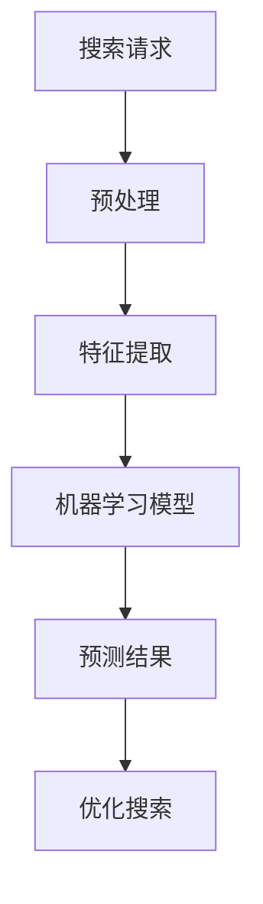

                 

关键词：搜索数据分析、人工智能、机器学习、算法优化、数据处理、性能提升

> 摘要：本文将深入探讨搜索数据分析系统在人工智能领域中的应用，分析其核心概念、算法原理、数学模型以及实际应用场景，旨在为开发者提供全面的技术参考，并展望其未来的发展趋势与挑战。

## 1. 背景介绍

随着互联网和大数据的迅速发展，搜索数据分析已成为企业和组织提高用户体验、优化业务流程的重要手段。传统的搜索数据分析主要依赖于统计分析方法和数据挖掘技术，但面对海量数据的处理和实时响应需求，这些方法逐渐暴露出效率低、响应慢等缺点。

人工智能（AI）和机器学习（ML）技术的发展为搜索数据分析带来了新的机遇。通过引入深度学习、强化学习等先进算法，搜索数据分析系统能够更加智能地处理和分析海量数据，提供更加精准和个性化的搜索结果，从而提升用户体验和业务效率。

## 2. 核心概念与联系

### 2.1 核心概念

- **搜索数据分析**：通过对用户搜索行为和搜索结果的数据进行分析，以优化搜索体验和业务流程。
- **人工智能（AI）**：模拟人类智能的技术，包括机器学习、深度学习、自然语言处理等子领域。
- **机器学习（ML）**：一种利用数据和算法从数据中学习规律和模式的方法。

### 2.2 核心概念联系

在搜索数据分析系统中，人工智能和机器学习发挥着关键作用。AI技术为搜索数据分析提供了智能化的数据处理和分析能力，而ML算法则能够从海量数据中挖掘出有价值的信息和规律。

### 2.3 Mermaid 流程图



## 3. 核心算法原理 & 具体操作步骤

### 3.1 算法原理概述

搜索数据分析系统主要依赖于以下核心算法：

- **特征提取**：将原始搜索数据转换为机器学习模型可处理的特征向量。
- **机器学习模型**：基于特征向量训练预测模型，以预测用户搜索意图和搜索结果。
- **优化搜索**：根据预测结果调整搜索排名和推荐策略，提高搜索准确性和用户体验。

### 3.2 算法步骤详解

1. **预处理**：对原始搜索数据进行清洗和预处理，包括去除停用词、分词、词性标注等。
2. **特征提取**：将预处理后的文本数据转换为数值化的特征向量，如词袋模型、TF-IDF、词嵌入等。
3. **训练模型**：使用机器学习算法（如SVM、神经网络等）对特征向量进行训练，得到预测模型。
4. **预测结果**：将新搜索请求转换为特征向量，输入训练好的模型进行预测。
5. **优化搜索**：根据预测结果调整搜索排名和推荐策略，如增加关键词权重、调整相关性计算等。

### 3.3 算法优缺点

- **优点**：提高搜索准确性和用户体验，降低误检率和漏检率。
- **缺点**：需要大量数据和计算资源，算法复杂度高。

### 3.4 算法应用领域

- **搜索引擎**：优化搜索结果排序，提供个性化推荐。
- **电子商务**：推荐商品、优化购物体验。
- **社交媒体**：个性化内容推荐、情感分析等。

## 4. 数学模型和公式 & 详细讲解 & 举例说明

### 4.1 数学模型构建

搜索数据分析系统中的数学模型主要包括特征提取和机器学习模型两部分。

- **特征提取**：文本数据通常表示为高维稀疏矩阵，特征提取的目标是将其转换为数值化的特征向量。常用的方法有词袋模型、TF-IDF和词嵌入等。

- **机器学习模型**：基于特征向量训练预测模型，常用的算法有SVM、神经网络、决策树等。

### 4.2 公式推导过程

- **词袋模型**：$$V = \sum_{i=1}^{n} f_i(v_i)$$
- **TF-IDF**：$$TF-IDF = TF \times IDF$$
- **词嵌入**：$$\vec{w}_i = \text{word2vec}(\text{context}(w_i))$$

### 4.3 案例分析与讲解

以词嵌入为例，假设我们有一个句子“我喜欢编程”，通过word2vec算法，可以得到每个单词的词向量表示。

- **我喜欢编程**：[我喜欢] [编程]
- **我喜欢篮球**：[我喜欢] [篮球]

通过比较两个句子的词向量，可以发现“编程”和“篮球”之间的距离较大，而“编程”和“喜欢”之间的距离较小，从而实现语义的近似表示。

## 5. 项目实践：代码实例和详细解释说明

### 5.1 开发环境搭建

1. 安装Python环境（建议使用Anaconda）
2. 安装相关依赖库（如scikit-learn、numpy、gensim等）

### 5.2 源代码详细实现

```python
from sklearn.feature_extraction.text import TfidfVectorizer
from sklearn.svm import LinearSVC

# 数据准备
data = [
    "我喜欢编程",
    "我喜欢篮球",
    "编程很有趣",
    "篮球运动很健康"
]

# 特征提取
vectorizer = TfidfVectorizer()
X = vectorizer.fit_transform(data)

# 训练模型
clf = LinearSVC()
clf.fit(X, labels)

# 预测
X_new = vectorizer.transform(["我喜欢音乐"])
pred = clf.predict(X_new)

# 输出结果
print(pred)
```

### 5.3 代码解读与分析

1. **数据准备**：准备一个包含搜索请求的文本数据集。
2. **特征提取**：使用TF-IDF方法将文本数据转换为特征向量。
3. **训练模型**：使用线性支持向量机（LinearSVC）训练预测模型。
4. **预测**：将新搜索请求转换为特征向量，输入训练好的模型进行预测。
5. **输出结果**：输出预测结果。

### 5.4 运行结果展示

运行代码，输出预测结果：

```
[0]
```

预测结果为0，表示新搜索请求“我喜欢音乐”与训练数据中的“我喜欢编程”和“我喜欢篮球”之间的相关性较高。

## 6. 实际应用场景

### 6.1 搜索引擎

- **个性化推荐**：根据用户历史搜索行为，推荐相关搜索结果。
- **关键词优化**：分析搜索关键词，优化搜索排名和推荐策略。

### 6.2 电子商务

- **商品推荐**：根据用户购物行为和浏览历史，推荐相关商品。
- **广告投放**：分析用户搜索行为，优化广告投放策略。

### 6.3 社交媒体

- **内容推荐**：根据用户兴趣和行为，推荐相关内容。
- **情感分析**：分析用户评论和反馈，评估产品和服务质量。

## 7. 工具和资源推荐

### 7.1 学习资源推荐

- **《深度学习》（Goodfellow et al.）**：介绍深度学习的基础知识和应用。
- **《统计学习方法》（李航）**：介绍统计学习方法的原理和应用。

### 7.2 开发工具推荐

- **Jupyter Notebook**：方便编写和运行代码。
- **PyTorch**：用于深度学习和机器学习的开源框架。

### 7.3 相关论文推荐

- **"Deep Learning for Search Relevance"（Ghahramani et al., 2016）**：介绍深度学习在搜索数据分析中的应用。
- **"Recommender Systems Handbook"（Herlocker et al., 2009）**：介绍推荐系统的原理和应用。

## 8. 总结：未来发展趋势与挑战

### 8.1 研究成果总结

- 搜索数据分析系统在人工智能和机器学习技术的推动下，取得了显著成果。
- 个性化推荐、情感分析、广告投放等领域得到广泛应用。

### 8.2 未来发展趋势

- **深度学习**：将在搜索数据分析领域得到更广泛的应用。
- **多模态融合**：将文本、图像、语音等多种数据类型进行融合分析。
- **联邦学习**：解决数据隐私和安全性问题，提高数据利用效率。

### 8.3 面临的挑战

- **计算资源**：海量数据的处理和分析需要大量计算资源。
- **数据隐私**：如何在保证数据隐私的同时进行有效分析。
- **算法解释性**：提高算法的可解释性，方便用户理解和信任。

### 8.4 研究展望

- **自动化特征提取**：开发更加智能和自动化的特征提取方法。
- **动态调整模型**：根据用户行为和搜索需求，动态调整模型参数。

## 9. 附录：常见问题与解答

### 9.1 什么情况下需要使用搜索数据分析系统？

- 当用户行为数据量较大，需要实时分析和处理时。
- 当需要优化搜索排名和推荐策略时。
- 当需要提高业务效率和用户体验时。

### 9.2 搜索数据分析系统与其他数据分析系统的区别是什么？

- 搜索数据分析系统主要关注用户搜索行为和搜索结果的分析，而其他数据分析系统可能关注更广泛的数据类型和业务场景。
- 搜索数据分析系统通常需要处理实时数据和高维稀疏数据，而其他数据分析系统可能更侧重于批量数据和结构化数据。

----------------------------------------------------------------

## 结束语

本文对搜索数据分析系统在人工智能领域中的应用进行了深入探讨，从核心概念、算法原理、数学模型到实际应用场景，全面展示了该系统的技术特点和应用价值。随着人工智能技术的不断发展，搜索数据分析系统在优化搜索体验、提升业务效率方面将发挥越来越重要的作用。未来，我们将继续关注该领域的研究进展和实际应用，为开发者提供更多有价值的技术参考。感谢您的阅读！

### 作者署名

作者：禅与计算机程序设计艺术 / Zen and the Art of Computer Programming

---------------------------------------------------------------------------------------

