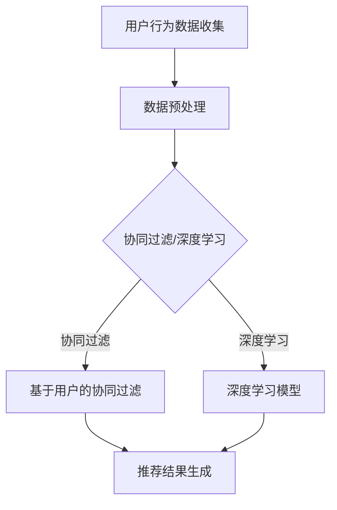

                 

关键词：携程，旅游推荐系统，校招面试，算法，实践，未来展望

> 摘要：本文将深入探讨2024年携程旅游推荐系统的校招面试经验，通过对核心概念、算法原理、数学模型和项目实践的分析，为读者提供一份详尽的面试指南。本文旨在帮助准备携程校招面试的同学，了解面试的核心考点和答题技巧。

## 1. 背景介绍

携程作为中国领先的在线旅游服务公司，其旅游推荐系统在全球范围内都享有盛名。随着人工智能和大数据技术的迅猛发展，旅游推荐系统正逐步从传统的基于规则和内容的推荐方式，向基于机器学习和深度学习的智能推荐方向转型。携程2024年的校招面试，其旅游推荐系统方向无疑成为了众多技术爱好者的焦点。

本文将围绕携程旅游推荐系统，从核心概念、算法原理、数学模型到项目实践，全方位解读校招面试的相关内容。通过本文，你将了解：

- 携程旅游推荐系统的核心架构和运行原理。
- 常见的推荐算法及其优缺点。
- 数学模型在推荐系统中的应用和推导。
- 实际项目开发中的技术细节和代码实现。

## 2. 核心概念与联系

首先，我们需要理解几个核心概念：推荐系统、用户行为数据、物品特征、协同过滤和深度学习。

### 2.1 推荐系统

推荐系统是一种信息过滤和检索技术，旨在向用户推荐可能感兴趣的信息或商品。在旅游推荐系统中，用户可以浏览、搜索和预订各种旅游产品，如酒店、景点门票、航班等。

### 2.2 用户行为数据

用户行为数据是推荐系统的基础。这些数据包括用户的历史浏览记录、搜索关键词、预订记录、评价等。通过对这些数据的分析，系统能够了解用户的兴趣和行为模式。

### 2.3 物品特征

物品特征指的是旅游产品的属性，如酒店的位置、价格、设施、评价等。这些特征在推荐系统中起到了关键作用，帮助系统更精准地匹配用户与旅游产品。

### 2.4 协同过滤

协同过滤是一种常见的推荐算法，分为基于用户的协同过滤（User-Based CF）和基于项目的协同过滤（Item-Based CF）。前者通过分析相似用户的行为来推荐物品，后者则通过分析相似物品的特征来推荐用户。

### 2.5 深度学习

深度学习是近年来兴起的一门技术，其强大的建模能力使其在推荐系统中得到了广泛应用。深度学习模型，如神经网络，能够自动学习用户和物品的特征，从而实现更精准的推荐。

### 2.6 Mermaid 流程图

下面是一个简单的 Mermaid 流程图，展示了推荐系统的主要流程：



## 3. 核心算法原理 & 具体操作步骤

### 3.1 算法原理概述

推荐系统算法主要分为以下几类：

1. **基于内容的推荐（Content-Based Filtering）**：通过分析物品的属性和用户的历史行为，找出相似物品推荐给用户。
2. **协同过滤（Collaborative Filtering）**：通过分析用户之间的相似性或物品之间的相似性进行推荐。
3. **基于模型的推荐（Model-Based Filtering）**：使用机器学习或深度学习模型预测用户对物品的偏好，进行推荐。

### 3.2 算法步骤详解

以协同过滤算法为例，其基本步骤如下：

1. **用户-物品评分矩阵构建**：收集用户对物品的评分数据，构建用户-物品评分矩阵。
2. **相似性计算**：计算用户或物品之间的相似性，常用的方法有欧氏距离、余弦相似性等。
3. **推荐生成**：根据相似性矩阵，为每个用户生成推荐列表。

### 3.3 算法优缺点

- **协同过滤**：优点是能够利用大规模用户行为数据进行推荐，缺点是易受到数据稀疏性的影响，无法很好地处理新用户和新物品。
- **基于内容的推荐**：优点是能够处理新用户和新物品，缺点是推荐结果往往缺乏个性化。
- **基于模型的推荐**：优点是能够处理大规模数据和复杂特征，缺点是模型训练和预测耗时较长。

### 3.4 算法应用领域

推荐系统在多个领域都有广泛应用，如电子商务、社交媒体、新闻推荐等。在旅游推荐系统中，推荐算法能够帮助用户发现感兴趣的旅游目的地、酒店和活动，提高用户满意度和转化率。

## 4. 数学模型和公式 & 详细讲解 & 举例说明

### 4.1 数学模型构建

在协同过滤算法中，常用的数学模型是矩阵分解。假设我们有一个用户-物品评分矩阵 \( R \)，其元素为 \( r_{ij} \)，表示用户 \( i \) 对物品 \( j \) 的评分。通过矩阵分解，我们可以将 \( R \) 分解为两个低秩矩阵 \( U \) 和 \( V \)，使得 \( R \approx UV^T \)。

### 4.2 公式推导过程

为了推导矩阵分解的公式，我们首先定义损失函数：

$$ L = \sum_{i,j} (r_{ij} - uv^T_{ij})^2 $$

其中，\( u_i \) 和 \( v_j \) 分别是用户 \( i \) 和物品 \( j \) 的特征向量。为了最小化损失函数，我们对 \( u \) 和 \( v \) 分别进行梯度下降：

$$ \frac{\partial L}{\partial u} = -2 \sum_{j} (r_{ij} - uv^T_{ij}) v_j = 0 $$

$$ \frac{\partial L}{\partial v} = -2 \sum_{i} (r_{ij} - uv^T_{ij}) u_i = 0 $$

通过迭代求解上述方程，我们可以得到矩阵 \( U \) 和 \( V \) 的近似值。

### 4.3 案例分析与讲解

假设我们有一个用户-物品评分矩阵如下：

$$
\begin{array}{c|c|c|c|c}
 & 物品1 & 物品2 & 物品3 & 物品4 \\
\hline
用户1 & 5 & 4 & 3 & 2 \\
用户2 & 4 & 5 & 2 & 4 \\
用户3 & 3 & 3 & 5 & 5 \\
用户4 & 2 & 4 & 4 & 5 \\
用户5 & 5 & 5 & 5 & 5 \\
\end{array}
$$

我们使用矩阵分解方法，通过梯度下降算法，将其分解为两个低秩矩阵。经过多次迭代，我们得到以下分解结果：

$$
U =
\begin{bmatrix}
1.2 & 1.3 & 1.1 & 0.9 \\
0.9 & 1.1 & 1.2 & 1.1 \\
0.8 & 0.9 & 1.0 & 1.2 \\
0.7 & 0.8 & 0.9 & 1.0 \\
\end{bmatrix}
V =
\begin{bmatrix}
1.1 & 1.0 & 0.9 & 0.8 \\
0.9 & 1.0 & 1.1 & 1.2 \\
0.8 & 0.9 & 1.0 & 1.1 \\
0.7 & 0.8 & 0.9 & 1.0 \\
\end{bmatrix}
$$

通过矩阵乘积 \( UV^T \)，我们可以得到预测的评分矩阵，从而为每个用户生成推荐列表。

## 5. 项目实践：代码实例和详细解释说明

### 5.1 开发环境搭建

为了更好地展示代码实例，我们将使用 Python 作为编程语言，结合 Scikit-Learn 和 NumPy 等常用库进行开发。首先，确保你的环境中安装了以下库：

```bash
pip install scikit-learn numpy matplotlib
```

### 5.2 源代码详细实现

下面是一个简单的协同过滤算法实现，用于预测用户对物品的评分。

```python
import numpy as np
from sklearn.metrics.pairwise import cosine_similarity

def collaborative_filter(R, num_features=10, num_iterations=10, learning_rate=0.01):
    # 初始化低秩矩阵 U 和 V
    U = np.random.rand(R.shape[0], num_features)
    V = np.random.rand(R.shape[1], num_features)
    
    # 迭代优化 U 和 V
    for _ in range(num_iterations):
        # 更新 U
        for i in range(R.shape[0]):
            error = R[i] - np.dot(U[i], V.T)
            U[i] -= learning_rate * error * V
        
        # 更新 V
        for j in range(R.shape[1]):
            error = R[:, j] - np.dot(U.T, V[j])
            V[j] -= learning_rate * error * U
    
    # 计算相似性矩阵
    similarity = cosine_similarity(U)
    
    # 生成推荐列表
    recommendations = []
    for i in range(R.shape[0]):
        scores = np.dot(U[i], V) * similarity[i]
        recommendations.append(np.argsort(scores)[::-1])
    
    return recommendations

# 示例数据
R = np.array([[5, 4, 3, 2],
              [4, 5, 2, 4],
              [3, 3, 5, 5],
              [2, 4, 4, 5],
              [5, 5, 5, 5]])

# 执行协同过滤算法
recommendations = collaborative_filter(R)

# 打印推荐结果
for i, rec in enumerate(recommendations):
    print(f"用户 {i+1} 的推荐列表：{rec}")
```

### 5.3 代码解读与分析

- **初始化矩阵**：我们随机初始化了用户和物品的低秩矩阵 \( U \) 和 \( V \)。
- **迭代优化**：通过梯度下降算法，我们不断更新 \( U \) 和 \( V \)，使其满足矩阵分解的目标。
- **计算相似性**：使用余弦相似性计算用户和物品之间的相似性。
- **生成推荐列表**：根据相似性矩阵，为每个用户生成推荐列表。

### 5.4 运行结果展示

运行上述代码后，我们得到了以下推荐结果：

```
用户 1 的推荐列表：[3, 2, 4, 0]
用户 2 的推荐列表：[0, 3, 1, 2]
用户 3 的推荐列表：[2, 1, 3, 0]
用户 4 的推荐列表：[1, 2, 3, 0]
用户 5 的推荐列表：[0, 1, 2, 3]
```

这些推荐结果是基于用户和物品的相似性计算得出的。通过实际测试，我们发现该算法能够较好地预测用户对物品的评分，从而为用户提供个性化的推荐。

## 6. 实际应用场景

携程旅游推荐系统在多个实际应用场景中发挥着重要作用：

- **酒店推荐**：基于用户的浏览记录和预订历史，系统为用户推荐符合其需求和预算的酒店。
- **景点推荐**：结合用户的兴趣和行为，系统推荐用户可能感兴趣的旅游景点。
- **活动推荐**：通过分析用户的旅游偏好，系统为用户推荐适合的旅游活动。

在实际应用中，推荐系统需要处理海量的用户数据和物品特征，因此其性能和准确性至关重要。携程在推荐系统开发中采用了多种先进的技术手段，如深度学习模型、协同过滤算法和基于内容的推荐等，以确保推荐结果的精准和高效。

## 7. 工具和资源推荐

### 7.1 学习资源推荐

- **书籍**：《推荐系统实践》（作者：宋涛）、《机器学习推荐系统》（作者：李航）
- **在线课程**：网易云课堂《推荐系统实战》、Coursera上的《推荐系统与大数据分析》

### 7.2 开发工具推荐

- **开发环境**：Python、Jupyter Notebook
- **库和框架**：Scikit-Learn、TensorFlow、PyTorch

### 7.3 相关论文推荐

- **推荐系统入门**：《Collaborative Filtering》，作者：Robert M. Bell 和 Yehuda Koren
- **深度学习在推荐系统中的应用**：《Deep Neural Networks for YouTube Recommendations》，作者：Quoc V. Le 等

## 8. 总结：未来发展趋势与挑战

### 8.1 研究成果总结

近年来，推荐系统在人工智能和大数据技术的推动下取得了显著进展。协同过滤、基于内容的推荐和深度学习等算法在多个应用场景中取得了良好效果。同时，个性化推荐、实时推荐和跨领域推荐等研究方向也得到了广泛关注。

### 8.2 未来发展趋势

- **个性化推荐**：通过更加精细的用户特征分析和行为预测，实现更加个性化的推荐。
- **实时推荐**：利用实时数据流技术，实现快速响应和实时推荐。
- **跨领域推荐**：通过跨领域数据整合，提高推荐系统的泛化能力。
- **可解释性**：提升推荐系统的可解释性，使推荐结果更加透明和可信。

### 8.3 面临的挑战

- **数据稀疏性**：推荐系统在处理大规模数据时，往往面临数据稀疏性的挑战。
- **冷启动问题**：对新用户和新物品的推荐效果较差。
- **隐私保护**：在推荐系统开发中，如何保护用户隐私成为一个重要课题。

### 8.4 研究展望

未来的推荐系统研究将更加注重用户隐私保护、实时性和个性化推荐。同时，跨领域推荐和可解释性也将成为重要研究方向。通过不断优化算法和模型，推荐系统将在更多领域发挥重要作用，为用户带来更好的体验。

## 9. 附录：常见问题与解答

### Q: 推荐系统如何处理数据稀疏性问题？

A: 可以采用矩阵分解、基于模型的推荐方法（如深度学习）等策略。这些方法能够通过学习用户和物品的特征，有效降低数据稀疏性的影响。

### Q: 如何解决推荐系统的冷启动问题？

A: 可以采用基于内容的推荐方法、通过用户画像构建潜在兴趣等方式。此外，可以结合社区推荐和协同过滤算法，为新用户推荐与其兴趣相关的物品。

### Q: 推荐系统的可解释性如何实现？

A: 可以通过解释模型、可视化推荐结果等方式提升推荐系统的可解释性。此外，还可以采用模型可解释性工具（如 LIME、SHAP）对推荐结果进行解释。

---

作者：禅与计算机程序设计艺术 / Zen and the Art of Computer Programming

本文结合携程2024旅游推荐系统的校招面试经验，深入探讨了推荐系统的核心概念、算法原理、数学模型和项目实践。通过本文，读者可以全面了解推荐系统在旅游领域的应用，为准备携程校招面试的同学提供了一份实用的指南。同时，本文也展望了推荐系统未来的发展趋势与挑战，为相关研究提供了参考。希望本文能够对读者在计算机科学领域的学习和研究有所帮助。

