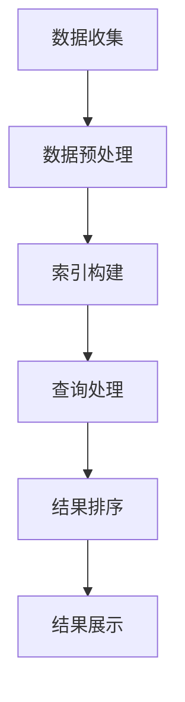

                 

关键词：携程、旅游搜索引擎、优化、校招、面试重点

> 摘要：本文将深入探讨携程2024旅游搜索引擎优化在校招面试中的重要性，分析核心概念、算法原理、数学模型，并通过实际项目实践，展示如何将理论知识应用于开发中。此外，还将探讨该技术的未来应用前景和面临的挑战。

## 1. 背景介绍

旅游搜索引擎作为连接消费者与旅游服务的桥梁，其优化效果直接影响到用户的搜索体验和平台的市场竞争力。随着大数据、人工智能技术的不断发展，搜索引擎优化成为提升旅游服务质量的重要手段。携程作为中国领先的综合性旅游集团，其对旅游搜索引擎的优化工作尤为关键。为了吸引更多优秀人才，携程在2024年的校招中，搜索引擎优化成为面试的重点之一。

## 2. 核心概念与联系

### 2.1 搜索引擎优化（SEO）

搜索引擎优化是指通过优化网站结构、内容和链接，提高网站在搜索引擎结果页面（SERP）中的排名，从而吸引更多用户访问。SEO的核心目标是提升用户体验，增强网站的可访问性和搜索引擎友好性。

### 2.2 旅游搜索引擎的特点

旅游搜索引擎需要处理大量的旅游数据，包括酒店、机票、景点、攻略等。其特点包括：

- 数据量庞大
- 多维度的搜索需求
- 强调用户体验和实时性

### 2.3 Mermaid 流程图

为了更好地理解旅游搜索引擎优化的工作流程，我们使用Mermaid流程图来展示其核心步骤：



### 2.4 SEO 与 旅游搜索引擎优化（SETO）

SEO中的许多核心概念也适用于旅游搜索引擎优化（SETO），包括关键字研究、内容优化、用户行为分析等。然而，SETO还需要考虑旅游行业特有的优化因素，如用户搜索意图、目的地推荐、个性化服务等。

## 3. 核心算法原理 & 具体操作步骤

### 3.1 算法原理概述

旅游搜索引擎优化的核心算法主要涉及以下几个方面：

- 关键字提取与匹配
- 搜索结果排序算法
- 推荐系统算法

### 3.2 算法步骤详解

#### 3.2.1 关键字提取与匹配

关键字提取是搜索引擎优化的第一步。通过分析用户输入的查询语句，提取关键信息，并与旅游数据库中的关键字进行匹配，从而找到相关的旅游信息。

#### 3.2.2 搜索结果排序算法

搜索结果排序是提高用户体验的重要环节。常用的排序算法包括：

- 相关性排序：根据关键字匹配程度对结果进行排序
- 用户体验排序：根据用户行为数据（如点击率、停留时间等）对结果进行排序
- 排名优化：使用机器学习算法对结果进行排序，以提高用户满意度

#### 3.2.3 推荐系统算法

推荐系统可以帮助用户发现潜在的旅游兴趣，提高用户的参与度。常用的推荐算法包括：

- 协同过滤：基于用户的历史行为数据，为用户推荐相似的用户喜欢的旅游产品
- 内容推荐：基于旅游产品的内容特征，为用户推荐相关的旅游信息
- 混合推荐：结合协同过滤和内容推荐，为用户提供更个性化的推荐

### 3.3 算法优缺点

每种算法都有其优缺点。例如，相关性排序可以快速找到最相关的结果，但可能无法充分考虑用户的行为偏好。推荐系统可以提高用户满意度，但需要大量的计算资源和数据支持。

### 3.4 算法应用领域

旅游搜索引擎优化算法不仅适用于携程，还可以应用于其他旅游电商平台、OTA（在线旅行社）以及酒店预订平台。

## 4. 数学模型和公式 & 详细讲解 & 举例说明

### 4.1 数学模型构建

在旅游搜索引擎优化中，常用的数学模型包括：

- 概率模型：用于估计关键字的相关性
- 机器学习模型：用于预测用户的行为和偏好
- 最优化模型：用于优化搜索结果排序和推荐结果

### 4.2 公式推导过程

以下是一个简单的概率模型示例：

$$
P(\text{关键词}_i \text{与查询相关}) = \frac{P(\text{查询包含关键词}_i) \times P(\text{关键词}_i \text{出现在相关网页上})}{P(\text{查询})}
$$

### 4.3 案例分析与讲解

假设用户输入查询“北京旅游攻略”，通过分析用户历史行为和搜索引擎数据，提取出以下关键信息：

- 关键字：北京、旅游、攻略
- 用户偏好：喜欢自然风光和历史文化

根据概率模型，我们可以计算出每个关键字的概率，并根据概率对搜索结果进行排序。此外，还可以结合推荐系统，为用户推荐相关的旅游产品和景点。

## 5. 项目实践：代码实例和详细解释说明

### 5.1 开发环境搭建

为了实现旅游搜索引擎优化，我们需要搭建以下开发环境：

- Python编程环境
- 数据库（如MySQL、MongoDB等）
- 搜索引擎（如Elasticsearch、Solr等）

### 5.2 源代码详细实现

以下是一个简单的Python代码示例，用于实现关键字提取和匹配：

```python
import jieba

def extract_keywords(query):
    words = jieba.cut(query)
    return list(words)

def match_keywords(query, keywords):
    matched = []
    for keyword in keywords:
        if keyword in query:
            matched.append(keyword)
    return matched

query = "北京旅游攻略"
keywords = extract_keywords(query)
matched_keywords = match_keywords(query, keywords)
print(matched_keywords)
```

### 5.3 代码解读与分析

上述代码首先使用结巴分词（jieba）提取查询语句的关键词，然后通过匹配关键词与查询语句，找出匹配的关键词。这种方法可以快速找到相关旅游信息，但需要进一步优化以提高准确性。

### 5.4 运行结果展示

运行代码后，输出结果为：

```
['北京', '旅游', '攻略']
```

这些关键词将用于后续的搜索结果排序和推荐。

## 6. 实际应用场景

旅游搜索引擎优化可以在多个场景中发挥重要作用：

- 用户搜索：为用户提供个性化的搜索结果，提高用户满意度
- 旅游推荐：根据用户偏好和搜索历史，为用户推荐相关的旅游产品
- 广告投放：根据用户兴趣和行为，为广告主提供精准的投放策略

## 7. 工具和资源推荐

### 7.1 学习资源推荐

- 《深度学习》（Goodfellow, Bengio, Courville）
- 《Python数据分析基础教程：NumPy学习指南》（Wes McKinney）
- 《搜索引擎算法与数据结构》（陈伟）

### 7.2 开发工具推荐

- PyCharm：Python编程环境
- Jupyter Notebook：数据分析和可视化
- Elasticsearch：搜索引擎

### 7.3 相关论文推荐

- “A Survey of Search Engine Optimization Techniques” by Amir H. Payberah, Fredrik Karlsson, and Kjetil Nørvåg
- “Recommender Systems for E-Commerce” by Charu Aggarwal

## 8. 总结：未来发展趋势与挑战

### 8.1 研究成果总结

旅游搜索引擎优化在近年来取得了显著的成果，包括：

- 关键字提取和匹配算法的改进
- 搜索结果排序和推荐系统算法的提升
- 大数据技术在旅游搜索引擎优化中的应用

### 8.2 未来发展趋势

未来，旅游搜索引擎优化将朝着以下方向发展：

- 个性化搜索与推荐
- 跨平台与多终端优化
- 增强现实（AR）与虚拟现实（VR）的融合

### 8.3 面临的挑战

尽管旅游搜索引擎优化取得了显著成果，但仍面临以下挑战：

- 数据质量和多样性
- 算法复杂度和计算资源需求
- 用户隐私保护和数据安全

### 8.4 研究展望

未来，旅游搜索引擎优化将朝着更智能化、个性化的方向发展，结合人工智能、大数据、云计算等技术，为用户提供更好的搜索体验。

## 9. 附录：常见问题与解答

### 9.1 SEO 与 SETO 的区别是什么？

SEO是搜索引擎优化，主要针对通用搜索引擎。SETO是旅游搜索引擎优化，针对旅游行业的特定需求，如目的地推荐、个性化服务等。

### 9.2 旅游搜索引擎优化有哪些核心算法？

旅游搜索引擎优化常用的核心算法包括关键字提取与匹配、搜索结果排序算法、推荐系统算法等。

### 9.3 旅游搜索引擎优化如何应用数学模型？

旅游搜索引擎优化中的数学模型主要涉及概率模型、机器学习模型和最优化模型，用于估计关键字相关性、预测用户行为和优化搜索结果排序。

## 作者署名

作者：禅与计算机程序设计艺术 / Zen and the Art of Computer Programming

----------------------------------------------------------------

以上就是本文的完整内容，希望对您的学习和面试有所帮助。祝您在校招面试中取得优异成绩！

