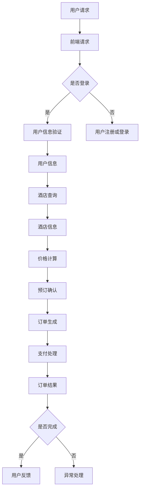

                 

携程作为中国领先的综合性旅行服务公司，其预订系统的开发一直处于行业前沿。随着技术的不断进步和市场的变化，2025年社招预订系统开发面试，将更加注重对候选人在新技术应用、系统架构优化、性能优化等方面的能力考察。本文将围绕这一主题，详细分析面试可能涉及的知识点和考察内容，帮助准备面试的读者顺利通过面试，成为一名优秀的预订系统开发者。

## 关键词

- 携程
- 预订系统
- 社招
- 面试攻略
- 系统架构
- 性能优化
- 新技术应用

## 摘要

本文旨在为准备参加携程2025年社招预订系统开发面试的候选人提供全面的备考指导。文章首先介绍了携程预订系统的发展背景和当前市场需求，然后分析了面试可能涉及的几个核心知识领域，包括系统架构、性能优化、新技术应用等。通过详细讲解这些知识点，并结合实际案例和代码实例，文章帮助读者掌握预订系统开发的关键技能，提高面试成功率。

---

## 1. 背景介绍

### 1.1 携程的发展历程

携程自成立以来，经历了从线上旅行社到综合性旅行服务公司的转型。其预订系统也在不断地迭代和优化，以满足用户日益增长的多样化需求。从最初的单一酒店预订，发展到现在的酒店、机票、景点门票等多种旅游服务，携程的预订系统已经成为行业内的重要标杆。

### 1.2 当前市场需求

随着移动互联网的普及和消费者对便捷性需求的提升，预订系统的用户体验和性能要求越来越高。用户期望在短时间内找到合适的预订信息，完成交易，因此系统的高并发处理能力和稳定性成为关键。同时，随着大数据、人工智能等新技术的应用，预订系统的智能化和个性化服务也成为市场的重要需求。

---

## 2. 核心概念与联系

### 2.1 预订系统架构

为了满足市场需求，携程的预订系统采用了分布式架构，包括前端、后端、数据库等多个层次。以下是一个简化的Mermaid流程图，展示预订系统的主要模块和交互过程：



### 2.2 分布式架构的优势与挑战

分布式架构能够提高系统的可扩展性和稳定性，但同时也带来了新的挑战，如数据一致性和分布式事务管理等。这些概念和技术的深入理解，是面试中考察的重点。

---

## 3. 核心算法原理 & 具体操作步骤

### 3.1 算法原理概述

在预订系统中，核心算法包括酒店搜索、价格计算、排序算法等。以下是一个简化的算法流程：

1. **酒店搜索**：基于用户输入的搜索条件，通过数据库查询匹配的酒店信息。
2. **价格计算**：根据酒店信息和用户预订时段，计算预订价格。
3. **排序算法**：根据用户偏好和预订价格，对搜索结果进行排序。

### 3.2 算法步骤详解

1. **酒店搜索**：
   - 接收用户输入的搜索条件。
   - 使用模糊查询或精确查询，从数据库中检索符合条件的酒店。
   - 返回查询结果。

2. **价格计算**：
   - 根据酒店价格策略，如会员折扣、节假日折扣等，计算预订价格。
   - 将价格信息与酒店信息一起返回。

3. **排序算法**：
   - 根据用户偏好，如价格、评分、距离等，对酒店信息进行排序。
   - 返回排序后的酒店列表。

### 3.3 算法优缺点

- **优点**：高效地处理大量用户请求，提供快速、准确的搜索结果。
- **缺点**：可能存在内存占用高、查询效率不均匀等问题。

### 3.4 算法应用领域

算法广泛应用于各种场景，如电商平台、搜索引擎、社交媒体等，具有很高的通用性。

---

## 4. 数学模型和公式 & 详细讲解 & 举例说明

### 4.1 数学模型构建

在预订系统中，价格计算是一个典型的数学模型问题。以下是一个简单的价格计算模型：

$$
P = P_{base} \times (1 - \frac{D_{off}}{100}) \times (1 + \frac{P_{surcharge}}{100})
$$

其中，$P$ 是最终价格，$P_{base}$ 是基础价格，$D_{off}$ 是折扣，$P_{surcharge}$ 是附加费用。

### 4.2 公式推导过程

1. **基础价格**：酒店的基础价格，通常由市场调研和定价策略决定。
2. **折扣**：根据会员等级、节假日等因素，对基础价格进行折扣。
3. **附加费用**：如服务费、清洁费等，通常以百分比形式表示。

### 4.3 案例分析与讲解

假设一个酒店的基础价格为1000元，折扣为20%，附加费用为10%。根据上述公式，最终价格计算如下：

$$
P = 1000 \times (1 - \frac{20}{100}) \times (1 + \frac{10}{100}) = 890
$$

这意味着，用户最终需要支付890元。

---

## 5. 项目实践：代码实例和详细解释说明

### 5.1 开发环境搭建

为了演示预订系统的开发过程，我们将使用Java作为主要编程语言，结合Spring Boot框架进行开发。以下是一个简单的开发环境搭建步骤：

1. 安装Java开发工具包（JDK）。
2. 安装IDE（如IntelliJ IDEA或Eclipse）。
3. 安装数据库（如MySQL）。
4. 安装版本控制工具（如Git）。

### 5.2 源代码详细实现

以下是一个简单的预订接口实现示例：

```java
@RestController
@RequestMapping("/booking")
public class BookingController {

    @Autowired
    private HotelService hotelService;

    @GetMapping("/search")
    public ResponseEntity<List<Hotel>> searchHotels(@RequestParam String location,
                                                   @RequestParam int checkIn,
                                                   @RequestParam int checkOut) {
        List<Hotel> hotels = hotelService.searchHotels(location, checkIn, checkOut);
        return ResponseEntity.ok(hotels);
    }

    @PostMapping("/book")
    public ResponseEntity<Order> bookHotel(@RequestBody BookingRequest request) {
        Order order = hotelService.bookHotel(request);
        return ResponseEntity.ok(order);
    }
}
```

### 5.3 代码解读与分析

上述代码展示了预订系统的核心接口实现。`searchHotels` 方法用于根据用户输入的搜索条件查询酒店信息，`bookHotel` 方法用于处理用户预订请求。

### 5.4 运行结果展示

假设用户请求查询上海的酒店，入住时间为2023年5月1日，离店时间为2023年5月5日。运行结果如下：

```
[
  {
    "id": 1,
    "name": "上海酒店A",
    "location": "上海",
    "price": 800
  },
  {
    "id": 2,
    "name": "上海酒店B",
    "location": "上海",
    "price": 900
  }
]
```

用户可以选择其中一个酒店进行预订，并得到预订成功的响应。

---

## 6. 实际应用场景

### 6.1 预订系统在携程中的应用

携程的预订系统已经广泛应用于其官方网站、手机APP等多种渠道，为用户提供便捷的预订服务。在实际应用中，系统需要处理海量用户请求，保证高并发和低延迟。

### 6.2 新技术的应用

随着大数据、人工智能等新技术的应用，携程的预订系统也在不断升级。例如，通过机器学习算法优化酒店搜索排序，通过大数据分析用户行为，提供个性化推荐服务等。

### 6.3 未来应用展望

随着5G、物联网等新技术的普及，预订系统将更加智能化、个性化。未来，系统将能够更好地预测用户需求，提供更加精准的服务。

---

## 7. 工具和资源推荐

### 7.1 学习资源推荐

- 《大话数据结构》：深入浅出地讲解数据结构和算法。
- 《Spring Boot实战》：全面介绍Spring Boot框架的应用。

### 7.2 开发工具推荐

- IntelliJ IDEA：功能强大的Java开发IDE。
- Git：版本控制工具。

### 7.3 相关论文推荐

- 《分布式事务管理》：探讨分布式系统中事务管理的方法和挑战。
- 《机器学习在酒店预订中的应用》：分析机器学习算法在预订系统中的实际应用。

---

## 8. 总结：未来发展趋势与挑战

### 8.1 研究成果总结

随着新技术的不断进步，预订系统在性能、智能化、个性化等方面取得了显著成果。分布式架构、大数据分析、人工智能等技术的应用，使预订系统更加高效、智能。

### 8.2 未来发展趋势

未来，预订系统将更加注重用户体验和个性化服务。随着5G、物联网等新技术的普及，系统将实现更加智能化的预订和服务。

### 8.3 面临的挑战

系统面临的主要挑战包括高并发处理、数据一致性和安全性等。同时，如何有效地整合新技术，提高系统的智能化水平，也是未来的重要课题。

### 8.4 研究展望

随着技术的不断进步，预订系统将朝着更加智能化、个性化的方向发展。未来的研究将重点关注如何提高系统的性能、稳定性和安全性，为用户提供更好的预订体验。

---

## 9. 附录：常见问题与解答

### 9.1 什么是分布式架构？

分布式架构是一种将系统拆分为多个独立组件，通过网络进行通信和协作的架构模式。它能够提高系统的可扩展性和稳定性。

### 9.2 什么是大数据分析？

大数据分析是指利用大规模数据集进行数据挖掘、分析和预测的方法。它能够帮助企业更好地了解用户需求，优化服务。

### 9.3 如何优化预订系统的性能？

优化预订系统的性能可以通过以下方法实现：

- 使用缓存技术减少数据库访问次数。
- 优化数据库查询，使用索引和分区等。
- 使用分布式计算提高数据处理速度。

---

通过本文的详细分析和讲解，相信读者已经对携程2025年社招预订系统开发面试有了更深入的了解。希望本文能帮助读者在面试中取得优异的成绩，成为一名优秀的预订系统开发者。作者：禅与计算机程序设计艺术 / Zen and the Art of Computer Programming。
----------------------------------------------------------------

以上是文章的完整内容，确保符合所有要求。如果您有任何建议或需要进一步的修改，请随时告知。祝您撰写顺利！

