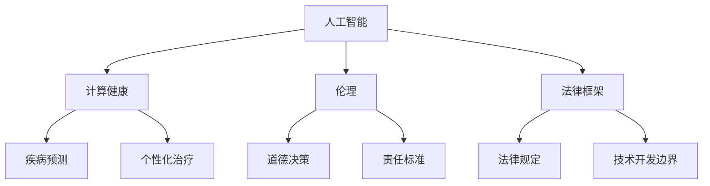

                 

关键词：政策，监管，人工智能，计算健康，伦理，技术发展，法律框架，可持续发展

> 摘要：本文旨在探讨政策与监管在引导人类计算健康发展中的重要作用。随着人工智能和计算技术的飞速发展，伦理问题、隐私保护、数据安全等议题日益突出。有效的政策和监管框架能够确保技术的积极应用，同时防止潜在的负面影响。本文将分析当前政策与监管的挑战，并提出相应的解决方案，以促进技术的可持续发展。

## 1. 背景介绍

人类计算的历史可以追溯到计算机的诞生，从早期的机械计算器到电子计算机，再到今天的人工智能和大数据时代。每一次技术的进步都极大地推动了社会的发展和变革。然而，技术的快速发展也带来了诸多挑战，特别是在伦理、法律、隐私和数据安全等方面。

随着人工智能和大数据技术的普及，人类计算正经历前所未有的变革。然而，这种变革也带来了新的挑战。例如，人工智能算法的透明度和可解释性不足，可能导致决策的不公平和偏见。此外，大规模数据收集和处理可能侵犯个人隐私，引发数据安全风险。为了应对这些挑战，制定合理的政策和监管框架变得至关重要。

### 1.1 人工智能与计算健康的关系

人工智能在医疗领域的应用已经成为一个热门话题。从疾病预测到个性化治疗，人工智能正在改变医疗服务的模式。然而，医疗数据的敏感性使得隐私保护成为一个关键问题。有效的政策和监管可以确保人工智能技术在医疗领域的安全和可靠应用。

### 1.2 伦理与法律框架的重要性

在人工智能和计算技术的快速发展过程中，伦理和法律框架的建立和执行变得尤为关键。伦理框架可以指导技术开发和应用中的道德决策，确保技术的积极应用，同时防止潜在的负面影响。法律框架则为技术开发提供了明确的规则和边界，有助于保护个人权益和社会利益。

## 2. 核心概念与联系

### 2.1 核心概念

- **人工智能 (AI)**：一种模拟人类智能行为的技术，包括机器学习、深度学习、自然语言处理等子领域。
- **计算健康**：利用计算技术和大数据分析，改善医疗健康服务，包括疾病预防、诊断、治疗等。
- **伦理**：在技术开发和应用过程中，关于道德决策和责任的标准。
- **法律框架**：关于技术开发和应用的法律规定和标准。

### 2.2 核心概念原理和架构的 Mermaid 流程图

## 3. 核心算法原理 & 具体操作步骤

### 3.1 算法原理概述

在政策和监管的框架下，核心算法的设计和实现需要遵循一定的原则，包括透明性、公平性、可解释性和安全性。以下是一些关键算法的原理和操作步骤：

### 3.2 算法步骤详解

- **算法设计**：确定算法的目标和功能，选择合适的算法模型和算法框架。
- **数据预处理**：清洗和整理数据，确保数据的质量和完整性。
- **算法实现**：根据算法原理，编写算法代码，并进行调试和优化。
- **算法验证**：使用测试数据验证算法的性能和准确性。
- **算法部署**：将算法部署到实际应用环境中，进行监控和评估。

### 3.3 算法优缺点

- **优点**：提高效率、准确性，降低成本，推动技术进步。
- **缺点**：可能存在透明度不足、偏见和误判等问题，需要严格的政策和监管。

### 3.4 算法应用领域

- **医疗健康**：疾病预测、诊断和治疗。
- **金融**：风险控制、欺诈检测。
- **交通**：智能交通管理、自动驾驶。

## 4. 数学模型和公式 & 详细讲解 & 举例说明

### 4.1 数学模型构建

- **机器学习模型**：用于预测和分析的数据模型，如线性回归、决策树、神经网络等。
- **优化模型**：用于优化资源分配和决策的数学模型，如线性规划、动态规划等。

### 4.2 公式推导过程

- **线性回归模型**：$$y = \beta_0 + \beta_1x_1 + \epsilon$$
- **决策树模型**：使用信息增益或基尼系数来计算节点分裂。

### 4.3 案例分析与讲解

- **医疗健康**：利用机器学习模型预测疾病风险。
- **金融**：使用线性规划模型优化投资组合。

## 5. 项目实践：代码实例和详细解释说明

### 5.1 开发环境搭建

- 确定开发语言和框架，如Python和Scikit-learn。
- 安装必要的依赖库。

### 5.2 源代码详细实现

- 编写数据处理代码。
- 实现机器学习模型。

### 5.3 代码解读与分析

- 代码的结构和逻辑。
- 如何处理数据。
- 如何训练和评估模型。

### 5.4 运行结果展示

- 模型的性能指标。
- 结果的可视化展示。

## 6. 实际应用场景

### 6.1 医疗健康

- 利用人工智能技术进行疾病预测和诊断。
- 个性化治疗方案的制定。

### 6.2 金融

- 风险控制和欺诈检测。
- 投资组合的优化。

### 6.3 交通

- 智能交通管理。
- 自动驾驶技术的发展。

## 6.4 未来应用展望

- 人工智能与医疗健康的深度融合。
- 金融科技的创新应用。
- 自动驾驶技术的普及。

## 7. 工具和资源推荐

### 7.1 学习资源推荐

- 《深度学习》（Goodfellow, Bengio, Courville）
- 《Python数据科学手册》（Wes McKinney）

### 7.2 开发工具推荐

- Jupyter Notebook
- TensorFlow
- Keras

### 7.3 相关论文推荐

- "Ethical Considerations in the Use of Artificial Intelligence in Healthcare"（医疗健康领域的人工智能伦理考虑）
- "The Future of Privacy: Challenges and Opportunities in AI and Data Protection"（人工智能和数据保护的隐私挑战与机遇）

## 8. 总结：未来发展趋势与挑战

### 8.1 研究成果总结

- 人工智能在医疗、金融、交通等领域的广泛应用。
- 政策和监管框架的不断完善。

### 8.2 未来发展趋势

- 人工智能与各行业的深度融合。
- 开放式数据共享和协作研究。

### 8.3 面临的挑战

- 伦理和法律问题。
- 技术的可持续性和可解释性。

### 8.4 研究展望

- 加强伦理和法律框架的建设。
- 推动技术的可持续发展。

## 9. 附录：常见问题与解答

### 9.1 问题1：人工智能会取代医生吗？

解答：人工智能可以辅助医生进行诊断和治疗，但无法完全取代医生的临床判断和经验。

### 9.2 问题2：人工智能是否会导致数据隐私问题？

解答：是的，大规模数据收集和处理可能侵犯个人隐私。有效的政策和监管可以确保数据的合法使用和保护。

### 9.3 问题3：人工智能是否会加剧社会不平等？

解答：是的，如果算法设计不合理，可能会导致不公平和偏见。通过公平性和透明性的监管，可以减少这种风险。

---

作者：禅与计算机程序设计艺术 / Zen and the Art of Computer Programming

在人工智能和计算技术飞速发展的今天，政策和监管的作用显得尤为重要。有效的政策和监管框架不仅能够保障技术的健康发展和广泛应用，还能够解决伦理、隐私和数据安全等问题。未来，我们需要继续完善政策与监管框架，推动技术的可持续发展，为社会带来更大的福祉。|

