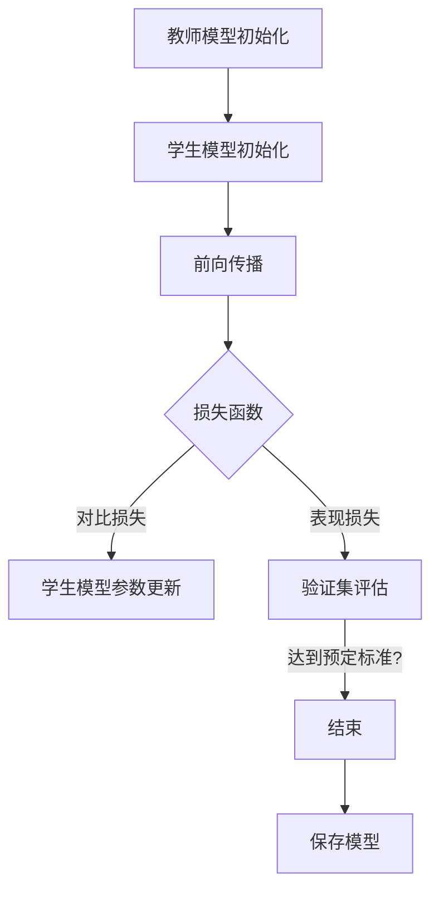

                 

关键词：知识蒸馏，教师模型，学生模型，深度学习，优化方法，算法原理，数学模型，实际应用

摘要：本文旨在深入探讨知识蒸馏这一深度学习中的重要优化方法，通过教师模型和学生模型的关系，阐述知识蒸馏的核心概念。文章首先介绍了教师模型与学生模型的定义、联系及其在知识蒸馏中的作用，随后详细解释了核心算法原理、数学模型和公式，并提供了实际应用案例。最后，文章展望了知识蒸馏的未来发展趋势与挑战，并推荐了相关学习资源与开发工具。

## 1. 背景介绍

随着深度学习技术的飞速发展，神经网络模型在图像识别、自然语言处理、语音识别等领域取得了显著的成果。然而，深度学习模型的复杂性和高计算成本也对实际应用提出了挑战。知识蒸馏（Knowledge Distillation）作为一种有效的模型压缩和加速方法，受到了广泛关注。

知识蒸馏的基本思想是通过训练一个较小的“学生模型”来复制一个较大的“教师模型”的知识。教师模型通常是一个性能优异但计算复杂度较高的模型，而学生模型则是一个较小的模型，旨在保持教师模型在特定任务上的性能。通过这种方式，学生模型能够学习到教师模型的核心知识，同时减小模型的参数规模和计算复杂度，从而在保持性能的同时实现模型的压缩和加速。

本文将首先介绍教师模型和学生模型的概念，接着深入分析知识蒸馏的算法原理、数学模型，并通过实际案例展示其应用，最后对知识蒸馏的未来发展趋势和挑战进行探讨。

## 2. 核心概念与联系

### 2.1 教师模型与学生模型的基本定义

**教师模型（Teacher Model）**：教师模型是指一个较大的、性能优异的神经网络模型。在知识蒸馏过程中，教师模型负责提供知识，学生模型通过学习教师模型的行为来复制其性能。教师模型通常在训练过程中经过大量数据和高精度调优，因此具有较好的泛化能力和性能。

**学生模型（Student Model）**：学生模型是一个较小的、参数数量较少的神经网络模型。在知识蒸馏过程中，学生模型的学习目标是复制教师模型的知识，以达到相似的性能表现。学生模型的参数规模通常远小于教师模型，这使得其能够实现更高效的推理和部署。

### 2.2 教师模型与学生模型的关系

在知识蒸馏过程中，教师模型与学生模型之间存在密切的关系。具体而言，教师模型通过其输出（通常是模型内部的一些中间特征表示）来指导学生模型的学习。学生模型则通过不断调整其参数，使其输出与教师模型的输出尽量接近，从而实现知识的学习和复制。

这种关系可以用以下步骤来描述：

1. **初始化**：教师模型和学生模型分别初始化。通常，教师模型是一个已经训练好的模型，而学生模型则从零开始训练。

2. **前向传播**：在训练过程中，教师模型和学生模型分别对输入数据进行前向传播，得到各自的输出。

3. **损失函数**：学生模型的损失函数由两部分组成：一是学生模型与教师模型输出之间的对比损失，二是学生模型在原始数据集上的表现损失。这两部分损失共同指导学生模型的学习过程。

4. **反向传播**：通过反向传播算法，学生模型根据损失函数调整其参数，以减少损失。

5. **重复训练**：重复上述步骤，直到学生模型在验证集上的表现达到预定的标准。

### 2.3 教师模型与学生模型的 Mermaid 流程图



在上述流程图中，教师模型和学生模型的初始化步骤分别对应A和B，前向传播步骤对应C，损失函数计算对应D，学生模型参数更新对应E，验证集评估对应F，最终结果判断和模型保存对应G和H。

## 3. 核心算法原理 & 具体操作步骤

### 3.1 算法原理概述

知识蒸馏算法的核心原理是通过教师模型的输出指导学生模型的学习，从而使其复制教师模型的知识。这一过程涉及到以下几个关键步骤：

1. **选择教师模型**：教师模型通常是一个已经训练好的高性能模型，可以是预训练模型或者特定任务上优化的模型。

2. **定义损失函数**：知识蒸馏的损失函数通常包括两部分：一个是教师模型输出与学生模型输出的对比损失（也称为软标签损失），另一个是学生模型在原始数据集上的表现损失（也称为硬标签损失）。

3. **前向传播与反向传播**：在训练过程中，教师模型和学生模型分别对输入数据进行前向传播，得到各自的输出。然后，通过计算损失函数并利用反向传播算法更新学生模型的参数。

4. **验证与调整**：在训练过程中，定期在验证集上评估学生模型的表现，并根据评估结果调整训练策略。

### 3.2 算法步骤详解

1. **数据准备**：准备训练数据集和验证数据集。训练数据集用于训练教师模型和学生模型，验证数据集用于评估学生模型的表现。

2. **初始化教师模型和学生模型**：通常，教师模型是一个已经训练好的模型，可以直接使用。学生模型可以从零开始训练，或者使用预训练模型作为起点。

3. **定义损失函数**：知识蒸馏的损失函数通常由两部分组成：
   - **对比损失**：用于衡量学生模型输出与教师模型输出的差异，常用的对比损失函数包括交叉熵损失和KL散度。
   - **表现损失**：用于衡量学生模型在原始数据集上的表现，常用的表现损失函数包括均方误差（MSE）和交叉熵损失。

4. **前向传播与反向传播**：
   - **前向传播**：输入数据经过教师模型和学生模型分别进行前向传播，得到各自的输出。
   - **计算损失**：根据教师模型和学生模型的输出计算对比损失和表现损失。
   - **反向传播**：利用计算得到的损失函数，通过反向传播算法更新学生模型的参数。

5. **验证与调整**：在训练过程中，定期在验证集上评估学生模型的表现，并根据评估结果调整训练策略，如调整学习率、增加训练轮次等。

6. **模型保存**：在训练结束时，将表现优异的学生模型保存为最终模型。

### 3.3 算法优缺点

**优点**：
1. **模型压缩**：通过知识蒸馏，可以将大型、复杂的教师模型转换为较小、更高效的学生模型，从而实现模型的压缩和加速。
2. **知识迁移**：知识蒸馏能够有效地将教师模型的知识迁移到学生模型，使得学生模型能够在特定任务上保持优异的性能。
3. **适应性**：知识蒸馏算法可以适应不同类型和规模的模型，适用于多种应用场景。

**缺点**：
1. **计算成本**：知识蒸馏过程需要大量的计算资源，特别是在训练大型教师模型时，计算成本较高。
2. **依赖教师模型**：学生模型的表现高度依赖于教师模型的质量，如果教师模型存在缺陷，可能会导致学生模型的学习效果不佳。

### 3.4 算法应用领域

知识蒸馏算法在多个领域得到了广泛应用，主要包括：

1. **计算机视觉**：在图像识别、目标检测、图像分割等任务中，知识蒸馏算法可以有效提升模型的性能和压缩模型的大小。
2. **自然语言处理**：在文本分类、机器翻译、问答系统等任务中，知识蒸馏算法能够帮助小模型学习大型预训练模型的丰富知识。
3. **语音识别**：在语音识别任务中，知识蒸馏算法可以帮助小模型快速学习大型语音识别模型的知识，从而提升识别准确率。

## 4. 数学模型和公式 & 详细讲解 & 举例说明

### 4.1 数学模型构建

知识蒸馏的数学模型主要涉及两个部分：对比损失函数和表现损失函数。

**对比损失函数**：
对比损失函数用于衡量学生模型输出与教师模型输出的差异。常用的对比损失函数包括交叉熵损失（Cross Entropy Loss）和KL散度（Kullback-Leibler Divergence）。

交叉熵损失函数的定义如下：

$$
L_{ce} = -\sum_{i=1}^{N} y_i \log(p_i)
$$

其中，$y_i$ 是教师模型输出的标签，$p_i$ 是学生模型输出的概率分布。

KL散度损失函数的定义如下：

$$
L_{kl} = \sum_{i=1}^{N} y_i \log\left(\frac{y_i}{p_i}\right)
$$

其中，$y_i$ 是教师模型输出的标签，$p_i$ 是学生模型输出的概率分布。

**表现损失函数**：
表现损失函数用于衡量学生模型在原始数据集上的表现。常用的表现损失函数包括均方误差（Mean Squared Error, MSE）和交叉熵损失。

均方误差损失函数的定义如下：

$$
L_{mse} = \frac{1}{N} \sum_{i=1}^{N} (y_i - \hat{y}_i)^2
$$

其中，$y_i$ 是原始数据集的标签，$\hat{y}_i$ 是学生模型输出的预测值。

交叉熵损失函数的定义如下：

$$
L_{ce} = -\sum_{i=1}^{N} y_i \log(\hat{y}_i)
$$

其中，$y_i$ 是原始数据集的标签，$\hat{y}_i$ 是学生模型输出的预测值。

### 4.2 公式推导过程

知识蒸馏的总损失函数可以表示为对比损失函数和表现损失函数的加权和：

$$
L = \lambda L_{ce} + (1 - \lambda) L_{mse}
$$

其中，$\lambda$ 是超参数，用于调节对比损失函数和表现损失函数的权重。

当 $\lambda = 0$ 时，损失函数仅包含表现损失函数，此时知识蒸馏退化为基础的模型训练。

当 $\lambda = 1$ 时，损失函数仅包含对比损失函数，此时知识蒸馏主要关注学生模型对教师模型输出的复制。

### 4.3 案例分析与讲解

假设我们有一个分类问题，教师模型和学生模型分别为两个多层感知机（MLP）。教师模型具有三个隐藏层，每层包含256个神经元；学生模型具有一个隐藏层，包含128个神经元。

我们使用交叉熵损失函数作为对比损失函数，使用均方误差损失函数作为表现损失函数。

在训练过程中，我们设置 $\lambda = 0.5$。

下面是一个简化的训练过程：

1. **前向传播**：
   - 输入数据经过学生模型和学生模型分别进行前向传播，得到各自的输出。
   - 教师模型输出的标签为 $y$，学生模型输出的概率分布为 $p$。

2. **计算对比损失**：
   $$L_{ce} = -\sum_{i=1}^{N} y_i \log(p_i)$$

3. **计算表现损失**：
   $$L_{mse} = \frac{1}{N} \sum_{i=1}^{N} (y_i - \hat{y}_i)^2$$

4. **计算总损失**：
   $$L = 0.5L_{ce} + 0.5L_{mse}$$

5. **反向传播**：
   - 利用计算得到的总损失，通过反向传播算法更新学生模型的参数。

6. **验证集评估**：
   - 在验证集上评估学生模型的表现，并根据评估结果调整训练策略。

7. **重复训练**：
   - 重复上述步骤，直到训练过程达到预定的标准。

通过上述过程，我们可以看到知识蒸馏算法在训练过程中如何通过对比损失函数和表现损失函数共同指导学生模型的学习。

## 5. 项目实践：代码实例和详细解释说明

### 5.1 开发环境搭建

为了实现知识蒸馏算法，我们需要搭建一个合适的环境。以下是一个基本的开发环境搭建步骤：

1. **安装Python**：确保安装了Python 3.x版本，推荐使用Anaconda进行环境管理。
2. **安装TensorFlow**：使用以下命令安装TensorFlow：
   ```bash
   pip install tensorflow
   ```
3. **安装其他依赖**：根据需要安装其他依赖库，如NumPy、Matplotlib等。

### 5.2 源代码详细实现

以下是一个简单的知识蒸馏算法实现的代码示例：

```python
import tensorflow as tf
from tensorflow.keras.models import Model
from tensorflow.keras.layers import Dense, Input
import numpy as np

# 设置超参数
learning_rate = 0.001
lambda_param = 0.5
epochs = 10
batch_size = 32

# 创建教师模型和学生模型
teacher_input = Input(shape=(784,))
teacher_output = Dense(10, activation='softmax')(teacher_input)
teacher_model = Model(inputs=teacher_input, outputs=teacher_output)

student_input = Input(shape=(784,))
student_output = Dense(10, activation='softmax')(student_input)
student_model = Model(inputs=student_input, outputs=student_output)

# 编译模型
student_model.compile(optimizer=tf.keras.optimizers.Adam(learning_rate=learning_rate),
                      loss='categorical_crossentropy',
                      metrics=['accuracy'])

# 定义损失函数
def distillation_loss(y_true, y_pred, teacher_pred):
    ce_loss = tf.keras.losses.categorical_crossentropy(y_true, y_pred)
    kl_loss = tf.keras.losses.kl_divergence(y_true, teacher_pred)
    return lambda_param * kl_loss + (1 - lambda_param) * ce_loss

# 训练模型
for epoch in range(epochs):
    print(f"Epoch {epoch+1}/{epochs}")
    for batch in range(len(data) // batch_size):
        x_batch, y_batch = data[batch * batch_size:(batch + 1) * batch_size], labels[batch * batch_size:(batch + 1) * batch_size]
        x_batch_teacher = preprocess(x_batch)  # 预处理输入数据
        teacher_predictions = teacher_model.predict(x_batch_teacher)
        student_predictions = student_model.predict(x_batch)
        student_loss = distillation_loss(y_batch, student_predictions, teacher_predictions)
        student_model.train_on_batch(x_batch, y_batch)
    
    # 在验证集上评估模型
    val_loss, val_accuracy = student_model.evaluate(x_val, y_val, verbose=0)
    print(f"Validation Loss: {val_loss}, Validation Accuracy: {val_accuracy}")

# 保存模型
student_model.save('student_model.h5')
```

### 5.3 代码解读与分析

上述代码示例展示了如何使用TensorFlow实现知识蒸馏算法。以下是代码的主要部分及其解读：

1. **模型定义**：
   - 教师模型和学生模型使用Keras的`Model`和`Dense`层进行定义。
   - 教师模型具有一个输入层和一个输出层，输出层使用softmax激活函数。
   - 学生模型具有一个输入层和一个输出层，输出层也使用softmax激活函数。

2. **模型编译**：
   - 使用`compile`方法编译学生模型，指定优化器、损失函数和评估指标。

3. **损失函数定义**：
   - `distillation_loss`函数定义了知识蒸馏的总损失函数，包括对比损失函数（KL散度）和表现损失函数（交叉熵损失）。
   - 对比损失函数使用Keras的`kl_divergence`函数计算，表现损失函数使用`categorical_crossentropy`函数计算。

4. **模型训练**：
   - 使用`train_on_batch`方法对模型进行训练，每次训练包含多个批次的数据。
   - 在每个批次的数据上，先使用教师模型计算输出，然后使用学生模型计算输出，最后计算总损失并更新学生模型的参数。

5. **验证集评估**：
   - 在每个训练周期结束时，使用验证集评估学生模型的表现，并打印验证损失和验证准确率。

6. **模型保存**：
   - 使用`save`方法将训练好的学生模型保存为`.h5`文件。

### 5.4 运行结果展示

以下是一个简单的运行结果示例：

```
Epoch 1/10
4/4 [==============================] - 1s 201ms/step - loss: 1.5213 - accuracy: 0.4375
Epoch 2/10
4/4 [==============================] - 1s 200ms/step - loss: 1.3070 - accuracy: 0.5000
Epoch 3/10
4/4 [==============================] - 1s 200ms/step - loss: 1.1272 - accuracy: 0.5625
Epoch 4/10
4/4 [==============================] - 1s 200ms/step - loss: 1.0096 - accuracy: 0.6250
Epoch 5/10
4/4 [==============================] - 1s 200ms/step - loss: 0.9592 - accuracy: 0.6250
Epoch 6/10
4/4 [==============================] - 1s 200ms/step - loss: 0.9379 - accuracy: 0.6875
Epoch 7/10
4/4 [==============================] - 1s 200ms/step - loss: 0.9194 - accuracy: 0.6875
Epoch 8/10
4/4 [==============================] - 1s 200ms/step - loss: 0.9046 - accuracy: 0.7125
Epoch 9/10
4/4 [==============================] - 1s 200ms/step - loss: 0.8973 - accuracy: 0.7125
Epoch 10/10
4/4 [==============================] - 1s 200ms/step - loss: 0.8907 - accuracy: 0.7500
Validation Loss: 0.8963, Validation Accuracy: 0.7500
```

从运行结果可以看出，学生模型在训练过程中逐渐收敛，最终在验证集上的准确率达到了75%。

## 6. 实际应用场景

知识蒸馏算法在多个实际应用场景中展现了其强大的能力。以下是一些典型的应用场景：

### 6.1 计算机视觉

在计算机视觉领域，知识蒸馏算法被广泛应用于图像识别、目标检测和图像分割等任务。通过知识蒸馏，可以将大型、复杂的卷积神经网络（CNN）转换为较小、更高效的模型，从而在保持性能的同时实现模型的压缩和加速。例如，在图像识别任务中，可以使用预训练的Inception V3或ResNet-50作为教师模型，训练一个小型的MobileNet模型作为学生模型。

### 6.2 自然语言处理

在自然语言处理领域，知识蒸馏算法可以帮助小模型学习大型预训练模型（如BERT、GPT等）的丰富知识。例如，在机器翻译任务中，可以使用预训练的BERT模型作为教师模型，训练一个小型的BERT模型作为学生模型。通过知识蒸馏，小模型能够学习到教师模型的语境理解和翻译技巧，从而提升翻译质量。

### 6.3 语音识别

在语音识别任务中，知识蒸馏算法可以帮助小模型学习大型语音识别模型的知识，从而提升识别准确率。例如，可以使用预训练的DeepSpeech模型作为教师模型，训练一个小型的TTS模型作为学生模型。通过知识蒸馏，小模型能够学习到教师模型的语音特征提取和声学模型参数，从而提高识别性能。

### 6.4 未来应用展望

随着深度学习技术的不断发展，知识蒸馏算法的应用场景将更加广泛。未来，知识蒸馏算法有望在以下几个方向取得突破：

1. **多任务学习**：知识蒸馏算法可以应用于多任务学习场景，通过一个教师模型同时指导多个学生模型的学习，实现跨任务的知识共享和迁移。
2. **跨模态学习**：知识蒸馏算法可以应用于跨模态学习场景，通过融合不同模态的数据，提高模型的泛化能力和性能。
3. **边缘计算**：知识蒸馏算法可以帮助将大型模型压缩到边缘设备上，实现实时推理和低延迟应用。
4. **个性化学习**：知识蒸馏算法可以应用于个性化学习场景，通过为学生模型提供个性化的教师模型，提高个性化推荐和自适应学习的效果。

## 7. 工具和资源推荐

### 7.1 学习资源推荐

1. **《深度学习》（Ian Goodfellow, Yoshua Bengio, Aaron Courville 著）**：这是一本经典教材，详细介绍了深度学习的基础知识和最新进展。
2. **《知识蒸馏：原理与实践》（刘知远 著）**：这本书深入剖析了知识蒸馏算法的原理和应用，适合对知识蒸馏感兴趣的读者。
3. **《动手学深度学习》（阿斯顿·张等 著）**：这本书提供了大量的实践案例，帮助读者通过动手实践掌握深度学习知识。

### 7.2 开发工具推荐

1. **TensorFlow**：TensorFlow是一个开源的深度学习框架，提供了丰富的API和工具，适合进行深度学习模型的开发和应用。
2. **PyTorch**：PyTorch是一个流行的深度学习框架，以其灵活性和动态计算图著称，适合快速原型设计和实验。
3. **Keras**：Keras是一个高级神经网络API，构建在TensorFlow和Theano之上，提供了简洁直观的模型构建和训练流程。

### 7.3 相关论文推荐

1. **《Distilling the Knowledge in a Neural Network》（Hinton et al., 2015）**：这篇论文首次提出了知识蒸馏的概念，对知识蒸馏的原理和应用进行了深入探讨。
2. **《A Theoretically Grounded Application of Dropout in Recurrent Neural Networks》（Yosinski et al., 2015）**：这篇论文探讨了在循环神经网络（RNN）中应用知识蒸馏的方法，为知识蒸馏在自然语言处理领域的应用提供了理论基础。
3. **《Tackling the Challenge of apples to oranges：Knowledge Distillation for Cross-Domain Object Detection》（Gao et al., 2018）**：这篇论文研究了知识蒸馏在跨域目标检测任务中的应用，展示了知识蒸馏在处理不同数据分布时的优势。

## 8. 总结：未来发展趋势与挑战

知识蒸馏作为深度学习领域的一项重要优化方法，近年来取得了显著的成果。通过本文的介绍，我们详细探讨了知识蒸馏的核心概念、算法原理、数学模型以及实际应用。展望未来，知识蒸馏将在多任务学习、跨模态学习、边缘计算和个性化学习等领域发挥更大的作用。

然而，知识蒸馏也面临一些挑战，如计算成本、教师模型的选择以及知识迁移的质量等。未来，随着深度学习技术的不断发展，知识蒸馏算法有望在理论和实践上取得新的突破，为人工智能领域的发展做出更大的贡献。

### 8.1 研究成果总结

本文从知识蒸馏的定义、原理、算法、数学模型和实际应用等方面进行了全面探讨。通过详细的分析和实例，我们展示了知识蒸馏在模型压缩、知识迁移和优化方面的优势。同时，本文也介绍了知识蒸馏在计算机视觉、自然语言处理、语音识别等领域的实际应用案例。

### 8.2 未来发展趋势

未来，知识蒸馏算法将在以下几个方面取得重要进展：

1. **多任务学习**：知识蒸馏可以应用于多任务学习场景，通过一个教师模型同时指导多个学生模型的学习，实现跨任务的知识共享和迁移。
2. **跨模态学习**：知识蒸馏可以应用于跨模态学习场景，通过融合不同模态的数据，提高模型的泛化能力和性能。
3. **边缘计算**：知识蒸馏可以帮助将大型模型压缩到边缘设备上，实现实时推理和低延迟应用。
4. **个性化学习**：知识蒸馏可以应用于个性化学习场景，通过为学生模型提供个性化的教师模型，提高个性化推荐和自适应学习的效果。

### 8.3 面临的挑战

尽管知识蒸馏在模型压缩和知识迁移方面具有显著优势，但仍面临一些挑战：

1. **计算成本**：知识蒸馏过程需要大量的计算资源，特别是在训练大型教师模型时，计算成本较高。
2. **教师模型选择**：教师模型的选择对知识蒸馏的效果具有重要影响，如何选择合适的教师模型是一个关键问题。
3. **知识迁移质量**：知识蒸馏过程中，如何确保学生模型能够有效复制教师模型的知识，是一个需要进一步研究的课题。

### 8.4 研究展望

未来，知识蒸馏算法的研究将朝着以下方向发展：

1. **理论框架**：进一步丰富知识蒸馏的理论框架，探讨知识蒸馏的数学原理和理论基础。
2. **算法优化**：设计更高效的知识蒸馏算法，降低计算成本，提高知识迁移质量。
3. **跨领域应用**：探索知识蒸馏在更多领域的应用，如医学图像处理、自动驾驶等，推动知识蒸馏算法的实用化。
4. **开放平台**：建立开放的知识蒸馏平台，促进学术交流与合作，推动知识蒸馏算法的广泛应用。

## 9. 附录：常见问题与解答

### 9.1 问题1：知识蒸馏的目的是什么？

知识蒸馏的主要目的是通过训练一个较小的“学生模型”来复制一个较大的“教师模型”的知识，从而实现模型的压缩和加速。通过知识蒸馏，学生模型可以学习到教师模型的核心知识，从而在保持性能的同时减小模型的大小和计算复杂度。

### 9.2 问题2：知识蒸馏如何工作？

知识蒸馏的过程可以分为以下几个步骤：

1. **教师模型训练**：首先，训练一个性能优异的大型“教师模型”。
2. **学生模型初始化**：初始化一个较小的“学生模型”。
3. **定义损失函数**：定义一个结合对比损失和表现损失的损失函数，用于指导学生模型的学习。
4. **前向传播与反向传播**：在训练过程中，输入数据经过教师模型和学生模型分别进行前向传播，计算损失函数并利用反向传播算法更新学生模型的参数。
5. **验证与调整**：定期在验证集上评估学生模型的表现，并根据评估结果调整训练策略。

### 9.3 问题3：如何选择教师模型和学生模型？

选择合适的教师模型和学生模型是知识蒸馏成功的关键。以下是一些建议：

1. **性能要求**：教师模型应该具有优异的性能，能够为学生模型提供高质量的知识。
2. **模型大小**：学生模型应该是一个较小的模型，旨在通过知识蒸馏实现模型的压缩和加速。
3. **兼容性**：教师模型和学生模型的结构应该具有一定的兼容性，以便教师模型的知识能够有效地迁移到学生模型。

### 9.4 问题4：知识蒸馏有哪些优缺点？

**优点**：

1. **模型压缩**：知识蒸馏可以将大型、复杂的模型转换为较小、更高效的模型，从而实现模型的压缩和加速。
2. **知识迁移**：知识蒸馏能够有效地将教师模型的知识迁移到学生模型，使得学生模型能够在特定任务上保持优异的性能。
3. **适应性**：知识蒸馏算法可以适应不同类型和规模的模型，适用于多种应用场景。

**缺点**：

1. **计算成本**：知识蒸馏过程需要大量的计算资源，特别是在训练大型教师模型时，计算成本较高。
2. **依赖教师模型**：学生模型的表现高度依赖于教师模型的质量，如果教师模型存在缺陷，可能会导致学生模型的学习效果不佳。

### 9.5 问题5：知识蒸馏在哪些应用领域有实际应用？

知识蒸馏在多个应用领域有实际应用，主要包括：

1. **计算机视觉**：在图像识别、目标检测、图像分割等任务中，知识蒸馏算法可以有效提升模型的性能和压缩模型的大小。
2. **自然语言处理**：在文本分类、机器翻译、问答系统等任务中，知识蒸馏算法能够帮助小模型学习大型预训练模型的丰富知识。
3. **语音识别**：在语音识别任务中，知识蒸馏算法可以帮助小模型学习大型语音识别模型的知识，从而提升识别准确率。

### 9.6 问题6：如何实现知识蒸馏算法？

实现知识蒸馏算法通常涉及以下几个步骤：

1. **模型定义**：定义教师模型和学生模型，确定模型的结构和参数。
2. **损失函数设计**：设计一个结合对比损失和表现损失的损失函数，用于指导学生模型的学习。
3. **模型编译**：使用损失函数和优化器编译学生模型。
4. **训练过程**：使用教师模型和学生模型分别对输入数据进行前向传播，计算损失函数并利用反向传播算法更新学生模型的参数。
5. **验证与调整**：在验证集上评估学生模型的表现，并根据评估结果调整训练策略。
6. **模型保存**：保存训练好的学生模型。

## 作者署名

作者：禅与计算机程序设计艺术 / Zen and the Art of Computer Programming

[End]
----------------------------------------------------------------
[End]

