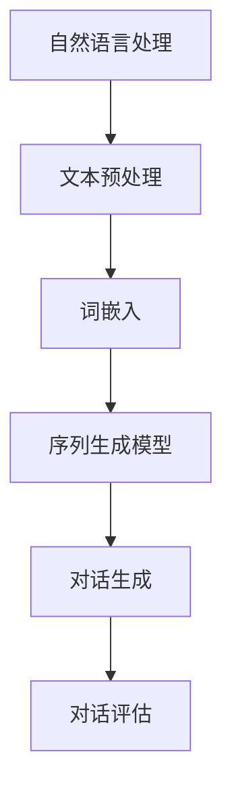

                 

关键词：AI对话生成、自然语言处理、机器学习、游戏剧情设计、编程实践

摘要：本文深入探讨散爆网络2025社招游戏剧情对话生成AI工程师职位的核心技术挑战，从背景介绍、核心概念与联系、算法原理、数学模型、项目实践到实际应用场景和未来展望，全面解析如何利用人工智能技术打造引人入胜的游戏剧情对话系统。

## 1. 背景介绍

随着计算机技术的发展和人工智能的崛起，游戏行业迎来了新的变革。游戏剧情对话生成作为游戏开发的重要组成部分，其质量直接影响玩家的游戏体验。散爆网络作为一家专注于游戏开发的公司，在其2025年的社招中特别设置了游戏剧情对话生成AI工程师的职位，旨在通过先进的人工智能技术提升游戏剧情对话的生成质量和互动性。

本文将围绕这一职位，深入探讨如何利用自然语言处理、机器学习和深度学习等技术实现高质量的剧情对话生成。通过分析现有技术方案、设计合理的算法模型，以及实际项目的开发实践，为游戏开发者提供有价值的参考。

## 2. 核心概念与联系

### 2.1 自然语言处理（NLP）

自然语言处理是人工智能领域的一个重要分支，旨在让计算机理解和处理人类语言。在游戏剧情对话生成中，NLP技术用于解析玩家输入、理解剧情背景、生成符合逻辑和语境的对话。

### 2.2 机器学习（ML）

机器学习是一种通过数据训练模型，使计算机能够自主学习和改进的技术。在游戏剧情对话生成中，机器学习技术用于从大量游戏对话数据中提取模式，生成个性化的对话内容。

### 2.3 深度学习（DL）

深度学习是机器学习的一种高级形式，通过模拟人脑神经网络的结构和功能，实现更复杂的特征提取和模式识别。在游戏剧情对话生成中，深度学习技术可用于构建复杂的多层神经网络，实现对游戏剧情的深度理解和生成。

### 2.4 Mermaid 流程图

以上Mermaid流程图展示了自然语言处理在游戏剧情对话生成中的主要步骤：文本预处理、词嵌入、序列生成模型、对话生成和对话评估。

## 3. 核心算法原理 & 具体操作步骤

### 3.1 算法原理概述

游戏剧情对话生成的核心算法主要基于序列生成模型，如循环神经网络（RNN）和其变种长短期记忆网络（LSTM）、门控循环单元（GRU）等。这些模型能够通过学习大量游戏对话数据，生成符合剧情逻辑和玩家兴趣的对话内容。

### 3.2 算法步骤详解

1. 数据收集与预处理：收集大量游戏对话数据，进行文本清洗、分词、去停用词等预处理操作。
2. 词嵌入：将文本数据转化为向量表示，常用的词嵌入技术包括Word2Vec、GloVe等。
3. 模型训练：利用预处理后的数据训练序列生成模型，如LSTM或GRU。
4. 对话生成：通过训练好的模型，输入当前剧情背景和玩家角色，生成符合剧情和玩家兴趣的对话。
5. 对话评估：对生成的对话进行评估，确保其符合剧情逻辑和玩家的期望。

### 3.3 算法优缺点

#### 优点：

- **个性化生成**：能够根据玩家的兴趣和剧情背景，生成个性化的对话内容。
- **自动化**：减少人工编写对话的负担，提高开发效率。
- **灵活性**：可以根据游戏剧情的变化，实时生成新的对话内容。

#### 缺点：

- **质量控制**：生成的对话质量参差不齐，需要进一步优化。
- **数据依赖**：需要大量高质量的游戏对话数据进行训练，数据不足可能导致模型性能下降。
- **计算资源**：训练深度学习模型需要大量计算资源，训练时间较长。

### 3.4 算法应用领域

- **游戏剧情对话生成**：适用于各类角色扮演游戏（RPG）、策略游戏等，提升游戏剧情的连贯性和互动性。
- **聊天机器人**：在客服、社交、教育等领域，用于生成与用户的自然对话。
- **虚拟助手**：在智能家居、智能办公等场景中，为用户提供个性化服务。

## 4. 数学模型和公式 & 详细讲解 & 举例说明

### 4.1 数学模型构建

游戏剧情对话生成的核心数学模型是基于RNN或LSTM的序列生成模型。以下以LSTM为例，介绍其数学模型构建：

#### LSTM单元

LSTM单元由输入门、遗忘门、输出门和单元状态组成。其数学模型如下：

$$
i_t = \sigma(W_{ix}x_t + W_{ih}h_{t-1} + b_i)
$$

$$
f_t = \sigma(W_{fx}x_t + W_{fh}h_{t-1} + b_f)
$$

$$
o_t = \sigma(W_{ox}x_t + W_{oh}h_{t-1} + b_o)
$$

$$
g_t = tanh(W_{gx}x_t + W_{gh}h_{t-1} + b_g)
$$

$$
c_t = f_t \odot c_{t-1} + i_t \odot g_t
$$

$$
h_t = o_t \odot tanh(c_t)
$$

其中，$i_t$、$f_t$、$o_t$ 分别为输入门、遗忘门、输出门的激活值；$c_t$ 为单元状态；$h_t$ 为隐藏状态；$\sigma$ 为sigmoid激活函数；$tan

