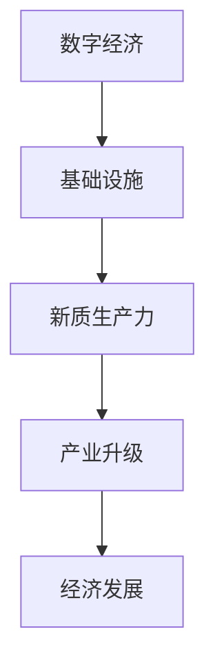

                 

关键词：数字中国，新质生产力，数字化转型，数字经济，产业升级，技术架构，人工智能，数据治理

> 摘要：本文将深入探讨数字中国战略背景下，新质生产力布局的内涵与外延，剖析其与数字经济的相互关系，通过技术架构的视角，提出推动产业升级和数字化转型的路径，并展望未来发展趋势与面临的挑战。

## 1. 背景介绍

近年来，随着信息技术的迅猛发展，全球范围内数字化转型步伐不断加快，数字经济成为各国经济发展的新引擎。在此背景下，我国提出了“数字中国”建设战略，旨在通过数字技术的创新应用，推动经济社会高质量发展。新质生产力成为数字中国建设的重要支撑，其核心在于通过信息技术与实体经济的深度融合，提升生产效率，创造新的经济增长点。

### 1.1 数字中国的战略意义

数字中国战略是我国信息化发展战略的深化和升级，具有以下几方面的重要意义：

1. **提升国家竞争力**：通过数字化手段，提高资源配置效率，降低生产成本，提升产品质量，增强我国在全球产业链中的竞争力。
2. **促进产业升级**：推动传统产业向数字化、智能化转型，培育新兴产业，构建现代产业体系。
3. **改善民生服务**：利用大数据、人工智能等技术，优化公共服务资源配置，提升民众的获得感和幸福感。
4. **加强社会治理**：利用数字化手段提高政府治理能力，实现社会治理的精细化、智能化。

### 1.2 新质生产力的内涵与特征

新质生产力是指在信息技术推动下，通过数据、算法和智能技术的综合运用，形成的新的生产方式和生产力形态。其主要特征包括：

1. **数据驱动**：以大数据为核心，通过对海量数据的采集、处理和分析，发现价值信息，指导生产决策。
2. **智能赋能**：通过人工智能技术的应用，实现自动化、智能化的生产和管理，提高生产效率和产品质量。
3. **网络协同**：通过网络平台，实现企业、产业链上下游以及用户之间的信息共享和协同工作，降低交易成本。
4. **创新驱动**：以技术创新为驱动，不断推出新技术、新产品，推动产业链的升级和拓展。

## 2. 核心概念与联系

### 2.1 数字经济的概念

数字经济是指基于数字技术和互联网平台的经济活动，包括互联网经济、数字贸易、数字金融、数字文化等多个方面。数字经济与传统经济相比，具有高度信息化、网络化、智能化和全球化特征。

### 2.2 数字经济与新质生产力的联系

数字经济与新质生产力之间存在着密切的联系，主要表现在：

1. **数字经济为新质生产力提供了基础设施**：互联网、云计算、大数据等技术为数据采集、处理、分析提供了强大的支持，为新质生产力的发展奠定了基础。
2. **新质生产力是数字经济发展的核心动力**：新质生产力通过数据驱动、智能赋能等手段，推动传统产业向数字化、智能化转型，是数字经济的重要驱动力。
3. **数字经济与新质生产力的融合**：数字经济和新质生产力的融合，催生了新的产业形态和商业模式，如共享经济、平台经济等，推动了经济结构的深度调整。

### 2.3 Mermaid 流程图



## 3. 核心算法原理 & 具体操作步骤

### 3.1 算法原理概述

在数字中国和新质生产力布局中，算法的运用至关重要。核心算法主要包括机器学习算法、深度学习算法和数据挖掘算法。以下将对这些算法进行概述：

1. **机器学习算法**：通过训练模型，使计算机具备从数据中自动学习和归纳规律的能力，从而实现预测和分类。
2. **深度学习算法**：基于多层神经网络，通过层层提取特征，实现复杂的非线性建模，如图像识别、语音识别等。
3. **数据挖掘算法**：从大量数据中提取有价值的信息和知识，包括关联规则挖掘、聚类分析、分类分析等。

### 3.2 算法步骤详解

1. **数据预处理**：包括数据清洗、归一化、缺失值处理等步骤，确保数据质量。
2. **特征选择**：通过特征重要性分析，筛选出对模型性能有显著影响的特征。
3. **模型训练**：根据具体问题，选择合适的算法，对模型进行训练。
4. **模型评估**：通过交叉验证、ROC曲线等手段，评估模型性能。
5. **模型应用**：将训练好的模型应用于实际场景，实现预测和决策。

### 3.3 算法优缺点

1. **机器学习算法**：优点在于自动学习和归纳能力，缺点是对数据质量和特征选择要求较高。
2. **深度学习算法**：优点在于强大的特征提取能力和非线性建模能力，缺点在于计算复杂度和对数据量的要求较高。
3. **数据挖掘算法**：优点在于能够发现数据中的隐藏模式和规律，缺点在于对业务理解和数据预处理要求较高。

### 3.4 算法应用领域

1. **智能制造**：通过机器学习和深度学习算法，实现生产过程的自动化和智能化，提高生产效率。
2. **金融服务**：通过数据挖掘算法，实现风险控制、欺诈检测、个性化推荐等。
3. **智慧城市**：通过物联网、大数据等技术，实现城市管理的智能化和精细化。

## 4. 数学模型和公式 & 详细讲解 & 举例说明

### 4.1 数学模型构建

在数字中国和新质生产力布局中，常用的数学模型包括线性回归模型、逻辑回归模型、神经网络模型等。以下以线性回归模型为例进行讲解。

### 4.2 公式推导过程

线性回归模型的基本假设为：

1. 数据服从正态分布
2. 自变量与因变量之间呈线性关系

线性回归模型的公式为：

$$ Y = \beta_0 + \beta_1 \cdot X + \epsilon $$

其中，$Y$ 为因变量，$X$ 为自变量，$\beta_0$ 和 $\beta_1$ 分别为模型的参数，$\epsilon$ 为误差项。

### 4.3 案例分析与讲解

假设我们要预测一家公司的利润 $Y$，根据历史数据，我们选取了公司的广告支出 $X$ 作为自变量。通过线性回归模型，我们得到以下结果：

$$ Y = 1000 + 10 \cdot X $$

根据这个模型，当广告支出为 1000 元时，预测利润为 1000 元。

## 5. 项目实践：代码实例和详细解释说明

### 5.1 开发环境搭建

在本文中，我们将使用 Python 编程语言和 Scikit-learn 库来实现线性回归模型。首先，我们需要安装 Python 和 Scikit-learn 库。

```bash
pip install python
pip install scikit-learn
```

### 5.2 源代码详细实现

```python
from sklearn.linear_model import LinearRegression
from sklearn.model_selection import train_test_split
from sklearn.metrics import mean_squared_error

# 数据导入
X, Y = load_data()

# 数据划分
X_train, X_test, Y_train, Y_test = train_test_split(X, Y, test_size=0.2, random_state=42)

# 模型训练
model = LinearRegression()
model.fit(X_train, Y_train)

# 模型评估
Y_pred = model.predict(X_test)
mse = mean_squared_error(Y_test, Y_pred)
print("均方误差：", mse)

# 模型应用
X_new = [[1000]]
Y_new = model.predict(X_new)
print("预测利润：", Y_new)
```

### 5.3 代码解读与分析

1. **数据导入**：从数据文件中读取自变量和因变量。
2. **数据划分**：将数据集划分为训练集和测试集。
3. **模型训练**：使用训练集数据训练线性回归模型。
4. **模型评估**：使用测试集数据评估模型性能，计算均方误差。
5. **模型应用**：使用训练好的模型预测新数据的值。

## 6. 实际应用场景

数字中国和新质生产力布局在各个领域都有广泛的应用，以下列举几个实际应用场景：

1. **智能制造**：通过机器学习和深度学习算法，实现生产线的自动化和智能化，提高生产效率。
2. **金融服务**：通过数据挖掘算法，实现风险控制和个性化推荐，提高金融服务质量。
3. **智慧城市**：通过物联网、大数据等技术，实现城市管理的智能化和精细化。

## 7. 工具和资源推荐

### 7.1 学习资源推荐

1. **《机器学习实战》**：提供丰富的实践案例，适合初学者入门。
2. **《深度学习》**：深度学习领域的经典教材，适合有一定编程基础的学习者。
3. **《数据挖掘：实用方法与工具》**：详细介绍数据挖掘的方法和工具，适合从事数据挖掘工作的专业人士。

### 7.2 开发工具推荐

1. **Python**：适合初学者，语法简单，拥有丰富的库和框架。
2. **Scikit-learn**：提供丰富的机器学习算法，方便快速实现模型。
3. **TensorFlow**：谷歌推出的深度学习框架，适合实现复杂的神经网络模型。

### 7.3 相关论文推荐

1. **"Deep Learning for Manufacturing: A Review"**：探讨深度学习在制造业中的应用。
2. **"Data Mining in Financial Services: A Survey"**：综述数据挖掘在金融服务领域的应用。
3. **"Big Data and Internet of Things in Smart Cities: A Survey"**：探讨大数据和物联网在智慧城市中的应用。

## 8. 总结：未来发展趋势与挑战

### 8.1 研究成果总结

本文从数字中国和新质生产力布局的角度，分析了数字经济与新质生产力的关系，探讨了核心算法原理和实际应用场景，提出了未来发展趋势与挑战。

### 8.2 未来发展趋势

1. **技术融合**：人工智能、大数据、物联网等技术的深度融合，将推动新质生产力的进一步发展。
2. **产业链升级**：传统产业向数字化、智能化转型，形成新的产业体系。
3. **跨界合作**：不同行业之间的跨界合作，推动产业链的协同发展。

### 8.3 面临的挑战

1. **数据安全**：数据泄露、隐私保护等问题，需要加强数据安全防护。
2. **技术人才**：高质量的技术人才短缺，需要加大人才培养力度。
3. **政策法规**：完善相关法律法规，为数字中国建设提供法制保障。

### 8.4 研究展望

未来，我们将进一步研究：

1. **新质生产力的评价指标体系**：建立科学、全面的评价指标体系，评估新质生产力的贡献。
2. **跨领域技术融合**：探索人工智能、大数据、物联网等技术在各个领域的应用，推动产业链的协同发展。
3. **政策与法规研究**：研究数字中国建设的政策法规体系，为数字中国建设提供法制保障。

## 9. 附录：常见问题与解答

### 9.1 什么是数字经济？

数字经济是指基于数字技术和互联网平台的经济活动，包括互联网经济、数字贸易、数字金融、数字文化等多个方面。

### 9.2 新质生产力的特征是什么？

新质生产力的特征包括：数据驱动、智能赋能、网络协同和创新驱动。

### 9.3 数字经济与新质生产力的关系是什么？

数字经济为新质生产力提供了基础设施，而新质生产力是数字经济发展的核心动力。

### 9.4 如何实现数字化转型的产业升级？

通过信息技术与实体经济的深度融合，推动传统产业向数字化、智能化转型，培育新兴产业，构建现代产业体系。

### 9.5 数字中国建设面临的挑战是什么？

数字中国建设面临的主要挑战包括：数据安全、技术人才短缺和政策法规不完善等。

## 作者署名

作者：禅与计算机程序设计艺术 / Zen and the Art of Computer Programming
```

