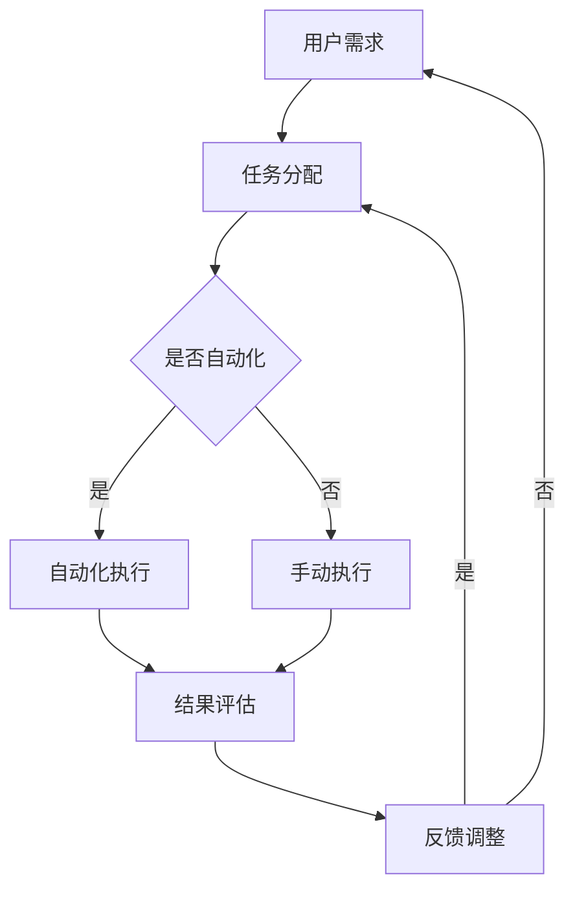

                 

关键词：数字劳动，计算经济学，人类计算，社会影响，经济影响

> 摘要：本文深入探讨了数字劳动的概念，探讨了其在现代社会和经济中的重要性。文章首先介绍了数字劳动的定义和背景，然后分析了数字劳动对社会和经济的影响。接下来，文章讨论了数字劳动的具体表现形式，包括众包、协作和自动化等。随后，文章探讨了数字劳动的优势和挑战，以及如何应对这些挑战。最后，文章展望了数字劳动的未来发展，提出了相关的建议和对策。

## 1. 背景介绍

在当今全球化的数字化时代，数字劳动已经成为推动社会和经济发展的关键力量。数字劳动，简单来说，是指通过计算机技术、互联网和其他数字工具进行的劳动活动。它不仅包括传统的计算机编程、软件开发和数据分析师的工作，还涵盖了更广泛的领域，如网络营销、社交媒体管理、数据整理和众包任务。

随着信息技术的飞速发展，数字劳动的规模和影响力不断扩大。例如，众包平台的兴起使得人们可以轻松地参与各种数字任务，从而提高了全球劳动力的效率。另一方面，自动化技术的发展正在改变传统的劳动方式，一些重复性、标准化的任务逐渐被机器取代，这也对数字劳动者的就业和社会经济结构产生了深远影响。

本文将围绕数字劳动这一主题，探讨其社会和经济影响。我们将首先介绍数字劳动的定义和背景，然后分析其对社会和经济的影响，最后讨论数字劳动的优势和挑战，以及未来的发展前景。

### 数字劳动的定义和起源

数字劳动的定义可以从多个角度进行理解。最基本的是，它指的是利用数字技术进行的工作。这个定义涵盖了广泛的领域，包括但不限于：

- **编程和软件开发**：程序员通过编写代码来创建软件应用程序和系统。
- **数据分析和处理**：数据分析师使用软件工具对大量数据进行清洗、分析和解释。
- **内容创作**：内容创作者通过互联网平台创作和分享各种形式的内容，如文章、视频和音乐。
- **社交媒体管理**：社交媒体经理使用各种工具来管理公司或个人的社交媒体账户。
- **远程协作**：团队成员通过在线工具和平台进行沟通和协作。

数字劳动的起源可以追溯到计算机技术的早期发展。20世纪60年代，计算机开始被用于商业和科学研究，从而催生了第一批程序员和计算机科学家。随着互联网的普及，数字劳动的范围和影响力进一步扩大。21世纪初，电子商务和社交媒体的兴起使得数字劳动成为现代经济不可或缺的一部分。

### 数字劳动的主要形式

数字劳动的形式多种多样，以下是一些主要的数字劳动形式：

1. **众包**：众包是指将任务分配给分布在不同地方的个体，通常通过在线平台进行。例如，任务可以是图像识别、翻译或数据分析。众包平台如Upwork和Mechanical Turk已经成为数字劳动的重要形式。

2. **协作**：协作是指多个个体或团队共同完成一个项目或任务。随着远程协作工具的普及，如Slack、Trello和Zoom，协作变得更加高效和灵活。

3. **自动化**：自动化是指使用软件和算法来执行重复性或标准化的任务，从而减少人力需求。自动化技术包括机器人流程自动化（RPA）、机器学习和人工智能。

4. **内容创作**：内容创作包括各种形式的数字内容，如文章、视频、音乐和图形设计。随着内容平台如YouTube和TikTok的兴起，内容创作成为了一个重要的数字劳动领域。

5. **数据整理和清洗**：数据整理和清洗是指将大量数据转化为可用于分析的格式。数据科学家和数据分析师在这一过程中扮演着关键角色。

### 数字劳动的发展历程

数字劳动的发展历程可以分为几个重要阶段：

1. **早期计算机编程**：20世纪60年代，计算机编程开始成为一项重要职业。程序员使用机器语言和汇编语言编写代码，这一阶段主要关注基础软件和系统的开发。

2. **互联网时代的崛起**：20世纪90年代，互联网的普及使得数字劳动的范围大大扩展。电子商务、在线教育和社交媒体的兴起带来了新的数字劳动形式。

3. **云计算和大数据**：21世纪初，云计算和大数据技术的发展进一步推动了数字劳动的扩展。企业开始使用云计算平台来存储和处理大量数据，数据科学家和数据分析师的需求大幅增加。

4. **人工智能和自动化**：近年来，人工智能和自动化技术的发展使得数字劳动变得更加高效和智能化。机器人和智能算法可以执行复杂的任务，从而减少了对传统劳动力的需求。

## 2. 数字劳动的核心概念与联系

### 数字劳动的核心概念

数字劳动的核心概念包括以下几个方面：

1. **计算能力**：数字劳动依赖于强大的计算能力，包括云计算、高性能计算和边缘计算。计算能力的提升使得数字劳动能够处理更加复杂的任务。

2. **数据驱动**：数字劳动的一个重要特征是数据驱动。数据是数字劳动的基石，通过数据分析和处理，可以提取有价值的信息和洞察。

3. **自动化**：自动化是数字劳动的重要组成部分，通过软件和算法，许多重复性或标准化的任务可以被自动化执行，从而提高效率。

4. **协作**：数字劳动强调团队合作和协作。远程协作工具和平台使得团队成员可以实时沟通和协作，无论他们位于何处。

5. **用户体验**：数字劳动的一个关键目标是提供良好的用户体验。无论是软件开发、内容创作还是数据分析，都要考虑到用户的感受和需求。

### 数字劳动的架构与流程

为了更好地理解数字劳动，我们可以将其架构和流程用Mermaid流程图表示，如下：

在这个流程中，用户需求触发任务分配，任务可以通过自动化或手动方式执行，最终结果进行评估，并根据反馈进行调整。这个流程展示了数字劳动的核心环节，包括任务分配、自动化执行、结果评估和反馈调整。

### 数字劳动的优缺点

数字劳动具有多方面的优点，但也面临一些挑战和缺点。

#### 优点

1. **高效性**：数字劳动可以利用自动化和算法，快速处理大量数据，从而提高工作效率。

2. **灵活性**：数字劳动不受地理位置限制，可以远程协作，灵活调度人力资源。

3. **低成本**：通过自动化和众包，企业可以降低人力成本，同时提高资源利用率。

4. **创新性**：数字劳动促进了新的商业模式和技术的出现，推动了社会和经济的创新。

5. **个性化**：数字劳动可以根据用户需求提供个性化服务，提高用户体验。

#### 缺点

1. **就业冲击**：自动化和人工智能技术的普及可能导致某些传统职业的失业，对劳动力市场造成冲击。

2. **隐私和安全**：数字劳动涉及大量数据收集和处理，可能引发隐私和安全问题。

3. **技能差距**：随着数字劳动的发展，对高技能劳动力的需求增加，但技能培训和教育可能跟不上。

4. **依赖性**：企业和个人对数字技术和平台的依赖性增加，可能降低他们的自主性和创新能力。

### 数字劳动的应用领域

数字劳动的应用领域广泛，涵盖了多个行业和领域，包括：

1. **金融**：金融行业的数字劳动包括自动化交易、风险管理、客户服务和数据分析。

2. **医疗**：医疗领域的数字劳动包括电子健康记录管理、远程医疗诊断和个性化医疗。

3. **制造业**：制造业的数字劳动包括生产自动化、供应链管理、质量管理。

4. **零售**：零售行业的数字劳动包括电子商务、库存管理、客户关系管理。

5. **教育**：教育领域的数字劳动包括在线学习、教育数据分析、教育游戏开发。

### 数字劳动的未来趋势

数字劳动的未来趋势将受到以下几个因素的影响：

1. **人工智能和机器学习**：人工智能和机器学习技术的发展将进一步提升数字劳动的自动化水平，从而提高效率。

2. **物联网**：物联网的普及将增加数字劳动的数据来源，推动数据分析和智能决策。

3. **区块链**：区块链技术可能改变数字劳动的支付和结算方式，提高透明度和安全性。

4. **虚拟和增强现实**：虚拟和增强现实技术的发展将提供新的数字劳动形式，如虚拟会议、虚拟培训等。

5. **可持续发展**：随着可持续发展的重要性日益增加，数字劳动将在环境保护和资源优化方面发挥更大作用。

### 数字劳动对社会的经济影响

数字劳动不仅改变了劳动方式，还对经济和社会产生了深远影响。以下是对这些影响的详细分析：

#### 对就业的影响

数字劳动对就业的影响具有双重性。一方面，它创造了新的就业机会，特别是在软件开发、数据分析、人工智能等领域。这些高技能岗位要求劳动者具备先进的技术知识和创新能力，为就业市场注入了新的活力。然而，另一方面，自动化和人工智能技术的普及也导致了一些传统职位的消失，如工厂工人、快递员和客服代表。这些职业的就业压力加大，导致了一定程度的就业不稳定性。

#### 对生产效率的影响

数字劳动显著提高了生产效率。自动化技术可以减少人为错误，提高任务的执行速度。例如，在制造业中，机器人可以精确地进行装配和质检，极大地提高了生产效率和产品质量。此外，数据分析技术帮助企业更好地了解市场趋势和消费者需求，从而做出更明智的决策，进一步提升了生产效率。

#### 对经济结构的影响

数字劳动改变了经济结构，使得知识经济和服务经济成为主导。传统制造业的比重逐渐下降，而信息技术、金融、医疗和教育等行业的比重不断上升。这种转变推动了经济的高质量发展，促进了经济结构的优化和升级。

#### 对收入分配的影响

数字劳动对收入分配产生了影响。一方面，高技能的数字劳动者因为其独特技能和创新能力获得了较高的薪酬。然而，另一方面，低技能劳动者由于面临失业和就业压力，收入水平可能下降。这可能导致收入分配的不平等加剧，需要政策制定者关注和解决。

#### 对创新和创业的影响

数字劳动促进了创新和创业活动。通过数字化工具和平台，企业家和创业者可以更便捷地开展业务，降低创业门槛。此外，数字劳动提供了大量的数据资源和创新工具，为企业和个人提供了丰富的创新机会。这种创新活力有助于推动经济增长和社会进步。

### 数字劳动的优势和挑战

#### 优势

1. **灵活性**：数字劳动不受时间和地点限制，提供了更大的工作灵活性，使劳动者可以远程工作或灵活安排工作时间。

2. **效率**：自动化和人工智能技术提高了任务执行速度和准确性，减少了人为错误，提高了整体效率。

3. **成本节约**：通过众包和自动化，企业可以降低人力成本，同时提高资源利用率。

4. **创新性**：数字劳动促进了新的商业模式和技术的发展，推动了社会的创新和进步。

5. **个性化**：数字劳动可以根据用户需求提供个性化服务，提高用户体验。

#### 挑战

1. **就业冲击**：自动化和人工智能可能导致某些传统职位的消失，对劳动力市场造成冲击。

2. **技能差距**：数字劳动需要高技能劳动力，但现有教育和培训体系可能无法满足这一需求，导致技能差距。

3. **隐私和安全**：数字劳动涉及大量数据收集和处理，可能引发隐私和安全问题。

4. **依赖性**：企业和个人对数字技术和平台的依赖性增加，可能降低他们的自主性和创新能力。

5. **社会不平等**：数字劳动可能导致收入分配不平等加剧，需要政策制定者关注和解决。

### 数字劳动与社会经济的互动

数字劳动与社会经济之间的互动是一个复杂而动态的过程，涉及多个层面和维度。以下是对这一互动关系的详细分析：

#### 对劳动力市场的影响

数字劳动对劳动力市场的影响是多方面的。一方面，它创造了新的就业机会，特别是在信息技术、数据分析、人工智能等领域。这些高技能岗位要求劳动者具备先进的技术知识和创新能力，为就业市场注入了新的活力。然而，另一方面，自动化和人工智能技术的普及也导致了一些传统职位的消失，如工厂工人、快递员和客服代表。这些职业的就业压力加大，导致了一定程度的就业不稳定性。

此外，数字劳动改变了劳动的形式和组织方式。远程工作和灵活工作制变得越来越普遍，这使得劳动者可以更灵活地选择工作时间和地点，但也带来了新的挑战，如工作与生活平衡问题、职业发展和技能提升等。

#### 对经济增长的贡献

数字劳动对经济增长的贡献体现在多个方面。首先，它提高了生产效率，通过自动化和人工智能技术，企业可以减少人为错误，提高任务执行速度，从而降低生产成本，提升产品质量。例如，在制造业中，机器人可以精确地进行装配和质检，极大地提高了生产效率和产品质量。此外，数据分析技术帮助企业更好地了解市场趋势和消费者需求，从而做出更明智的决策，进一步提升了生产效率。

其次，数字劳动促进了创新和创业活动。通过数字化工具和平台，企业家和创业者可以更便捷地开展业务，降低创业门槛。此外，数字劳动提供了大量的数据资源和创新工具，为企业和个人提供了丰富的创新机会。这种创新活力有助于推动经济增长和社会进步。

#### 对经济结构的影响

数字劳动改变了经济结构，使得知识经济和服务经济成为主导。传统制造业的比重逐渐下降，而信息技术、金融、医疗和教育等行业的比重不断上升。这种转变推动了经济的高质量发展，促进了经济结构的优化和升级。数字劳动不仅提高了生产效率，还通过创新和创业活动推动了新产业的诞生和成长，从而改变了经济的增长动力和模式。

#### 对收入分配的影响

数字劳动对收入分配产生了深远影响。一方面，高技能的数字劳动者因为其独特技能和创新能力获得了较高的薪酬。例如，软件工程师、数据科学家和人工智能专家等高技能岗位的薪资水平普遍较高。另一方面，低技能劳动者由于面临失业和就业压力，收入水平可能下降。特别是在自动化和人工智能技术普及的背景下，一些传统职业的就业机会减少，导致了一定程度的收入不平等。

此外，数字劳动还可能加剧地区间和行业间的收入差距。发达地区和高新技术产业往往拥有更多的数字劳动机会和更高的薪资水平，而欠发达地区和传统行业则面临着更大的就业压力和收入下降的风险。

#### 对工作性质的影响

数字劳动改变了工作性质和劳动方式。传统的劳动形式往往依赖于固定的地点和时间，而数字劳动使得劳动者可以远程工作，灵活安排工作时间。这不仅提高了工作效率，也改善了工作与生活平衡。然而，这也带来了新的挑战，如工作与生活的界限模糊、职业发展和技能提升等问题。

此外，数字劳动还促进了劳动形式的多样化。除了传统的全职就业，兼职、临时工和远程工作等灵活就业形式越来越受欢迎。这种多样化的劳动形式为劳动者提供了更多的选择，但也需要适应新的劳动市场环境。

#### 对教育和培训的影响

数字劳动对教育和培训产生了深远影响。随着数字劳动的普及，对高技能劳动力的需求不断增加，这要求教育体系进行相应的调整。首先，教育内容需要更新，以涵盖新兴技术和行业需求。例如，编程、数据分析、人工智能等课程变得越来越重要。其次，教育方式也需要创新，如在线教育、远程实训等，以满足不同学习者的需求。

此外，数字劳动还促进了终身学习的理念。在快速变化的技术环境中，劳动者需要不断更新知识和技能，以适应新的工作需求。终身学习不仅有助于提高劳动者的竞争力，也有助于促进个人和社会的发展。

#### 对社会治理的影响

数字劳动对社会治理也产生了重要影响。首先，数字劳动提高了政府和社会对经济活动的监测和管理能力。通过大数据分析和智能算法，政府可以更好地了解经济运行状况，制定更加科学和有效的政策。

其次，数字劳动还推动了公共服务和社会管理的数字化转型。例如，智慧城市建设、电子政务、数字身份认证等应用，提高了公共服务的效率和便捷性，增强了社会治理的能力。

### 数字劳动的具体表现形式

数字劳动的具体表现形式多样，涵盖了众包、协作和自动化等多个方面。以下是对这些具体表现形式的分析：

#### 众包

众包是一种通过互联网平台将任务分配给分布在不同地方的个体完成的数字劳动形式。它利用了广泛的网络资源和分散的人力资源，以提高任务执行效率和降低成本。众包平台如Upwork、Mechanical Turk和Crowdsourcing等，为各种类型的工作提供了广阔的就业机会。

众包的优势在于其灵活性和广泛性。任务可以是简单的图像识别、翻译或数据分析，也可以是复杂的设计、编程和数据分析。众包平台通常通过算法和评分系统确保任务的完成质量和效率，同时提供支付和结算服务。

然而，众包也面临一些挑战。首先，由于任务分配的分散性，任务质量难以保证。一些任务可能因为缺乏明确的指导和评估标准而导致结果不佳。其次，众包平台的竞争激烈，导致一些劳动者收入不稳定。此外，众包可能对某些传统职业造成冲击，导致就业不稳定性。

#### 协作

协作是指多个个体或团队共同完成一个项目或任务的数字劳动形式。随着远程协作工具的普及，协作变得更加高效和灵活。远程协作工具如Slack、Trello和Zoom等，提供了实时沟通、文件共享和任务管理功能，使得团队成员可以随时随地协作。

协作的优势在于其灵活性和高效性。团队成员可以通过远程协作工具实时沟通和协作，无需受限于地理位置。这有助于提高项目执行效率和团队凝聚力。此外，协作还可以促进知识共享和创新，通过不同背景和技能的团队成员之间的交流，产生新的想法和解决方案。

然而，协作也面临一些挑战。首先，协调和沟通成本可能较高，特别是在跨文化、跨时区的协作中。其次，协作过程中可能存在信息不对称和沟通障碍，导致任务执行出现问题。此外，协作可能对领导力和团队管理提出了更高的要求，需要确保团队成员的参与和积极性。

#### 自动化

自动化是指使用软件和算法来执行重复性或标准化的任务的数字劳动形式。自动化技术包括机器人流程自动化（RPA）、机器学习和人工智能。自动化技术可以显著提高任务执行效率和准确性，减少人为错误，从而提高整体生产效率。

自动化的优势在于其高效性和准确性。自动化技术可以处理大量重复性任务，如数据录入、报告生成和客户服务。这不仅提高了工作效率，还降低了人力成本。此外，自动化技术可以24/7不间断工作，无需休息和休假，从而进一步提高了生产效率。

然而，自动化也面临一些挑战。首先，自动化技术可能对某些传统职业造成冲击，导致就业不稳定性。例如，机器人流程自动化（RPA）可以替代许多重复性工作，从而减少了这些岗位的需求。其次，自动化技术可能降低员工的参与感和创造力。由于许多任务被自动化，员工可能需要更多地依赖机器执行任务，从而减少了对他们的技能和创造力的要求。

### 数字劳动的优势

数字劳动具有多方面的优势，使其在现代社会和经济中发挥着重要作用。以下是对这些优势的详细分析：

#### 提高生产效率

数字劳动通过自动化和人工智能技术，可以显著提高生产效率。自动化技术可以执行重复性或标准化的任务，减少人为错误，提高任务执行速度。例如，机器人可以精确地进行装配和质检，而数据分析技术可以帮助企业更好地了解市场趋势和消费者需求，从而做出更明智的决策。这种高效的生产方式不仅降低了生产成本，还提高了产品质量。

此外，数字劳动还可以通过优化工作流程和资源配置，进一步提高生产效率。远程协作工具和平台使得团队成员可以实时沟通和协作，无需受限于地理位置和时间。这种灵活的工作方式有助于提高项目的执行效率，缩短项目周期。

#### 降低成本

数字劳动可以显著降低人力成本和其他运营成本。通过众包和自动化，企业可以降低对传统劳动力的需求，从而减少工资支出和福利成本。例如，企业可以使用众包平台来完成任务，从而避免了招聘和管理全职员工的成本。此外，自动化技术可以减少对人力资源的依赖，降低运营成本，提高资源利用率。

此外，数字劳动还可以通过优化工作流程和提高效率，进一步降低成本。例如，通过使用数据分析技术，企业可以更有效地管理库存和供应链，减少浪费和损失。这种高效的运营方式有助于提高企业的竞争力。

#### 促进创新

数字劳动促进了创新和创业活动。通过数字化工具和平台，企业家和创业者可以更便捷地开展业务，降低创业门槛。例如，云计算平台提供了强大的计算和存储能力，使得创业者可以轻松地进行技术研发和市场推广。此外，数字劳动提供了大量的数据资源和创新工具，为企业和个人提供了丰富的创新机会。

数字劳动还促进了跨领域和跨行业的创新合作。通过远程协作工具和平台，不同领域的专家可以实时沟通和协作，共同解决复杂问题。这种协作模式有助于激发创新思维，推动新技术的诞生和应用。

#### 提供灵活的工作方式

数字劳动提供了灵活的工作方式，使劳动者可以更灵活地安排工作时间和工作地点。远程工作和灵活工作制使得劳动者可以在家中或任何方便的地方工作，无需受限于固定的办公地点和时间。这种灵活的工作方式有助于提高工作与生活的平衡，提高劳动者的满意度和幸福感。

此外，数字劳动还为劳动者提供了更多的就业机会。通过众包平台和远程协作工具，劳动者可以在全球范围内找到合适的工作，不受地理位置限制。这种灵活的工作方式不仅为劳动者提供了更多的选择，也有助于提高全球劳动力的效率。

### 数字劳动的挑战

尽管数字劳动具有许多优势，但它在实际应用中仍然面临一系列挑战。以下是对这些挑战的详细分析：

#### 失业风险

自动化和人工智能技术的普及导致了一些传统职位的消失，增加了失业风险。例如，机器人流程自动化（RPA）可以替代许多重复性工作，如数据录入和客户服务。这种技术进步虽然提高了生产效率，但也导致了一定程度的就业不稳定性。特别是在制造业、物流和客服等领域，自动化技术的应用加剧了失业问题。

此外，随着技术的不断进步，一些新兴行业和岗位的需求增加，但与之相对的传统岗位却在减少。这种就业结构的变化使得一些劳动者难以适应新的就业环境，面临就业压力。

#### 技能差距

数字劳动对劳动者的技能要求不断提高，但现有教育和培训体系可能无法满足这一需求。许多传统职业的劳动者缺乏必要的数字技能，难以适应数字化时代的工作要求。这种技能差距导致了一定程度的就业不平等，使得一些劳动者在竞争中处于劣势。

此外，新技术的发展速度远远超过了教育和培训的更新速度。教育机构和企业需要不断调整课程内容和培训计划，以适应不断变化的数字劳动需求。然而，这一调整过程往往滞后，导致劳动者技能滞后于市场需求。

#### 隐私和安全问题

数字劳动涉及大量数据收集和处理，可能引发隐私和安全问题。企业和个人需要处理大量的敏感数据，如个人信息、商业数据和金融数据。如果这些数据泄露或被滥用，可能导致严重的后果，如经济损失、隐私侵犯和信任危机。

此外，数字劳动的自动化和智能化水平越高，系统漏洞和攻击风险也越大。黑客和组织可能利用这些漏洞进行网络攻击，窃取数据或破坏系统。这要求企业和个人加强网络安全防护，确保数据的安全和完整性。

#### 工作依赖性

数字劳动可能使企业和个人对数字技术和平台的依赖性增加，降低自主性和创新能力。企业和个人过于依赖数字化工具和平台，可能导致技术创新的减缓，降低行业的竞争力。

此外，过度依赖数字技术和平台可能导致技术瓶颈和系统崩溃。如果关键技术和平台出现问题，可能导致业务中断和严重损失。因此，企业和个人需要平衡依赖性和自主性，提高技术创新和风险管理能力。

### 应对数字劳动挑战的策略

尽管数字劳动带来了诸多挑战，但通过采取适当的策略，可以缓解这些问题，并确保其带来的好处最大化。以下是对一些应对策略的详细分析：

#### 技能培训和教育

技能培训和教育是应对数字劳动挑战的重要策略。企业和教育机构需要加强数字技能培训，确保劳动者具备适应数字化时代的工作能力。具体措施包括：

1. **提升教育质量**：教育机构应更新课程内容，增加编程、数据分析、人工智能等课程的比重。同时，鼓励跨学科合作，培养学生的综合素质和创新能力。

2. **提供在线培训**：企业和教育机构可以提供在线培训课程，使劳动者可以在工作和学习之间灵活安排时间。在线培训可以涵盖新兴技术和行业需求，帮助劳动者跟上技术发展的步伐。

3. **职业转型支持**：对于面临失业风险的劳动者，政府和企业可以提供职业转型支持，帮助他们学习新的技能和找到合适的工作。例如，提供职业咨询服务、就业培训和创业支持。

#### 创造新的就业机会

创造新的就业机会是应对数字劳动挑战的重要手段。通过推动创新和创业，可以创造新的工作岗位，缓解就业压力。以下是一些具体措施：

1. **鼓励创业**：政府和企业可以提供创业支持和资金，鼓励创新和创业。例如，设立创业孵化器和加速器，提供创业培训、资金和资源支持。

2. **发展新兴产业**：政府和企业应积极推动新兴产业的发展，如人工智能、大数据、物联网等。这些新兴产业将为劳动力市场带来新的就业机会。

3. **促进数字化转型**：鼓励传统企业进行数字化转型，提高其竞争力。数字化转型可以创造新的工作岗位，如数据分析师、AI工程师等。

#### 加强隐私和安全保护

加强隐私和安全保护是应对数字劳动挑战的关键策略。以下是一些具体措施：

1. **制定法律法规**：政府应制定和完善相关法律法规，明确数据隐私和安全保护的标准和责任。例如，制定数据保护法、网络安全法等。

2. **提高安全意识**：企业和个人应提高对数据隐私和安全的重视，加强安全教育和培训。通过宣传和培训，提高员工和公众的安全意识，防范网络攻击和数据泄露。

3. **加强技术防护**：企业和个人应加强网络安全防护，采用先进的技术手段，如防火墙、加密技术、入侵检测系统等，确保数据的安全和完整性。

#### 提高灵活就业机会

提高灵活就业机会是应对数字劳动挑战的重要措施。通过促进灵活就业，可以提高劳动者的就业灵活性和生活质量。以下是一些具体措施：

1. **推动远程工作**：政府和企业可以推动远程工作的发展，提供远程办公支持，如网络设施、虚拟办公平台等。远程工作可以减少通勤时间，提高工作效率。

2. **鼓励兼职和临时工**：政府和企业可以鼓励兼职和临时工的发展，提供相应的政策支持和保障。例如，设立兼职工作平台，提供兼职培训和支持。

3. **完善社会保障体系**：政府应完善社会保障体系，确保灵活就业者享有相应的社会保障权益。例如，提供医疗保险、养老保险等。

### 数字劳动的未来发展趋势

随着技术的不断进步和全球化的深入发展，数字劳动的未来趋势呈现出多样性和复杂性。以下是对未来发展趋势的详细分析：

#### 人工智能与自动化深度融合

人工智能（AI）和自动化技术的深度融合将推动数字劳动向更高层次发展。未来，AI算法将更加智能化和自适应，能够处理复杂的多变量问题，实现自动化决策和任务执行。例如，在智能制造领域，AI驱动的机器人将能够根据生产环境和需求自主调整操作策略，提高生产效率和灵活性。

此外，自动化技术将逐渐渗透到更多行业和领域。例如，金融行业的自动化交易系统将更加普及和高效，医疗领域的AI辅助诊断和治疗方案将变得更加精准和个性化。这种深度融合将进一步提升数字劳动的生产力和创新能力。

#### 数据驱动的决策模式

数据驱动的决策模式将成为未来数字劳动的重要特征。随着大数据技术的不断发展，企业和组织将能够收集、存储和分析海量的数据，从中提取有价值的信息和洞察。这些数据将被用于战略规划、运营优化、市场预测和风险管理等方面。

未来，数据驱动的决策模式将更加智能和自动化。例如，企业可以利用数据挖掘和机器学习算法，自动识别市场趋势和消费者需求，优化产品设计和营销策略。在医疗领域，数据驱动的决策模式将帮助医生更准确地诊断疾病和制定治疗方案，提高医疗服务的质量和效率。

#### 灵活就业的普及

灵活就业模式将在未来得到更广泛的普及，成为数字劳动的重要组成部分。随着远程工作技术的发展和互联网的普及，劳动者可以在全球范围内找到合适的工作机会，无需受限于地理位置和时间。这将为劳动者提供更多的选择，提高就业灵活性和生活质量。

此外，灵活就业模式也将促进全球劳动力的整合和协作。例如，通过众包平台和协作工具，不同国家和地区的劳动者可以共同完成复杂的任务，实现全球范围内的资源共享和优势互补。

#### 数字技能的持续需求

随着数字劳动的不断发展，对高技能劳动力的需求将日益增加。编程、数据分析、人工智能、云计算等数字技能将成为未来劳动力市场的重要竞争力。企业和教育机构需要不断更新课程内容和培训计划，确保劳动者具备适应数字化时代的工作能力。

此外，政府和社会也应关注数字技能的培养和普及，通过政策和措施推动数字技能教育的发展。例如，提供免费或低成本的技术培训，鼓励劳动者不断提升自身的数字技能，以适应未来就业市场的需求。

#### 隐私和安全问题的挑战

随着数字劳动的普及，隐私和安全问题将成为未来面临的重大挑战。企业和个人需要加强对数据隐私和安全的保护，防范数据泄露和网络攻击。

未来，政府和企业应加强法律法规的制定和执行，确保数据隐私和安全得到有效保护。同时，企业和个人也应提高对数据隐私和安全的重视，加强安全意识和防范措施。

#### 可持续发展的重要性

可持续发展将成为未来数字劳动的重要议题。随着全球环境问题的日益严重，数字劳动将在环境保护和资源优化方面发挥重要作用。

未来，企业和个人应关注可持续发展，通过数字化技术和创新，实现资源的高效利用和环境保护。例如，利用大数据分析和人工智能技术，优化能源管理和废物处理，减少对环境的负面影响。

### 数字劳动对社会的深远影响

数字劳动不仅改变了经济结构和工作方式，还对社会产生了深远的影响。以下是对这些影响的详细分析：

#### 改变就业结构

数字劳动改变了就业结构，促使劳动力市场向高技能和专业化方向发展。传统制造业和低技能职业的就业机会减少，而信息技术、数据分析、人工智能等高技能领域的就业需求不断增长。这种转变要求劳动者提升自身的技能和知识，以适应新的就业市场需求。

此外，数字劳动促进了灵活就业的发展。远程工作和兼职职位变得越来越普遍，为劳动者提供了更多的就业选择和灵活性。这种灵活就业模式有助于提高劳动者的生活质量和工作满足感。

#### 促进创新和创业

数字劳动为创新和创业提供了丰富的资源和工具。通过数字化工具和平台，企业家和创业者可以更便捷地获取市场信息、技术资源和资金支持。这有助于激发创新思维，推动新技术的诞生和应用，从而推动经济增长和社会进步。

此外，数字劳动还促进了跨领域和跨行业的合作。通过远程协作工具和平台，不同领域的专家可以实时沟通和协作，共同解决复杂问题。这种合作模式有助于加速创新进程，提高创新成果的转化率。

#### 影响教育和培训

数字劳动对教育和培训产生了深远影响。随着数字劳动的普及，对高技能劳动力的需求不断增加，教育体系需要相应调整。教育内容需要更新，以涵盖新兴技术和行业需求。教育方式也需要创新，如在线教育和远程实训，以满足不同学习者的需求。

此外，数字劳动还促进了终身学习的理念。在快速变化的数字环境中，劳动者需要不断更新知识和技能，以适应新的工作需求。终身学习不仅有助于提高劳动者的竞争力，也有助于促进个人和社会的发展。

#### 促进全球化

数字劳动促进了全球化和跨国合作。通过互联网和远程协作工具，企业和个人可以在全球范围内进行合作和交流。这种全球化趋势有助于打破地域限制，促进资源的共享和优势互补。

此外，数字劳动还使得全球劳动力市场更加紧密地联系在一起。劳动者可以在全球范围内找到合适的工作机会，而企业也可以在全球范围内招募人才。这种全球化趋势有助于提高劳动力的流动性，推动全球经济的互联互通。

### 数字劳动的未来展望

展望未来，数字劳动将继续在全球经济和社会中发挥重要作用。以下是对未来发展的建议和对策：

#### 政策支持与监管

政府应制定相关政策，支持数字劳动的发展。例如，提供税收优惠、资金支持和创新奖励，鼓励企业和个人进行数字技术和数字化转型的投资。同时，政府应加强对数字劳动的监管，确保数据隐私和安全得到有效保护。

#### 技术创新与人才培养

企业应积极进行技术创新，推动数字劳动的发展。通过研发和应用先进技术，如人工智能、大数据和区块链，可以提高数字劳动的效率和质量。同时，教育机构应加强数字技能的培养，确保劳动者具备适应数字化时代的工作能力。

#### 跨领域合作与资源共享

推动跨领域合作和资源共享，是实现数字劳动可持续发展的重要途径。企业和个人应加强合作，共享技术资源和市场信息，共同应对数字劳动带来的挑战。同时，政府应鼓励跨国合作，推动全球数字劳动的互联互通。

#### 关注可持续发展

在数字劳动的发展过程中，应关注环境保护和资源优化。通过技术创新和数字化转型，实现资源的高效利用和环境保护。同时，政府和企业应制定相关政策和标准，确保数字劳动的可持续发展。

### 8.4 研究展望

未来的研究应关注以下几个方向：

1. **数字劳动对就业市场的影响**：深入分析数字劳动对就业市场的影响，特别是对高技能和低技能劳动者的不同影响，以制定更加有效的就业政策。

2. **数字劳动与可持续发展的关系**：研究数字劳动如何促进可持续发展，特别是在环境保护和资源优化方面。

3. **数字技能培训和教育**：探索如何更好地进行数字技能培训和教育，以适应数字劳动的发展需求。

4. **数字劳动的隐私和安全**：加强对数字劳动中隐私和安全问题的研究，提出有效的解决方案，确保数据的安全和用户的隐私。

### 附录：常见问题与解答

**Q：数字劳动是否会完全取代人类劳动力？**

A：数字劳动不会完全取代人类劳动力，而是会改变劳动力市场的结构和劳动方式。自动化和人工智能技术将取代一些重复性、标准化的任务，但许多复杂的、需要创造性思维和人际互动的工作仍然需要人类劳动力。

**Q：数字劳动如何影响收入分配？**

A：数字劳动可能导致收入分配不平等加剧，因为高技能劳动者的薪酬普遍较高，而低技能劳动者的就业机会减少。为了缓解这一问题，需要政策制定者和社会各界的共同努力，通过教育和培训提高劳动者的技能，实现更公平的收入分配。

**Q：数字劳动对工作与生活平衡有何影响？**

A：数字劳动提供了灵活的工作方式，有助于提高工作与生活的平衡。然而，远程工作和灵活工作也可能导致工作与生活的界限模糊，需要劳动者和管理者共同努力，确保工作与生活的平衡。

### 作者署名

本文由禅与计算机程序设计艺术（Zen and the Art of Computer Programming）作者撰写。感谢您的阅读！希望本文对您理解和探讨数字劳动有启发作用。如果您有任何问题或建议，欢迎在评论区留言。

