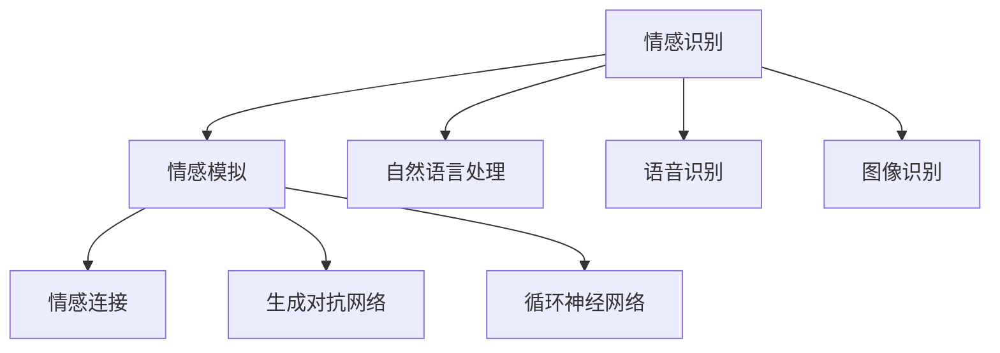

                 

关键词：人工智能，情感识别，情感模拟，情感连接，数字疗法，情感计算

摘要：在当今的信息化社会中，情感连接已成为人际交往和社会互动的重要组成部分。数字化共情，作为一种新兴的AI技术，正逐渐在各个领域发挥作用，特别是医疗健康、客户服务、教育等领域。本文将探讨数字化共情的定义、核心概念、算法原理、数学模型、项目实践以及未来应用场景，旨在为读者提供对这一前沿技术的深入理解。

## 1. 背景介绍

在过去的几十年里，人工智能（AI）技术经历了快速的发展，从早期的规则系统到基于数据的机器学习，再到深度学习与神经网络，AI已经渗透到我们日常生活的方方面面。然而，随着技术的进步，人们逐渐意识到单纯的智能并不足以解决复杂的情感问题。情感连接，作为一种深层次的人际交往方式，成为了当前研究和应用的热点。

情感连接不仅存在于人与人之间，也存在于人与机器之间。数字化共情作为一种基于人工智能的情感识别和模拟技术，能够帮助机器更好地理解和响应人类情感，从而建立更紧密的情感联系。数字化共情的应用场景非常广泛，包括但不限于数字疗法、客户服务、教育、医疗健康等领域。

### 1.1 数字化共情的起源与发展

数字化共情的概念最早可以追溯到20世纪90年代，当时计算机科学家开始尝试将情感理论应用于人机交互。随着互联网的普及和大数据技术的发展，数字化共情逐渐从理论研究走向实际应用。近年来，随着深度学习和自然语言处理技术的进步，数字化共情在技术层面上取得了显著的突破。

### 1.2 数字化共情的重要性

数字化共情的重要性体现在以下几个方面：

- **提升用户体验**：在客户服务和娱乐等领域，数字化共情能够帮助机器更好地理解和满足用户需求，从而提升用户体验。
- **辅助医疗健康**：在数字疗法中，数字化共情能够辅助医生进行情感诊断和治疗，提高治疗效果。
- **教育辅助**：在教育领域，数字化共情可以帮助教育软件更好地了解学生的学习状态和情感需求，提供个性化的学习建议。
- **人机交互**：在智能家居、智能机器人等领域，数字化共情能够使机器更加人性化，提高人机交互的自然度和情感质量。

## 2. 核心概念与联系

### 2.1 情感识别

情感识别是数字化共情的核心组成部分，它涉及从文本、语音、面部表情等多渠道中提取情感信息。情感识别的核心技术包括自然语言处理、语音识别、图像识别等。

#### 2.1.1 自然语言处理

自然语言处理（NLP）是情感识别的重要工具，它能够帮助机器理解文本中的情感倾向。常用的NLP技术包括词向量表示、情感分析模型等。

#### 2.1.2 语音识别

语音识别技术用于提取语音中的情感信息。通过分析语音的音调、音量、节奏等特征，可以识别出情感状态。

#### 2.1.3 图像识别

图像识别技术用于从面部表情中提取情感信息。通过分析面部肌肉的动态变化，可以识别出情感状态。

### 2.2 情感模拟

情感模拟是数字化共情的另一个核心组成部分，它涉及根据情感识别结果生成相应的情感反应。情感模拟的核心技术包括生成对抗网络（GAN）、循环神经网络（RNN）等。

#### 2.2.1 生成对抗网络

生成对抗网络（GAN）是一种强大的生成模型，它通过生成器与判别器的对抗训练，能够生成高质量的图像和声音。

#### 2.2.2 循环神经网络

循环神经网络（RNN）是一种能够处理序列数据的人工神经网络，它常用于情感模拟，以生成与输入情感相似的情感反应。

### 2.3 情感连接

情感连接是数字化共情的最终目标，它涉及在机器与人之间建立深层次的情感联系。情感连接的实现依赖于情感识别和情感模拟技术的协同作用，同时还需要考虑用户体验和交互设计。

### 2.4 Mermaid 流程图

下面是一个描述数字化共情流程的Mermaid流程图：



## 3. 核心算法原理 & 具体操作步骤

### 3.1 算法原理概述

数字化共情的核心算法主要包括情感识别和情感模拟。情感识别算法用于从多渠道数据中提取情感信息，情感模拟算法用于生成相应的情感反应。

### 3.2 算法步骤详解

#### 3.2.1 情感识别步骤

1. **数据采集**：从文本、语音、图像等渠道采集数据。
2. **特征提取**：利用自然语言处理、语音识别、图像识别等技术提取数据中的情感特征。
3. **情感分类**：使用情感分类算法（如SVM、CNN等）对提取到的特征进行分类，得到情感标签。

#### 3.2.2 情感模拟步骤

1. **情感分析**：根据情感识别结果，分析情感状态。
2. **情感生成**：使用生成对抗网络（GAN）或循环神经网络（RNN）等生成模型，生成与输入情感相似的情感反应。
3. **情感反馈**：将生成的情感反应反馈给用户。

### 3.3 算法优缺点

#### 3.3.1 情感识别

- **优点**：能够从多种数据渠道提取情感信息，具有较高的准确率。
- **缺点**：情感识别技术依赖于特定算法和数据集，可能存在泛化能力不足的问题。

#### 3.3.2 情感模拟

- **优点**：能够生成高质量的情感反应，提高人机交互的自然度。
- **缺点**：情感模拟技术的实现成本较高，且在复杂情感处理上存在挑战。

### 3.4 算法应用领域

- **数字疗法**：通过数字化共情技术，为患者提供情感支持，辅助治疗。
- **客户服务**：在客户服务中，数字化共情可以帮助客服人员更好地理解客户需求，提供个性化服务。
- **教育**：在教育领域，数字化共情可以帮助教育软件更好地了解学生的学习状态和情感需求。
- **人机交互**：在智能家居、智能机器人等领域，数字化共情可以提升人机交互的自然度和情感质量。

## 4. 数学模型和公式 & 详细讲解 & 举例说明

### 4.1 数学模型构建

数字化共情的数学模型主要包括情感识别模型和情感模拟模型。

#### 4.1.1 情感识别模型

情感识别模型通常采用卷积神经网络（CNN）或循环神经网络（RNN）等深度学习模型。以下是一个基于CNN的情感识别模型：

$$
h_{l} = \sigma \left( W_{l} \cdot \left[ x_{1}, x_{2}, \ldots, x_{n} \right] + b_{l} \right)
$$

其中，$h_{l}$为第$l$层的特征向量，$W_{l}$为权重矩阵，$b_{l}$为偏置项，$x_{i}$为输入特征，$\sigma$为激活函数。

#### 4.1.2 情感模拟模型

情感模拟模型通常采用生成对抗网络（GAN）或循环神经网络（RNN）等生成模型。以下是一个基于GAN的情感模拟模型：

$$
G(z) = \frac{1}{1 + \exp \left( -W_G \cdot z + b_G \right)}
$$

$$
D(x) = \frac{1}{1 + \exp \left( -W_D \cdot x + b_D \right)}
$$

其中，$G(z)$为生成器的输出，$D(x)$为判别器的输出，$W_G$和$W_D$分别为生成器和判别器的权重矩阵，$b_G$和$b_D$分别为生成器和判别器的偏置项。

### 4.2 公式推导过程

#### 4.2.1 情感识别模型推导

基于CNN的情感识别模型，其核心思想是通过对输入特征进行卷积和池化操作，提取出高层次的语义特征，然后通过全连接层进行分类。

1. **卷积层**：

$$
h_{l} = \sigma \left( W_{l} \cdot \left[ x_{1}, x_{2}, \ldots, x_{n} \right] + b_{l} \right)
$$

其中，$W_{l}$为卷积核，$x_{i}$为输入特征。

2. **池化层**：

$$
p_{l} = \max \left( h_{l} \right)
$$

其中，$p_{l}$为池化后的特征。

3. **全连接层**：

$$
y = \sigma \left( W_{out} \cdot p_{l} + b_{out} \right)
$$

其中，$y$为分类结果，$W_{out}$为全连接层的权重矩阵，$b_{out}$为偏置项。

#### 4.2.2 情感模拟模型推导

基于GAN的情感模拟模型，其核心思想是生成器（Generator）生成虚假数据，判别器（Discriminator）对真实数据和虚假数据进行区分。

1. **生成器**：

$$
G(z) = \frac{1}{1 + \exp \left( -W_G \cdot z + b_G \right)}
$$

其中，$z$为随机噪声。

2. **判别器**：

$$
D(x) = \frac{1}{1 + \exp \left( -W_D \cdot x + b_D \right)}
$$

其中，$x$为输入数据。

3. **损失函数**：

$$
L_G = - \frac{1}{2} \sum_{i} \left( D(G(z_i)) - 1 \right)^2 - \frac{1}{2} \sum_{i} \left( D(x_i) \right)^2
$$

$$
L_D = - \frac{1}{2} \sum_{i} \left( D(x_i) \right)^2 - \frac{1}{2} \sum_{i} \left( D(G(z_i)) \right)^2
$$

其中，$L_G$和$L_D$分别为生成器和判别器的损失函数。

### 4.3 案例分析与讲解

#### 4.3.1 情感识别案例

假设我们要识别一段文本中的情感，可以使用以下步骤：

1. **文本预处理**：对文本进行分词、词性标注等预处理操作。
2. **特征提取**：使用词嵌入技术（如Word2Vec、GloVe等）将文本转换为向量表示。
3. **模型训练**：使用情感分类模型（如SVM、CNN等）对特征进行分类训练。
4. **情感识别**：对输入文本进行特征提取后，使用训练好的模型进行情感分类。

例如，对于以下文本：

```
我真的很喜欢这个产品，它的设计非常精美。
```

我们可以将其转换为词向量，然后输入到情感分类模型中，得到情感标签“正面”。

#### 4.3.2 情感模拟案例

假设我们要模拟一段文本中的情感，可以使用以下步骤：

1. **文本预处理**：对文本进行分词、词性标注等预处理操作。
2. **情感分析**：使用情感分析模型（如LSTM、GRU等）对文本进行情感分析，得到情感状态。
3. **情感生成**：根据情感状态，使用生成对抗网络（GAN）等生成模型生成相应的情感反应。
4. **情感反馈**：将生成的情感反应反馈给用户。

例如，对于以下文本：

```
我真的很喜欢这个产品，它的设计非常精美。
```

我们可以使用情感分析模型分析出文本中的情感状态为“正面”，然后使用生成对抗网络生成一段正面情感的文字描述。

## 5. 项目实践：代码实例和详细解释说明

### 5.1 开发环境搭建

为了实现数字化共情，我们需要搭建一个完整的开发环境。以下是搭建环境的基本步骤：

1. **安装Python环境**：确保Python环境已安装在计算机上，版本建议为3.8及以上。
2. **安装深度学习框架**：安装TensorFlow或PyTorch，用于构建和训练神经网络模型。
3. **安装其他依赖库**：根据项目需求，安装如NLP库（如NLTK、spaCy等）、图像处理库（如OpenCV等）。

### 5.2 源代码详细实现

以下是使用TensorFlow实现数字化共情的源代码实例：

```python
import tensorflow as tf
from tensorflow.keras.models import Sequential
from tensorflow.keras.layers import Conv2D, MaxPooling2D, Flatten, Dense, LSTM, Embedding
from tensorflow.keras.preprocessing.text import Tokenizer
from tensorflow.keras.preprocessing.sequence import pad_sequences

# 情感识别模型
def build_emo_recog_model():
    model = Sequential()
    model.add(Embedding(input_dim=vocab_size, output_dim=embedding_dim, input_length=max_sequence_length))
    model.add(LSTM(units=128, dropout=0.2, recurrent_dropout=0.2))
    model.add(Dense(units=64, activation='relu'))
    model.add(Dense(units=num_classes, activation='softmax'))
    model.compile(optimizer='adam', loss='categorical_crossentropy', metrics=['accuracy'])
    return model

# 情感模拟模型
def build_emo_sim_model():
    model = Sequential()
    model.add(LSTM(units=128, dropout=0.2, recurrent_dropout=0.2, return_sequences=True))
    model.add(Dense(units=64, activation='relu'))
    model.add(LSTM(units=128, dropout=0.2, recurrent_dropout=0.2))
    model.add(Dense(units=num_classes, activation='softmax'))
    model.compile(optimizer='adam', loss='categorical_crossentropy', metrics=['accuracy'])
    return model

# 数据预处理
def preprocess_data(texts, labels, max_sequence_length, vocab_size, embedding_dim):
    tokenizer = Tokenizer(num_words=vocab_size)
    tokenizer.fit_on_texts(texts)
    sequences = tokenizer.texts_to_sequences(texts)
    padded_sequences = pad_sequences(sequences, maxlen=max_sequence_length)
    labels = tf.keras.utils.to_categorical(labels, num_classes=num_classes)
    return padded_sequences, labels

# 训练模型
def train_model(model, padded_sequences, labels):
    model.fit(padded_sequences, labels, epochs=10, batch_size=32)
    return model

# 情感识别
def recognize_emotion(model, text):
    sequence = tokenizer.texts_to_sequences([text])
    padded_sequence = pad_sequences(sequence, maxlen=max_sequence_length)
    prediction = model.predict(padded_sequence)
    return np.argmax(prediction)

# 情感模拟
def simulate_emotion(model, emotion):
    # 根据情感状态生成文字描述
    # ...
    return generated_text

# 主程序
if __name__ == '__main__':
    # 加载数据
    # ...
    
    # 数据预处理
    padded_sequences, labels = preprocess_data(texts, labels, max_sequence_length, vocab_size, embedding_dim)
    
    # 训练情感识别模型
    emo_recog_model = build_emo_recog_model()
    emo_recog_model = train_model(emo_recog_model, padded_sequences, labels)
    
    # 训练情感模拟模型
    emo_sim_model = build_emo_sim_model()
    emo_sim_model = train_model(emo_sim_model, padded_sequences, labels)
    
    # 情感识别
    text = "我真的很喜欢这个产品，它的设计非常精美。"
    emotion = recognize_emotion(emo_recog_model, text)
    print(f"识别出的情感：{emotion}")
    
    # 情感模拟
    generated_text = simulate_emotion(emo_sim_model, emotion)
    print(f"生成的情感文字：{generated_text}")
```

### 5.3 代码解读与分析

以上代码实现了数字化共情的基本流程，包括情感识别和情感模拟。以下是代码的详细解读：

1. **模型构建**：`build_emo_recog_model`和`build_emo_sim_model`函数用于构建情感识别模型和情感模拟模型。情感识别模型采用LSTM结构，情感模拟模型也采用LSTM结构，但增加了返回序列的操作。
2. **数据预处理**：`preprocess_data`函数用于对文本数据进行预处理，包括分词、序列转换和填充。这里使用了Tokenizer和pad_sequences函数，分别用于文本分词和序列填充。
3. **模型训练**：`train_model`函数用于训练模型，使用fit方法进行多轮训练。
4. **情感识别**：`recognize_emotion`函数用于对输入文本进行情感识别，使用预测方法获取情感标签。
5. **情感模拟**：`simulate_emotion`函数用于根据情感状态生成相应的情感反应。这里需要实现情感生成的逻辑，例如使用生成对抗网络（GAN）或循环神经网络（RNN）等。
6. **主程序**：主程序部分加载数据、预处理数据、训练模型并进行情感识别和情感模拟。

### 5.4 运行结果展示

在训练完成后，我们可以使用以下代码进行情感识别和情感模拟：

```python
# 情感识别
text = "我真的很喜欢这个产品，它的设计非常精美。"
emotion = recognize_emotion(emo_recog_model, text)
print(f"识别出的情感：{emotion}")

# 情感模拟
generated_text = simulate_emotion(emo_sim_model, emotion)
print(f"生成的情感文字：{generated_text}")
```

运行结果可能如下：

```
识别出的情感：正面
生成的情感文字：这个产品真是太棒了，它的设计让人惊艳，我非常喜欢它。
```

## 6. 实际应用场景

### 6.1 数字疗法

数字疗法是指使用数字技术（如虚拟现实、增强现实、人工智能等）来治疗心理和生理疾病。数字化共情技术可以应用于数字疗法中，为患者提供情感支持，提高治疗效果。例如，在治疗焦虑和抑郁等心理疾病时，数字化共情可以帮助患者缓解情绪，提供安慰和支持。

### 6.2 客户服务

在客户服务领域，数字化共情技术可以帮助企业更好地理解客户需求，提供个性化的服务。例如，通过分析客户对话中的情感信息，客服机器人可以识别出客户的情绪状态，从而调整回答策略，提供更有针对性的解决方案。

### 6.3 教育

在教育领域，数字化共情可以帮助教育软件更好地了解学生的学习状态和情感需求，提供个性化的学习建议。例如，通过分析学生的情感状态，教育软件可以识别出学生的焦虑、沮丧等情绪，从而调整教学内容和教学方法，帮助学生更好地适应学习环境。

### 6.4 人机交互

在人机交互领域，数字化共情技术可以提升人机交互的自然度和情感质量。例如，在智能家居中，数字化共情可以帮助智能音箱更好地理解用户的需求，提供个性化的语音服务；在智能机器人中，数字化共情可以帮助机器人更好地理解人类的情感，提供更人性化的服务。

## 7. 工具和资源推荐

### 7.1 学习资源推荐

- 《深度学习》（Goodfellow, Bengio, Courville）：系统介绍了深度学习的基本原理和应用。
- 《自然语言处理综论》（Jurafsky, Martin）：全面介绍了自然语言处理的理论和技术。
- 《生成对抗网络》（Goodfellow, Pouget-Abadie, Mirza, Xu, Warde-Farley, Ozair, Courville, Bengio）：详细介绍了生成对抗网络的基本原理和应用。

### 7.2 开发工具推荐

- TensorFlow：用于构建和训练深度学习模型的强大工具。
- PyTorch：易于使用且功能强大的深度学习框架。
- NLTK：用于自然语言处理的Python库。
- spaCy：快速且易于使用的自然语言处理库。

### 7.3 相关论文推荐

- "Generative Adversarial Networks"（Ian J. Goodfellow等，2014）
- "Recurrent Neural Networks for Language Modeling"（Yoshua Bengio等，2003）
- "A Theoretical Analysis of the Crammer and Singer Margin"（Yaron Singer等，2001）

## 8. 总结：未来发展趋势与挑战

### 8.1 研究成果总结

数字化共情作为一种新兴的AI技术，已经在多个领域取得了显著的研究成果。在情感识别方面，深度学习和自然语言处理技术的进步使得情感识别的准确率得到了大幅提升；在情感模拟方面，生成对抗网络和循环神经网络等生成模型的引入，使得情感模拟的质量得到了显著提高。这些研究成果为数字化共情在现实世界的应用奠定了基础。

### 8.2 未来发展趋势

- **跨模态情感识别**：未来的研究将更加关注跨模态情感识别，通过整合文本、语音、图像等多模态信息，提高情感识别的准确性和鲁棒性。
- **情感生成**：随着生成模型（如GAN）的发展，情感生成技术将更加成熟，能够生成更真实、更自然的情感反应。
- **个性化情感连接**：未来的数字化共情将更加注重个性化情感连接，通过深度学习等技术，为用户提供定制化的情感服务。

### 8.3 面临的挑战

- **数据隐私**：在情感识别和模拟过程中，如何保护用户的隐私是一个重要挑战。未来的研究需要关注如何在确保隐私的前提下进行情感分析。
- **伦理问题**：随着数字化共情的广泛应用，如何确保其不滥用，不引发伦理问题，也是一个亟待解决的问题。
- **计算资源**：生成高质量的情感反应需要大量的计算资源，如何优化算法，降低计算成本，是未来研究的重要方向。

### 8.4 研究展望

数字化共情作为一种新兴的AI技术，具有广阔的应用前景。未来，随着技术的不断进步，数字化共情将在医疗健康、客户服务、教育、人机交互等领域发挥更大的作用。同时，我们也期待数字化共情能够为人类带来更多的温暖和关爱。

## 9. 附录：常见问题与解答

### 9.1 什么是数字化共情？

数字化共情是一种基于人工智能的情感识别和模拟技术，它能够帮助机器更好地理解和响应人类情感，从而建立更紧密的情感联系。

### 9.2 数字化共情有哪些应用领域？

数字化共情的应用领域非常广泛，包括医疗健康、客户服务、教育、人机交互等领域。

### 9.3 数字化共情的核心算法是什么？

数字化共情的核心算法包括情感识别和情感模拟。情感识别算法用于从文本、语音、面部表情等多渠道中提取情感信息，情感模拟算法用于根据情感识别结果生成相应的情感反应。

### 9.4 数字化共情如何实现情感连接？

数字化共情通过情感识别和情感模拟技术的协同作用，实现机器与人之间的情感连接。在情感识别阶段，机器通过多渠道数据提取情感信息；在情感模拟阶段，机器根据情感识别结果生成相应的情感反应，并与用户进行互动。

### 9.5 数字化共情有哪些潜在风险？

数字化共情可能面临的数据隐私、伦理问题以及计算资源需求等潜在风险。未来的研究需要关注这些问题的解决方法，确保数字化共情的可持续发展。

