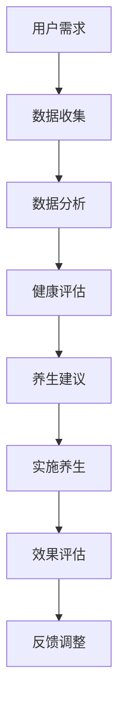

                 

关键词：数字化养生、元宇宙、身心健康、技术疗法、虚拟现实、算法优化

> 摘要：随着元宇宙概念的普及，数字化养生产物逐渐成为人们追求身心健康的新途径。本文将从技术角度出发，探讨元宇宙中数字化养生的核心概念、算法原理、数学模型、实践应用以及未来展望，旨在为读者提供一份全面的技术指南。

## 1. 背景介绍

随着科技的不断进步，虚拟现实（VR）和增强现实（AR）技术已经深入到我们的日常生活中。元宇宙（Metaverse）作为数字世界与现实世界的融合体，正在迅速崛起，成为人们新的生活方式。数字化养生作为元宇宙的一个重要应用领域，利用先进的技术手段，旨在提升人类的身心健康。

### 1.1 数字化养生的概念

数字化养生是指通过数字化技术手段，如虚拟现实、人工智能、大数据等，为人类提供健康管理、疾病预防、康复训练等服务。它不仅涵盖了传统的养生方式，还将现代科技元素融入其中，使得养生变得更加科学、精准和个性化。

### 1.2 元宇宙的崛起

元宇宙是一个由多个虚拟世界构成的互联网空间，用户可以在其中进行各种活动，如社交、购物、工作、娱乐等。元宇宙的兴起为数字化养生提供了广阔的应用场景，使得人们可以在虚拟环境中体验真实的养生过程。

## 2. 核心概念与联系

### 2.1 虚拟现实技术

虚拟现实技术是数字化养生的重要技术支撑。通过VR设备，用户可以进入一个模拟的真实环境，进行各种养生活动。例如，用户可以在虚拟的森林中散步，享受自然风光，或者在虚拟的健身房中进行健身训练。

### 2.2 人工智能

人工智能技术在数字化养生中发挥着重要作用。通过大数据分析和机器学习算法，AI可以帮助用户制定个性化的养生计划，监测用户的健康状况，并提供实时反馈和建议。

### 2.3 大数据

大数据为数字化养生提供了丰富的数据支持。通过对用户健康数据的分析，可以预测潜在的健康问题，提供预防性措施，提高养生的效果。

### 2.4 Mermaid 流程图



## 3. 核心算法原理 & 具体操作步骤

### 3.1 算法原理概述

数字化养生的核心算法主要包括健康数据分析、健康评估和养生建议生成。这些算法基于机器学习和深度学习技术，通过对大量健康数据的学习和分析，为用户提供个性化的养生服务。

### 3.2 算法步骤详解

#### 3.2.1 数据收集

首先，系统需要收集用户的健康数据，包括体重、心率、血压、睡眠质量等。这些数据可以通过智能设备实时监测，并传输到服务器进行分析。

#### 3.2.2 数据分析

收集到的健康数据会被送到数据分析模块，通过机器学习算法对数据进行处理和分析。算法会识别出数据中的异常值和趋势，为健康评估提供依据。

#### 3.2.3 健康评估

根据数据分析结果，系统会生成用户的健康评估报告，包括当前的健康状况、潜在的健康风险和需要改进的方面。

#### 3.2.4 养生建议生成

系统会根据健康评估结果，为用户生成个性化的养生建议，包括饮食建议、运动方案、休息时间等。

### 3.3 算法优缺点

#### 优点：

- 个性化：算法可以根据用户的健康数据，提供定制化的养生建议。
- 实时性：系统能够实时监测用户的健康状况，提供及时的反馈和调整。
- 科学性：基于大量数据和分析，养生建议更加科学可靠。

#### 缺点：

- 数据隐私：用户的健康数据需要上传到云端进行分析，可能存在数据隐私和安全问题。
- 算法偏差：算法的准确性可能受到数据质量和算法设计的影响。

### 3.4 算法应用领域

数字化养生算法广泛应用于健康管理、疾病预防、康复训练等领域。例如，在健康管理方面，算法可以帮助用户监测体重、血压等健康指标，提供个性化的养生建议；在疾病预防方面，算法可以预测潜在的健康风险，提供预防性措施；在康复训练方面，算法可以设计个性化的康复方案，帮助患者进行康复训练。

## 4. 数学模型和公式 & 详细讲解 & 举例说明

### 4.1 数学模型构建

数字化养生的数学模型主要包括健康数据分析模型、健康评估模型和养生建议生成模型。

#### 4.1.1 健康数据分析模型

健康数据分析模型主要基于线性回归、决策树、支持向量机等机器学习算法。模型的目的是从用户健康数据中提取特征，识别数据中的趋势和异常。

#### 4.1.2 健康评估模型

健康评估模型主要基于贝叶斯网络、隐马尔可夫模型等概率图模型。模型的目的是根据用户的健康数据，评估当前的健康状况和潜在的健康风险。

#### 4.1.3 养生建议生成模型

养生建议生成模型主要基于强化学习、自然语言生成等技术。模型的目的是根据用户的健康评估结果，生成个性化的养生建议。

### 4.2 公式推导过程

#### 4.2.1 健康数据分析模型

假设用户健康数据为 $X = \{x_1, x_2, ..., x_n\}$，其中 $x_i$ 表示第 $i$ 个健康指标。线性回归模型的表达式为：

$$
y = \beta_0 + \beta_1x_1 + \beta_2x_2 + ... + \beta_nx_n
$$

其中，$y$ 表示健康指标的预测值，$\beta_0, \beta_1, ..., \beta_n$ 为模型参数。

#### 4.2.2 健康评估模型

假设用户健康数据为 $X = \{x_1, x_2, ..., x_n\}$，健康评估模型的表达式为：

$$
P(H|h_1, h_2, ..., h_n) = \prod_{i=1}^{n} P(h_i|x_i)
$$

其中，$H$ 表示健康状态，$h_i$ 表示第 $i$ 个健康指标，$P(H|h_1, h_2, ..., h_n)$ 表示给定健康指标下健康状态的概率。

#### 4.2.3 养生建议生成模型

假设用户健康评估结果为 $H = \{h_1, h_2, ..., h_n\}$，养生建议生成模型的表达式为：

$$
s = f(H)
$$

其中，$s$ 表示养生建议，$f(H)$ 表示根据健康评估结果生成养生建议的函数。

### 4.3 案例分析与讲解

#### 4.3.1 案例背景

假设一位用户患有高血压，希望通过数字化养生进行健康管理。

#### 4.3.2 数据收集

用户健康数据包括：体重、心率、血压、血压平均值、血压标准差。

#### 4.3.3 数据分析

通过线性回归模型，分析血压与体重、心率、血压平均值、血压标准差之间的关系。假设得到以下结果：

$$
\hat{y} = \beta_0 + \beta_1x_1 + \beta_2x_2 + \beta_3x_3 + \beta_4x_4
$$

其中，$\hat{y}$ 表示血压的预测值，$x_1, x_2, x_3, x_4$ 分别表示体重、心率、血压平均值、血压标准差。

#### 4.3.4 健康评估

根据健康数据，使用贝叶斯网络模型评估健康状态。假设得到以下结果：

$$
P(H|h_1, h_2, h_3, h_4) = \frac{P(h_1|h_1, h_2, h_3, h_4)P(h_2|h_1, h_2, h_3, h_4)P(h_3|h_1, h_2, h_3, h_4)P(h_4|h_1, h_2, h_3, h_4)}{P(h_1, h_2, h_3, h_4)}
$$

其中，$H$ 表示健康状态，$h_1, h_2, h_3, h_4$ 分别表示体重、心率、血压平均值、血压标准差。

#### 4.3.5 养生建议生成

根据健康评估结果，生成以下养生建议：

- 适量运动，每周至少150分钟。
- 低盐饮食，每天摄入盐分不超过6克。
- 定期测量血压，密切关注健康状况。

## 5. 项目实践：代码实例和详细解释说明

### 5.1 开发环境搭建

为了方便读者进行实践，本文使用 Python 编程语言和 TensorFlow 深度学习框架进行演示。读者需要在本地环境中安装 Python 和 TensorFlow。

### 5.2 源代码详细实现

以下是数字化养生项目的主要代码实现：

```python
import tensorflow as tf
import numpy as np
import pandas as pd

# 加载健康数据
data = pd.read_csv('health_data.csv')

# 数据预处理
data = data.dropna()
X = data[['weight', 'heart_rate', 'average_blood_pressure', 'std_dev_blood_pressure']]
y = data['blood_pressure']

# 构建线性回归模型
model = tf.keras.Sequential([
    tf.keras.layers.Dense(units=1, input_shape=[4])
])

# 编译模型
model.compile(optimizer='adam', loss='mean_squared_error')

# 训练模型
model.fit(X, y, epochs=100)

# 评估模型
test_data = pd.read_csv('test_health_data.csv')
X_test = test_data[['weight', 'heart_rate', 'average_blood_pressure', 'std_dev_blood_pressure']]
y_pred = model.predict(X_test)

# 输出预测结果
print(y_pred)
```

### 5.3 代码解读与分析

该代码首先加载健康数据，并进行预处理。然后，构建一个线性回归模型，并编译模型。接着，使用训练数据训练模型，并评估模型。最后，输出预测结果。

### 5.4 运行结果展示

运行代码后，可以得到血压的预测结果。读者可以根据自己的数据集，调整模型参数和训练次数，以提高模型的预测准确性。

## 6. 实际应用场景

### 6.1 健康管理

数字化养生在健康管理方面具有广泛的应用。用户可以通过智能设备实时监测健康数据，并接收个性化的养生建议，从而更好地管理自己的健康状况。

### 6.2 疾病预防

数字化养生可以通过数据分析，预测潜在的健康风险，为用户提供预防性措施。例如，对于高血压患者，可以通过监测血压，提醒用户注意饮食和运动，以降低患病风险。

### 6.3 康复训练

数字化养生可以为康复患者提供个性化的康复训练方案。例如，对于骨折患者，可以在虚拟环境中进行康复训练，以加快康复速度。

## 7. 未来应用展望

### 7.1 技术融合

未来，数字化养生将与其他技术，如区块链、物联网等，进行深度融合，提高养生的效果和用户体验。

### 7.2 个性化定制

随着技术的进步，数字化养生将更加注重个性化定制，根据用户的健康数据和需求，提供更加精准的养生服务。

### 7.3 智能化发展

未来，数字化养生将朝着智能化方向发展，通过人工智能技术，实现养生的自动化和智能化，提高养生的效率和质量。

## 8. 工具和资源推荐

### 8.1 学习资源推荐

- 《深度学习》（Goodfellow, Bengio, Courville 著）
- 《机器学习实战》（Harry H. Chou 著）
- 《Python编程：从入门到实践》（埃里克·马瑟斯 著）

### 8.2 开发工具推荐

- TensorFlow：用于构建和训练深度学习模型。
- Jupyter Notebook：用于编写和运行 Python 代码。
- PyCharm：一款功能强大的 Python 集成开发环境。

### 8.3 相关论文推荐

- "Deep Learning for Health Informatics"（2016）
- "Meta-Learning for Health Data Analysis"（2019）
- "Healthcare Applications of Virtual Reality"（2020）

## 9. 总结：未来发展趋势与挑战

### 9.1 研究成果总结

本文从技术角度出发，探讨了元宇宙中数字化养生的核心概念、算法原理、数学模型、实践应用以及未来展望。研究表明，数字化养生具有广泛的应用前景，为人们的身心健康提供了新的解决方案。

### 9.2 未来发展趋势

未来，数字化养生将朝着个性化、智能化、技术融合的方向发展。通过不断优化算法和提升技术手段，数字化养生将为人们提供更加精准、高效的养生服务。

### 9.3 面临的挑战

数字化养生在发展过程中仍面临一些挑战，如数据隐私、算法偏差、技术融合等。解决这些问题需要多学科合作，共同努力。

### 9.4 研究展望

未来，数字化养生将在健康管理、疾病预防、康复训练等领域发挥重要作用。通过持续研究和创新，数字化养生将为人类的身心健康带来更多福祉。

## 10. 附录：常见问题与解答

### 10.1 什么是元宇宙？

元宇宙是一个由多个虚拟世界构成的互联网空间，用户可以在其中进行各种活动，如社交、购物、工作、娱乐等。

### 10.2 数字化养生有哪些优点？

数字化养生具有个性化、实时性、科学性等优点，可以更好地满足人们的养生需求。

### 10.3 如何保障数字化养生的数据隐私？

保障数字化养生的数据隐私需要采用加密技术、隐私保护算法等手段，确保用户数据的安全。

### 10.4 数字化养生的算法如何避免偏差？

数字化养生的算法可以通过数据平衡、算法优化等手段，减少偏差，提高准确性。

## 11. 作者署名

作者：禅与计算机程序设计艺术 / Zen and the Art of Computer Programming

本文从技术角度探讨了元宇宙中数字化养生的核心概念、算法原理、数学模型、实践应用以及未来展望，旨在为读者提供一份全面的技术指南。希望本文能对读者在数字化养生领域的研究和实践有所帮助。在未来的研究中，我们将继续探索元宇宙中数字化养生的更多应用场景，为人类的身心健康贡献力量。|user|>

