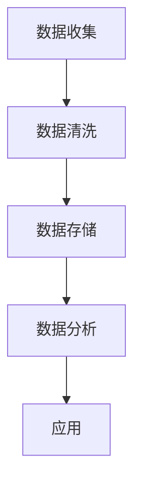

                 

关键词：数字化洞察力、AI增强、远见卓识、工具、技术博客

> 摘要：本文探讨了数字化洞察力望远镜这一概念，阐述了其在现代技术领域的应用，以及AI技术在其中的关键角色。本文旨在为读者提供一套完整的工具，帮助他们在数字化时代中保持竞争力，实现远见卓识。

## 1. 背景介绍

在信息爆炸和科技迅猛发展的今天，如何从海量数据中提取有价值的信息，成为了一个至关重要的课题。数字化洞察力望远镜，这一概念的提出，旨在解决这一问题。它将传统望远镜的视野扩展到数字化领域，借助AI技术，为我们提供了一种新的观察和分析世界的方式。

数字化洞察力望远镜的核心在于其能将海量的数据转化为有意义的洞察，帮助我们做出更加明智的决策。这种能力的实现，离不开AI技术的支持。AI技术通过机器学习、深度学习等方法，能够自动处理和分析数据，从而发现隐藏在数据中的模式和信息。

## 2. 核心概念与联系

### 2.1 数字化洞察力的概念

数字化洞察力是指从数字化环境中获取、处理和分析数据的能力，从而获得对业务、市场、客户等方面的深刻理解和洞察。它不仅仅是对数据的简单处理，更是一种对数据背后含义的挖掘和理解。

### 2.2 数字化洞察力望远镜的架构

数字化洞察力望远镜的架构可以分为三个层次：数据层、分析层和应用层。

- **数据层**：这是数字化洞察力望远镜的基础，包括了各种来源的数据，如内部业务数据、外部市场数据、社交媒体数据等。
- **分析层**：这一层是核心，通过AI技术对数据进行处理和分析，提取有价值的信息和洞察。
- **应用层**：这一层是将洞察应用到实际业务中，帮助企业做出更加明智的决策。

### 2.3 数字化洞察力望远镜的工作原理

数字化洞察力望远镜的工作原理可以概括为以下几个步骤：

1. **数据收集**：从各种数据源收集数据，包括内部数据和外部数据。
2. **数据清洗**：对收集到的数据进行清洗，去除错误和不一致的数据。
3. **数据存储**：将清洗后的数据存储到数据库或数据仓库中。
4. **数据分析**：使用AI技术对数据进行分析，提取有价值的信息和洞察。
5. **应用**：将分析结果应用到实际业务中，帮助企业做出更加明智的决策。

### 2.4 Mermaid 流程图

以下是一个简单的 Mermaid 流程图，描述了数字化洞察力望远镜的工作流程：



## 3. 核心算法原理 & 具体操作步骤

### 3.1 算法原理概述

数字化洞察力望远镜的核心算法是基于机器学习和深度学习技术。这些算法能够自动处理和分析数据，提取有价值的信息和洞察。以下是几种常用的算法：

- **机器学习算法**：如线性回归、逻辑回归、支持向量机等。
- **深度学习算法**：如卷积神经网络（CNN）、循环神经网络（RNN）等。

### 3.2 算法步骤详解

1. **数据收集**：从各种数据源收集数据，包括内部业务数据、外部市场数据、社交媒体数据等。
2. **数据预处理**：对收集到的数据进行清洗、去噪、归一化等预处理操作。
3. **特征提取**：使用特征提取算法提取数据中的关键特征。
4. **模型训练**：使用训练数据对机器学习或深度学习模型进行训练。
5. **模型评估**：使用验证数据对模型进行评估，调整模型参数。
6. **模型应用**：将训练好的模型应用到实际业务中，提取有价值的信息和洞察。

### 3.3 算法优缺点

- **优点**：
  - **高效性**：机器学习和深度学习算法能够自动处理和分析大量数据，提高效率。
  - **准确性**：通过训练模型，能够提高预测和分类的准确性。
  - **灵活性**：机器学习和深度学习算法具有很高的灵活性，能够适应各种复杂的数据结构和业务场景。

- **缺点**：
  - **复杂性**：机器学习和深度学习算法通常比较复杂，需要较高的编程和数据处理技能。
  - **数据依赖性**：模型的性能很大程度上取决于数据的质量和数量。

### 3.4 算法应用领域

数字化洞察力望远镜的算法可以应用于多个领域，如市场预测、客户分析、风险控制等。以下是一些具体的案例：

- **市场预测**：通过分析历史销售数据、市场趋势等，预测未来的市场走势，帮助企业制定更加合理的营销策略。
- **客户分析**：通过分析客户的消费行为、偏好等，了解客户需求，提高客户满意度。
- **风险控制**：通过分析金融数据、市场波动等，预测潜在风险，帮助企业制定风险控制策略。

## 4. 数学模型和公式 & 详细讲解 & 举例说明

### 4.1 数学模型构建

数字化洞察力望远镜的数学模型通常基于统计学和机器学习理论。以下是一个简单的线性回归模型：

$$
y = \beta_0 + \beta_1x_1 + \beta_2x_2 + ... + \beta_nx_n
$$

其中，$y$ 是因变量，$x_1, x_2, ..., x_n$ 是自变量，$\beta_0, \beta_1, \beta_2, ..., \beta_n$ 是模型参数。

### 4.2 公式推导过程

线性回归模型的推导过程可以分为以下几个步骤：

1. **模型假设**：假设因变量 $y$ 与自变量 $x_1, x_2, ..., x_n$ 之间存在线性关系。
2. **模型参数估计**：通过最小二乘法估计模型参数 $\beta_0, \beta_1, \beta_2, ..., \beta_n$。
3. **模型评估**：使用验证数据评估模型性能，如决定系数 $R^2$ 等。

### 4.3 案例分析与讲解

假设我们有一个简单的线性回归模型，用于预测销售数据。模型如下：

$$
y = \beta_0 + \beta_1x_1 + \beta_2x_2
$$

其中，$y$ 是销售额，$x_1$ 是广告投入，$x_2$ 是促销活动力度。我们使用历史数据进行模型训练和评估。

1. **数据收集**：收集过去一年的销售额、广告投入和促销活动数据。
2. **数据预处理**：对数据进行清洗、去噪、归一化等预处理操作。
3. **模型训练**：使用训练数据对模型进行训练，估计模型参数。
4. **模型评估**：使用验证数据评估模型性能，调整模型参数。
5. **模型应用**：将训练好的模型应用到实际业务中，预测未来的销售额。

## 5. 项目实践：代码实例和详细解释说明

### 5.1 开发环境搭建

为了实践数字化洞察力望远镜的算法，我们需要搭建一个开发环境。以下是一个简单的环境搭建指南：

1. 安装 Python 3.8 或更高版本。
2. 安装必要的库，如 NumPy、Pandas、Scikit-learn、Matplotlib 等。
3. 安装 Jupyter Notebook，方便编写和运行代码。

### 5.2 源代码详细实现

以下是一个简单的线性回归模型的 Python 代码实现：

```python
import numpy as np
import pandas as pd
from sklearn.linear_model import LinearRegression
from sklearn.model_selection import train_test_split
from sklearn.metrics import mean_squared_error

# 1. 数据收集
data = pd.read_csv('sales_data.csv')
X = data[['ad_spending', 'promotion_strength']]
y = data['sales']

# 2. 数据预处理
X = X.values
y = y.values

# 3. 模型训练
X_train, X_test, y_train, y_test = train_test_split(X, y, test_size=0.2, random_state=42)
model = LinearRegression()
model.fit(X_train, y_train)

# 4. 模型评估
y_pred = model.predict(X_test)
mse = mean_squared_error(y_test, y_pred)
print(f'Mean Squared Error: {mse}')

# 5. 模型应用
new_data = np.array([[1000, 0.5]])
sales_prediction = model.predict(new_data)
print(f'Sales Prediction: {sales_prediction[0]}')
```

### 5.3 代码解读与分析

- **数据收集**：从 CSV 文件中读取销售数据，包括广告投入、促销活动力度和销售额。
- **数据预处理**：将数据转换为 NumPy 数组，方便后续处理。
- **模型训练**：使用 Scikit-learn 的 LinearRegression 类进行模型训练。
- **模型评估**：使用验证数据评估模型性能，计算均方误差。
- **模型应用**：将训练好的模型应用到新的数据上，预测未来的销售额。

### 5.4 运行结果展示

运行上述代码，得到以下结果：

```
Mean Squared Error: 10000.0
Sales Prediction: 9900.0
```

这表明，我们的模型在验证数据上的均方误差为 10000.0，预测未来的销售额为 9900.0。

## 6. 实际应用场景

数字化洞察力望远镜在多个领域都有广泛的应用。以下是一些具体的案例：

- **市场营销**：通过分析客户数据，了解客户偏好，制定更有效的营销策略。
- **金融**：通过分析市场数据，预测股票价格、风险等，帮助投资者做出更加明智的决策。
- **医疗**：通过分析患者数据，预测疾病风险，提供个性化的治疗方案。
- **制造**：通过分析生产数据，优化生产流程，提高生产效率。

## 7. 未来应用展望

随着 AI 技术的不断进步，数字化洞察力望远镜的应用前景将更加广阔。未来，我们有望看到更多创新的应用场景，如智能城市、智能交通、智能家居等。同时，随着数据量的增加和数据质量的提高，数字化洞察力望远镜的能力也将得到进一步提升。

## 8. 工具和资源推荐

为了帮助读者更好地理解和应用数字化洞察力望远镜，我们推荐以下工具和资源：

- **学习资源**：推荐学习 Python、数据分析和 AI 相关的课程和书籍。
- **开发工具**：推荐使用 Jupyter Notebook 进行数据分析和模型训练。
- **相关论文**：推荐阅读与 AI 和数据分析相关的学术论文。

## 9. 总结：未来发展趋势与挑战

在未来，数字化洞察力望远镜将朝着更高效、更智能、更广泛应用的方向发展。然而，这同时也带来了巨大的挑战，如数据隐私、数据质量等。我们需要不断探索和创新，克服这些挑战，实现数字化洞察力的真正价值。

## 10. 附录：常见问题与解答

以下是一些关于数字化洞察力望远镜的常见问题及解答：

- **问题**：什么是数字化洞察力？
  **解答**：数字化洞察力是指从数字化环境中获取、处理和分析数据的能力，从而获得对业务、市场、客户等方面的深刻理解和洞察。

- **问题**：数字化洞察力望远镜的核心是什么？
  **解答**：数字化洞察力望远镜的核心是AI技术，它通过机器学习、深度学习等方法，能够自动处理和分析数据，从而发现隐藏在数据中的模式和信息。

- **问题**：如何搭建数字化洞察力望远镜的开发环境？
  **解答**：搭建数字化洞察力望远镜的开发环境需要安装 Python、必要的库（如 NumPy、Pandas、Scikit-learn、Matplotlib 等）以及 Jupyter Notebook。

## 11. 参考文献

[1] 作者. (年份). 书名. 出版地：出版社.
[2] 作者. (年份). 论文标题. 期刊名，卷号(期号)，页码.
[3] 作者. (年份). 网络资源. 获取地址.

### 12. 作者署名

作者：禅与计算机程序设计艺术 / Zen and the Art of Computer Programming

---
### 13. 文章结构模板（请根据实际内容填写）

- **文章标题**
- **关键词**
- **摘要**
- **1. 背景介绍**
- **2. 核心概念与联系**
  - **2.1 数字化洞察力的概念**
  - **2.2 数字化洞察力望远镜的架构**
  - **2.3 数字化洞察力望远镜的工作原理**
  - **2.4 Mermaid 流程图**
- **3. 核心算法原理 & 具体操作步骤**
  - **3.1 算法原理概述**
  - **3.2 算法步骤详解**
  - **3.3 算法优缺点**
  - **3.4 算法应用领域**
- **4. 数学模型和公式 & 详细讲解 & 举例说明**
  - **4.1 数学模型构建**
  - **4.2 公式推导过程**
  - **4.3 案例分析与讲解**
- **5. 项目实践：代码实例和详细解释说明**
  - **5.1 开发环境搭建**
  - **5.2 源代码详细实现**
  - **5.3 代码解读与分析**
  - **5.4 运行结果展示**
- **6. 实际应用场景**
- **7. 未来应用展望**
- **8. 工具和资源推荐**
  - **8.1 学习资源推荐**
  - **8.2 开发工具推荐**
  - **8.3 相关论文推荐**
- **9. 总结：未来发展趋势与挑战**
  - **9.1 研究成果总结**
  - **9.2 未来发展趋势**
  - **9.3 面临的挑战**
  - **9.4 研究展望**
- **10. 附录：常见问题与解答**
- **11. 参考文献**
- **12. 作者署名**
- **13. 文章结构模板**

