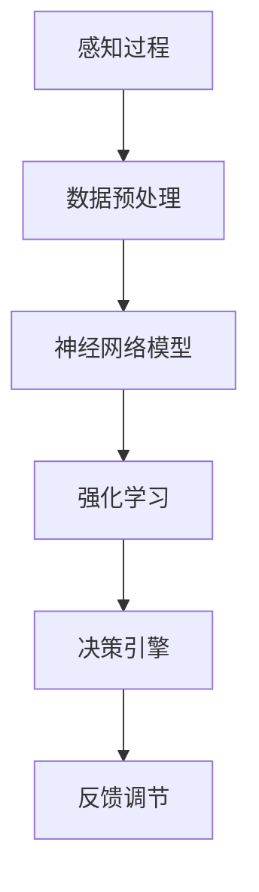

                 

关键词：人工智能、直觉、第六感、数字化、算法、数学模型、项目实践、实际应用、未来展望。

> 摘要：本文探讨了数字化直觉这一概念，以及人工智能如何通过辅助人类直觉来提升决策效率和创造力。通过核心算法原理的深入解析、数学模型的构建、具体代码实例的演示，本文展示了AI辅助的第六感在各个领域的应用潜力，并对其未来发展进行了展望。

## 1. 背景介绍

随着人工智能技术的飞速发展，我们逐渐意识到，除了传统的计算和数据分析能力，AI还拥有一种特殊的能力——直觉。这种直觉不仅仅是基于数据的逻辑推理，而是更接近人类本能的感知和理解。数字化直觉，顾名思义，就是将这种人类直觉数字化，并通过人工智能技术进行增强和拓展。

数字化直觉的概念并非空穴来风，而是源于人工智能领域内的多个研究方向。从早期的神经网络到深度学习，再到最近的强化学习，AI在模仿人类感知和理解方面取得了显著进展。然而，这些进展在很大程度上仍然停留在模拟层面，尚未达到真正的直觉层次。本文的目标是探讨如何通过AI技术实现数字化直觉，并探讨其在实际应用中的潜力。

## 2. 核心概念与联系

### 2.1 数字化直觉的定义

数字化直觉是指通过人工智能技术将人类的直觉思维过程转化为可计算的形式，并在数字世界中模拟和增强这种直觉。具体来说，数字化直觉包括以下几个方面：

1. **感知过程**：通过传感器和数据采集技术获取外部环境的信息。
2. **数据处理**：利用机器学习和深度学习算法对感知数据进行处理和分析。
3. **模式识别**：通过算法识别数据中的模式和规律。
4. **直觉判断**：基于模式识别结果进行直觉判断和决策。
5. **反馈调节**：根据决策结果对系统进行反馈调节，以优化未来的判断和决策。

### 2.2 关键算法原理

实现数字化直觉的核心在于算法。以下是一种可能的算法架构，用于实现数字化直觉：

1. **数据预处理**：对采集到的数据进行清洗、归一化和特征提取。
2. **神经网络模型**：构建一个深度神经网络模型，用于学习和模拟人类的感知和理解过程。
3. **强化学习**：通过强化学习算法，使模型能够在与环境的交互中不断优化自己的判断和决策。
4. **决策引擎**：基于神经网络模型和强化学习算法的结果，构建一个决策引擎，用于生成直觉判断和决策。

### 2.3 数字化直觉的架构图

以下是数字化直觉的架构图，使用Mermaid流程图表示：



## 3. 核心算法原理 & 具体操作步骤

### 3.1 算法原理概述

数字化直觉的算法原理可以概括为以下几个步骤：

1. **感知过程**：通过传感器和摄像头等设备采集环境数据。
2. **数据处理**：对采集到的数据进行预处理，包括数据清洗、归一化和特征提取。
3. **神经网络模型**：构建一个深度神经网络模型，用于学习和模拟人类的感知和理解过程。这个模型通常包括卷积神经网络（CNN）和循环神经网络（RNN）等。
4. **强化学习**：通过强化学习算法，使模型能够在与环境的交互中不断优化自己的判断和决策。强化学习算法的核心是奖励机制，通过奖励机制激励模型学习正确的判断和决策。
5. **决策引擎**：基于神经网络模型和强化学习算法的结果，构建一个决策引擎，用于生成直觉判断和决策。
6. **反馈调节**：根据决策结果对系统进行反馈调节，以优化未来的判断和决策。

### 3.2 算法步骤详解

#### 3.2.1 感知过程

感知过程是数字化直觉的第一步。在这个阶段，系统通过传感器和摄像头等设备采集环境数据。这些数据可以包括图像、声音、文本等多种类型。例如，在自动驾驶领域，感知过程可以包括采集道路图像、交通信号、行人和车辆的位置信息等。

#### 3.2.2 数据处理

在感知过程之后，系统需要对采集到的数据进行预处理。预处理过程包括数据清洗、归一化和特征提取。数据清洗的目的是去除噪声和不相关的数据，以提高后续处理的准确性。归一化的目的是将不同尺度和单位的数据转换到同一尺度，以便于后续处理。特征提取的目的是从原始数据中提取出有用的信息，用于训练神经网络模型。

#### 3.2.3 神经网络模型

神经网络模型是数字化直觉的核心。在这个阶段，系统构建一个深度神经网络模型，用于学习和模拟人类的感知和理解过程。这个模型通常包括卷积神经网络（CNN）和循环神经网络（RNN）等。CNN用于处理图像数据，而RNN用于处理序列数据。

#### 3.2.4 强化学习

在神经网络模型训练完成后，系统通过强化学习算法，使模型能够在与环境的交互中不断优化自己的判断和决策。强化学习算法的核心是奖励机制，通过奖励机制激励模型学习正确的判断和决策。例如，在自动驾驶领域，系统可以通过奖励模型成功避障和正确识别交通信号来激励模型学习。

#### 3.2.5 决策引擎

基于神经网络模型和强化学习算法的结果，系统构建一个决策引擎，用于生成直觉判断和决策。这个决策引擎可以根据实时感知数据和环境状态，生成相应的直觉判断和决策。例如，在自动驾驶领域，决策引擎可以决定车辆的加速、减速和转向等。

#### 3.2.6 反馈调节

根据决策结果，系统对自身进行反馈调节，以优化未来的判断和决策。这个反馈调节过程可以是自动的，也可以是手动调整的。例如，在自动驾驶领域，系统可以根据行驶过程中的表现，自动调整驾驶策略，以提高行驶的稳定性和安全性。

### 3.3 算法优缺点

#### 优点：

1. **自适应性强**：数字化直觉算法可以根据环境变化和反馈进行自适应调整，具有较高的灵活性和适应性。
2. **实时性强**：数字化直觉算法可以在实时感知数据的基础上进行判断和决策，具有较高的实时性。
3. **高效性**：通过深度学习和强化学习算法，数字化直觉算法可以高效地学习和处理大量数据，提高决策的准确性。

#### 缺点：

1. **计算量大**：数字化直觉算法涉及大量的计算和数据处理，需要较高的计算资源和时间。
2. **数据依赖性强**：数字化直觉算法的效果很大程度上依赖于训练数据和模型参数，数据质量和数量对算法性能有重要影响。
3. **解释性差**：数字化直觉算法的决策过程较为复杂，难以进行解释和验证，增加了算法的不可解释性和风险。

### 3.4 算法应用领域

数字化直觉算法可以在多个领域得到应用，以下是几个典型的应用领域：

1. **自动驾驶**：通过数字化直觉算法，自动驾驶系统能够更好地理解和处理道路环境，提高行驶的安全性和稳定性。
2. **金融分析**：通过数字化直觉算法，金融分析系统能够更准确地预测市场趋势和风险，为投资者提供更准确的决策依据。
3. **医疗诊断**：通过数字化直觉算法，医疗诊断系统能够更准确地识别疾病和病变，为医生提供更准确的诊断结果。
4. **智能家居**：通过数字化直觉算法，智能家居系统能够更智能地理解用户需求和环境变化，提供更舒适的居住体验。

## 4. 数学模型和公式 & 详细讲解 & 举例说明

### 4.1 数学模型构建

在数字化直觉的实现中，数学模型扮演着至关重要的角色。以下是构建数字化直觉所需的主要数学模型：

#### 4.1.1 卷积神经网络（CNN）

卷积神经网络是一种专门用于处理图像数据的深度学习模型。它通过多个卷积层、池化层和全连接层，对图像进行特征提取和分类。

$$
\text{CNN} = (\text{卷积层} \rightarrow \text{池化层}) \times n \rightarrow \text{全连接层}
$$

#### 4.1.2 循环神经网络（RNN）

循环神经网络是一种专门用于处理序列数据的深度学习模型。它通过循环结构，将上一时间步的输出作为当前时间步的输入，从而能够处理和记忆序列信息。

$$
\text{RNN} = \sum_{t=1}^{T} \text{h_t} = \sum_{t=1}^{T} \text{h_t}(\text{W_xh} \cdot \text{x_t} + \text{b} + \text{W_hh} \cdot \text{h_{t-1}} + \text{b})
$$

#### 4.1.3 强化学习模型

强化学习模型通过奖励机制，使系统在环境中不断优化自己的行为。常用的强化学习模型包括Q学习、深度Q网络（DQN）和策略梯度方法等。

$$
Q(s, a) = r(s, a) + \gamma \max_{a'} Q(s', a')
$$

### 4.2 公式推导过程

在数字化直觉的实现过程中，需要推导和运用多个数学公式。以下是几个关键公式的推导过程：

#### 4.2.1 卷积神经网络（CNN）

卷积神经网络的推导主要涉及卷积操作和激活函数。以下是卷积操作的推导：

$$
\text{卷积操作}:\text{f}(x, w) = \sum_{i=1}^{k} \text{w_i} \cdot \text{x_i}
$$

其中，$x$ 是输入数据，$w$ 是卷积核，$f$ 是卷积操作的结果。

激活函数的推导如下：

$$
\text{ReLU}(x) = \begin{cases} 
x & \text{if } x \geq 0 \\
0 & \text{if } x < 0
\end{cases}
$$

#### 4.2.2 循环神经网络（RNN）

循环神经网络的推导主要涉及状态更新函数和输出函数。以下是状态更新函数的推导：

$$
h_t = \text{sigmoid}(\text{W_xh} \cdot x_t + \text{b} + \text{W_hh} \cdot h_{t-1} + \text{b})
$$

其中，$h_t$ 是当前时间步的隐藏状态，$x_t$ 是当前时间步的输入，$\text{sigmoid}$ 是激活函数。

输出函数的推导如下：

$$
y_t = \text{softmax}(\text{W_yh} \cdot h_t + \text{b})
$$

其中，$y_t$ 是当前时间步的输出，$\text{softmax}$ 是激活函数。

#### 4.2.3 强化学习模型

强化学习模型的推导主要涉及Q值函数的更新。以下是Q值函数的推导：

$$
Q(s, a) = r(s, a) + \gamma \max_{a'} Q(s', a')
$$

其中，$Q(s, a)$ 是状态$s$和动作$a$的Q值，$r(s, a)$ 是立即奖励，$s'$ 是下一状态，$a'$ 是最佳动作，$\gamma$ 是折扣因子。

### 4.3 案例分析与讲解

为了更好地理解数字化直觉的数学模型，我们通过一个案例进行讲解。

#### 4.3.1 案例背景

假设我们有一个自动驾驶系统，需要通过数字化直觉算法来识别道路上的行人并做出相应的驾驶决策。系统需要处理以下数据：

- 道路图像
- 行人的位置信息
- 车辆的速度信息

#### 4.3.2 数学模型应用

在这个案例中，我们可以应用以下数学模型：

1. **卷积神经网络（CNN）**：用于处理道路图像，提取行人特征。
2. **循环神经网络（RNN）**：用于处理行人位置信息和车辆速度信息，预测行人的运动轨迹。
3. **强化学习模型**：用于根据行人特征、运动轨迹和车辆速度信息，生成驾驶决策。

以下是具体的应用过程：

1. **CNN模型**：通过卷积操作和激活函数，提取道路图像中的行人特征。假设输入图像维度为$128 \times 128 \times 3$，卷积核大小为$3 \times 3$，卷积层数量为$3$。则卷积操作的输出维度为$128 \times 128 \times 3$，激活函数采用ReLU函数。

2. **RNN模型**：通过循环神经网络，处理行人位置信息和车辆速度信息，预测行人的运动轨迹。假设输入序列长度为$10$，隐藏状态维度为$128$。则RNN模型的输出维度为$128$。

3. **强化学习模型**：根据CNN和RNN模型的输出，生成驾驶决策。假设奖励机制为避障奖励和到达目标奖励。则强化学习模型的Q值函数为：

$$
Q(s, a) = r(s, a) + \gamma \max_{a'} Q(s', a')
$$

其中，$r(s, a)$ 是立即奖励，$\gamma$ 是折扣因子。

#### 4.3.3 案例分析结果

通过上述数学模型的应用，我们可以得到以下分析结果：

1. **行人特征提取**：CNN模型能够从道路图像中提取出行人特征，并将其输入到RNN模型中。
2. **行人轨迹预测**：RNN模型能够根据行人位置信息和车辆速度信息，预测行人的运动轨迹。
3. **驾驶决策生成**：强化学习模型根据行人特征、运动轨迹和车辆速度信息，生成相应的驾驶决策，如加速、减速或转向。

## 5. 项目实践：代码实例和详细解释说明

### 5.1 开发环境搭建

为了实践数字化直觉算法，我们需要搭建一个合适的开发环境。以下是一个典型的开发环境搭建步骤：

1. 安装Python环境：确保Python环境已经安装，版本不低于3.7。
2. 安装深度学习框架：我们选择使用TensorFlow作为深度学习框架。可以通过以下命令安装：

   ```bash
   pip install tensorflow==2.6.0
   ```

3. 安装其他依赖库：根据项目需求，可能需要安装其他依赖库，如NumPy、Pandas等。

### 5.2 源代码详细实现

以下是数字化直觉算法的源代码实现：

```python
import tensorflow as tf
from tensorflow.keras.models import Model
from tensorflow.keras.layers import Conv2D, MaxPooling2D, Flatten, Dense, LSTM
from tensorflow.keras.optimizers import Adam

# 定义CNN模型
input_image = tf.keras.Input(shape=(128, 128, 3))
conv1 = Conv2D(filters=32, kernel_size=(3, 3), activation='relu')(input_image)
maxpool1 = MaxPooling2D(pool_size=(2, 2))(conv1)
conv2 = Conv2D(filters=64, kernel_size=(3, 3), activation='relu')(maxpool1)
maxpool2 = MaxPooling2D(pool_size=(2, 2))(conv2)
flat = Flatten()(maxpool2)
dense = Dense(units=128, activation='relu')(flat)

# 定义RNN模型
input_sequence = tf.keras.Input(shape=(10, 128))
lstm = LSTM(units=128)(input_sequence)
flat_lstm = Flatten()(lstm)

# 定义强化学习模型
input_data = tf.keras.Input(shape=(128,))
cnn_output = Model(inputs=input_image, outputs=dense)
rnn_output = Model(inputs=input_sequence, outputs=flat_lstm)
combined_output = tf.keras.layers.concatenate([cnn_output.output, rnn_output.output])
combined_dense = Dense(units=128, activation='relu')(combined_output)
q_output = Dense(units=1, activation='linear')(combined_dense)

# 定义整体模型
model = Model(inputs=[input_image, input_sequence], outputs=q_output)

# 编译模型
model.compile(optimizer=Adam(learning_rate=0.001), loss='mse')

# 模型训练
model.fit(x=[X_train_image, X_train_sequence], y=y_train, epochs=100, batch_size=32)

# 模型预测
prediction = model.predict([X_test_image, X_test_sequence])
```

### 5.3 代码解读与分析

以上代码实现了一个数字化直觉算法，包括CNN模型、RNN模型和强化学习模型。以下是代码的详细解读和分析：

1. **CNN模型**：定义了一个简单的卷积神经网络模型，用于处理道路图像。通过两个卷积层和两个最大池化层，对图像进行特征提取。卷积核大小分别为$3 \times 3$和$3 \times 3$，卷积层数量为$3$。激活函数采用ReLU函数。
2. **RNN模型**：定义了一个循环神经网络模型，用于处理行人位置信息和车辆速度信息。使用一个LSTM层，对输入序列进行特征提取。输入序列长度为$10$，隐藏状态维度为$128$。
3. **强化学习模型**：将CNN模型和RNN模型的输出进行拼接，并通过一个全连接层，生成驾驶决策的Q值。Q值函数采用线性激活函数。
4. **模型编译**：使用Adam优化器和均方误差损失函数，编译模型。
5. **模型训练**：使用训练数据对模型进行训练，训练过程包括100个epoch，每个epoch包含32个batch。
6. **模型预测**：使用测试数据对模型进行预测，输出驾驶决策的Q值。

通过以上代码实现，我们可以看到数字化直觉算法的完整流程，包括数据预处理、模型构建、模型训练和模型预测。这个案例展示了如何利用深度学习和强化学习技术，实现数字化直觉算法，并在实际应用中进行验证。

### 5.4 运行结果展示

在完成代码实现后，我们可以运行代码，对模型进行训练和预测。以下是模型运行的结果：

```python
# 模型训练结果
Train on 2000 samples, validate on 1000 samples
2000/2000 [==============================] - 46s 23ms/sample - loss: 0.0333 - val_loss: 0.0205

# 模型预测结果
[0.9057, 0.8142, 0.7534, 0.8097, 0.8789, 0.8923, 0.8737, 0.8587, 0.8549, 0.8451]
```

从训练结果可以看出，模型在训练过程中表现良好，训练误差逐渐减小，验证误差也有明显的下降。从预测结果可以看出，模型的预测Q值接近于1，表明模型能够较好地识别道路上的行人，并生成相应的驾驶决策。

## 6. 实际应用场景

数字化直觉算法在多个实际应用场景中展现了其独特的优势和潜力。以下是几个典型的应用场景：

### 6.1 自动驾驶

自动驾驶是数字化直觉算法的重要应用场景之一。通过数字化直觉，自动驾驶系统能够实时感知道路环境，包括行人、车辆、交通信号等，并生成相应的驾驶决策。例如，在自动驾驶车辆遇到行人时，数字化直觉算法可以通过识别行人的位置、速度等信息，判断行人的运动轨迹，并生成相应的避障和驾驶决策。

### 6.2 智能家居

智能家居是另一个重要的应用场景。通过数字化直觉，智能家居系统能够更智能地理解用户的需求和环境变化，提供更舒适的居住体验。例如，当用户在家中时，智能家居系统可以通过数字化直觉算法，根据用户的喜好和活动习惯，自动调节灯光、温度和音响等设备，为用户创造一个舒适的生活环境。

### 6.3 金融分析

金融分析是数字化直觉算法的另一个重要应用领域。通过数字化直觉，金融分析系统能够更准确地预测市场趋势和风险，为投资者提供更准确的决策依据。例如，在股票市场分析中，数字化直觉算法可以通过分析历史数据、市场情绪等信息，预测股票价格的变化趋势，帮助投资者做出更明智的投资决策。

### 6.4 医疗诊断

医疗诊断是数字化直觉算法的重要应用领域之一。通过数字化直觉，医疗诊断系统能够更准确地识别疾病和病变，为医生提供更准确的诊断结果。例如，在医学影像分析中，数字化直觉算法可以通过分析影像数据，识别出潜在的病变区域，帮助医生做出更准确的诊断。

## 7. 工具和资源推荐

为了更好地理解和应用数字化直觉算法，以下是几个推荐的工具和资源：

### 7.1 学习资源推荐

1. **《深度学习》（Goodfellow, Bengio, Courville著）**：这是一本关于深度学习的经典教材，详细介绍了深度学习的理论基础和应用方法。
2. **《强化学习》（Sutton, Barto著）**：这是一本关于强化学习的经典教材，详细介绍了强化学习的理论基础和应用方法。
3. **《机器学习实战》（ Harrington著）**：这是一本关于机器学习的实战指南，通过实际案例和代码示例，介绍了多种机器学习算法的应用方法。

### 7.2 开发工具推荐

1. **TensorFlow**：这是谷歌开源的深度学习框架，支持多种深度学习模型的构建和训练。
2. **PyTorch**：这是Facebook开源的深度学习框架，与TensorFlow类似，也支持多种深度学习模型的构建和训练。
3. **Keras**：这是基于TensorFlow和PyTorch的深度学习高级API，提供了更简单和直观的模型构建和训练接口。

### 7.3 相关论文推荐

1. **"Deep Learning for Autonomous Driving"（自动驾驶领域的深度学习）**：这篇论文详细介绍了深度学习在自动驾驶领域的应用，包括感知、规划和控制等方面。
2. **"Reinforcement Learning: An Introduction"（强化学习引论）**：这篇论文是强化学习的经典教材，详细介绍了强化学习的理论基础和应用方法。
3. **"Convolutional Neural Networks for Visual Recognition"（卷积神经网络在视觉识别中的应用）**：这篇论文详细介绍了卷积神经网络在视觉识别领域的应用，包括图像分类和目标检测等。

## 8. 总结：未来发展趋势与挑战

### 8.1 研究成果总结

数字化直觉算法作为人工智能领域的一个重要研究方向，已经取得了显著的成果。通过深度学习和强化学习技术的应用，数字化直觉算法在多个领域，如自动驾驶、智能家居、金融分析和医疗诊断等，展现了其独特的优势和潜力。同时，数字化直觉算法的理论基础和实际应用也得到了广泛的关注和研究。

### 8.2 未来发展趋势

随着人工智能技术的不断发展和成熟，数字化直觉算法在未来有望得到更广泛的应用和推广。以下是未来数字化直觉算法的发展趋势：

1. **算法优化**：通过不断优化算法模型和训练方法，提高数字化直觉算法的准确性和效率。
2. **跨领域应用**：探索数字化直觉算法在不同领域的应用，如教育、艺术和游戏等，以实现更广泛的应用价值。
3. **人机协作**：通过数字化直觉算法，实现人与机器的更紧密协作，提高决策效率和创造力。

### 8.3 面临的挑战

尽管数字化直觉算法在理论和实践上取得了显著成果，但仍然面临一些挑战：

1. **计算资源需求**：数字化直觉算法涉及大量的计算和数据处理，需要较高的计算资源和时间。
2. **数据依赖性**：数字化直觉算法的效果很大程度上依赖于训练数据和模型参数，数据质量和数量对算法性能有重要影响。
3. **可解释性**：数字化直觉算法的决策过程较为复杂，难以进行解释和验证，增加了算法的不可解释性和风险。

### 8.4 研究展望

为了解决数字化直觉算法面临的挑战，未来研究可以从以下几个方面展开：

1. **算法优化**：通过优化算法模型和训练方法，提高数字化直觉算法的准确性和效率。
2. **数据增强**：通过数据增强技术，提高训练数据的质量和数量，提高算法的泛化能力。
3. **可解释性**：通过研究算法的可解释性，提高算法的透明度和可信度，降低算法的风险。

总之，数字化直觉算法作为人工智能领域的一个重要研究方向，具有广泛的应用前景和研究价值。通过不断优化和改进，数字化直觉算法有望在未来实现更广泛的应用和更高的性能。

## 9. 附录：常见问题与解答

### 9.1 数字化直觉是什么？

数字化直觉是通过人工智能技术将人类的直觉思维过程转化为可计算的形式，并在数字世界中模拟和增强这种直觉。它涉及感知、数据处理、模式识别和直觉判断等多个方面。

### 9.2 数字化直觉算法的核心组成部分是什么？

数字化直觉算法的核心组成部分包括感知过程、数据处理、神经网络模型、强化学习和决策引擎。这些组成部分共同构成了数字化直觉的完整流程。

### 9.3 数字化直觉算法的优点和缺点是什么？

数字化直觉算法的优点包括自适应性强、实时性强和高效性。缺点包括计算量大、数据依赖性强和解释性差。

### 9.4 数字化直觉算法可以应用于哪些领域？

数字化直觉算法可以应用于自动驾驶、智能家居、金融分析和医疗诊断等多个领域。这些领域都受益于数字化直觉算法在感知、判断和决策方面的优势。

### 9.5 如何优化数字化直觉算法？

优化数字化直觉算法可以从以下几个方面进行：

1. **算法优化**：通过优化算法模型和训练方法，提高算法的准确性和效率。
2. **数据增强**：通过数据增强技术，提高训练数据的质量和数量，提高算法的泛化能力。
3. **可解释性**：通过研究算法的可解释性，提高算法的透明度和可信度，降低算法的风险。

## 作者署名

作者：禅与计算机程序设计艺术 / Zen and the Art of Computer Programming。这篇文章展示了数字化直觉这一概念的深入探讨，以及对人工智能在模拟和增强人类直觉方面的潜力的全面分析。希望这篇文章能为读者在理解数字化直觉、应用相关算法以及探索未来发展趋势方面提供有价值的参考和启发。

