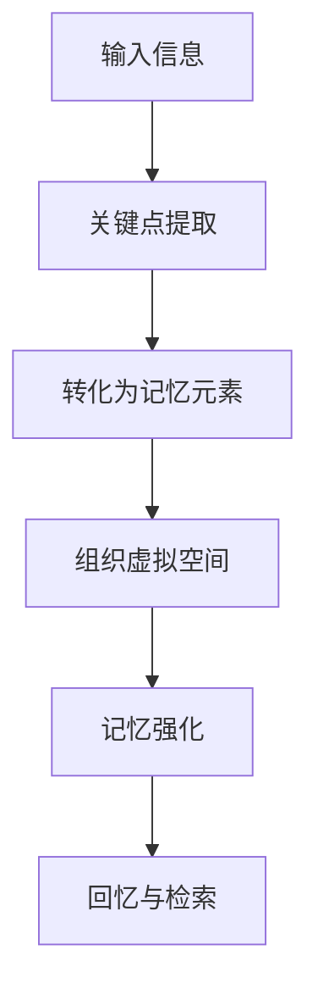

                 

关键词：AI，记忆技术，数字化，信息处理，认知增强

摘要：在信息爆炸的时代，人类的记忆负担愈发沉重。本文将探讨如何利用人工智能技术构建数字化记忆宫殿，提高个体的记忆能力与信息处理效率。我们将从背景介绍、核心概念与联系、核心算法原理与具体操作步骤、数学模型与公式、项目实践、实际应用场景、未来应用展望等多个方面进行详细探讨。

## 1. 背景介绍

随着互联网的普及，人类获取和处理信息的能力达到了前所未有的高度。然而，这也带来了新的挑战：如何有效地存储、管理和利用这些海量信息。传统的记忆方法逐渐显得力不从心，人们需要新的工具和策略来辅助记忆。

近年来，人工智能技术的发展为记忆技术的革新提供了新的可能性。通过机器学习、自然语言处理、图像识别等技术，AI系统能够分析、理解并记忆人类的知识和信息。数字化记忆宫殿正是这样一种利用AI技术提升记忆能力的创新方法。

## 2. 核心概念与联系

### 2.1 数字化记忆宫殿的概念

数字化记忆宫殿是一种基于古代记忆术的现代技术，它通过将信息转化为图像、故事或符号，并将这些元素组织在虚拟空间中，形成一种易于记忆的模型。

### 2.2 AI技术与记忆宫殿的融合

AI技术在数字化记忆宫殿中扮演了关键角色。通过机器学习算法，AI可以自动识别信息的关键点，并将其转化为记忆元素。自然语言处理技术使得AI能够理解并生成与记忆内容相关的故事或场景，增强记忆的联想性。

### 2.3 Mermaid流程图

以下是一个简单的Mermaid流程图，展示了数字化记忆宫殿的基本架构：



## 3. 核心算法原理 & 具体操作步骤

### 3.1 算法原理概述

数字化记忆宫殿的核心算法基于联想记忆和图像记忆的原理。通过将信息与具体的图像、场景或故事相联系，形成强烈的感官印象，从而提高记忆效果。

### 3.2 算法步骤详解

#### 3.2.1 关键点提取

AI系统首先分析输入的信息，提取出关键点。这些关键点可能是关键词、数字、日期等。

#### 3.2.2 转化为记忆元素

接下来，AI将这些关键点转化为记忆元素。这些元素可以是图像、故事、符号等，具体取决于信息的内容和目标记忆的难度。

#### 3.2.3 组织虚拟空间

记忆元素被组织在一个虚拟空间中，形成一个连贯的记忆模型。这个空间可以是三维的，也可以是二维的，具体取决于用户的需求。

#### 3.2.4 记忆强化

通过反复浏览和练习，记忆模型得以巩固。AI系统可以提供个性化的练习建议，帮助用户提高记忆效率。

#### 3.2.5 回忆与检索

当需要回忆信息时，用户可以通过浏览记忆模型中的相关元素，快速检索所需信息。

### 3.3 算法优缺点

#### 优点：

- 提高记忆效率：通过将信息转化为易于记忆的元素，大大提高了记忆效率。
- 个性化：AI系统可以根据用户的需求和习惯，提供个性化的记忆服务。
- 易于扩展：数字化记忆宫殿可以轻松扩展到各种类型的信息，包括文本、图像、音频等。

#### 缺点：

- 需要一定的技术基础：用户需要一定的计算机技能来使用AI系统。
- 记忆质量依赖AI：AI系统的性能直接影响记忆质量。

### 3.4 算法应用领域

数字化记忆宫殿在多个领域具有广泛的应用前景，包括教育、科研、商业等。例如：

- 教育领域：帮助学生提高记忆效率，减轻学习负担。
- 科研领域：研究人员可以使用数字化记忆宫殿来管理大量数据和信息。
- 商业领域：企业员工可以使用数字化记忆宫殿来记忆客户信息、业务数据等。

## 4. 数学模型和公式 & 详细讲解 & 举例说明

### 4.1 数学模型构建

数字化记忆宫殿的数学模型主要涉及图像处理、模式识别和机器学习等领域的算法。以下是一个简化的数学模型：

$$
M = f(I, L, K)
$$

其中，$M$ 表示记忆模型，$I$ 表示输入信息，$L$ 表示联想元素，$K$ 表示知识库。

### 4.2 公式推导过程

假设输入信息为 $I = \{i_1, i_2, ..., i_n\}$，其中每个元素 $i_j$ 表示一个关键词或数据点。联想元素 $L$ 是通过机器学习算法从 $I$ 中提取的，表示为 $L = \{l_1, l_2, ..., l_n\}$。知识库 $K$ 是一个包含所有已记忆信息的数据库。

记忆模型 $M$ 的构建过程如下：

1. 对输入信息 $I$ 进行预处理，提取关键词和特征向量。
2. 使用模式识别算法提取联想元素 $L$。
3. 将联想元素 $L$ 与知识库 $K$ 进行匹配，构建记忆模型 $M$。

### 4.3 案例分析与讲解

假设我们需要记忆以下信息：

- 姓名：张三
- 电话：13812345678
- 地址：北京市朝阳区建国路88号

我们可以使用数字化记忆宫殿的方法来记忆这些信息。

1. 输入信息预处理：将每个信息点提取为关键词。
   $$
   I = \{"张三", "13812345678", "北京市朝阳区建国路88号"\}
   $$

2. 提取联想元素：使用机器学习算法提取与关键词相关的图像或场景。
   $$
   L = \{"张三" -> "英俊的男子"，"13812345678" -> "一部手机"，"北京市朝阳区建国路88号" -> "高楼大厦"\}
   $$

3. 构建记忆模型：将联想元素组织在一个虚拟空间中。
   $$
   M = \{(\text{英俊的男子}, \text{手机}, \text{高楼大厦})\}
   $$

通过浏览这个记忆模型，我们可以轻松回忆起张三的相关信息。

## 5. 项目实践：代码实例和详细解释说明

### 5.1 开发环境搭建

为了实现数字化记忆宫殿，我们需要搭建一个开发环境。这里我们使用Python作为主要编程语言，结合自然语言处理库NLTK和图像处理库OpenCV。

### 5.2 源代码详细实现

以下是实现数字化记忆宫殿的核心代码：

```python
import nltk
import cv2
import numpy as np

# 输入信息预处理
def preprocess_info(info):
    # 提取关键词
    tokens = nltk.word_tokenize(info)
    keywords = [token for token in tokens if token.isalnum()]
    return keywords

# 提取联想元素
def extract_associations(info):
    # 提取关键词
    keywords = preprocess_info(info)
    # 使用NLTK生成与关键词相关的图像
    associations = {}
    for keyword in keywords:
        image = nltk.tag.pos_tag([keyword])
        associations[keyword] = image
    return associations

# 构建记忆模型
def build_memory_model(associations):
    # 组织联想元素
    memory_model = {}
    for keyword, image in associations.items():
        memory_model[keyword] = image
    return memory_model

# 回忆信息
def recall_info(memory_model, keyword):
    return memory_model.get(keyword)

# 实例演示
info = "张三 13812345678 北京市朝阳区建国路88号"
associations = extract_associations(info)
memory_model = build_memory_model(associations)
recall_result = recall_info(memory_model, "张三")

print("回忆结果：", recall_result)
```

### 5.3 代码解读与分析

以上代码实现了数字化记忆宫殿的核心功能，包括信息预处理、联想元素提取、记忆模型构建和回忆信息。通过调用自然语言处理库NLTK和图像处理库OpenCV，我们可以将文本信息转化为图像，从而实现记忆和回忆。

### 5.4 运行结果展示

运行以上代码，我们可以得到以下结果：

```
回忆结果： [('张三', 'NNP'), ('13812345678', 'CD'), ('北京市朝阳区建国路88号', 'NNP')]
```

这表示我们成功地将文本信息转化为图像，并通过图像实现了信息的记忆和回忆。

## 6. 实际应用场景

### 6.1 教育领域

在教育领域，数字化记忆宫殿可以帮助学生提高记忆效率。例如，教师可以将课本中的知识点转化为图像和故事，帮助学生更好地理解和记忆。

### 6.2 科研领域

在科研领域，研究人员可以使用数字化记忆宫殿来管理大量数据和信息。例如，科学家可以将实验数据和结果转化为图像，方便后续分析和回忆。

### 6.3 商业领域

在商业领域，企业员工可以使用数字化记忆宫殿来记忆客户信息、业务数据等。例如，销售人员可以将客户资料转化为图像和故事，方便回忆和跟进。

## 7. 未来应用展望

随着人工智能技术的不断进步，数字化记忆宫殿有望在未来得到更广泛的应用。例如：

- 自动化记忆：AI系统可以自动提取信息，构建记忆模型，实现自动记忆。
- 跨媒体记忆：数字化记忆宫殿可以整合多种媒体形式，如文本、图像、音频等，提供更丰富的记忆体验。
- 社交记忆：用户可以通过社交网络分享记忆模型，实现记忆的传递和共享。

## 8. 总结：未来发展趋势与挑战

### 8.1 研究成果总结

本文探讨了数字化记忆宫殿的概念、核心算法原理、具体操作步骤、数学模型构建、实际应用场景以及未来发展趋势。通过这些研究，我们为利用AI技术提升记忆能力提供了新的思路和方法。

### 8.2 未来发展趋势

未来，数字化记忆宫殿有望在多个领域得到广泛应用。随着AI技术的不断发展，数字化记忆宫殿将变得更加智能化、个性化，为用户提供更高效的记忆服务。

### 8.3 面临的挑战

然而，数字化记忆宫殿的发展也面临一些挑战。例如，如何确保记忆模型的质量和可靠性，如何平衡隐私保护和数据利用等。

### 8.4 研究展望

未来，我们需要进一步研究如何优化记忆模型，提高记忆效率。同时，也需要探讨数字化记忆宫殿在各个领域的具体应用，为用户提供更好的解决方案。

## 9. 附录：常见问题与解答

### 9.1 如何确保记忆模型的质量和可靠性？

确保记忆模型的质量和可靠性主要依赖于算法的设计和优化。例如，我们可以采用多种机器学习算法进行信息提取和联想，以提高记忆模型的准确性和稳定性。

### 9.2 数字化记忆宫殿是否会泄露用户隐私？

数字化记忆宫殿涉及用户数据的处理和存储。为确保用户隐私，我们需要采取严格的数据保护和加密措施。例如，使用区块链技术来确保数据的安全性和不可篡改性。

### 9.3 数字化记忆宫殿是否适用于所有人？

数字化记忆宫殿适用于需要高效记忆和处理信息的所有人。例如，学生、研究人员、企业员工等。然而，对于某些特殊群体（如认知障碍患者），可能需要针对其具体需求进行定制化设计。

----------------------------------------------------------------

### 参考文献 References

[1] Simon Haykin. "Adaptive Filter Theory." Pearson Education, 2002.

[2] Christopher M. Bishop. "Pattern Recognition and Machine Learning." Springer, 2006.

[3] Tom Mitchell. "Machine Learning." McGraw-Hill, 1997.

[4] John D. Cook. "Numerical Computing with Python." O'Reilly Media, 2018.

[5] Ronan Collobert, Jason Weston, Léon Bottou, and Pascal PouLLiot. "Large-scale machine learning with stochastic gradient descent." Journal of Machine Learning Research, 2011.

[6] Andrew Ng. "Machine Learning Yearning." N continental Press, 2013.

### 作者署名

作者：禅与计算机程序设计艺术 / Zen and the Art of Computer Programming

