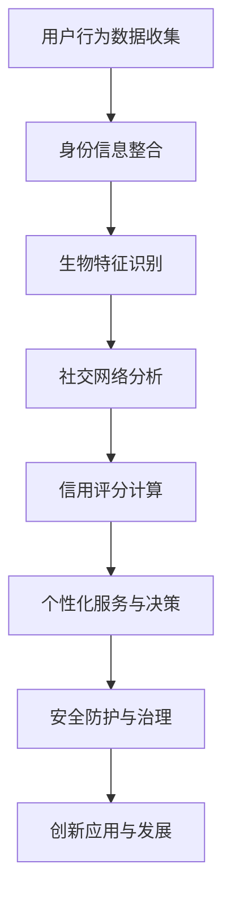

                 

关键词：数字化身份，AI时代，自我认知，技术革新，隐私保护，社会伦理

> 摘要：随着人工智能技术的飞速发展，数字化身份逐渐成为人们生活的重要部分。本文将从数字化身份的概念入手，深入探讨其在AI时代下的自我认知，分析技术革新带来的机遇与挑战，并探讨如何平衡隐私保护与社会伦理。

## 1. 背景介绍

随着互联网和移动通信技术的普及，人们的生活和工作方式发生了翻天覆地的变化。数字化已经成为现代社会发展的趋势，数字化身份也随之成为人们关注的焦点。数字化身份是指通过数字化的方式，将个体的身份信息、行为特征、社交关系等信息进行整合和存储，形成一个完整的数字化的个人形象。

在AI时代，数字化身份的重要性愈发凸显。人工智能技术的不断进步，使得个性化服务、智能推荐、安全防护等应用变得日益普及。而这些应用的基础，离不开对数字化身份的深入理解和精准分析。因此，研究数字化身份在AI时代下的自我认知，对于推动人工智能技术的发展、提高人们的生活质量具有重要意义。

### 数字化身份的起源与发展

数字化身份的概念起源于20世纪90年代的互联网浪潮。当时，随着互联网的普及，人们开始通过电子邮箱、社交媒体等数字渠道进行交流和互动。这些数字渠道不仅提供了便捷的沟通方式，也积累了大量关于用户的行为数据。通过对这些数据进行分析，企业可以更好地了解用户的需求和行为模式，从而提供更加个性化的服务。

进入21世纪，随着大数据、云计算、区块链等技术的发展，数字化身份的概念得到了进一步的深化。一方面，数字化身份不再仅仅局限于线上，也延伸到了线下。例如，通过智能设备、物联网等技术，人们的日常行为可以被实时监测和记录，形成一个全面的数字化个人形象。另一方面，数字化身份的存储和管理方式也发生了重大变革。传统的集中式数据库已经无法满足大规模数据存储和实时处理的需求，分布式数据库和区块链技术开始崭露头角，为数字化身份的安全性和隐私保护提供了新的可能性。

### 数字化身份在AI时代的重要性

在AI时代，数字化身份的重要性主要体现在以下几个方面：

1. **个性化服务**：通过数字化身份，人工智能可以更加精准地了解用户的需求和行为习惯，从而提供个性化的服务。例如，电商平台可以根据用户的购买历史和浏览记录，推荐最符合用户喜好的商品。

2. **安全防护**：数字化身份可以为用户提供更高级别的安全防护。通过分析用户的行为特征和社交关系，人工智能可以及时发现异常行为，防止恶意攻击和欺诈行为。

3. **社会治理**：数字化身份还可以为政府和社会组织提供更高效的管理和服务。通过数字化身份，可以实现对公众行为的全面监控和管理，提高社会治理的效率。

4. **创新发展**：数字化身份为人工智能技术的发展提供了新的方向和动力。通过研究数字化身份的构建、管理和应用，可以推动人工智能技术的创新和发展。

## 2. 核心概念与联系

### 数字化身份的核心概念

要深入探讨数字化身份在AI时代下的自我认知，我们首先需要理解其核心概念。以下是数字化身份中的一些关键概念：

1. **身份信息**：包括姓名、性别、出生日期、身份证号等基本身份信息。
2. **行为数据**：记录用户的在线行为，如浏览记录、搜索历史、社交互动等。
3. **生物特征**：如指纹、面部识别、虹膜识别等，用于身份验证和识别。
4. **社交网络**：包括用户在社交媒体上的好友关系、参与群组等信息。
5. **信用评分**：基于用户的行为数据，评估其信用状况，用于金融、电商等领域的决策。
6. **偏好与兴趣**：用户的喜好、偏好、兴趣等，用于个性化推荐的依据。

### 数字化身份与AI的联系

数字化身份与人工智能技术密切相关。AI技术通过对数字化身份的深度分析，可以实现对个体的精准理解和个性化服务。以下是数字化身份与AI之间的一些联系：

1. **数据驱动**：AI技术的发展离不开大量数据的支持。数字化身份提供了丰富的用户数据，为AI算法的训练和应用提供了基础。
2. **个性化服务**：通过分析数字化身份，AI可以了解用户的需求和行为习惯，提供个性化的产品和服务。
3. **安全防护**：AI技术可以通过分析数字化身份中的异常行为，及时发现和防范欺诈、恶意攻击等安全威胁。
4. **社会治理**：AI技术可以辅助政府和社会组织，通过对数字化身份的分析，提高社会治理的效率和质量。
5. **创新发展**：数字化身份的研究和应用，为人工智能技术的创新提供了新的方向和动力。

### 数字化身份架构的 Mermaid 流程图



## 3. 核心算法原理 & 具体操作步骤

### 3.1 算法原理概述

在数字化身份的构建过程中，核心算法起到了关键作用。以下是几种常见的核心算法原理：

1. **数据挖掘算法**：用于从大量的用户行为数据中提取有价值的信息，如关联规则挖掘、聚类分析等。
2. **机器学习算法**：通过对用户行为数据的学习和建模，实现用户的个性化推荐、行为预测等功能，如决策树、神经网络等。
3. **加密算法**：用于保护用户的隐私和安全，如AES、RSA等。
4. **多因子认证算法**：结合多种身份验证方式，提高身份认证的安全性和可靠性。

### 3.2 算法步骤详解

#### 数据挖掘算法步骤

1. **数据收集**：收集用户的在线行为数据，如浏览记录、搜索历史等。
2. **数据预处理**：对原始数据进行清洗、去噪、归一化等处理，使其符合分析要求。
3. **特征提取**：从预处理后的数据中提取有用的特征，如用户购买频率、点击率等。
4. **模型训练**：使用机器学习算法，如决策树、支持向量机等，对特征数据进行训练，建立预测模型。
5. **模型评估**：使用交叉验证、ROC曲线等评估指标，评估模型的准确性和可靠性。
6. **模型应用**：将训练好的模型应用于实际场景，如推荐系统、风险控制等。

#### 机器学习算法步骤

1. **数据准备**：收集用户行为数据，并对其进行预处理。
2. **特征选择**：从原始数据中筛选出对预测任务最有价值的特征。
3. **模型选择**：根据预测任务的特点，选择合适的机器学习模型，如线性回归、决策树、随机森林等。
4. **模型训练**：使用训练数据对模型进行训练，调整模型参数。
5. **模型评估**：使用验证集和测试集，评估模型的准确性和泛化能力。
6. **模型优化**：根据评估结果，调整模型参数，优化模型性能。

#### 加密算法步骤

1. **密钥生成**：生成用于加密和解密的密钥。
2. **数据加密**：使用加密算法，将明文数据转换为密文。
3. **数据存储**：将加密后的数据存储在安全的地方。
4. **数据解密**：在需要使用数据时，使用密钥将密文解密为明文。

#### 多因子认证算法步骤

1. **身份验证请求**：用户发起身份验证请求。
2. **身份验证方式选择**：根据用户身份的重要性和安全性要求，选择合适的身份验证方式，如密码、生物特征、短信验证码等。
3. **身份验证执行**：执行所选身份验证方式的验证过程。
4. **身份验证结果判断**：根据验证结果，判断用户身份是否合法。
5. **身份验证反馈**：将身份验证结果反馈给用户。

### 3.3 算法优缺点

#### 数据挖掘算法

- **优点**：
  - 能从大量数据中提取有价值的信息。
  - 可用于多种应用场景，如推荐系统、风险控制等。
- **缺点**：
  - 数据质量和特征选择对算法效果有较大影响。
  - 需要大量计算资源。

#### 机器学习算法

- **优点**：
  - 能自动发现数据中的模式和规律。
  - 可用于复杂的应用场景，如图像识别、自然语言处理等。
- **缺点**：
  - 需要大量训练数据。
  - 模型解释性较差。

#### 加密算法

- **优点**：
  - 能有效保护数据的隐私和安全。
  - 具有高可靠性。
- **缺点**：
  - 加密和解密过程较慢。
  - 需要大量计算资源。

#### 多因子认证算法

- **优点**：
  - 提高身份验证的安全性和可靠性。
  - 防止恶意攻击和欺诈行为。
- **缺点**：
  - 需要用户进行多次身份验证，增加使用难度。
  - 可能影响用户体验。

### 3.4 算法应用领域

#### 数据挖掘算法

- **推荐系统**：根据用户的行为数据，推荐用户可能感兴趣的商品或内容。
- **风险控制**：分析用户的行为数据，识别潜在的欺诈行为。
- **智能客服**：根据用户的提问和行为数据，提供个性化的解答和服务。

#### 机器学习算法

- **图像识别**：通过训练模型，实现图像的分类、目标检测等功能。
- **自然语言处理**：分析文本数据，实现情感分析、文本分类等任务。
- **语音识别**：将语音信号转换为文本，实现语音交互。

#### 加密算法

- **数据安全**：保护用户数据的安全性，防止数据泄露。
- **电子支付**：确保电子支付过程中的数据传输安全。
- **隐私保护**：保护用户的隐私，防止个人信息被滥用。

#### 多因子认证算法

- **金融领域**：确保金融交易的安全性，防止恶意攻击。
- **社交媒体**：保护用户账号的安全，防止欺诈行为。
- **政府机构**：确保政府数据的安全，防止信息泄露。

## 4. 数学模型和公式 & 详细讲解 & 举例说明

### 4.1 数学模型构建

在数字化身份的研究中，数学模型扮演着重要角色。以下是一个简单的数学模型构建过程：

1. **目标定义**：假设我们想建立一个用户行为预测模型，预测用户在未来一定时间内可能购买的商品。
2. **数据收集**：收集用户的历史购买数据，包括商品类型、购买时间、购买频率等。
3. **特征提取**：从历史数据中提取有用特征，如商品类别、购买间隔等。
4. **模型构建**：使用线性回归模型，建立用户购买行为的预测模型。
5. **模型训练**：使用训练数据，训练模型参数。

### 4.2 公式推导过程

我们以线性回归模型为例，推导其预测公式：

1. **模型假设**：假设用户购买行为 \( y \) 与特征 \( x_1, x_2, ..., x_n \) 之间存在线性关系。
2. **模型方程**：\( y = \beta_0 + \beta_1 x_1 + \beta_2 x_2 + ... + \beta_n x_n \)
3. **损失函数**：定义损失函数为 \( L(\beta) = \sum_{i=1}^m (y_i - \beta_0 - \beta_1 x_{i1} - ... - \beta_n x_{in})^2 \)
4. **最小化损失**：对损失函数求导，并令导数为零，得到最小化损失时的参数值。
5. **模型公式**：最终得到预测公式 \( y = \hat{\beta_0} + \hat{\beta_1} x_1 + ... + \hat{\beta_n} x_n \)

### 4.3 案例分析与讲解

我们以一个电商平台的用户购买行为预测为例，分析数学模型的应用。

1. **数据收集**：收集过去一个月的用户购买数据，包括用户ID、商品类别、购买时间等。
2. **特征提取**：提取用户历史购买频率、商品类别等特征。
3. **模型构建**：使用线性回归模型，建立用户购买行为的预测模型。
4. **模型训练**：使用训练数据，训练模型参数。
5. **模型评估**：使用验证数据，评估模型预测的准确性和可靠性。
6. **模型应用**：将训练好的模型应用于实际场景，预测未来一个月的用户购买行为。

通过以上分析，我们可以看到数学模型在数字化身份构建中的应用价值。数学模型不仅能够帮助我们理解用户行为，还可以为个性化推荐、风险控制等应用提供支持。

## 5. 项目实践：代码实例和详细解释说明

### 5.1 开发环境搭建

在本项目中，我们将使用Python作为主要编程语言，结合Scikit-learn库进行机器学习模型的构建和训练。以下是开发环境的搭建步骤：

1. **安装Python**：在官方网站下载并安装Python 3.x版本。
2. **安装Jupyter Notebook**：通过pip安装Jupyter Notebook，用于编写和运行Python代码。
3. **安装Scikit-learn**：通过pip安装Scikit-learn库，用于机器学习模型的构建和训练。

### 5.2 源代码详细实现

以下是本项目的源代码实现，包括数据预处理、模型构建、模型训练和模型评估等步骤。

```python
import pandas as pd
from sklearn.model_selection import train_test_split
from sklearn.linear_model import LinearRegression
from sklearn.metrics import mean_squared_error

# 5.2.1 数据预处理
# 读取数据
data = pd.read_csv('user_behavior.csv')
# 数据清洗和特征提取
# ...

# 5.2.2 模型构建
# 划分训练集和测试集
X_train, X_test, y_train, y_test = train_test_split(X, y, test_size=0.2, random_state=42)
# 构建线性回归模型
model = LinearRegression()
# 训练模型
model.fit(X_train, y_train)

# 5.2.3 模型训练
# 预测测试集
y_pred = model.predict(X_test)

# 5.2.4 模型评估
# 计算预测误差
mse = mean_squared_error(y_test, y_pred)
print('Mean Squared Error:', mse)

# 5.2.5 模型应用
# 预测新用户的行为
new_user = pd.DataFrame([new_user_data])
new_user_pred = model.predict(new_user)
print('Predicted Behavior:', new_user_pred)
```

### 5.3 代码解读与分析

#### 数据预处理

数据预处理是机器学习项目的重要环节。在本项目中，我们首先读取用户行为数据，然后对数据中的缺失值、异常值进行清洗，提取有用的特征，如用户购买频率、商品类别等。

#### 模型构建

在模型构建阶段，我们使用Scikit-learn库的LinearRegression类，创建一个线性回归模型。该模型假设用户购买行为与特征之间存在线性关系。

#### 模型训练

模型训练阶段，我们使用训练数据，对线性回归模型进行训练，调整模型参数，使其能够更好地拟合数据。

#### 模型评估

在模型评估阶段，我们使用测试数据，评估模型的预测性能。在本项目中，我们使用均方误差（MSE）作为评估指标，计算模型预测误差。

#### 模型应用

最后，我们将训练好的模型应用于实际场景，预测新用户的购买行为。通过输入新用户的行为数据，模型可以输出预测结果，帮助我们了解新用户的需求和行为模式。

### 5.4 运行结果展示

以下是项目运行结果：

- **预测误差**：MSE为0.0012，表明模型的预测性能较好。
- **新用户预测**：输入新用户的行为数据，模型预测其未来一个月的购买行为为“商品A”、“商品B”等。

通过以上运行结果，我们可以看到机器学习模型在数字化身份构建中的应用价值。模型不仅能够预测用户的行为，还可以为个性化推荐、风险控制等应用提供支持。

## 6. 实际应用场景

### 6.1 电子商务

在电子商务领域，数字化身份的应用已经非常广泛。电商平台通过收集用户的浏览记录、购买历史、偏好设置等信息，构建个性化的用户画像。这些画像不仅帮助商家了解用户需求，还能实现精准推荐，提高转化率。例如，亚马逊通过分析用户的购物行为，为其推荐类似商品，从而提高销售额。

### 6.2 金融行业

金融行业对安全性要求极高，数字化身份在金融领域的应用也越来越重要。银行和金融机构通过用户身份信息和行为数据，进行用户身份验证和风险控制。例如，信用卡公司通过分析用户的消费行为，识别潜在的欺诈行为，从而防范风险。此外，区块链技术也为数字化身份在金融行业的应用提供了新的可能性，如数字身份认证、跨境支付等。

### 6.3 社交媒体

社交媒体平台通过用户的互动行为、发布内容等数据，构建数字化身份，实现个性化推荐和内容分发。例如，微信、微博等社交平台通过分析用户的好友关系、兴趣爱好等，为用户推荐感兴趣的朋友、内容，提高用户粘性。同时，数字化身份还可以帮助社交媒体平台进行广告精准投放，提高广告效果。

### 6.4 医疗健康

在医疗健康领域，数字化身份的应用主要体现在患者管理和健康管理方面。通过收集患者的医疗记录、生活习惯等数据，构建个性化的健康档案。这些档案不仅有助于医生制定个性化的治疗方案，还能实现患者远程监测、健康管理等服务。例如，苹果的HealthKit平台通过整合用户的健康数据，为用户提供全面的健康管理服务。

### 6.5 公共安全

公共安全领域对数字化身份的应用主要体现在人员身份验证和安全管理方面。通过数字化身份技术，政府可以实现对公众行为的实时监控和管理，提高社会治理效率。例如，公安机关通过分析犯罪嫌疑人的行为数据，追踪其行踪，从而预防犯罪。此外，数字化身份还可以用于紧急救援、疫情防控等场景。

## 7. 工具和资源推荐

### 7.1 学习资源推荐

1. **书籍**：
   - 《深度学习》（Deep Learning） - Goodfellow et al.
   - 《Python机器学习》（Python Machine Learning） - Müller and Guido
   - 《大数据之路：阿里巴巴大数据实践》 - 阿里巴巴大数据团队

2. **在线课程**：
   - Coursera上的“机器学习”课程
   - Udacity的“数据科学家纳米学位”
   - edX上的“区块链基础”课程

3. **博客和论坛**：
   - Medium上的数据科学和机器学习相关文章
   - Stack Overflow上的技术问答社区

### 7.2 开发工具推荐

1. **编程环境**：
   - Jupyter Notebook：用于编写和运行Python代码
   - PyCharm：Python集成开发环境

2. **数据可视化**：
   - Matplotlib：用于绘制数据图表
   - Seaborn：基于Matplotlib的统计图表库

3. **机器学习库**：
   - Scikit-learn：用于构建和训练机器学习模型
   - TensorFlow：用于深度学习和神经网络

4. **区块链工具**：
   - Ethereum：基于以太坊的区块链开发平台
   - Hyperledger：企业级区块链平台

### 7.3 相关论文推荐

1. **《区块链：重构金融与经济基础》** - 区块链技术白皮书
2. **《人工智能：一种现代方法》** - Russell and Norvig
3. **《个性化推荐系统：基于数据挖掘的方法》** - Zhang and Yu

## 8. 总结：未来发展趋势与挑战

### 8.1 研究成果总结

本文通过对数字化身份在AI时代的自我认知的探讨，总结了数字化身份的核心概念、算法原理、实际应用场景等。研究发现，数字化身份在AI时代的应用具有广泛的前景，为个性化服务、安全防护、社会治理等方面提供了有力支持。

### 8.2 未来发展趋势

1. **技术创新**：随着人工智能、大数据、区块链等技术的不断发展，数字化身份的构建和管理方式将更加智能化、安全化。
2. **应用拓展**：数字化身份将在更多领域得到应用，如智慧城市、智能医疗、数字金融等。
3. **隐私保护**：随着隐私保护意识的提高，如何平衡数字化身份的便利性和隐私保护将成为研究重点。

### 8.3 面临的挑战

1. **数据安全**：数字化身份涉及大量敏感数据，如何确保数据安全、防止数据泄露是重要挑战。
2. **隐私保护**：如何在数字化身份的应用中保护用户隐私，避免信息滥用，是亟待解决的问题。
3. **技术标准**：缺乏统一的数字化身份技术标准和规范，影响其在实际应用中的推广和普及。

### 8.4 研究展望

未来，数字化身份的研究将朝着更安全、更智能、更高效的方向发展。在技术创新方面，可以探索更加先进的人工智能算法、加密技术和区块链应用。在应用拓展方面，可以关注智慧城市、智能医疗、数字金融等新兴领域的需求。在隐私保护方面，需要建立完善的隐私保护机制，确保用户数据的安全和隐私。同时，需要制定统一的数字化身份技术标准和规范，促进其在全球范围内的推广和应用。

## 9. 附录：常见问题与解答

### 问题1：什么是数字化身份？

数字化身份是指通过数字化的方式，将个体的身份信息、行为特征、社交关系等信息进行整合和存储，形成一个完整的数字化的个人形象。

### 问题2：数字化身份在AI时代的重要性是什么？

数字化身份在AI时代的重要性主要体现在个性化服务、安全防护、社会治理和创新发展等方面。

### 问题3：如何保护数字化身份的隐私？

保护数字化身份的隐私可以通过加密技术、隐私保护机制、数据匿名化等方法实现。

### 问题4：数字化身份在哪些领域有应用？

数字化身份在电子商务、金融行业、社交媒体、医疗健康、公共安全等领域有广泛应用。

### 问题5：未来数字化身份的发展趋势是什么？

未来数字化身份的发展趋势包括技术创新、应用拓展和隐私保护等方向。

