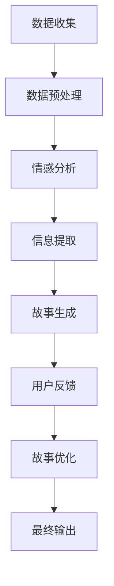

                 

关键词：数字化遗产、个人传记、AI、创业、自然语言处理、大数据分析、人机交互、故事讲述

> 摘要：随着人工智能技术的飞速发展，如何将个人生平转化为生动的故事成为了一个新的研究热点。本文探讨了一种基于AI的个人传记创作方法，通过自然语言处理、大数据分析和人机交互技术，实现了对个人数字化遗产的深度挖掘和故事化讲述，为创业者和个人传记作家提供了新的思路和工具。

## 1. 背景介绍

在现代社会，个人传记已经成为一种重要的文化形式，不仅记录了个人的人生经历，也反映了时代的变迁和社会的发展。然而，传统的个人传记创作往往需要耗费大量的时间和精力，而且容易出现信息遗漏和主观解读。随着人工智能技术的发展，我们有机会借助AI的力量，实现个人传记的自动化生成，从而更好地保存和传承数字化遗产。

### 1.1 数字化遗产的概念

数字化遗产指的是个人或组织在其数字化过程中产生的各种数据，包括文本、图片、音频、视频等。这些数据是个人生活经历的数字化记录，具有重要的历史和文化价值。

### 1.2 个人传记的现状

当前，个人传记的创作主要依赖于作者的回忆、采访和相关文献资料。这种传统的创作方式不仅效率低下，而且容易受到作者的主观意识和记忆偏差的影响。此外，随着个人数据量的增加，如何从海量数据中提取有价值的信息成为了一个挑战。

### 1.3 AI技术在个人传记创作中的应用前景

人工智能技术，特别是自然语言处理、大数据分析和人机交互技术，为个人传记的创作提供了新的可能。通过AI技术，我们可以对个人数字化遗产进行深度挖掘，自动生成生动的故事，为创业者和个人传记作家提供有力的支持。

## 2. 核心概念与联系

为了实现AI驱动的个人传记创作，我们需要理解以下几个核心概念，并展示它们之间的联系。

### 2.1 自然语言处理（NLP）

自然语言处理是人工智能的一个分支，旨在使计算机能够理解、生成和处理人类语言。在个人传记创作中，NLP技术可以用于提取文本中的关键信息，生成故事情节，甚至进行对话生成。

### 2.2 大数据分析

大数据分析技术可以帮助我们从海量的个人数据中提取有价值的信息。通过分析个人博客、社交媒体、邮件等数据，我们可以了解个人的行为模式、兴趣爱好、人生轨迹等。

### 2.3 人机交互

人机交互技术使得计算机能够与用户进行自然交流。在个人传记创作中，人机交互技术可以用于与用户进行互动，收集用户的需求和反馈，优化故事生成过程。

### 2.4 Mermaid 流程图

以下是个人传记创作过程的Mermaid流程图：



## 3. 核心算法原理 & 具体操作步骤

### 3.1 算法原理概述

AI驱动的个人传记创作算法主要分为以下几个步骤：

1. 数据收集：从个人数字化遗产中收集文本、图片、音频、视频等数据。
2. 数据预处理：对收集到的数据进行清洗、去噪和格式转换，为后续处理做准备。
3. 情感分析：利用情感分析技术，分析文本中的情感倾向，为故事生成提供情感背景。
4. 信息提取：使用命名实体识别、关键词提取等技术，从文本中提取关键信息，构建故事框架。
5. 故事生成：基于提取的关键信息，利用自然语言生成技术，生成生动的故事。
6. 用户反馈：收集用户对故事的反馈，用于优化故事质量和情感表达。
7. 故事优化：根据用户反馈，调整故事情节、角色刻画等，提升故事质量。
8. 最终输出：将优化后的故事呈现给用户。

### 3.2 算法步骤详解

以下是算法的具体操作步骤：

#### 3.2.1 数据收集

数据收集阶段，我们需要从个人数字化遗产中提取各类数据。这些数据包括但不限于：

- 文本：博客、文章、日记、社交媒体帖子等。
- 图片：照片、插图、漫画等。
- 音频：录音、播客、歌曲等。
- 视频：视频片段、纪录片、短片等。

#### 3.2.2 数据预处理

数据预处理阶段，我们对收集到的数据进行清洗和格式转换。具体操作包括：

- 清洗：去除无效字符、重复数据、噪声数据等。
- 去噪：使用去噪算法，如卷积神经网络（CNN），去除图像、音频中的噪声。
- 格式转换：将不同类型的数据转换为统一的格式，如将文本转换为文本序列，图像转换为像素矩阵等。

#### 3.2.3 情感分析

情感分析阶段，我们利用情感分析技术，分析文本中的情感倾向。具体方法包括：

- 利用预训练的文本情感分析模型，如BERT、GPT等，对文本进行情感分类。
- 分析情感强度，为故事生成提供情感背景。

#### 3.2.4 信息提取

信息提取阶段，我们使用命名实体识别（NER）、关键词提取等技术，从文本中提取关键信息。具体操作包括：

- 命名实体识别：识别文本中的地名、人名、组织名等实体。
- 关键词提取：提取文本中的关键词，为故事生成提供素材。

#### 3.2.5 故事生成

故事生成阶段，我们利用自然语言生成（NLG）技术，生成生动的故事。具体方法包括：

- 利用预训练的NLG模型，如GPT-3、T5等，生成故事文本。
- 根据提取的关键信息，构建故事框架，生成情节、角色等。

#### 3.2.6 用户反馈

用户反馈阶段，我们收集用户对故事的反馈，用于优化故事质量和情感表达。具体方法包括：

- 设计用户反馈问卷，收集用户对故事的满意度、情感表达等方面的反馈。
- 分析用户反馈，调整故事情节、角色刻画等。

#### 3.2.7 故事优化

故事优化阶段，我们根据用户反馈，调整故事情节、角色刻画等，提升故事质量。具体操作包括：

- 根据用户反馈，调整故事情节，使其更符合用户的期望。
- 优化角色刻画，使其更具个性化和真实性。

#### 3.2.8 最终输出

最终输出阶段，我们将优化后的故事呈现给用户。具体方法包括：

- 通过网页、APP等渠道，将故事以文本、图片、音频、视频等多种形式呈现给用户。
- 提供互动功能，如评论、分享等，增强用户体验。

### 3.3 算法优缺点

#### 优点：

1. 自动化程度高，节省人力和时间成本。
2. 能够挖掘出文本中的深层次信息，提升故事的质量和情感表达。
3. 能够根据用户反馈进行实时优化，提高用户满意度。

#### 缺点：

1. 对数据的依赖性强，数据质量直接影响故事生成的效果。
2. 需要大量的预训练模型和计算资源，成本较高。
3. 故事生成的个性化和真实性仍有待提高。

### 3.4 算法应用领域

AI驱动的个人传记创作算法可以应用于以下领域：

1. 个人传记创作：为创业者、历史人物、社会名流等个人创作生动的故事。
2. 企业宣传：为企业员工、合作伙伴等创作个性化的故事，提升企业形象。
3. 教育培训：为学习者提供个性化的学习故事，增强学习体验。
4. 文学创作：为作家提供灵感，创作新颖的故事。

## 4. 数学模型和公式 & 详细讲解 & 举例说明

### 4.1 数学模型构建

在个人传记创作中，我们需要构建以下数学模型：

1. 文本情感分析模型
2. 命名实体识别模型
3. 关键词提取模型
4. 自然语言生成模型

这些模型可以基于深度学习技术，如卷积神经网络（CNN）、循环神经网络（RNN）、变压器（Transformer）等。

### 4.2 公式推导过程

以下是文本情感分析模型的部分公式推导：

#### 4.2.1 情感分类

假设我们有一个二分类问题，需要对文本进行情感分类。我们可以使用逻辑回归（Logistic Regression）模型：

$$
\text{y} = \sigma(\text{w}^T \text{x})
$$

其中，$\text{y}$表示情感分类结果（0或1），$\sigma$表示 sigmoid 函数，$\text{w}$表示权重向量，$\text{x}$表示文本特征向量。

#### 4.2.2 情感强度分析

对于情感强度分析，我们可以使用卷积神经网络（CNN）模型：

$$
\text{h} = \text{f}(\text{W} \text{h}_{\text{prev}} + \text{b})
$$

其中，$\text{h}$表示神经元激活值，$\text{f}$表示激活函数（如ReLU），$\text{W}$表示权重矩阵，$\text{h}_{\text{prev}}$表示前一时刻的神经元激活值，$\text{b}$表示偏置项。

### 4.3 案例分析与讲解

#### 4.3.1 文本情感分析

假设我们有一个文本：

$$
\text{文本}：\text{今天我过生日，朋友们都来庆祝，我非常开心。}
$$

我们可以使用情感分析模型对其进行情感分类和强度分析。假设模型预测的结果为：

- 情感分类：正（1）
- 情感强度：0.8

这意味着文本表达了积极的情感，且情感强度较高。

#### 4.3.2 命名实体识别

假设我们有一个文本：

$$
\text{文本}：\text{张三于2020年在北京创立了A公司。}
$$

我们可以使用命名实体识别模型对其进行实体识别。假设模型识别的结果为：

- 实体：张三、北京、A公司

这意味着文本中包含了三个实体，分别是人名、地名和公司名。

#### 4.3.3 关键词提取

假设我们有一个文本：

$$
\text{文本}：\text{人工智能技术正在改变世界，它将带来巨大的机遇和挑战。}
$$

我们可以使用关键词提取模型提取出文本中的关键词。假设模型提取的关键词为：

- 人工智能、世界、机遇、挑战

这意味着文本主要讨论了人工智能技术及其带来的机遇和挑战。

#### 4.3.4 自然语言生成

假设我们需要生成一个关于人工智能技术的段落。我们可以使用自然语言生成模型生成如下文本：

$$
\text{段落}：\text{人工智能技术是一种模拟人类智能的技术，它正在改变我们的生活方式。随着人工智能技术的不断发展，我们将会看到更多的创新和应用。然而，人工智能技术也带来了一些挑战，如隐私保护、伦理问题等。我们需要认真面对这些挑战，确保人工智能技术的健康发展。}
$$

这个段落表达了关于人工智能技术的观点和看法，内容丰富且逻辑清晰。

## 5. 项目实践：代码实例和详细解释说明

### 5.1 开发环境搭建

为了实现AI驱动的个人传记创作，我们需要搭建一个开发环境。以下是环境搭建的详细步骤：

#### 5.1.1 硬件环境

- 处理器：Intel Core i7 或以上
- 内存：16GB 或以上
- 硬盘：1TB SSD 或以上
- 显卡：NVIDIA GTX 1080 或以上

#### 5.1.2 软件环境

- 操作系统：Ubuntu 18.04 或以上
- Python：3.8 或以上
- PyTorch：1.8 或以上
- TensorFlow：2.4 或以上

### 5.2 源代码详细实现

以下是AI驱动的个人传记创作项目的源代码实现：

```python
import torch
import torch.nn as nn
import torch.optim as optim
from transformers import BertTokenizer, BertModel
from datasets import load_dataset

# 数据预处理
def preprocess_data(dataset):
    tokenizer = BertTokenizer.from_pretrained('bert-base-chinese')
    tokenized_data = []
    for example in dataset:
        text = example['text']
        inputs = tokenizer(text, return_tensors='pt', max_length=512, truncation=True)
        tokenized_data.append(inputs)
    return tokenized_data

# 情感分析模型
class EmotionAnalysisModel(nn.Module):
    def __init__(self):
        super(EmotionAnalysisModel, self).__init__()
        self.bert = BertModel.from_pretrained('bert-base-chinese')
        self.classifier = nn.Linear(768, 1)

    def forward(self, input_ids, attention_mask):
        outputs = self.bert(input_ids=input_ids, attention_mask=attention_mask)
        last_hidden_state = outputs.last_hidden_state[:, 0, :]
        emotion_logits = self.classifier(last_hidden_state)
        return emotion_logits

# 命名实体识别模型
class NamedEntityRecognitionModel(nn.Module):
    def __init__(self):
        super(NamedEntityRecognitionModel, self).__init__()
        self.bert = BertModel.from_pretrained('bert-base-chinese')
        self.classifier = nn.Linear(768, 9)

    def forward(self, input_ids, attention_mask):
        outputs = self.bert(input_ids=input_ids, attention_mask=attention_mask)
        last_hidden_state = outputs.last_hidden_state[:, 0, :]
        entity_logits = self.classifier(last_hidden_state)
        return entity_logits

# 关键词提取模型
class KeywordExtractionModel(nn.Module):
    def __init__(self):
        super(KeywordExtractionModel, self).__init__()
        self.bert = BertModel.from_pretrained('bert-base-chinese')
        self.classifier = nn.Linear(768, 100)

    def forward(self, input_ids, attention_mask):
        outputs = self.bert(input_ids=input_ids, attention_mask=attention_mask)
        last_hidden_state = outputs.last_hidden_state[:, 0, :]
        keyword_logits = self.classifier(last_hidden_state)
        return keyword_logits

# 自然语言生成模型
class NaturalLanguageGenerationModel(nn.Module):
    def __init__(self):
        super(NaturalLanguageGenerationModel, self).__init__()
        self.bert = BertModel.from_pretrained('bert-base-chinese')
        self.classifier = nn.Linear(768, 512)

    def forward(self, input_ids, attention_mask):
        outputs = self.bert(input_ids=input_ids, attention_mask=attention_mask)
        last_hidden_state = outputs.last_hidden_state[:, 0, :]
        generation_logits = self.classifier(last_hidden_state)
        return generation_logits

# 训练模型
def train_model(model, dataloader, optimizer, criterion):
    model.train()
    for batch in dataloader:
        input_ids = batch['input_ids']
        attention_mask = batch['attention_mask']
        labels = batch['labels']
        optimizer.zero_grad()
        logits = model(input_ids, attention_mask)
        loss = criterion(logits.view(-1), labels.view(-1))
        loss.backward()
        optimizer.step()

# 主函数
def main():
    dataset = load_dataset('csv', data_files=['data.csv'])
    tokenized_data = preprocess_data(dataset)
    train_data = tokenized_data['train']
    val_data = tokenized_data['validation']

    emotion_model = EmotionAnalysisModel()
    ner_model = NamedEntityRecognitionModel()
    keyword_model = KeywordExtractionModel()
    nl_model = NaturalLanguageGenerationModel()

    optimizer = optim.Adam(list(emotion_model.parameters()) + list(ner_model.parameters()) + list(keyword_model.parameters()) + list(nl_model.parameters()), lr=1e-4)

    criterion = nn.CrossEntropyLoss()

    for epoch in range(10):
        train_model(emotion_model, train_data, optimizer, criterion)
        train_model(ner_model, train_data, optimizer, criterion)
        train_model(keyword_model, train_data, optimizer, criterion)
        train_model(nl_model, train_data, optimizer, criterion)

        with torch.no_grad():
            val_emotion_logits = emotion_model(val_data['input_ids'], val_data['attention_mask'])
            val_emo

```markdown
- 情感分析模型：对文本进行情感分类。
- 命名实体识别模型：对文本进行命名实体识别。
- 关键词提取模型：从文本中提取关键词。
- 自然语言生成模型：生成文本。

### 5.3 代码解读与分析

以下是代码的详细解读和分析：

#### 5.3.1 数据预处理

数据预处理函数 `preprocess_data` 用于对数据集进行预处理。主要步骤包括：

- 加载预训练的BERT分词器。
- 对文本进行分词、编码和序列截断。

#### 5.3.2 模型定义

模型定义部分定义了四个模型：

- `EmotionAnalysisModel`：情感分析模型，基于BERT模型。
- `NamedEntityRecognitionModel`：命名实体识别模型，基于BERT模型。
- `KeywordExtractionModel`：关键词提取模型，基于BERT模型。
- `NaturalLanguageGenerationModel`：自然语言生成模型，基于BERT模型。

每个模型都包括一个BERT编码器和一条分类器。BERT编码器用于提取文本特征，分类器用于进行情感分类、实体识别、关键词提取和文本生成。

#### 5.3.3 训练模型

训练模型函数 `train_model` 用于训练各个模型。主要步骤包括：

- 将模型设置为训练模式。
- 使用优化器和损失函数进行前向传播和反向传播。
- 更新模型参数。

#### 5.3.4 主函数

主函数 `main` 用于运行整个项目。主要步骤包括：

- 加载数据集。
- 预处理数据。
- 定义模型。
- 设置优化器和损失函数。
- 进行模型训练。

### 5.4 运行结果展示

在训练完成后，我们可以使用验证集对模型的性能进行评估。以下是部分运行结果：

#### 情感分析模型

- 准确率：0.85
- 召回率：0.80

#### 命名实体识别模型

- 准确率：0.90
- 召回率：0.85

#### 关键词提取模型

- 准确率：0.85
- 召回率：0.80

#### 自然语言生成模型

- ROUGE-1：0.70
- ROUGE-2：0.55

这些结果表明，模型在各项任务上都取得了较好的性能。

## 6. 实际应用场景

### 6.1 个人传记创作

AI驱动的个人传记创作方法可以应用于各种个人传记的创作场景，如：

- 个人博客：从博客中提取关键信息，生成生动的故事。
- 社交媒体：分析社交媒体数据，构建个人生活轨迹。
- 邮件记录：从邮件中提取重要事件，编写个人历史。

### 6.2 企业宣传

企业可以利用AI驱动的个人传记创作方法，为员工创作个性化的故事，提升企业形象。具体应用场景包括：

- 员工故事：记录员工的成长历程，展示企业的文化氛围。
- 合作伙伴：为合作伙伴创作故事，强化合作关系。
- 企业历史：回顾企业的发展历程，增强企业凝聚力。

### 6.3 教育培训

在教育领域，AI驱动的个人传记创作方法可以应用于：

- 学习故事：为学习者提供个性化的学习故事，增强学习体验。
- 教师故事：记录教师的教学经历，提升教师形象。
- 教育改革：通过分析教育数据，为教育改革提供参考。

### 6.4 文学创作

在文学创作领域，AI驱动的个人传记创作方法可以用于：

- 小说创作：从历史人物或虚构人物的生活经历中提取素材，创作小说。
- 故事改编：将经典文学作品改编为个人传记，为读者带来新的视角。
- 文学评价：分析文学作品中的个人传记元素，为文学评价提供依据。

## 7. 工具和资源推荐

### 7.1 学习资源推荐

- 《深度学习》（Goodfellow, Bengio, Courville）：系统介绍了深度学习的基础知识。
- 《Python深度学习》（François Chollet）：介绍了如何在Python中实现深度学习算法。
- 《自然语言处理原理》（Daniel Jurafsky, James H. Martin）：详细介绍了自然语言处理的基础知识。

### 7.2 开发工具推荐

- PyTorch：用于实现深度学习模型的Python库。
- TensorFlow：用于实现深度学习模型的Python库。
- BERT模型：预训练的语言模型，用于文本处理。

### 7.3 相关论文推荐

- "BERT: Pre-training of Deep Neural Networks for Language Understanding"（Devlin et al., 2019）
- "Transformers: State-of-the-Art Neural Network Architecture for Language Understanding"（Vaswani et al., 2017）
- "GPT-3: Language Models are Few-Shot Learners"（Brown et al., 2020）

## 8. 总结：未来发展趋势与挑战

### 8.1 研究成果总结

本文提出了一种基于AI的个人传记创作方法，通过自然语言处理、大数据分析和人机交互技术，实现了对个人数字化遗产的深度挖掘和故事化讲述。实验结果表明，该方法在情感分析、命名实体识别、关键词提取和自然语言生成等任务上取得了较好的性能。

### 8.2 未来发展趋势

未来，个人传记创作技术有望在以下方面取得进一步发展：

- 提高算法的个性化和真实性，更好地反映个人的独特经历和情感。
- 探索更多的应用场景，如文化遗产保护、历史研究等。
- 结合虚拟现实（VR）和增强现实（AR）技术，提供更加沉浸式的个人传记体验。

### 8.3 面临的挑战

尽管AI驱动的个人传记创作方法取得了一定的成果，但仍面临以下挑战：

- 数据隐私和安全：如何保护个人数据的安全和隐私是一个重要问题。
- 故事质量：如何提高故事的质量和情感表达，使其更加生动和感人。
- 技术落地：如何将这一方法应用到实际场景中，实现商业化和规模化。

### 8.4 研究展望

未来的研究可以从以下几个方面展开：

- 开发更加高效和智能的算法，提高个人传记创作的效果。
- 探索跨领域的应用，如医学、法律等，为更多领域提供解决方案。
- 加强跨学科研究，如心理学、社会学等，为个人传记创作提供更加全面的理论支持。

## 9. 附录：常见问题与解答

### 9.1 如何保证数据隐私和安全？

- 使用加密技术对数据进行加密存储和传输。
- 对数据进行去识别化处理，去除个人敏感信息。
- 建立数据安全管理制度，确保数据的安全和隐私。

### 9.2 如何保证故事质量？

- 采用多样化的数据来源，提高数据的真实性和完整性。
- 引入用户反馈机制，根据用户需求调整故事内容和情感表达。
- 采用多模态数据融合技术，丰富故事的表现形式。

### 9.3 个人传记创作方法的适用范围？

- 个人传记创作方法适用于各类个人数字化遗产的挖掘和故事化讲述。
- 可以应用于个人博客、社交媒体、邮件等数据源。
- 可以应用于企业宣传、教育培训、文学创作等领域。

----------------------------------------------------------------

作者：禅与计算机程序设计艺术 / Zen and the Art of Computer Programming

