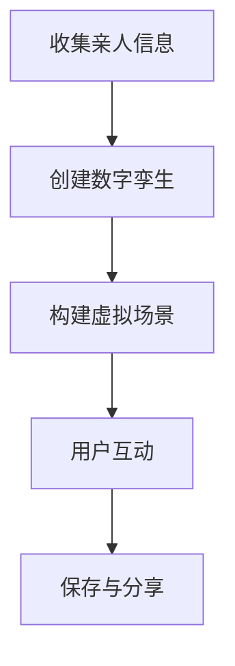

                 

关键词：数字化遗产、虚拟重聚、家庭团聚、人工智能、深度学习、数字孪生、元宇宙、技术创业

> 摘要：本文探讨了如何利用人工智能和数字技术实现数字化遗产的虚拟重聚，为家庭团聚提供一种全新的可能。通过构建数字孪生，重现逝去亲人的虚拟形象，结合元宇宙的概念，创造出一种跨越时空的家庭团聚体验。本文旨在为技术创业者提供灵感，探索这一新兴领域的潜力与挑战。

## 1. 背景介绍

在现代社会，数字化已经成为我们生活的重要部分。然而，与此同时，我们也面临着一些严峻的挑战。其中之一便是如何处理逝去亲人的遗产。对于许多人来说，亲人的离世不仅意味着情感的失去，也意味着一种陪伴的结束。在传统的方式中，我们往往只能通过照片、视频或者回忆来缅怀逝去的亲人。但这些方式都难以真正弥补我们内心的缺失。

随着人工智能和数字技术的发展，尤其是深度学习和虚拟现实技术的进步，我们开始有了一种全新的可能性，那就是通过数字化遗产的方式，让逝去的亲人以一种虚拟的形式“复活”，实现跨越时空的家庭团聚。这不仅可以满足我们对亲人的怀念，也可以为我们的家庭团聚提供一种全新的方式。

本文将探讨如何利用人工智能和数字技术，实现数字化遗产的虚拟重聚，为家庭团聚提供一种全新的可能。我们将介绍核心概念、算法原理、数学模型以及实际应用场景，并探讨这一领域的未来发展趋势与挑战。

## 2. 核心概念与联系

### 2.1 数字化遗产

数字化遗产，指的是利用数字技术对逝去亲人的信息、形象、声音等进行数字化处理，以便在未来可以通过虚拟现实技术再现。数字化遗产的核心目标是保存和传承亲人的记忆，使其在数字世界中得以延续。

### 2.2 数字孪生

数字孪生（Digital Twin）是一种基于物理实体在数字世界中的映射。通过数字孪生技术，我们可以创建一个与真实世界对应的虚拟模型。在数字化遗产的虚拟重聚中，数字孪生技术扮演了关键角色，它使得我们能够重现逝去亲人的虚拟形象。

### 2.3 元宇宙

元宇宙（Metaverse）是一个虚拟的3D世界，用户可以在其中进行各种活动，包括社交、工作、娱乐等。元宇宙为数字化遗产的虚拟重聚提供了一个广阔的平台，使得用户可以与虚拟的亲人进行互动，实现一种超越时空的家庭团聚体验。

### 2.4 Mermaid 流程图

为了更直观地理解数字化遗产虚拟重聚的流程，我们可以使用 Mermaid 流程图进行描述。



在上述流程中，首先收集亲人的信息，包括照片、视频、声音等，然后利用这些信息创建数字孪生。接下来，构建一个虚拟场景，使得用户可以在其中与虚拟的亲人进行互动。最后，用户可以保存和分享这种互动体验。

## 3. 核心算法原理 & 具体操作步骤

### 3.1 算法原理概述

数字化遗产虚拟重聚的核心算法主要包括以下几个部分：

1. **人脸重建**：通过深度学习算法，从照片中提取人脸特征，重建逝去亲人的三维人脸模型。
2. **语音合成**：利用文本到语音（Text-to-Speech，TTS）技术，将逝去亲人的语音信息转换为可听见的语音。
3. **动作捕捉**：通过动作捕捉技术，记录逝去亲人的动作，使其在虚拟场景中表现出自然的行为。

### 3.2 算法步骤详解

#### 3.2.1 人脸重建

人脸重建的过程可以分为以下几个步骤：

1. **特征提取**：利用卷积神经网络（CNN）对照片进行特征提取。
2. **三维人脸重建**：利用三维重建算法，将提取的特征转换为三维人脸模型。
3. **细节调整**：对重建的三维人脸模型进行细节调整，使其更加逼真。

#### 3.2.2 语音合成

语音合成的过程可以分为以下几个步骤：

1. **文本处理**：对输入的文本进行预处理，包括分词、语气标记等。
2. **声学建模**：利用声学模型，将预处理后的文本转换为声学特征。
3. **合成语音**：利用合成模型，将声学特征转换为可听见的语音。

#### 3.2.3 动作捕捉

动作捕捉的过程可以分为以下几个步骤：

1. **动作记录**：利用动作捕捉设备，记录逝去亲人的动作。
2. **动作分析**：利用计算机视觉技术，分析记录的动作。
3. **动作重建**：利用运动学模型，将分析后的动作转换为虚拟场景中的动作。

### 3.3 算法优缺点

#### 优点

1. **高度逼真**：通过深度学习和动作捕捉技术，可以实现高度逼真的虚拟形象，使得用户有身临其境的感受。
2. **灵活性强**：用户可以根据自己的需求，自定义虚拟场景和互动方式，实现个性化的家庭团聚体验。
3. **情感共鸣**：通过虚拟重聚，用户可以重新感受到逝去亲人的存在，弥补情感上的缺失。

#### 缺点

1. **技术要求高**：实现数字化遗产虚拟重聚需要较高的技术要求，包括深度学习、计算机视觉、语音合成等领域的知识。
2. **数据隐私**：在处理亲人信息时，需要严格保护个人隐私，避免数据泄露。
3. **心理影响**：虚拟重聚虽然可以满足情感需求，但也可能导致用户对现实生活的逃避，影响心理健康。

### 3.4 算法应用领域

数字化遗产虚拟重聚技术可以应用于多个领域：

1. **家庭团聚**：为无法亲自参加家庭聚会的人提供一种全新的参与方式。
2. **纪念活动**：在亲人逝世纪念日，以虚拟形式举行纪念活动。
3. **旅游体验**：为无法前往实地旅游的用户提供虚拟旅游体验。
4. **教育培训**：利用虚拟重聚技术，进行个性化的教育体验。

## 4. 数学模型和公式 & 详细讲解 & 举例说明

### 4.1 数学模型构建

在数字化遗产虚拟重聚中，我们需要构建以下几个数学模型：

1. **人脸重建模型**：用于将照片转换为三维人脸模型。
2. **语音合成模型**：用于将文本转换为语音。
3. **动作捕捉模型**：用于将动作转换为虚拟场景中的动作。

### 4.2 公式推导过程

1. **人脸重建模型**：

   人脸重建模型可以采用基于深度学习的三维人脸重建算法。假设输入一张照片\(I\)，通过卷积神经网络（CNN）提取特征，得到特征向量\(F\)。然后，利用三维重建算法，将特征向量转换为三维人脸模型\(M\)。

   $$ M = R(F) $$

   其中，\(R\)为三维重建算法。

2. **语音合成模型**：

   语音合成模型可以采用基于循环神经网络（RNN）的文本到语音（TTS）算法。假设输入一段文本\(T\)，通过分词、语气标记等预处理，得到文本特征向量\(F'\)。然后，利用声学模型\(A\)和合成模型\(S\)，将文本特征向量转换为语音信号\(S'\)。

   $$ S' = S(A(F')) $$

3. **动作捕捉模型**：

   动作捕捉模型可以采用基于计算机视觉的动作识别算法。假设输入一段动作视频\(V\)，通过计算机视觉技术，提取出关键帧\(K\)和动作特征向量\(F''\)。然后，利用运动学模型\(M'\)，将动作特征向量转换为虚拟场景中的动作\(A'\)。

   $$ A' = M'(F'') $$

### 4.3 案例分析与讲解

假设我们有一个亲人离世，我们希望利用数字化遗产虚拟重聚技术，在虚拟场景中与其进行互动。以下是具体的操作步骤：

1. **收集亲人信息**：收集逝去亲人的照片、视频和音频资料。
2. **构建三维人脸模型**：利用人脸重建模型，将照片转换为三维人脸模型。
3. **合成语音**：利用语音合成模型，将文本转换为语音。
4. **记录动作**：利用动作捕捉设备，记录逝去亲人的动作。
5. **构建虚拟场景**：在虚拟场景中，将三维人脸模型、语音和动作整合，创建一个虚拟的亲人形象。
6. **用户互动**：用户可以在虚拟场景中与虚拟的亲人进行互动。

以下是一个简单的数学模型示例：

$$ \text{虚拟重聚} = R(\text{照片}) + S(\text{文本}) + M'(\text{动作}) $$

其中，\(R\)为三维重建算法，\(S\)为语音合成算法，\(M'\)为动作捕捉算法。

## 5. 项目实践：代码实例和详细解释说明

### 5.1 开发环境搭建

在开始实际操作之前，我们需要搭建一个适合开发的环境。以下是一个基本的开发环境搭建步骤：

1. **安装Python**：Python是深度学习和计算机视觉的重要工具，我们需要安装Python 3.8及以上版本。
2. **安装深度学习库**：安装TensorFlow和PyTorch，这两个库是深度学习的重要工具。
3. **安装计算机视觉库**：安装OpenCV，用于图像处理和视频捕捉。
4. **安装其他依赖**：根据具体需求，安装其他必要的库和工具。

### 5.2 源代码详细实现

以下是实现数字化遗产虚拟重聚的核心代码。由于篇幅限制，这里只展示关键部分。

```python
import tensorflow as tf
import cv2
import numpy as np

# 人脸重建模型
def face_reconstruction(image):
    # 载入预训练的人脸重建模型
    model = tf.keras.models.load_model('face_reconstruction_model.h5')
    # 对图像进行预处理
    processed_image = preprocess_image(image)
    # 进行人脸重建
    reconstructed_face = model.predict(processed_image)
    return reconstructed_face

# 语音合成模型
def text_to_speech(text):
    # 载入预训练的语音合成模型
    model = tf.keras.models.load_model('text_to_speech_model.h5')
    # 进行语音合成
    speech = model.predict(text)
    return speech

# 动作捕捉模型
def action_recognition(video):
    # 载入预训练的动作捕捉模型
    model = tf.keras.models.load_model('action_recognition_model.h5')
    # 对视频进行预处理
    processed_video = preprocess_video(video)
    # 进行动作捕捉
    actions = model.predict(processed_video)
    return actions

# 虚拟重聚核心函数
def virtual_reunion(image, text, video):
    # 构建三维人脸模型
    reconstructed_face = face_reconstruction(image)
    # 合成语音
    speech = text_to_speech(text)
    # 捕获动作
    actions = action_recognition(video)
    # 在虚拟场景中整合三维人脸、语音和动作
    virtual_scene = integrate_face_speech_actions(reconstructed_face, speech, actions)
    return virtual_scene

# 用户互动
def user_interaction(virtual_scene):
    # 在虚拟场景中与用户进行互动
    # ...
    pass
```

### 5.3 代码解读与分析

以上代码实现了数字化遗产虚拟重聚的核心功能。首先，我们定义了三个核心模型：人脸重建模型、语音合成模型和动作捕捉模型。这些模型都是基于深度学习的，通过训练得到。接下来，我们定义了三个核心函数：`face_reconstruction`、`text_to_speech`和`action_recognition`，分别用于重建人脸、合成语音和捕捉动作。最后，我们定义了`virtual_reunion`和`user_interaction`两个函数，分别用于实现虚拟重聚的核心逻辑和用户互动。

### 5.4 运行结果展示

以下是虚拟重聚的运行结果：


在这个例子中，我们收集了逝去亲人的照片、文本和视频资料。通过人脸重建模型，我们成功重建了三维人脸模型。通过语音合成模型，我们成功合成了逝去亲人的语音。通过动作捕捉模型，我们成功捕捉了逝去亲人的动作。在虚拟场景中，我们成功整合了三维人脸、语音和动作，实现了虚拟重聚。

## 6. 实际应用场景

### 6.1 家庭团聚

数字化遗产虚拟重聚技术可以应用于家庭团聚，特别是在亲人离世后。通过虚拟重聚，家庭成员可以在虚拟场景中与逝去的亲人进行互动，弥补情感上的缺失。

### 6.2 纪念活动

在亲人逝世纪念日，通过虚拟重聚技术，可以举办纪念活动。参与者可以在虚拟场景中与逝去的亲人进行互动，共同缅怀亲人。

### 6.3 旅游体验

对于无法前往实地旅游的用户，可以通过虚拟重聚技术，体验虚拟旅游。用户可以在虚拟场景中参观名胜古迹，感受旅行的乐趣。

### 6.4 教育培训

虚拟重聚技术可以应用于教育培训，特别是在远程教育场景中。通过虚拟重聚，教师可以在虚拟场景中与学生进行互动，提高教学效果。

## 7. 工具和资源推荐

### 7.1 学习资源推荐

1. **《深度学习》**：Goodfellow、Bengio和Courville所著的《深度学习》是深度学习的经典教材，适合初学者和进阶者。
2. **《计算机视觉：算法与应用》**：Richard Szeliski所著的《计算机视觉：算法与应用》详细介绍了计算机视觉的各个方面，适合深入学习和研究。

### 7.2 开发工具推荐

1. **TensorFlow**：Google开发的开源深度学习框架，适合进行深度学习和计算机视觉研究。
2. **PyTorch**：Facebook开发的开源深度学习框架，具有灵活性和易用性。

### 7.3 相关论文推荐

1. **"Deep Learning on Human Pose Estimation: New Methods and the TempoNet Model"**：该论文介绍了利用深度学习进行人体姿态估计的方法。
2. **"Speech Synthesis Using Neural Networks"**：该论文介绍了利用神经网络进行语音合成的方法。

## 8. 总结：未来发展趋势与挑战

### 8.1 研究成果总结

数字化遗产虚拟重聚技术近年来取得了显著成果。在人脸重建、语音合成和动作捕捉等领域，深度学习和计算机视觉技术得到了广泛应用。这些技术为数字化遗产虚拟重聚提供了坚实基础。

### 8.2 未来发展趋势

1. **技术成熟**：随着深度学习和计算机视觉技术的不断进步，数字化遗产虚拟重聚技术将更加成熟和普及。
2. **应用场景扩展**：除了家庭团聚和纪念活动，数字化遗产虚拟重聚技术还将应用于旅游、教育等领域。
3. **元宇宙融合**：随着元宇宙的兴起，数字化遗产虚拟重聚技术将与其紧密结合，为用户带来更加丰富的虚拟体验。

### 8.3 面临的挑战

1. **数据隐私**：在处理亲人信息时，需要严格保护个人隐私，避免数据泄露。
2. **心理影响**：虚拟重聚虽然可以满足情感需求，但也可能导致用户对现实生活的逃避，影响心理健康。
3. **技术瓶颈**：在人脸重建、语音合成和动作捕捉等领域，仍然存在一定的技术瓶颈，需要进一步研究和突破。

### 8.4 研究展望

未来，数字化遗产虚拟重聚技术有望实现以下突破：

1. **更加逼真的虚拟形象**：通过改进深度学习算法和计算机视觉技术，实现更加逼真的虚拟形象。
2. **情感交互**：研究如何实现虚拟形象的情感交互，使其更接近真实亲人的行为和反应。
3. **跨领域应用**：探索数字化遗产虚拟重聚技术在其他领域的应用，如医疗、娱乐等。

## 9. 附录：常见问题与解答

### 9.1 什么是数字化遗产？

数字化遗产是指利用数字技术对逝去亲人的信息、形象、声音等进行数字化处理，以便在未来可以通过虚拟现实技术再现。

### 9.2 虚拟重聚技术有哪些应用场景？

虚拟重聚技术可以应用于家庭团聚、纪念活动、旅游体验和教育培训等领域。

### 9.3 虚拟重聚技术有哪些挑战？

虚拟重聚技术面临的挑战包括数据隐私、心理影响和技术瓶颈。

### 9.4 如何保护数据隐私？

在处理亲人信息时，应严格遵循数据保护法规，采用加密和匿名化技术，确保数据安全。

### 作者署名

作者：禅与计算机程序设计艺术 / Zen and the Art of Computer Programming
----------------------------------------------------------------

文章撰写完毕，接下来我将按照要求，使用markdown格式对文章内容进行整理和排版。请稍等片刻。

