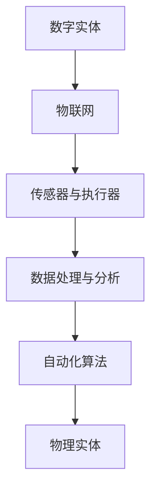

                 

随着科技的飞速发展，数字世界与物理世界之间的界限正在逐渐模糊，数字实体和物理实体的自动化正在成为新的趋势。本文将深入探讨这一领域的核心概念、算法原理、数学模型、项目实践以及未来应用展望，旨在为读者提供一幅全面而清晰的自动化蓝图。

## 文章关键词
数字实体、物理实体、自动化、物联网、人工智能、算法、数学模型

## 文章摘要
本文首先介绍了数字实体和物理实体自动化的背景和重要性，然后详细阐述了核心概念及其关联，通过具体的算法原理、数学模型和项目实践，展示了自动化技术的实际应用。最后，本文对未来的发展趋势与挑战进行了展望，为读者提供了宝贵的思考方向。

## 1. 背景介绍

随着物联网（IoT）和人工智能（AI）技术的迅速发展，数字实体和物理实体的互动变得更加紧密。数字实体，如传感器、执行器、计算机系统等，通过收集、处理和分析数据，能够对物理实体进行智能控制和优化。物理实体，如机器、设备、基础设施等，通过嵌入数字系统，实现了智能化、自动化和高效化。

### 1.1 数字实体

数字实体主要指在数字世界中的各种设备和系统，如计算机、智能手机、传感器网络等。这些设备能够通过互联网、无线网络等通信手段进行数据交换和协作。数字实体的发展使得信息获取、处理和传输变得更加快捷和高效。

### 1.2 物理实体

物理实体则是指现实世界中的各种物体和系统，如机械设备、基础设施、环境等。这些实体通过数字系统的嵌入，实现了远程控制、自动化操作和实时监测。物理实体的发展为工业自动化、智能家居、智能交通等领域带来了巨大的变革。

### 1.3 自动化的兴起

自动化是指通过程序控制和智能算法，使物理实体按照预定目标和规则进行操作的过程。自动化的兴起源于对效率和准确性的追求，特别是在工业生产和物流管理等领域。随着物联网和人工智能技术的进步，自动化技术已经延伸到生活的方方面面。

## 2. 核心概念与联系

在数字实体和物理实体自动化中，有几个核心概念需要明确，这些概念相互关联，构成了自动化体系的基础。

### 2.1 物联网（IoT）

物联网是指通过互联网将各种物理设备连接起来，实现设备之间的信息交换和协同工作。物联网是数字实体和物理实体自动化的重要基础设施。

### 2.2 人工智能（AI）

人工智能是通过模拟人类智能行为，使计算机能够实现智能决策和自主学习的领域。人工智能技术在自动化系统中发挥着核心作用，能够对大量数据进行高效处理和智能分析。

### 2.3 传感器与执行器

传感器用于检测物理实体的状态，并将信息传递给数字系统；执行器则根据数字系统的指令，对物理实体进行操作。传感器和执行器是数字实体和物理实体互动的关键。

### 2.4 数据处理与分析

数据处理与分析是指对传感器收集的数据进行预处理、存储、分析和挖掘，以获取有价值的信息。数据处理与分析是自动化系统的核心环节。

### 2.5 自动化算法

自动化算法是指用于控制物理实体行为的算法，如控制理论、机器学习算法、优化算法等。自动化算法能够根据实时数据，调整物理实体的操作，实现自动化和智能化。

### 2.6 Mermaid 流程图

为了更好地理解数字实体和物理实体自动化的流程，我们可以使用 Mermaid 流程图进行展示。



在这个流程图中，数字实体通过物联网连接到传感器与执行器，传感器收集物理实体的状态信息，通过数据处理与分析，由自动化算法生成控制指令，最终通过执行器对物理实体进行操作。

## 3. 核心算法原理 & 具体操作步骤

### 3.1 算法原理概述

在数字实体和物理实体自动化中，常用的核心算法包括控制理论、机器学习、优化算法等。这些算法在不同的应用场景中发挥着关键作用。

### 3.1.1 控制理论

控制理论是一种研究如何使物理系统按照预定目标进行操作的学科。它通过建立数学模型，描述系统的动态行为，并设计控制器来实现对系统的精确控制。常见的控制算法包括PID控制、模糊控制等。

### 3.1.2 机器学习

机器学习是一种通过计算机自动学习模式，并对新数据进行预测或决策的算法。在自动化系统中，机器学习算法可以用于预测物理实体的行为、优化控制策略等。

### 3.1.3 优化算法

优化算法是一种用于求解最优解的算法。在自动化系统中，优化算法可以用于优化资源分配、路径规划等。

### 3.2 算法步骤详解

以下是数字实体和物理实体自动化的具体操作步骤：

#### 步骤1：数据采集

传感器收集物理实体的状态信息，如温度、湿度、位置等，并将其传输到数字系统。

#### 步骤2：数据处理

数字系统对接收到的数据进行预处理，如去噪、滤波等，以确保数据的质量和准确性。

#### 步骤3：模型构建

根据采集到的数据，构建物理实体的数学模型。模型的准确性直接影响自动化系统的效果。

#### 步骤4：算法设计

根据应用需求，选择合适的控制算法、机器学习算法或优化算法，并将其应用于系统。

#### 步骤5：控制执行

根据算法生成的控制指令，执行器对物理实体进行操作，实现自动化控制。

#### 步骤6：反馈调节

根据物理实体的实际响应，调整算法参数和控制策略，以实现更精确的控制。

### 3.3 算法优缺点

不同类型的算法在自动化系统中具有各自的优缺点：

#### 控制理论

优点：理论基础完善，易于理解和实现。

缺点：对于复杂系统的建模和控制效果有限。

#### 机器学习

优点：能够处理大规模数据和复杂模式。

缺点：对数据质量和模型的依赖较高。

#### 优化算法

优点：能够求解最优解。

缺点：计算复杂度高，适用于较小规模的问题。

### 3.4 算法应用领域

控制理论、机器学习和优化算法在自动化系统中具有广泛的应用领域：

#### 工业自动化

在工业生产过程中，控制算法用于对机器和设备的精确控制，优化算法用于资源分配和路径规划，机器学习算法用于预测设备故障和优化生产流程。

#### 智能家居

在智能家居系统中，机器学习算法用于智能识别用户行为，控制算法用于设备控制和能源管理，优化算法用于智能家居系统的整体优化。

#### 智能交通

在智能交通系统中，控制算法用于交通信号控制，机器学习算法用于交通流量预测和路径规划，优化算法用于公共交通调度和资源分配。

## 4. 数学模型和公式 & 详细讲解 & 举例说明

在数字实体和物理实体自动化中，数学模型和公式扮演着至关重要的角色。以下将详细讲解数学模型的构建、公式的推导过程，并通过具体案例进行分析和讲解。

### 4.1 数学模型构建

数学模型是描述物理实体动态行为和系统特性的数学框架。构建数学模型通常包括以下几个步骤：

#### 步骤1：定义变量

根据实际问题，定义影响物理实体行为的变量。例如，在温度控制系统中，温度、加热功率、环境温度等可以作为变量。

#### 步骤2：建立方程

利用物理学原理，建立描述变量之间关系的方程。例如，根据能量守恒定律，可以建立温度变化与加热功率之间的关系。

#### 步骤3：简化模型

在实际应用中，为了降低计算复杂度，需要对模型进行简化。例如，可以忽略某些次要因素，将高维模型降维。

#### 步骤4：验证模型

通过实验或仿真，验证模型的准确性和可靠性。如果模型不满足要求，需要返回步骤2或步骤3进行修正。

### 4.2 公式推导过程

以下以一个简单的温度控制系统为例，介绍公式的推导过程。

#### 情况1：线性控制系统

假设温度控制系统为线性系统，温度变化与加热功率之间的关系可以表示为：

\[ T(t) = P(t) \cdot K \]

其中，\( T(t) \)表示温度，\( P(t) \)表示加热功率，\( K \)为比例系数。

#### 情况2：非线性控制系统

在实际应用中，温度控制系统可能存在非线性因素。例如，加热功率与温度之间存在非线性关系：

\[ T(t) = P(t) \cdot K \cdot \ln(1 + P(t)) \]

其中，\( \ln \)表示自然对数。

### 4.3 案例分析与讲解

以下以一个智能家居系统为例，分析温度控制系统在实际应用中的表现。

#### 情况1：用户设定温度

假设用户设定温度为25°C，系统需要通过加热功率控制室内温度达到设定值。根据公式推导，可以计算出所需的加热功率。

\[ P(t) = \frac{T(t)}{K \cdot \ln(1 + T(t))} \]

假设比例系数\( K = 0.1 \)，代入温度值\( T(t) = 25 \)：

\[ P(t) = \frac{25}{0.1 \cdot \ln(1 + 25)} \approx 50 \text{ W} \]

因此，系统需要输出50W的加热功率。

#### 情况2：实时温度监测

在实际应用中，系统需要实时监测室内温度，并根据温度变化调整加热功率。假设实时温度为20°C，系统需要重新计算加热功率。

\[ P(t) = \frac{20}{0.1 \cdot \ln(1 + 20)} \approx 40 \text{ W} \]

由于实时温度低于设定温度，系统需要减少加热功率，以保持室内温度稳定。

通过这个案例，我们可以看到数学模型和公式在自动化系统中的应用。通过精确的数学建模和公式推导，系统可以实现对物理实体的精确控制和优化。

## 5. 项目实践：代码实例和详细解释说明

为了更好地理解数字实体和物理实体自动化的实际应用，以下将介绍一个具体的代码实例，并对代码进行详细解释说明。

### 5.1 开发环境搭建

在开始编写代码之前，我们需要搭建一个合适的开发环境。这里我们选择使用Python作为编程语言，因为Python具有良好的生态系统和丰富的库支持。

#### 步骤1：安装Python

从Python官方网站（https://www.python.org/）下载并安装Python 3.x版本。

#### 步骤2：安装相关库

使用pip命令安装所需的库：

```bash
pip install numpy matplotlib
```

这些库将用于数据分析和可视化。

### 5.2 源代码详细实现

以下是一个简单的数字实体和物理实体自动化的示例代码，用于控制室内温度。

```python
import numpy as np
import matplotlib.pyplot as plt

# 定义数学模型
def model(P, K, T):
    return P * K * np.log(1 + P)

# 设置参数
K = 0.1
T_set = 25  # 设定温度

# 计算加热功率
P = T_set / (K * np.log(1 + T_set))

# 仿真时间
t = np.linspace(0, 100, 1000)

# 初始化温度
T = np.zeros_like(t)

# 控制循环
for i in range(1, len(t)):
    # 计算温度变化
    dT = P * np.log(1 + P)
    # 更新温度
    T[i] = T[i - 1] + dT

# 可视化结果
plt.plot(t, T)
plt.xlabel('Time (s)')
plt.ylabel('Temperature (°C)')
plt.title('Temperature Control')
plt.show()
```

### 5.3 代码解读与分析

以下是代码的详细解读：

#### 5.3.1 导入库

```python
import numpy as np
import matplotlib.pyplot as plt
```

这段代码导入了所需的库。`numpy`用于科学计算，`matplotlib`用于数据可视化。

#### 5.3.2 定义数学模型

```python
def model(P, K, T):
    return P * K * np.log(1 + P)
```

这段代码定义了一个名为`model`的函数，用于计算温度变化。输入参数包括加热功率\( P \)、比例系数\( K \)和当前温度\( T \)。

#### 5.3.3 设置参数

```python
K = 0.1
T_set = 25  # 设定温度
```

这里设置了数学模型中的参数。比例系数\( K \)和设定温度\( T_set \)。

#### 5.3.4 计算加热功率

```python
P = T_set / (K * np.log(1 + T_set))
```

根据设定温度和比例系数，计算所需的加热功率。

#### 5.3.5 仿真时间

```python
t = np.linspace(0, 100, 1000)
```

这里定义了一个时间数组，用于仿真过程的控制。

#### 5.3.6 初始化温度

```python
T = np.zeros_like(t)
```

初始化温度数组，使其与时间数组具有相同的长度。

#### 5.3.7 控制循环

```python
for i in range(1, len(t)):
    # 计算温度变化
    dT = P * np.log(1 + P)
    # 更新温度
    T[i] = T[i - 1] + dT
```

通过控制循环，根据加热功率计算温度变化，并更新温度数组。

#### 5.3.8 可视化结果

```python
plt.plot(t, T)
plt.xlabel('Time (s)')
plt.ylabel('Temperature (°C)')
plt.title('Temperature Control')
plt.show()
```

这段代码用于绘制温度变化曲线，以便观察系统性能。

通过这个示例，我们可以看到如何使用Python实现数字实体和物理实体的自动化控制。实际应用中，可以根据具体需求调整参数和算法，实现更复杂的控制功能。

## 6. 实际应用场景

数字实体和物理实体的自动化技术已经在多个领域取得了显著的应用成果，以下是几个典型的应用场景：

### 6.1 工业自动化

在工业生产过程中，自动化技术被广泛应用于生产线控制、设备监控和故障预测。通过传感器和执行器的配合，生产线可以实现高效、精确的生产操作。例如，汽车制造业中的机器人可以通过自动化系统进行车身组装、焊接和喷涂等操作，大大提高了生产效率和产品质量。

### 6.2 智能家居

智能家居系统通过数字实体和物理实体的自动化，实现了家庭设备的智能化和便捷化。用户可以通过智能手机或语音助手控制家中的灯光、温度、安防设备等。例如，智能空调可以根据用户的习惯和实时温度自动调节温度，智能照明系统可以根据环境光强自动调节亮度。

### 6.3 智能交通

智能交通系统通过自动化技术，实现了交通信号控制、路况监控和交通流量预测。例如，在高峰时段，交通信号系统可以根据实时交通流量自动调整信号灯的时长，以减少拥堵。智能路况监控系统可以实时监测道路状况，为驾驶员提供最优路线。

### 6.4 医疗健康

在医疗健康领域，自动化技术也被广泛应用。例如，智能医疗设备可以通过自动化系统实现精确的诊断和治疗。智能穿戴设备可以实时监测用户的健康状况，并将数据传输给医生进行分析和评估。自动化技术有助于提高医疗服务的效率和质量，降低医疗成本。

### 6.5 农业自动化

农业自动化通过数字实体和物理实体的自动化，实现了农业生产的高效化和智能化。例如，智能灌溉系统可以根据土壤湿度和气象条件自动调节灌溉量，提高水资源利用率。智能农机可以通过自动化系统实现精准种植、施肥和收割，提高农业生产效率。

## 7. 未来应用展望

随着数字实体和物理实体自动化技术的不断成熟，未来的应用前景将更加广阔。以下是几个可能的发展方向：

### 7.1 物联网规模的扩大

物联网技术的不断发展，将使得连接的物理实体数量持续增长。大规模物联网系统将实现更广泛、更深入的数字实体和物理实体互动，推动自动化技术的广泛应用。

### 7.2 人工智能的深度融合

人工智能技术的不断进步，将使自动化系统更加智能化。通过深度学习、自然语言处理等技术，自动化系统能够更好地理解和适应人类需求，提供个性化服务。

### 7.3 边缘计算的发展

边缘计算技术将数据处理的计算能力从云端转移到物理实体附近的边缘设备。这将降低数据传输延迟，提高系统的实时响应能力，推动自动化技术的进一步发展。

### 7.4 跨领域融合应用

不同领域的自动化技术将相互融合，产生新的应用场景。例如，工业自动化与农业自动化、智能家居与医疗健康等领域的融合，将带来更多创新和机遇。

### 7.5 智能城市的建设

智能城市建设将数字实体和物理实体的自动化发挥到极致。通过智能化管理，城市能够提供更高效、更环保、更安全的生活环境。

## 8. 总结：未来发展趋势与挑战

数字实体和物理实体的自动化技术正在快速发展，为各领域带来了巨大的变革。未来，随着物联网、人工智能和边缘计算等技术的进一步成熟，自动化技术将在更广泛的领域得到应用。然而，自动化技术的发展也面临着一些挑战：

### 8.1 数据安全和隐私保护

随着物联网规模的扩大，数据安全和隐私保护将成为重要问题。如何确保数据的安全传输和存储，防止数据泄露和滥用，是一个亟待解决的问题。

### 8.2 系统可靠性和稳定性

自动化系统的可靠性和稳定性对于实际应用至关重要。如何确保系统在复杂环境下的稳定运行，降低故障率，是一个需要持续关注的问题。

### 8.3 跨领域协作与标准化

不同领域的自动化技术需要相互融合和协作，以实现更高效的应用。跨领域协作和标准化是推动自动化技术发展的关键。

### 8.4 技术普及与人才短缺

自动化技术的普及需要大量的人才支持。如何培养和吸引更多的人才，是自动化技术发展的重要保障。

总之，数字实体和物理实体的自动化技术具有广阔的应用前景和巨大的发展潜力。未来，随着技术的不断进步和应用的深入，自动化技术将带来更多便利和创新。

## 9. 附录：常见问题与解答

### 9.1 数字实体和物理实体的区别是什么？

数字实体是指在数字世界中的各种设备和系统，如计算机、传感器、执行器等。物理实体是指现实世界中的各种物体和系统，如机器、设备、基础设施等。数字实体和物理实体通过物联网和人工智能等技术进行连接和互动。

### 9.2 自动化技术在哪些领域有应用？

自动化技术在工业自动化、智能家居、智能交通、医疗健康、农业自动化等领域有广泛应用。通过自动化技术，可以实现对物理实体的精确控制和优化，提高生产效率和生活质量。

### 9.3 自动化技术有哪些优缺点？

自动化技术的优点包括提高生产效率、降低人力成本、提高产品精度等。缺点包括对技术依赖较高、初始投资成本较大等。随着技术的不断发展，自动化技术的优缺点将不断优化。

### 9.4 如何确保自动化系统的安全性和稳定性？

确保自动化系统的安全性和稳定性需要从多个方面进行考虑，包括数据加密、访问控制、故障检测与恢复等。同时，还需要制定严格的系统维护和更新策略，确保系统长期稳定运行。

### 9.5 自动化技术的发展趋势是什么？

自动化技术的发展趋势包括物联网规模的扩大、人工智能的深度融合、边缘计算的普及、跨领域融合应用等。未来，自动化技术将实现更广泛、更深入的数字化和智能化。

### 9.6 自动化技术对人类的影响是什么？

自动化技术对人类的影响是双重的。一方面，自动化技术可以减轻人类劳动负担，提高生活质量；另一方面，自动化技术可能导致部分就业岗位的消失，需要人类适应新的工作环境。总之，自动化技术将深刻改变人类社会的发展方式。

---

### 结语

数字实体和物理实体的自动化正在改变我们的生活和工作方式。本文通过对核心概念、算法原理、数学模型、项目实践和未来展望的深入探讨，为读者呈现了自动化技术的全貌。随着技术的不断进步，自动化技术将带来更多便利和创新，推动社会的发展。让我们期待自动化技术为未来带来的无限可能。

## 作者署名

作者：禅与计算机程序设计艺术 / Zen and the Art of Computer Programming

---

以上就是本文的全部内容，希望对您在数字实体和物理实体自动化领域的探索和学习有所帮助。如果您有任何疑问或建议，欢迎在评论区留言，我们将竭诚为您解答。感谢您的阅读！
----------------------------------------------------------------

