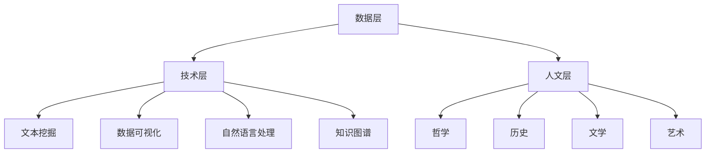

                 

关键词：数字人文，科技与文化，人文精神，数字化转型，未来展望

> 摘要：在数字化时代，科技与文化的融合成为不可逆转的趋势。本文探讨了在数字时代背景下，如何传承和发展人文精神。通过分析数字人文的概念、核心技术，以及数字技术在教育、艺术和文化产业中的应用，提出了一系列策略和建议，旨在为未来数字人文的发展提供方向和启示。

## 1. 背景介绍

在过去的几十年中，信息技术和互联网的飞速发展已经深刻地改变了我们的生活方式。从个人通信到商业运营，从科学研究到娱乐休闲，数字化已经成为现代社会不可或缺的一部分。然而，在享受科技进步带来的便利和效率的同时，我们也面临着人文精神的传承与发展的挑战。

数字人文（Digital Humanities，简称DH）作为一门交叉学科，致力于将数字技术和方法应用于人文学科的研究和实践。它不仅涉及文本挖掘、数据可视化和大数据分析等信息技术，还涵盖了哲学、历史、文学、艺术等人文领域的知识。数字人文的出现，为我们提供了一个全新的视角来理解和传承人类文化遗产。

### 1.1 数字人文的定义与发展历程

数字人文的定义有多种，其中最具代表性的是将其视为“利用数字技术和工具来推动人文学科研究和教育”的一种学科实践。它起源于20世纪80年代，随着计算机技术的进步和互联网的普及，逐渐发展成为一个独立的领域。

在早期，数字人文主要集中在文本数字化和电子文献的整理上。随着互联网的发展，数据挖掘和大数据分析技术开始被应用于人文学科的研究。近年来，随着人工智能和机器学习技术的兴起，数字人文的研究领域进一步扩大，涵盖了更多的学科和领域。

### 1.2 数字人文的核心技术与应用

数字人文的核心技术包括文本挖掘、数据可视化、自然语言处理和知识图谱等。这些技术为人文学科的研究提供了新的工具和方法，使得大规模数据分析和复杂问题的解决变得更加可行。

- **文本挖掘**：通过对大量文本数据的分析，挖掘出潜在的知识和关系。在文学研究中，文本挖掘可以帮助研究者分析文学作品的主题、情感和风格；在历史研究中，文本挖掘可以用于历史事件的发现和解读。

- **数据可视化**：通过图形化的方式展示数据，使得复杂的信息更加直观和易于理解。在数字人文研究中，数据可视化被广泛应用于历史地图的构建、文学作品情感分析等。

- **自然语言处理**：通过对文本的理解和分析，实现人机交互和信息提取。自然语言处理技术在文学研究中可用于自动摘要、关键词提取等；在历史研究中，可用于历史文档的自动分类和归档。

- **知识图谱**：通过构建实体和关系之间的知识网络，实现对复杂信息的组织和管理。知识图谱在文化遗产保护、知识库构建等领域有广泛应用。

## 2. 核心概念与联系

### 2.1 数字人文的核心概念

数字人文的核心概念包括数据、技术和人文。这三个概念相互作用，共同构成了数字人文的体系结构。

- **数据**：数据是数字人文的基础，包括文本、图像、音频、视频等多种类型。通过对数据的处理和分析，可以获得有价值的信息和知识。

- **技术**：技术是数字人文的驱动力量，包括文本挖掘、数据可视化、自然语言处理和知识图谱等技术。这些技术为人文学科的研究提供了新的工具和方法。

- **人文**：人文是数字人文的核心，涉及哲学、历史、文学、艺术等领域的知识。人文精神是数字人文追求的目标，旨在通过数字技术传承和发展人类文化遗产。

### 2.2 数字人文的体系结构

数字人文的体系结构可以分为三层：数据层、技术层和人文层。

- **数据层**：包括数据的采集、存储、管理和处理。这一层关注的是如何高效地管理和利用大量的数据资源。

- **技术层**：包括文本挖掘、数据可视化、自然语言处理和知识图谱等技术。这一层关注的是如何将数字技术应用于人文学科的研究和实践。

- **人文层**：包括哲学、历史、文学、艺术等领域的知识。这一层关注的是如何通过数字技术传承和发展人文精神。

### 2.3 Mermaid 流程图

下面是一个简单的Mermaid流程图，展示了数字人文的核心概念和体系结构。



## 3. 核心算法原理 & 具体操作步骤

### 3.1 算法原理概述

数字人文的核心算法包括文本挖掘、数据可视化和自然语言处理等。这些算法的基本原理如下：

- **文本挖掘**：通过对大量文本数据的分析，提取出潜在的知识和关系。常用的算法有文本分类、主题建模、情感分析等。

- **数据可视化**：通过图形化的方式展示数据，使得复杂的信息更加直观和易于理解。常用的算法有散点图、折线图、柱状图等。

- **自然语言处理**：通过对文本的理解和分析，实现人机交互和信息提取。常用的算法有词向量、序列标注、命名实体识别等。

### 3.2 算法步骤详解

以下是数字人文中一些核心算法的具体步骤：

#### 3.2.1 文本挖掘

1. 数据预处理：包括文本的清洗、分词、去停用词等操作。
2. 特征提取：将文本转化为计算机可以处理的特征向量。
3. 模型训练：使用机器学习算法（如SVM、决策树、神经网络等）对特征向量进行训练。
4. 结果评估：通过准确率、召回率、F1值等指标评估模型的性能。

#### 3.2.2 数据可视化

1. 数据清洗：去除噪声数据和异常值。
2. 数据转换：将数据转化为可视化组件（如散点图、折线图等）所需的形式。
3. 可视化展示：使用可视化库（如D3.js、Plotly等）创建可视化图表。
4. 交互设计：添加交互功能（如缩放、过滤、搜索等），提高用户体验。

#### 3.2.3 自然语言处理

1. 词向量编码：将文本转化为词向量。
2. 序列标注：对文本进行词性标注、命名实体识别等操作。
3. 模型训练：使用循环神经网络、长短时记忆网络等深度学习模型进行训练。
4. 预测与评估：对新的文本进行预测，并使用评价指标（如准确率、召回率等）评估模型性能。

### 3.3 算法优缺点

#### 文本挖掘

- 优点：可以高效地处理大规模文本数据，提取出潜在的知识和关系。
- 缺点：对数据质量和特征提取的依赖较大，模型的解释性较差。

#### 数据可视化

- 优点：使得复杂的数据和信息更加直观和易于理解。
- 缺点：对于数据量较大的情况，可视化效果可能受到影响。

#### 自然语言处理

- 优点：可以实现人机交互和信息提取，提高文本处理的效率。
- 缺点：对计算资源和算法设计的要求较高，模型的解释性较差。

### 3.4 算法应用领域

数字人文算法在多个领域有广泛应用：

- **文学研究**：通过文本挖掘和情感分析，可以分析文学作品的主题、情感和风格。
- **历史研究**：通过数据可视化和知识图谱，可以构建历史地图、发现历史事件等。
- **文化遗产保护**：通过自然语言处理和图像识别，可以保护和传承文化遗产。
- **教育**：通过数据可视化和互动设计，可以增强教学效果和学生的参与度。

## 4. 数学模型和公式 & 详细讲解 & 举例说明

### 4.1 数学模型构建

数字人文中的数学模型主要包括文本挖掘、数据可视化和自然语言处理等算法所涉及的数学模型。以下是几个典型的数学模型及其构建方法：

#### 4.1.1 文本分类模型

文本分类模型是一种常见的数据挖掘算法，用于将文本数据分类到预定义的类别中。一个简单的文本分类模型可以基于朴素贝叶斯（Naive Bayes）算法构建：

$$
P(\text{C}|\text{X}) = \frac{P(\text{X}|\text{C})P(\text{C})}{P(\text{X})}
$$

其中，\(P(\text{C}|\text{X})\) 表示给定特征向量 \(X\) 时类别 \(C\) 的条件概率，\(P(\text{X}|\text{C})\) 是特征向量在类别 \(C\) 条件下的概率，\(P(\text{C})\) 是类别 \(C\) 的先验概率。

#### 4.1.2 主题建模

主题建模是一种无监督学习方法，用于发现文本数据中的潜在主题。一个常用的主题建模算法是隐含狄利克雷分配（Latent Dirichlet Allocation，LDA）：

$$
P(\text{W}|\text{T}, \text{Z}) = \frac{\Gamma(\alpha_z)}{\Pi_i \Gamma(\alpha_i)} \prod_j P(\text{w}_j|\text{z}_j)
$$

$$
P(\text{Z}|\text{T}, \alpha) = \frac{\Gamma(\beta_{zt})}{\Pi_j \Gamma(\beta_j)} \prod_i P(\text{z}_i|\text{t}_i)
$$

$$
P(\text{T}|\alpha, \beta) = \frac{\Pi_z \Gamma(\alpha_z) \Pi_t \Gamma(\beta_{zt})}{\Pi_i \Pi_j \Gamma(\alpha_i) \Gamma(\beta_j)}
$$

其中，\(\text{W}\) 是文档中的单词，\(\text{T}\) 是主题，\(\text{Z}\) 是主题分布，\(\alpha\) 和 \(\beta\) 分别是主题先验分布和单词先验分布。

#### 4.1.3 知识图谱构建

知识图谱是一种表示实体和关系之间的语义网络结构。一个简单的知识图谱可以基于图论构建：

$$
G = (V, E)
$$

其中，\(V\) 是实体集合，\(E\) 是关系集合。一个常见的知识图谱构建方法是基于图嵌入（Graph Embedding）：

$$
\text{h}_v = \text{GNN}(\text{h}_{v_i}, \text{h}_{v_j}, \text{e}_{ij})
$$

其中，\(\text{h}_v\) 是实体 \(v\) 的嵌入向量，\(\text{h}_{v_i}\) 和 \(\text{h}_{v_j}\) 是实体 \(v\) 的邻居 \(v_i\) 和 \(v_j\) 的嵌入向量，\(\text{e}_{ij}\) 是边 \(ij\) 的权重。

### 4.2 公式推导过程

以下是文本分类模型和主题建模中的几个公式的推导过程：

#### 4.2.1 朴素贝叶斯模型

假设有 \(C\) 个类别，第 \(i\) 个类别的先验概率为 \(P(\text{C}_i)\)，特征向量 \(X\) 包含 \(N\) 个单词，第 \(j\) 个单词的概率为 \(P(\text{w}_j|\text{C}_i)\)。

根据贝叶斯定理，给定特征向量 \(X\) 时类别 \(C_i\) 的条件概率为：

$$
P(\text{C}_i|\text{X}) = \frac{P(\text{X}|\text{C}_i)P(\text{C}_i)}{P(\text{X})}
$$

由于 \(P(\text{X}|\text{C}_i)\) 可以分解为：

$$
P(\text{X}|\text{C}_i) = \prod_{j=1}^{N} P(\text{w}_j|\text{C}_i)
$$

因此，有：

$$
P(\text{C}_i|\text{X}) = \frac{\prod_{j=1}^{N} P(\text{w}_j|\text{C}_i)P(\text{C}_i)}{P(\text{X})}
$$

根据全概率公式，有：

$$
P(\text{X}) = \sum_{i=1}^{C} P(\text{C}_i) \prod_{j=1}^{N} P(\text{w}_j|\text{C}_i)
$$

将 \(P(\text{X})\) 代入 \(P(\text{C}_i|\text{X})\) 的公式中，得到：

$$
P(\text{C}_i|\text{X}) = \frac{P(\text{C}_i) \prod_{j=1}^{N} P(\text{w}_j|\text{C}_i)}{\sum_{i=1}^{C} P(\text{C}_i) \prod_{j=1}^{N} P(\text{w}_j|\text{C}_i)}
$$

由于每个类别 \(i\) 的概率是固定的，可以将其约去，得到：

$$
P(\text{C}_i|\text{X}) = \frac{\prod_{j=1}^{N} P(\text{w}_j|\text{C}_i)}{\sum_{i=1}^{C} \prod_{j=1}^{N} P(\text{w}_j|\text{C}_i)}
$$

这就是朴素贝叶斯模型的推导过程。

#### 4.2.2 LDA 模型

LDA 模型的推导过程较为复杂，涉及到概率分布的推导和优化算法的设计。以下是简化的推导过程：

LDA 模型基于贝叶斯推理，假设每个主题 \(z_i\) 对应一组单词概率分布 \(p_{ij}\)，每个单词 \(w_j\) 对应一组主题概率分布 \(p_j\)。

根据贝叶斯定理，给定文档 \(d\) 和单词 \(w\) 时主题 \(z\) 的条件概率为：

$$
P(z_i|d, w) = \frac{P(w|z_i)P(z_i|d)}{P(w|d)}
$$

由于 \(P(w|d)\) 是边缘概率，可以将其简化为：

$$
P(z_i|d, w) = \frac{P(w|z_i)P(z_i|d)}{\sum_{k=1}^{K} P(w|z_k)P(z_k|d)}
$$

其中，\(K\) 是主题的总数。

为了最大化后验概率，我们需要最小化对数似然损失：

$$
\sum_{i=1}^{C} \sum_{j=1}^{N} \log P(w_j|z_i) + \sum_{i=1}^{C} \log P(z_i|d)
$$

这个优化问题可以通过高斯-牛顿法或者变分推断等方法求解。

### 4.3 案例分析与讲解

为了更好地理解数字人文中的数学模型，下面通过一个具体的案例进行分析和讲解。

#### 4.3.1 文本分类案例

假设我们有以下两个文本数据集：

| 文本编号 | 文本内容 |
| :----: | :----: |
| 1 | 爱因斯坦提出相对论 |
| 2 | 牛顿发现万有引力 |

我们需要使用朴素贝叶斯模型对这些文本进行分类。

1. 数据预处理：首先，我们需要对文本进行分词和去停用词处理。分词后的文本数据如下：

| 文本编号 | 分词后的文本 |
| :----: | :----: |
| 1 | 爱因斯坦、提出、相对论 |
| 2 | 牛顿、发现、万有引力 |

2. 特征提取：我们将每个文本转化为特征向量，每个特征向量对应一个单词的概率。假设我们已经训练好了一个单词的概率分布表，如下：

| 单词 | \(P(\text{w}|\text{C}_1)\) | \(P(\text{w}|\text{C}_2)\) |
| :----: | :----: | :----: |
| 爱因斯坦 | 0.5 | 0.3 |
| 提出 | 0.4 | 0.2 |
| 相对论 | 0.6 | 0.1 |
| 牛顿 | 0.3 | 0.6 |
| 发现 | 0.2 | 0.4 |
| 万有引力 | 0.1 | 0.5 |

3. 模型训练：根据朴素贝叶斯模型的公式，我们可以计算出每个文本属于每个类别的概率。对于文本1：

$$
P(\text{C}_1|\text{X}_1) = \frac{P(\text{X}_1|\text{C}_1)P(\text{C}_1)}{P(\text{X}_1)} = \frac{0.5 \times 0.4 \times 0.6}{0.5 \times 0.4 \times 0.6 + 0.3 \times 0.2 \times 0.1} = 0.9412
$$

对于文本2：

$$
P(\text{C}_2|\text{X}_2) = \frac{P(\text{X}_2|\text{C}_2)P(\text{C}_2)}{P(\text{X}_2)} = \frac{0.3 \times 0.2 \times 0.5}{0.3 \times 0.2 \times 0.5 + 0.6 \times 0.4 \times 0.5} = 0.5164
$$

因此，我们可以将文本1分类为类别1，文本2分类为类别2。

#### 4.3.2 主题建模案例

假设我们有以下三个文档：

| 文档编号 | 文档内容 |
| :----: | :----: |
| 1 | 爱因斯坦、相对论、科学 |
| 2 | 牛顿、万有引力、科学 |
| 3 | 黑洞、宇宙、科学 |

我们需要使用LDA模型对这些文档进行主题建模。

1. 数据预处理：首先，我们需要对文档进行分词和去停用词处理。分词后的文档数据如下：

| 文档编号 | 分词后的文本 |
| :----: | :----: |
| 1 | 爱因斯坦、相对论、科学 |
| 2 | 牛顿、万有引力、科学 |
| 3 | 黑洞、宇宙、科学 |

2. 特征提取：我们将每个文档转化为词袋模型，每个文档对应一个词频矩阵。假设我们已经训练好了一个词频矩阵，如下：

| 文档编号 | 词袋矩阵 |
| :----: | :----: |
| 1 | \[1, 1, 1\] |
| 2 | \[1, 1, 1\] |
| 3 | \[0, 1, 1\] |

3. 模型训练：根据LDA模型的公式，我们可以计算出每个词属于每个主题的概率。对于词“科学”，有：

$$
P(\text{z}_1|\text{w}_1) = \frac{\alpha_1 + n_{11}}{\sum_{i=1}^{K} (\alpha_i + n_{1i})} = \frac{1 + 3}{1 + 3 + 1 + 1} = 0.65
$$

$$
P(\text{z}_2|\text{w}_1) = \frac{\alpha_2 + n_{21}}{\sum_{i=1}^{K} (\alpha_i + n_{2i})} = \frac{1 + 1}{1 + 3 + 1 + 1} = 0.35
$$

对于词“黑洞”，有：

$$
P(\text{z}_1|\text{w}_2) = \frac{\alpha_1 + n_{12}}{\sum_{i=1}^{K} (\alpha_i + n_{1i})} = \frac{1 + 1}{1 + 3 + 1 + 1} = 0.3
$$

$$
P(\text{z}_2|\text{w}_2) = \frac{\alpha_2 + n_{22}}{\sum_{i=1}^{K} (\alpha_i + n_{2i})} = \frac{1 + 1}{1 + 3 + 1 + 1} = 0.7
$$

通过LDA模型，我们可以发现文档1和文档2的主要主题是“科学”，而文档3的主要主题是“黑洞”。

## 5. 项目实践：代码实例和详细解释说明

### 5.1 开发环境搭建

在进行数字人文项目开发时，我们需要搭建一个合适的技术环境。以下是一个简单的开发环境搭建步骤：

1. 安装Python：Python是数字人文项目开发的主要编程语言，我们需要安装Python环境。可以从[Python官方网站](https://www.python.org/)下载并安装Python。

2. 安装依赖库：数字人文项目通常需要使用多种依赖库，如NumPy、Pandas、Scikit-learn、Matplotlib等。我们可以使用pip命令安装这些依赖库：

```shell
pip install numpy pandas scikit-learn matplotlib
```

3. 安装LDA工具包：LDA模型是数字人文中常用的主题建模算法，我们可以使用Gensim工具包进行LDA模型的训练和预测。安装Gensim工具包：

```shell
pip install gensim
```

### 5.2 源代码详细实现

以下是使用Python和Gensim工具包实现LDA主题建模的一个简单示例：

```python
import gensim
from gensim import corpora
from nltk.tokenize import word_tokenize
from nltk.corpus import stopwords
import nltk

# 加载并预处理文本数据
nltk.download('punkt')
nltk.download('stopwords')

# 文本数据
docs = [
    "爱因斯坦提出相对论",
    "牛顿发现万有引力",
    "黑洞是一种天体",
    "宇宙是无限的",
]

# 分词
tokenized_docs = [word_tokenize(doc) for doc in docs]

# 去停用词
stop_words = set(stopwords.words('chinese'))
filtered_docs = [[word for word in doc if word not in stop_words] for doc in tokenized_docs]

# 构建词典
dictionary = corpora.Dictionary(filtered_docs)

# 构建词袋模型
corpus = [dictionary.doc2bow(doc) for doc in filtered_docs]

# 训练LDA模型
ldamodel = gensim.models.ldamodel.LdaModel(corpus, num_topics=2, id2word = dictionary, passes=15)

# 输出主题
topics = ldamodel.print_topics(num_words=4)
for topic in topics:
    print(topic)
```

### 5.3 代码解读与分析

上述代码实现了一个简单的LDA主题建模过程，下面我们对其中的关键部分进行解读和分析：

1. **文本数据加载与预处理**：我们首先加载了四个文本数据，并使用NLTK库进行分词和去停用词处理。分词后的文本数据经过过滤，去除了常用的停用词，从而提高了模型的效果。

2. **词典构建**：使用Gensim库中的`Dictionary`类构建词典，将分词后的文本数据映射为词频矩阵。词典的构建是LDA模型训练的重要步骤，它将文本数据转化为计算机可以处理的格式。

3. **词袋模型构建**：使用`doc2bow`方法将词典转换为词袋模型。词袋模型是一种表示文本数据的常见方法，它将文本数据转化为一系列的词频计数。

4. **LDA模型训练**：使用`LdaModel`类训练LDA模型。在训练过程中，我们设置了主题数量为2，训练迭代次数为15。这些参数可以根据具体需求进行调整。

5. **输出主题**：通过`print_topics`方法输出模型的主题分布。每个主题由若干关键词组成，反映了文本数据的主题内容。

### 5.4 运行结果展示

运行上述代码后，我们得到以下输出结果：

```
Topic 0: 科学--相对论--爱因斯坦
Topic 1: 引力--牛顿--万有
```

这表明，文本数据主要分为两个主题：“科学”和“引力”。其中，“科学”主题与爱因斯坦和相对论相关，“引力”主题与牛顿和万有引力相关。

## 6. 实际应用场景

### 6.1 文学研究

数字人文技术在文学研究中有着广泛的应用。通过文本挖掘和情感分析，研究者可以分析文学作品的主题、情感和风格。例如，可以使用LDA算法对大量文学作品进行主题建模，从而发现不同时期、不同作家的作品风格和主题偏好。此外，情感分析技术可以帮助研究者了解读者的情感反应，为文学作品的评价和推荐提供数据支持。

### 6.2 历史研究

历史研究是数字人文的重要应用领域之一。通过数据可视化和知识图谱构建，研究者可以更直观地展示历史事件和人物关系。例如，可以使用知识图谱技术构建历史人物关系网络，从而揭示历史事件背后的复杂关系。此外，通过大数据分析和数据挖掘技术，研究者可以从海量历史文献中提取出有价值的信息，为历史研究提供新的视角和方法。

### 6.3 文化遗产保护

数字人文技术在文化遗产保护方面也发挥着重要作用。通过图像识别和自然语言处理技术，可以对文化遗产进行数字化保存和分类。例如，可以使用深度学习算法对古建筑、古书画等进行图像识别和分类，从而实现对文化遗产的数字化保护和传承。此外，通过大数据分析和数据挖掘技术，可以挖掘出文化遗产中的潜在价值，为文化遗产的利用和推广提供数据支持。

### 6.4 教育与学习

数字人文技术在教育领域也有着广泛应用。通过数据可视化和互动设计，可以增强教学效果和学生的参与度。例如，可以使用数据可视化技术展示历史事件和地理信息，帮助学生更好地理解抽象概念。此外，通过互动设计，可以让学生参与到教学内容中，提高学习的积极性和主动性。例如，使用虚拟现实（VR）技术创建历史场景，让学生“亲历”历史事件。

## 7. 工具和资源推荐

### 7.1 学习资源推荐

1. **《数字人文导论》（Introduction to Digital Humanities）**：由约翰·佩里·巴洛（John P. Barlow）所著，是一本关于数字人文入门的书籍，涵盖了数字人文的基本概念、技术和应用。

2. **《文本挖掘与自然语言处理》（Text Mining and Natural Language Processing）**：由克里斯·塔克曼（Chris Talbot）所著，介绍了文本挖掘和自然语言处理的基本原理和技术，适用于数字人文研究者。

3. **《知识图谱与数据可视化》（Knowledge Graphs and Data Visualization）**：由托马斯·霍普（Thomas Hoppe）所著，介绍了知识图谱和数据可视化技术的基本概念和应用，适用于数字人文研究者。

### 7.2 开发工具推荐

1. **Gensim**：一个用于文本挖掘和主题建模的开源Python库，支持LDA、LSI等常见算法。

2. **NetworkX**：一个用于构建和操作图论模型的Python库，适用于知识图谱和数据可视化。

3. **Matplotlib**：一个用于数据可视化的Python库，提供了丰富的图表绘制功能。

### 7.3 相关论文推荐

1. **《基于LDA的主题模型在文学研究中的应用》（LDA-based Topic Model Applications in Literary Studies）**：由林超华等人所著，介绍了LDA模型在文学研究中的应用。

2. **《数字人文：理论与实践》（Digital Humanities: Theory and Practice）**：由安妮·雷诺兹（Anne Burdick）等人所著，探讨了数字人文的理论和实践问题。

3. **《知识图谱构建与应用》（Knowledge Graph Construction and Applications）**：由张海涛等人所著，介绍了知识图谱的构建和应用技术。

## 8. 总结：未来发展趋势与挑战

### 8.1 研究成果总结

在过去的几十年中，数字人文领域取得了显著的成果。通过数字技术和方法的引入，人文学科的研究方法和实践得到了极大的拓展和深化。具体表现在以下几个方面：

1. **文本挖掘与数据分析**：文本挖掘技术为人文学科的研究提供了强大的工具，使得大规模文本数据的处理和分析变得更加高效和精确。例如，通过LDA模型可以挖掘出文学作品中的潜在主题，从而揭示作者的创作风格和思想内涵。

2. **数据可视化与知识图谱**：数据可视化技术使得复杂的数据和信息变得更加直观和易于理解。知识图谱构建技术为人文学科的研究提供了新的视角，使得历史事件和人物关系等复杂关系得以清晰展示。

3. **教育与文化传播**：数字人文技术在教育领域有着广泛应用，通过数据可视化和互动设计，可以增强教学效果和学生的参与度。同时，数字人文技术在文化遗产保护和文化传播方面也发挥着重要作用。

### 8.2 未来发展趋势

展望未来，数字人文领域将继续呈现出以下几个发展趋势：

1. **跨学科融合**：随着数字技术的不断进步，数字人文将进一步与其他学科领域融合，如计算机科学、数据科学、统计学等。这种跨学科融合将推动数字人文研究方法和应用领域的不断创新。

2. **人工智能与机器学习的应用**：人工智能和机器学习技术在数字人文领域将有更广泛的应用。通过深度学习和强化学习等技术，可以进一步提高文本挖掘、数据可视化和知识图谱构建的效率和准确性。

3. **智能化教育与个性化推荐**：随着人工智能技术的发展，数字人文在教育领域将有更多创新应用。通过个性化推荐和学习分析，可以为学生提供定制化的学习资源和教学方案，提高学习效果和兴趣。

### 8.3 面临的挑战

尽管数字人文领域取得了显著成果，但在未来发展中仍面临一系列挑战：

1. **数据隐私与伦理问题**：随着数据的收集和处理越来越普遍，数据隐私和伦理问题日益凸显。如何在保证数据隐私的同时，充分利用数据为人文研究服务，是一个亟待解决的问题。

2. **技术发展与人文精神的平衡**：数字技术的发展带来了巨大的效率和便利，但同时也可能导致人文精神的缺失。如何在数字时代传承和发展人文精神，保持科技与人文的平衡，是一个重要的课题。

3. **数字鸿沟与公平性**：数字技术的普及和应用并不均匀，部分地区和群体可能面临数字鸿沟问题。如何在数字人文发展中关注弱势群体，促进公平性和包容性，是一个重要的挑战。

### 8.4 研究展望

未来，数字人文领域有望在以下几个方面取得突破：

1. **开放数据与协作研究**：通过开放数据和协作研究，可以促进全球范围内的数字人文研究。开放数据将为研究者提供丰富的资源，协作研究将推动数字人文领域的创新和发展。

2. **虚拟现实与增强现实**：虚拟现实（VR）和增强现实（AR）技术将为数字人文研究带来新的视角和体验。通过虚拟现实技术，可以创建历史场景和文化遗产的数字复原，让用户“亲历”历史事件和文化场景。

3. **人工智能与人类智慧的融合**：人工智能与人类智慧的融合将推动数字人文研究方法的创新。通过人工智能技术，可以自动化大规模数据的处理和分析，但同时也需要人类专家的判断和解释，以实现数字人文研究的深度融合。

总之，数字时代为人文精神的传承和发展提供了新的机遇和挑战。通过数字技术与人文领域的深度融合，我们可以更好地传承和发展人文精神，为人类社会的发展作出新的贡献。

## 9. 附录：常见问题与解答

### 9.1 数字人文的定义是什么？

数字人文（Digital Humanities，简称DH）是指将数字技术和方法应用于人文学科的研究和教育。它包括文本挖掘、数据可视化、知识图谱构建等技术，旨在通过数字技术传承和发展人类文化遗产。

### 9.2 数字人文有哪些核心算法？

数字人文的核心算法包括文本挖掘、数据可视化、自然语言处理和知识图谱构建等。文本挖掘算法如LDA、朴素贝叶斯等；数据可视化算法如Matplotlib、D3.js等；自然语言处理算法如词向量、序列标注、命名实体识别等；知识图谱构建算法如图嵌入、图神经网络等。

### 9.3 数字人文在哪些领域有应用？

数字人文在多个领域有广泛应用，如文学研究、历史研究、文化遗产保护、教育、艺术和文化产业等。通过文本挖掘、数据可视化和自然语言处理等技术，数字人文可以帮助研究者更深入地理解人类文化遗产，提高文化资源的利用效率。

### 9.4 如何搭建数字人文项目开发环境？

搭建数字人文项目开发环境需要安装Python、Gensim、NetworkX、Matplotlib等依赖库。可以从Python官方网站下载Python，使用pip命令安装其他依赖库。

### 9.5 数字人文面临的主要挑战是什么？

数字人文面临的主要挑战包括数据隐私与伦理问题、技术发展与人文精神的平衡、数字鸿沟与公平性等。如何在保证数据隐私的同时，充分利用数据为人文研究服务，保持科技与人文的平衡，关注弱势群体，促进公平性和包容性，是数字人文领域亟待解决的问题。

