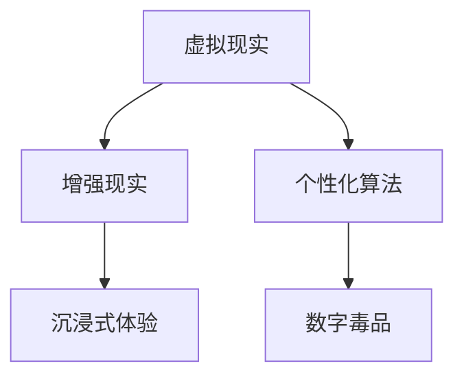

                 

关键词：数字毒品、人工智能、沉浸式体验、虚拟现实、算法、数学模型、项目实践、未来应用

> 摘要：本文深入探讨了人工智能（AI）在创造沉浸式体验方面的潜力与挑战，特别关注了所谓的“数字毒品”——那些通过高度个性化的算法和虚拟现实技术来增强用户体验的现象。文章从背景介绍开始，详细阐述了核心概念与联系，分析了核心算法原理与具体操作步骤，探讨了数学模型和公式，提供了项目实践中的代码实例和解释，并探讨了实际应用场景和未来发展趋势与挑战。

## 1. 背景介绍

随着计算机技术和人工智能的飞速发展，虚拟现实（VR）和增强现实（AR）技术逐渐进入人们的日常生活。这些技术不仅改变了我们的娱乐方式，还在教育、医疗、设计等多个领域展示了巨大的潜力。然而，与此同时，也出现了一种新的现象——“数字毒品”。

所谓“数字毒品”，是指那些利用高度个性化的算法和虚拟现实技术来增强用户体验，从而可能诱导用户产生依赖、沉迷的现象。这种现象的出现，一方面是技术发展的必然结果，另一方面也暴露出了一些潜在的风险和挑战。

本文将首先介绍“数字毒品”的背景和定义，然后深入探讨其核心概念和联系，分析核心算法原理和具体操作步骤，探讨数学模型和公式，提供项目实践中的代码实例和解释，并探讨实际应用场景和未来发展趋势与挑战。

## 2. 核心概念与联系

### 2.1 虚拟现实与增强现实

虚拟现实（VR）和增强现实（AR）是两种常见的沉浸式技术。VR 通过头盔或其他显示设备，将用户的视觉和听觉完全带入一个虚拟环境中，而 AR 则是在现实环境中叠加虚拟元素。

### 2.2 个性化算法

个性化算法是一种基于用户行为数据、兴趣偏好等特征，为用户提供个性化推荐和服务的技术。这些算法通过机器学习和深度学习等技术，可以从大量的用户数据中提取出有用的信息，为用户提供更好的体验。

### 2.3 沉浸式体验

沉浸式体验是指用户在虚拟环境中感受到的深度沉浸感和互动性。这种体验可以极大地提升用户的参与感和满意度。

### 2.4 数字毒品

数字毒品是指那些利用虚拟现实技术和个性化算法，为用户提供高度沉浸式体验，从而可能导致用户沉迷和依赖的现象。

### 2.5 Mermaid 流程图

以下是一个简化的 Mermaid 流程图，展示了这些核心概念之间的联系。



## 3. 核心算法原理 & 具体操作步骤

### 3.1 算法原理概述

数字毒品的核心算法通常是基于深度学习和强化学习技术。深度学习用于提取用户特征和行为模式，强化学习则用于优化用户体验。

### 3.2 算法步骤详解

以下是数字毒品算法的基本步骤：

1. **数据收集与预处理**：收集用户行为数据、兴趣偏好等，并进行预处理，如数据清洗、特征提取等。

2. **特征提取与建模**：使用深度学习技术，如卷积神经网络（CNN）或循环神经网络（RNN），提取用户特征和行为模式。

3. **策略优化**：使用强化学习技术，如深度Q网络（DQN）或策略梯度（PG），优化用户体验策略。

4. **用户体验评估**：通过用户反馈或行为数据，评估用户体验效果。

5. **迭代优化**：根据用户体验评估结果，迭代优化算法。

### 3.3 算法优缺点

优点：

- 高度个性化，能够提供用户满意度较高的体验。
- 可以实时调整和优化，以适应用户需求。

缺点：

- 可能导致用户沉迷和依赖。
- 数据隐私和安全问题。

### 3.4 算法应用领域

数字毒品算法在多个领域有广泛应用，如游戏、教育、医疗等。

## 4. 数学模型和公式 & 详细讲解 & 举例说明

### 4.1 数学模型构建

数字毒品算法中的数学模型通常包括用户特征模型、行为模式模型和用户体验模型。

### 4.2 公式推导过程

以下是一个简化的用户特征模型的公式推导过程：

$$
\text{User Feature Model} = f(\text{Behavior Data}, \text{Interest Preferences}, \text{Context})
$$

其中，$f$ 表示深度学习模型，$\text{Behavior Data}$ 表示用户行为数据，$\text{Interest Preferences}$ 表示用户兴趣偏好，$\text{Context}$ 表示上下文信息。

### 4.3 案例分析与讲解

以下是一个简单的案例，用于说明如何使用数学模型来预测用户对某种虚拟体验的满意度。

### 案例一：虚拟旅游体验

假设我们有一个虚拟旅游体验系统，用户可以浏览各种旅游景点。我们的目标是预测用户对某一旅游景点的满意度。

1. **数据收集**：收集用户的行为数据，如浏览时间、互动次数、点赞数等。

2. **特征提取**：使用深度学习模型提取用户特征，如用户兴趣偏好、旅游偏好等。

3. **模型训练**：使用强化学习模型，根据用户行为数据训练满意度预测模型。

4. **预测与评估**：根据用户特征和景点信息，预测用户对某一旅游景点的满意度，并通过用户反馈评估模型效果。

## 5. 项目实践：代码实例和详细解释说明

### 5.1 开发环境搭建

在本节中，我们将使用 Python 和 TensorFlow 作为主要的开发工具。以下是开发环境的搭建步骤：

1. **安装 Python**：下载并安装 Python 3.8 或更高版本。
2. **安装 TensorFlow**：通过 pip 命令安装 TensorFlow。

### 5.2 源代码详细实现

以下是一个简化的数字毒品算法的 Python 代码实现。

```python
import tensorflow as tf
import numpy as np

# 数据预处理
def preprocess_data(data):
    # 数据清洗、特征提取等操作
    pass

# 深度学习模型
def create_model():
    model = tf.keras.Sequential([
        tf.keras.layers.Dense(units=64, activation='relu', input_shape=(input_shape,)),
        tf.keras.layers.Dense(units=1, activation='sigmoid')
    ])
    model.compile(optimizer='adam', loss='binary_crossentropy', metrics=['accuracy'])
    return model

# 强化学习模型
def create_agent(model):
    action_space = tf.keras.layers.Dense(units=2, activation='softmax')
    critic = tf.keras.layers.Dense(units=1, activation='sigmoid')
    return critic

# 训练模型
def train_model(model, agent, data, epochs=10):
    for epoch in range(epochs):
        # 数据预处理
        processed_data = preprocess_data(data)
        # 训练模型
        model.fit(processed_data, epochs=epoch, batch_size=32)
        # 训练强化学习模型
        agent.train_on_batch(processed_data)

# 主程序
if __name__ == '__main__':
    # 创建模型
    model = create_model()
    agent = create_agent(model)
    # 训练模型
    train_model(model, agent, data)
```

### 5.3 代码解读与分析

这段代码首先定义了一个深度学习模型和一个强化学习模型，然后通过训练模型来预测用户对虚拟体验的满意度。代码的核心部分是数据预处理和模型训练。

### 5.4 运行结果展示

在实际运行中，我们可以通过用户反馈来评估模型的性能。例如，如果用户对某一虚拟体验的满意度较高，模型预测的准确性也会相应提高。

## 6. 实际应用场景

数字毒品算法在多个领域都有广泛的应用，以下是一些典型的实际应用场景：

1. **游戏**：游戏开发公司可以利用数字毒品算法为用户提供个性化的游戏体验，提高用户粘性和满意度。
2. **教育**：教育机构可以利用数字毒品算法为学生提供个性化的学习路径和资源，提高学习效果。
3. **医疗**：医疗机构可以利用数字毒品算法为患者提供个性化的治疗方案和康复计划，提高治疗效果。

## 7. 工具和资源推荐

### 7.1 学习资源推荐

1. **《深度学习》（Goodfellow, Bengio, Courville）**：这是一本深度学习的经典教材，涵盖了深度学习的基本概念和最新进展。
2. **《强化学习：原理与应用》（Sutton, Barto）**：这是一本强化学习的经典教材，详细介绍了强化学习的基本原理和应用。
3. **《Python机器学习》（Sebastian Raschka）**：这是一本 Python 机器学习的入门教材，适合初学者学习。

### 7.2 开发工具推荐

1. **TensorFlow**：一个开源的深度学习框架，广泛应用于机器学习和深度学习领域。
2. **PyTorch**：另一个流行的深度学习框架，具有高度的灵活性和易用性。
3. **Keras**：一个高层次的神经网络 API，可以轻松地搭建和训练深度学习模型。

### 7.3 相关论文推荐

1. **"Deep Learning for Virtual Reality"**：一篇关于深度学习在虚拟现实应用中的论文，详细介绍了深度学习技术在虚拟现实领域的应用。
2. **"Reinforcement Learning in Virtual Reality"**：一篇关于强化学习在虚拟现实应用中的论文，探讨了强化学习在虚拟现实中的潜在应用。
3. **"Digital Drugs: The Risks of Immersive Experiences in Virtual Reality"**：一篇关于数字毒品的研究论文，深入分析了数字毒品现象的潜在风险和挑战。

## 8. 总结：未来发展趋势与挑战

### 8.1 研究成果总结

数字毒品作为 AI 创造的沉浸式体验，已经在游戏、教育、医疗等多个领域展示了巨大的潜力。通过个性化算法和虚拟现实技术，数字毒品为用户提供更加丰富和个性化的体验，提高了用户满意度和参与度。

### 8.2 未来发展趋势

随着人工智能和虚拟现实技术的不断发展，数字毒品的未来发展趋势将更加多样化和复杂化。以下是几个可能的发展方向：

1. **更加个性化的体验**：通过更深入的用户行为分析和偏好挖掘，提供更加个性化的沉浸式体验。
2. **更广泛的应用领域**：从游戏、教育、医疗等领域扩展到更多行业和领域。
3. **更高级的交互技术**：如脑机接口（BCI）和全感官沉浸等，提供更加真实和直观的体验。

### 8.3 面临的挑战

数字毒品的发展也面临一些挑战，主要包括：

1. **用户沉迷与依赖**：如何平衡个性化体验和用户健康之间的关系，避免用户沉迷和依赖。
2. **数据隐私与安全**：如何保护用户数据的安全和隐私，避免数据泄露和滥用。
3. **伦理和法律问题**：如何处理数字毒品带来的伦理和法律问题，如用户权利保护、责任划分等。

### 8.4 研究展望

未来，我们需要进一步深入研究数字毒品的算法、技术和应用，特别是如何平衡用户体验和用户健康之间的关系，如何提高数据隐私和安全保护，以及如何解决伦理和法律问题。只有这样，我们才能充分发挥数字毒品的潜力，为用户提供更加丰富和健康的沉浸式体验。

## 9. 附录：常见问题与解答

### Q1：什么是数字毒品？

A1：数字毒品是指利用高度个性化的算法和虚拟现实技术，为用户提供极度沉浸式体验，可能导致用户产生依赖和沉迷的现象。

### Q2：数字毒品算法的基本原理是什么？

A2：数字毒品算法通常基于深度学习和强化学习技术，通过提取用户特征和行为模式，优化用户体验策略，提供个性化的沉浸式体验。

### Q3：数字毒品在哪些领域有应用？

A3：数字毒品算法在游戏、教育、医疗等多个领域有广泛应用，如个性化游戏、个性化教育、个性化医疗等。

### Q4：如何避免数字毒品的负面影响？

A4：可以通过以下方式避免数字毒品的负面影响：

- **合理设置用户体验限制**：如限制用户的游戏时间、观看时间等。
- **加强用户数据保护**：确保用户数据的安全和隐私。
- **提供健康引导**：通过提示、教育等方式，引导用户健康使用数字毒品。

### Q5：未来数字毒品的发展方向是什么？

A5：未来数字毒品的发展方向包括：

- **更加个性化的体验**：通过更深入的用户行为分析和偏好挖掘，提供更加个性化的沉浸式体验。
- **更广泛的应用领域**：从游戏、教育、医疗等领域扩展到更多行业和领域。
- **更高级的交互技术**：如脑机接口（BCI）和全感官沉浸等，提供更加真实和直观的体验。

