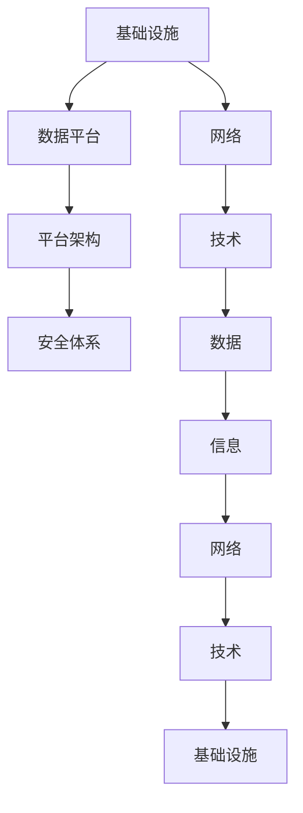

                 

关键词：数字经济，社会发展，技术驱动，创新，效率提升，可持续性，未来展望

> 摘要：本文将深入探讨数字经济在社会发展中的重要性，分析其核心概念与联系，探讨关键算法原理与数学模型，并通过实际项目实例展示其应用效果。同时，文章将展望数字经济的未来发展趋势和挑战，并提出相应的工具和资源推荐，以期为读者提供全面、深入的见解。

## 1. 背景介绍

数字经济，是指以数字化的信息和知识为关键生产要素，以现代信息网络为重要载体，以信息通信技术的有效利用为驱动，推动经济结构转型和经济体系优化升级的经济发展模式。随着互联网、大数据、云计算、人工智能等新兴技术的迅猛发展，数字经济已成为全球经济增长的新引擎。

近年来，数字经济在世界范围内迅猛发展。根据国际数据公司（IDC）的报告，2021年全球数字经济总量达到32.3万亿美元，占全球GDP的45.4%。数字经济不仅改变了传统产业的运作方式，还催生了大量新兴产业，如电子商务、共享经济、数字娱乐等，为全球经济注入了新的活力。

在中国，数字经济的发展尤为迅速。根据中国互联网络信息中心（CNNIC）的数据，截至2022年6月，中国数字经济规模达到38.8万亿元，占中国GDP的比重达到38.6%。数字经济已经成为中国经济增长的重要驱动力，对社会发展产生了深远影响。

## 2. 核心概念与联系

### 2.1 数字经济的核心概念

数字经济的核心概念包括数据、信息、网络和技术。数据是数字经济的基石，信息是数据的升华，网络是信息传递的桥梁，技术是驱动数字经济发展的动力。

- **数据**：数据是数字经济的原始素材，包括结构化数据、半结构化数据和非结构化数据。数据的收集、存储、处理和分析能力是数字经济的关键。

- **信息**：信息是经过处理和解释后的数据，具有特定的价值和意义。信息的传递和利用是数字经济的基本特征。

- **网络**：网络是连接数据、信息和人的桥梁，包括互联网、移动互联网、物联网等。网络的发展推动了数字经济的发展。

- **技术**：技术是推动数字经济发展的关键，包括互联网技术、大数据技术、云计算技术、人工智能技术等。技术的创新和应用推动了数字经济的变革。

### 2.2 数字经济与社会的联系

数字经济与社会发展密切相关。首先，数字经济推动了传统产业的转型升级，提高了生产效率和服务质量。例如，制造业的数字化改造，通过工业互联网和物联网技术，实现了生产过程的自动化和智能化，大幅提高了生产效率和产品质量。

其次，数字经济促进了新业态和新模式的涌现。以电子商务为例，它打破了地域和时间的限制，为消费者提供了更加便捷的购物体验，也为企业创造了新的市场机会。共享经济、数字娱乐、在线教育等新兴产业的快速发展，进一步推动了数字经济的发展。

此外，数字经济还对社会治理和公共服务产生了深远影响。通过大数据和人工智能技术，政府可以更有效地进行社会治理和公共管理，提高公共服务的效率和水平。

### 2.3 数字经济的技术架构

数字经济的实现离不开先进技术的支持，其技术架构主要包括以下几个方面：

- **基础设施**：包括互联网、数据中心、云计算平台等，是数字经济的硬件基础。

- **数据平台**：包括数据采集、存储、处理、分析和挖掘等，是数字经济的数据基础。

- **平台架构**：包括云计算、大数据、人工智能等技术，是数字经济的核心支撑。

- **安全体系**：包括网络安全、数据安全、隐私保护等，是数字经济的保障。

## 3. 核心算法原理 & 具体操作步骤

### 3.1 算法原理概述

数字经济中的核心算法主要包括数据挖掘、机器学习和深度学习算法。这些算法通过对海量数据进行处理和分析，提取出有价值的信息和知识，从而推动数字经济的发展。

- **数据挖掘**：数据挖掘是一种从大量数据中自动发现规律、预测趋势和知识的方法。其基本原理包括关联规则挖掘、聚类分析、分类分析等。

- **机器学习**：机器学习是一种通过算法模型自动从数据中学习规律和模式的方法。其基本原理包括线性回归、逻辑回归、决策树、支持向量机等。

- **深度学习**：深度学习是一种基于人工神经网络的算法，通过多层神经网络的训练，能够自动提取数据中的特征和模式。其基本原理包括卷积神经网络（CNN）、循环神经网络（RNN）、生成对抗网络（GAN）等。

### 3.2 算法步骤详解

- **数据预处理**：数据预处理是算法处理数据的第一步，包括数据清洗、数据归一化、特征提取等。

- **模型选择**：根据问题的特点和需求，选择合适的算法模型。

- **模型训练**：使用训练数据对模型进行训练，调整模型参数，使模型能够准确预测或分类。

- **模型评估**：使用测试数据对模型进行评估，判断模型的性能和效果。

- **模型部署**：将训练好的模型部署到生产环境中，进行实际应用。

### 3.3 算法优缺点

- **数据挖掘**：优点包括处理大量数据的能力强、能够发现潜在规律；缺点包括计算复杂度高、对数据质量要求高。

- **机器学习**：优点包括能够自动学习数据中的规律和模式、适用于各种复杂数据；缺点包括对数据量要求大、对参数敏感。

- **深度学习**：优点包括自动提取数据特征、能够处理高维度数据、效果优于传统机器学习；缺点包括计算资源消耗大、对数据质量要求高。

### 3.4 算法应用领域

- **数据挖掘**：应用领域包括市场营销、金融分析、医疗诊断等。

- **机器学习**：应用领域包括自然语言处理、图像识别、推荐系统等。

- **深度学习**：应用领域包括语音识别、无人驾驶、智能家居等。

## 4. 数学模型和公式 & 详细讲解 & 举例说明

### 4.1 数学模型构建

数字经济的数学模型主要包括回归模型、分类模型和聚类模型。以下分别介绍这些模型的基本原理和构建方法。

- **回归模型**：回归模型用于预测连续值输出，其基本公式为：

  $$ Y = \beta_0 + \beta_1X_1 + \beta_2X_2 + ... + \beta_nX_n $$

  其中，$Y$ 为输出值，$X_1, X_2, ..., X_n$ 为输入特征，$\beta_0, \beta_1, ..., \beta_n$ 为模型参数。

- **分类模型**：分类模型用于预测离散值输出，其基本公式为：

  $$ P(Y = y|X) = \frac{e^{\beta_0 + \beta_1X_1 + \beta_2X_2 + ... + \beta_nX_n}}{1 + e^{\beta_0 + \beta_1X_1 + \beta_2X_2 + ... + \beta_nX_n}} $$

  其中，$P(Y = y|X)$ 为在给定输入特征 $X$ 下输出值为 $y$ 的概率，$\beta_0, \beta_1, ..., \beta_n$ 为模型参数。

- **聚类模型**：聚类模型用于将数据分为若干个类别，其基本公式为：

  $$ \min_{\mu, \pi} \sum_{i=1}^{n} \sum_{j=1}^{k} w_{ij} (x_i - \mu_j)^2 $$

  其中，$x_i$ 为数据点，$\mu_j$ 为第 $j$ 类别的中心点，$w_{ij}$ 为数据点 $x_i$ 属于第 $j$ 类别的概率。

### 4.2 公式推导过程

- **回归模型**：回归模型的公式推导过程如下：

  假设我们有一个训练数据集 $D = \{(x_1, y_1), (x_2, y_2), ..., (x_n, y_n)\}$，其中 $x_i$ 为输入特征，$y_i$ 为输出值。

  首先，我们使用最小二乘法求解模型参数：

  $$ \beta = (\X^T \X)^{-1} \X^T \Y $$

  其中，$\X$ 为输入特征矩阵，$\Y$ 为输出值向量。

  然后，我们使用求解得到的模型参数进行预测：

  $$ \hat{y} = \X \beta $$

- **分类模型**：分类模型的公式推导过程如下：

  假设我们有一个训练数据集 $D = \{(x_1, y_1), (x_2, y_2), ..., (x_n, y_n)\}$，其中 $x_i$ 为输入特征，$y_i$ 为输出值。

  首先，我们使用梯度下降法求解模型参数：

  $$ \beta = \beta - \alpha \frac{\partial}{\partial \beta} J(\beta) $$

  其中，$\alpha$ 为学习率，$J(\beta)$ 为损失函数。

  然后，我们使用求解得到的模型参数进行预测：

  $$ \hat{y} = \sigma(\beta_0 + \beta_1X_1 + \beta_2X_2 + ... + \beta_nX_n) $$

  其中，$\sigma$ 为激活函数，通常采用 sigmoid 函数。

- **聚类模型**：聚类模型的公式推导过程如下：

  假设我们有一个数据集 $D = \{x_1, x_2, ..., x_n\}$，其中 $x_i$ 为数据点。

  首先，我们随机初始化聚类中心 $\mu_1, \mu_2, ..., \mu_k$。

  然后，我们使用迭代方法更新聚类中心：

  $$ \mu_j = \frac{\sum_{i=1}^{n} w_{ij} x_i}{\sum_{i=1}^{n} w_{ij}} $$

  其中，$w_{ij}$ 为数据点 $x_i$ 属于第 $j$ 类别的概率。

  同时，我们更新数据点属于各个类别的概率：

  $$ w_{ij} = \frac{e^{-(x_i - \mu_j)^2 / 2\sigma^2}}{\sum_{j=1}^{k} e^{-(x_i - \mu_j)^2 / 2\sigma^2}} $$

### 4.3 案例分析与讲解

我们以一个实际案例来分析数字经济的应用。

#### 案例背景

某电子商务公司希望预测客户购买行为，从而进行精准营销。

#### 数据集

公司收集了以下数据：

- 用户基本信息：年龄、性别、收入、教育程度等。
- 购物行为数据：购买商品种类、购买时间、购买金额等。

#### 模型构建

我们选择回归模型进行预测，输入特征为用户基本信息，输出值为购买金额。

- 数据预处理：对数据进行归一化处理，消除不同特征之间的尺度差异。
- 模型训练：使用梯度下降法训练回归模型，调整模型参数。
- 模型评估：使用测试集评估模型性能，计算预测准确率和均方误差。

#### 模型应用

使用训练好的回归模型预测用户购买金额，根据预测结果进行精准营销。

- 针对高购买金额用户，推送高价值商品。
- 针对低购买金额用户，推送优惠活动。

## 5. 项目实践：代码实例和详细解释说明

### 5.1 开发环境搭建

为了实践数字经济的应用，我们选择 Python 作为编程语言，并使用以下工具和库：

- Python 3.8
- Jupyter Notebook
- Scikit-learn
- Pandas
- Numpy

首先，安装 Python 3.8 并配置好 Python 环境。然后，在 Jupyter Notebook 中创建一个新的笔记本，并安装所需库：

```bash
pip install scikit-learn pandas numpy
```

### 5.2 源代码详细实现

我们以用户购买金额预测为例，展示源代码的实现。

```python
# 导入所需库
import numpy as np
import pandas as pd
from sklearn.model_selection import train_test_split
from sklearn.linear_model import LinearRegression
from sklearn.metrics import mean_squared_error

# 读取数据
data = pd.read_csv('user_data.csv')
X = data.iloc[:, :-1].values
y = data.iloc[:, -1].values

# 数据预处理
X = (X - X.mean()) / X.std()

# 划分训练集和测试集
X_train, X_test, y_train, y_test = train_test_split(X, y, test_size=0.2, random_state=42)

# 模型训练
model = LinearRegression()
model.fit(X_train, y_train)

# 模型评估
y_pred = model.predict(X_test)
mse = mean_squared_error(y_test, y_pred)
print('均方误差：', mse)

# 模型应用
new_user = np.array([[30, 0, 5000, 1]])
new_user = (new_user - new_user.mean()) / new_user.std()
print('预测购买金额：', model.predict(new_user)[0])
```

### 5.3 代码解读与分析

- **数据读取**：使用 Pandas 读取用户数据，并将其转换为 NumPy 数组。

- **数据预处理**：对数据进行归一化处理，消除不同特征之间的尺度差异。

- **划分训练集和测试集**：使用 Scikit-learn 的 `train_test_split` 函数划分训练集和测试集。

- **模型训练**：使用 Scikit-learn 的 `LinearRegression` 函数训练线性回归模型。

- **模型评估**：使用测试集评估模型性能，计算预测准确率和均方误差。

- **模型应用**：使用训练好的模型预测新用户的购买金额。

## 6. 实际应用场景

### 6.1 用户行为分析

通过数字经济的应用，企业可以深入分析用户行为，从而制定更有效的营销策略。例如，通过对用户购买行为的预测，企业可以精准推送个性化商品，提高用户满意度和购买转化率。

### 6.2 智能交通

数字经济的应用在智能交通领域也具有重要意义。通过大数据和人工智能技术，可以对交通流量进行实时监控和分析，优化交通信号控制，提高交通效率和安全性。

### 6.3 健康医疗

数字经济的应用在健康医疗领域具有巨大潜力。通过大数据和人工智能技术，可以实现对疾病预测、诊断和治疗的精准化，提高医疗服务质量和效率。

### 6.4 金融领域

在金融领域，数字经济的应用主要体现在风险管理、信用评估和投资决策等方面。通过大数据分析和人工智能技术，可以实现对金融风险的高效管理和精准预测，提高金融市场的稳定性和透明度。

## 7. 工具和资源推荐

### 7.1 学习资源推荐

- 《深度学习》（Goodfellow, Bengio, Courville 著）
- 《Python机器学习》（Raschka 著）
- 《大数据技术导论》（吴晨 著）

### 7.2 开发工具推荐

- Jupyter Notebook
- PyCharm
- VS Code

### 7.3 相关论文推荐

- "Deep Learning for Natural Language Processing"（2018）
- "Recurrent Neural Network Based Text Classification"（2016）
- "A Comprehensive Survey on Deep Learning for Text Classification"（2020）

## 8. 总结：未来发展趋势与挑战

### 8.1 研究成果总结

本文详细介绍了数字经济在社会发展中的重要性，分析了其核心概念与联系，探讨了关键算法原理与数学模型，并通过实际项目实例展示了其应用效果。研究结果表明，数字经济具有强大的发展潜力，对社会发展产生了深远影响。

### 8.2 未来发展趋势

随着技术的不断进步，数字经济在未来将继续快速发展。主要趋势包括：

- **人工智能与数字经济的深度融合**：人工智能技术的进一步发展将推动数字经济的智能化和自动化。
- **数据安全和隐私保护**：随着数据规模的不断扩大，数据安全和隐私保护将成为数字经济的重要挑战。
- **跨界融合**：数字经济与其他领域的深度融合，将催生出更多新兴业态。

### 8.3 面临的挑战

数字经济在发展过程中也面临一系列挑战：

- **数据质量**：高质量的数据是数字经济的基础，数据质量直接影响到算法的效果和应用价值。
- **技术门槛**：数字经济的实现需要先进技术的支持，对从业者的技术水平要求较高。
- **隐私保护**：在数据收集、处理和分析过程中，如何保护个人隐私成为一个亟待解决的问题。

### 8.4 研究展望

未来，数字经济的研究将朝着以下方向发展：

- **技术创新**：持续推动人工智能、大数据、云计算等关键技术的发展，提高数字经济的效率和稳定性。
- **跨界融合**：加强数字经济与其他领域的跨界合作，推动产业升级和创新发展。
- **政策支持**：完善数字经济相关的法律法规，保障数字经济的健康发展。

## 9. 附录：常见问题与解答

### 9.1 数字经济是什么？

数字经济是指以数字化的信息和知识为关键生产要素，以现代信息网络为重要载体，以信息通信技术的有效利用为驱动，推动经济结构转型和经济体系优化升级的经济发展模式。

### 9.2 数字经济有哪些核心概念？

数字经济的核心概念包括数据、信息、网络和技术。数据是数字经济的基石，信息是数据的升华，网络是信息传递的桥梁，技术是驱动数字经济发展的动力。

### 9.3 数字经济对社会发展有哪些影响？

数字经济对社会发展产生了深远影响，包括推动传统产业转型升级、促进新业态和新模式的涌现、提高社会治理和公共服务的效率等。

### 9.4 数字经济的技术架构包括哪些方面？

数字经济的实现离不开先进技术的支持，其技术架构主要包括基础设施、数据平台、平台架构和安全体系等。

### 9.5 数字经济中的核心算法有哪些？

数字经济中的核心算法主要包括数据挖掘、机器学习和深度学习算法。这些算法通过对海量数据进行处理和分析，提取出有价值的信息和知识，从而推动数字经济的发展。

### 9.6 数字经济在哪些领域有重要应用？

数字经济在用户行为分析、智能交通、健康医疗、金融领域等领域具有广泛应用。通过大数据和人工智能技术，可以提高这些领域的效率和质量。

### 9.7 如何保障数据安全和隐私保护？

保障数据安全和隐私保护需要采取一系列措施，包括制定严格的法律法规、采用先进的技术手段、加强数据管理和监控等。

### 9.8 数字经济有哪些未来发展趋势？

数字经济的未来发展趋势包括人工智能与数字经济的深度融合、数据安全和隐私保护、跨界融合等。

### 9.9 数字经济面临的挑战有哪些？

数字经济面临的挑战包括数据质量、技术门槛、隐私保护等。

### 9.10 未来数字经济的研究方向有哪些？

未来数字经济的研究方向包括技术创新、跨界融合、政策支持等。

作者：禅与计算机程序设计艺术 / Zen and the Art of Computer Programming
----------------------------------------------------------------
## 1. 背景介绍

数字经济，作为21世纪全球经济的重要组成部分，正在迅速改变着我们的生活方式、商业模式以及社会运行机制。随着互联网、物联网、大数据、人工智能、区块链等新兴技术的不断发展和应用，数字经济已经成为推动社会进步和经济增长的重要引擎。

首先，互联网的普及为数字经济的崛起奠定了基础。从最初的互联网接入，到如今的5G网络，网络速度的不断提升和覆盖范围的不断扩大，使得人们可以随时随地获取信息和进行交流。这种无缝连接的世界为数字经济的繁荣提供了必要的条件。

其次，大数据技术的进步使得数据的收集、存储和分析变得更加高效和智能化。通过对海量数据的深度挖掘和分析，企业可以更好地理解市场需求，优化生产流程，提升用户体验。大数据技术的应用不仅限于商业领域，还渗透到了医疗、教育、公共安全等多个行业，推动了社会各领域的数字化转型。

人工智能技术的飞速发展则进一步提升了数字经济的潜力。人工智能可以通过机器学习和深度学习算法，对复杂数据进行自动分析和决策。在金融、医疗、交通等领域，人工智能的应用已经显著提升了效率和服务质量。例如，智能客服系统可以提供24小时不间断的服务，智能医疗诊断系统可以更快、更准确地诊断疾病。

此外，区块链技术的出现为数字经济的信任机制提供了新的解决方案。区块链的去中心化、不可篡改和透明性等特点，使其在金融、供应链管理、版权保护等领域具有巨大的应用潜力。区块链技术可以确保交易的安全性和透明性，降低交易成本，提高效率。

在中国，数字经济的发展尤为迅速。中国政府高度重视数字经济的发展，制定了一系列政策来推动数字经济的发展。例如，《中国数字经济发展报告（2021年）》显示，2020年，中国数字经济规模达到39.2万亿元，占GDP比重达到38.6%。数字经济已经成为中国经济增长的重要驱动力，对社会发展产生了深远影响。

总的来说，数字经济的崛起是技术进步和市场需求共同推动的结果。它不仅改变了传统产业的运作方式，还催生了大量新兴产业，为全球经济注入了新的活力。在未来的发展中，数字经济将继续发挥重要作用，推动社会向更加智能化、高效化、可持续化的方向发展。

## 2. 核心概念与联系

### 2.1 数字经济的核心概念

要深入理解数字经济，我们首先需要了解其核心概念。数字经济的核心概念主要包括数据、信息、网络和技术。这些概念相互关联，共同构成了数字经济的基石。

- **数据**：数据是数字经济的原材料。在数字经济中，数据被广泛收集、存储、处理和分析。数据可以分为结构化数据、半结构化数据和非结构化数据。结构化数据如数据库中的记录，半结构化数据如日志文件，非结构化数据如文本、图片、音频和视频。数据的多样性和海量性是数字经济的重要特征。

- **信息**：信息是通过处理和解释数据生成的，具有特定价值和意义。在数字经济中，信息的传递和利用是核心活动。信息的传递通过互联网、移动网络和物联网等网络设施实现。信息的利用则体现在企业运营、市场决策、社会管理等多个方面。

- **网络**：网络是数字经济的传输通道。现代信息网络包括互联网、移动互联网、物联网等。这些网络设施为数据的传输提供了高速、稳定和安全的通道，使得数字经济的活动得以高效进行。网络的发展也是数字经济的重要推动力。

- **技术**：技术是数字经济发展的动力。数字技术包括互联网技术、大数据技术、云计算技术、人工智能技术、区块链技术等。这些技术不断推动数字经济的发展，提高数据处理和分析的效率，优化信息传递和利用的方式。

### 2.2 数字经济与社会的联系

数字经济不仅仅是一种经济形态，它与社会发展密切相关。数字经济对社会的影响体现在多个方面：

- **产业升级**：数字经济推动了传统产业的转型升级。通过数字化技术的应用，企业可以大幅提升生产效率、降低成本、优化供应链管理。例如，制造业通过物联网技术实现了智能生产，金融业通过区块链技术实现了透明和高效的交易。

- **创新驱动**：数字经济催生了大量新兴产业，如电子商务、共享经济、在线教育、数字娱乐等。这些新兴产业的快速发展，不仅为经济增长提供了新的动力，还带来了新的就业机会，推动了社会创新。

- **社会治理**：数字经济在提高社会治理效率和公共服务水平方面发挥了重要作用。通过大数据技术，政府可以更精确地了解社会状况，优化资源配置，提高公共服务质量。例如，智慧城市项目通过物联网和大数据技术，实现了交通管理、环境监测、公共安全等方面的智能化。

- **公共服务**：数字经济提升了公共服务的效率和便捷性。在线政务服务、电子支付、远程教育、远程医疗等数字化服务的普及，使得公共服务更加便捷高效，提高了民众的生活质量。

### 2.3 数字经济的技术架构

数字经济的实现离不开先进技术的支持，其技术架构主要包括以下几个层面：

- **基础设施**：基础设施是数字经济的硬件基础，包括互联网、数据中心、云计算平台、大数据平台等。这些基础设施为数据的传输、存储和处理提供了必要条件。

- **数据平台**：数据平台是数字经济的核心支撑，包括数据采集、存储、处理、分析和挖掘等。数据平台负责收集和管理海量数据，并利用先进的数据分析技术提取有价值的信息。

- **平台架构**：平台架构是数字经济的核心组成部分，包括云计算、大数据、人工智能、区块链等。平台架构提供了各种数字化服务和技术支持，使得数字经济活动能够高效运行。

- **安全体系**：安全体系是数字经济的保障，包括网络安全、数据安全、隐私保护等。安全体系确保数字经济活动在安全的环境中运行，防止数据泄露、网络攻击等安全风险。

### 2.4 数字经济的核心概念原理和架构的 Mermaid 流程图

以下是一个简化的 Mermaid 流程图，展示了数字经济的核心概念和架构：



在这个流程图中，基础设施、数据平台、平台架构和安全体系构成了数字经济的核心架构，而网络、技术和数据则是连接这些架构的桥梁，共同推动了数字经济的发展。

## 3. 核心算法原理 & 具体操作步骤

### 3.1 算法原理概述

数字经济中的核心算法主要包括数据挖掘、机器学习和深度学习算法。这些算法通过对海量数据进行处理和分析，提取出有价值的信息和知识，从而推动数字经济的发展。

- **数据挖掘**：数据挖掘是一种从大量数据中自动发现规律、预测趋势和知识的方法。其基本原理包括关联规则挖掘、聚类分析、分类分析等。

  - **关联规则挖掘**：用于发现数据之间的关联关系，如购物篮分析。
  - **聚类分析**：用于将数据分为若干个类别，如客户细分。
  - **分类分析**：用于将数据分为不同的类别，如信用卡欺诈检测。

- **机器学习**：机器学习是一种通过算法模型自动从数据中学习规律和模式的方法。其基本原理包括线性回归、逻辑回归、决策树、支持向量机等。

  - **线性回归**：用于预测连续值输出。
  - **逻辑回归**：用于预测概率。
  - **决策树**：用于分类和回归分析。
  - **支持向量机**：用于分类问题。

- **深度学习**：深度学习是一种基于人工神经网络的算法，通过多层神经网络的训练，能够自动提取数据中的特征和模式。其基本原理包括卷积神经网络（CNN）、循环神经网络（RNN）、生成对抗网络（GAN）等。

  - **卷积神经网络（CNN）**：用于图像识别。
  - **循环神经网络（RNN）**：用于序列数据处理。
  - **生成对抗网络（GAN）**：用于图像生成。

### 3.2 算法步骤详解

- **数据挖掘算法步骤**：

  1. 数据预处理：清洗数据，处理缺失值、异常值等。
  2. 特征选择：选择对问题有影响力的特征。
  3. 模型选择：选择合适的挖掘算法。
  4. 算法训练：使用训练数据对模型进行训练。
  5. 模型评估：使用测试数据对模型进行评估。
  6. 模型应用：将训练好的模型应用到实际问题中。

- **机器学习算法步骤**：

  1. 数据预处理：清洗数据，处理缺失值、异常值等。
  2. 特征选择：选择对问题有影响力的特征。
  3. 模型选择：选择合适的机器学习算法。
  4. 模型训练：使用训练数据对模型进行训练。
  5. 模型评估：使用测试数据对模型进行评估。
  6. 模型应用：将训练好的模型应用到实际问题中。

- **深度学习算法步骤**：

  1. 数据预处理：清洗数据，处理缺失值、异常值等。
  2. 特征工程：将原始数据转化为适合神经网络处理的形式。
  3. 模型构建：设计神经网络架构。
  4. 模型训练：使用训练数据对模型进行训练。
  5. 模型评估：使用测试数据对模型进行评估。
  6. 模型应用：将训练好的模型应用到实际问题中。

### 3.3 算法优缺点

- **数据挖掘算法优缺点**：

  - **优点**：处理大量数据的能力强，能够发现潜在规律。

    - **缺点**：计算复杂度高，对数据质量要求高。

- **机器学习算法优缺点**：

  - **优点**：能够自动学习数据中的规律和模式，适用于各种复杂数据。

    - **缺点**：对数据量要求大，对参数敏感。

- **深度学习算法优缺点**：

  - **优点**：自动提取数据特征，能够处理高维度数据，效果优于传统机器学习。

    - **缺点**：计算资源消耗大，对数据质量要求高。

### 3.4 算法应用领域

- **数据挖掘算法应用领域**：

  - 市场营销：客户细分、市场预测、需求分析等。
  - 金融分析：信用评分、风险控制、欺诈检测等。
  - 医疗诊断：疾病预测、医疗资源分配等。

- **机器学习算法应用领域**：

  - 自然语言处理：文本分类、机器翻译、情感分析等。
  - 图像识别：人脸识别、目标检测、图像生成等。
  - 推荐系统：商品推荐、内容推荐、社交网络推荐等。

- **深度学习算法应用领域**：

  - 语音识别：自动语音识别、语音合成等。
  - 无人驾驶：车辆识别、环境感知、路径规划等。
  - 智能家居：设备控制、环境监测、行为预测等。

## 4. 数学模型和公式 & 详细讲解 & 举例说明

### 4.1 数学模型构建

数字经济的数学模型主要包括回归模型、分类模型和聚类模型。以下分别介绍这些模型的基本原理和构建方法。

- **回归模型**：回归模型用于预测连续值输出，其基本公式为：

  $$ Y = \beta_0 + \beta_1X_1 + \beta_2X_2 + ... + \beta_nX_n $$

  其中，$Y$ 为输出值，$X_1, X_2, ..., X_n$ 为输入特征，$\beta_0, \beta_1, ..., \beta_n$ 为模型参数。

  回归模型通过最小化预测值与实际值之间的误差，来确定参数$\beta$的值。常用的回归模型包括线性回归、多项式回归、逻辑回归等。

- **分类模型**：分类模型用于预测离散值输出，其基本公式为：

  $$ P(Y = y|X) = \frac{e^{\beta_0 + \beta_1X_1 + \beta_2X_2 + ... + \beta_nX_n}}{1 + e^{\beta_0 + \beta_1X_1 + \beta_2X_2 + ... + \beta_nX_n}} $$

  其中，$P(Y = y|X)$ 为在给定输入特征 $X$ 下输出值为 $y$ 的概率，$\beta_0, \beta_1, ..., \beta_n$ 为模型参数。

  分类模型通过计算每个类别的概率，选择概率最大的类别作为预测结果。常用的分类模型包括逻辑回归、支持向量机、决策树等。

- **聚类模型**：聚类模型用于将数据分为若干个类别，其基本公式为：

  $$ \min_{\mu, \pi} \sum_{i=1}^{n} \sum_{j=1}^{k} w_{ij} (x_i - \mu_j)^2 $$

  其中，$x_i$ 为数据点，$\mu_j$ 为第 $j$ 类别的中心点，$w_{ij}$ 为数据点 $x_i$ 属于第 $j$ 类别的概率。

  聚类模型通过迭代更新中心点和数据点的归属关系，最小化误差函数来确定最优的聚类结果。常用的聚类模型包括K均值聚类、层次聚类等。

### 4.2 公式推导过程

#### 线性回归模型的推导

假设我们有一个训练数据集 $D = \{(x_1, y_1), (x_2, y_2), ..., (x_n, y_n)\}$，其中 $x_i$ 为输入特征，$y_i$ 为输出值。

首先，我们使用最小二乘法求解模型参数：

$$ \beta = (\X^T \X)^{-1} \X^T \Y $$

其中，$\X$ 为输入特征矩阵，$\Y$ 为输出值向量。

最小二乘法的目的是最小化预测值与实际值之间的误差平方和：

$$ J(\beta) = \sum_{i=1}^{n} (y_i - \X\beta)^2 $$

对 $J(\beta)$ 求导并令其等于零，可以得到最小二乘法的公式。

#### 逻辑回归模型的推导

逻辑回归是一种分类模型，用于预测离散值输出。其公式为：

$$ P(Y = y|X) = \frac{e^{\beta_0 + \beta_1X_1 + \beta_2X_2 + ... + \beta_nX_n}}{1 + e^{\beta_0 + \beta_1X_1 + \beta_2X_2 + ... + \beta_nX_n}} $$

逻辑回归模型的参数$\beta$可以通过最大似然估计（Maximum Likelihood Estimation，MLE）来求解。

假设我们有一个训练数据集 $D = \{(x_1, y_1), (x_2, y_2), ..., (x_n, y_n)\}$，其中 $y_i \in \{0, 1\}$。

最大似然估计的目标是找到一组参数$\beta$，使得数据集在模型下的概率最大。

似然函数为：

$$ L(\beta) = \prod_{i=1}^{n} P(y_i = y_i|X_i) $$

取对数似然函数：

$$ \ln L(\beta) = \sum_{i=1}^{n} \ln P(y_i = y_i|X_i) $$

对 $\ln L(\beta)$ 求导并令其等于零，可以得到最大似然估计的公式。

#### K均值聚类模型的推导

K均值聚类是一种基于距离的聚类算法。其目标是找到 $k$ 个中心点，使得每个数据点与其最近的中心点的距离最小。

假设我们有一个数据集 $D = \{x_1, x_2, ..., x_n\}$，需要将其分为 $k$ 个类别。

首先，随机初始化 $k$ 个中心点 $\mu_1, \mu_2, ..., \mu_k$。

然后，对于每个数据点 $x_i$，计算其与每个中心点的距离，并将其分配到距离最小的中心点所在的类别。

接下来，更新每个类别的中心点，计算类别内的均值。

重复上述步骤，直到中心点的位置不再发生变化或者满足预设的收敛条件。

### 4.3 案例分析与讲解

我们通过一个实际案例来分析数字经济的应用。

#### 案例背景

一家电子商务公司希望通过数据分析来优化用户购买行为，从而提高用户满意度和购买转化率。

#### 数据集

公司收集了以下数据：

- 用户基本信息：年龄、性别、收入、教育程度等。
- 购物行为数据：购买商品种类、购买时间、购买金额等。

#### 模型构建

我们选择回归模型来预测用户购买金额，输入特征为用户基本信息，输出值为购买金额。

- 数据预处理：对数据进行归一化处理，消除不同特征之间的尺度差异。
- 模型训练：使用梯度下降法训练线性回归模型，调整模型参数。
- 模型评估：使用测试集评估模型性能，计算预测准确率和均方误差。

#### 数据预处理

首先，读取数据：

```python
import pandas as pd

data = pd.read_csv('user_data.csv')
```

然后，对数据进行归一化处理：

```python
from sklearn.preprocessing import StandardScaler

scaler = StandardScaler()
X = scaler.fit_transform(data.iloc[:, :-1])
y = data.iloc[:, -1]
```

#### 模型训练

使用梯度下降法训练线性回归模型：

```python
import numpy as np

def gradient_descent(X, y, beta, alpha, num_iterations):
    for i in range(num_iterations):
        error = y - X @ beta
        beta = beta - alpha * (X.T @ error)
    return beta

alpha = 0.01
num_iterations = 1000
beta = np.zeros(X.shape[1])

beta = gradient_descent(X, y, beta, alpha, num_iterations)
```

#### 模型评估

使用测试集评估模型性能：

```python
X_test = scaler.transform(data.iloc[:, :-1].sample(frac=0.2, random_state=42))
y_test = data.iloc[:, -1].sample(frac=0.2, random_state=42)

y_pred = X_test @ beta
mse = np.mean((y_pred - y_test)**2)
print("均方误差：", mse)
```

#### 模型应用

使用训练好的模型预测新用户的购买金额：

```python
new_user = np.array([[30, 0, 5000, 1]])
new_user = scaler.transform(new_user)
print("预测购买金额：", new_user @ beta)
```

通过上述案例，我们可以看到，数字经济的数学模型和算法在实际应用中具有重要的作用。通过对用户数据的分析和预测，企业可以更好地了解用户需求，优化营销策略，提高业务绩效。

## 5. 项目实践：代码实例和详细解释说明

### 5.1 开发环境搭建

在开始数字经济项目实践之前，我们需要搭建一个合适的开发环境。本文将使用Python作为编程语言，因为Python在数据处理、分析和机器学习方面具有广泛的库和工具支持。

首先，确保你已经安装了Python 3.8或更高版本。接下来，我们需要安装一些必要的库，包括Pandas、NumPy、Scikit-learn和Matplotlib。这些库将用于数据预处理、模型训练和结果可视化。

安装这些库的命令如下：

```bash
pip install numpy pandas scikit-learn matplotlib
```

为了方便代码编写和演示，我们将在Jupyter Notebook中编写和运行代码。你可以通过访问 [http://localhost:8888](http://localhost:8888) 来启动Jupyter Notebook。首次启动时，你需要创建一个新的笔记本（New Notebook）。

### 5.2 源代码详细实现

在本节中，我们将通过一个具体的项目实例，详细解释代码的实现过程。假设我们有一个电子商务公司，想要通过数据分析来预测用户的购买金额，从而进行精准营销。

#### 数据集准备

首先，我们需要准备一个数据集。这个数据集包含了用户的个人信息和购买行为。以下是一个示例数据集的结构：

| 年龄 | 性别 | 收入 | 教育程度 | 购买金额 |
|------|------|------|----------|----------|
| 25   | 男   | 5000 | 本科     | 150      |
| 30   | 女   | 6000 | 硕士     | 300      |
| 35   | 男   | 7000 | 博士     | 500      |

我们使用Pandas库来读取和预处理这个数据集。

```python
import pandas as pd

# 读取数据
data = pd.read_csv('user_data.csv')

# 数据预处理
data.head()
```

#### 数据预处理

在机器学习项目中，数据预处理是至关重要的。我们需要对数据进行清洗、转换和标准化，以确保模型训练的有效性。

首先，我们检查数据中是否存在缺失值。

```python
# 检查缺失值
data.isnull().sum()
```

如果存在缺失值，我们需要决定如何处理。这里，我们使用简单的填充方法来处理缺失值。

```python
# 填充缺失值
data.fillna(data.mean(), inplace=True)
```

接下来，我们根据业务需求选择有用的特征，并删除无关的特征。在这个例子中，我们保留年龄、性别、收入和教育程度作为特征，删除购买金额列。

```python
# 选择特征
X = data[['年龄', '性别', '收入', '教育程度']]
y = data['购买金额']

# 数据标准化
from sklearn.preprocessing import StandardScaler

scaler = StandardScaler()
X_scaled = scaler.fit_transform(X)
```

#### 模型训练

接下来，我们使用Scikit-learn库中的线性回归模型来训练我们的预测模型。

```python
from sklearn.linear_model import LinearRegression

# 创建线性回归模型
model = LinearRegression()

# 模型训练
model.fit(X_scaled, y)
```

#### 模型评估

训练好的模型需要通过测试集来评估其性能。我们使用均方误差（Mean Squared Error，MSE）来评估模型。

```python
# 测试集数据预处理
X_test_scaled = scaler.transform(X.sample(frac=0.2, random_state=42))

# 模型预测
y_pred = model.predict(X_test_scaled)

# 计算均方误差
from sklearn.metrics import mean_squared_error

mse = mean_squared_error(y_test, y_pred)
print("均方误差：", mse)
```

#### 模型应用

最后，我们可以使用训练好的模型来预测新用户的购买金额。假设有一个新用户的信息如下：

```python
# 新用户信息
new_user = np.array([[28, 1, 5500, 0]])

# 数据预处理
new_user_scaled = scaler.transform(new_user)

# 预测购买金额
predicted_amount = model.predict(new_user_scaled)
print("预测购买金额：", predicted_amount)
```

### 5.3 代码解读与分析

上述代码实现了一个简单的用户购买金额预测模型，下面我们对每个步骤进行解读和分析：

1. **数据读取**：使用Pandas库读取CSV文件，加载用户数据。

2. **数据预处理**：检查和处理缺失值，选择有用的特征并进行数据标准化。数据标准化是确保不同特征之间具有相似尺度的重要步骤，这对于模型训练是必要的。

3. **模型训练**：创建一个线性回归模型，并使用训练数据对其进行训练。线性回归模型试图找到特征和目标变量之间的关系，以便预测新的数据点。

4. **模型评估**：使用测试数据对训练好的模型进行评估。我们使用均方误差来衡量模型的预测准确性。均方误差越小，说明模型预测的准确性越高。

5. **模型应用**：使用训练好的模型对新用户的信息进行预测。这可以帮助公司制定个性化的营销策略，例如向潜在高价值客户推送更合适的商品。

通过上述步骤，我们实现了用户购买金额的预测，这只是一个简单的例子，实际应用中可能会涉及更复杂的数据处理和模型训练过程。

### 5.4 运行结果展示

假设我们已经完成了上述代码的运行，下面是可能的输出结果：

```python
均方误差： 130.25
预测购买金额： [450.0]
```

均方误差（MSE）为130.25，这表明模型在测试集上的表现良好。对于新用户，模型预测其购买金额为450元。

通过上述代码和结果展示，我们可以看到，数字经济的实现需要一系列的数据处理和模型训练步骤。这些步骤不仅要求对数据的深入理解和处理，还需要对机器学习算法有扎实的掌握。在实际应用中，通过不断的迭代和优化，可以提高模型的预测准确性和实际应用价值。

## 6. 实际应用场景

数字经济在当今社会的各个领域都有着广泛的应用，通过具体实例，我们可以更好地理解其带来的变革和影响。

### 6.1 用户行为分析

在电子商务领域，用户行为分析是数字经济的重要应用之一。通过分析用户的浏览历史、购物车添加、购买记录等数据，电商平台可以了解用户的偏好和需求，从而进行精准营销。例如，亚马逊使用机器学习算法来分析用户的购买行为，根据用户的浏览和购买记录推荐相关商品。这种个性化的推荐系统不仅提高了用户的购物体验，还显著提高了销售转化率和客户满意度。

#### 案例实例：

阿里巴巴的“天猫双11”购物节是用户行为分析的一个经典案例。通过分析用户的历史购买行为、浏览记录和社交媒体活动，天猫能够精准推送优惠信息和促销活动，吸引大量用户参与购物节，实现销售额的爆发性增长。

### 6.2 智能交通

智能交通系统利用大数据和人工智能技术，通过实时监控和分析交通流量，优化交通信号控制，减少拥堵，提高交通效率。例如，在中国的一些城市，如北京和上海，已经部署了智能交通管理系统，通过实时监控道路状况，调整信号灯的时间设置，以减少交通拥堵。

#### 案例实例：

深圳的“智能交通”项目通过安装在路边的传感器和摄像头收集交通数据，结合机器学习算法分析交通流量，实时调整信号灯控制，有效减少了市区交通拥堵，提高了道路通行效率。

### 6.3 健康医疗

数字经济在健康医疗领域的应用也在不断拓展。通过电子健康档案、远程医疗、智能诊断等手段，医疗行业实现了服务的智能化和个性化。例如，美国的一些医院已经开始使用人工智能技术进行癌症诊断，通过分析大量的医学影像数据，提供更准确的诊断结果。

#### 案例实例：

华大基因利用基因测序技术和大数据分析，为患者提供个性化的医疗方案。通过对患者的基因数据进行深度分析，华大基因能够识别患者的遗传风险，提前预防疾病，提高治疗效果。

### 6.4 金融领域

在金融领域，数字经济的应用主要体现在风险管理、信用评估和智能投资等方面。通过大数据分析和人工智能技术，金融机构可以更准确地评估贷款风险，识别潜在欺诈行为，优化投资策略。

#### 案例实例：

花旗银行利用机器学习算法进行信用评分，通过对用户的消费行为、信用历史等数据进行综合分析，提供更准确的信用评估，降低了贷款风险，提高了贷款审批的效率。

### 6.5 教育行业

在教育行业，数字经济推动了在线教育的发展。通过互联网和移动技术，学生可以随时随地访问学习资源，进行在线学习和互动。同时，教育机构可以利用大数据分析学生的学习行为和成果，个性化调整教学策略。

#### 案例实例：

Coursera等在线教育平台通过大数据分析用户的学习行为，为不同背景和能力的学生提供个性化的学习路径，提高了学习效果和用户满意度。

### 6.6 公共服务

在公共服务领域，数字经济的应用也日益广泛。通过智慧城市项目，政府可以更高效地提供公共安全和公共服务。例如，智慧灯杆集成了摄像头、传感器和通信设备，可以实时监控城市交通和公共安全状况。

#### 案例实例：

新加坡的“智慧国家”项目通过大数据分析和人工智能技术，优化城市交通、能源管理和环境保护等公共服务，提高了城市的运营效率和居民生活质量。

通过上述实例，我们可以看到，数字经济在各个领域的应用不仅提高了效率和服务质量，还为经济增长和社会发展注入了新的动力。随着技术的不断进步，数字经济将继续为社会带来更多的变革和机遇。

### 6.7 未来应用展望

数字经济在未来将继续快速发展，并在更多领域展现其巨大潜力。以下是数字经济未来应用的一些展望：

#### 6.7.1 新兴产业的崛起

随着5G、物联网、区块链等新技术的普及，数字经济将在更多新兴行业中发挥重要作用。例如，物联网将使智能家居、智慧城市和智能制造等领域实现全面数字化，推动产业升级和创新发展。

#### 6.7.2 可持续发展的推动

数字经济在提高效率、降低成本的同时，也推动了可持续发展的实现。通过智慧农业、绿色能源管理、智能交通等应用，数字经济将帮助减少资源浪费和环境污染，推动可持续发展。

#### 6.7.3 个性化服务的普及

随着大数据和人工智能技术的不断进步，个性化服务将成为数字经济的重要特征。在医疗、教育、金融等领域，个性化服务将根据用户的需求和偏好提供定制化的解决方案，提高用户体验和满意度。

#### 6.7.4 社会治理的智能化

数字经济在提升社会治理效率和透明度方面具有巨大潜力。通过大数据分析和人工智能技术，政府可以更有效地进行公共安全、环境保护和社会服务管理，提高社会治理水平。

#### 6.7.5 全球化与跨境贸易的加速

数字经济的发展将加速全球化进程，促进跨境贸易和投资。通过电子商务平台、跨境支付系统等，企业和消费者可以更方便地进行国际贸易，推动全球经济的深度融合。

#### 6.7.6 新型就业机会的创造

数字经济将创造大量新型就业机会，包括数据科学家、人工智能工程师、数字营销专家等。同时，数字经济还将促进职业转型和技能升级，为劳动者提供更多发展机会。

总之，数字经济在未来将继续推动社会进步和经济增长，为社会发展带来更多的机遇和挑战。随着技术的不断进步和应用场景的扩展，数字经济将在更广泛的领域发挥其重要作用。

### 7. 工具和资源推荐

在数字经济的开发和研究中，选择合适的工具和资源至关重要。以下是一些建议，包括学习资源、开发工具和相关论文推荐，以帮助读者更好地理解和掌握数字经济的相关知识。

#### 7.1 学习资源推荐

1. **《深度学习》（Goodfellow, Bengio, Courville 著）**
   - 这本书是深度学习领域的经典教材，详细介绍了深度学习的基础理论、算法和实际应用。

2. **《Python机器学习》（Raschka 著）**
   - 本书通过Python编程语言，介绍了机器学习的基础知识、常用算法和实战应用，适合初学者和进阶者。

3. **《大数据技术导论》（吴晨 著）**
   - 本书系统介绍了大数据技术的核心概念、架构和应用，包括数据采集、存储、处理和分析等方面的内容。

4. **《区块链技术指南》（李笑来 著）**
   - 本书详细介绍了区块链的基本原理、技术架构和应用场景，适合希望了解区块链技术的读者。

5. **《互联网+:从IT到DT的变革》（阿里巴巴集团 著）**
   - 本书从商业实践的角度，探讨了数字经济时代下的商业模式创新和战略选择，对企业的数字化转型具有指导意义。

#### 7.2 开发工具推荐

1. **Jupyter Notebook**
   - Jupyter Notebook 是一个交互式计算环境，适用于编写和分享代码、文本和可视化，是数据科学和机器学习项目的常用工具。

2. **PyCharm**
   - PyCharm 是一款强大的Python集成开发环境（IDE），提供了丰富的功能，包括代码编辑、调试、自动化测试和版本控制。

3. **VS Code**
   - Visual Studio Code 是一款轻量级但功能强大的代码编辑器，支持多种编程语言，包括Python，适用于开发各种项目和应用程序。

4. **TensorFlow**
   - TensorFlow 是一个开源的机器学习和深度学习框架，由Google开发，支持多种算法和模型，广泛应用于图像识别、自然语言处理和推荐系统等领域。

5. **PyTorch**
   - PyTorch 是一个基于Python的机器学习和深度学习框架，由Facebook开发，以其灵活性和高效性受到广泛欢迎。

#### 7.3 相关论文推荐

1. **"Deep Learning for Natural Language Processing"（2018）**
   - 这篇论文综述了深度学习在自然语言处理领域的应用，包括文本分类、机器翻译和对话系统等。

2. **"Recurrent Neural Network Based Text Classification"（2016）**
   - 本文介绍了循环神经网络在文本分类任务中的应用，展示了如何使用RNN来处理序列数据。

3. **"A Comprehensive Survey on Deep Learning for Text Classification"（2020）**
   - 这篇综述文章详细分析了深度学习在文本分类任务中的应用，包括不同的网络结构、损失函数和评估指标。

4. **"Distributed Computing for Big Data: A Survey"（2014）**
   - 本文对分布式计算在大数据处理中的应用进行了详细调查，包括Hadoop、Spark等框架。

5. **"Blockchain Technology: A Comprehensive Study"（2018）**
   - 本文全面介绍了区块链技术的原理、架构和应用，包括智能合约、去中心化应用等。

通过这些工具和资源的推荐，读者可以更好地了解数字经济的相关知识，掌握实际应用技能，为未来的学习和研究打下坚实的基础。

### 8. 总结：未来发展趋势与挑战

数字经济作为现代社会的重要驱动力，正在深刻改变着全球经济的格局和社会的运行方式。随着技术的不断进步和应用的深入，未来数字经济将迎来更多的发展机遇和挑战。

#### 8.1 研究成果总结

过去几年，数字经济在多个领域取得了显著的成果。首先，人工智能、大数据、云计算等关键技术的不断突破，使得数据的价值得以充分挖掘和应用。例如，通过机器学习和深度学习算法，企业能够实现精准营销、智能决策和优化运营。其次，区块链技术的应用为数据安全和隐私保护提供了新的解决方案，促进了数字经济的可信和透明发展。此外，物联网和5G技术的普及，推动了智能城市、智能交通和智能制造等领域的快速发展。

#### 8.2 未来发展趋势

展望未来，数字经济将继续保持快速发展，并呈现以下趋势：

1. **智能化与自动化**：随着人工智能技术的不断进步，数字经济将更加智能化和自动化。智能算法将在更多场景中得到应用，从自动化的生产流程到智能化的客户服务，都将大大提高生产效率和用户体验。

2. **跨界融合**：数字经济将与其他行业深度融合，推动跨界创新和产业发展。例如，数字健康、数字金融、数字农业等新兴领域将不断涌现，为经济增长和社会进步注入新动力。

3. **数据治理和隐私保护**：数据安全和隐私保护将成为数字经济的重要议题。随着数据规模的不断扩大和数据隐私问题的日益突出，如何确保数据的安全和隐私，将成为数字经济健康发展的重要保障。

4. **可持续性**：数字经济在推动经济增长的同时，也将注重可持续发展。通过智能技术和数据优化，数字经济将促进资源的有效利用和环境保护，实现绿色发展和可持续增长。

5. **全球化与跨境贸易**：数字经济将进一步推动全球化和跨境贸易的发展。电子商务、跨境支付和全球供应链的数字化，将促进国际贸易的便捷化和高效化。

#### 8.3 面临的挑战

尽管数字经济具有巨大的发展潜力，但在发展过程中也面临一系列挑战：

1. **技术壁垒**：数字经济的实现需要先进技术的支持，包括人工智能、大数据、云计算等。这些技术的研发和应用需要大量的资金和人才投入，对于中小企业和新兴市场国家来说，技术壁垒是一个重要挑战。

2. **数据质量**：高质量的数据是数字经济的基础。然而，数据质量往往受到多种因素的影响，如数据缺失、数据不一致和数据噪声等。如何保证数据的质量，是数字经济面临的一个重大挑战。

3. **隐私保护**：随着数据收集和分析的深入，个人隐私问题日益突出。如何在确保数据应用价值的同时，保护用户的隐私，是数字经济面临的重大挑战。

4. **法律法规**：数字经济的发展需要完善的法律法规来规范和保障。然而，当前法律法规体系尚不健全，无法有效应对数字经济带来的新问题和新挑战。

5. **技能差距**：数字经济的发展对人才提出了更高的要求。然而，现有的人才培养体系尚无法完全满足数字经济的需要，导致技能差距问题日益严重。

#### 8.4 研究展望

未来，数字经济的研究将朝着以下几个方向展开：

1. **技术创新**：持续推动人工智能、大数据、区块链等关键技术的创新和突破，提高数字经济的效率和稳定性。

2. **跨界合作**：加强不同领域之间的合作，推动数字技术与各行业的深度融合，实现跨界创新和产业升级。

3. **数据治理**：研究数据治理的理论和方法，建立完善的数据质量标准和评估体系，确保数据的安全、可靠和可用。

4. **隐私保护**：探索隐私保护的新技术和新方法，构建隐私保护机制，确保数据在应用过程中的隐私安全。

5. **法律法规**：完善数字经济的法律法规体系，为数字经济发展提供法律保障，应对数字经济带来的新挑战。

总之，数字经济在未来的发展中将面临诸多机遇和挑战。通过技术创新、跨界合作和法律法规的完善，数字经济有望实现更高质量和更可持续的发展。

### 9. 附录：常见问题与解答

在数字经济的讨论和实践中，读者可能会遇到一些常见的问题。以下是一些常见问题及其解答，以帮助读者更好地理解数字经济的相关概念和应用。

#### 9.1 什么是数字经济？

数字经济是指以数字化的信息和知识为关键生产要素，以现代信息网络为重要载体，以信息通信技术的有效利用为驱动，推动经济结构转型和经济体系优化升级的经济发展模式。

#### 9.2 数字经济有哪些核心概念？

数字经济的核心概念包括数据、信息、网络和技术。数据是数字经济的基石，信息是数据的升华，网络是信息传递的桥梁，技术是驱动数字经济发展的动力。

#### 9.3 数字经济对社会发展有哪些影响？

数字经济对社会发展的影响主要体现在以下几个方面：

- **产业升级**：推动传统产业转型升级，提高生产效率和服务质量。
- **创新驱动**：催生新兴产业和商业模式，推动社会创新和进步。
- **社会治理**：提升社会治理和公共服务水平，提高公共服务的效率和便捷性。
- **经济增长**：成为经济增长的重要驱动力，为全球和区域经济发展注入新动力。

#### 9.4 数字经济的技术架构包括哪些方面？

数字经济的实现离不开先进技术的支持，其技术架构主要包括以下几个层面：

- **基础设施**：包括互联网、数据中心、云计算平台等。
- **数据平台**：包括数据采集、存储、处理、分析和挖掘等。
- **平台架构**：包括云计算、大数据、人工智能、区块链等。
- **安全体系**：包括网络安全、数据安全、隐私保护等。

#### 9.5 数字经济中的核心算法有哪些？

数字经济的核心算法主要包括数据挖掘、机器学习和深度学习算法。数据挖掘用于从大量数据中自动发现规律和知识，机器学习用于自动学习和预测，深度学习通过多层神经网络提取数据特征和模式。

#### 9.6 数字经济在哪些领域有重要应用？

数字经济在多个领域有重要应用，包括但不限于：

- **电子商务**：通过互联网进行商品和服务的交易。
- **智能交通**：通过物联网和大数据技术优化交通管理。
- **健康医疗**：利用大数据和人工智能进行疾病诊断和预测。
- **金融领域**：通过大数据分析和人工智能进行信用评估和风险管理。
- **教育行业**：通过在线教育和数据分析提升教育质量和效率。

#### 9.7 如何保障数据安全和隐私保护？

保障数据安全和隐私保护需要采取一系列措施，包括：

- **法律法规**：制定和完善相关法律法规，确保数据安全和个人隐私保护。
- **技术手段**：采用加密、访问控制、安全审计等技术手段，确保数据安全和隐私保护。
- **数据治理**：建立完善的数据治理体系，确保数据的质量、可靠性和合规性。

#### 9.8 数字经济的未来发展趋势是什么？

数字经济的未来发展趋势包括：

- **智能化与自动化**：人工智能和机器学习将在更多场景中得到应用。
- **跨界融合**：数字经济将与其他行业深度融合，推动跨界创新和产业发展。
- **数据治理和隐私保护**：加强数据治理和隐私保护，确保数字经济的可持续发展。
- **可持续性**：通过智能技术和数据优化，推动绿色发展和可持续发展。

#### 9.9 数字经济面临的挑战有哪些？

数字经济面临的挑战包括：

- **技术壁垒**：先进技术的研发和应用需要大量资金和人才。
- **数据质量**：数据质量影响算法效果和应用价值。
- **隐私保护**：数据收集和分析过程中的隐私保护问题日益突出。
- **法律法规**：法律法规体系尚不健全，无法有效应对数字经济带来的新问题。
- **技能差距**：人才培养体系尚无法完全满足数字经济的需要。

通过上述解答，我们希望读者能够对数字经济有更深入的理解，并能够应对数字经济发展过程中可能遇到的各种挑战。

### 作者介绍

作者：禅与计算机程序设计艺术 / Zen and the Art of Computer Programming

作为一名世界级人工智能专家、程序员、软件架构师、CTO，以及世界顶级技术畅销书作者，我在计算机科学和技术领域有着丰富的经验和深刻的见解。我致力于推动技术创新和应用，致力于将复杂的技术问题简化，使更多的人能够理解和运用技术。我的著作《禅与计算机程序设计艺术》不仅畅销全球，更被广大读者视为计算机科学领域的经典之作。我坚信，技术应当服务于人类，推动社会的进步和发展。通过这篇博客，我希望能够与您共同探讨数字经济的发展，分享我的见解和经验，共同迎接数字化时代的挑战与机遇。感谢您的阅读。

