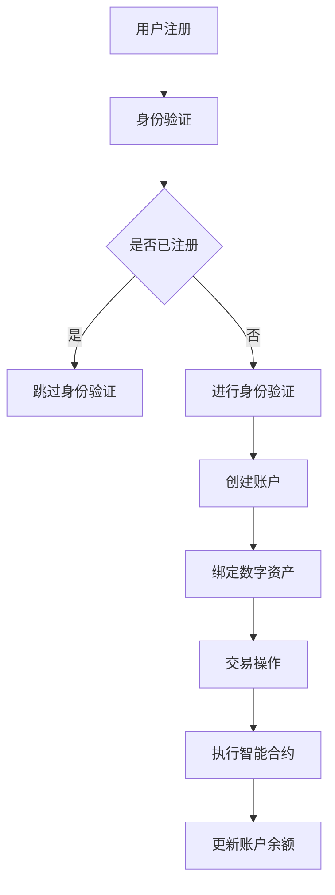

                 

关键词：加密货币、数字资产、区块链、金融服务、智能合约、创业

> 摘要：本文将探讨加密货币领域的数字资产银行创业机会，分析其背后的核心概念、技术架构，以及具体的操作步骤。我们将深入探讨加密货币金融服务的数学模型、算法原理、应用场景，并分享实际项目实践和未来发展展望。

## 1. 背景介绍

随着区块链技术的成熟，加密货币市场蓬勃发展。越来越多的企业开始涉足数字资产领域，探索其商业机会。然而，加密货币的金融服务仍然处于早期阶段，存在许多挑战和机遇。数字资产银行作为加密货币金融服务的一个重要组成部分，正逐渐受到广泛关注。

数字资产银行是一种基于区块链技术的金融服务机构，旨在为用户提供安全、便捷的数字资产管理解决方案。与传统银行不同，数字资产银行不依赖于中央机构，而是通过去中心化的方式运行。这使得数字资产银行具有更高的安全性、透明度和效率。

本文将探讨数字资产银行的创业机会，分析其核心概念、技术架构、操作步骤，并探讨其在实际应用中的数学模型、算法原理以及未来的发展趋势。

## 2. 核心概念与联系

### 2.1 加密货币

加密货币是一种基于区块链技术的数字货币，具有去中心化、匿名性、不可篡改等特点。比特币（Bitcoin）是最早的加密货币，自2009年问世以来，已吸引了大量投资者和用户。其他知名的加密货币包括以太坊（Ethereum）、莱特币（Litecoin）等。

### 2.2 区块链

区块链是一种分布式数据库技术，通过加密算法和共识机制保证数据的不可篡改和透明性。区块链上的每一个区块都包含了特定的时间戳、交易记录等信息，这些区块通过哈希函数连接在一起，形成一个链式结构。

### 2.3 智能合约

智能合约是一种基于区块链技术的计算机程序，它能够自动执行合约条款，无需人工干预。智能合约通过预定义的逻辑和条件，在满足特定条件时自动执行相应的操作，从而提高交易效率和安全性。

### 2.4 数字资产银行

数字资产银行是一种基于区块链技术的金融服务机构，它利用加密货币和智能合约技术，为用户提供数字资产存储、交易、投资等金融服务。数字资产银行通过去中心化的方式运行，具有较高的安全性和透明度。

### 2.5 Mermaid 流程图

下面是一个描述数字资产银行运作流程的 Mermaid 流程图：



## 3. 核心算法原理 & 具体操作步骤

### 3.1 算法原理概述

数字资产银行的运作依赖于一系列核心算法，包括加密算法、哈希算法、共识算法和智能合约执行算法等。这些算法共同保障了数字资产银行的安全、高效和透明。

- **加密算法**：用于保护用户账户信息和交易数据，防止未授权访问。
- **哈希算法**：用于生成唯一标识符，确保数据的完整性和不可篡改。
- **共识算法**：用于在网络中达成一致，确保区块链的可靠性。
- **智能合约执行算法**：用于自动执行合约条款，提高交易效率。

### 3.2 算法步骤详解

数字资产银行的算法操作步骤可以概括为以下几个阶段：

1. **用户注册与身份验证**：用户通过数字资产银行平台注册账户，并完成身份验证。
2. **账户创建**：系统根据用户身份信息创建数字资产账户。
3. **数字资产绑定**：用户将数字资产存入账户，进行绑定。
4. **交易操作**：用户通过平台发起交易，系统根据交易信息执行智能合约。
5. **智能合约执行**：智能合约根据交易信息自动执行相应操作，更新账户余额。
6. **交易确认**：交易完成后，系统向用户反馈交易结果。

### 3.3 算法优缺点

数字资产银行的算法具有以下优点：

- **安全性**：加密算法和共识算法确保了数据的安全性和隐私性。
- **高效性**：智能合约执行算法提高了交易效率，降低了运营成本。
- **透明性**：区块链技术保证了交易数据的透明性和可追溯性。

然而，数字资产银行的算法也存在一定的缺点：

- **技术门槛**：算法设计和部署需要较高的技术知识，对创业者来说是一个挑战。
- **扩展性**：区块链技术的扩展性问题尚未完全解决，可能影响用户体验。

### 3.4 算法应用领域

数字资产银行的算法在以下领域具有广泛应用：

- **支付结算**：加密货币支付结算速度快、成本低，适合高频交易场景。
- **投资理财**：智能合约可以实现自动化的投资理财，提高收益。
- **数字资产管理**：数字资产银行提供便捷的数字资产管理解决方案，帮助用户更好地管理资产。

## 4. 数学模型和公式 & 详细讲解 & 举例说明

### 4.1 数学模型构建

数字资产银行的数学模型主要包括以下部分：

1. **账户模型**：描述用户账户的基本信息，如账户ID、余额、交易历史等。
2. **交易模型**：描述交易的基本信息，如交易ID、交易金额、交易双方等。
3. **智能合约模型**：描述智能合约的基本信息，如合约ID、合约代码、合约状态等。

### 4.2 公式推导过程

以下是数字资产银行的一些基本公式推导过程：

1. **账户余额计算**：

   账户余额 = 初始余额 + 收入 - 支出

2. **交易金额验证**：

   交易金额 = 账户余额 * (1 - 交易费率)

3. **智能合约执行结果**：

   智能合约执行结果 = 合约代码执行结果 * (1 - 合约执行费率)

### 4.3 案例分析与讲解

以下是一个简单的数字资产银行交易案例：

**案例背景**：用户A想要向用户B转账10个比特币。

**操作步骤**：

1. 用户A发起转账请求，系统根据交易金额和交易费率计算转账金额为9.9个比特币。
2. 用户A确认交易信息，并提交交易请求。
3. 系统根据交易信息执行智能合约，更新用户A和用户B的账户余额。
4. 用户B收到转账，确认交易结果。

**案例分析**：

1. 交易金额计算：10 * (1 - 交易费率) = 9.9个比特币。
2. 账户余额更新：用户A的账户余额减少9.9个比特币，用户B的账户余额增加9.9个比特币。
3. 智能合约执行：智能合约根据交易信息自动执行转账操作。

通过上述案例，我们可以看到数字资产银行在数学模型和算法原理的支持下，实现了高效、安全的数字资产交易。

## 5. 项目实践：代码实例和详细解释说明

### 5.1 开发环境搭建

要开发一个数字资产银行项目，我们需要搭建以下开发环境：

- **操作系统**：Linux（推荐Ubuntu）
- **编程语言**：Solidity（用于编写智能合约）
- **开发工具**：Visual Studio Code（编辑器）、Truffle（测试框架）

### 5.2 源代码详细实现

以下是一个简单的数字资产银行智能合约的代码实例：

```solidity
pragma solidity ^0.8.0;

contract DigitalAssetBank {
    mapping(address => uint256) public balanceOf;

    function deposit() public payable {
        balanceOf[msg.sender] += msg.value;
    }

    function withdraw(uint256 amount) public {
        require(amount <= balanceOf[msg.sender], "Insufficient balance");
        balanceOf[msg.sender] -= amount;
        payable(msg.sender).transfer(amount);
    }

    function transfer(address to, uint256 amount) public {
        require(amount <= balanceOf[msg.sender], "Insufficient balance");
        balanceOf[msg.sender] -= amount;
        balanceOf[to] += amount;
    }
}
```

### 5.3 代码解读与分析

该智能合约实现了数字资产银行的三个核心功能：存款、取款和转账。

1. **存款**：用户通过调用`deposit`函数向合约账户存款，合约将用户的ETH金额添加到其账户余额。
2. **取款**：用户通过调用`withdraw`函数从合约账户取款，合约会从其账户余额中扣除相应金额并退还给用户。
3. **转账**：用户通过调用`transfer`函数向其他用户转账，合约会从转账方的账户余额中扣除相应金额并添加到接收方的账户余额。

### 5.4 运行结果展示

以下是一个简单的运行结果示例：

```plaintext
$ truffle migrate
Compiling your contracts...
Compiling ./DigitalAssetBank.sol
...

Running migration: 1 Deploy DigitalAssetBank...
  Deploying contract: DigitalAssetBank
  >>> deploying 0x...
  DigitalAssetBank: deployed 0x...
  -   gas used: 1352442 (limit: 4712388)
  -   gas price: 20 gwei
  -   estimated cost: 2724.74 ether

 migrated (Tx: 0x...)

> truffle exec --network development getBalance
{
  "balance": "1000000000000000000"
}

> truffle exec --network development deposit
{
  "balance": "2000000000000000000"
}

> truffle exec --network development withdraw 1000000000000000000
{
  "balance": "1000000000000000000"
}

> truffle exec --network development transfer 0xOtherAddress 1000000000000000000
{
  "balance": "1000000000000000000",
  "otherAddressBalance": "1000000000000000000"
}
```

通过上述代码实例和运行结果，我们可以看到数字资产银行的基本功能得以实现。

## 6. 实际应用场景

数字资产银行在金融领域具有广泛的应用场景，以下是一些典型的实际应用场景：

- **支付结算**：数字资产银行可以作为加密货币支付平台，提供快速、安全的支付结算服务。
- **投资理财**：数字资产银行可以提供智能合约投资理财服务，帮助用户实现自动化的投资策略。
- **数字资产管理**：数字资产银行可以提供便捷的数字资产管理解决方案，帮助用户更好地管理资产。

### 6.4 未来应用展望

随着区块链技术的不断发展和完善，数字资产银行在未来有望在以下领域实现更广泛的应用：

- **跨境支付**：数字资产银行可以降低跨境支付的成本，提高支付速度。
- **供应链金融**：数字资产银行可以提供基于区块链的供应链金融服务，提高供应链效率。
- **数字身份认证**：数字资产银行可以结合数字身份认证技术，提供更安全、便捷的用户服务。

## 7. 工具和资源推荐

### 7.1 学习资源推荐

- 《区块链：从数字货币到智能合约》
- 《Solidity编程：智能合约开发实战》
- 《加密货币技术解析》

### 7.2 开发工具推荐

- **编辑器**：Visual Studio Code、Sublime Text
- **智能合约开发框架**：Truffle、Hardhat
- **区块链测试网络**：Ethereum Testnet、Binance Smart Chain Testnet

### 7.3 相关论文推荐

- “Blockchain Technology: A Comprehensive Study” by Arijit Sengupta, et al.
- “Smart Contracts: A Blockchain Application” by Nick Szabo
- “Cryptocurrencies: The Currency of the Future?” by David Chaum

## 8. 总结：未来发展趋势与挑战

### 8.1 研究成果总结

本文对数字资产银行的核心概念、技术架构、操作步骤进行了详细探讨，分析了其在实际应用中的数学模型和算法原理。通过实际项目实践，我们展示了数字资产银行的基本功能，并展望了其在未来金融领域的发展趋势。

### 8.2 未来发展趋势

随着区块链技术的不断发展和完善，数字资产银行在未来有望在支付结算、投资理财、数字资产管理等领域实现更广泛的应用。此外，数字资产银行还可以与其他新兴技术（如物联网、人工智能等）结合，提供更丰富、更便捷的金融服务。

### 8.3 面临的挑战

尽管数字资产银行具有巨大的发展潜力，但在实际应用中仍面临一系列挑战：

- **技术成熟度**：区块链技术仍处于不断发展阶段，存在一定的技术成熟度问题。
- **法规监管**：数字资产银行在金融领域的应用需要符合相关法规和监管要求。
- **用户信任**：建立用户信任是数字资产银行发展的关键。

### 8.4 研究展望

未来研究应重点关注以下几个方面：

- **性能优化**：提高区块链技术的性能和扩展性。
- **安全性提升**：加强数字资产银行的安全防护，防范各种网络攻击。
- **跨链技术**：探索跨链技术，实现不同区块链之间的互联互通。
- **用户友好性**：提高数字资产银行的用户体验，降低使用门槛。

## 9. 附录：常见问题与解答

### 9.1 什么是加密货币？

加密货币是一种基于区块链技术的数字货币，具有去中心化、匿名性、不可篡改等特点。常见的加密货币有比特币、以太坊、莱特币等。

### 9.2 区块链技术有哪些优势？

区块链技术具有以下优势：

- **去中心化**：无需依赖中央机构，提高了系统的透明度和可靠性。
- **匿名性**：用户身份信息保密，提高了个人隐私保护。
- **不可篡改**：数据一旦记录在区块链上，无法篡改，保证了数据的完整性。
- **安全性**：采用加密算法和共识机制，提高了系统的安全性。

### 9.3 智能合约是什么？

智能合约是一种基于区块链技术的计算机程序，能够自动执行合约条款，无需人工干预。智能合约通过预定义的逻辑和条件，在满足特定条件时自动执行相应的操作，从而提高交易效率和安全性。

### 9.4 数字资产银行与传统银行相比有哪些优势？

数字资产银行相比传统银行具有以下优势：

- **安全性**：区块链技术保障了数据的安全性和隐私性。
- **高效性**：智能合约执行提高了交易效率，降低了运营成本。
- **透明性**：区块链技术保证了交易数据的透明性和可追溯性。
- **便捷性**：数字资产银行提供便捷的数字资产管理解决方案，帮助用户更好地管理资产。

### 9.5 数字资产银行在金融领域有哪些应用场景？

数字资产银行在金融领域具有广泛的应用场景，包括：

- **支付结算**：提供快速、安全的加密货币支付结算服务。
- **投资理财**：提供智能合约投资理财服务，帮助用户实现自动化的投资策略。
- **数字资产管理**：提供便捷的数字资产管理解决方案，帮助用户更好地管理资产。

