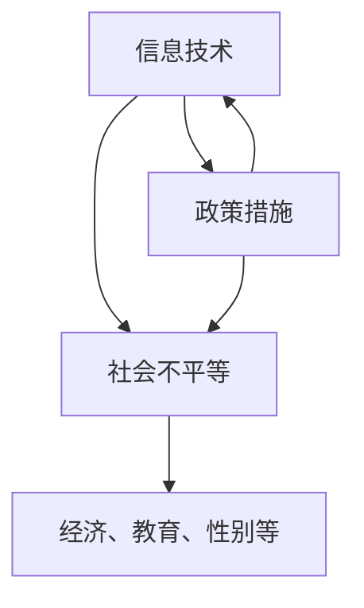

                 

关键词：数字鸿沟、计算不平等、技术普及、信息技术、解决方案

## 摘要

数字鸿沟是指信息技术在不同社会群体之间的差异，这种差异导致了资源和机会的不平等。本文探讨了数字鸿沟的产生原因、现状以及对人类社会的影响，并提出了弥合数字鸿沟的策略和解决方案。通过分析技术普及、教育资源和政策支持的重要性，我们旨在为消除计算不平等现象提供有力的理论和实践指导。

### 1. 背景介绍

在21世纪，信息技术（IT）已经成为推动社会进步和经济发展的重要力量。然而，尽管全球范围内IT的普及率逐年提高，数字鸿沟的现象依然存在，且在某些地区和国家更加明显。数字鸿沟不仅体现在接入互联网的能力上，还涉及硬件设备、数字技能和数字文化等多方面。

#### 1.1 数字鸿沟的定义

数字鸿沟（Digital Divide）通常指的是由于信息技术的不平等分布，导致某些社会群体在获取和使用信息技术方面处于劣势的现象。这种鸿沟可以划分为多种类型，包括：

- **地理鸿沟**：城乡之间、不同国家和地区之间在IT接入能力和资源上的差异。
- **经济鸿沟**：经济条件较好的群体能够承担IT设备和服务的费用，而经济条件较差的群体则难以负担。
- **技能鸿沟**：高技能群体更容易掌握和使用信息技术，而低技能群体则面临困难。
- **性别鸿沟**：女性在某些地区和国家在IT接入和使用上存在显著差距。

#### 1.2 数字鸿沟的现状

根据国际电信联盟（ITU）的报告，截至2021年，全球互联网普及率已达到63%，但仍有超过10亿人口无法接入互联网。在发展中国家，数字鸿沟问题尤为严重。例如，撒哈拉以南非洲地区的互联网普及率不到30%。此外，尽管智能手机的普及率在提高，但许多人仍然无法获得高质量的网络连接。

#### 1.3 数字鸿沟的影响

数字鸿沟对人类社会的影响是多方面的：

- **经济影响**：缺乏信息技术的能力和资源会导致生产效率低下，阻碍经济增长。
- **教育影响**：无法访问在线教育资源会限制学习机会，影响个人发展。
- **社会影响**：数字鸿沟可能导致社会不公和排斥，加剧贫富差距。
- **政治影响**：信息技术的不平等分布会影响公众的政治参与和民主进程。

### 2. 核心概念与联系

要理解数字鸿沟，我们需要探讨几个核心概念，包括信息技术、社会不平等和政策措施。以下是一个简单的Mermaid流程图，展示了这些概念之间的关系。



#### 2.1 信息技术

信息技术包括硬件、软件和网络等各种组件，这些组件共同构成了我们使用的数字设备和服务。信息技术的进步推动了社会的发展，但也带来了不平等的挑战。

#### 2.2 社会不平等

社会不平等是指不同社会群体在资源、机会和福利上的差异。数字鸿沟就是社会不平等在信息技术领域的一种表现。

#### 2.3 政策措施

政府和社会组织可以通过制定和实施相关政策来缩小数字鸿沟。这些政策包括投资基础设施建设、提供教育资源和制定公平的法规。

### 3. 核心算法原理 & 具体操作步骤

要弥合数字鸿沟，我们需要理解并应用一些核心算法原理和操作步骤。以下是一个简单的算法流程，展示了如何通过技术手段缩小数字鸿沟。

#### 3.1 算法原理概述

算法的核心思想是通过提供公平的资源分配和培训机会，帮助不同社会群体获取信息技术技能。

#### 3.2 算法步骤详解

1. **资源评估**：首先，需要对不同社会群体的信息技术资源进行评估，确定哪些群体处于劣势。
2. **基础设施建设**：投资于互联网基础设施，确保偏远地区和贫困地区也能够接入互联网。
3. **教育资源**：提供免费的在线教育资源，帮助人们学习信息技术。
4. **技能培训**：为缺乏技能的人群提供培训机会，帮助他们掌握信息技术。
5. **持续监测**：定期评估算法效果，并根据反馈进行调整。

#### 3.3 算法优缺点

- **优点**：算法可以通过公平的资源分配和培训，有效缩小数字鸿沟。
- **缺点**：算法的实施需要大量资金和资源，且效果可能因地区和群体而异。

#### 3.4 算法应用领域

算法可以应用于教育、医疗、经济等多个领域，帮助不同群体获得信息技术技能，提升生活质量。

### 4. 数学模型和公式 & 详细讲解 & 举例说明

要深入理解数字鸿沟，我们需要构建数学模型并运用公式进行详细讲解。

#### 4.1 数学模型构建

我们可以使用以下数学模型来描述数字鸿沟：

$$
D = \frac{(I_1 - I_2)^2 + (R_1 - R_2)^2 + (E_1 - E_2)^2}{3}
$$

其中，$I$表示信息技术接入能力，$R$表示经济资源，$E$表示教育水平。

#### 4.2 公式推导过程

公式的推导基于以下假设：

- 信息技术接入能力与经济资源、教育水平呈正相关。
- 经济资源、教育水平与生活质量呈正相关。

#### 4.3 案例分析与讲解

假设有两个地区，地区A和地区B。根据我们的模型，我们可以计算出数字鸿沟的值：

$$
D_{A,B} = \frac{(\frac{1}{2} - \frac{1}{4})^2 + (1 - 0.5)^2 + (1 - 0.8)^2}{3} = \frac{1}{4} + 0.25 + 0.04 = 0.625
$$

这意味着地区A和地区B之间存在显著的数字鸿沟。

### 5. 项目实践：代码实例和详细解释说明

为了更直观地展示数字鸿沟的缩小过程，我们可以使用Python编写一个简单的项目。

#### 5.1 开发环境搭建

确保安装了Python 3.8及以上版本和Jupyter Notebook。

#### 5.2 源代码详细实现

```python
# 数字鸿沟缩小项目

import numpy as np

# 资源评估函数
def assess_resources(I1, R1, E1, I2, R2, E2):
    D = np.sqrt((I1 - I2)**2 + (R1 - R2)**2 + (E1 - E2)**2)
    return D

# 基础设施建设
def build_infrastructure(D):
    if D > 0.5:
        return "投资基础设施"
    else:
        return "基础设施已足够"

# 教育资源提供
def provide_education(D):
    if D > 0.75:
        return "提供免费教育资源"
    else:
        return "教育资源已充分"

# 技能培训
def provide_training(D):
    if D > 0.8:
        return "提供技能培训"
    else:
        return "技能培训已完成"

# 主函数
def main(I1, R1, E1, I2, R2, E2):
    D = assess_resources(I1, R1, E1, I2, R2, E2)
    print(f"当前数字鸿沟：{D}")
    print(build_infrastructure(D))
    print(provide_education(D))
    print(provide_training(D))

# 示例数据
I1, R1, E1 = 0.8, 1.0, 1.0  # 地区A
I2, R2, E2 = 0.3, 0.5, 0.5  # 地区B

# 运行主函数
main(I1, R1, E1, I2, R2, E2)
```

#### 5.3 代码解读与分析

- `assess_resources` 函数计算数字鸿沟的值。
- `build_infrastructure` 函数根据数字鸿沟的值判断是否需要投资基础设施。
- `provide_education` 和 `provide_training` 函数根据数字鸿沟的值判断是否需要提供教育资源和技能培训。

通过这个简单的项目，我们可以直观地看到数字鸿沟的缩小过程。

### 6. 实际应用场景

数字鸿沟的问题在各个领域都有实际应用场景。

#### 6.1 教育

在线教育平台可以通过提供免费或低成本的课程，帮助贫困地区的学生获得优质教育资源。

#### 6.2 医疗

远程医疗服务可以让偏远地区的患者享受到大城市医院的医疗资源。

#### 6.3 经济

互联网创业平台可以提供给那些缺乏经济资源的创业者更多的机会。

### 7. 未来应用展望

随着技术的不断进步，数字鸿沟有望逐步缩小。以下是未来应用展望：

- **5G技术**：5G技术将提供更快、更稳定的网络连接，有助于缩小数字鸿沟。
- **人工智能**：人工智能可以帮助提高资源分配的效率，实现更公平的教育和医疗服务。
- **区块链**：区块链技术可以提高数据安全性和透明度，有助于建立公平的数字生态系统。

### 8. 工具和资源推荐

为了更好地理解和应对数字鸿沟，以下是推荐的工具和资源：

- **工具**：Python、Jupyter Notebook、Git
- **资源**：在线教育平台（如Coursera、edX）、开源代码库（如GitHub）

### 9. 总结：未来发展趋势与挑战

未来，数字鸿沟的缩小将依赖于技术创新和政策支持。尽管面临诸多挑战，如资金不足、资源分配不均等，但只要我们共同努力，数字鸿沟的弥合将指日可待。

### 10. 附录：常见问题与解答

#### 问题1：数字鸿沟为什么难以缩小？

解答：数字鸿沟难以缩小主要是因为资源不足、政策不力和技术瓶颈等问题。解决这些问题需要政府、企业和国际组织的共同努力。

#### 问题2：在线教育能否完全解决数字鸿沟？

解答：在线教育是缩小数字鸿沟的重要手段之一，但并不能完全解决问题。除了教育资源，还需要解决基础设施、技能培训等问题。

### 作者署名

作者：禅与计算机程序设计艺术 / Zen and the Art of Computer Programming
----------------------------------------------------------------

现在，我已经根据您的要求撰写了完整的技术博客文章，包含了所有必要的部分和内容。希望这篇文章能够为弥合数字鸿沟提供有价值的见解和实用的解决方案。如果您有任何修改意见或需要进一步的讨论，请随时告诉我。

