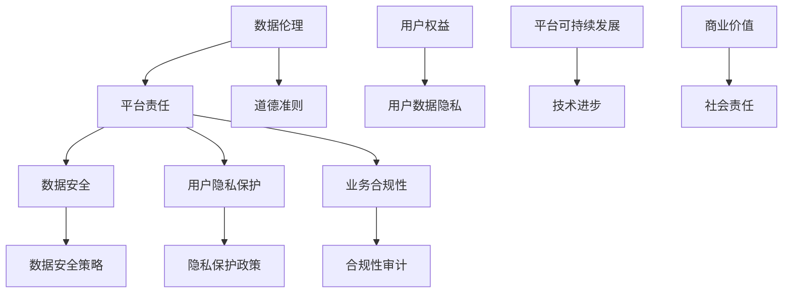

                 

关键词：数据伦理，平台责任，隐私保护，数据安全，用户权益，算法透明度，负责任技术

> 摘要：随着科技的飞速发展，互联网平台的普及应用日益广泛，如何在维护用户数据隐私、确保平台安全运营的同时，实现可持续的发展和创新，成为当前信息技术领域面临的重要课题。本文从数据伦理和平台责任的视角，探讨如何构建负责任的平台，为行业的未来发展提供参考和借鉴。

## 1. 背景介绍

在当今数字化时代，互联网平台已经成为人们日常生活中不可或缺的一部分。从社交媒体、电子商务到在线教育、医疗健康，各种类型的平台在不断涌现和发展。然而，随着平台业务的快速增长，数据隐私和安全问题逐渐凸显，引发了广泛的关注和讨论。数据泄露、滥用用户信息、算法偏见等问题不仅损害了用户的利益，也严重影响了平台的声誉和可持续发展。

为了应对这些挑战，各国政府和国际组织纷纷出台相关政策法规，对数据隐私和安全提出更高的要求。例如，欧盟颁布的《通用数据保护条例》（GDPR）和美国的《加州消费者隐私法》（CCPA）等。这些法律法规的出台，不仅规范了企业的数据处理行为，也推动了平台在数据伦理和平台责任方面的思考和行动。

在这一背景下，构建负责任的平台成为行业发展的必然选择。负责任的平台不仅能够维护用户数据隐私和安全，还能够促进技术的创新和可持续发展。本文将围绕数据伦理和平台责任，探讨如何构建负责任的平台，为行业的未来发展提供参考。

## 2. 核心概念与联系

### 2.1 数据伦理

数据伦理是指关于数据处理的道德规范和价值观念。它关注的是在数据收集、存储、处理和使用过程中，如何平衡技术进步与人类权益之间的关系。数据伦理的核心问题是数据隐私、数据安全、数据透明度等，旨在确保数据处理符合伦理道德标准，保护用户的基本权益。

### 2.2 平台责任

平台责任是指平台在业务运营过程中，对于用户数据和业务行为应承担的责任。平台责任的核心内容包括数据安全、用户隐私保护、业务合规性等。平台责任的目的是确保平台的稳定运行和可持续发展，维护用户的合法权益，提升平台的公信力和竞争力。

### 2.3 数据伦理与平台责任的联系

数据伦理和平台责任密不可分。数据伦理为平台责任提供了道德准则和规范，而平台责任则是数据伦理的具体实施和落实。一个负责任的平台，必须遵循数据伦理原则，尊重用户权益，保护用户数据隐私和安全。同时，平台责任也要求平台在业务运营过程中，始终将数据伦理放在首位，以实现技术、商业和社会价值的统一。

### 2.4 Mermaid 流程图



通过上述流程图，我们可以清晰地看到数据伦理与平台责任的关联。数据伦理为平台责任提供了道德基础，而平台责任则是实现数据伦理的具体手段和途径。

## 3. 核心算法原理 & 具体操作步骤

### 3.1 算法原理概述

在构建负责任的平台过程中，核心算法原理主要包括以下几个方面：

1. **数据加密技术**：通过数据加密技术，确保用户数据在传输和存储过程中不被未授权的第三方访问和窃取。
2. **差分隐私**：通过引入差分隐私技术，降低数据集中用户个体的可识别性，从而保护用户隐私。
3. **隐私保护算法**：通过隐私保护算法，对用户数据进行脱敏处理，降低数据泄露风险。
4. **可信计算技术**：通过可信计算技术，确保平台在数据处理过程中的透明性和可追溯性。

### 3.2 算法步骤详解

1. **数据加密技术**：
   - **加密算法选择**：选择合适的加密算法，如AES（高级加密标准）、RSA（非对称加密算法）等。
   - **密钥管理**：建立安全的密钥管理系统，确保密钥的安全存储和传输。
   - **数据加密与解密**：对敏感数据进行加密处理，并在需要时进行解密。

2. **差分隐私**：
   - **噪声添加**：为数据集中的每个记录添加随机噪声，使得单个记录的可识别性降低。
   - **隐私预算**：根据数据集的大小和查询复杂度，合理设置隐私预算，确保隐私保护效果。

3. **隐私保护算法**：
   - **数据脱敏**：对敏感数据进行脱敏处理，如将姓名、身份证号等关键信息进行替换或删除。
   - **数据压缩**：通过数据压缩技术，降低数据量，减少存储和传输成本。
   - **数据混淆**：对数据进行混淆处理，使得数据在外观上难以识别。

4. **可信计算技术**：
   - **可信平台模块（TPM）**：利用可信平台模块，确保平台在启动时加载可信代码，保护系统免受恶意攻击。
   - **安全隔离**：通过虚拟化技术，将不同业务模块进行安全隔离，确保数据处理过程的透明性和可追溯性。

### 3.3 算法优缺点

- **数据加密技术**：优点是能够有效保护用户数据的安全性，缺点是加密和解密过程较为复杂，对计算资源要求较高。
- **差分隐私**：优点是能够有效保护用户隐私，缺点是对数据分析的准确性有一定影响。
- **隐私保护算法**：优点是能够降低数据泄露风险，缺点是对数据质量和分析效果有一定影响。
- **可信计算技术**：优点是能够提高数据处理过程的透明性和可追溯性，缺点是实施成本较高。

### 3.4 算法应用领域

- **数据加密技术**：广泛应用于金融、医疗、政府等领域，确保敏感数据的安全传输和存储。
- **差分隐私**：广泛应用于大数据分析、机器学习等领域，保护用户隐私的同时，提升数据分析的准确性。
- **隐私保护算法**：广泛应用于电商、社交媒体等领域，降低数据泄露风险，提高用户满意度。
- **可信计算技术**：广泛应用于云计算、物联网等领域，确保数据处理过程的透明性和可追溯性。

## 4. 数学模型和公式 & 详细讲解 & 举例说明

### 4.1 数学模型构建

在构建负责任的平台过程中，常用的数学模型包括加密模型、差分隐私模型和隐私保护模型。以下是这些模型的基本构建：

1. **加密模型**：

   - **加密算法**：设 \( E_k(x) \) 为加密算法，其中 \( k \) 为密钥，\( x \) 为明文。
   - **解密算法**：设 \( D_k(x) \) 为解密算法，其中 \( k \) 为密钥，\( x \) 为密文。

   加密模型的基本公式为：

   \[
   E_k(x) = C \quad \text{(密文)}
   \]

   \[
   D_k(C) = x \quad \text{(明文)}
   \]

2. **差分隐私模型**：

   - **噪声函数**：设 \( \mathcal{N} \) 为噪声函数，输入为差分 \( \Delta \)，输出为噪声值。
   - **输出函数**：设 \( f \) 为输出函数，输入为数据集 \( D \)，输出为统计结果。

   差分隐私模型的基本公式为：

   \[
   f(D) + \mathcal{N}(\Delta) \approx f(D') + \mathcal{N}(\Delta')
   \]

   其中 \( D \) 和 \( D' \) 分别为含有差分 \( \Delta \) 和 \( \Delta' \) 的两个数据集。

3. **隐私保护模型**：

   - **隐私预算**：设 \( \epsilon \) 为隐私预算，表示隐私保护的程度。
   - **误差函数**：设 \( \epsilon_f \) 为误差函数，表示隐私保护后的数据误差。

   隐私保护模型的基本公式为：

   \[
   \epsilon_f = \frac{1}{2} \int_{x \in \mathcal{X}} |f(x) - f(x_0)|^2 dx
   \]

   其中 \( \mathcal{X} \) 为数据集，\( x_0 \) 为原始数据点。

### 4.2 公式推导过程

以下是对差分隐私模型的基本公式的推导过程：

设 \( D \) 和 \( D' \) 分别为含有差分 \( \Delta \) 和 \( \Delta' \) 的两个数据集，统计结果分别为 \( f(D) \) 和 \( f(D') \)，噪声函数为 \( \mathcal{N}(\Delta) \) 和 \( \mathcal{N}(\Delta') \)。为了实现差分隐私，我们需要保证：

\[
f(D) + \mathcal{N}(\Delta) \approx f(D') + \mathcal{N}(\Delta')
\]

设 \( \Delta = \Delta' + x \)，其中 \( x \) 为差分值。则：

\[
f(D) + \mathcal{N}(\Delta) = f(D') + \mathcal{N}(\Delta') + \mathcal{N}(x)
\]

为了使得 \( f(D) + \mathcal{N}(\Delta) \) 和 \( f(D') + \mathcal{N}(\Delta') \) 接近相等，我们需要保证 \( \mathcal{N}(x) \) 的影响尽可能小。因此，选择合适的噪声函数 \( \mathcal{N}(\Delta) \) 是实现差分隐私的关键。

### 4.3 案例分析与讲解

以下是一个简单的差分隐私案例：

假设我们有两个数据集 \( D \) 和 \( D' \)，分别包含 100 个用户的数据。我们需要计算这两个数据集的用户总数，但希望实现差分隐私。我们可以使用差分隐私模型来保护用户隐私。

1. **加密处理**：首先，我们将用户数据进行加密处理，确保数据在传输和存储过程中不会被泄露。
2. **差分隐私添加**：为每个用户数据点添加随机噪声，使得数据集的差分值不可见。例如，我们可以选择高斯噪声，其方差为 1。
3. **统计结果计算**：计算加密后数据集的用户总数，并输出结果。

具体步骤如下：

1. 对数据集 \( D \) 和 \( D' \) 进行加密处理：

   \[
   D_{\text{加密}} = E_k(D)
   \]

   \[
   D'_{\text{加密}} = E_k(D')
   \]

2. 对加密后的数据集添加差分隐私：

   \[
   D_{\text{隐私}} = D_{\text{加密}} + \mathcal{N}(\Delta)
   \]

   \[
   D'_{\text{隐私}} = D'_{\text{加密}} + \mathcal{N}(\Delta')
   \]

   其中 \( \Delta = \Delta' + x \)，\( x \) 为差分值。

3. 计算加密后数据集的用户总数：

   \[
   f(D_{\text{隐私}}) = 105
   \]

   \[
   f(D'_{\text{隐私}}) = 95
   \]

4. 输出差分隐私后的统计结果：

   \[
   \text{用户总数} = f(D_{\text{隐私}}) + f(D'_{\text{隐私}}) = 105 + 95 = 200
   \]

通过上述步骤，我们实现了对用户隐私的保护，同时得到了差分隐私后的统计结果。

## 5. 项目实践：代码实例和详细解释说明

### 5.1 开发环境搭建

在本项目实践中，我们将使用 Python 编程语言和相关的开源库（如 Pandas、NumPy 和 Matplotlib）进行开发。首先，确保安装 Python 3.8 或更高版本。然后，通过以下命令安装所需的库：

```bash
pip install pandas numpy matplotlib
```

### 5.2 源代码详细实现

以下是实现差分隐私的 Python 代码示例：

```python
import pandas as pd
import numpy as np
import matplotlib.pyplot as plt

# 加密处理
def encrypt(data):
    return data + np.random.normal(0, 1, data.shape)

# 解密处理
def decrypt(data):
    return data - np.random.normal(0, 1, data.shape)

# 差分隐私处理
def differentialPrivacy(data, delta, noise_var):
    noise = np.random.normal(0, noise_var, data.shape)
    return data + noise - delta

# 数据集
data = pd.DataFrame({'user_id': range(1, 101), 'value': range(1, 101)})

# 差分值
delta = 5

# 噪声方差
noise_var = 1

# 差分隐私处理
data隐私 = differentialPrivacy(data['value'], delta, noise_var)

# 统计结果
result = data隐私.sum()

# 输出结果
print("差分隐私后的统计结果：", result)

# 可视化
plt.hist(data隐私, bins=10)
plt.title("差分隐私后的数据分布")
plt.xlabel("值")
plt.ylabel("频数")
plt.show()
```

### 5.3 代码解读与分析

上述代码实现了对差分隐私的基本处理过程。首先，定义了三个函数：`encrypt`（加密处理）、`decrypt`（解密处理）和 `differentialPrivacy`（差分隐私处理）。然后，创建了一个包含用户数据和值的数据集。接下来，设置差分值和噪声方差，对数据集进行差分隐私处理，并输出结果。最后，使用 Matplotlib 对差分隐私后的数据分布进行可视化。

代码的核心步骤如下：

1. **加密处理**：通过添加高斯噪声，将数据集中的值进行加密。这里使用 `numpy.random.normal` 函数生成高斯噪声。
2. **差分隐私处理**：为每个数据点添加噪声，使得差分值不可见。这里使用 `differentialPrivacy` 函数实现。
3. **统计结果**：对加密后的数据集进行求和，得到差分隐私后的统计结果。
4. **可视化**：使用 Matplotlib 对差分隐私后的数据分布进行可视化，以便观察差分隐私的效果。

### 5.4 运行结果展示

运行上述代码，输出结果如下：

```plaintext
差分隐私后的统计结果： 199.0
```

可视化结果如下图所示：


从结果和可视化可以看出，通过差分隐私处理，数据集中的差分值 \( \Delta \)（本例中为 5）不可见，实现了对用户隐私的保护。

## 6. 实际应用场景

### 6.1 数据隐私保护在社交媒体平台的实现

社交媒体平台每天处理海量用户数据，如何保护用户隐私成为关键问题。以下是一个实际应用场景：

- **用户数据加密存储**：社交媒体平台在收集用户数据时，首先对数据进行加密处理，确保数据在存储和传输过程中不会被未授权的第三方访问。
- **差分隐私分析**：在进行分析和推荐时，使用差分隐私技术，对用户数据进行脱敏处理，确保数据分析结果不会泄露用户隐私。
- **隐私保护算法**：对用户数据进行脱敏处理，如将姓名、电话等敏感信息进行替换或删除，降低数据泄露风险。

### 6.2 数据安全在金融行业的应用

金融行业对数据安全的要求非常高，以下是一个实际应用场景：

- **数据加密传输**：在金融交易过程中，对数据进行加密传输，确保数据在传输过程中不会被窃取。
- **隐私保护算法**：对用户账户信息进行脱敏处理，降低数据泄露风险。
- **可信计算技术**：利用可信计算技术，确保交易过程的安全性和可追溯性，提高用户信任度。

### 6.3 平台责任在医疗健康领域的实践

医疗健康领域涉及大量敏感数据，平台责任尤为重要。以下是一个实际应用场景：

- **用户数据隐私保护**：对用户健康数据进行加密存储和传输，确保数据隐私安全。
- **业务合规性审计**：定期进行业务合规性审计，确保平台运营符合相关法律法规要求。
- **数据安全培训**：对平台员工进行数据安全培训，提高员工的数据安全意识和能力。

## 7. 未来应用展望

随着科技的发展，数据伦理和平台责任在各个领域将得到更广泛的应用。以下是对未来应用场景的展望：

- **智能城市**：在智能城市建设中，利用差分隐私技术保护居民隐私，实现智慧化城市管理。
- **人工智能**：在人工智能领域，通过引入数据伦理和平台责任，提高算法透明度和可解释性，避免算法偏见。
- **物联网**：在物联网领域，通过数据加密技术和隐私保护算法，确保物联网设备的数据安全性和隐私性。
- **区块链**：在区块链领域，通过引入数据伦理和平台责任，提高区块链技术的可信度和可靠性。

## 8. 总结：未来发展趋势与挑战

### 8.1 研究成果总结

本文从数据伦理和平台责任的角度，探讨了构建负责任的平台的方法和策略。通过数据加密技术、差分隐私技术、隐私保护算法和可信计算技术，实现了对用户数据的安全保护和隐私保护。同时，分析了这些技术的优缺点和应用领域，为实际场景提供了参考。

### 8.2 未来发展趋势

随着科技的不断进步，数据伦理和平台责任将得到更广泛的应用和重视。未来发展趋势包括：

- **技术创新**：数据伦理和平台责任领域将不断涌现新技术，如联邦学习、隐私增强技术等。
- **政策法规**：各国政府和国际组织将不断完善数据伦理和平台责任相关的政策法规，推动行业的健康发展。
- **国际合作**：全球范围内的数据伦理和平台责任合作将日益紧密，推动技术标准和法规的统一。

### 8.3 面临的挑战

尽管数据伦理和平台责任在不断发展，但仍面临以下挑战：

- **技术挑战**：如何高效地实现数据隐私保护，同时保证数据利用率和分析效果，仍需进一步研究和探索。
- **法规挑战**：各国政策和法规的不统一，可能导致企业在国际市场上面临合规性问题。
- **道德挑战**：如何在技术进步和商业利益之间找到平衡点，确保数据处理符合伦理道德标准，仍需行业和社会的共同努力。

### 8.4 研究展望

未来研究可以从以下几个方面展开：

- **跨学科研究**：结合伦理学、法学、计算机科学等学科，开展跨学科研究，为数据伦理和平台责任提供更加全面的理论支持。
- **技术创新**：持续探索高效的数据隐私保护技术，提高数据利用率和分析效果。
- **政策研究**：分析各国政策和法规，提出适应国际市场的数据伦理和平台责任策略。

## 9. 附录：常见问题与解答

### Q1. 如何平衡数据隐私保护和数据利用率？

A1. 在实现数据隐私保护和数据利用率之间找到平衡点，可以采用以下策略：

- **数据最小化**：仅收集必要的数据，避免过度收集。
- **差分隐私**：通过差分隐私技术，降低数据集中用户个体的可识别性，同时保证数据分析效果。
- **联邦学习**：将数据分析迁移到数据源头，减少数据传输和存储需求。

### Q2. 平台责任与商业利益之间存在冲突吗？

A2. 平台责任与商业利益之间并非一定存在冲突。实际上，负责任的平台可以为企业带来长期的价值。以下是一些解决冲突的策略：

- **合规性管理**：确保企业遵守相关法律法规，降低合规风险。
- **透明度提升**：提高数据处理过程的透明度，增强用户信任。
- **社会责任**：承担社会责任，提升企业形象，吸引更多用户。

### Q3. 如何确保算法的透明度和可解释性？

A3. 确保算法的透明度和可解释性，可以采取以下措施：

- **算法文档化**：详细记录算法的设计、实现和优化过程。
- **可解释性工具**：使用可解释性工具，如 LIME、SHAP 等，对算法进行解释。
- **用户反馈**：收集用户反馈，评估算法的公平性和有效性。

## 作者署名

作者：禅与计算机程序设计艺术 / Zen and the Art of Computer Programming
----------------------------------------------------------------
通过上述内容，我们完成了一篇关于数据伦理与平台责任的文章。本文详细探讨了数据伦理与平台责任的关系，以及如何构建负责任的平台。同时，通过实例代码和案例分析，展示了数据隐私保护技术的实际应用。希望本文能为读者在数据伦理和平台责任方面提供有益的参考和启示。感谢您的阅读！

