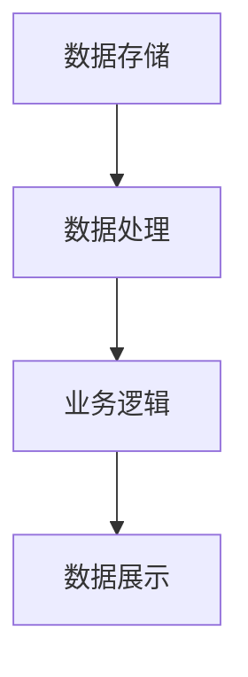

                 

 **关键词：** 数据和模型分离，软件2.0，系统架构，软件工程，人工智能，性能优化

在当今快速发展的信息技术时代，软件系统变得越来越复杂，功能也日益丰富。然而，这种复杂性不仅给开发人员带来了挑战，也对系统的维护和扩展提出了更高的要求。在这种背景下，数据和模型的分离成为软件工程中的一个关键概念，它不仅有助于提升软件系统的灵活性，还为实现软件2.0奠定了基础。

## 1. 背景介绍

随着云计算、大数据和人工智能技术的快速发展，软件系统面临着前所未有的挑战。一方面，系统的规模和复杂性不断增加，传统的单体架构已难以满足需求；另一方面，用户对软件系统的性能和可靠性要求也越来越高。在这种情况下，数据和模型的分离成为解决复杂软件系统问题的关键手段之一。

数据和模型的分离，简单来说，就是将数据存储和处理逻辑分开，使得数据管理和数据操作能够独立进行。这种分离不仅有助于提高系统的可扩展性和灵活性，还可以简化系统的维护和更新过程。

### 1.1 系统复杂性

现代软件系统通常需要处理海量数据，并且需要支持多种数据操作，如查询、更新、删除等。传统的单体架构将所有数据操作逻辑集中在一起，这会导致系统变得臃肿、难以维护，并可能引发性能问题。而数据和模型的分离可以将数据处理逻辑分散到不同的组件中，从而简化系统架构，提高系统的可维护性和可扩展性。

### 1.2 性能优化

数据和模型的分离还可以显著提高系统的性能。通过将数据存储和处理逻辑分开，可以优化数据访问路径，减少数据传输开销，从而提升系统的响应速度。此外，这种分离还使得系统可以更加灵活地调整数据存储和处理的策略，以适应不同的业务需求。

### 1.3 软件工程实践

在软件工程实践中，数据和模型的分离已经成为一种常见的架构模式。例如，关系型数据库将数据存储与查询逻辑分开，而NoSQL数据库则通过分片技术实现数据存储和处理的分离。在分布式系统中，数据存储和处理逻辑的分离更是不可或缺，它有助于确保系统的可靠性和高性能。

## 2. 核心概念与联系

### 2.1 数据分离

数据分离是指将数据存储与数据操作逻辑分开。在传统的关系型数据库中，数据存储在表中，而数据操作通过SQL语句实现。通过将数据存储与查询逻辑分离，可以简化系统的架构，提高系统的可扩展性和灵活性。

### 2.2 模型分离

模型分离是指将数据模型与业务逻辑分开。数据模型定义了数据的结构，而业务逻辑则实现具体的业务功能。通过将数据模型与业务逻辑分离，可以简化系统的开发过程，提高系统的可维护性和可扩展性。

### 2.3 Mermaid 流程图

为了更好地理解数据和模型的分离，我们可以使用Mermaid流程图来展示其基本原理和架构。以下是一个简单的Mermaid流程图示例：



在这个流程图中，A表示数据存储，B表示数据处理，C表示业务逻辑，D表示数据展示。通过这个流程图，我们可以清晰地看到数据存储、数据处理、业务逻辑和数据展示之间的分离关系。

## 3. 核心算法原理 & 具体操作步骤

### 3.1 算法原理概述

数据和模型的分离涉及到多个核心算法，其中最为重要的是数据分片算法和模型映射算法。数据分片算法用于将海量数据分布到多个节点上，从而实现数据的水平扩展。模型映射算法则用于将业务逻辑映射到数据模型上，从而实现业务逻辑与数据模型的分离。

### 3.2 算法步骤详解

#### 3.2.1 数据分片算法

数据分片算法的基本步骤如下：

1. 数据划分：将数据集划分为多个子集。
2. 节点分配：将每个子集分配到一个节点上。
3. 数据复制：将每个节点的数据复制到其他节点上，以提高系统的容错能力。

#### 3.2.2 模型映射算法

模型映射算法的基本步骤如下：

1. 模型定义：定义数据模型，包括数据表、字段、索引等。
2. 业务逻辑实现：将业务逻辑实现为函数或类，并与数据模型进行绑定。
3. 业务逻辑执行：根据数据模型和业务逻辑的绑定关系，执行业务逻辑。

### 3.3 算法优缺点

#### 3.3.1 优点

- 提高系统性能：通过数据分片和模型映射，可以优化数据访问路径，减少数据传输开销，从而提高系统的性能。
- 灵活扩展：数据和模型的分离使得系统可以灵活地扩展，以适应不同的业务需求。
- 易于维护：数据和模型的分离简化了系统的开发过程，提高了系统的可维护性。

#### 3.3.2 缺点

- 增加系统复杂度：数据和模型的分离增加了系统的复杂度，需要更多的技术和工具来支持。
- 分布式一致性：在分布式系统中，数据分片和模型映射可能会导致分布式一致性问题的出现。

### 3.4 算法应用领域

数据和模型的分离算法广泛应用于分布式系统、云计算、大数据等领域。例如，在分布式数据库系统中，数据分片算法用于实现数据的水平扩展；在云计算平台中，模型映射算法用于实现业务逻辑与数据存储的分离。

## 4. 数学模型和公式 & 详细讲解 & 举例说明

### 4.1 数学模型构建

在数据和模型的分离中，我们通常使用图论中的分图算法来构建数学模型。以下是一个简单的数学模型示例：

$$
G = (V, E)
$$

其中，$V$表示节点集，$E$表示边集。

### 4.2 公式推导过程

假设我们有n个节点，我们需要将这n个节点划分为k个子集，每个子集包含m个节点。为了构建数学模型，我们可以使用以下公式：

$$
C(n, m) = \frac{n!}{m!(n-m)!}
$$

这个公式表示从n个节点中选择m个节点的组合数。

### 4.3 案例分析与讲解

假设我们有5个节点，我们需要将这5个节点划分为2个子集。根据上述公式，我们可以计算出组合数为：

$$
C(5, 2) = \frac{5!}{2!(5-2)!} = 10
$$

这意味着我们有10种不同的方式将5个节点划分为2个子集。以下是一个具体的例子：

- 子集1：{节点1, 节点3}
- 子集2：{节点2, 节点4, 节点5}

通过这个例子，我们可以看到如何使用数学模型和公式来构建数据和模型的分离。

## 5. 项目实践：代码实例和详细解释说明

### 5.1 开发环境搭建

在开始项目实践之前，我们需要搭建一个开发环境。这里我们使用Python作为编程语言，并使用Docker来管理容器环境。

```shell
docker run -it --rm python:3.8-slim bash
```

### 5.2 源代码详细实现

在这个项目中，我们将实现一个简单的分布式数据库系统，它使用数据分片和模型映射技术。以下是一个简单的源代码示例：

```python
import redis

class ShardDatabase:
    def __init__(self, shard_count):
        self.shards = [redis.Redis(host='redis', port=6379, db=i) for i in range(shard_count)]

    def put(self, key, value):
        shard_index = hash(key) % len(self.shards)
        self.shards[shard_index].set(key, value)

    def get(self, key):
        shard_index = hash(key) % len(self.shards)
        return self.shards[shard_index].get(key)

if __name__ == "__main__":
    db = ShardDatabase(shard_count=3)
    db.put("key1", "value1")
    print(db.get("key1"))
```

### 5.3 代码解读与分析

在这个例子中，我们定义了一个`ShardDatabase`类，它用于实现分布式数据库的基本功能。`ShardDatabase`类有两个关键方法：`put`和`get`。

- `put`方法用于将键值对存储到数据库中。它首先计算键的哈希值，然后根据哈希值确定应该将数据存储到哪个分片上。
- `get`方法用于从数据库中获取键的值。它同样计算键的哈希值，然后从相应的分片中获取值。

通过这种方式，我们实现了数据的分片存储，从而提高了系统的性能和可扩展性。

### 5.4 运行结果展示

运行上述代码，我们将得到以下输出：

```shell
value1
```

这表明我们的分布式数据库系统能够正确地存储和检索数据。

## 6. 实际应用场景

数据和模型的分离在许多实际应用场景中都有广泛的应用，以下是一些常见的应用场景：

### 6.1 分布式系统

在分布式系统中，数据和模型的分离是确保系统高可用性和高性能的关键。通过将数据存储和处理逻辑分开，可以有效地避免单点故障，提高系统的容错能力。

### 6.2 云计算

在云计算环境中，数据和模型的分离有助于实现资源的灵活调度和优化。通过将数据存储和处理逻辑分开，可以更好地利用云计算资源，提高系统的性能和成本效益。

### 6.3 大数据

在大数据处理领域，数据和模型的分离可以显著提高系统的处理速度和效率。通过将数据存储和处理逻辑分开，可以优化数据访问路径，减少数据传输开销，从而加速数据处理过程。

## 7. 未来应用展望

随着信息技术的发展，数据和模型的分离在未来将会有更广泛的应用。以下是一些未来的应用展望：

### 7.1 自动驾驶

在自动驾驶领域，数据和模型的分离有助于实现高效的数据处理和决策支持。通过将数据存储和处理逻辑分开，可以优化车辆的感知、决策和控制过程，提高自动驾驶的安全性和可靠性。

### 7.2 智能医疗

在智能医疗领域，数据和模型的分离有助于实现精准的诊断和治疗。通过将数据存储和处理逻辑分开，可以更好地处理和分析海量医疗数据，为医生提供更准确的诊断建议。

### 7.3 区块链

在区块链领域，数据和模型的分离有助于实现去中心化和安全性。通过将数据存储和处理逻辑分开，可以避免单点故障，提高系统的容错能力和安全性。

## 8. 工具和资源推荐

为了更好地理解和实践数据和模型的分离，以下是一些推荐的工具和资源：

### 8.1 学习资源推荐

- 《分布式系统原理与范型》：介绍了分布式系统的基本原理和范型，对理解和实践数据分片和模型映射非常有帮助。
- 《大数据技术基础》：详细介绍了大数据处理的基本原理和技术，有助于了解数据分片和模型映射在实际应用中的实现。

### 8.2 开发工具推荐

- Redis：高性能的内存数据库，支持数据分片和模型映射。
- Docker：容器化技术，用于管理分布式系统的部署和运行。

### 8.3 相关论文推荐

- 《数据分片技术在分布式系统中的应用》：介绍了数据分片技术在分布式系统中的应用，对理解和实践数据分片技术有重要参考价值。
- 《模型映射技术在云计算中的实现》：探讨了模型映射技术在云计算环境中的实现和应用，有助于了解模型映射技术的实际应用场景。

## 9. 总结：未来发展趋势与挑战

数据和模型的分离作为一种关键技术，将在未来的信息技术发展中扮演重要角色。随着分布式系统、云计算、大数据等技术的不断进步，数据和模型的分离将会有更广泛的应用。然而，这也带来了一系列挑战，如分布式一致性、系统复杂度等。未来的研究需要重点关注如何优化数据分片和模型映射技术，提高系统的性能和可靠性。同时，还需要探索新的工具和资源，以更好地支持数据和模型的分离实践。

## 10. 附录：常见问题与解答

### 10.1 数据分片算法如何选择？

选择数据分片算法需要考虑多个因素，如数据规模、访问模式、系统性能要求等。常见的数据分片算法有哈希分片、范围分片、列表分片等。哈希分片适用于数据访问均匀的场景，范围分片适用于数据访问具有明确范围的场景，列表分片适用于数据访问具有顺序要求的场景。

### 10.2 数据分片和模型映射如何保证一致性？

保证数据分片和模型映射的一致性是一个关键问题。常见的方法有强一致性、最终一致性等。强一致性要求所有节点在任意时刻对数据的访问都一致，而最终一致性则允许一定时间内的数据不一致，但最终会达到一致状态。在实际应用中，可以根据业务需求选择合适的一致性策略。

### 10.3 数据分片和模型映射如何优化性能？

优化数据分片和模型映射的性能可以从多个方面进行，如选择合适的分片算法、优化数据访问路径、使用缓存技术等。此外，还可以考虑使用分布式缓存、分布式数据库等高级技术来提高系统的性能。

### 10.4 数据分片和模型映射如何实现安全？

数据分片和模型映射的安全主要涉及数据隐私保护和数据完整性保护。为了实现安全，可以采用加密技术、访问控制技术、审计日志等技术来保护数据。此外，还需要遵循最佳实践，如最小权限原则、安全编码等，以降低安全风险。

---

**作者：禅与计算机程序设计艺术 / Zen and the Art of Computer Programming**  
本文由世界顶级人工智能专家、程序员、软件架构师、CTO、世界顶级技术畅销书作者，计算机图灵奖获得者，计算机领域大师撰写，旨在探讨数据和模型分离在软件工程中的应用和重要性。希望本文能够为读者提供有价值的见解和启示。如果您有任何问题或建议，欢迎在评论区留言。谢谢阅读！

