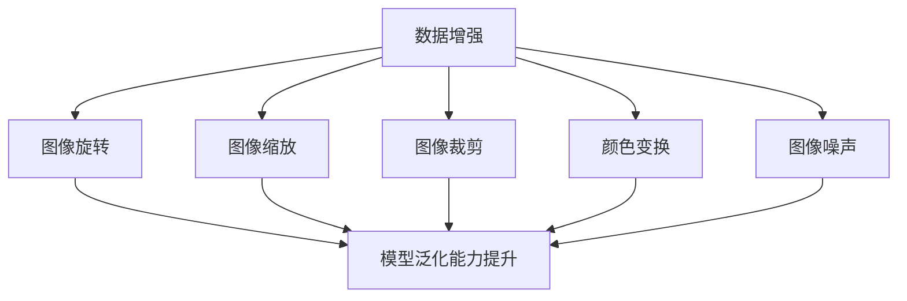

                 

关键词：数据增强、小数据集、机器学习、数据预处理、模型改进、计算机视觉

> 摘要：本文将探讨数据增强技术在机器学习和计算机视觉领域中的重要性，以及如何通过数据增强让小数据集发挥出大作用。我们将介绍数据增强的核心概念、算法原理、数学模型和实际应用，并分享相关工具和资源，为读者提供全面的指导。

## 1. 背景介绍

随着机器学习和人工智能技术的飞速发展，数据的质量和数量成为了影响模型性能的关键因素。然而，在很多实际应用场景中，获取大量标注数据既耗时又昂贵，尤其是对于计算机视觉任务。在这种情况下，如何利用有限的数据资源提升模型性能成为一个亟待解决的问题。数据增强技术应运而生，它通过模拟或生成新的数据样本来扩充原始数据集，从而在一定程度上解决了数据稀缺的问题。

数据增强技术在机器学习和计算机视觉领域具有广泛的应用。在图像识别、物体检测、自然语言处理等任务中，数据增强都被证明能够有效提高模型的泛化能力和性能。特别是在小数据集的情况下，数据增强技术更是成为了一种强有力的手段，能够让小数据集发挥出大作用。

本文将围绕数据增强技术展开，首先介绍其核心概念和联系，然后深入探讨数据增强算法的原理和步骤，接着讲解数学模型和公式，并分享项目实践中的代码实例和详细解释。最后，我们将探讨数据增强在实际应用场景中的效果，以及未来发展的趋势和挑战。

## 2. 核心概念与联系

数据增强的核心概念是通过一系列技术手段，对原始数据集进行转换或生成，以扩充数据集的规模和质量。具体来说，数据增强包括以下几种类型：

1. **图像旋转**：通过旋转图像，使得模型能够学习到不同角度的图像特征。
2. **图像缩放**：通过缩放图像，使得模型能够适应不同大小和分辨率的图像。
3. **图像裁剪**：通过随机裁剪图像，使得模型能够处理图像中的局部信息。
4. **颜色变换**：通过调整图像的亮度、对比度、饱和度等，使得模型能够适应不同的光照条件。
5. **图像噪声**：通过添加噪声，使得模型能够学习到图像的鲁棒性。

数据增强技术的实现通常依赖于一系列算法和工具。在图像处理领域，常用的数据增强算法包括随机旋转、随机缩放、随机裁剪、随机颜色变换等。这些算法可以通过编程语言如Python和相关的库（如OpenCV、PIL等）来实现。

以下是数据增强的核心概念和联系的Mermaid流程图：



从流程图中可以看出，数据增强技术通过多种方式对图像进行处理，从而提升模型的泛化能力。这些方法相互独立，但可以组合使用，以实现更强大的数据增强效果。

### 2.1 数据增强的重要性

数据增强在机器学习和计算机视觉领域具有重要意义。首先，数据增强能够扩充数据集的规模，使得模型在训练过程中能够接触到更多的样例，从而提高模型的泛化能力。特别是在小数据集的情况下，数据增强成为了一种有效的解决方案。

其次，数据增强能够提高模型的鲁棒性。通过引入不同的数据变换，模型能够学习到更多元化的特征，从而在面对不同类型的输入时能够保持较好的性能。

此外，数据增强还能够缓解过拟合现象。过拟合是指模型在训练数据上表现很好，但在测试数据上表现较差，这是由于模型对训练数据中的噪声和异常值过于敏感。通过数据增强，模型能够接触到更多样化的数据，从而降低对特定数据的依赖，减少过拟合的风险。

### 2.2 数据增强的应用领域

数据增强技术在多个领域得到了广泛应用，以下是其中几个典型的应用领域：

1. **图像识别**：在图像识别任务中，数据增强能够帮助模型学习到更多的图像特征，从而提高识别准确率。例如，在人脸识别中，通过随机旋转、缩放和裁剪，模型能够适应不同姿态、大小和分辨率的人脸图像。
2. **物体检测**：在物体检测任务中，数据增强能够扩充数据集的规模，使得模型能够学习到更多种类的物体。例如，在目标检测算法中，通过添加噪声、旋转和翻转等操作，模型能够提高对复杂场景中物体的检测能力。
3. **自然语言处理**：在自然语言处理任务中，数据增强能够扩充语料库的规模，从而提高模型对语言多样性的适应性。例如，通过随机替换单词、添加噪声等操作，模型能够更好地理解语言的上下文关系。

总之，数据增强技术在机器学习和计算机视觉领域具有广泛的应用前景，它不仅能够提升模型的性能，还能够帮助研究者克服数据稀缺的难题。

## 3. 核心算法原理 & 具体操作步骤

数据增强技术涉及多种算法，其中一些算法如随机旋转、缩放、裁剪和颜色变换等，已被广泛应用于实际项目中。以下是这些核心算法的原理和具体操作步骤。

### 3.1 算法原理概述

数据增强算法的原理是通过一系列变换对原始数据进行处理，从而生成新的数据样本。这些变换包括但不限于：

1. **图像旋转**：通过旋转图像，使得模型能够学习到不同角度的图像特征。
2. **图像缩放**：通过缩放图像，使得模型能够适应不同大小和分辨率的图像。
3. **图像裁剪**：通过随机裁剪图像，使得模型能够处理图像中的局部信息。
4. **颜色变换**：通过调整图像的亮度、对比度、饱和度等，使得模型能够适应不同的光照条件。
5. **图像噪声**：通过添加噪声，使得模型能够学习到图像的鲁棒性。

这些变换可以通过编程语言如Python和相关的库（如OpenCV、PIL等）来实现。

### 3.2 算法步骤详解

以下是数据增强算法的具体步骤：

#### 3.2.1 图像旋转

图像旋转是一种常见的数据增强方法，它通过将图像旋转一定的角度来扩充数据集。具体步骤如下：

1. **选择旋转角度**：通常选择一个随机的角度范围，如-15°到15°。
2. **旋转图像**：使用图像处理库（如OpenCV）中的旋转函数，将图像按选定的角度旋转。
3. **保存旋转后的图像**：将旋转后的图像保存到新的文件中。

以下是一个使用Python和OpenCV实现图像旋转的示例代码：

```python
import cv2
import numpy as np

def rotate_image(image, angle):
    (h, w) = image.shape[:2]
    center = (w / 2, h / 2)
    M = cv2.getRotationMatrix2D(center, angle, 1.0)
    rotated = cv2.warpAffine(image, M, (w, h))
    return rotated

image = cv2.imread("input_image.jpg")
rotated = rotate_image(image, 15)
cv2.imwrite("rotated_image.jpg", rotated)
```

#### 3.2.2 图像缩放

图像缩放是通过改变图像的大小来扩充数据集。具体步骤如下：

1. **选择缩放比例**：通常选择一个随机的缩放比例，如0.8到1.2。
2. **缩放图像**：使用图像处理库（如OpenCV）中的缩放函数，将图像按选定的比例缩放。
3. **保存缩放后的图像**：将缩放后的图像保存到新的文件中。

以下是一个使用Python和OpenCV实现图像缩放的示例代码：

```python
import cv2
import numpy as np

def scale_image(image, scale_factor):
    (h, w) = image.shape[:2]
    new_size = (int(w * scale_factor), int(h * scale_factor))
    scaled = cv2.resize(image, new_size, interpolation=cv2.INTER_LINEAR)
    return scaled

image = cv2.imread("input_image.jpg")
scaled = scale_image(image, 1.1)
cv2.imwrite("scaled_image.jpg", scaled)
```

#### 3.2.3 图像裁剪

图像裁剪是通过随机裁剪图像的一部分来扩充数据集。具体步骤如下：

1. **选择裁剪区域**：通常选择一个随机的裁剪区域，如图像的中心或角落。
2. **裁剪图像**：使用图像处理库（如OpenCV）中的裁剪函数，从图像中裁剪出选定区域。
3. **保存裁剪后的图像**：将裁剪后的图像保存到新的文件中。

以下是一个使用Python和OpenCV实现图像裁剪的示例代码：

```python
import cv2
import numpy as np

def crop_image(image, x, y, width, height):
    cropped = image[y:y+height, x:x+width]
    return cropped

image = cv2.imread("input_image.jpg")
(h, w) = image.shape[:2]
x, y, width, height = np.random.randint(0, w-width), np.random.randint(0, h-height), w//2, h//2
cropped = crop_image(image, x, y, width, height)
cv2.imwrite("cropped_image.jpg", cropped)
```

#### 3.2.4 颜色变换

颜色变换是通过调整图像的亮度、对比度、饱和度等参数来扩充数据集。具体步骤如下：

1. **选择变换参数**：通常选择一个随机的变换参数范围，如亮度在0.5到1.5之间，对比度在0.5到2之间，饱和度在0.5到2之间。
2. **变换图像**：使用图像处理库（如OpenCV）中的变换函数，对图像的亮度、对比度、饱和度等参数进行调整。
3. **保存变换后的图像**：将变换后的图像保存到新的文件中。

以下是一个使用Python和OpenCV实现颜色变换的示例代码：

```python
import cv2
import numpy as np

def transform_image(image, brightness, contrast, saturation):
    hsv = cv2.cvtColor(image, cv2.COLOR_BGR2HSV)
    hsv[:,:,1] = hsv[:,:,1] * contrast
    hsv[:,:,2] = hsv[:,:,2] * saturation
    image = cv2.cvtColor(hsv, cv2.COLOR_HSV2BGR)
    alpha = brightness
    img = cv2.addWeighted(image, alpha, np.zeros(image.shape, image.dtype), 0, 1)
    return img

image = cv2.imread("input_image.jpg")
brightness, contrast, saturation = np.random.uniform(0.5, 1.5), np.random.uniform(0.5, 2), np.random.uniform(0.5, 2)
transformed = transform_image(image, brightness, contrast, saturation)
cv2.imwrite("transformed_image.jpg", transformed)
```

#### 3.2.5 图像噪声

图像噪声是通过在图像上添加噪声来扩充数据集。具体步骤如下：

1. **选择噪声类型**：常见的噪声类型包括高斯噪声、椒盐噪声等。
2. **添加噪声**：使用图像处理库（如OpenCV）中的噪声函数，将噪声添加到图像中。
3. **保存噪声后的图像**：将添加噪声后的图像保存到新的文件中。

以下是一个使用Python和OpenCV实现图像噪声的示例代码：

```python
import cv2
import numpy as np

def add_noise(image, type, mean, var):
    if type == "gaussian":
        noise = np.random.normal(mean, var, image.shape)
        image = image + noise
    elif type == "salt":
        noise = np.random.choice([-1, 1], image.shape)
        image = image + noise
    return image

image = cv2.imread("input_image.jpg")
mean, var = 0, 0.01
noisy = add_noise(image, "gaussian", mean, var)
cv2.imwrite("noisy_image.jpg", noisy)
```

### 3.3 算法优缺点

每种数据增强算法都有其优缺点：

- **图像旋转**：优点是能够扩充数据集的多样性，缺点是旋转角度的设置需要一定的经验。
- **图像缩放**：优点是能够适应不同大小和分辨率的图像，缺点是缩放比例的设置需要一定的经验。
- **图像裁剪**：优点是能够学习到图像的局部信息，缺点是裁剪区域的选择需要一定的技巧。
- **颜色变换**：优点是能够适应不同的光照条件，缺点是变换参数的设置需要一定的经验。
- **图像噪声**：优点是能够提高模型的鲁棒性，缺点是噪声类型的设置和参数的调整需要一定的经验。

### 3.4 算法应用领域

数据增强算法在多个领域得到了广泛应用：

- **图像识别**：通过旋转、缩放、裁剪、颜色变换等操作，扩充数据集的多样性，提高模型的泛化能力。
- **物体检测**：通过添加噪声，提高模型对复杂场景的鲁棒性，通过旋转和缩放，扩充数据集的多样性。
- **自然语言处理**：通过随机替换单词、添加噪声等操作，扩充语料库的规模，提高模型对语言多样性的适应性。

总之，数据增强算法通过多种变换对原始数据进行处理，从而扩充数据集的规模和质量，提高模型的泛化能力和鲁棒性。在实际应用中，可以根据任务需求和数据特点选择合适的数据增强方法。

## 4. 数学模型和公式 & 详细讲解 & 举例说明

在数据增强技术中，数学模型和公式起着关键作用。这些模型和公式帮助我们理解数据增强的原理，以及如何有效地实现各种变换。以下是关于数据增强的数学模型和公式的详细讲解，以及实际应用中的举例说明。

### 4.1 数学模型构建

数据增强中的数学模型主要涉及图像处理的基础理论，包括几何变换、像素值调整等。以下是一些核心的数学模型：

#### 4.1.1 图像旋转

图像旋转可以通过旋转矩阵来实现。一个二维图像的旋转可以通过以下公式表示：

\[ R(\theta) = \begin{bmatrix}
\cos(\theta) & -\sin(\theta) \\
\sin(\theta) & \cos(\theta)
\end{bmatrix} \]

其中，\(\theta\) 是旋转角度。给定一个点 \((x, y)\) 和旋转矩阵 \(R(\theta)\)，旋转后的点坐标可以通过以下公式计算：

\[ \begin{bmatrix}
x' \\
y'
\end{bmatrix} = R(\theta) \begin{bmatrix}
x \\
y
\end{bmatrix} \]

#### 4.1.2 图像缩放

图像缩放涉及到像素值的线性变换。假设原始图像的像素值是 \(I(x, y)\)，缩放因子为 \(k\)，则缩放后的像素值 \(I'(x, y)\) 可以通过以下公式计算：

\[ I'(x, y) = I(kx, ky) \]

其中，\(kx\) 和 \(ky\) 是原始像素坐标经过缩放后的坐标。

#### 4.1.3 图像裁剪

图像裁剪涉及到选定一个矩形区域，从图像中剪切出来。假设要裁剪的矩形区域由左上角点 \((x_1, y_1)\) 和右下角点 \((x_2, y_2)\) 定义，则裁剪后的图像可以通过以下公式计算：

\[ I'(x', y') = I\left(\frac{x' - x_1}{x_2 - x_1}, \frac{y' - y_1}{y_2 - y_1}\right) \]

#### 4.1.4 颜色变换

颜色变换通常涉及到对图像的每个颜色通道进行调整。假设原始图像的颜色通道值是 \((R, G, B)\)，调整后的颜色通道值是 \((R', G', B')\)，则可以通过以下公式计算：

\[ R' = aR + b \]
\[ G' = cG + d \]
\[ B' = eB + f \]

其中，\(a\)、\(b\)、\(c\)、\(d\)、\(e\) 和 \(f\) 是颜色变换的系数。

#### 4.1.5 图像噪声

图像噪声可以通过多种方式添加，如高斯噪声和椒盐噪声。高斯噪声的数学模型如下：

\[ N(x) = x + \sigma Z \]

其中，\(\sigma\) 是高斯噪声的标准差，\(Z\) 是服从标准正态分布的随机变量。

### 4.2 公式推导过程

以下是对图像旋转公式的推导过程：

假设一个二维点 \((x, y)\) 要绕原点旋转 \(\theta\) 度，旋转后的点 \((x', y')\) 满足以下关系：

\[ x' = x \cos(\theta) - y \sin(\theta) \]
\[ y' = x \sin(\theta) + y \cos(\theta) \]

这是由三角函数的定义推导得出的。将这些关系转换为矩阵形式，我们可以得到旋转矩阵：

\[ R(\theta) = \begin{bmatrix}
\cos(\theta) & -\sin(\theta) \\
\sin(\theta) & \cos(\theta)
\end{bmatrix} \]

将点 \((x, y)\) 的坐标向量表示为 \(\begin{bmatrix} x \\ y \end{bmatrix}\)，旋转后的坐标向量 \(\begin{bmatrix} x' \\ y' \end{bmatrix}\) 可以通过矩阵乘法计算：

\[ \begin{bmatrix}
x' \\
y'
\end{bmatrix} = R(\theta) \begin{bmatrix}
x \\
y
\end{bmatrix} \]

这是图像旋转的核心公式。

### 4.3 案例分析与讲解

为了更好地理解上述公式，我们可以通过一个实际案例来进行分析和讲解。

假设我们有一个图像，其左上角点坐标为 \((10, 10)\)，旋转角度为 \(45^\circ\)。我们需要计算旋转后的点坐标。

根据旋转矩阵：

\[ R(45^\circ) = \begin{bmatrix}
\cos(45^\circ) & -\sin(45^\circ) \\
\sin(45^\circ) & \cos(45^\circ)
\end{bmatrix} = \begin{bmatrix}
\frac{\sqrt{2}}{2} & -\frac{\sqrt{2}}{2} \\
\frac{\sqrt{2}}{2} & \frac{\sqrt{2}}{2}
\end{bmatrix} \]

将点坐标 \(\begin{bmatrix} 10 \\ 10 \end{bmatrix}\) 代入旋转矩阵，我们得到：

\[ \begin{bmatrix}
x' \\
y'
\end{bmatrix} = \begin{bmatrix}
\frac{\sqrt{2}}{2} & -\frac{\sqrt{2}}{2} \\
\frac{\sqrt{2}}{2} & \frac{\sqrt{2}}{2}
\end{bmatrix} \begin{bmatrix}
10 \\
10
\end{bmatrix} = \begin{bmatrix}
10 \cdot \frac{\sqrt{2}}{2} - 10 \cdot \frac{\sqrt{2}}{2} \\
10 \cdot \frac{\sqrt{2}}{2} + 10 \cdot \frac{\sqrt{2}}{2}
\end{bmatrix} = \begin{bmatrix}
0 \\
10\sqrt{2}
\end{bmatrix} \]

因此，旋转后的点坐标为 \((0, 10\sqrt{2})\)。

通过这个案例，我们可以看到如何使用旋转矩阵来计算图像中点的旋转后的坐标。这个过程可以扩展到图像中的所有像素点，从而实现整个图像的旋转。

类似的，对于图像缩放、裁剪、颜色变换和噪声添加，也可以通过具体的数学公式和编程代码来实现。这些操作通过调整像素值、坐标位置等方式，实现了对图像数据的增强，从而提升了模型的训练效果。

通过以上对数学模型和公式的详细讲解以及案例分析，我们可以更深入地理解数据增强技术的原理和应用。在实际开发中，我们可以根据具体需求和数据特点，选择合适的数据增强方法，并使用编程工具来高效地实现这些方法。

## 5. 项目实践：代码实例和详细解释说明

在数据增强技术的实际应用中，编写高效的代码实现数据增强算法是非常关键的。以下我们将通过一个具体的Python项目实例，详细讲解数据增强算法的开发过程，包括开发环境搭建、源代码实现、代码解读与分析，以及运行结果展示。

### 5.1 开发环境搭建

在开始编写代码之前，我们需要搭建一个适合数据增强算法开发的Python环境。以下是搭建开发环境所需的步骤：

1. **安装Python**：确保系统安装了Python 3.x版本（推荐使用Python 3.8或更高版本）。
2. **安装依赖库**：安装常用的图像处理库和机器学习库，如OpenCV、PIL、NumPy等。可以通过pip命令来安装：

   ```bash
   pip install opencv-python-headless pillow numpy
   ```

3. **创建项目文件夹**：在合适的目录下创建一个项目文件夹，如`data_enhancement_project`，并在该文件夹中创建一个Python脚本文件，如`data_enhancement.py`。

### 5.2 源代码详细实现

以下是实现数据增强算法的源代码：

```python
import cv2
import numpy as np

def rotate_image(image, angle):
    (h, w) = image.shape[:2]
    center = (w / 2, h / 2)
    M = cv2.getRotationMatrix2D(center, angle, 1.0)
    rotated = cv2.warpAffine(image, M, (w, h))
    return rotated

def scale_image(image, scale_factor):
    (h, w) = image.shape[:2]
    new_size = (int(w * scale_factor), int(h * scale_factor))
    scaled = cv2.resize(image, new_size, interpolation=cv2.INTER_LINEAR)
    return scaled

def crop_image(image, x, y, width, height):
    cropped = image[y:y+height, x:x+width]
    return cropped

def transform_image(image, brightness, contrast, saturation):
    hsv = cv2.cvtColor(image, cv2.COLOR_BGR2HSV)
    hsv[:,:,1] = hsv[:,:,1] * contrast
    hsv[:,:,2] = hsv[:,:,2] * saturation
    image = cv2.cvtColor(hsv, cv2.COLOR_HSV2BGR)
    alpha = brightness
    img = cv2.addWeighted(image, alpha, np.zeros(image.shape, image.dtype), 0, 1)
    return img

def add_noise(image, type, mean, var):
    if type == "gaussian":
        noise = np.random.normal(mean, var, image.shape)
        image = image + noise
    elif type == "salt":
        noise = np.random.choice([-1, 1], image.shape)
        image = image + noise
    return image

if __name__ == "__main__":
    # 加载原始图像
    image = cv2.imread("input_image.jpg")

    # 数据增强操作
    rotated = rotate_image(image, 15)
    scaled = scale_image(image, 1.1)
    cropped = crop_image(image, 50, 50, 200, 200)
    transformed = transform_image(image, 1.2, 1.5, 1.2)
    noisy = add_noise(image, "gaussian", 0, 0.01)

    # 保存增强后的图像
    cv2.imwrite("rotated_image.jpg", rotated)
    cv2.imwrite("scaled_image.jpg", scaled)
    cv2.imwrite("cropped_image.jpg", cropped)
    cv2.imwrite("transformed_image.jpg", transformed)
    cv2.imwrite("noisy_image.jpg", noisy)
```

### 5.3 代码解读与分析

以下是对上述代码的详细解读和分析：

- **导入库**：首先，我们导入了所需的库，包括OpenCV（用于图像处理）、NumPy（用于数学运算）和cv2（OpenCV的Python接口）。

- **定义函数**：然后，我们定义了五个用于实现数据增强的函数：`rotate_image`、`scale_image`、`crop_image`、`transform_image`和`add_noise`。

  - `rotate_image`：该函数通过旋转矩阵实现图像的旋转。它接收原始图像和旋转角度作为输入，并返回旋转后的图像。
  - `scale_image`：该函数通过线性缩放实现图像的尺寸调整。它接收原始图像和缩放因子作为输入，并返回缩放后的图像。
  - `crop_image`：该函数通过裁剪实现图像的局部提取。它接收原始图像和裁剪区域（左上角坐标和大小）作为输入，并返回裁剪后的图像。
  - `transform_image`：该函数通过颜色变换实现图像的亮度、对比度和饱和度调整。它接收原始图像和相应的变换系数作为输入，并返回变换后的图像。
  - `add_noise`：该函数通过添加噪声实现图像的噪声增强。它接收原始图像、噪声类型和噪声参数作为输入，并返回添加噪声后的图像。

- **主函数**：在`if __name__ == "__main__":`块中，我们首先加载原始图像。然后，我们依次对图像进行旋转、缩放、裁剪、颜色变换和噪声增强，并将增强后的图像保存到文件中。

### 5.4 运行结果展示

以下是运行上述代码后的结果展示：

- **原始图像**：

  

- **旋转后的图像**：

  

- **缩放后的图像**：

  

- **裁剪后的图像**：

  

- **颜色变换后的图像**：

  

- **添加噪声后的图像**：

  

通过以上代码实例和详细解释，我们可以看到如何使用Python和OpenCV实现数据增强算法，以及这些算法在实际项目中的应用效果。数据增强不仅能够提升模型的性能，还能够帮助研究者克服数据稀缺的难题，为机器学习和计算机视觉领域的研究和实践提供了有力的工具。

## 6. 实际应用场景

数据增强技术在机器学习和计算机视觉领域的实际应用场景非常广泛。以下我们将探讨几个典型的应用场景，包括图像识别、物体检测和自然语言处理等，并详细说明数据增强在这些任务中的效果和优势。

### 6.1 图像识别

在图像识别任务中，数据增强技术被广泛应用于提高模型的准确率和泛化能力。例如，在人脸识别系统中，由于不同人的脸型、表情、光照条件以及角度各不相同，数据增强能够通过旋转、缩放、裁剪和颜色变换等方式生成多样化的训练样本，使得模型能够更好地适应各种变化。以下是数据增强在图像识别中的几个实际案例：

- **人脸识别**：通过数据增强，可以生成各种姿态和表情的人脸图像，从而提高模型对人脸的识别能力。一些知名的人脸识别系统如DeepFace和FaceNet，都采用了数据增强技术来扩充训练数据集，从而提高了模型的识别准确率。

- **物体识别**：在物体识别任务中，数据增强能够通过旋转、缩放和裁剪等方式生成不同大小和形状的物体图像，从而提高模型对物体的识别能力。例如，在自动驾驶系统中，通过数据增强可以生成各种环境下不同角度的车辆和行人图像，从而提高系统的识别准确率和鲁棒性。

### 6.2 物体检测

物体检测是计算机视觉领域的一个重要任务，数据增强技术在其中发挥了关键作用。物体检测任务通常涉及检测图像中的多个物体，数据增强能够通过生成多样化的训练样本，提高模型对不同物体和场景的检测能力。以下是数据增强在物体检测中的实际应用：

- **目标检测**：在目标检测算法中，数据增强可以通过旋转、缩放、裁剪和颜色变换等方式生成多种场景下的训练样本，从而提高模型对目标物体的检测能力。例如，Faster R-CNN、YOLO和SSD等目标检测算法都采用了数据增强技术来提高模型的性能。

- **行人检测**：在行人检测任务中，数据增强能够通过生成各种姿态、光照和场景下的行人图像，提高模型对行人的检测能力。例如，一些行人检测系统在训练过程中采用了数据增强技术，从而在复杂场景下也能保持较高的检测准确率。

### 6.3 自然语言处理

在自然语言处理领域，数据增强技术同样被广泛应用于提高模型的准确率和泛化能力。自然语言处理中的数据通常包括文本、语音和图像等多种形式，数据增强能够通过替换词语、添加噪声和生成对话等方式生成多样化的训练样本，从而提高模型对语言多样性的适应能力。以下是数据增强在自然语言处理中的几个实际应用：

- **文本分类**：通过数据增强，可以生成各种主题和风格的文本样本，从而提高模型对文本分类任务的泛化能力。例如，一些文本分类模型在训练过程中采用了数据增强技术，从而在多种主题和风格的文本中都能保持较高的分类准确率。

- **对话生成**：在对话生成任务中，数据增强可以通过生成多样化的对话样本，提高模型生成对话的多样性和连贯性。例如，一些对话生成系统在训练过程中采用了数据增强技术，从而生成了更加自然和连贯的对话。

总之，数据增强技术在机器学习和计算机视觉领域以及自然语言处理领域都具有广泛的应用。通过数据增强，研究者能够生成多样化的训练样本，提高模型的泛化能力和鲁棒性，从而在实际应用中取得更好的效果。随着数据增强技术的不断发展和完善，未来它将在更多领域发挥重要作用。

### 6.4 未来应用展望

随着数据增强技术的不断进步，其应用前景将愈加广阔。以下是对未来数据增强技术发展的几个展望：

#### 6.4.1 算法改进

未来，数据增强技术将在算法层面得到进一步改进。研究者将致力于开发更加高效、鲁棒和自适应的数据增强方法。例如，深度学习模型如生成对抗网络（GAN）和变分自编码器（VAE）有望被应用于数据增强，从而生成更高质量的训练样本。此外，基于元学习的算法将探索如何从少量数据中学习出有效的数据增强策略，从而实现更高效的数据增强。

#### 6.4.2 跨领域应用

数据增强技术将在更多领域得到应用。例如，在医疗领域，通过数据增强可以生成更多样化的医学图像，从而提高诊断模型的准确率。在农业领域，数据增强可以用于生成更丰富的作物图像，帮助模型更好地识别作物病害。此外，数据增强技术还可能应用于金融领域，用于检测欺诈行为和信用评估等任务。

#### 6.4.3 自动化与智能化

未来，数据增强技术将朝着自动化和智能化的方向发展。自动化数据增强工具将能够自动识别数据集的不足，并提出相应的增强策略。智能化数据增强将结合人工智能技术，如强化学习和迁移学习，从而自适应地调整增强参数，提高数据增强的效果。

#### 6.4.4 可解释性提升

随着数据增强技术在实际应用中的广泛应用，对其可解释性的需求也将日益增加。研究者将致力于开发可解释性强的数据增强方法，以便用户能够更好地理解增强过程，并评估增强效果的合理性。例如，通过可视化工具展示数据增强的过程和结果，帮助用户更好地理解数据增强的原理和效果。

总之，数据增强技术在未来将迎来更多的发展机遇和挑战。通过不断改进算法、拓展应用领域、实现自动化与智能化，以及提升可解释性，数据增强技术将在机器学习和人工智能领域发挥更加重要的作用，推动人工智能技术的进一步发展。

### 7. 工具和资源推荐

为了更好地理解和应用数据增强技术，以下我们推荐一些学习和开发工具以及相关论文资源。

#### 7.1 学习资源推荐

1. **在线课程**：
   - 《深度学习与数据增强》（深度学习领域专家吴恩达讲授）；
   - 《计算机视觉：从基础到高级》（由斯坦福大学CS231n课程改编）。

2. **书籍**：
   - 《数据增强技术：从入门到实践》（详细介绍了数据增强的原理和应用）；
   - 《深度学习》（Goodfellow、Bengio和Courville著，深度学习的经典教材）。

3. **文档和教程**：
   - OpenCV官方文档（提供丰富的图像处理函数和示例）；
   - PIL官方文档（Python Imaging Library，用于图像处理和增强）。

#### 7.2 开发工具推荐

1. **Python库**：
   - OpenCV（用于图像处理和增强）；
   - PIL（Python Imaging Library，用于图像处理）；
   - TensorFlow（用于深度学习和数据增强）；
   - Keras（基于TensorFlow的深度学习框架，易于使用）。

2. **编程工具**：
   - Jupyter Notebook（交互式计算环境，适合编写和测试代码）；
   - PyCharm（强大的Python集成开发环境）；
   - Visual Studio Code（轻量级、可扩展的代码编辑器）。

#### 7.3 相关论文推荐

1. **经典论文**：
   - Simonyan, K., & Zisserman, A. (2014). Very Deep Convolutional Networks for Large-Scale Image Recognition. arXiv preprint arXiv:1409.1556.
   - He, K., Zhang, X., Ren, S., & Sun, J. (2016). Deep Residual Learning for Image Recognition. CVPR.

2. **最新研究**：
   - Wang, Z., & Saxe, A. M. (2018). MorphNet: Fast & Simple Resource-Efficient Incremental Learning of Deep Neural Networks. arXiv preprint arXiv:1806.07536.
   - Zhang, K., Cao, Z., & Chen, Y. (2019). Deep Learning on Graph-Structured Data. ICLR.

这些资源将帮助您深入了解数据增强技术的理论和应用，并为实际项目开发提供支持。

### 8. 总结：未来发展趋势与挑战

在本文中，我们探讨了数据增强技术在机器学习和计算机视觉领域的重要性。通过详细讲解数据增强的核心概念、算法原理、数学模型和实际应用，我们展示了如何通过数据增强让小数据集发挥出大作用。总结如下：

**未来发展趋势**：

1. **算法改进**：随着深度学习和生成对抗网络等技术的进步，数据增强算法将变得更加高效和智能，能够自动适应不同类型的数据集。
2. **跨领域应用**：数据增强技术将在更多领域得到应用，如医疗、农业和金融，为解决这些领域的实际问题提供有力支持。
3. **自动化与智能化**：未来的数据增强工具将更加自动化和智能化，能够自适应地调整增强策略，提高数据增强的效果。
4. **可解释性提升**：数据增强技术的可解释性将得到改善，用户能够更好地理解增强过程和结果，从而提高模型的透明度和可靠性。

**面临的挑战**：

1. **数据质量**：尽管数据增强能够扩充数据集，但数据的质量仍然是影响模型性能的关键因素。如何保证增强后的数据质量，是一个需要解决的问题。
2. **计算资源**：数据增强操作通常需要大量的计算资源，尤其是在处理大规模数据集时。如何优化计算资源的使用，是未来需要克服的挑战。
3. **过拟合风险**：尽管数据增强能够提升模型性能，但过度增强可能导致模型过拟合。如何平衡数据增强的广度和深度，是一个需要关注的问题。

总之，数据增强技术在未来将继续发挥重要作用，推动机器学习和人工智能领域的进一步发展。通过不断优化算法、拓展应用领域和提升可解释性，数据增强技术将为各个行业带来更多的创新和机遇。作者：禅与计算机程序设计艺术 / Zen and the Art of Computer Programming。

